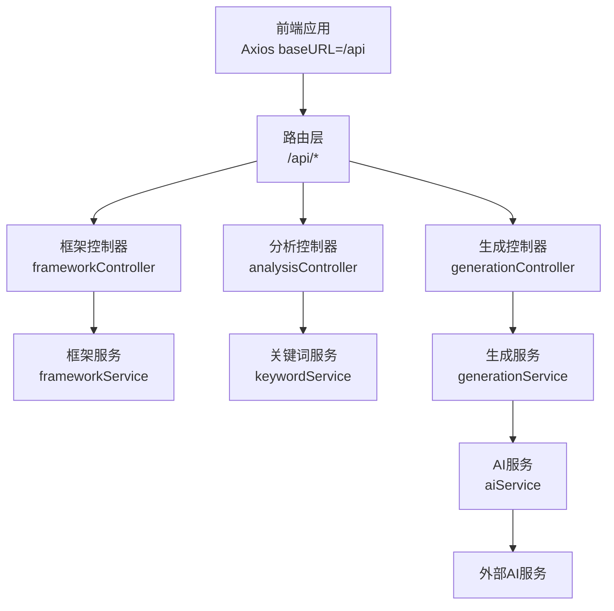
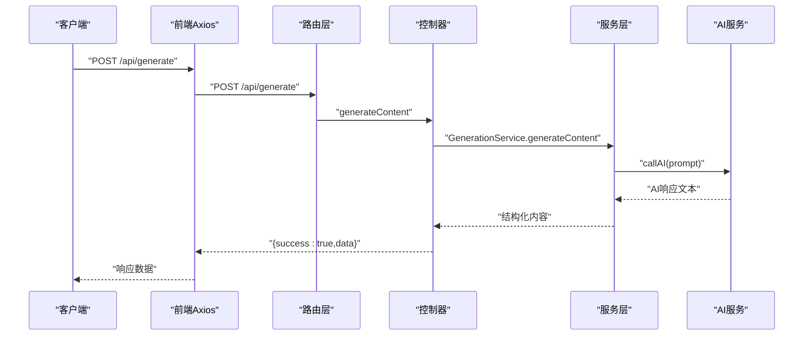
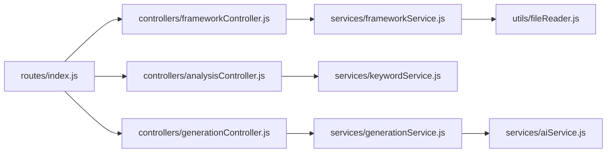

# API参考文档

<cite>
**本文引用的文件**
- [backend/src/app.js](file://backend/src/app.js)
- [backend/src/routes/index.js](file://backend/src/routes/index.js)
- [backend/src/controllers/frameworkController.js](file://backend/src/controllers/frameworkController.js)
- [backend/src/controllers/analysisController.js](file://backend/src/controllers/analysisController.js)
- [backend/src/controllers/generationController.js](file://backend/src/controllers/generationController.js)
- [backend/src/services/frameworkService.js](file://backend/src/services/frameworkService.js)
- [backend/src/services/keywordService.js](file://backend/src/services/keywordService.js)
- [backend/src/services/generationService.js](file://backend/src/services/generationService.js)
- [backend/src/services/aiService.js](file://backend/src/services/aiService.js)
- [backend/src/utils/fileReader.js](file://backend/src/utils/fileReader.js)
- [frontend/src/services/api.js](file://frontend/src/services/api.js)
- [小红书爆款框架.md](file://小红书爆款框架.md)
- [README.md](file://README.md)
</cite>

## 目录
1. [简介](#简介)
2. [项目结构](#项目结构)
3. [核心组件](#核心组件)
4. [架构总览](#架构总览)
5. [详细组件分析](#详细组件分析)
6. [依赖关系分析](#依赖关系分析)
7. [性能与可靠性](#性能与可靠性)
8. [故障排查指南](#故障排查指南)
9. [结论](#结论)
10. [附录](#附录)

## 简介
本API参考文档面向第三方集成与内部开发者，系统化说明小红书爆款文案生成工具的RESTful接口。文档覆盖：
- 接口列表与调用方式（HTTP方法、URL、请求/响应）
- 请求参数与响应数据结构
- 错误码与异常处理
- 身份验证与安全考虑
- 版本管理与速率限制策略
- 常见使用场景与最佳实践

## 项目结构
后端采用Express框架，路由统一挂载在 /api 前缀下；前端通过 /api 代理调用后端接口。

图表来源
- [backend/src/app.js](file://backend/src/app.js#L14-L20)
- [backend/src/routes/index.js](file://backend/src/routes/index.js#L9-L18)
- [backend/src/controllers/frameworkController.js](file://backend/src/controllers/frameworkController.js#L8-L21)
- [backend/src/controllers/analysisController.js](file://backend/src/controllers/analysisController.js#L6-L22)
- [backend/src/controllers/generationController.js](file://backend/src/controllers/generationController.js#L10-L33)
- [backend/src/services/frameworkService.js](file://backend/src/services/frameworkService.js#L9-L26)
- [backend/src/services/keywordService.js](file://backend/src/services/keywordService.js#L39-L67)
- [backend/src/services/generationService.js](file://backend/src/services/generationService.js#L63-L94)
- [backend/src/services/aiService.js](file://backend/src/services/aiService.js#L14-L44)

章节来源
- [backend/src/app.js](file://backend/src/app.js#L14-L20)
- [backend/src/routes/index.js](file://backend/src/routes/index.js#L9-L18)

## 核心组件
- 路由层：集中定义 /api 前缀下的各端点，映射至对应控制器。
- 控制器层：负责参数校验、调用服务层、封装统一响应结构。
- 服务层：实现业务逻辑，包括框架解析、关键词分析、内容生成与质量分析。
- 工具层：文件读取、AI调用等通用能力。
- 前端代理：Axios实例统一指向 /api，便于跨域与部署迁移。

章节来源
- [backend/src/routes/index.js](file://backend/src/routes/index.js#L9-L18)
- [backend/src/controllers/frameworkController.js](file://backend/src/controllers/frameworkController.js#L8-L21)
- [backend/src/controllers/analysisController.js](file://backend/src/controllers/analysisController.js#L6-L22)
- [backend/src/controllers/generationController.js](file://backend/src/controllers/generationController.js#L10-L33)
- [backend/src/services/frameworkService.js](file://backend/src/services/frameworkService.js#L9-L26)
- [backend/src/services/keywordService.js](file://backend/src/services/keywordService.js#L39-L67)
- [backend/src/services/generationService.js](file://backend/src/services/generationService.js#L63-L94)
- [backend/src/utils/fileReader.js](file://backend/src/utils/fileReader.js#L29-L45)
- [frontend/src/services/api.js](file://frontend/src/services/api.js#L8-L11)

## 架构总览
后端通过CORS允许指定来源，统一使用JSON请求体；前端通过 /api 代理调用后端接口，避免跨域问题。

图表来源
- [backend/src/app.js](file://backend/src/app.js#L14-L20)
- [backend/src/routes/index.js](file://backend/src/routes/index.js#L13-L15)
- [backend/src/controllers/generationController.js](file://backend/src/controllers/generationController.js#L10-L33)
- [backend/src/services/generationService.js](file://backend/src/services/generationService.js#L63-L94)
- [backend/src/services/aiService.js](file://backend/src/services/aiService.js#L14-L44)

## 详细组件分析

### 1) 框架查询接口
- GET /api/frameworks
  - 功能：获取所有可用框架的简要描述与匹配信息
  - 请求参数：无
  - 响应数据：success(bool)、data(array)
    - data[i].id(string)：框架标识
    - data[i].name(string)：框架名称（去除“框架”后缀）
    - data[i].title(string)：框架文档首标题
    - data[i].description(string)：摘要
    - data[i].fullContent(string)：框架文档全文
  - 示例：参见“使用示例与最佳实践”

- GET /api/frameworks/:name
  - 功能：按名称获取指定框架详情
  - 路径参数：name(string) —— 框架文件名（不含.md）
  - 响应：success(bool)、data(object) 或 404（未找到）
  - 示例：参见“使用示例与最佳实践”

章节来源
- [backend/src/routes/index.js](file://backend/src/routes/index.js#L11-L12)
- [backend/src/controllers/frameworkController.js](file://backend/src/controllers/frameworkController.js#L8-L21)
- [backend/src/controllers/frameworkController.js](file://backend/src/controllers/frameworkController.js#L23-L44)
- [backend/src/services/frameworkService.js](file://backend/src/services/frameworkService.js#L9-L26)
- [backend/src/services/frameworkService.js](file://backend/src/services/frameworkService.js#L39-L42)
- [backend/src/utils/fileReader.js](file://backend/src/utils/fileReader.js#L29-L45)

### 2) 关键词分析接口
- POST /api/analyze
  - 功能：分析关键词，返回意图、主题、受众与推荐框架
  - 请求体：keywords(string) —— 用户输入的关键词
  - 响应数据：success(bool)、data(object)
    - data.intent(string)：关键词意图
    - data.topic(string)：核心主题
    - data.targetAudience(string)：目标受众
    - data.recommendedFrameworks(array)：推荐框架列表
      - id(string)、name(string)、description(string)、matchScore(number)
  - 示例：参见“使用示例与最佳实践”

章节来源
- [backend/src/routes/index.js](file://backend/src/routes/index.js#L13)
- [backend/src/controllers/analysisController.js](file://backend/src/controllers/analysisController.js#L6-L22)
- [backend/src/services/keywordService.js](file://backend/src/services/keywordService.js#L39-L67)

### 3) 文案生成接口
- POST /api/generate
  - 功能：根据关键词与框架生成小红书图文内容
  - 请求体：keywords(string)、frameworkId(string)
  - 响应数据：success(bool)、data(object)
    - data.title(string)：标题（20-25字）
    - data.body(string)：正文（分段清晰，使用emoji增强可读性）
    - data.images(array)：图片数组
      - type(string)、description(string)、style(string)
    - data.tags(array)：话题标签（5个）
  - 示例：参见“使用示例与最佳实践”

- POST /api/generate/analysis
  - 功能：对已生成内容进行质量分析
  - 请求体：content(object)、frameworkId(string)
  - 响应数据：success(bool)、data(object)
    - data.hook(object)：钩子分析
      - type(string)、effectiveness(string)、reason(string)
    - data.framework(object)：框架分析
      - name(string)、strengths(array)、whyEffective(string)
    - data.structure(object)：结构分析
      - hasClearFlow(bool)、hasInteraction(bool)
    - data.appeal(object)：吸引力评分
      - emotionScore(number)、valueScore(number)、actionScore(number)、overallRating(string)、reason(string)
  - 示例：参见“使用示例与最佳实践”

章节来源
- [backend/src/routes/index.js](file://backend/src/routes/index.js#L14-L15)
- [backend/src/controllers/generationController.js](file://backend/src/controllers/generationController.js#L10-L33)
- [backend/src/controllers/generationController.js](file://backend/src/controllers/generationController.js#L35-L64)
- [backend/src/services/generationService.js](file://backend/src/services/generationService.js#L63-L94)
- [backend/src/services/generationService.js](file://backend/src/services/generationService.js#L114-L162)

### 4) 图片代理接口
- GET /api/proxy-image
  - 功能：解决前端下载跨域问题，后端代理下载图片并透传响应头
  - 查询参数：url(string) —— 目标图片URL
  - 响应：二进制流（图片），设置Content-Type与CORS头
  - 示例：参见“使用示例与最佳实践”

章节来源
- [backend/src/routes/index.js](file://backend/src/routes/index.js#L16)
- [backend/src/controllers/generationController.js](file://backend/src/controllers/generationController.js#L69-L94)

### 5) 统一响应与错误处理
- 成功响应：{ success: true, data: ... }
- 失败响应：{ success: false, error: string }
- 常见HTTP状态：
  - 400：缺少必要参数
  - 404：框架不存在
  - 500：服务内部错误或AI调用失败

章节来源
- [backend/src/controllers/frameworkController.js](file://backend/src/controllers/frameworkController.js#L28-L33)
- [backend/src/controllers/analysisController.js](file://backend/src/controllers/analysisController.js#L10-L15)
- [backend/src/controllers/generationController.js](file://backend/src/controllers/generationController.js#L14-L19)

### 6) 数据模型与结构
- 框架描述对象
  - id(string)、name(string)、title(string)、description(string)、fullContent(string)
- 关键词分析结果
  - intent(string)、topic(string)、targetAudience(string)、recommendedFrameworks(array)
- 生成内容
  - title(string)、body(string)、images(array)、tags(array)
- 质量分析
  - hook(object)、framework(object)、structure(object)、appeal(object)

章节来源
- [backend/src/services/frameworkService.js](file://backend/src/services/frameworkService.js#L18-L24)
- [backend/src/services/keywordService.js](file://backend/src/services/keywordService.js#L24-L36)
- [backend/src/services/generationService.js](file://backend/src/services/generationService.js#L24-L33)
- [backend/src/services/generationService.js](file://backend/src/services/generationService.js#L37-L60)

### 7) 身份验证与安全
- 身份验证：未实现专用认证机制，建议在网关或反向代理层添加鉴权（如Token校验、IP白名单、签名等）
- CORS：后端允许指定来源，默认允许本地开发端口
- 速率限制：未实现服务端限流，建议在网关层或反向代理层配置QPS/并发限制
- 安全建议：
  - 限制请求体大小
  - 对keywords/content进行敏感词过滤
  - 仅允许受信域名访问 /api
  - 记录审计日志，监控异常请求

章节来源
- [backend/src/app.js](file://backend/src/app.js#L14-L16)

### 8) API版本管理
- 当前路径：/api（未包含版本号）
- 建议：未来演进时在路径中加入版本前缀，如 /api/v1

章节来源
- [backend/src/app.js](file://backend/src/app.js#L20)

### 9) 速率限制
- 当前实现：未实现服务端限流
- 建议：在网关/反向代理层配置QPS、并发连接数限制，结合IP/用户维度进行配额管理

章节来源
- [backend/src/app.js](file://backend/src/app.js#L14-L16)

### 10) 使用示例与最佳实践
- 获取所有框架
  - GET /api/frameworks
  - 响应：success=true，data为框架数组
- 按名称获取框架
  - GET /api/frameworks/小红书爆款框架
  - 响应：success=true，data为框架详情
- 关键词分析
  - POST /api/analyze
  - 请求体：{ keywords: "夏季穿搭" }
  - 响应：包含推荐框架列表
- 生成内容
  - POST /api/generate
  - 请求体：{ keywords: "夏季穿搭", frameworkId: "小红书爆款框架" }
  - 响应：包含title/body/images/tags
- 质量分析
  - POST /api/generate/analysis
  - 请求体：{ content: { title, body, images, tags }, frameworkId: "小红书爆款框架" }
  - 响应：包含hook/framework/structure/appeal分析
- 图片代理
  - GET /api/proxy-image?url=图片URL
  - 响应：图片二进制流

章节来源
- [frontend/src/services/api.js](file://frontend/src/services/api.js#L13-L35)
- [backend/src/routes/index.js](file://backend/src/routes/index.js#L11-L16)

## 依赖关系分析

图表来源
- [backend/src/routes/index.js](file://backend/src/routes/index.js#L4-L7)
- [backend/src/controllers/frameworkController.js](file://backend/src/controllers/frameworkController.js#L6)
- [backend/src/controllers/analysisController.js](file://backend/src/controllers/analysisController.js#L4)
- [backend/src/controllers/generationController.js](file://backend/src/controllers/generationController.js#L7)
- [backend/src/services/frameworkService.js](file://backend/src/services/frameworkService.js#L7)
- [backend/src/utils/fileReader.js](file://backend/src/utils/fileReader.js#L6)
- [backend/src/services/keywordService.js](file://backend/src/services/keywordService.js#L2)
- [backend/src/services/generationService.js](file://backend/src/services/generationService.js#L1)
- [backend/src/services/aiService.js](file://backend/src/services/aiService.js#L3)

章节来源
- [backend/src/routes/index.js](file://backend/src/routes/index.js#L4-L7)
- [backend/src/controllers/frameworkController.js](file://backend/src/controllers/frameworkController.js#L6)
- [backend/src/controllers/analysisController.js](file://backend/src/controllers/analysisController.js#L4)
- [backend/src/controllers/generationController.js](file://backend/src/controllers/generationController.js#L7)
- [backend/src/services/frameworkService.js](file://backend/src/services/frameworkService.js#L7)
- [backend/src/utils/fileReader.js](file://backend/src/utils/fileReader.js#L6)
- [backend/src/services/keywordService.js](file://backend/src/services/keywordService.js#L2)
- [backend/src/services/generationService.js](file://backend/src/services/generationService.js#L1)
- [backend/src/services/aiService.js](file://backend/src/services/aiService.js#L3)

## 性能与可靠性
- 前端超时：Axios默认10s，建议根据网络情况调整
- 后端超时：AI调用默认60s，图片代理默认30s
- 建议：
  - 引入缓存：对热门框架与关键词分析结果进行短期缓存
  - 异步化：将耗时的AI调用异步化，返回任务ID，轮询获取结果
  - 降级策略：AI不可用时返回默认内容结构，保证服务可用性

章节来源
- [frontend/src/services/api.js](file://frontend/src/services/api.js#L8-L11)
- [backend/src/services/aiService.js](file://backend/src/services/aiService.js#L35-L36)
- [backend/src/controllers/generationController.js](file://backend/src/controllers/generationController.js#L69-L74)

## 故障排查指南
- 400错误
  - 检查请求体是否包含keywords或frameworkId
  - 检查content与frameworkId是否缺失
- 404错误
  - 框架名称拼写错误或不存在
- 500错误
  - AI服务调用失败或返回空内容
  - 图片代理下载失败
- 建议的日志记录
  - 记录请求参数、响应状态、错误堆栈
  - 对AI调用进行超时与重试策略

章节来源
- [backend/src/controllers/generationController.js](file://backend/src/controllers/generationController.js#L14-L19)
- [backend/src/controllers/generationController.js](file://backend/src/controllers/generationController.js#L39-L44)
- [backend/src/controllers/frameworkController.js](file://backend/src/controllers/frameworkController.js#L28-L33)
- [backend/src/services/aiService.js](file://backend/src/services/aiService.js#L45-L52)
- [backend/src/controllers/generationController.js](file://backend/src/controllers/generationController.js#L90-L93)

## 结论
本API提供了从框架查询、关键词分析到内容生成与质量分析的完整链路。建议在生产环境中完善鉴权、限流与监控，并引入缓存与降级策略以提升稳定性与用户体验。

## 附录
- 框架文档参考：小红书爆款框架.md
- 项目说明：README.md

章节来源
- [小红书爆款框架.md](file://小红书爆款框架.md#L1-L225)
- [README.md](file://README.md#L1-L76)