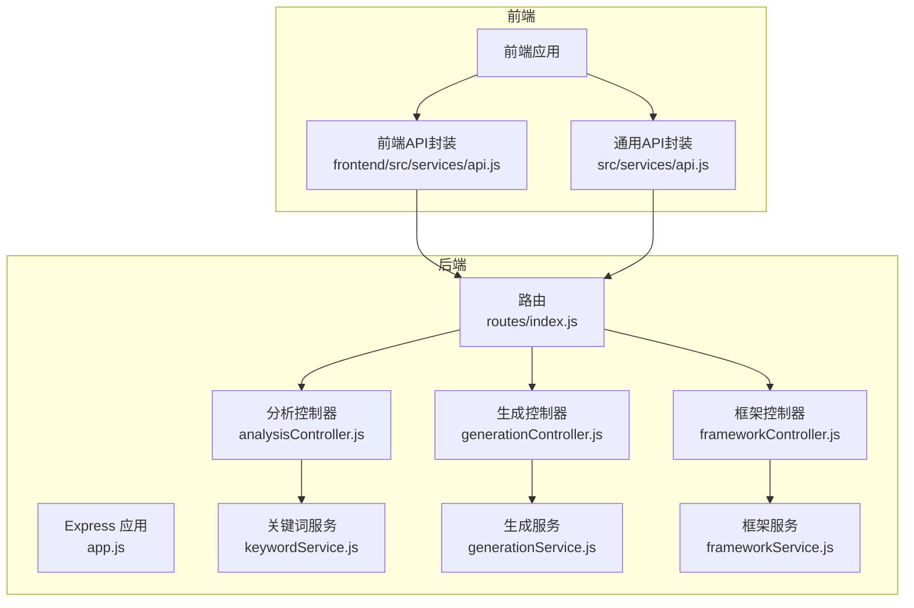
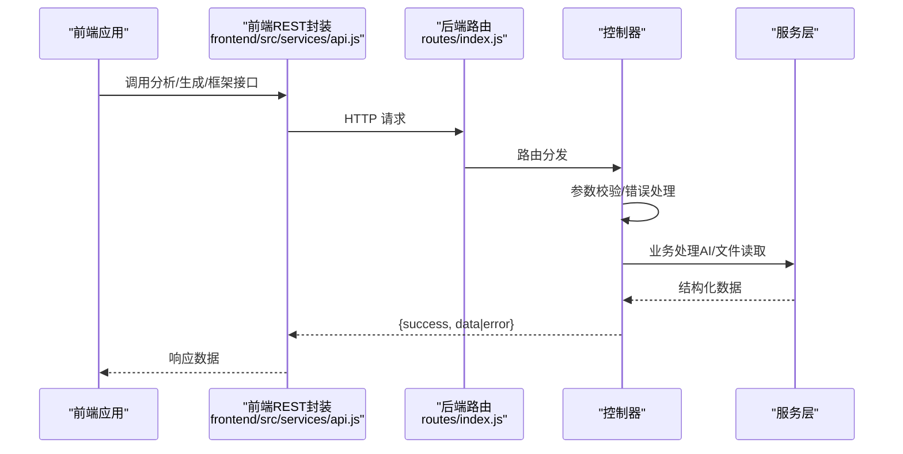
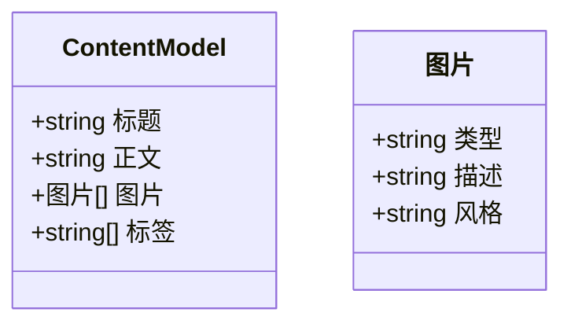
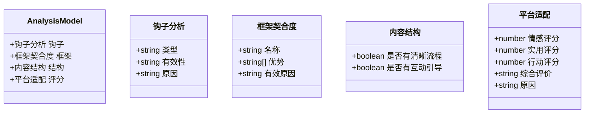
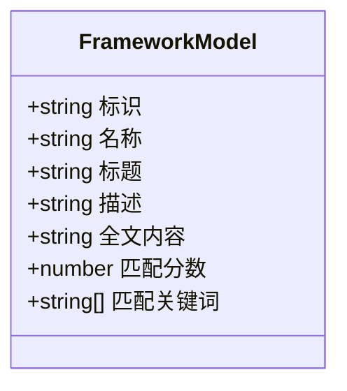
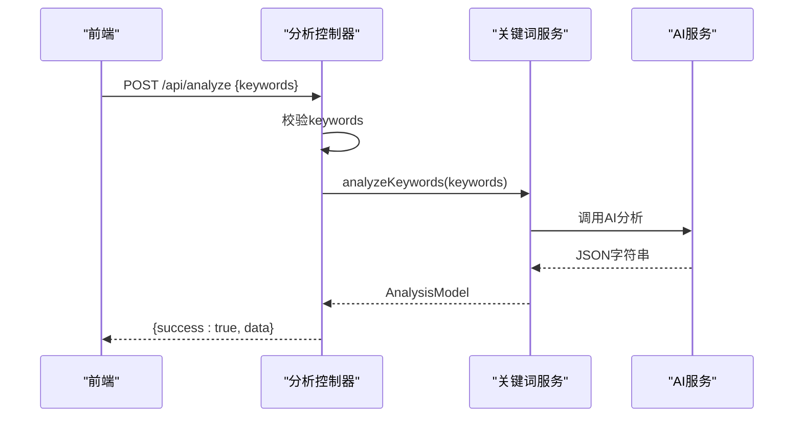
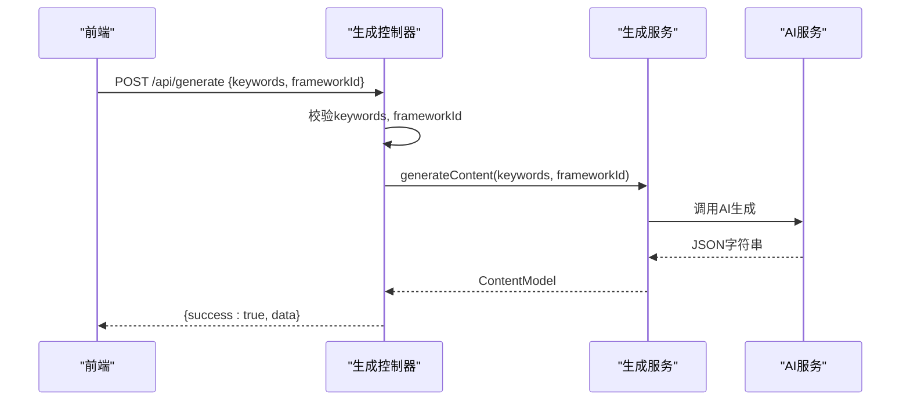
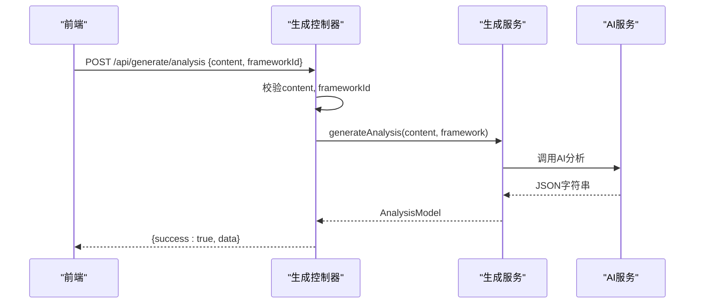
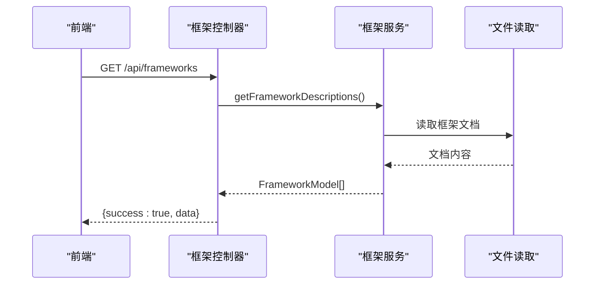
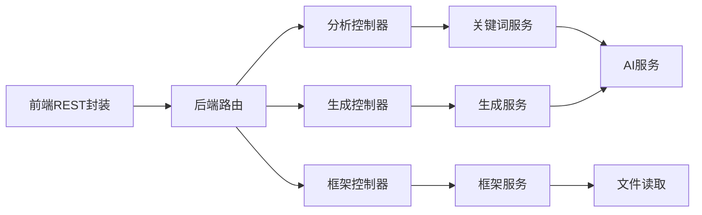

# API数据模型

<cite>
**本文档引用的文件**
- [backend/src/app.js](file://backend/src/app.js)
- [backend/src/routes/index.js](file://backend/src/routes/index.js)
- [backend/src/controllers/analysisController.js](file://backend/src/controllers/analysisController.js)
- [backend/src/controllers/frameworkController.js](file://backend/src/controllers/frameworkController.js)
- [backend/src/controllers/generationController.js](file://backend/src/controllers/generationController.js)
- [backend/src/services/keywordService.js](file://backend/src/services/keywordService.js)
- [backend/src/services/generationService.js](file://backend/src/services/generationService.js)
- [backend/src/services/frameworkService.js](file://backend/src/services/frameworkService.js)
- [frontend/src/services/api.js](file://frontend/src/services/api.js)
- [src/services/api.js](file://src/services/api.js)
- [小红书爆款框架.md](file://小红书爆款框架.md)
- [AIDA模型框架.md](file://AIDA模型框架.md)
- [SCQA模型框架.md](file://SCQA模型框架.md)
- [情感共鸣框架.md](file://情感共鸣框架.md)
- [干货分享框架.md](file://干货分享框架.md)
</cite>

## 目录
1. [简介](#简介)
2. [项目结构](#项目结构)
3. [核心组件](#核心组件)
4. [架构总览](#架构总览)
5. [详细组件分析](#详细组件分析)
6. [依赖关系分析](#依赖关系分析)
7. [性能考量](#性能考量)
8. [故障排查指南](#故障排查指南)
9. [结论](#结论)
10. [附录](#附录)

## 简介
本文件面向前端与后端开发者，系统化梳理本项目中API接口所使用的数据模型，包括请求参数模型、响应数据模型与错误码定义。文档重点覆盖以下核心数据结构：
- ContentModel 内容模型：描述生成内容的结构，含标题、正文、图片建议、标签等字段。
- AnalysisModel 分析模型：描述内容质量分析结果，含钩子分析、框架契合度、结构与平台适配等。
- FrameworkModel 框架模型：描述可用内容框架的基本信息与匹配结果。

同时提供字段说明、必填/可选属性、默认值策略、扩展字段建议与JSON Schema概要，帮助前后端对齐数据契约，提升集成效率与稳定性。

## 项目结构
后端采用Express + 控制器/服务分层；前端分为两套实现：
- 前端仓库中的 src/services/api.js：封装了AI与图片生成等API客户端，支持流式输出与本地知识库。
- 前端仓库中的 frontend/src/services/api.js：封装后端REST API（框架查询、关键词分析、内容生成与分析）。

图表来源
- [backend/src/app.js](file://backend/src/app.js#L1-L26)
- [backend/src/routes/index.js](file://backend/src/routes/index.js#L1-L21)
- [backend/src/controllers/analysisController.js](file://backend/src/controllers/analysisController.js#L1-L37)
- [backend/src/controllers/frameworkController.js](file://backend/src/controllers/frameworkController.js#L1-L49)
- [backend/src/controllers/generationController.js](file://backend/src/controllers/generationController.js#L1-L100)
- [backend/src/services/keywordService.js](file://backend/src/services/keywordService.js#L1-L85)
- [backend/src/services/generationService.js](file://backend/src/services/generationService.js#L1-L194)
- [backend/src/services/frameworkService.js](file://backend/src/services/frameworkService.js#L1-L64)
- [frontend/src/services/api.js](file://frontend/src/services/api.js#L1-L40)
- [src/services/api.js](file://src/services/api.js#L1-L454)

章节来源
- [backend/src/app.js](file://backend/src/app.js#L1-L26)
- [backend/src/routes/index.js](file://backend/src/routes/index.js#L1-L21)

## 核心组件
本节从数据模型视角，聚焦以下三类核心对象：

- ContentModel 内容模型
  - 字段：标题、正文、图片数组、标签数组
  - 用途：生成内容的统一载体，便于前端渲染与图片生成
  - 默认值策略：若AI返回非JSON或缺失字段，服务侧提供安全回退与补齐

- AnalysisModel 分析模型
  - 字段：钩子分析、框架契合度、内容结构、平台适配评分与综合评价
  - 用途：对生成内容进行质量评估，指导优化

- FrameworkModel 框架模型
  - 字段：框架标识、名称、标题、描述、全文内容
  - 用途：后端读取框架文档并返回描述列表与详情

章节来源
- [backend/src/services/generationService.js](file://backend/src/services/generationService.js#L63-L194)
- [backend/src/services/keywordService.js](file://backend/src/services/keywordService.js#L39-L85)
- [backend/src/services/frameworkService.js](file://backend/src/services/frameworkService.js#L9-L64)

## 架构总览
后端REST API通过Express路由暴露，控制器负责参数校验与错误处理，服务层负责业务逻辑与AI调用。前端分别封装后端REST API与AI/图片生成API，形成“后端API + AI/图片服务”的完整链路。

图表来源
- [backend/src/routes/index.js](file://backend/src/routes/index.js#L1-L21)
- [backend/src/controllers/analysisController.js](file://backend/src/controllers/analysisController.js#L6-L30)
- [backend/src/controllers/generationController.js](file://backend/src/controllers/generationController.js#L10-L64)
- [backend/src/controllers/frameworkController.js](file://backend/src/controllers/frameworkController.js#L8-L45)
- [frontend/src/services/api.js](file://frontend/src/services/api.js#L13-L35)

## 详细组件分析

### ContentModel 内容模型
ContentModel用于描述生成内容的结构，是生成与分析流程的核心数据载体。

- 字段定义与约束
  - 标题：字符串，长度建议20-25字符，吸引眼球
  - 正文：字符串，分段清晰，使用emoji增强可读性，每段不超过100字
  - 图片数组：数组，元素包含类型、描述、风格
  - 标签数组：数组，建议5个，格式为#标签
- 默认值策略
  - 若AI返回非JSON或缺失字段，服务侧提供回退内容，确保字段完整性
- 扩展字段建议
  - 可扩展图片数组为更细粒度的布局建议
  - 可扩展标签为分类体系或热度排序

图表来源
- [backend/src/services/generationService.js](file://backend/src/services/generationService.js#L24-L33)
- [backend/src/services/generationService.js](file://backend/src/services/generationService.js#L64-L112)

章节来源
- [backend/src/services/generationService.js](file://backend/src/services/generationService.js#L63-L194)

### AnalysisModel 分析模型
AnalysisModel用于描述内容质量分析结果，帮助创作者理解内容的优劣势与优化方向。

- 字段定义与约束
  - 钩子分析：包含类型、有效性、原因
  - 框架契合度：包含框架名称、优势列表、有效性的心理学解释
  - 内容结构：包含是否有清晰流程、是否有互动引导
  - 平台适配：包含情感感染力、实用价值、行动引导评分与综合评价
- 默认值策略
  - 若AI返回非JSON或缺失字段，服务侧提供回退分析，保证字段完整性

图表来源
- [backend/src/services/generationService.js](file://backend/src/services/generationService.js#L35-L60)
- [backend/src/services/generationService.js](file://backend/src/services/generationService.js#L114-L162)

章节来源
- [backend/src/services/generationService.js](file://backend/src/services/generationService.js#L114-L194)

### FrameworkModel 框架模型
FrameworkModel用于描述可用内容框架的基本信息与匹配结果，支持前端选择与后端匹配。

- 字段定义与约束
  - 框架标识：字符串，唯一标识
  - 框架名称：字符串，用于展示
  - 标题：字符串，文档首行标题
  - 描述：字符串，简短摘要
  - 全文内容：字符串，框架文档全文
  - 匹配分数：数值，关键词匹配强度
  - 匹配关键词：数组，命中的关键词集合
- 默认值策略
  - 从框架文档中提取标题与描述，若为空则提供默认值

图表来源
- [backend/src/services/frameworkService.js](file://backend/src/services/frameworkService.js#L13-L25)
- [backend/src/services/frameworkService.js](file://backend/src/services/frameworkService.js#L44-L58)

章节来源
- [backend/src/services/frameworkService.js](file://backend/src/services/frameworkService.js#L9-L64)

### API接口与数据模型映射

#### 1) 关键词分析接口
- 请求
  - 方法：POST
  - 路径：/api/analyze
  - 请求体：keywords（字符串，必填）
- 响应
  - 成功：{success: true, data: AnalysisModel}
  - 失败：{success: false, error: string}

图表来源
- [backend/src/controllers/analysisController.js](file://backend/src/controllers/analysisController.js#L6-L30)
- [backend/src/services/keywordService.js](file://backend/src/services/keywordService.js#L39-L85)
- [frontend/src/services/api.js](file://frontend/src/services/api.js#L22-L26)

章节来源
- [backend/src/controllers/analysisController.js](file://backend/src/controllers/analysisController.js#L6-L30)
- [backend/src/services/keywordService.js](file://backend/src/services/keywordService.js#L39-L85)
- [frontend/src/services/api.js](file://frontend/src/services/api.js#L22-L26)

#### 2) 内容生成接口
- 请求
  - 方法：POST
  - 路径：/api/generate
  - 请求体：keywords（字符串，必填）、frameworkId（字符串，必填）
- 响应
  - 成功：{success: true, data: ContentModel}
  - 失败：{success: false, error: string}

图表来源
- [backend/src/controllers/generationController.js](file://backend/src/controllers/generationController.js#L10-L33)
- [backend/src/services/generationService.js](file://backend/src/services/generationService.js#L63-L112)
- [frontend/src/services/api.js](file://frontend/src/services/api.js#L28-L31)

章节来源
- [backend/src/controllers/generationController.js](file://backend/src/controllers/generationController.js#L10-L33)
- [backend/src/services/generationService.js](file://backend/src/services/generationService.js#L63-L112)
- [frontend/src/services/api.js](file://frontend/src/services/api.js#L28-L31)

#### 3) 内容质量分析接口
- 请求
  - 方法：POST
  - 路径：/api/generate/analysis
  - 请求体：content（对象或字符串，必填）、frameworkId（字符串，必填）
- 响应
  - 成功：{success: true, data: AnalysisModel}
  - 失败：{success: false, error: string}

图表来源
- [backend/src/controllers/generationController.js](file://backend/src/controllers/generationController.js#L35-L64)
- [backend/src/services/generationService.js](file://backend/src/services/generationService.js#L114-L162)
- [frontend/src/services/api.js](file://frontend/src/services/api.js#L32-L34)

章节来源
- [backend/src/controllers/generationController.js](file://backend/src/controllers/generationController.js#L35-L64)
- [backend/src/services/generationService.js](file://backend/src/services/generationService.js#L114-L162)
- [frontend/src/services/api.js](file://frontend/src/services/api.js#L32-L34)

#### 4) 框架列表与详情接口
- 请求
  - GET /api/frameworks
  - GET /api/frameworks/:name
- 响应
  - 成功：{success: true, data: FrameworkModel[] 或 FrameworkModel}
  - 404：{success: false, error: 'Framework not found'}

图表来源
- [backend/src/controllers/frameworkController.js](file://backend/src/controllers/frameworkController.js#L8-L21)
- [backend/src/services/frameworkService.js](file://backend/src/services/frameworkService.js#L10-L26)
- [frontend/src/services/api.js](file://frontend/src/services/api.js#L13-L20)

章节来源
- [backend/src/controllers/frameworkController.js](file://backend/src/controllers/frameworkController.js#L8-L45)
- [backend/src/services/frameworkService.js](file://backend/src/services/frameworkService.js#L9-L64)
- [frontend/src/services/api.js](file://frontend/src/services/api.js#L13-L20)

#### 5) 图片代理接口
- 请求
  - GET /api/proxy-image?url=图片URL
- 响应
  - 成功：图片流
  - 失败：错误文本

章节来源
- [backend/src/controllers/generationController.js](file://backend/src/controllers/generationController.js#L69-L94)

### JSON Schema定义与字段说明

以下Schema为概念性定义，用于前后端对齐字段与约束。字段说明遵循“必填/可选/默认值/类型/范围/示例”。

- ContentModel
  - 标题：必填，字符串，长度20-25字符
  - 正文：必填，字符串，分段清晰，每段≤100字
  - 图片：可选，数组，元素包含类型、描述、风格
  - 标签：可选，数组，建议5个，格式为#标签
  - 默认值：若缺失，服务侧回退为默认标题、默认正文、默认图片与默认标签

- AnalysisModel
  - 钩子分析：可选，包含类型（枚举）、有效性（高/中/低）、原因（字符串）
  - 框架契合度：可选，包含名称、优势列表、有效原因
  - 内容结构：可选，包含是否有清晰流程、是否有互动引导
  - 平台适配：可选，包含情感评分（1-10）、实用评分（1-10）、行动评分（1-10）、综合评价、原因

- FrameworkModel
  - 标识：必填，字符串，唯一
  - 名称：必填，字符串
  - 标题：可选，字符串
  - 描述：可选，字符串
  - 全文内容：可选，字符串
  - 匹配分数：可选，数值
  - 匹配关键词：可选，数组

- 错误码定义
  - 400：请求参数缺失或非法（如关键词/框架ID缺失）
  - 404：框架不存在
  - 500：服务器内部错误或AI调用失败

章节来源
- [backend/src/controllers/analysisController.js](file://backend/src/controllers/analysisController.js#L10-L15)
- [backend/src/controllers/generationController.js](file://backend/src/controllers/generationController.js#L14-L19)
- [backend/src/controllers/frameworkController.js](file://backend/src/controllers/frameworkController.js#L28-L33)
- [backend/src/services/generationService.js](file://backend/src/services/generationService.js#L77-L88)
- [backend/src/services/generationService.js](file://backend/src/services/generationService.js#L126-L156)

### 数据验证规则与默认值设置
- 参数校验
  - 关键词分析：keywords必填
  - 内容生成：keywords与frameworkId必填
  - 内容分析：content与frameworkId必填
  - 框架详情：name参数必填
- 默认值策略
  - ContentModel：标题、正文、图片、标签缺失时回退为默认值
  - AnalysisModel：各字段缺失时回退为默认结构与评分
- 扩展字段
  - 建议在ContentModel中增加图片布局建议与标签分类
  - 建议在AnalysisModel中增加命中关键词与平台适配维度权重

章节来源
- [backend/src/services/generationService.js](file://backend/src/services/generationService.js#L77-L88)
- [backend/src/services/generationService.js](file://backend/src/services/generationService.js#L126-L156)

## 依赖关系分析
- 控制器依赖服务层，服务层依赖AI服务与文件读取
- 前端REST封装依赖后端路由
- 前端通用API封装独立于后端，直接对接AI与图片服务

图表来源
- [backend/src/routes/index.js](file://backend/src/routes/index.js#L1-L21)
- [backend/src/controllers/analysisController.js](file://backend/src/controllers/analysisController.js#L1-L37)
- [backend/src/controllers/generationController.js](file://backend/src/controllers/generationController.js#L1-L100)
- [backend/src/controllers/frameworkController.js](file://backend/src/controllers/frameworkController.js#L1-L49)
- [backend/src/services/keywordService.js](file://backend/src/services/keywordService.js#L1-L85)
- [backend/src/services/generationService.js](file://backend/src/services/generationService.js#L1-L194)
- [backend/src/services/frameworkService.js](file://backend/src/services/frameworkService.js#L1-L64)
- [frontend/src/services/api.js](file://frontend/src/services/api.js#L1-L40)
- [src/services/api.js](file://src/services/api.js#L1-L454)

章节来源
- [backend/src/routes/index.js](file://backend/src/routes/index.js#L1-L21)
- [frontend/src/services/api.js](file://frontend/src/services/api.js#L1-L40)
- [src/services/api.js](file://src/services/api.js#L1-L454)

## 性能考量
- 超时与重试
  - 后端生成与分析接口对AI调用设置合理超时，避免阻塞
  - 前端通用API对AI与图片生成接口设置较长超时，支持复杂推理与生成
- 流式输出
  - 前端通用API支持流式输出，提升交互体验
- 缓存与回退
  - 服务层在AI失败时提供回退策略，保证可用性

章节来源
- [backend/src/app.js](file://backend/src/app.js#L18-L18)
- [src/services/api.js](file://src/services/api.js#L94-L177)

## 故障排查指南
- 常见错误
  - 参数缺失：400错误，检查请求体字段
  - 框架不存在：404错误，确认框架名称
  - AI调用失败：500错误，查看服务端日志
- 排查步骤
  - 确认请求路径与方法正确
  - 校验必填字段是否齐全
  - 查看服务端控制台错误日志
  - 前端通用API检查网络与流式输出状态

章节来源
- [backend/src/controllers/analysisController.js](file://backend/src/controllers/analysisController.js#L10-L15)
- [backend/src/controllers/generationController.js](file://backend/src/controllers/generationController.js#L14-L19)
- [backend/src/controllers/frameworkController.js](file://backend/src/controllers/frameworkController.js#L28-L33)
- [backend/src/controllers/generationController.js](file://backend/src/controllers/generationController.js#L90-L94)

## 结论
本文件系统化梳理了API数据模型，明确了ContentModel、AnalysisModel、FrameworkModel的字段与约束，并给出了JSON Schema概要、验证规则与默认值策略。建议在后续迭代中：
- 明确字段的必填/可选与默认值，统一前后端契约
- 增强扩展字段的设计，提升模型的可演进性
- 完善错误码与错误消息的标准化，便于前端统一处理

## 附录
- 框架文档参考
  - 小红书爆款框架
  - AIDA模型框架
  - SCQA模型框架
  - 情感共鸣框架
  - 干货分享框架

章节来源
- [小红书爆款框架.md](file://小红书爆款框架.md#L1-L225)
- [AIDA模型框架.md](file://AIDA模型框架.md#L1-L153)
- [SCQA模型框架.md](file://SCQA模型框架.md#L1-L180)
- [情感共鸣框架.md](file://情感共鸣框架.md#L1-L240)
- [干货分享框架.md](file://干货分享框架.md#L1-L323)