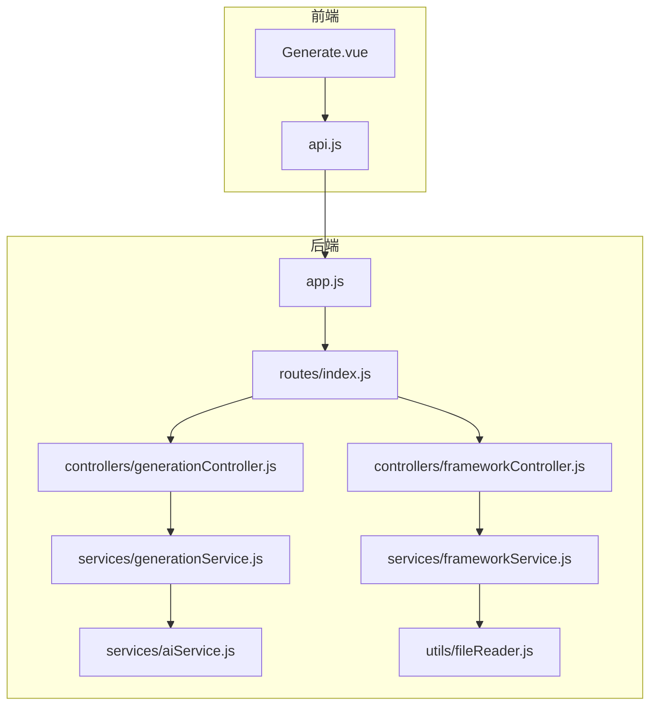
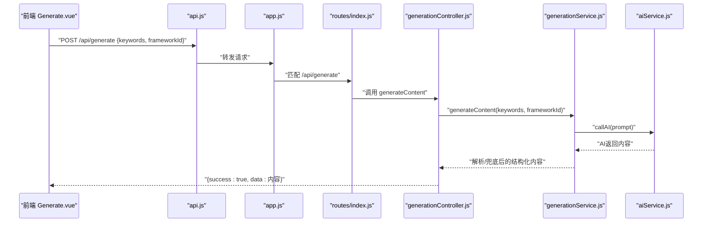
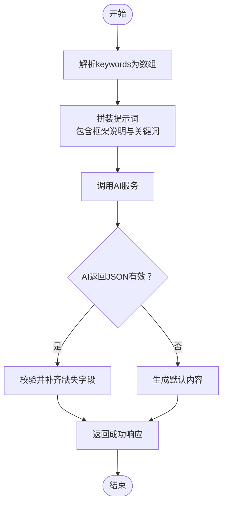
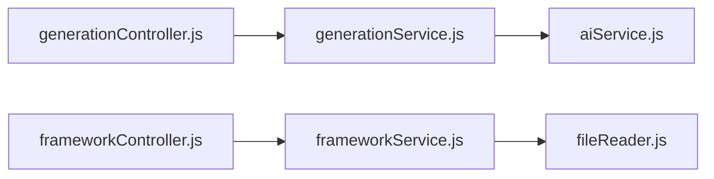

# 内容生成接口

<cite>
**本文引用的文件**
- [backend/src/app.js](file://backend/src/app.js)
- [backend/src/routes/index.js](file://backend/src/routes/index.js)
- [backend/src/controllers/generationController.js](file://backend/src/controllers/generationController.js)
- [backend/src/services/generationService.js](file://backend/src/services/generationService.js)
- [backend/src/services/aiService.js](file://backend/src/services/aiService.js)
- [backend/src/controllers/frameworkController.js](file://backend/src/controllers/frameworkController.js)
- [backend/src/services/frameworkService.js](file://backend/src/services/frameworkService.js)
- [backend/src/utils/fileReader.js](file://backend/src/utils/fileReader.js)
- [frontend/src/views/Generate.vue](file://frontend/src/views/Generate.vue)
- [frontend/src/services/api.js](file://frontend/src/services/api.js)
- [小红书爆款框架.md](file://小红书爆款框架.md)
- [AIDA模型框架.md](file://AIDA模型框架.md)
- [SCQA模型框架.md](file://SCQA模型框架.md)
- [黄金圈法则框架.md](file://黄金圈法则框架.md)
- [情感共鸣框架.md](file://情感共鸣框架.md)
</cite>

## 目录
1. [简介](#简介)
2. [项目结构](#项目结构)
3. [核心组件](#核心组件)
4. [架构总览](#架构总览)
5. [详细组件分析](#详细组件分析)
6. [依赖关系分析](#依赖关系分析)
7. [性能考虑](#性能考虑)
8. [故障排查指南](#故障排查指南)
9. [结论](#结论)
10. [附录](#附录)

## 简介
本文件为内容生成接口的详细API文档，聚焦于POST /api/generate接口的完整规范，包括请求参数、响应数据结构、错误处理机制。文档还深入说明AI内容生成的工作流程（关键词处理、框架应用、内容生成与质量分析），并提供请求与响应示例、不同框架下的内容生成效果说明、参数验证规则、异常处理策略以及性能优化建议。

## 项目结构
后端采用Express框架，路由集中于routes/index.js，控制器负责请求处理与响应封装，服务层负责业务逻辑与AI调用；前端通过api.js封装对后端的REST调用，Generate.vue作为生成流程的入口视图。

图表来源
- [backend/src/app.js](file://backend/src/app.js#L1-L26)
- [backend/src/routes/index.js](file://backend/src/routes/index.js#L1-L21)
- [backend/src/controllers/generationController.js](file://backend/src/controllers/generationController.js#L1-L100)
- [backend/src/services/generationService.js](file://backend/src/services/generationService.js#L1-L194)
- [backend/src/services/aiService.js](file://backend/src/services/aiService.js#L1-L55)
- [backend/src/controllers/frameworkController.js](file://backend/src/controllers/frameworkController.js#L1-L49)
- [backend/src/services/frameworkService.js](file://backend/src/services/frameworkService.js#L1-L64)
- [backend/src/utils/fileReader.js](file://backend/src/utils/fileReader.js)

章节来源
- [backend/src/app.js](file://backend/src/app.js#L1-L26)
- [backend/src/routes/index.js](file://backend/src/routes/index.js#L1-L21)

## 核心组件
- 请求入口与路由
  - /api/generate：POST，生成内容
  - /api/generate/analysis：POST，生成内容质量分析
  - /api/frameworks：GET，获取所有框架描述
  - /api/frameworks/:name：GET，按名称获取框架详情
  - /api/proxy-image：GET，图片下载代理（解决跨域）
- 控制器
  - generationController：处理生成与分析请求，负责参数校验与错误返回
  - frameworkController：处理框架查询请求
- 服务层
  - generationService：拼装提示词、调用AI、解析与兜底、生成分析
  - frameworkService：读取本地框架文件并提取描述
  - aiService：封装外部AI服务调用
- 前端
  - Generate.vue：发起生成请求，展示生成内容与质量分析
  - api.js：封装对后端的HTTP调用

章节来源
- [backend/src/routes/index.js](file://backend/src/routes/index.js#L11-L16)
- [backend/src/controllers/generationController.js](file://backend/src/controllers/generationController.js#L10-L33)
- [backend/src/controllers/frameworkController.js](file://backend/src/controllers/frameworkController.js#L8-L44)
- [backend/src/services/generationService.js](file://backend/src/services/generationService.js#L63-L194)
- [backend/src/services/aiService.js](file://backend/src/services/aiService.js#L14-L53)
- [frontend/src/views/Generate.vue](file://frontend/src/views/Generate.vue#L88-L135)
- [frontend/src/services/api.js](file://frontend/src/services/api.js#L28-L35)

## 架构总览
POST /api/generate的端到端流程如下：

图表来源
- [frontend/src/views/Generate.vue](file://frontend/src/views/Generate.vue#L96-L116)
- [frontend/src/services/api.js](file://frontend/src/services/api.js#L28-L31)
- [backend/src/app.js](file://backend/src/app.js#L20)
- [backend/src/routes/index.js](file://backend/src/routes/index.js#L14)
- [backend/src/controllers/generationController.js](file://backend/src/controllers/generationController.js#L10-L33)
- [backend/src/services/generationService.js](file://backend/src/services/generationService.js#L64-L94)
- [backend/src/services/aiService.js](file://backend/src/services/aiService.js#L14-L53)

## 详细组件分析

### API：POST /api/generate
- 功能
  - 根据关键词与框架ID生成小红书风格的图文内容，返回标题、正文、图片描述、标签等结构化数据
- 请求地址
  - POST /api/generate
- 请求头
  - Content-Type: application/json
- 请求体参数
  - keywords：字符串或数组（字符串时按逗号/中文逗号/空白分隔为数组）
  - frameworkId：字符串，框架文件名（不含“框架”后缀）
- 响应体
  - success：布尔，请求是否成功
  - data：对象，包含以下字段
    - title：字符串，标题（20-25字，吸引眼球）
    - body：字符串，正文（分段清晰，使用emoji增强可读性，每段不超过100字；不支持加粗）
    - images：数组，图片描述对象，包含type、description、style
    - tags：数组，话题标签（最多5个）
  - error：字符串（仅在失败时返回）
- 错误处理
  - 参数缺失：返回400，error包含明确提示
  - 服务内部异常：返回500，error包含错误信息
  - AI返回非JSON或为空：服务层进行兜底，确保返回可用内容
- 示例
  - 请求示例
    - keywords：["护肤", "抗老"]
    - frameworkId：小红书爆款
  - 响应示例
    - 包含title、body、images（含type/description/style）、tags
- 参数验证规则
  - keywords与frameworkId必须存在且非空
  - keywords可为字符串或数组；数组时将被规范化为数组
- 异常处理策略
  - 控制器层捕获异常并统一返回JSON
  - 服务层对AI返回进行健壮性处理，缺失字段自动补齐
- 性能优化建议
  - 前端在请求前对keywords进行清洗与去重
  - 合理控制keywords数量，避免过长prompt影响响应时间
  - 服务层缓存常用框架描述（当前未实现，可在frameworkService中扩展）

章节来源
- [backend/src/controllers/generationController.js](file://backend/src/controllers/generationController.js#L10-L33)
- [backend/src/services/generationService.js](file://backend/src/services/generationService.js#L64-L112)
- [frontend/src/views/Generate.vue](file://frontend/src/views/Generate.vue#L96-L116)
- [frontend/src/services/api.js](file://frontend/src/services/api.js#L28-L31)

### AI内容生成工作流程
- 关键词处理
  - 若keywords为字符串，按逗号、中文逗号、空白字符分割为数组
  - 若为数组，保持原样
- 框架应用
  - 通过frameworkId将框架名称映射到对应框架描述（由本地框架文件提供）
  - 将框架说明注入提示词，指导AI生成符合平台特性的内容
- 流式内容生成
  - 当前aiService未启用流式输出，采用一次性请求与响应
  - 若后续需要流式输出，可在aiService中开启stream并逐段推送
- 解析与兜底
  - 尝试解析AI返回的JSON；若失败则生成默认内容，确保字段完整性
- 质量分析
  - 生成完成后可调用POST /api/generate/analysis获取质量分析报告

图表来源
- [backend/src/services/generationService.js](file://backend/src/services/generationService.js#L64-L112)
- [backend/src/services/aiService.js](file://backend/src/services/aiService.js#L14-L53)

章节来源
- [backend/src/services/generationService.js](file://backend/src/services/generationService.js#L64-L112)
- [backend/src/services/aiService.js](file://backend/src/services/aiService.js#L14-L53)

### 框架与内容生成效果说明
- 框架类型
  - 小红书爆款框架：视觉钩子 + 情绪价值 + 实用信息 + 互动引导
  - AIDA模型框架：注意 → 兴趣 → 欲望 → 行动
  - SCQA模型框架：情境 → 冲突 → 问题 → 答案
  - 黄金圈法则框架：为什么 → 怎么做 → 是什么
  - 情感共鸣框架：情感唤醒 → 真实细节 → 开放共鸣
- 不同框架下的内容生成效果
  - 小红书爆款框架：强调封面与标题吸睛、正文结构化、实用价值与互动引导
  - AIDA模型框架：从抓眼球到促动行动，适合种草与方法分享
  - SCQA模型框架：问题导向，适合经验分享与技能教学
  - 黄金圈法则框架：从“为什么”出发，适合个人品牌与价值主张表达
  - 情感共鸣框架：强调真实细节与开放式共鸣，适合情感与成长类内容

章节来源
- [backend/src/services/generationService.js](file://backend/src/services/generationService.js#L3-L61)
- [小红书爆款框架.md](file://小红书爆款框架.md#L1-L225)
- [AIDA模型框架.md](file://AIDA模型框架.md#L1-L153)
- [SCQA模型框架.md](file://SCQA模型框架.md#L1-L180)
- [黄金圈法则框架.md](file://黄金圈法则框架.md#L1-L162)
- [情感共鸣框架.md](file://情感共鸣框架.md#L1-L240)

### 质量分析接口（POST /api/generate/analysis）
- 功能
  - 对已生成内容进行质量分析，返回钩子类型、框架强度、结构与吸引力评分等
- 请求体参数
  - content：生成的内容对象（包含title、body等）
  - frameworkId：使用的框架ID
- 响应体
  - success：布尔
  - data：分析对象，包含hook、framework、structure、appeal等字段
- 错误处理
  - 参数缺失返回400
  - 服务异常返回500

章节来源
- [backend/src/controllers/generationController.js](file://backend/src/controllers/generationController.js#L35-L63)
- [backend/src/services/generationService.js](file://backend/src/services/generationService.js#L114-L162)

### 框架查询接口
- GET /api/frameworks
  - 返回所有框架的简要描述（id、name、title、description）
- GET /api/frameworks/:name
  - 返回指定名称框架的完整内容
- 实现要点
  - 通过frameworkService读取本地框架文件并解析摘要
  - 支持按名称匹配与排序

章节来源
- [backend/src/controllers/frameworkController.js](file://backend/src/controllers/frameworkController.js#L8-L44)
- [backend/src/services/frameworkService.js](file://backend/src/services/frameworkService.js#L10-L58)
- [backend/src/utils/fileReader.js](file://backend/src/utils/fileReader.js)

## 依赖关系分析
- 组件耦合
  - generationController依赖generationService
  - generationService依赖aiService
  - frameworkController依赖frameworkService
  - frameworkService依赖fileReader
- 外部依赖
  - Express、CORS、Axios
  - 外部AI服务（通过aiService封装）
- 潜在循环依赖
  - 当前未发现循环依赖
- 接口契约
  - /api/generate与/analyze均返回统一的success/data/error结构

图表来源
- [backend/src/controllers/generationController.js](file://backend/src/controllers/generationController.js#L7)
- [backend/src/services/generationService.js](file://backend/src/services/generationService.js#L1)
- [backend/src/services/aiService.js](file://backend/src/services/aiService.js#L3)
- [backend/src/controllers/frameworkController.js](file://backend/src/controllers/frameworkController.js#L6)
- [backend/src/services/frameworkService.js](file://backend/src/services/frameworkService.js#L7)
- [backend/src/utils/fileReader.js](file://backend/src/utils/fileReader.js)

章节来源
- [backend/src/controllers/generationController.js](file://backend/src/controllers/generationController.js#L7)
- [backend/src/services/generationService.js](file://backend/src/services/generationService.js#L1)
- [backend/src/services/aiService.js](file://backend/src/services/aiService.js#L3)
- [backend/src/controllers/frameworkController.js](file://backend/src/controllers/frameworkController.js#L6)
- [backend/src/services/frameworkService.js](file://backend/src/services/frameworkService.js#L7)
- [backend/src/utils/fileReader.js](file://backend/src/utils/fileReader.js)

## 性能考虑
- 前端优化
  - 请求前对keywords进行清洗与去重，减少无效字符
  - 控制keywords数量，避免过长prompt导致延迟
- 后端优化
  - aiService可考虑启用流式输出，提升首屏体验（当前未启用）
  - generationService可引入轻量缓存（如framework描述），减少文件读取开销
  - 对高频错误进行限流与熔断，避免级联故障
- 网络与超时
  - aiService设置了较长超时，前端可结合加载态与取消请求策略提升交互体验

[本节为通用性能建议，无需特定文件引用]

## 故障排查指南
- 常见错误与处理
  - 缺少参数：检查keywords与frameworkId是否传入
  - AI服务不可用：查看aiService日志，确认API_KEY与网络连通性
  - AI返回非JSON：服务层已兜底，可检查返回内容是否符合预期
  - 框架不存在：frameworkController返回404，确认frameworkId是否正确
- 建议的日志与监控
  - 记录请求参数与AI返回摘要
  - 对5xx错误进行统计与告警
  - 对生成耗时进行埋点，定位瓶颈

章节来源
- [backend/src/controllers/generationController.js](file://backend/src/controllers/generationController.js#L14-L32)
- [backend/src/services/aiService.js](file://backend/src/services/aiService.js#L45-L52)
- [backend/src/controllers/frameworkController.js](file://backend/src/controllers/frameworkController.js#L28-L33)

## 结论
POST /api/generate接口通过清晰的参数规范、稳健的服务层解析与兜底策略，实现了小红书风格内容的自动化生成。配合框架查询与质量分析接口，可形成从关键词到内容再到质量评估的完整工作流。建议后续在AI服务侧引入流式输出与缓存策略，进一步提升用户体验与系统稳定性。

[本节为总结性内容，无需特定文件引用]

## 附录

### 请求与响应示例
- 请求示例
  - URL：POST /api/generate
  - Body：
    - keywords：["护肤", "抗老"]
    - frameworkId：小红书爆款
- 响应示例
  - Body：
    - success：true
    - data：{
        title："标题",
        body："正文",
        images：[{"type":"封面","description":"封面图描述","style":"风格"}],
        tags：["#标签1","#标签2","#标签3","#标签4","#标签5"]
      }

章节来源
- [frontend/src/views/Generate.vue](file://frontend/src/views/Generate.vue#L96-L116)
- [frontend/src/services/api.js](file://frontend/src/services/api.js#L28-L31)
- [backend/src/services/generationService.js](file://backend/src/services/generationService.js#L64-L112)