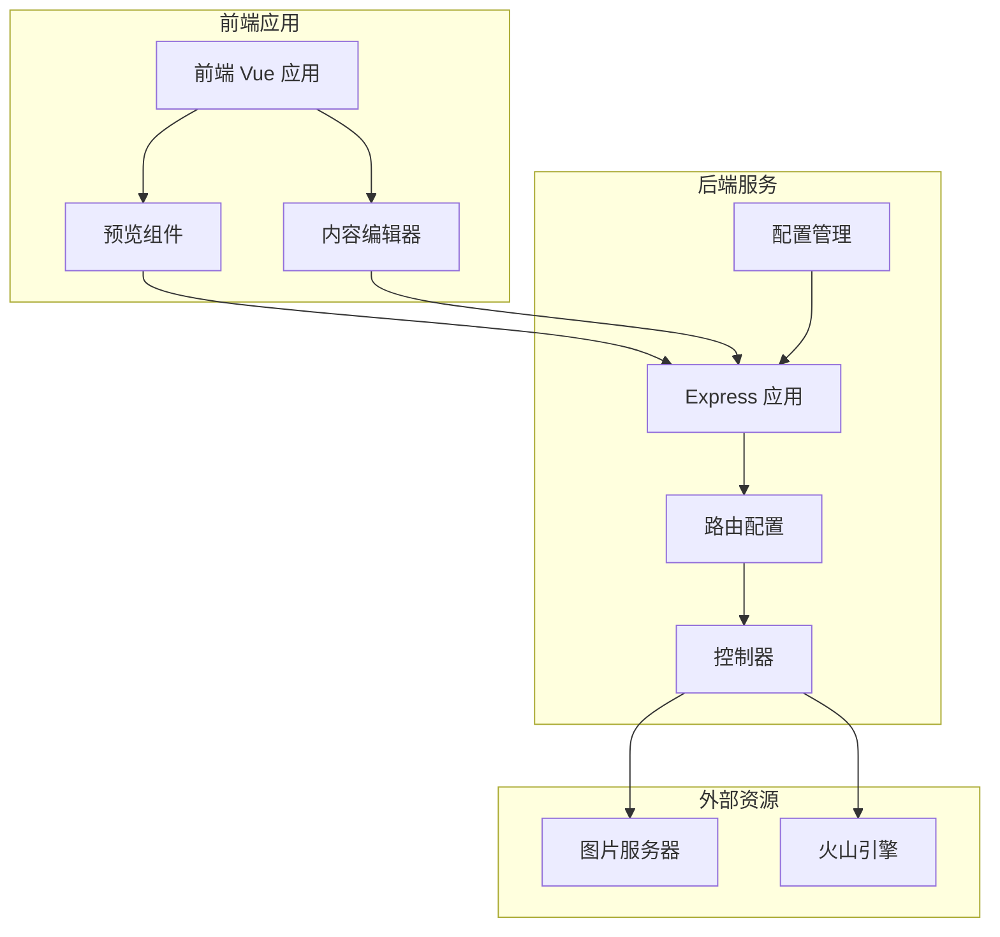
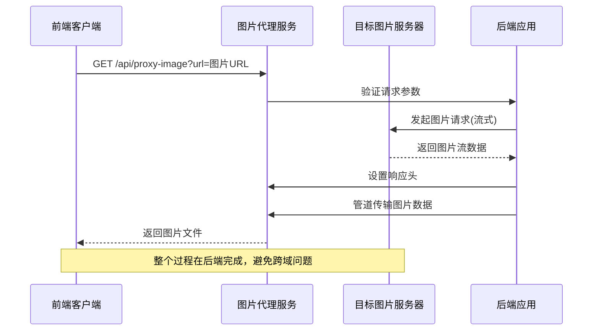
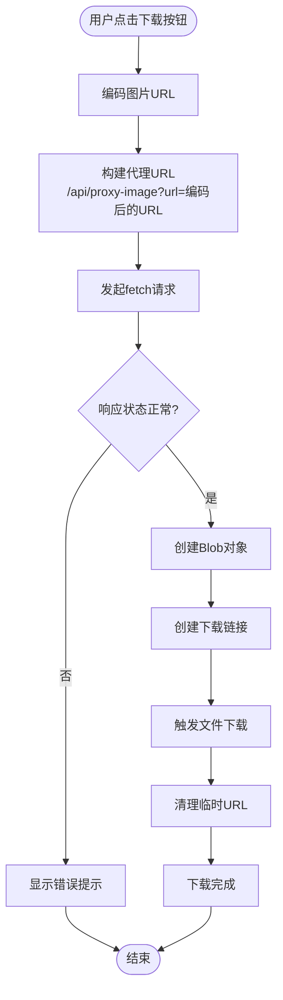
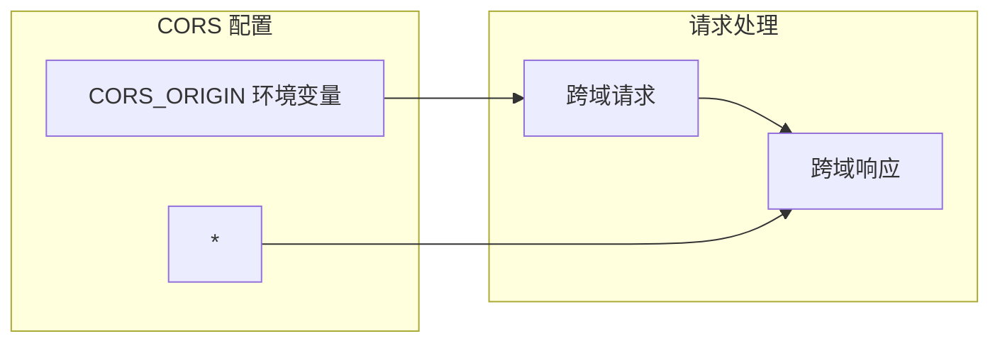
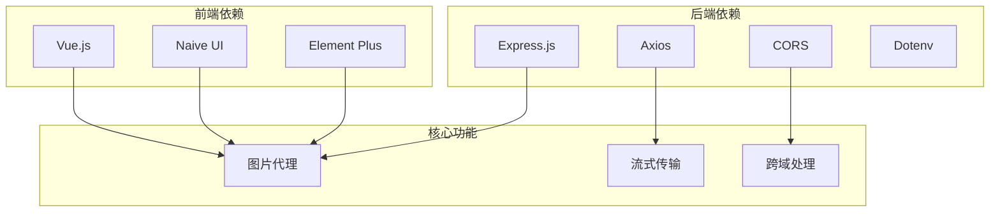

# 图片代理接口

<cite>
**本文档引用的文件**
- [backend/src/controllers/generationController.js](file://backend/src/controllers/generationController.js)
- [backend/src/routes/index.js](file://backend/src/routes/index.js)
- [backend/src/app.js](file://backend/src/app.js)
- [backend/.env](file://backend/.env)
- [backend/package.json](file://backend/package.json)
- [frontend/src/components/Preview.vue](file://frontend/src/components/Preview.vue)
- [frontend/src/components/ContentEditor.vue](file://frontend/src/components/ContentEditor.vue)
- [frontend/src/services/api.js](file://frontend/src/services/api.js)
</cite>

## 目录
1. [简介](#简介)
2. [项目结构](#项目结构)
3. [核心组件](#核心组件)
4. [架构概览](#架构概览)
5. [详细组件分析](#详细组件分析)
6. [依赖关系分析](#依赖关系分析)
7. [性能考虑](#性能考虑)
8. [故障排除指南](#故障排除指南)
9. [结论](#结论)

## 简介
本文档详细说明了小红书图片代理接口的设计与实现，重点介绍 GET /api/proxy-image 接口的完整 API 规范。该接口的核心目的是解决前端直接下载跨域图片时遇到的跨域问题，通过后端代理的方式实现安全的图片下载功能。

图片代理接口采用流式传输机制，避免了大图片下载时的内存占用问题，并提供了完整的错误处理和超时控制机制。该设计确保了用户可以顺畅地下载和预览由 AI 生成的图片内容。

## 项目结构
该项目采用前后端分离架构，图片代理功能位于后端服务中，通过 Express.js 提供 RESTful API 接口。

**图表来源**
- [backend/src/app.js](file://backend/src/app.js#L1-L26)
- [backend/src/routes/index.js](file://backend/src/routes/index.js#L1-L21)

**章节来源**
- [backend/src/app.js](file://backend/src/app.js#L1-L26)
- [backend/src/routes/index.js](file://backend/src/routes/index.js#L1-L21)

## 核心组件
图片代理接口由以下核心组件构成：

### 后端控制器
- **proxyImage 函数**：实现图片代理的核心逻辑
- **Express 路由**：定义 /api/proxy-image 接口
- **CORS 配置**：处理跨域资源共享

### 前端集成
- **预览组件**：提供图片下载功能
- **内容编辑器**：支持图片预览和下载
- **API 服务**：统一的 HTTP 请求封装

**章节来源**
- [backend/src/controllers/generationController.js](file://backend/src/controllers/generationController.js#L66-L94)
- [backend/src/routes/index.js](file://backend/src/routes/index.js#L16-L16)

## 架构概览
图片代理接口采用代理模式，通过后端服务转发图片请求，从而绕过浏览器的同源策略限制。

**图表来源**
- [backend/src/controllers/generationController.js](file://backend/src/controllers/generationController.js#L69-L94)
- [frontend/src/components/Preview.vue](file://frontend/src/components/Preview.vue#L146-L166)

## 详细组件分析

### API 接口规范

#### 接口定义
- **方法**：GET
- **路径**：/api/proxy-image
- **功能**：代理下载指定 URL 的图片，解决跨域问题

#### URL 参数
| 参数名 | 必填 | 类型 | 描述 | 示例 |
|--------|------|------|------|------|
| url | 是 | string | 目标图片的完整 URL | https://example.com/image.jpg |

#### 请求头要求
- 支持任意请求头（由客户端自由设置）
- 后端会透传目标服务器的响应头信息

#### 响应头设置
- **Content-Type**：根据目标服务器返回的 Content-Type 设置
- **Access-Control-Allow-Origin**：设置为 "*" 允许任意域名访问
- **其他响应头**：透传目标服务器的所有响应头

#### 成功响应
- **状态码**：200 OK
- **响应体**：二进制图片数据流
- **内容类型**：根据图片格式自动设置

#### 错误响应
- **400 Bad Request**：缺少 url 参数
- **500 Internal Server Error**：代理请求失败

**章节来源**
- [backend/src/controllers/generationController.js](file://backend/src/controllers/generationController.js#L69-L94)

### 前端集成实现

#### 预览组件中的使用
前端通过预览组件实现图片下载功能：

**图表来源**
- [frontend/src/components/Preview.vue](file://frontend/src/components/Preview.vue#L146-L166)

#### 内容编辑器中的使用
内容编辑器提供类似的功能，支持批量下载图片：

**章节来源**
- [frontend/src/components/Preview.vue](file://frontend/src/components/Preview.vue#L146-L166)
- [frontend/src/components/ContentEditor.vue](file://frontend/src/components/ContentEditor.vue#L210-L227)

### 后端实现细节

#### 跨域处理机制
后端应用配置了 CORS 中间件，允许来自指定域名的跨域请求：

**图表来源**
- [backend/src/app.js](file://backend/src/app.js#L14-L16)
- [backend/.env](file://backend/.env#L4-L4)

#### 流式传输机制
后端使用流式传输避免内存溢出：

**章节来源**
- [backend/src/controllers/generationController.js](file://backend/src/controllers/generationController.js#L77-L89)

### 错误处理与超时设置

#### 错误处理策略
- **参数验证**：检查 url 参数是否存在
- **网络异常**：捕获并记录代理请求异常
- **响应验证**：检查目标服务器响应状态

#### 超时设置
- **代理超时**：30秒
- **前端超时**：10秒（API 服务默认）

**章节来源**
- [backend/src/controllers/generationController.js](file://backend/src/controllers/generationController.js#L81-L81)
- [frontend/src/services/api.js](file://frontend/src/services/api.js#L10-L10)

## 依赖关系分析

### 技术栈依赖

**图表来源**
- [backend/package.json](file://backend/package.json#L10-L15)
- [frontend/src/services/api.js](file://frontend/src/services/api.js#L6-L6)

### 组件耦合关系
- **控制器与路由**：紧密耦合，控制器函数直接注册到路由
- **前端与后端**：松耦合，通过 RESTful API 通信
- **CORS 配置**：全局配置，影响所有路由

**章节来源**
- [backend/src/routes/index.js](file://backend/src/routes/index.js#L16-L16)
- [backend/src/app.js](file://backend/src/app.js#L14-L16)

## 性能考虑

### 流式传输优势
- **内存效率**：避免将整个图片加载到内存中
- **响应速度**：边接收边传输，提升用户体验
- **扩展性**：支持任意大小的图片文件

### 缓存策略建议
虽然当前实现未包含缓存机制，但建议考虑以下策略：
- **短期缓存**：对频繁访问的图片设置合理的缓存时间
- **条件请求**：利用 ETag 和 Last-Modified 处理缓存验证
- **CDN 集成**：对于静态图片可考虑使用 CDN 加速

### 性能优化建议
1. **连接池管理**：合理配置 HTTP 连接池
2. **并发控制**：限制同时进行的图片代理请求数量
3. **监控指标**：添加请求延迟、成功率等监控指标
4. **资源清理**：确保及时清理临时文件和连接

## 故障排除指南

### 常见问题及解决方案

#### 跨域问题
- **症状**：浏览器控制台出现跨域错误
- **原因**：CORS 配置不正确或缺失
- **解决方案**：检查 CORS_ORIGIN 环境变量设置

#### 图片下载失败
- **症状**：下载按钮无响应或提示下载失败
- **原因**：目标服务器不可达或图片 URL 无效
- **解决方案**：验证图片 URL 格式和可访问性

#### 超时问题
- **症状**：长时间无响应或超时错误
- **原因**：网络延迟或目标服务器响应慢
- **解决方案**：调整超时时间和重试机制

#### 内存溢出
- **症状**：后端进程崩溃或内存使用过高
- **原因**：使用非流式传输处理大图片
- **解决方案**：确保使用流式传输机制

**章节来源**
- [backend/src/controllers/generationController.js](file://backend/src/controllers/generationController.js#L90-L93)
- [backend/src/app.js](file://backend/src/app.js#L14-L16)

### 调试技巧
1. **日志记录**：启用详细的错误日志
2. **网络监控**：使用浏览器开发者工具监控网络请求
3. **状态检查**：验证目标服务器的响应状态码
4. **参数验证**：确保 URL 参数正确编码

## 结论
图片代理接口通过简洁而有效的设计解决了前端跨域下载图片的核心问题。该实现具有以下优势：

1. **安全性**：通过后端代理隐藏真实的图片服务器地址
2. **可靠性**：完善的错误处理和超时控制机制
3. **性能**：流式传输避免内存问题，提升用户体验
4. **可维护性**：清晰的代码结构和模块化设计

未来可以考虑增加缓存机制、监控指标和更灵活的配置选项，以进一步提升系统的整体性能和可用性。