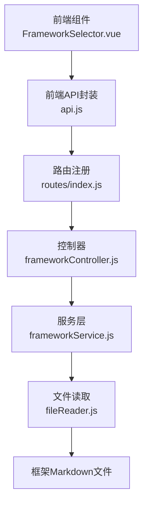
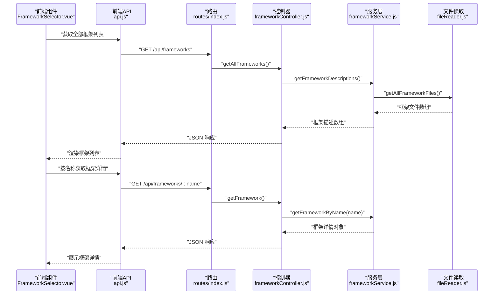
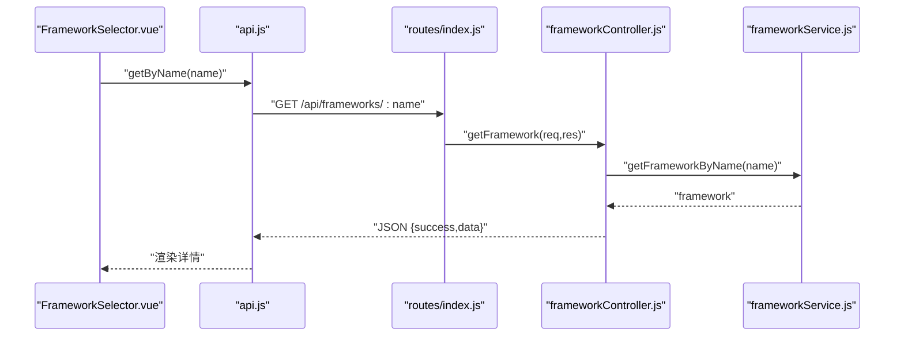
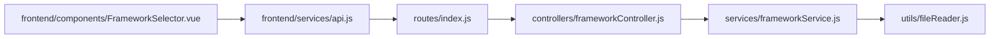

# 框架管理接口

<cite>
**本文档引用的文件**
- [backend/src/app.js](file://backend/src/app.js)
- [backend/src/routes/index.js](file://backend/src/routes/index.js)
- [backend/src/controllers/frameworkController.js](file://backend/src/controllers/frameworkController.js)
- [backend/src/services/frameworkService.js](file://backend/src/services/frameworkService.js)
- [backend/src/utils/fileReader.js](file://backend/src/utils/fileReader.js)
- [frontend/src/services/api.js](file://frontend/src/services/api.js)
- [frontend/src/components/FrameworkSelector.vue](file://frontend/src/components/FrameworkSelector.vue)
- [AIDA模型框架.md](file://AIDA模型框架.md)
- [SCQA模型框架.md](file://SCQA模型框架.md)
- [黄金圈法则框架.md](file://黄金圈法则框架.md)
- [小红书爆款框架.md](file://小红书爆款框架.md)
- [情感共鸣框架.md](file://情感共鸣框架.md)
- [README.md](file://README.md)
</cite>

## 目录
1. [简介](#简介)
2. [项目结构](#项目结构)
3. [核心组件](#核心组件)
4. [架构总览](#架构总览)
5. [详细组件分析](#详细组件分析)
6. [依赖关系分析](#依赖关系分析)
7. [性能考虑](#性能考虑)
8. [故障排查指南](#故障排查指南)
9. [结论](#结论)
10. [附录](#附录)

## 简介
本文件面向框架管理接口的使用者与维护者，系统化梳理后端 GET /api/frameworks 与 GET /api/frameworks/:name 的完整 API 规范，覆盖框架列表获取、框架详情查询、匹配度计算、前端集成与扩展机制等内容。文档同时对内置框架类型（小红书爆款框架、AIDA模型、SCQA模型、黄金圈法则、情感共鸣等）进行特点、适用场景与使用方法的说明，并提供框架切换与应用的示例路径，帮助在内容生成流程中正确选用与应用不同框架。

## 项目结构
后端采用 Express 路由与控制器分层，前端通过 Axios 封装 API 调用，框架内容以 Markdown 文件形式存储，服务层负责读取与解析，最终统一返回给前端组件渲染与交互。

图表来源
- [backend/src/routes/index.js](file://backend/src/routes/index.js#L11-L12)
- [backend/src/controllers/frameworkController.js](file://backend/src/controllers/frameworkController.js#L8-L21)
- [backend/src/services/frameworkService.js](file://backend/src/services/frameworkService.js#L9-L26)
- [backend/src/utils/fileReader.js](file://backend/src/utils/fileReader.js#L29-L45)
- [frontend/src/services/api.js](file://frontend/src/services/api.js#L13-L20)
- [frontend/src/components/FrameworkSelector.vue](file://frontend/src/components/FrameworkSelector.vue#L15-L37)

章节来源
- [backend/src/app.js](file://backend/src/app.js#L20-L24)
- [backend/src/routes/index.js](file://backend/src/routes/index.js#L11-L12)
- [backend/src/controllers/frameworkController.js](file://backend/src/controllers/frameworkController.js#L8-L21)
- [backend/src/services/frameworkService.js](file://backend/src/services/frameworkService.js#L9-L26)
- [backend/src/utils/fileReader.js](file://backend/src/utils/fileReader.js#L29-L45)
- [frontend/src/services/api.js](file://frontend/src/services/api.js#L13-L20)
- [frontend/src/components/FrameworkSelector.vue](file://frontend/src/components/FrameworkSelector.vue#L15-L37)

## 核心组件
- 路由层：在路由中注册 /api/frameworks 与 /api/frameworks/:name 两个端点，分别对应框架列表与单个框架详情。
- 控制器层：封装请求参数校验与响应格式，调用服务层获取数据并处理异常。
- 服务层：负责扫描框架文件、提取标题与摘要、按关键字匹配排序、按名称检索。
- 文件读取层：统一读取框架 Markdown 文件内容，支持跨目录回退读取策略。
- 前端层：通过 api.js 封装 GET /api/frameworks 与 GET /api/frameworks/:name；FrameworkSelector.vue 作为框架选择组件，绑定选中事件并展示匹配度。

章节来源
- [backend/src/routes/index.js](file://backend/src/routes/index.js#L11-L12)
- [backend/src/controllers/frameworkController.js](file://backend/src/controllers/frameworkController.js#L8-L45)
- [backend/src/services/frameworkService.js](file://backend/src/services/frameworkService.js#L9-L58)
- [backend/src/utils/fileReader.js](file://backend/src/utils/fileReader.js#L9-L45)
- [frontend/src/services/api.js](file://frontend/src/services/api.js#L13-L20)
- [frontend/src/components/FrameworkSelector.vue](file://frontend/src/components/FrameworkSelector.vue#L42-L60)

## 架构总览
下面的序列图展示了前端选择框架到后端返回框架详情的完整调用链路。

图表来源
- [frontend/src/components/FrameworkSelector.vue](file://frontend/src/components/FrameworkSelector.vue#L15-L37)
- [frontend/src/services/api.js](file://frontend/src/services/api.js#L13-L20)
- [backend/src/routes/index.js](file://backend/src/routes/index.js#L11-L12)
- [backend/src/controllers/frameworkController.js](file://backend/src/controllers/frameworkController.js#L8-L45)
- [backend/src/services/frameworkService.js](file://backend/src/services/frameworkService.js#L9-L42)
- [backend/src/utils/fileReader.js](file://backend/src/utils/fileReader.js#L29-L45)

## 详细组件分析

### API 端点规范

- 基础路径
  - 前缀：/api
  - CORS 来源：允许的来源由环境变量配置，默认本地开发端口
  - JSON 请求体：启用 express.json()

- GET /api/frameworks
  - 功能：获取所有可用框架的简要描述列表
  - 请求参数：无
  - 响应体字段
    - success: 布尔，请求是否成功
    - data: 数组，每个元素包含
      - id: 字符串，框架文件名
      - name: 字符串，去除“框架”的中文名称
      - title: 字符串，框架文档首级标题
      - description: 字符串，摘要（最多200字符）
      - fullContent: 字符串，框架完整内容（仅列表接口返回）
  - 状态码
    - 200：成功
    - 500：服务器内部错误

- GET /api/frameworks/:name
  - 功能：按名称获取指定框架的完整内容
  - 路径参数
    - name: 字符串，框架文件名或名称（不带“.md”）
  - 响应体字段
    - success: 布尔，请求是否成功
    - data: 对象，包含
      - id: 字符串，框架文件名
      - name: 字符串，去除“框架”的中文名称
      - title: 字符串，框架文档首级标题
      - description: 字符串，摘要
      - fullContent: 字符串，框架完整内容
  - 状态码
    - 200：成功
    - 404：框架不存在
    - 500：服务器内部错误

章节来源
- [backend/src/app.js](file://backend/src/app.js#L14-L18)
- [backend/src/routes/index.js](file://backend/src/routes/index.js#L11-L12)
- [backend/src/controllers/frameworkController.js](file://backend/src/controllers/frameworkController.js#L8-L45)
- [backend/src/services/frameworkService.js](file://backend/src/services/frameworkService.js#L9-L42)

### 框架匹配与排序（服务层）
- 匹配逻辑
  - 将关键字字符串转为小写并切分为单词集合
  - 遍历所有框架，统计关键字在框架全文中的命中数量
  - 返回包含 matchScore 与 matchedKeywords 的排序结果（按命中数降序）
- 用途
  - 前端可结合关键词对框架进行智能推荐与排序

章节来源
- [backend/src/services/frameworkService.js](file://backend/src/services/frameworkService.js#L44-L58)

### 前端集成与使用示例
- 获取全部框架列表
  - 调用路径：frontend/src/services/api.js 中的 frameworkAPI.getAll()
  - 前端组件：FrameworkSelector.vue 中监听 selectedFramework 变化并触发 selected 事件
- 获取指定框架详情
  - 调用路径：frameworkAPI.getByName(name)
  - 前端组件：在选中后请求详情并渲染
- 示例路径（不展示代码内容）
  - [获取全部框架列表](file://frontend/src/services/api.js#L14-L16)
  - [获取指定框架详情](file://frontend/src/services/api.js#L17-L19)
  - [框架选择组件](file://frontend/src/components/FrameworkSelector.vue#L56-L60)

章节来源
- [frontend/src/services/api.js](file://frontend/src/services/api.js#L13-L20)
- [frontend/src/components/FrameworkSelector.vue](file://frontend/src/components/FrameworkSelector.vue#L42-L60)

### 支持的框架类型与特点

- 小红书爆款框架
  - 特点：强调视觉钩子、标题吸睛、情绪价值、实用信息与互动引导五大要素，贴合平台算法与用户心理
  - 适用场景：产品种草、技能教学、生活经验、攻略教程等
  - 使用方法：按封面、标题、正文结构组织内容，确保信息密度与互动引导
  - 参考文档：[小红书爆款框架](file://小红书爆款框架.md#L1-L225)

- AIDA模型框架
  - 特点：注意力→兴趣→欲望→行动的经典心理路径，适合转化型内容
  - 适用场景：种草推荐、技能教学、生活窍门、自我提升
  - 使用方法：在封面/标题中制造注意力，正文深化关联与痛点，展示价值承诺，结尾引导行动
  - 参考文档：[AIDA模型框架](file://AIDA模型框架.md#L1-L153)

- SCQA模型框架
  - 特点：情境→冲突→问题→答案的结构化问题解决模型，强调认知落差与解决方案
  - 适用场景：经验分享、技能教学、个人成长、产品测评、生活改善
  - 使用方法：先建立共识情境，制造冲突暴露痛点，明确核心问题，给出可执行答案
  - 参考文档：[SCQA模型框架](file://SCQA模型框架.md#L1-L180)

- 黄金圈法则框架
  - 特点：从“为什么”开始，强调价值观与思想内核，适合长期价值传递与品牌塑造
  - 适用场景：个人品牌、方法论分享、价值主张表达、产品/服务价值传递、长期教育类内容
  - 使用方法：先讲“为什么”，再讲“怎么做”，最后呈现“是什么”
  - 参考文档：[黄金圈法则框架](file://黄金圈法则框架.md#L1-L162)

- 情感共鸣框架
  - 特点：通过准确识别情绪、真实细节表达与开放式共鸣空间，建立深度情感连接
  - 适用场景：情感表达、经验分享、自我成长、生活故事、话题讨论
  - 使用方法：用场景还原、身份代入、微表情捕捉与对比反差等技巧，营造真实与脆弱感
  - 参考文档：[情感共鸣框架](file://情感共鸣框架.md#L1-L240)

章节来源
- [小红书爆款框架.md](file://小红书爆款框架.md#L1-L225)
- [AIDA模型框架.md](file://AIDA模型框架.md#L1-L153)
- [SCQA模型框架.md](file://SCQA模型框架.md#L1-L180)
- [黄金圈法则框架.md](file://黄金圈法则框架.md#L1-L162)
- [情感共鸣框架.md](file://情感共鸣框架.md#L1-L240)

### 框架切换与应用示例（后端调用链）
以下序列图展示从前端选择到后端返回框架详情的关键调用顺序。

图表来源
- [frontend/src/components/FrameworkSelector.vue](file://frontend/src/components/FrameworkSelector.vue#L56-L60)
- [frontend/src/services/api.js](file://frontend/src/services/api.js#L17-L19)
- [backend/src/routes/index.js](file://backend/src/routes/index.js#L12-L12)
- [backend/src/controllers/frameworkController.js](file://backend/src/controllers/frameworkController.js#L23-L45)
- [backend/src/services/frameworkService.js](file://backend/src/services/frameworkService.js#L39-L42)

### 框架扩展机制与自定义集成
- 新增框架文件
  - 在项目根目录新增一个 Markdown 文件（例如 MyFramework.md），包含标题与内容结构
  - 服务层会自动扫描并读取该文件内容
- 扫描与读取流程
  - 服务层调用 getAllFrameworkFiles() 获取文件列表
  - fileReader.readFrameworkFile() 优先从上级目录读取，失败则回退到当前目录
- 数据结构
  - 列表接口返回包含 id、name、title、description、fullContent 的数组
  - 详情接口返回单个框架对象，包含上述字段
- 匹配与排序
  - 支持按关键字匹配并返回 matchScore 与 matchedKeywords，便于前端智能推荐

章节来源
- [backend/src/utils/fileReader.js](file://backend/src/utils/fileReader.js#L9-L45)
- [backend/src/services/frameworkService.js](file://backend/src/services/frameworkService.js#L9-L58)

## 依赖关系分析
- 组件耦合
  - 路由层仅负责端点注册，不包含业务逻辑，耦合度低
  - 控制器层薄业务，主要协调服务层与响应格式
  - 服务层依赖文件读取层，职责单一，内聚性强
  - 前端仅依赖 api.js 的封装，与后端实现松耦合
- 外部依赖
  - Express 提供路由与中间件
  - Axios 提供 HTTP 客户端封装
  - Markdown 文件作为静态资源，无需数据库

图表来源
- [backend/src/routes/index.js](file://backend/src/routes/index.js#L11-L12)
- [backend/src/controllers/frameworkController.js](file://backend/src/controllers/frameworkController.js#L6-L6)
- [backend/src/services/frameworkService.js](file://backend/src/services/frameworkService.js#L7-L7)
- [backend/src/utils/fileReader.js](file://backend/src/utils/fileReader.js#L6-L7)
- [frontend/src/services/api.js](file://frontend/src/services/api.js#L6-L11)
- [frontend/src/components/FrameworkSelector.vue](file://frontend/src/components/FrameworkSelector.vue#L43-L43)

章节来源
- [backend/src/app.js](file://backend/src/app.js#L14-L18)
- [backend/src/routes/index.js](file://backend/src/routes/index.js#L11-L12)
- [backend/src/controllers/frameworkController.js](file://backend/src/controllers/frameworkController.js#L6-L6)
- [backend/src/services/frameworkService.js](file://backend/src/services/frameworkService.js#L7-L7)
- [backend/src/utils/fileReader.js](file://backend/src/utils/fileReader.js#L6-L7)
- [frontend/src/services/api.js](file://frontend/src/services/api.js#L6-L11)
- [frontend/src/components/FrameworkSelector.vue](file://frontend/src/components/FrameworkSelector.vue#L43-L43)

## 性能考虑
- 文件读取
  - 采用同步读取，建议在生产环境中改为异步或引入缓存，减少 IO 开销
- 内容解析
  - 摘要截取与关键字匹配为线性扫描，框架数量较多时可考虑索引化或预处理
- 前端渲染
  - 列表项包含 fullContent，建议在列表页仅展示必要字段，详情页再请求完整内容

## 故障排查指南
- 404：框架不存在
  - 检查请求的 name 是否与文件名一致（不含“.md”）
  - 确认框架 Markdown 文件存在于项目根目录或上级目录
- 500：服务器内部错误
  - 查看后端日志，确认 fileReader 是否能正常读取文件
  - 确认环境变量 CORS_ORIGIN 与前端端口一致
- 前端无法获取列表
  - 检查 /api 前缀与代理配置
  - 确认后端已挂载路由并监听端口

章节来源
- [backend/src/controllers/frameworkController.js](file://backend/src/controllers/frameworkController.js#L28-L33)
- [backend/src/utils/fileReader.js](file://backend/src/utils/fileReader.js#L13-L26)
- [backend/src/app.js](file://backend/src/app.js#L14-L16)

## 结论
框架管理接口通过清晰的分层设计与简洁的 API 规范，实现了框架列表与详情的快速获取，并支持基于关键字的智能匹配。结合内置的多种框架类型与前端组件，用户可在内容生成过程中灵活选择与应用合适的框架，提升内容质量与平台适配度。同时，通过 Markdown 文件与文件读取层的解耦，系统具备良好的扩展性，便于后续新增框架与定制化集成。

## 附录
- 快速启动与使用参考
  - 项目整体介绍与使用说明参见 [README.md](file://README.md#L1-L76)

章节来源
- [README.md](file://README.md#L1-L76)