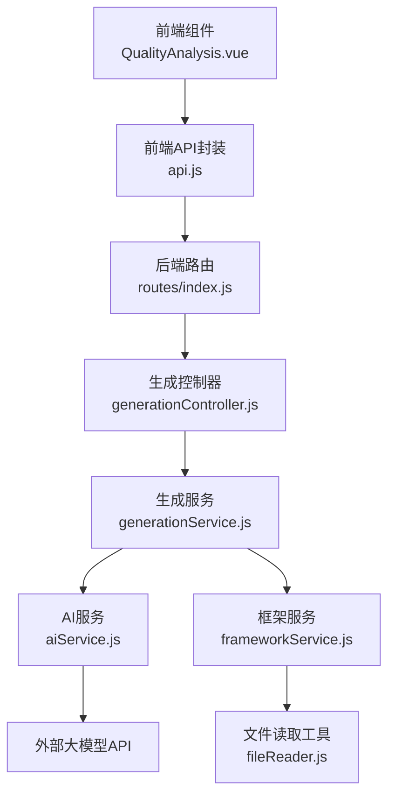
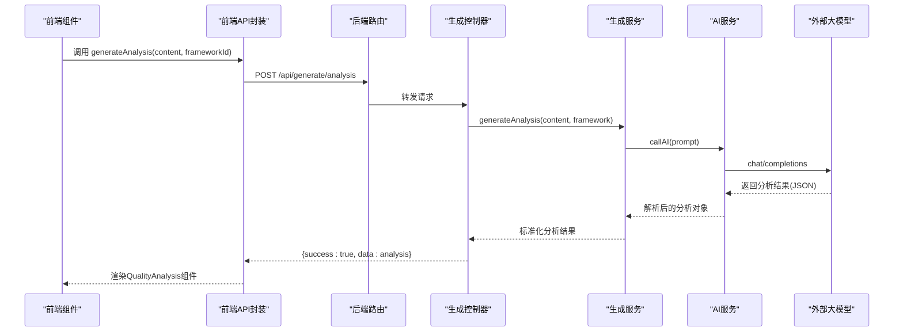
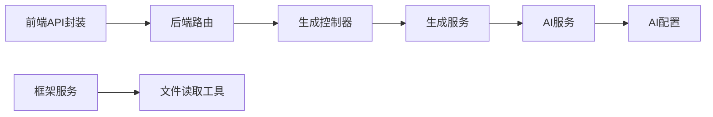

# 质量分析接口

<cite>
**本文引用的文件**
- [backend/src/controllers/generationController.js](file://backend/src/controllers/generationController.js)
- [backend/src/services/generationService.js](file://backend/src/services/generationService.js)
- [backend/src/services/aiService.js](file://backend/src/services/aiService.js)
- [backend/src/routes/index.js](file://backend/src/routes/index.js)
- [frontend/src/services/api.js](file://frontend/src/services/api.js)
- [frontend/src/components/QualityAnalysis.vue](file://frontend/src/components/QualityAnalysis.vue)
- [backend/src/config/ai.config.js](file://backend/src/config/ai.config.js)
- [backend/src/controllers/analysisController.js](file://backend/src/controllers/analysisController.js)
- [backend/src/services/keywordService.js](file://backend/src/services/keywordService.js)
- [backend/src/controllers/frameworkController.js](file://backend/src/controllers/frameworkController.js)
- [backend/src/services/frameworkService.js](file://backend/src/services/frameworkService.js)
- [backend/src/utils/fileReader.js](file://backend/src/utils/fileReader.js)
</cite>

## 目录
1. [简介](#简介)
2. [项目结构](#项目结构)
3. [核心组件](#核心组件)
4. [架构总览](#架构总览)
5. [详细组件分析](#详细组件分析)
6. [依赖关系分析](#依赖关系分析)
7. [性能考量](#性能考量)
8. [故障排查指南](#故障排查指南)
9. [结论](#结论)
10. [附录](#附录)

## 简介
本文件为“质量分析接口”的完整API文档，聚焦于POST /api/generate/analysis接口的规范与实现。该接口用于对已生成的内容进行质量评估，输出包含钩子分析、框架原理、内容结构与吸引力评估等维度的分析报告。文档同时阐述AI质量评估算法的指标体系、评分标准与优化建议生成机制，并提供典型内容类型的分析示例与适用场景说明。

## 项目结构
后端采用Express路由与控制器-服务分层架构；前端通过Axios封装API调用；AI服务通过外部大模型接口完成分析任务。质量分析流程由前端触发，经后端路由与控制器，调用生成服务构造提示词，再由AI服务调用外部模型，最终返回结构化的分析结果。

图表来源
- [frontend/src/components/QualityAnalysis.vue](file://frontend/src/components/QualityAnalysis.vue#L1-L227)
- [frontend/src/services/api.js](file://frontend/src/services/api.js#L1-L40)
- [backend/src/routes/index.js](file://backend/src/routes/index.js#L1-L21)
- [backend/src/controllers/generationController.js](file://backend/src/controllers/generationController.js#L1-L100)
- [backend/src/services/generationService.js](file://backend/src/services/generationService.js#L1-L194)
- [backend/src/services/aiService.js](file://backend/src/services/aiService.js#L1-L55)
- [backend/src/services/frameworkService.js](file://backend/src/services/frameworkService.js#L1-L64)
- [backend/src/utils/fileReader.js](file://backend/src/utils/fileReader.js#L1-L200)

章节来源
- [backend/src/routes/index.js](file://backend/src/routes/index.js#L1-L21)
- [frontend/src/services/api.js](file://frontend/src/services/api.js#L1-L40)

## 核心组件
- 路由与控制器
  - 路由定义：在后端路由中注册POST /api/generate/analysis，交由生成控制器处理。
  - 控制器职责：校验请求参数（content与frameworkId），构造框架对象，调用生成服务执行分析，并返回统一JSON响应。
- 生成服务
  - 质量分析提示词：构造面向“为什么这是一篇好文章”的分析提示，要求返回JSON结构，包含钩子类型、框架原理、内容结构与吸引力评分等字段。
  - 解析与回退：若AI返回非JSON或解析失败，则使用内置回退策略生成标准化分析结果。
- AI服务
  - 外部模型调用：封装外部大模型API调用，统一请求头、超时与错误处理。
- 前端集成
  - API封装：提供generateAnalysis(content, frameworkId)方法，便于前端调用。
  - 结果渲染：QualityAnalysis组件负责展示分析结果，包含钩子、框架、结构与吸引力四个维度。

章节来源
- [backend/src/controllers/generationController.js](file://backend/src/controllers/generationController.js#L35-L64)
- [backend/src/services/generationService.js](file://backend/src/services/generationService.js#L114-L162)
- [backend/src/services/aiService.js](file://backend/src/services/aiService.js#L14-L53)
- [frontend/src/services/api.js](file://frontend/src/services/api.js#L32-L34)
- [frontend/src/components/QualityAnalysis.vue](file://frontend/src/components/QualityAnalysis.vue#L135-L143)

## 架构总览
POST /api/generate/analysis的调用序列如下：

图表来源
- [frontend/src/services/api.js](file://frontend/src/services/api.js#L32-L34)
- [backend/src/routes/index.js](file://backend/src/routes/index.js#L15)
- [backend/src/controllers/generationController.js](file://backend/src/controllers/generationController.js#L35-L64)
- [backend/src/services/generationService.js](file://backend/src/services/generationService.js#L114-L162)
- [backend/src/services/aiService.js](file://backend/src/services/aiService.js#L14-L53)

## 详细组件分析

### API规范：POST /api/generate/analysis
- 请求方法与路径
  - 方法：POST
  - 路径：/api/generate/analysis
- 请求头
  - Content-Type: application/json
- 请求体参数
  - content: 对象，必填
    - title: 字符串，标题
    - body: 字符串，正文
    - images: 数组，图片描述
    - tags: 数组，话题标签
  - frameworkId: 字符串，必填，框架标识
- 响应体
  - success: 布尔，请求是否成功
  - data: 对象，分析结果
    - hook: 钩子分析
      - type: 钩子类型
      - effectiveness: 有效性（高/中/低）
      - reason: 有效性的解释
    - framework: 框架原理
      - name: 框架名称
      - strengths: 框架优势列表
      - whyEffective: 框架有效性的解释
    - structure: 内容结构
      - hasClearFlow: 是否逻辑清晰
      - hasInteraction: 是否包含互动引导
    - appeal: 吸引力评估
      - emotionScore: 情感感染力评分（1-10）
      - valueScore: 实用价值评分（1-10）
      - actionScore: 行动引导评分（1-10）
      - overallRating: 综合评价
      - reason: 综合评价理由
- 错误响应
  - 当缺少必要参数或分析过程中发生异常时，返回包含error字段的JSON对象

章节来源
- [backend/src/controllers/generationController.js](file://backend/src/controllers/generationController.js#L35-L64)
- [backend/src/services/generationService.js](file://backend/src/services/generationService.js#L35-L60)
- [frontend/src/services/api.js](file://frontend/src/services/api.js#L32-L34)

### AI质量评估算法与指标体系
- 分析提示词设计
  - 针对“为什么这是一篇好文章”这一核心问题，提示词要求AI从钩子、框架、结构与吸引力四个维度进行分析，并以JSON格式输出。
- 指标与评分标准
  - 钩子分析：类型、有效性与解释
  - 框架原理：框架名称、优势与有效性解释
  - 内容结构：逻辑清晰度与互动引导
  - 吸引力评估：情感感染力、实用价值、行动引导三项评分（1-10），以及综合评价与理由
- 评分与解释
  - 评分来源于AI对内容的综合判断，解释来自提示词中要求的“为什么有效/为什么这是一篇好文章”的深入分析
- 回退机制
  - 若AI返回非JSON或解析失败，生成服务将使用内置回退策略，确保返回结构化的分析结果，避免前端渲染异常

章节来源
- [backend/src/services/generationService.js](file://backend/src/services/generationService.js#L35-L60)
- [backend/src/services/generationService.js](file://backend/src/services/generationService.js#L114-L162)

### 优化建议生成机制
- 建议来源
  - 结构维度的建议字段在前端组件中预留，但当前生成服务未在回退策略中填充该字段。可在后续迭代中完善，使AI直接输出建议，或在回退策略中补充通用建议模板。
- 建议类型
  - 针对结构评分与互动引导的改进建议，结合框架原理与内容特点，提供可执行的优化方向

章节来源
- [frontend/src/components/QualityAnalysis.vue](file://frontend/src/components/QualityAnalysis.vue#L88-L88)
- [backend/src/services/generationService.js](file://backend/src/services/generationService.js#L164-L192)

### 典型分析示例
以下示例展示不同类型内容的分析结果概览（示例仅用于说明字段结构与分析维度，不展示具体内容）：
- 示例A：种草推荐类内容
  - 钩子：悬念提问/痛点直击/猎奇揭秘/直接切入
  - 框架：小红书爆款框架
  - 结构：逻辑清晰、包含互动引导
  - 吸引力：情感感染力较高、实用价值高、行动引导明确
- 示例B：干货分享类内容
  - 钩子：直接切入
  - 框架：SCQA模型框架
  - 结构：逻辑清晰、互动引导一般
  - 吸引力：实用价值高、情感感染力中等、行动引导中等
- 示例C：个人成长类内容
  - 钩子：情绪价值
  - 框架：黄金圈法则框架
  - 结构：逻辑清晰、互动引导明显
  - 吸引力：情感感染力高、实用价值中等、行动引导高

章节来源
- [backend/src/services/generationService.js](file://backend/src/services/generationService.js#L114-L162)
- [frontend/src/components/QualityAnalysis.vue](file://frontend/src/components/QualityAnalysis.vue#L28-L126)

### 适用场景与准确性说明
- 适用场景
  - 小红书图文内容质量评估
  - 框架匹配与内容结构优化
  - 吸引力与互动引导的量化评估
- 准确性说明
  - 评分与解释由外部大模型生成，受提示词设计与模型能力影响
  - 当AI返回非JSON或解析失败时，系统会使用回退策略保证可用性，但分析深度可能降低

章节来源
- [backend/src/services/aiService.js](file://backend/src/services/aiService.js#L14-L53)
- [backend/src/services/generationService.js](file://backend/src/services/generationService.js#L114-L162)

## 依赖关系分析
- 组件耦合
  - 控制器依赖生成服务；生成服务依赖AI服务；前端API封装依赖后端路由与控制器
- 外部依赖
  - 大模型API：通过配置文件集中管理基础URL、模型与请求头
- 框架服务
  - 框架服务用于读取本地框架文件并提取描述，为分析提供上下文支持

图表来源
- [backend/src/controllers/generationController.js](file://backend/src/controllers/generationController.js#L1-L100)
- [backend/src/services/generationService.js](file://backend/src/services/generationService.js#L1-L194)
- [backend/src/services/aiService.js](file://backend/src/services/aiService.js#L1-L55)
- [backend/src/config/ai.config.js](file://backend/src/config/ai.config.js#L1-L18)
- [frontend/src/services/api.js](file://frontend/src/services/api.js#L1-L40)
- [backend/src/routes/index.js](file://backend/src/routes/index.js#L1-L21)
- [backend/src/services/frameworkService.js](file://backend/src/services/frameworkService.js#L1-L64)
- [backend/src/utils/fileReader.js](file://backend/src/utils/fileReader.js#L1-L200)

章节来源
- [backend/src/controllers/generationController.js](file://backend/src/controllers/generationController.js#L1-L100)
- [backend/src/services/generationService.js](file://backend/src/services/generationService.js#L1-L194)
- [backend/src/services/aiService.js](file://backend/src/services/aiService.js#L1-L55)
- [backend/src/config/ai.config.js](file://backend/src/config/ai.config.js#L1-L18)
- [frontend/src/services/api.js](file://frontend/src/services/api.js#L1-L40)
- [backend/src/routes/index.js](file://backend/src/routes/index.js#L1-L21)
- [backend/src/services/frameworkService.js](file://backend/src/services/frameworkService.js#L1-L64)
- [backend/src/utils/fileReader.js](file://backend/src/utils/fileReader.js#L1-L200)

## 性能考量
- 超时与稳定性
  - AI服务设置了较长的超时时间，以应对大模型响应延迟
- 响应格式一致性
  - 生成服务对AI返回的JSON进行严格解析，解析失败时使用回退策略，确保前端渲染稳定
- 前端渲染优化
  - 使用折叠面板与评分组件，减少DOM复杂度，提升用户体验

章节来源
- [backend/src/services/aiService.js](file://backend/src/services/aiService.js#L35-L53)
- [backend/src/services/generationService.js](file://backend/src/services/generationService.js#L70-L93)
- [frontend/src/components/QualityAnalysis.vue](file://frontend/src/components/QualityAnalysis.vue#L135-L143)

## 故障排查指南
- 参数缺失
  - 当content或frameworkId缺失时，控制器返回400错误与错误信息
- AI服务异常
  - 当外部大模型API调用失败时，AI服务记录错误日志并抛出异常，控制器捕获后返回500错误
- JSON解析失败
  - 当AI返回非JSON或解析失败时，生成服务使用回退策略返回标准化分析结果
- 前端渲染问题
  - 若分析结果字段缺失，前端组件具备基本的占位与容错展示

章节来源
- [backend/src/controllers/generationController.js](file://backend/src/controllers/generationController.js#L35-L64)
- [backend/src/services/aiService.js](file://backend/src/services/aiService.js#L45-L53)
- [backend/src/services/generationService.js](file://backend/src/services/generationService.js#L114-L162)
- [frontend/src/components/QualityAnalysis.vue](file://frontend/src/components/QualityAnalysis.vue#L135-L143)

## 结论
POST /api/generate/analysis接口通过清晰的参数规范与结构化响应，实现了对小红书内容的质量评估。其算法围绕钩子、框架、结构与吸引力四大维度展开，结合外部大模型的能力与回退策略，确保在多数情况下提供稳定且可解释的分析结果。建议在未来迭代中完善结构维度的优化建议字段，进一步提升分析结果的实用性与可操作性。

## 附录
- 相关路由与控制器
  - /api/generate/analysis -> generationController.generateAnalysis
- 前端调用入口
  - generationAPI.generateAnalysis(content, frameworkId)
- 前端展示组件
  - QualityAnalysis.vue

章节来源
- [backend/src/routes/index.js](file://backend/src/routes/index.js#L15)
- [frontend/src/services/api.js](file://frontend/src/services/api.js#L32-L34)
- [frontend/src/components/QualityAnalysis.vue](file://frontend/src/components/QualityAnalysis.vue#L135-L143)