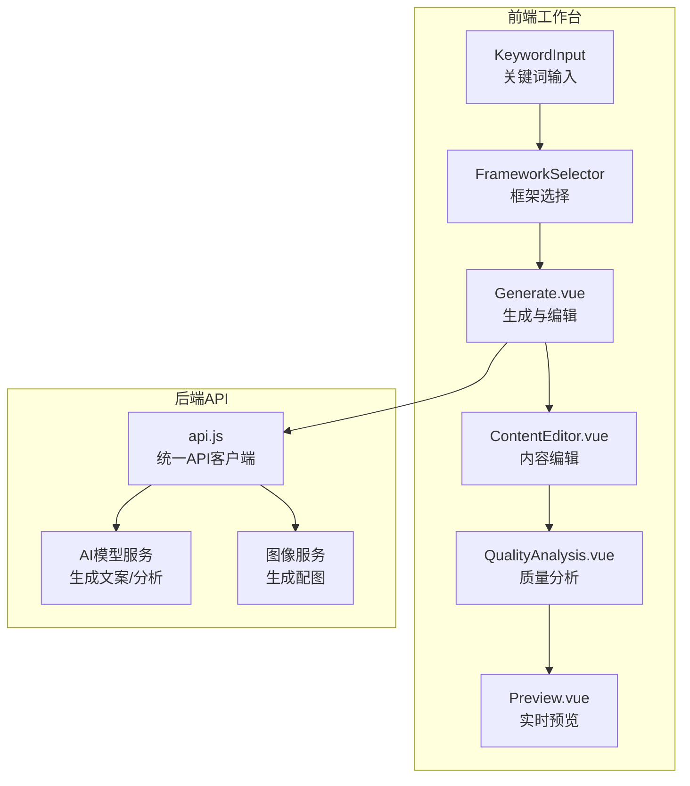
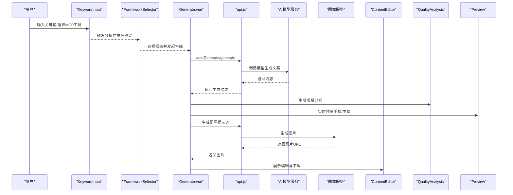
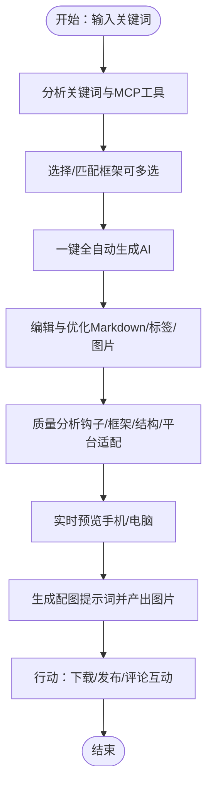
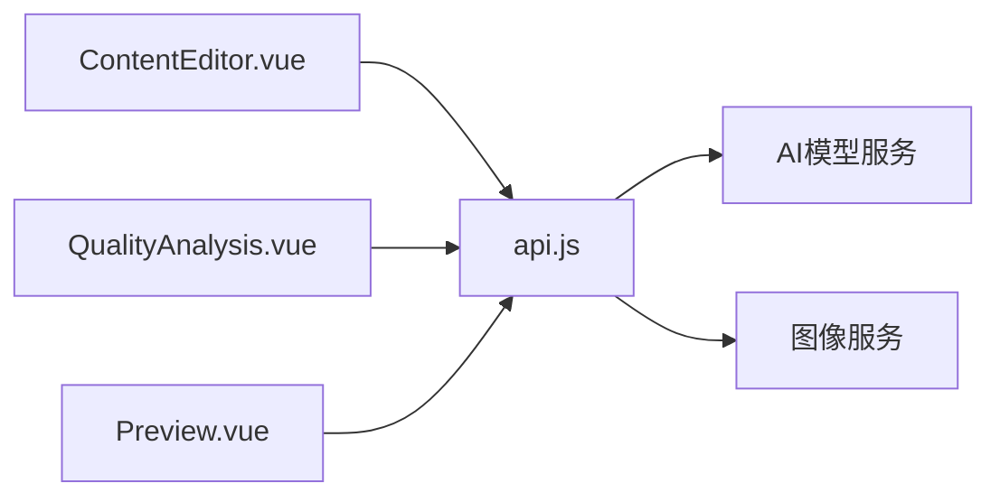

# AIDA模型框架

<cite>
**本文引用的文件**
- [AIDA模型框架.md](file://AIDA模型框架.md)
- [README.md](file://README.md)
- [小红书文案图文生成工具产品规划.md](file://小红书文案图文生成工具产品规划.md)
- [小红书爆款框架.md](file://小红书爆款框架.md)
- [src/views/Generate.vue](file://src/views/Generate.vue)
- [frontend/src/views/Generate.vue](file://frontend/src/views/Generate.vue)
- [src/components/ContentEditor.vue](file://src/components/ContentEditor.vue)
- [src/components/QualityAnalysis.vue](file://src/components/QualityAnalysis.vue)
- [src/components/FrameworkSelector.vue](file://src/components/FrameworkSelector.vue)
- [src/services/api.js](file://src/services/api.js)
- [src/components/KeywordInput.vue](file://src/components/KeywordInput.vue)
- [src/components/Preview.vue](file://src/components/Preview.vue)
- [docs/GUIDE.md](file://docs/GUIDE.md)
- [docs/EXAMPLES.md](file://docs/EXAMPLES.md)
</cite>

## 目录
1. [简介](#简介)
2. [项目结构](#项目结构)
3. [核心组件](#核心组件)
4. [架构总览](#架构总览)
5. [详细组件分析](#详细组件分析)
6. [依赖关系分析](#依赖关系分析)
7. [性能考量](#性能考量)
8. [故障排查指南](#故障排查指南)
9. [结论](#结论)
10. [附录](#附录)

## 简介
本文件围绕AIDA模型在小红书内容创作中的应用展开，结合项目现有文档与前端实现，系统阐述“注意—兴趣—欲望—行动”四阶段在小红书平台的落地方法。文档不仅提供理论拆解与实践技巧，还结合项目中的“智能文案生成”“质量分析”“实时预览”等能力，给出可操作的创作流程与优化建议。

## 项目结构
项目采用前后端分离架构，前端使用Vue 3 + Vite，后端通过统一API客户端对接AI与图像服务。工作台提供关键词输入、框架选择、内容生成、质量分析与预览等功能，覆盖AIDA各阶段的创作与优化闭环。

图表来源
- [src/views/Generate.vue](file://src/views/Generate.vue#L1-L668)
- [frontend/src/views/Generate.vue](file://frontend/src/views/Generate.vue#L1-L189)
- [src/components/KeywordInput.vue](file://src/components/KeywordInput.vue#L1-L265)
- [src/components/FrameworkSelector.vue](file://src/components/FrameworkSelector.vue#L1-L241)
- [src/components/ContentEditor.vue](file://src/components/ContentEditor.vue#L1-L418)
- [src/components/QualityAnalysis.vue](file://src/components/QualityAnalysis.vue#L1-L138)
- [src/components/Preview.vue](file://src/components/Preview.vue#L1-L411)
- [src/services/api.js](file://src/services/api.js#L1-L454)

章节来源
- [README.md](file://README.md#L1-L76)
- [小红书文案图文生成工具产品规划.md](file://小红书文案图文生成工具产品规划.md#L1-L130)

## 核心组件
- 关键词输入与MCP工具选择：支持热词推荐与工具开关，便于结合“联网搜索/笔记爬虫/电商监控/趋势分析”等能力进行内容前置分析。
- 框架选择：支持多框架并行选择，便于在AIDA之外叠加“情感共鸣/干货分享/种草推荐/生活方式”等框架，形成组合拳。
- 内容生成与编辑：支持流式生成、Markdown预览、话题标签管理、图片下载与预览。
- 质量分析：从钩子、框架原理、内容结构、平台适配四个维度进行诊断，直观呈现AIDA各阶段的落地情况。
- 实时预览：双端（手机/电脑）模拟小红书发布页，支持互动模拟与图片下载。

章节来源
- [src/components/KeywordInput.vue](file://src/components/KeywordInput.vue#L1-L265)
- [src/components/FrameworkSelector.vue](file://src/components/FrameworkSelector.vue#L1-L241)
- [src/views/Generate.vue](file://src/views/Generate.vue#L1-L668)
- [frontend/src/views/Generate.vue](file://frontend/src/views/Generate.vue#L1-L189)
- [src/components/ContentEditor.vue](file://src/components/ContentEditor.vue#L1-L418)
- [src/components/QualityAnalysis.vue](file://src/components/QualityAnalysis.vue#L1-L138)
- [src/components/Preview.vue](file://src/components/Preview.vue#L1-L411)

## 架构总览
AIDA在本项目中的实现以“关键词输入”为起点，经“框架匹配/选择”进入“内容生成”，随后通过“质量分析”与“实时预览”进行AIDA四阶段的逐项校验与优化，最终进入“图片生成与发布准备”。

图表来源
- [src/views/Generate.vue](file://src/views/Generate.vue#L257-L324)
- [src/services/api.js](file://src/services/api.js#L250-L364)
- [src/services/api.js](file://src/services/api.js#L369-L449)
- [src/components/ContentEditor.vue](file://src/components/ContentEditor.vue#L209-L227)
- [src/components/Preview.vue](file://src/components/Preview.vue#L146-L166)

## 详细组件分析

### AIDA四阶段在小红书的应用要点
- 注意（Attention）：封面与标题需在0.5秒内抓住用户；标题长度≤15字，包含数字/对比/情绪/悬念/结果等吸睛元素；封面强调高对比度、情绪脸庞、关键信息与真实感。
- 兴趣（Interest）：正文第一人称口语化，建立情感连接；信息密度控制在3分钟阅读时长（约200-300字），分块呈现，重点标注；提供可执行价值（避坑指南、必备清单、实操教程、测评对比、省钱攻略）。
- 欲望（Desire）：通过前后对比图、使用后的心理变化、稀缺感与情感共鸣，强化“我需要/我想成为那样”的动机。
- 行动（Action）：结尾引导低门槛互动（点赞/收藏）、评论互动、关注与分享；发布后及时回复评论，制造讨论热度。

章节来源
- [AIDA模型框架.md](file://AIDA模型框架.md#L18-L99)
- [小红书爆款框架.md](file://小红书爆款框架.md#L21-L134)

### 关键词输入与MCP工具
- 支持热词推荐与工具开关，便于结合“联网搜索/笔记爬虫/电商监控/趋势分析”等能力进行内容前置分析，提升AIDA第二阶段的兴趣度与价值承诺。
- 输入框支持回车触发分析，具备“语音识别功能开发中”提示，后续可拓展语音输入。

章节来源
- [src/components/KeywordInput.vue](file://src/components/KeywordInput.vue#L109-L147)
- [小红书文案图文生成工具产品规划.md](file://小红书文案图文生成工具产品规划.md#L10-L24)

### 框架选择与AIDA融合
- 支持多框架并行选择，便于在AIDA之外叠加“情感共鸣/干货分享/种草推荐/生活方式”等框架，形成组合拳。
- 默认选中首个框架，便于快速开始；也可根据关键词分析结果进行调整。

章节来源
- [src/components/FrameworkSelector.vue](file://src/components/FrameworkSelector.vue#L135-L140)
- [小红书文案图文生成工具产品规划.md](file://小红书文案图文生成工具产品规划.md#L15-L24)

### 内容生成与编辑（AIDA四阶段可视化）
- 支持Markdown预览与编辑，便于在AIDA各阶段之间进行快速迭代。
- 提供话题标签管理、图片建议展示与下载，便于在欲望与行动阶段完善视觉与互动引导。
- 支持“重新生成”“人工审批并发布”等流程节点，确保AIDA最终行动阶段的可控发布。

章节来源
- [src/components/ContentEditor.vue](file://src/components/ContentEditor.vue#L1-L418)
- [src/views/Generate.vue](file://src/views/Generate.vue#L305-L307)

### 质量分析（AIDA四阶段诊断）
- 钩子分析：评估开头抓注意力效果与评分。
- 框架原理：说明采用的思维模型及其优势（如AIDA）。
- 内容结构：分析逻辑层次、承接性与互动引导建议。
- 平台适配：给出小红书适配度评分与关键维度标签。

章节来源
- [src/components/QualityAnalysis.vue](file://src/components/QualityAnalysis.vue#L32-L108)
- [src/services/api.js](file://src/services/api.js#L327-L363)

### 实时预览（AIDA行动阶段验证）
- 双端预览：手机端模拟小红书App发布页，电脑端适合整体排版与细节查看。
- 互动模拟：点赞/收藏/评论按钮与数值模拟，便于验证行动引导的有效性。
- 图片下载：解决跨域问题的后端代理下载，便于快速保存与二次加工。

章节来源
- [src/components/Preview.vue](file://src/components/Preview.vue#L22-L131)
- [src/components/Preview.vue](file://src/components/Preview.vue#L146-L166)

### 生成流程与AIDA映射

图表来源
- [src/views/Generate.vue](file://src/views/Generate.vue#L257-L324)
- [src/services/api.js](file://src/services/api.js#L250-L364)
- [src/services/api.js](file://src/services/api.js#L369-L449)

## 依赖关系分析
- 前端组件依赖统一API客户端，负责与AI模型与图像服务通信。
- 生成流程中，前端通过API触发AI生成与质量分析，再调用图像服务生成配图。
- 质量分析与预览相互配合，前者提供AIDA四阶段诊断，后者提供视觉与互动验证。

图表来源
- [src/components/ContentEditor.vue](file://src/components/ContentEditor.vue#L197-L237)
- [src/components/QualityAnalysis.vue](file://src/components/QualityAnalysis.vue#L112-L118)
- [src/components/Preview.vue](file://src/components/Preview.vue#L134-L138)
- [src/services/api.js](file://src/services/api.js#L1-L454)

章节来源
- [src/services/api.js](file://src/services/api.js#L87-L177)
- [src/services/api.js](file://src/services/api.js#L250-L364)
- [src/services/api.js](file://src/services/api.js#L369-L449)

## 性能考量
- 流式生成：前端监听AI流式输出，逐步更新编辑器内容，降低等待焦虑，提升AIDA注意阶段的停留时长。
- 图片生成并发：批量生成图片时采用并发请求，缩短配图等待时间，保障行动阶段的发布节奏。
- 预览优化：双端预览采用骨架屏与懒加载，减少首屏渲染压力，提升用户体验。

章节来源
- [src/views/Generate.vue](file://src/views/Generate.vue#L282-L294)
- [src/services/api.js](file://src/services/api.js#L377-L410)
- [src/components/Preview.vue](file://src/components/Preview.vue#L334-L335)

## 故障排查指南
- AI生成失败：检查API密钥与模型配置，确认网络连通性；必要时降低温度与top_p参数以提升稳定性。
- 图片生成异常：检查图像服务鉴权与模型参数，确认返回格式正确；若接口异常，前端会捕获错误并提示。
- 跨域下载失败：使用后端代理下载图片，避免浏览器跨域限制；若仍失败，检查代理路由与网络状态。
- 预览空白：确认内容与图片数据已传入预览组件；检查Markdown渲染与图片URL有效性。

章节来源
- [src/services/api.js](file://src/services/api.js#L94-L177)
- [src/services/api.js](file://src/services/api.js#L377-L410)
- [src/components/Preview.vue](file://src/components/Preview.vue#L146-L166)

## 结论
本项目以AIDA模型为核心，结合小红书平台特性，提供从关键词到内容生成、质量分析与实时预览的一体化工作流。通过框架选择、钩子分析、平台适配与互动引导的闭环优化，帮助创作者在碎片化信息环境中高效产出高转化内容。

## 附录
- 快速开始与开发指南：参阅开发指南与示例文档，了解页面创建、组件使用与构建发布流程。
- 小红书爆款框架要点：结合封面钩子、标题吸睛、情绪价值、实用信息与互动引导，确保AIDA四阶段在平台内的高适配度。

章节来源
- [docs/GUIDE.md](file://docs/GUIDE.md#L18-L460)
- [docs/EXAMPLES.md](file://docs/EXAMPLES.md#L1-L464)
- [小红书爆款框架.md](file://小红书爆款框架.md#L195-L225)