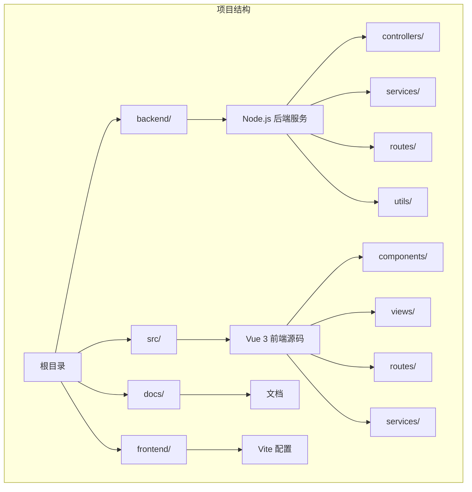
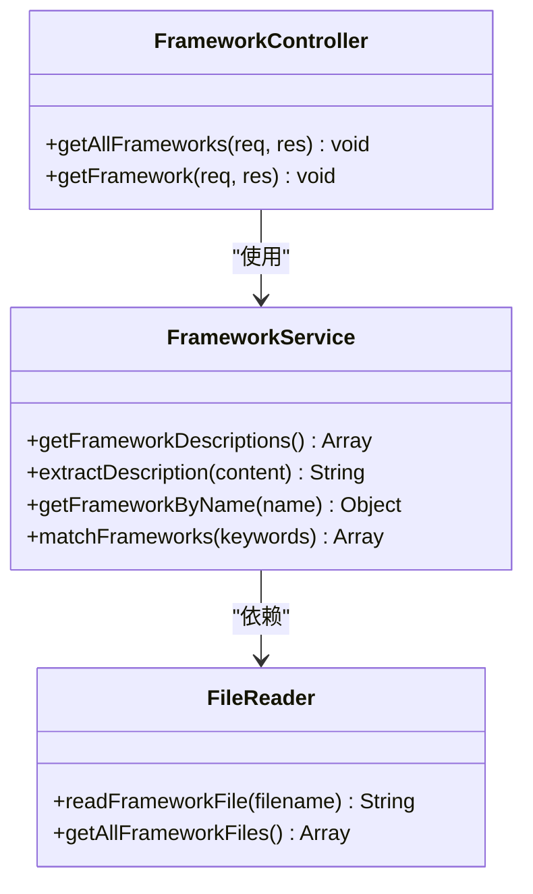
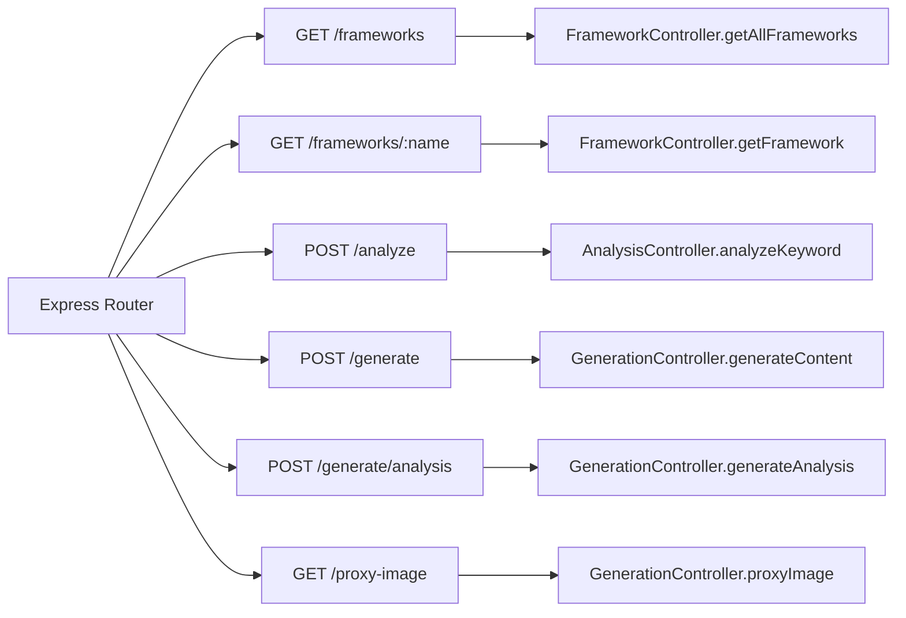
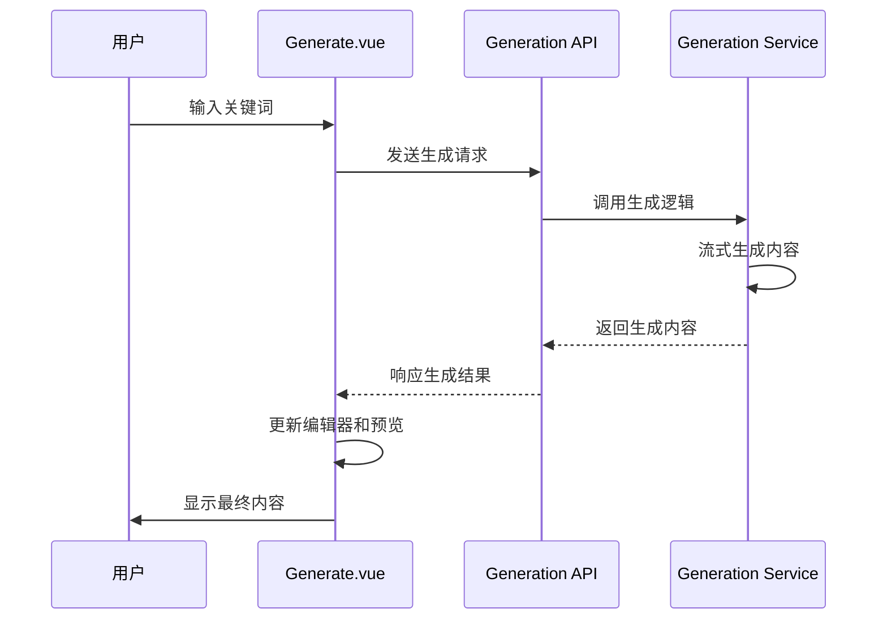
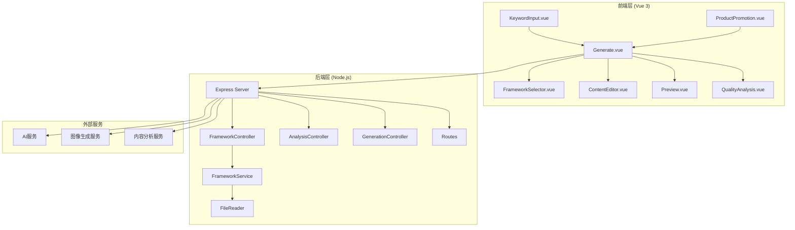
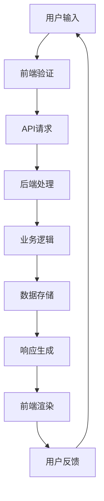
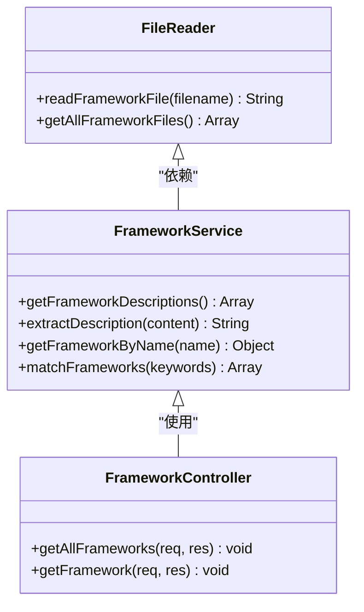
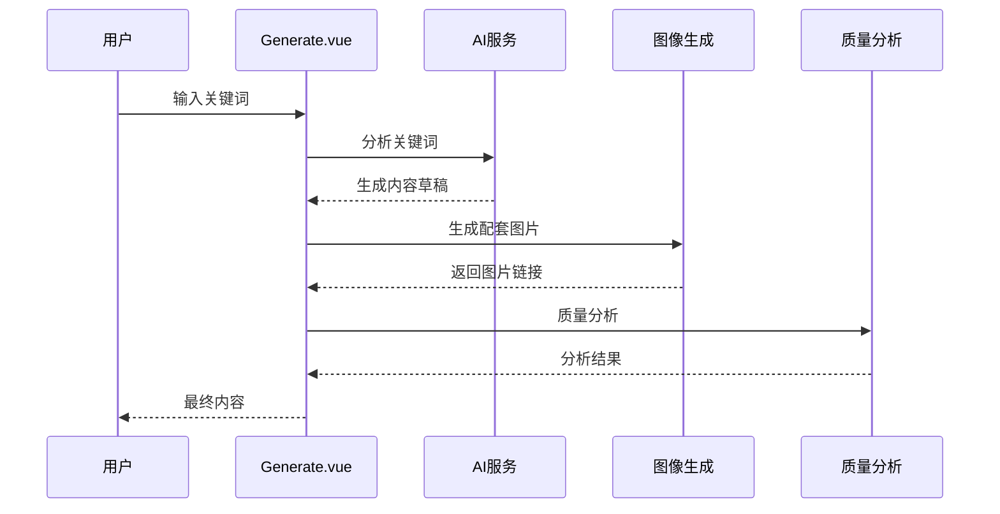
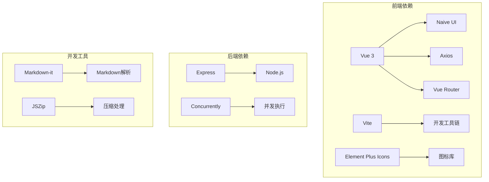

# SCQA模型框架

<cite>
**本文档引用的文件**
- [SCQA模型框架.md](file://SCQA模型框架.md)
- [README.md](file://README.md)
- [小红书爆款框架.md](file://小红书爆款框架.md)
- [backend/src/controllers/frameworkController.js](file://backend/src/controllers/frameworkController.js)
- [backend/src/services/frameworkService.js](file://backend/src/services/frameworkService.js)
- [backend/src/routes/index.js](file://backend/src/routes/index.js)
- [backend/src/utils/fileReader.js](file://backend/src/utils/fileReader.js)
- [src/views/Generate.vue](file://src/views/Generate.vue)
- [src/components/FrameworkSelector.vue](file://src/components/FrameworkSelector.vue)
- [package.json](file://package.json)
</cite>

## 目录
1. [简介](#简介)
2. [项目结构](#项目结构)
3. [核心组件](#核心组件)
4. [架构概览](#架构概览)
5. [详细组件分析](#详细组件分析)
6. [依赖关系分析](#依赖关系分析)
7. [性能考虑](#性能考虑)
8. [故障排除指南](#故障排除指南)
9. [结论](#结论)

## 简介

SCQA模型框架是基于麦肯锡咨询公司经典方法论的结构化叙事模型，专门用于内容创作和故事讲述。该框架通过情境(Situation)、冲突(Complication)、问题(Question)、答案(Answer)四个环节，将复杂问题系统化呈现，特别适用于小红书等社交媒体平台的内容创作。

### 框架概述

SCQA模型的核心逻辑简洁而有力：
```
情境 → 冲突 → 问题 → 答案
(Situation) (Complication) (Question) (Answer)
```

**为什么有效**：符合人类大脑"识别问题-寻找答案"的认知习惯，将抽象问题转化为具体可理解的叙事结构。

### 四个阶段详解

#### 1. 情境—建立共识与背景
**核心任务**：描述一个大家都能认同的现状或场景，让用户产生"是的，就是这样"的共鸣。

**思考方式**：
- 目标群体的日常是什么状态？
- 有什么普遍存在的现象值得注意？
- 如何用具体细节让情境真实可信？

**小红书应用**：
- 从用户熟悉的生活细节切入
- 用第一人称增强代入感
- 描述大多数人都会遇到的场景

#### 2. 冲突—制造张力与痛点
**核心任务**：揭示情境中的问题、矛盾或挑战，让用户感受到"这不合理"或"我需要改变"。

**思考方式**：
- 这个现状背后隐藏了什么真实问题？
- 用户在意的点是什么痛点？
- 表面现象和实际情况有什么反差？

**小红书应用**：
- 用"vs"、"真的吗"等词汇制造冲突
- 揭示大多数人的误区
- 设置情感矛盾点（期待VS现实）

#### 3. 问题—明确挑战与方向
**核心任务**：从冲突中提炼出关键问题，引导用户思考"我该怎么做"。

**思考方式**：
- 用户现在最迫切想知道什么？
- 有什么核心疑惑需要解答？
- 如何将复杂问题简化为一个核心问句？

**小红书应用**：
- 用反问句强化代入感
- 提出具体可执行的问题
- 制造"有答案就解决问题"的期待

#### 4. 答案—提供方案与价值
**核心任务**：给出清晰、可执行的解决方案，并证明其有效性。

**思考方式**：
- 方案是否简便易懂？
- 如何证明方案真的有效？
- 用户执行后能获得什么结果？

**小红书应用**：
- 用图片/清单总结关键步骤
- 展示实际效果的对比图
- 提附件资源图（思维导图、表格）

## 项目结构

该项目是一个前后端分离的Vue 3应用程序，专门为小红书内容创作者提供智能图文生成工具。系统采用模块化设计，包含多个核心框架和组件。



**图表来源**
- [README.md](file://README.md#L13-L22)
- [package.json](file://package.json#L1-L32)

### 核心功能模块

项目采用前后端分离架构，后端提供RESTful API服务，前端使用Vue 3构建响应式用户界面。

**后端技术栈**：
- Node.js + Express：构建RESTful API
- 文件读取：动态加载框架文档
- 路由管理：统一API接口管理

**前端技术栈**：
- Vue 3 + Vite：现代前端开发框架
- Naive UI：企业级UI组件库
- Axios：HTTP客户端库
- Vue Router：前端路由管理

**章节来源**
- [README.md](file://README.md#L1-L76)
- [package.json](file://package.json#L15-L31)

## 核心组件

### 框架控制器 (FrameworkController)

框架控制器负责处理与内容框架相关的HTTP请求，提供框架列表查询和单个框架详情获取功能。



**图表来源**
- [backend/src/controllers/frameworkController.js](file://backend/src/controllers/frameworkController.js#L1-L49)
- [backend/src/services/frameworkService.js](file://backend/src/services/frameworkService.js#L9-L64)
- [backend/src/utils/fileReader.js](file://backend/src/utils/fileReader.js#L9-L49)

### 框架服务 (FrameworkService)

框架服务是核心业务逻辑层，负责处理框架文档的读取、解析和匹配功能。

**主要功能**：
1. 获取所有框架的简要描述
2. 提取框架内容摘要
3. 根据名称查找特定框架
4. 基于关键词匹配框架

**章节来源**
- [backend/src/services/frameworkService.js](file://backend/src/services/frameworkService.js#L9-L64)

### 路由管理 (Routes)

路由系统统一管理所有API端点，提供清晰的URL结构和HTTP方法映射。



**图表来源**
- [backend/src/routes/index.js](file://backend/src/routes/index.js#L9-L18)

**章节来源**
- [backend/src/routes/index.js](file://backend/src/routes/index.js#L1-L21)

### 内容生成视图 (Generate.vue)

内容生成视图是前端的核心组件，提供完整的创作工作台界面，支持实时预览和历史记录管理。



**图表来源**
- [src/views/Generate.vue](file://src/views/Generate.vue#L257-L324)

**章节来源**
- [src/views/Generate.vue](file://src/views/Generate.vue#L1-L668)

### 框架选择器 (FrameworkSelector.vue)

框架选择器组件允许用户从可用的创作框架中选择一个或多个，支持多选和实时预览。

**章节来源**
- [src/components/FrameworkSelector.vue](file://src/components/FrameworkSelector.vue#L1-L241)

## 架构概览

系统采用经典的三层架构设计，前后端分离，通过RESTful API进行通信。



**图表来源**
- [README.md](file://README.md#L13-L22)
- [backend/src/controllers/frameworkController.js](file://backend/src/controllers/frameworkController.js#L1-L49)
- [backend/src/services/frameworkService.js](file://backend/src/services/frameworkService.js#L1-L64)

### 数据流架构

系统的数据流遵循清晰的单向流动原则，确保每个组件职责明确。



## 详细组件分析

### SCQA模型应用策略

基于小红书平台的特点，SCQA模型需要进行特定的适配和优化。

#### 情境设置策略

**小红书特色应用**：
- 使用第一人称叙述增强真实感
- 结合用户熟悉的日常生活场景
- 强调共鸣和认同感

#### 冲突制造技巧

**平台适配要点**：
- 利用"vs"对比制造张力
- 揭示普遍存在的误区
- 设置情感落差（期待vs现实）

#### 问题提出方法

**用户导向设计**：
- 直接回答用户最关心的问题
- 使用反问句增强代入感
- 提供具体可执行的解决方案

#### 答案呈现方式

**视觉化表达**：
- 使用清单和步骤化展示
- 提供前后对比效果
- 配套图片和视觉元素

### 框架集成实现

系统通过文件读取机制动态加载框架文档，实现灵活的内容框架管理。



**图表来源**
- [backend/src/utils/fileReader.js](file://backend/src/utils/fileReader.js#L9-L49)
- [backend/src/services/frameworkService.js](file://backend/src/services/frameworkService.js#L9-L64)
- [backend/src/controllers/frameworkController.js](file://backend/src/controllers/frameworkController.js#L1-L49)

### 内容生成流程

系统提供完整的自动化内容生成流程，从关键词分析到最终内容输出。



**图表来源**
- [src/views/Generate.vue](file://src/views/Generate.vue#L257-L370)

**章节来源**
- [src/views/Generate.vue](file://src/views/Generate.vue#L257-L370)

## 依赖关系分析

### 技术栈依赖

项目采用现代化的技术栈，各组件之间依赖关系清晰。



**图表来源**
- [package.json](file://package.json#L15-L31)

### 组件耦合度分析

系统采用松耦合设计，各组件职责明确，便于维护和扩展。

**低耦合特征**：
- 控制器与服务层分离
- 组件间通过props和events通信
- API接口标准化

**高内聚特征**：
- 每个组件专注于单一职责
- 业务逻辑集中在服务层
- 数据处理逻辑封装

**章节来源**
- [package.json](file://package.json#L15-L31)

## 性能考虑

### 前端性能优化

系统在前端层面采用了多项性能优化策略：

**组件懒加载**：减少初始包体积，提升首屏加载速度
**虚拟滚动**：处理大量列表数据的渲染优化
**图片优化**：使用WebP格式和懒加载技术
**代码分割**：按需加载模块，避免不必要的资源传输

### 后端性能优化

后端服务通过以下方式保证响应性能：

**异步处理**：使用Promise和async/await处理耗时操作
**缓存策略**：对频繁访问的框架文档进行缓存
**流式响应**：支持内容的流式生成和传输
**并发控制**：合理控制同时处理的请求数量

## 故障排除指南

### 常见问题诊断

**框架加载失败**：
- 检查框架文件是否存在
- 验证文件编码格式
- 确认文件路径正确性

**API请求错误**：
- 检查网络连接状态
- 验证API端点可用性
- 查看服务器日志信息

**前端组件异常**：
- 检查Vue组件依赖
- 验证props传递正确性
- 确认事件监听器绑定

### 调试工具使用

**浏览器开发者工具**：
- Network面板监控API请求
- Console面板查看错误信息
- Elements面板检查DOM结构

**Node.js调试**：
- 使用node --inspect启动调试模式
- 利用Chrome DevTools进行远程调试
- 检查服务器端错误日志

**章节来源**
- [backend/src/utils/fileReader.js](file://backend/src/utils/fileReader.js#L13-L26)

## 结论

SCQA模型框架为小红书内容创作提供了系统化的结构化方法。通过情境建立、冲突制造、问题提出和答案提供的完整流程，能够有效提升内容的吸引力和转化率。

### 核心价值

1. **结构化思维**：帮助创作者建立清晰的内容逻辑
2. **用户导向**：始终围绕用户痛点和需求展开
3. **平台适配**：针对小红书特点进行专门优化
4. **可操作性强**：提供具体的实施技巧和模板

### 应用建议

- 在实际创作中，根据内容类型选择合适的SCQA变体
- 注重情感共鸣和真实感的营造
- 结合小红书平台的算法特点进行优化
- 持续测试和迭代，优化内容效果

通过系统地运用SCQA模型，内容创作者可以显著提升内容质量和用户参与度，实现更好的创作效果。