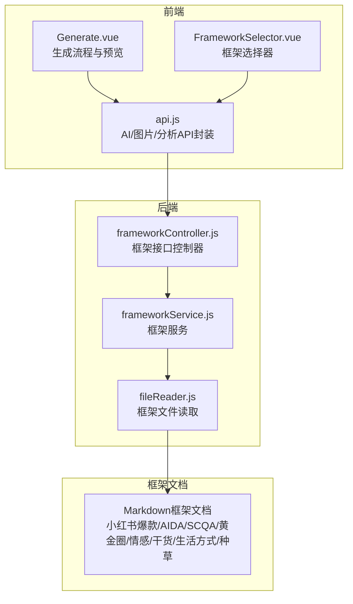
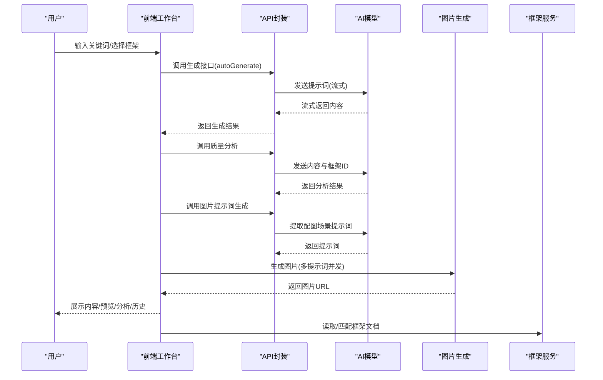
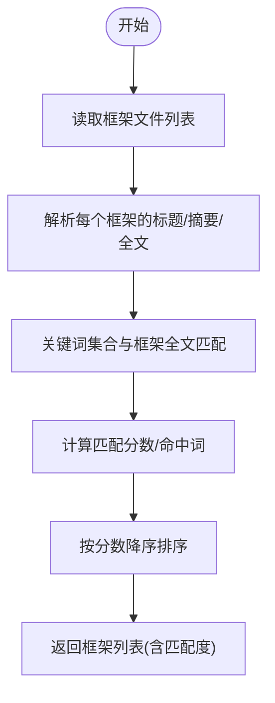
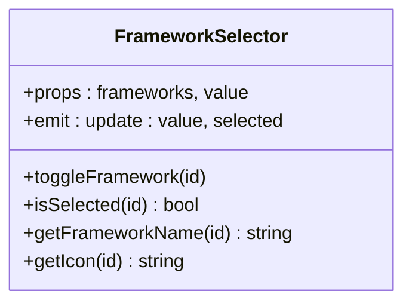
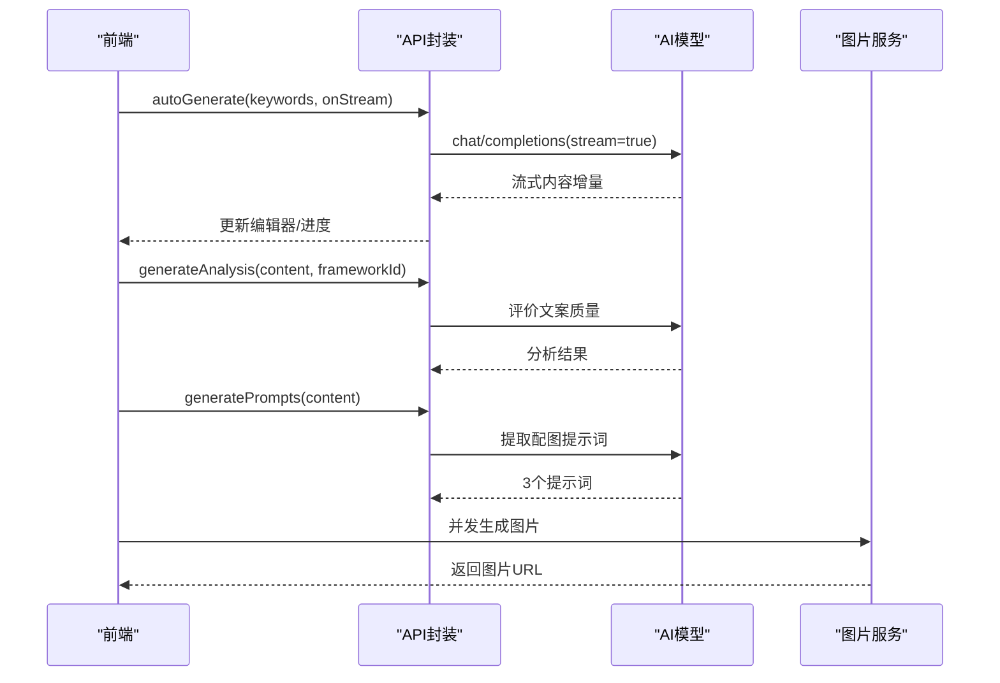
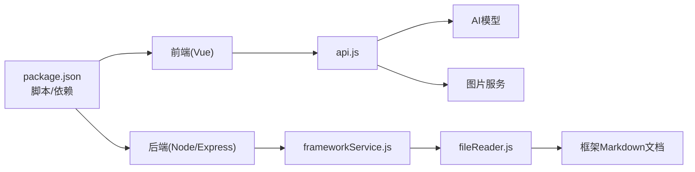

# 内容框架体系

<cite>
**本文引用的文件**
- [README.md](file://README.md)
- [小红书爆款框架.md](file://小红书爆款框架.md)
- [AIDA模型框架.md](file://AIDA模型框架.md)
- [SCQA模型框架.md](file://SCQA模型框架.md)
- [黄金圈法则框架.md](file://黄金圈法则框架.md)
- [干货分享框架.md](file://干货分享框架.md)
- [情感共鸣框架.md](file://情感共鸣框架.md)
- [生活方式分享框架.md](file://生活方式分享框架.md)
- [种草推荐框架.md](file://种草推荐框架.md)
- [backend/src/controllers/frameworkController.js](file://backend/src/controllers/frameworkController.js)
- [backend/src/services/frameworkService.js](file://backend/src/services/frameworkService.js)
- [backend/src/utils/fileReader.js](file://backend/src/utils/fileReader.js)
- [src/views/Generate.vue](file://src/views/Generate.vue)
- [src/components/FrameworkSelector.vue](file://src/components/FrameworkSelector.vue)
- [src/services/api.js](file://src/services/api.js)
- [package.json](file://package.json)
- [docs/GUIDE.md](file://docs/GUIDE.md)
</cite>

## 目录
1. [简介](#简介)
2. [项目结构](#项目结构)
3. [核心组件](#核心组件)
4. [架构总览](#架构总览)
5. [详细组件分析](#详细组件分析)
6. [依赖关系分析](#依赖关系分析)
7. [性能考量](#性能考量)
8. [故障排查指南](#故障排查指南)
9. [结论](#结论)
10. [附录](#附录)

## 简介
本文件系统化梳理小红书爆款文案生成工具的内容框架体系，围绕平台特性与用户心智，构建从“理论基础—适用场景—应用技巧—决策策略—案例实践—AI融合”的完整知识地图。工具内置多种经典营销与内容模型，包括小红书爆款框架、AIDA模型、SCQA模型、黄金圈法则、情感共鸣、干货分享、生活方式分享与种草推荐等，帮助创作者在“选题—结构—表达—转化”全流程中实现“高共鸣、高转化、高传播”。

## 项目结构
项目采用前后端分离架构，前端使用 Vue 3 + Vite，后端使用 Node.js + Express，核心模块包括：
- 前端工作台：关键词输入、框架选择、内容编辑、质量分析、实时预览与历史管理
- 后端服务：框架元数据读取、框架匹配、AI生成与分析、图片生成
- 框架文档：以 Markdown 文件形式沉淀各框架的理论、结构与实践要点

图表来源
- [src/views/Generate.vue](file://src/views/Generate.vue#L1-L668)
- [src/components/FrameworkSelector.vue](file://src/components/FrameworkSelector.vue#L1-L241)
- [src/services/api.js](file://src/services/api.js#L1-L454)
- [backend/src/controllers/frameworkController.js](file://backend/src/controllers/frameworkController.js#L1-L49)
- [backend/src/services/frameworkService.js](file://backend/src/services/frameworkService.js#L1-L64)
- [backend/src/utils/fileReader.js](file://backend/src/utils/fileReader.js#L1-L49)

章节来源
- [README.md](file://README.md#L1-L76)
- [package.json](file://package.json#L1-L32)

## 核心组件
- 框架文档库：内置8类框架文档，覆盖平台适配、结构模型、表达技巧与实践清单
- 框架服务：扫描并解析框架文档，提取标题、摘要与全文，支持关键词匹配排序
- 生成与分析：封装 AI 文案生成、质量分析与图片提示词抽取，支持流式渲染
- 前端工作台：提供关键词输入、框架选择、内容编辑、质量分析、实时预览与历史管理

章节来源
- [backend/src/services/frameworkService.js](file://backend/src/services/frameworkService.js#L1-L64)
- [backend/src/utils/fileReader.js](file://backend/src/utils/fileReader.js#L1-L49)
- [src/services/api.js](file://src/services/api.js#L1-L454)
- [src/views/Generate.vue](file://src/views/Generate.vue#L1-L668)
- [src/components/FrameworkSelector.vue](file://src/components/FrameworkSelector.vue#L1-L241)

## 架构总览
从用户输入关键词开始，系统通过“框架匹配—AI生成—质量分析—图片生成—实时预览—历史管理”的闭环流程，实现“所想即所得”的内容创作。

图表来源
- [src/views/Generate.vue](file://src/views/Generate.vue#L257-L324)
- [src/services/api.js](file://src/services/api.js#L250-L364)
- [backend/src/services/frameworkService.js](file://backend/src/services/frameworkService.js#L39-L58)

## 详细组件分析

### 框架文档与匹配机制
- 框架文档读取：后端扫描指定框架文件夹，读取 Markdown 内容并解析标题与摘要
- 框架描述生成：提取首若干行作为简介，用于前端展示
- 关键词匹配：将输入关键词拆分为词集合，统计与框架全文的命中数量，按匹配度排序

图表来源
- [backend/src/utils/fileReader.js](file://backend/src/utils/fileReader.js#L29-L45)
- [backend/src/services/frameworkService.js](file://backend/src/services/frameworkService.js#L9-L58)

章节来源
- [backend/src/utils/fileReader.js](file://backend/src/utils/fileReader.js#L1-L49)
- [backend/src/services/frameworkService.js](file://backend/src/services/frameworkService.js#L1-L64)

### 前端框架选择器
- 多选卡片式 UI，支持点击切换选中状态与关闭标签
- 当匹配度高于阈值时显示“推荐”徽章
- 默认选中首个框架，便于快速开始

图表来源
- [src/components/FrameworkSelector.vue](file://src/components/FrameworkSelector.vue#L76-L141)

章节来源
- [src/components/FrameworkSelector.vue](file://src/components/FrameworkSelector.vue#L1-L241)

### 生成与分析流程
- 自动生成：构造提示词，调用 AI 模型，支持流式返回，逐步更新编辑器与进度
- 质量分析：将生成内容与所选框架传入分析提示词，返回四维评估
- 图片生成：从内容提取3个配图提示词，异步并发生成图片，返回 URL 列表

图表来源
- [src/views/Generate.vue](file://src/views/Generate.vue#L257-L354)
- [src/services/api.js](file://src/services/api.js#L250-L449)

章节来源
- [src/views/Generate.vue](file://src/views/Generate.vue#L1-L668)
- [src/services/api.js](file://src/services/api.js#L1-L454)

### 框架总览与适用场景
以下为内置框架的理论基础、适用场景与应用要点概览（详见对应 Markdown 文件）：

- 小红书爆款框架
  - 理论基础：视觉钩子×情绪价值×实用信息×互动引导
  - 适用场景：通用图文、种草测评、技能分享、避坑指南、教程攻略
  - 应用技巧：封面高对比、标题含数字/对比/情绪；正文口语化、分块呈现、结尾互动引导
  - 章节来源
    - [小红书爆款框架.md](file://小红书爆款框架.md#L1-L225)

- AIDA模型
  - 理论基础：注意→兴趣→欲望→行动
  - 适用场景：种草推荐、技能教学、生活窍门、自我提升
  - 应用技巧：开头抓注意力、第二段场景代入、中间数据/案例/对比、结尾明确行动指令
  - 章节来源
    - [AIDA模型框架.md](file://AIDA模型框架.md#L1-L153)

- SCQA模型
  - 理论基础：情境→冲突→问题→答案
  - 适用场景：经验分享、技能教学、个人成长、产品测评、生活变好
  - 应用技巧：情境真实可信、冲突制造张力、问题聚焦可解、答案可执行
  - 章节来源
    - [SCQA模型框架.md](file://SCQA模型框架.md#L1-L180)

- 黄金圈法则
  - 理论基础：为什么→怎么做→是什么
  - 适用场景：个人品牌、方法论分享、价值主张、产品/服务价值传递、长期教育内容
  - 应用技巧：从“为什么”出发建立情感认同，强调“怎么做”的独特路径，展示“是什么”的成果
  - 章节来源
    - [黄金圈法则框架.md](file://黄金圈法则框架.md#L1-L162)

- 情感共鸣框架
  - 理论基础：准确识别情绪×真实细节表达×开放式共鸣空间
  - 适用场景：情感表达、经验分享、自我成长、生活故事、话题讨论
  - 应用技巧：场景还原、身份代入、微表情捕捉、对比反差、承认脆弱与不完美
  - 章节来源
    - [情感共鸣框架.md](file://情感共鸣框架.md#L1-L240)

- 干货分享框架
  - 理论基础：明确需求×可执行步骤×验证保障
  - 适用场景：技能教程、工具推荐、经验总结、资源分享、攻略指南
  - 应用技巧：问题直击/场景嵌入/痛点+方案预告/目标导向；步骤拆解/对比/清单/表格；自我验证/数据支撑/案例/结果展示/第三方证明
  - 章节来源
    - [干货分享框架.md](file://干货分享框架.md#L1-L323)

- 生活方式分享框架
  - 理论基础：身份定义×日常细节×价值传递×可复制性
  - 适用场景：日常分享、习惯养成、房间布置、个人成长、健康生活
  - 应用技巧：时间/身份/价值/具体场景标签；时间切片/一周循环/before-after/物品清单；前后对比/数字量化/案例佐证/深层解读/情感共鸣；普通人视角/低成本切入/渐进式建议/工具资源/失败与调整
  - 章节来源
    - [生活方式分享框架.md](file://生活方式分享框架.md#L1-L401)

- 种草推荐框架
  - 理论基础：识别需求×展示效果×降低疑虑×稀缺促动
  - 适用场景：好物分享、测评对比、购物指南、开箱体验、省钱攻略
  - 应用技巧：痛点直击/场景代入/对比反差/身份标签；对比/数字量化/场景联动/多维度展示；真实体验/客观数据/坦诚不足/第三方背书/问题解决；限时优惠/限量提醒/时效性强调/错过损失/社会压力
  - 章节来源
    - [种草推荐框架.md](file://种草推荐框架.md#L1-L362)

### 框架选择决策逻辑与使用策略
- 选题驱动：根据关键词与目标受众，优先选择与内容类型匹配度高的框架
- 场景适配：不同场景下优先级不同
  - 痛点/需求明确：优先 SCQA 或小红书爆款框架
  - 产品推广：优先种草推荐或黄金圈法则
  - 知识输出：优先干货分享
  - 情感连接：优先情感共鸣
  - 个人IP：优先黄金圈法则或生活方式分享
- 组合策略：可多选框架，如“小红书爆款+情感共鸣”，在保证平台适配的同时强化情绪价值
- 检查清单：使用框架自带的应用检查清单，逐项核验结构完整性与平台适配度

章节来源
- [src/components/FrameworkSelector.vue](file://src/components/FrameworkSelector.vue#L1-L241)
- [src/services/api.js](file://src/services/api.js#L182-L201)

### 框架与AI生成算法的结合方式
- 提示词工程：针对不同框架，构造结构化提示词，限定输出格式与风格，避免加粗语法，强调可读性与平台适配
- 流式生成：前端监听流式事件，逐步渲染内容，提升交互体验
- 质量分析：将生成内容与所选框架一同送入分析模型，输出四维评估，指导优化
- 图片提示词：从文案中抽取3个关键场景，生成专业提示词，驱动图片生成

章节来源
- [src/services/api.js](file://src/services/api.js#L88-L177)
- [src/views/Generate.vue](file://src/views/Generate.vue#L272-L324)

### 实际案例与最佳实践
- 案例结构：参考各框架文档中的“完整案例示范/成功案例结构示例”，按“封面/标题/正文/互动引导/标签”组织
- 最佳实践：
  - 小红书爆款：封面高对比+标题含数字/对比/情绪；正文口语化、分块呈现、结尾互动引导
  - AIDA：开头抓注意力、第二段场景代入、中间数据/案例/对比、结尾明确行动指令
  - SCQA：情境真实可信、冲突制造张力、问题聚焦可解、答案可执行
  - 黄金圈：从“为什么”出发建立情感认同，强调“怎么做”的独特路径，展示“是什么”的成果
  - 情感共鸣：场景还原、身份代入、微表情捕捉、对比反差、承认脆弱与不完美
  - 干货分享：问题直击/场景嵌入/痛点+方案预告/目标导向；步骤拆解/对比/清单/表格；自我验证/数据支撑/案例/结果展示/第三方证明
  - 生活方式：时间/身份/价值/具体场景标签；时间切片/一周循环/before-after/物品清单；前后对比/数字量化/案例佐证/深层解读/情感共鸣；普通人视角/低成本切入/渐进式建议/工具资源/失败与调整
  - 种草推荐：痛点直击/场景代入/对比反差/身份标签；对比/数字量化/场景联动/多维度展示；真实体验/客观数据/坦诚不足/第三方背书/问题解决；限时优惠/限量提醒/时效性强调/错过损失/社会压力

章节来源
- [小红书爆款框架.md](file://小红书爆款框架.md#L173-L194)
- [AIDA模型框架.md](file://AIDA模型框架.md#L121-L136)
- [SCQA模型框架.md](file://SCQA模型框架.md#L140-L161)
- [黄金圈法则框架.md](file://黄金圈法则框架.md#L114-L136)
- [情感共鸣框架.md](file://情感共鸣框架.md#L183-L209)
- [干货分享框架.md](file://干货分享框架.md#L235-L282)
- [生活方式分享框架.md](file://生活方式分享框架.md#L293-L358)
- [种草推荐框架.md](file://种草推荐框架.md#L275-L321)

## 依赖关系分析
- 前端依赖：Vue 3、Naive UI、Axios、Element Plus、路由与图标库
- 后端依赖：Node.js、Express（通过控制器与服务层提供框架接口）
- 配置与脚本：package.json 提供一键安装与前后端并行启动脚本

图表来源
- [package.json](file://package.json#L1-L32)
- [src/services/api.js](file://src/services/api.js#L1-L454)
- [backend/src/services/frameworkService.js](file://backend/src/services/frameworkService.js#L1-L64)
- [backend/src/utils/fileReader.js](file://backend/src/utils/fileReader.js#L1-L49)

章节来源
- [package.json](file://package.json#L1-L32)

## 性能考量
- 流式渲染：前端监听流式事件，逐步更新编辑器，减少等待时间，提升交互体验
- 并发图片生成：对多个提示词并发请求图片生成，缩短整体等待时间
- 本地存储：历史记录使用本地存储，避免频繁网络请求
- 超时与重试：AI 与图片服务均设置较长超时时间，必要时进行错误提示与重试引导

章节来源
- [src/views/Generate.vue](file://src/views/Generate.vue#L272-L354)
- [src/services/api.js](file://src/services/api.js#L16-L37)

## 故障排查指南
- 生成失败：检查 AI 与图片服务的环境变量与网络连通性，查看前端消息提示与日志
- 框架读取异常：确认框架 Markdown 文件存在且可读，检查后端文件读取路径
- 质量分析异常：确认传入内容格式与框架 ID 正确，避免空内容导致分析失败
- 图片生成异常：检查提示词生成是否成功，确认图片服务返回格式与鉴权信息

章节来源
- [backend/src/utils/fileReader.js](file://backend/src/utils/fileReader.js#L9-L27)
- [src/services/api.js](file://src/services/api.js#L366-L449)
- [src/views/Generate.vue](file://src/views/Generate.vue#L315-L323)

## 结论
本内容框架体系以“平台适配+结构模型+表达技巧+AI融合”为核心，通过多框架并用与流程化工作台，帮助创作者在小红书生态中实现“高共鸣、高转化、高传播”。建议在实践中以“选题—框架—结构—表达—转化”为主线，结合框架检查清单与质量分析，持续迭代优化。

## 附录
- 开发指南与组件使用：参阅开发指南文档，了解页面创建、组件使用与主题定制
- 快速启动：使用一键安装与并行启动脚本，快速运行前后端服务

章节来源
- [docs/GUIDE.md](file://docs/GUIDE.md#L1-L460)
- [README.md](file://README.md#L24-L56)