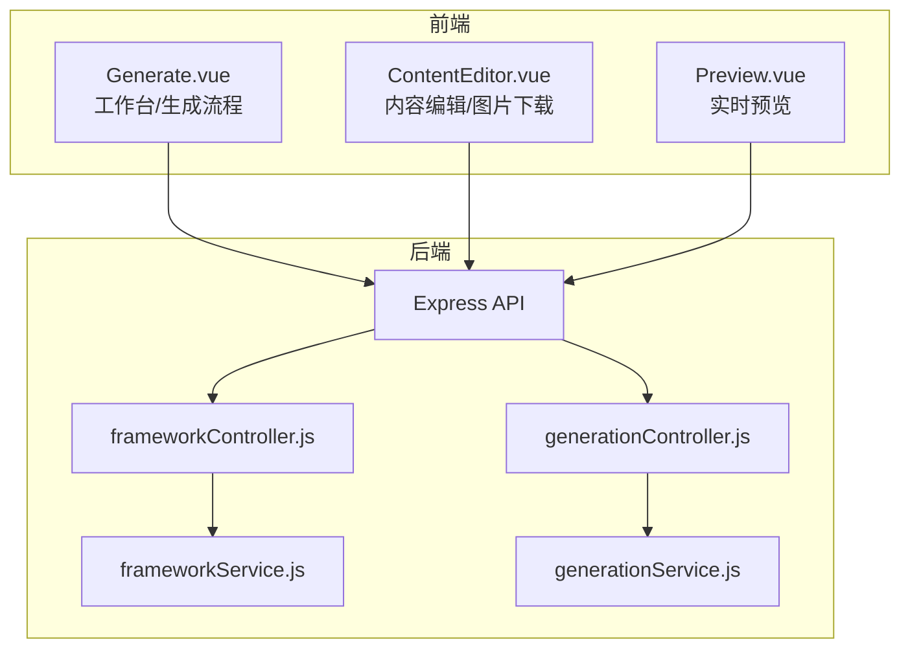
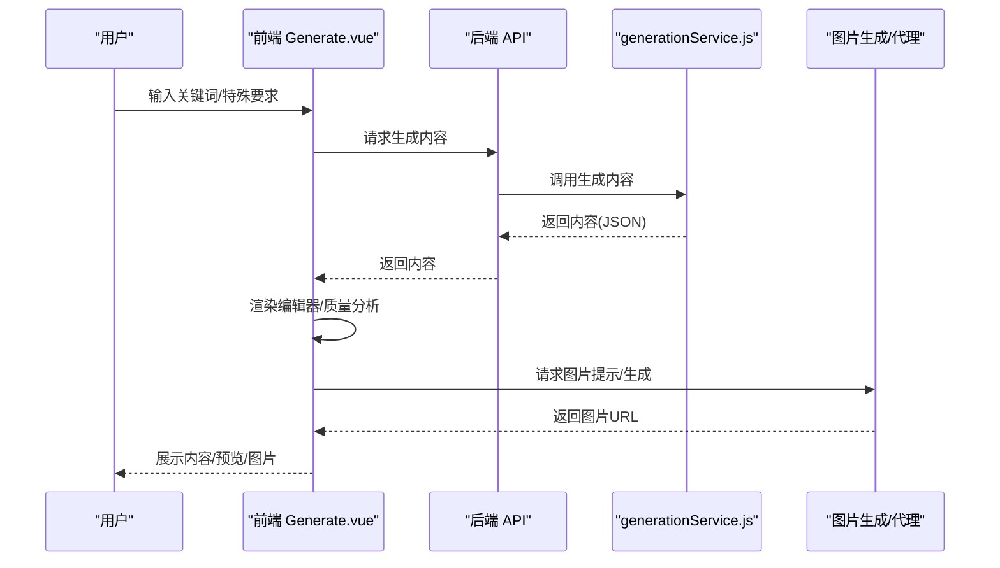
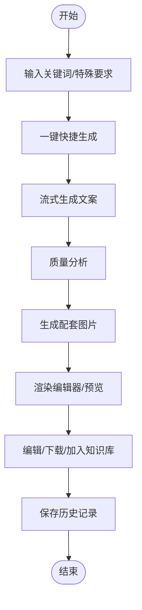
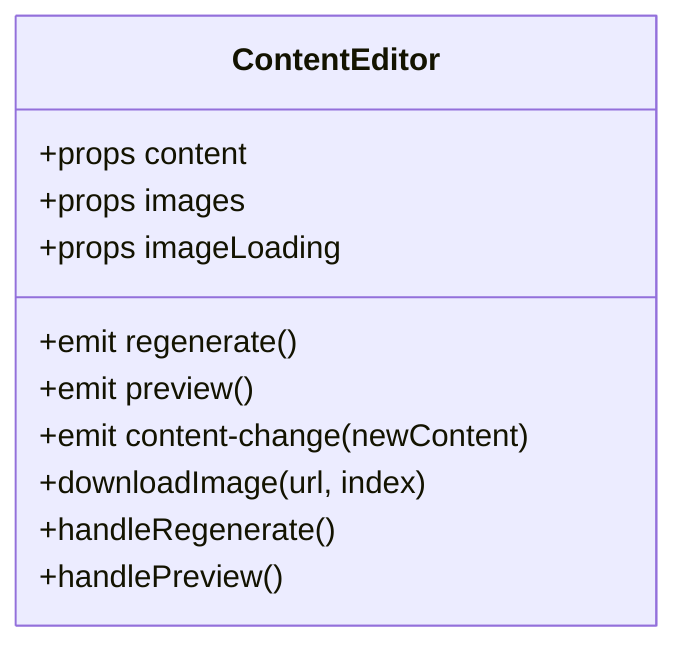
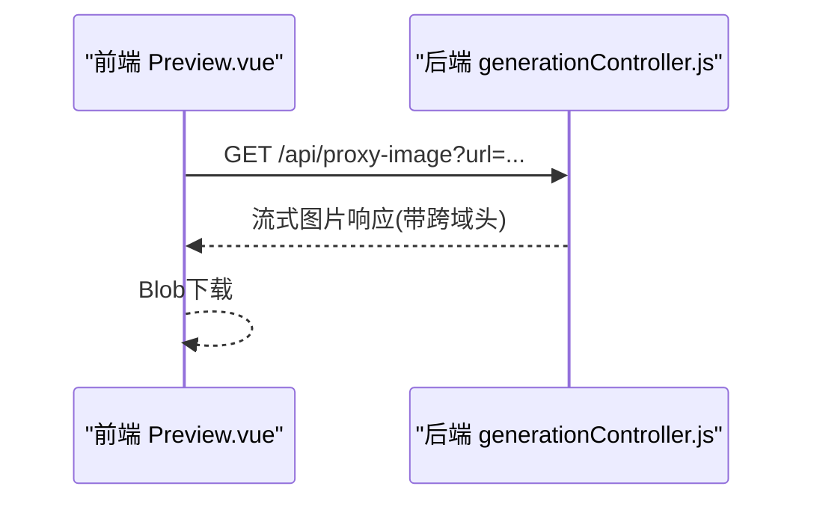
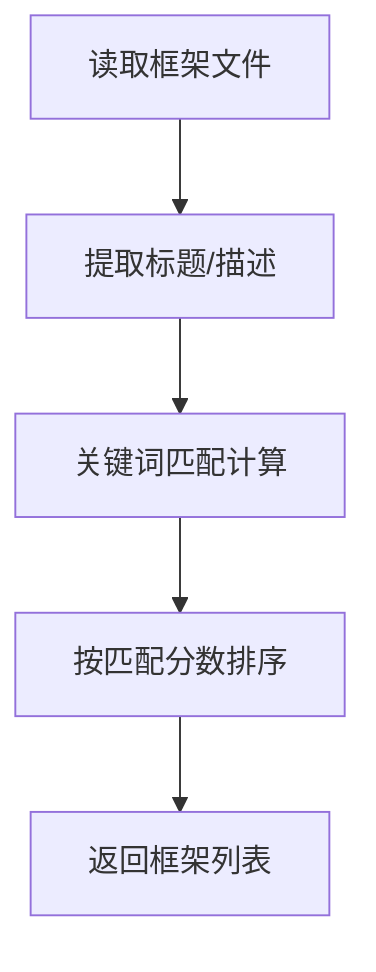
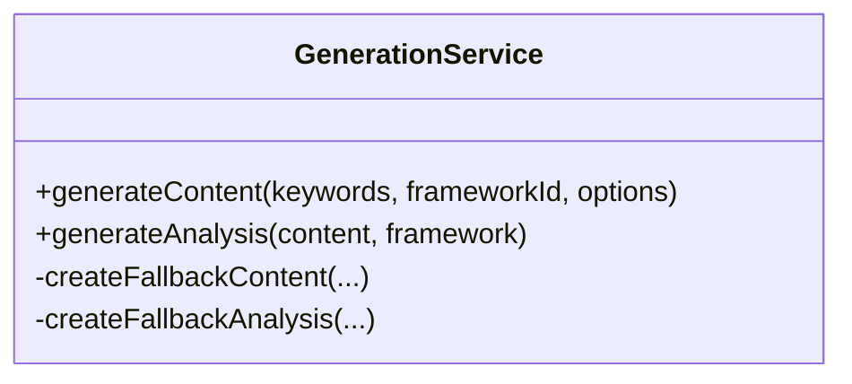
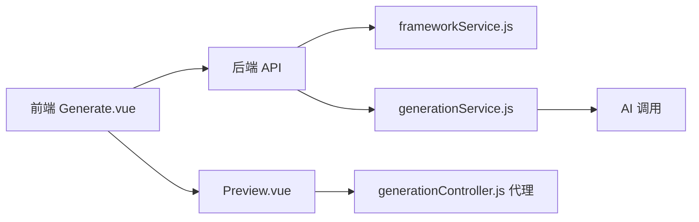

# 小红书爆款框架

<cite>
**本文引用的文件**
- [README.md](file://README.md)
- [小红书爆款框架.md](file://小红书爆款框架.md)
- [AIDA模型框架.md](file://AIDA模型框架.md)
- [SCQA模型框架.md](file://SCQA模型框架.md)
- [黄金圈法则框架.md](file://黄金圈法则框架.md)
- [情感共鸣框架.md](file://情感共鸣框架.md)
- [干货分享框架.md](file://干货分享框架.md)
- [src/views/Generate.vue](file://src/views/Generate.vue)
- [frontend/src/views/Generate.vue](file://frontend/src/views/Generate.vue)
- [src/components/ContentEditor.vue](file://src/components/ContentEditor.vue)
- [src/components/Preview.vue](file://src/components/Preview.vue)
- [backend/src/controllers/frameworkController.js](file://backend/src/controllers/frameworkController.js)
- [backend/src/services/frameworkService.js](file://backend/src/services/frameworkService.js)
- [backend/src/controllers/generationController.js](file://backend/src/controllers/generationController.js)
- [backend/src/services/generationService.js](file://backend/src/services/generationService.js)
</cite>

## 目录
1. [简介](#简介)
2. [项目结构](#项目结构)
3. [核心组件](#核心组件)
4. [架构总览](#架构总览)
5. [详细组件分析](#详细组件分析)
6. [依赖关系分析](#依赖关系分析)
7. [性能考量](#性能考量)
8. [故障排查指南](#故障排查指南)
9. [结论](#结论)
10. [附录](#附录)

## 简介
本项目是面向小红书创作者的“爆款内容工作台”，围绕“小红书爆款框架”构建，提供从内容结构、视觉呈现、互动引导到平台算法适配的全流程支持。项目包含：
- 多种内容框架（AIDA、SCQA、黄金圈、情感共鸣、干货分享）
- 智能文案生成与质量分析
- 实时预览与图片生成
- 历史记录与发布调度（UI 展示）

通过“视觉钩子×情绪价值×实用信息×互动引导”的爆款公式，帮助创作者在小红书平台上高效产出高完播、高互动、高传播的内容。

## 项目结构
项目采用前后端分离架构：
- 前端（Vue 3 + Vite）：工作台界面、内容编辑、预览、历史管理
- 后端（Node.js + Express）：框架读取、内容生成、质量分析、图片代理

图表来源
- [src/views/Generate.vue](file://src/views/Generate.vue#L1-L668)
- [src/components/ContentEditor.vue](file://src/components/ContentEditor.vue#L1-L418)
- [src/components/Preview.vue](file://src/components/Preview.vue#L1-L411)
- [backend/src/controllers/frameworkController.js](file://backend/src/controllers/frameworkController.js#L1-L49)
- [backend/src/controllers/generationController.js](file://backend/src/controllers/generationController.js#L1-L100)
- [backend/src/services/frameworkService.js](file://backend/src/services/frameworkService.js#L1-L64)
- [backend/src/services/generationService.js](file://backend/src/services/generationService.js#L1-L194)

章节来源
- [README.md](file://README.md#L13-L22)

## 核心组件
- 工作台与生成流程：负责关键词输入、框架选择、一键生成、质量分析、图片生成与历史记录
- 内容编辑器：支持标题、正文、话题标签编辑，图片下载与“加入知识库/人工审批发布”
- 实时预览：支持手机/电脑双端预览，模拟小红书图文展示
- 框架服务：读取本地框架文档，提取描述与匹配关键词
- 生成服务：调用 AI 生成内容与分析，提供兜底策略

章节来源
- [src/views/Generate.vue](file://src/views/Generate.vue#L1-L668)
- [src/components/ContentEditor.vue](file://src/components/ContentEditor.vue#L1-L418)
- [src/components/Preview.vue](file://src/components/Preview.vue#L1-L411)
- [backend/src/services/frameworkService.js](file://backend/src/services/frameworkService.js#L1-L64)
- [backend/src/services/generationService.js](file://backend/src/services/generationService.js#L1-L194)

## 架构总览
整体流程：前端发起生成请求 → 后端调用 AI 生成内容与分析 → 返回内容与图片提示 → 前端渲染编辑器与预览 → 用户可下载图片、加入知识库、人工审批发布。

图表来源
- [src/views/Generate.vue](file://src/views/Generate.vue#L257-L324)
- [backend/src/controllers/generationController.js](file://backend/src/controllers/generationController.js#L10-L33)
- [backend/src/services/generationService.js](file://backend/src/services/generationService.js#L63-L94)

## 详细组件分析

### 1) 工作台与生成流程（Generate.vue）
- 功能要点
  - 快速生成：流式进度、处理日志、生成进度条
  - 内容编辑：标题、正文、话题标签编辑；图片下载
  - 质量分析：生成后自动调用分析接口，返回结构化评分
  - 图片生成：根据内容生成推荐图片提示并批量生成
  - 历史记录：保存/加载/删除/清空历史
  - 实时预览：手机/电脑双端预览，支持紧凑模式

图表来源
- [src/views/Generate.vue](file://src/views/Generate.vue#L257-L324)
- [src/views/Generate.vue](file://src/views/Generate.vue#L356-L370)
- [src/views/Generate.vue](file://src/views/Generate.vue#L329-L354)

章节来源
- [src/views/Generate.vue](file://src/views/Generate.vue#L1-L668)

### 2) 内容编辑器（ContentEditor.vue）
- 功能要点
  - 标题/正文/标签编辑
  - 图片卡片展示与下载
  - 预览/重新生成/加入知识库/人工审批发布
  - Markdown 渲染（raw 文本模式）

图表来源
- [src/components/ContentEditor.vue](file://src/components/ContentEditor.vue#L197-L316)

章节来源
- [src/components/ContentEditor.vue](file://src/components/ContentEditor.vue#L1-L418)

### 3) 实时预览（Preview.vue）
- 功能要点
  - 手机/电脑双端模拟展示
  - 图片轮播与下载（通过后端代理）
  - 互动栏模拟点赞/收藏/评论
  - 紧凑模式用于侧边栏预览

图表来源
- [src/components/Preview.vue](file://src/components/Preview.vue#L146-L166)
- [backend/src/controllers/generationController.js](file://backend/src/controllers/generationController.js#L69-L94)

章节来源
- [src/components/Preview.vue](file://src/components/Preview.vue#L1-L411)

### 4) 框架服务与匹配（frameworkService.js）
- 功能要点
  - 读取本地框架文档，提取标题与描述
  - 基于关键词匹配框架，返回匹配分数与命中词

图表来源
- [backend/src/services/frameworkService.js](file://backend/src/services/frameworkService.js#L10-L58)

章节来源
- [backend/src/services/frameworkService.js](file://backend/src/services/frameworkService.js#L1-L64)

### 5) 生成服务与分析（generationService.js）
- 功能要点
  - 生成内容：构造 Prompt，调用 AI，解析 JSON，兜底策略
  - 质量分析：结构、钩子、框架、吸引力评分与理由
  - 图片提示：根据内容生成图片描述与风格

图表来源
- [backend/src/services/generationService.js](file://backend/src/services/generationService.js#L63-L194)

章节来源
- [backend/src/services/generationService.js](file://backend/src/services/generationService.js#L1-L194)

### 6) 控制器（frameworkController.js / generationController.js）
- 功能要点
  - 框架：列出框架、按名称查询
  - 生成：内容生成、质量分析、图片代理

章节来源
- [backend/src/controllers/frameworkController.js](file://backend/src/controllers/frameworkController.js#L1-L49)
- [backend/src/controllers/generationController.js](file://backend/src/controllers/generationController.js#L1-L100)

## 依赖关系分析
- 前端依赖后端 API，后端依赖服务层，服务层依赖 AI 调用
- 框架服务与生成服务相互独立，分别服务于“框架匹配”和“内容生成”
- 预览组件通过后端代理访问图片，规避跨域

图表来源
- [src/views/Generate.vue](file://src/views/Generate.vue#L189-L195)
- [backend/src/services/frameworkService.js](file://backend/src/services/frameworkService.js#L1-L64)
- [backend/src/services/generationService.js](file://backend/src/services/generationService.js#L1-L194)
- [backend/src/controllers/generationController.js](file://backend/src/controllers/generationController.js#L69-L94)

章节来源
- [src/views/Generate.vue](file://src/views/Generate.vue#L1-L668)
- [backend/src/controllers/generationController.js](file://backend/src/controllers/generationController.js#L1-L100)

## 性能考量
- 流式生成与进度条：前端通过回调实时更新进度，提升感知性能
- 图片批量生成：并发 Promise.all，缩短等待时间
- 预览与下载：使用后端代理统一跨域，减少前端复杂度
- 兜底策略：AI 返回异常或非 JSON 时，生成默认内容，保证可用性

章节来源
- [src/views/Generate.vue](file://src/views/Generate.vue#L282-L294)
- [src/views/Generate.vue](file://src/views/Generate.vue#L337-L342)
- [backend/src/services/generationService.js](file://backend/src/services/generationService.js#L96-L112)

## 故障排查指南
- 生成失败
  - 检查后端日志与错误响应
  - 确认关键词与框架 ID 参数是否齐全
  - 查看 AI 调用是否超时或返回非 JSON
- 图片下载失败
  - 确认后端代理接口可用
  - 检查图片 URL 是否可访问
  - 前端代理请求是否携带正确 URL 参数
- 预览空白
  - 检查内容对象是否包含标题/正文/标签
  - 确认图片数组是否为空或 URL 无效
- 历史记录异常
  - 检查历史保存字段完整性
  - 清空历史后重试

章节来源
- [backend/src/controllers/generationController.js](file://backend/src/controllers/generationController.js#L27-L32)
- [backend/src/controllers/generationController.js](file://backend/src/controllers/generationController.js#L69-L94)
- [src/components/Preview.vue](file://src/components/Preview.vue#L146-L166)
- [src/views/Generate.vue](file://src/views/Generate.vue#L390-L422)

## 结论
本项目以“小红书爆款框架”为核心，结合多种内容模型与工程化能力，提供从内容结构、视觉呈现、互动引导到平台算法适配的完整工作流。通过智能生成、质量分析与实时预览，帮助创作者快速产出高传播力内容，并通过历史记录与发布调度（UI 展示）提升内容管理效率。

## 附录

### A. 小红书爆款框架要点与应用
- 视觉钩子（封面设计原则、爆款封面类型、思考方式）
- 标题吸睛（标题公式、模板、注意事项）
- 情绪价值（用户心理、表达技巧、口语化）
- 实用信息（信息密度、内容类型、实用性检验）
- 互动引导（互动指令、评论区运营）
- 算法友好（完播率与互动率、内容新鲜度、关键词优化）
- 时间节奏（发布时间、内容生命周期）
- 常见误区与应用检查清单

章节来源
- [小红书爆款框架.md](file://小红书爆款框架.md#L19-L225)

### B. 框架模型对照
- AIDA：注意→兴趣→欲望→行动
- SCQA：情境→冲突→问题→答案
- 黄金圈：为什么→怎么做→是什么
- 情感共鸣：准确识别情绪×真实细节表达×开放式共鸣空间
- 干货分享：明确需求×可执行步骤×验证保障

章节来源
- [AIDA模型框架.md](file://AIDA模型框架.md#L1-L153)
- [SCQA模型框架.md](file://SCQA模型框架.md#L1-L180)
- [黄金圈法则框架.md](file://黄金圈法则框架.md#L1-L162)
- [情感共鸣框架.md](file://情感共鸣框架.md#L1-L240)
- [干货分享框架.md](file://干货分享框架.md#L1-L323)

### C. 前端与后端 API 调用路径
- 前端入口（Vue 3）：src/views/Generate.vue
- 前端入口（Element Plus）：frontend/src/views/Generate.vue
- 内容编辑器：src/components/ContentEditor.vue
- 实时预览：src/components/Preview.vue
- 框架控制器：backend/src/controllers/frameworkController.js
- 生成控制器：backend/src/controllers/generationController.js
- 框架服务：backend/src/services/frameworkService.js
- 生成服务：backend/src/services/generationService.js

章节来源
- [src/views/Generate.vue](file://src/views/Generate.vue#L1-L668)
- [frontend/src/views/Generate.vue](file://frontend/src/views/Generate.vue#L1-L189)
- [src/components/ContentEditor.vue](file://src/components/ContentEditor.vue#L1-L418)
- [src/components/Preview.vue](file://src/components/Preview.vue#L1-L411)
- [backend/src/controllers/frameworkController.js](file://backend/src/controllers/frameworkController.js#L1-L49)
- [backend/src/controllers/generationController.js](file://backend/src/controllers/generationController.js#L1-L100)
- [backend/src/services/frameworkService.js](file://backend/src/services/frameworkService.js#L1-L64)
- [backend/src/services/generationService.js](file://backend/src/services/generationService.js#L1-L194)