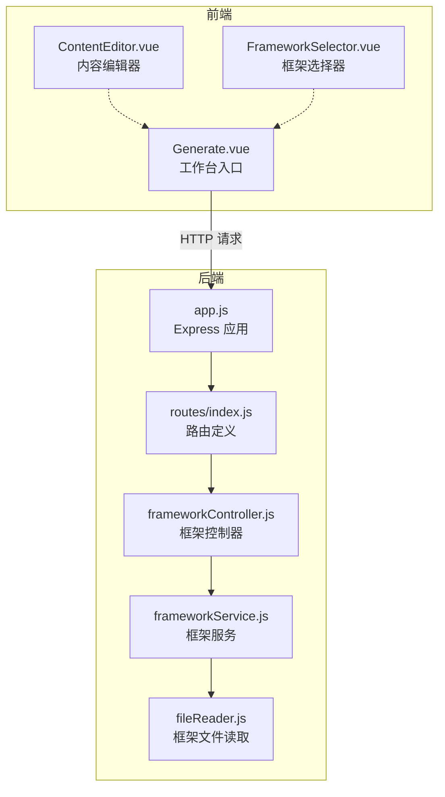
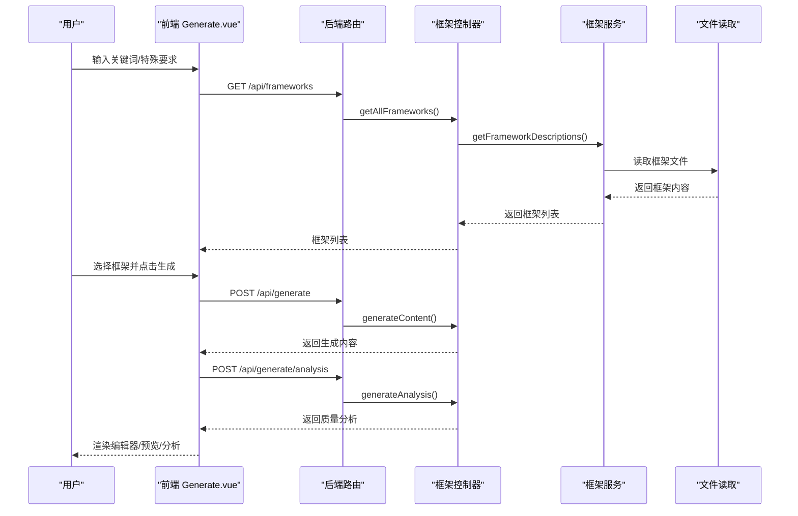
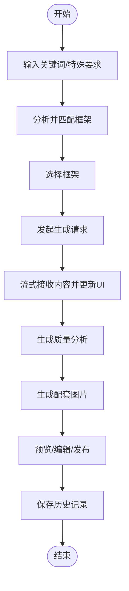
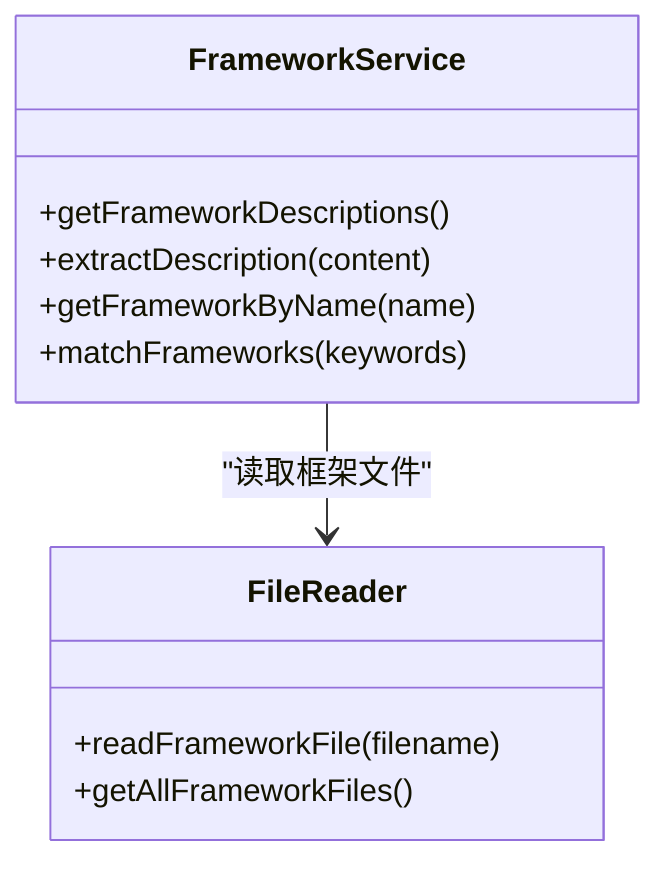
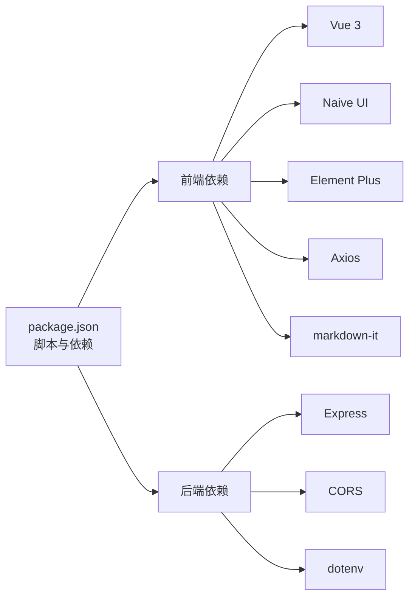

# 干货分享框架

<cite>
**本文引用的文件**
- [干货分享框架.md](file://干货分享框架.md)
- [README.md](file://README.md)
- [GUIDE.md](file://docs/GUIDE.md)
- [EXAMPLES.md](file://docs/EXAMPLES.md)
- [app.js](file://backend/src/app.js)
- [index.js](file://backend/src/routes/index.js)
- [frameworkController.js](file://backend/src/controllers/frameworkController.js)
- [frameworkService.js](file://backend/src/services/frameworkService.js)
- [fileReader.js](file://backend/src/utils/fileReader.js)
- [Generate.vue（前端）](file://src/views/Generate.vue)
- [Generate.vue（前端-旧版）](file://frontend/src/views/Generate.vue)
- [ContentEditor.vue](file://src/components/ContentEditor.vue)
- [FrameworkSelector.vue](file://src/components/FrameworkSelector.vue)
- [package.json](file://package.json)
</cite>

## 目录
1. [简介](#简介)
2. [项目结构](#项目结构)
3. [核心组件](#核心组件)
4. [架构总览](#架构总览)
5. [详细组件分析](#详细组件分析)
6. [依赖关系分析](#依赖关系分析)
7. [性能考量](#性能考量)
8. [故障排查指南](#故障排查指南)
9. [结论](#结论)
10. [附录](#附录)

## 简介
本项目围绕“干货分享框架”展开，旨在帮助创作者在小红书等平台高效产出高价值、可执行、即学即用的知识类内容。该框架强调“明确需求—可执行步骤—验证保障”的三要素，配合信息密度控制、可视化呈现与质量检验标准，确保内容既有深度又有易用性。项目同时提供一套前端工作台与后端服务，支持关键词分析、框架匹配、内容生成、质量分析与实时预览，形成从“输入关键词”到“生成图文”的闭环。

## 项目结构
项目采用前后端分离架构：
- 前端（Vue 3 + Naive UI + Element Plus）：工作台界面、内容编辑器、框架选择器、预览与质量分析模块。
- 后端（Node.js + Express）：提供框架列表查询、关键词分析、内容生成与质量分析接口，以及框架文件读取能力。
- 文档与示例：开发指南、使用示例、框架说明文档。

图表来源
- [app.js](file://backend/src/app.js#L1-L26)
- [index.js](file://backend/src/routes/index.js#L1-L21)
- [frameworkController.js](file://backend/src/controllers/frameworkController.js#L1-L49)
- [frameworkService.js](file://backend/src/services/frameworkService.js#L1-L64)
- [fileReader.js](file://backend/src/utils/fileReader.js#L1-L49)
- [Generate.vue（前端）](file://src/views/Generate.vue#L1-L668)
- [ContentEditor.vue](file://src/components/ContentEditor.vue#L1-L418)
- [FrameworkSelector.vue](file://src/components/FrameworkSelector.vue#L1-L241)

章节来源
- [README.md](file://README.md#L1-L76)
- [package.json](file://package.json#L1-L32)

## 核心组件
- 干货分享框架文档：定义三要素、信息密度、可视化与质量检验标准，提供应用检查清单与成功案例结构。
- 前端工作台 Generate.vue：提供关键词输入、框架选择、内容生成、质量分析与预览。
- 内容编辑器 ContentEditor.vue：支持 Markdown 预览、标签管理、图片下载与发布流程提示。
- 框架选择器 FrameworkSelector.vue：多选框架卡片、推荐标识、选中摘要展示。
- 后端服务：Express 应用、路由、控制器与服务层，负责框架文件读取与匹配。

章节来源
- [干货分享框架.md](file://干货分享框架.md#L1-L323)
- [Generate.vue（前端）](file://src/views/Generate.vue#L1-L668)
- [ContentEditor.vue](file://src/components/ContentEditor.vue#L1-L418)
- [FrameworkSelector.vue](file://src/components/FrameworkSelector.vue#L1-L241)
- [app.js](file://backend/src/app.js#L1-L26)
- [index.js](file://backend/src/routes/index.js#L1-L21)

## 架构总览
从前端到后端的数据流如下：
- 前端输入关键词与特殊要求，触发分析与生成流程。
- 后端根据关键词匹配可用框架，返回推荐框架列表。
- 前端选择框架后发起内容生成请求，后端返回生成内容与质量分析。
- 前端渲染编辑器、质量分析与预览，支持图片生成与下载。

图表来源
- [index.js](file://backend/src/routes/index.js#L1-L21)
- [frameworkController.js](file://backend/src/controllers/frameworkController.js#L1-L49)
- [frameworkService.js](file://backend/src/services/frameworkService.js#L1-L64)
- [fileReader.js](file://backend/src/utils/fileReader.js#L1-L49)
- [Generate.vue（前端）](file://src/views/Generate.vue#L257-L324)

## 详细组件分析

### 干货分享框架文档
- 三要素：明确需求（问题前置）、可执行步骤（路径清晰）、验证保障（可信度证明）。
- 信息密度与呈现：针对不同场景设定密度策略；分级展示、重点标注、可视化呈现。
- 质量检验：可执行性、可理解性、有效性、准确性四大维度。
- 常见误区与应用检查清单：避免“只罗列不解释”“步骤跳跃”“信息过载”等。
- 成功案例结构：标题、需求前置、开头验证、核心干货、工具清单、避坑提醒、验证与互动。

章节来源
- [干货分享框架.md](file://干货分享框架.md#L1-L323)

### 前端工作台 Generate.vue（新版）
- 功能概览：欢迎面板、功能卡片、关键词输入、生成过程状态、编辑器、质量分析、预览侧边栏、历史记录。
- 流式生成：支持流式回调，逐步更新进度与日志，增强用户体验。
- 图片生成：基于生成内容自动生成推荐配图，支持批量下载。
- 历史记录：本地持久化保存生成历史，支持加载、删除与清空。
- 预览与侧边栏：支持移动端/桌面端预览，随内容变化自动调整布局。

图表来源
- [Generate.vue（前端）](file://src/views/Generate.vue#L257-L324)
- [Generate.vue（前端）](file://src/views/Generate.vue#L329-L354)
- [Generate.vue（前端）](file://src/views/Generate.vue#L356-L370)

章节来源
- [Generate.vue（前端）](file://src/views/Generate.vue#L1-L668)

### 内容编辑器 ContentEditor.vue
- Markdown 预览与编辑双模式，支持原始文本流式内容与结构化表单两种形态。
- 图片生成展示区：网格布局展示生成图片，支持下载与占位骨架。
- 标签管理：动态增删标签，便于内容归类与检索。
- 发布流程：提供“人工审批并发布”入口，模拟发布设置对话框。

章节来源
- [ContentEditor.vue](file://src/components/ContentEditor.vue#L1-L418)

### 框架选择器 FrameworkSelector.vue
- 卡片式框架展示，支持多选与取消选择。
- 推荐标识：基于匹配分数显示“推荐”徽章。
- 选中摘要：顶部展示已选框架集合，便于确认与撤销。

章节来源
- [FrameworkSelector.vue](file://src/components/FrameworkSelector.vue#L1-L241)

### 后端服务与路由
- Express 应用：启用 CORS、JSON 解析、路由挂载。
- 路由定义：提供框架列表、框架详情、关键词分析、内容生成、质量分析与图片代理接口。
- 控制器：封装业务调用，统一响应格式与错误处理。
- 服务层：读取框架文件、提取描述、匹配关键词、计算匹配分数。
- 文件读取：兼容多目录查找，确保框架文件可被正确加载。

图表来源
- [frameworkService.js](file://backend/src/services/frameworkService.js#L1-L64)
- [fileReader.js](file://backend/src/utils/fileReader.js#L1-L49)

章节来源
- [app.js](file://backend/src/app.js#L1-L26)
- [index.js](file://backend/src/routes/index.js#L1-L21)
- [frameworkController.js](file://backend/src/controllers/frameworkController.js#L1-L49)
- [frameworkService.js](file://backend/src/services/frameworkService.js#L1-L64)
- [fileReader.js](file://backend/src/utils/fileReader.js#L1-L49)

## 依赖关系分析
- 前端依赖：Vue 3、Naive UI、Element Plus、Axios、markdown-it、JSZip、@vicons/antd、vue-router。
- 后端依赖：Express、CORS、dotenv、路由模块化。
- 开发脚本：支持一键安装前后端依赖、并行启动前后端服务。

图表来源
- [package.json](file://package.json#L1-L32)

章节来源
- [package.json](file://package.json#L1-L32)

## 性能考量
- 前端性能：懒加载组件、虚拟滚动（如适用）、图片懒加载与压缩、代码分割、Gzip 压缩。
- 后端性能：路由模块化、中间件最小化、合理缓存框架文件内容、流式响应提升生成体验。
- 生成流程：前端流式接收内容，减少等待时间；图片生成并发处理，提高吞吐。

## 故障排查指南
- 后端未启动或端口占用：检查端口配置与进程占用，确认 CORS 配置允许前端域名。
- 框架文件读取失败：确认框架文件存在于指定目录，检查文件名与编码。
- 生成失败：查看前端控制台错误日志，确认后端接口返回状态与错误信息。
- 预览与图片：确认预览设备切换逻辑与图片生成接口可用，检查网络与跨域设置。

章节来源
- [app.js](file://backend/src/app.js#L1-L26)
- [fileReader.js](file://backend/src/utils/fileReader.js#L1-L49)
- [Generate.vue（前端）](file://src/views/Generate.vue#L315-L324)

## 结论
本项目以“干货分享框架”为核心理念，结合前端工作台与后端服务，实现了从关键词输入到内容生成、质量分析与预览的全流程自动化。通过明确需求、可执行步骤与验证保障三要素，配合信息密度控制与可视化呈现，能够帮助创作者在小红书等平台高效产出高价值内容。建议在实际使用中：
- 严格遵循“可执行步骤”的黄金法则，确保每一步都具体、可验证。
- 重视“验证保障”，提供自我验证、数据支撑、案例证明与第三方证明。
- 使用分级展示与重点标注，降低用户理解成本。
- 借助质量分析与预览功能，持续优化内容结构与表达方式。

## 附录
- 开发指南与示例：参考开发指南与示例文档，快速上手组件使用与页面搭建。
- 框架文件：后端服务会读取多个框架文件（如 AIDA、SCQA、黄金圈法则、小红书爆款、情感共鸣、干货分享、种草推荐、生活方式分享），用于匹配与推荐。

章节来源
- [GUIDE.md](file://docs/GUIDE.md#L1-L460)
- [EXAMPLES.md](file://docs/EXAMPLES.md#L1-L464)
- [fileReader.js](file://backend/src/utils/fileReader.js#L29-L45)