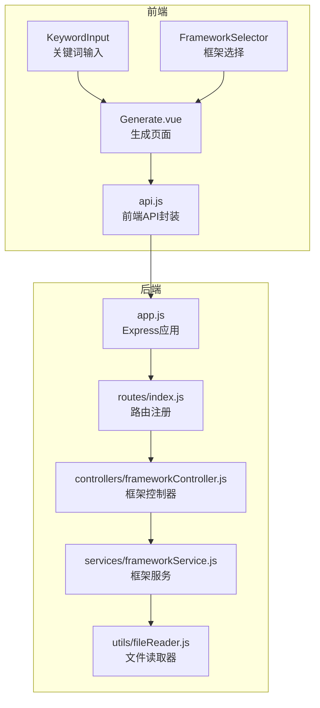
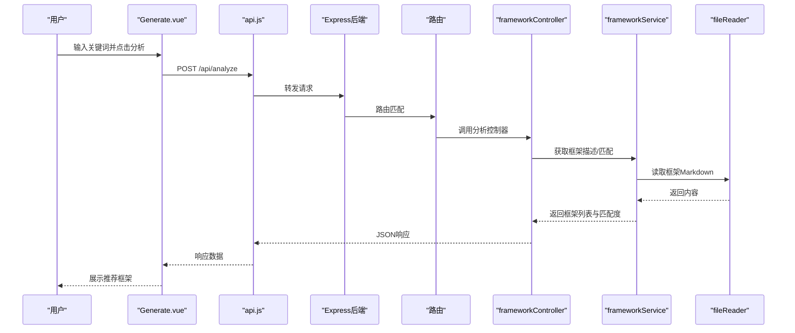
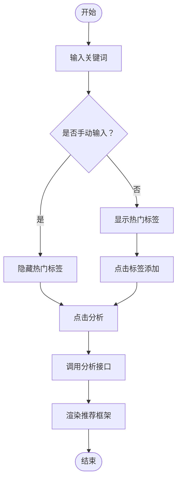
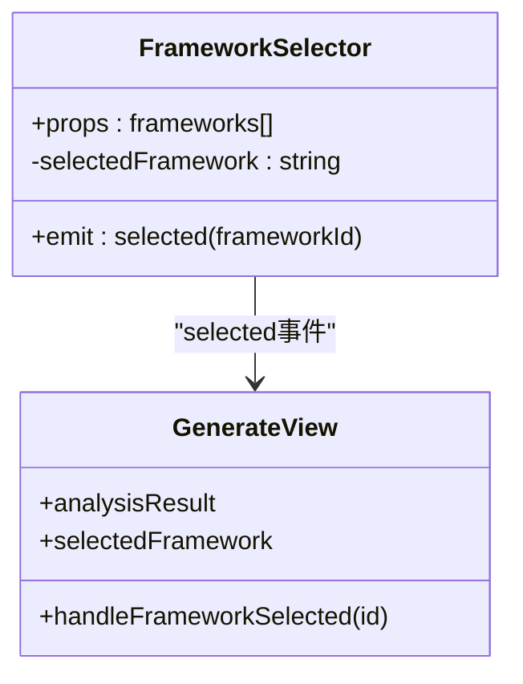
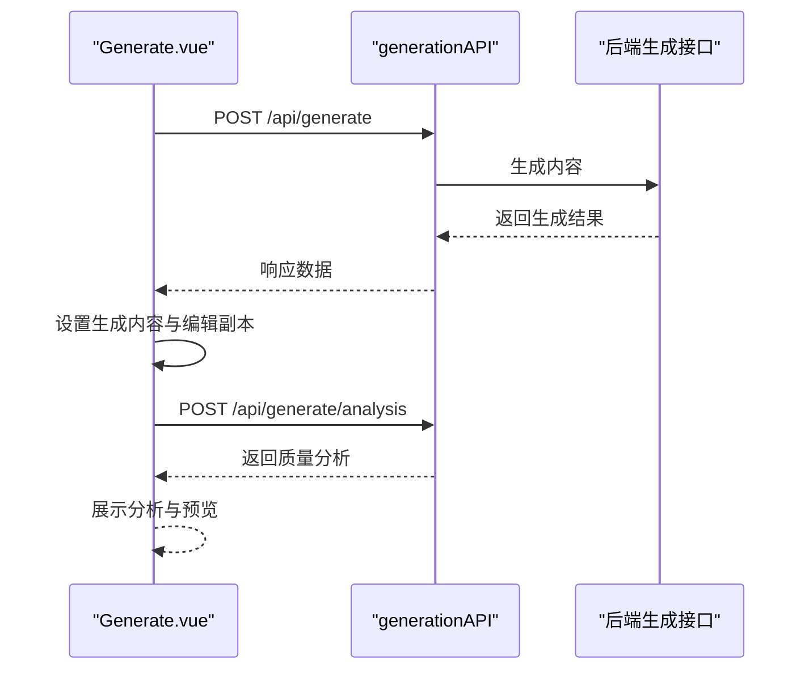
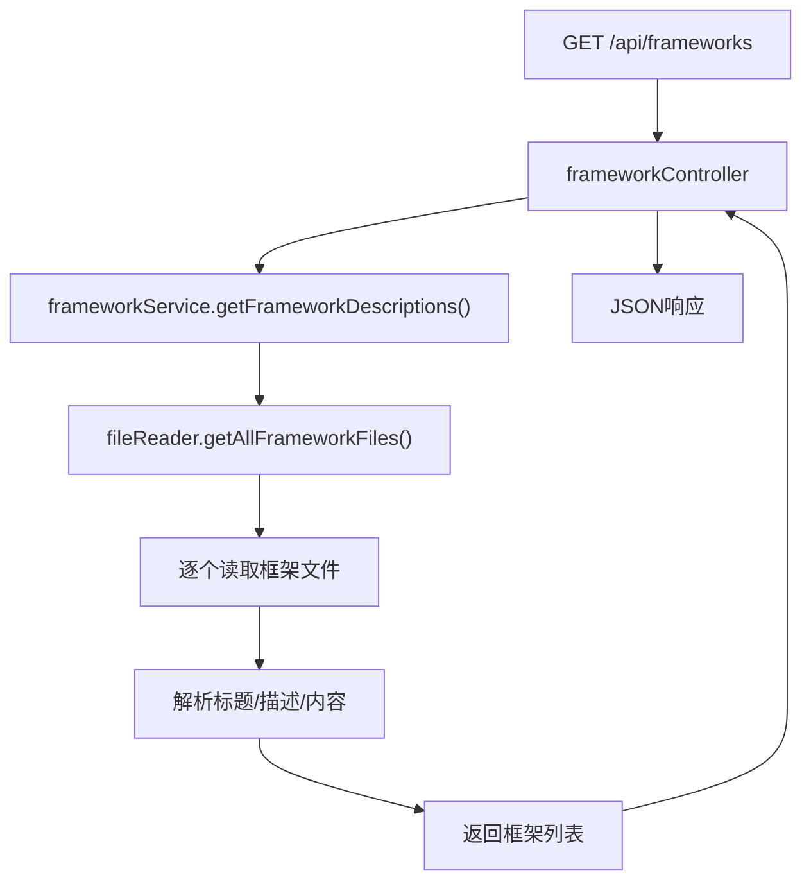
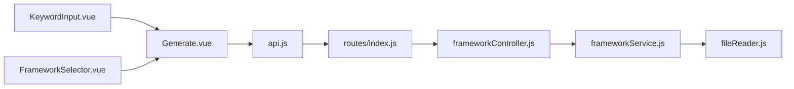

# 情感共鸣框架

<cite>
**本文引用的文件**
- [README.md](file://README.md)
- [情感共鸣框架.md](file://情感共鸣框架.md)
- [backend/src/app.js](file://backend/src/app.js)
- [backend/src/routes/index.js](file://backend/src/routes/index.js)
- [backend/src/controllers/frameworkController.js](file://backend/src/controllers/frameworkController.js)
- [backend/src/services/frameworkService.js](file://backend/src/services/frameworkService.js)
- [backend/src/utils/fileReader.js](file://backend/src/utils/fileReader.js)
- [frontend/src/services/api.js](file://frontend/src/services/api.js)
- [frontend/src/views/Generate.vue](file://frontend/src/views/Generate.vue)
- [frontend/src/components/FrameworkSelector.vue](file://frontend/src/components/FrameworkSelector.vue)
- [frontend/src/components/KeywordInput.vue](file://frontend/src/components/KeywordInput.vue)
- [小红书爆款框架.md](file://小红书爆款框架.md)
- [干货分享框架.md](file://干货分享框架.md)
</cite>

## 目录
1. [简介](#简介)
2. [项目结构](#项目结构)
3. [核心组件](#核心组件)
4. [架构总览](#架构总览)
5. [详细组件分析](#详细组件分析)
6. [依赖关系分析](#依赖关系分析)
7. [性能考量](#性能考量)
8. [故障排查指南](#故障排查指南)
9. [结论](#结论)
10. [附录](#附录)

## 简介
本文件围绕“情感共鸣框架”展开，系统阐述其理论基础与实践方法，并结合项目代码实现，说明如何在小红书内容创作中通过情感连接提升影响力与用户参与度。框架强调“准确识别情绪—真实细节表达—开放式共鸣空间”的三要素，以及“表层、深层、价值”三层共鸣递进路径，并提供爆款情绪钩子库、常见误区与情感平衡法则等实用策略。项目前端提供关键词输入、框架选择与内容生成的交互流程，后端负责框架元数据读取与匹配、分析与生成接口。

## 项目结构
项目采用前后端分离架构：
- 前端：Vue 3 + Element Plus + Axios，提供关键词输入、框架选择、内容生成与预览等功能。
- 后端：Node.js + Express，提供框架元数据读取、关键词分析、内容生成与质量分析的 API。
- 文档与框架：以 Markdown 文件形式组织各创作框架，后端通过文件读取器统一加载。

图表来源
- [frontend/src/components/KeywordInput.vue](file://frontend/src/components/KeywordInput.vue#L1-L148)
- [frontend/src/components/FrameworkSelector.vue](file://frontend/src/components/FrameworkSelector.vue#L1-L121)
- [frontend/src/views/Generate.vue](file://frontend/src/views/Generate.vue#L1-L189)
- [frontend/src/services/api.js](file://frontend/src/services/api.js#L1-L40)
- [backend/src/app.js](file://backend/src/app.js#L1-L26)
- [backend/src/routes/index.js](file://backend/src/routes/index.js#L1-L21)
- [backend/src/controllers/frameworkController.js](file://backend/src/controllers/frameworkController.js#L1-L49)
- [backend/src/services/frameworkService.js](file://backend/src/services/frameworkService.js#L1-L64)
- [backend/src/utils/fileReader.js](file://backend/src/utils/fileReader.js#L1-L49)

章节来源
- [README.md](file://README.md#L13-L22)

## 核心组件
- 情感共鸣框架文档：定义三要素、共鸣层级、情绪钩子、误区与平衡法则，提供可落地的写作策略与检查清单。
- 前端组件：
  - KeywordInput：关键词输入与热门标签推荐，触发分析。
  - FrameworkSelector：展示框架列表与匹配度，支持选择。
  - Generate.vue：串联分析、选择框架、生成内容、质量分析与预览。
- 后端服务：
  - frameworkController：提供框架列表与按名称查询。
  - frameworkService：读取框架文件、提取标题与描述、按关键词匹配框架。
  - fileReader：从指定目录读取框架 Markdown 文件。

章节来源
- [情感共鸣框架.md](file://情感共鸣框架.md#L8-L240)
- [frontend/src/components/KeywordInput.vue](file://frontend/src/components/KeywordInput.vue#L1-L148)
- [frontend/src/components/FrameworkSelector.vue](file://frontend/src/components/FrameworkSelector.vue#L1-L121)
- [frontend/src/views/Generate.vue](file://frontend/src/views/Generate.vue#L1-L189)
- [backend/src/controllers/frameworkController.js](file://backend/src/controllers/frameworkController.js#L1-L49)
- [backend/src/services/frameworkService.js](file://backend/src/services/frameworkService.js#L1-L64)
- [backend/src/utils/fileReader.js](file://backend/src/utils/fileReader.js#L1-L49)

## 架构总览
前端通过 api.js 封装的 HTTP 客户端调用后端 /api 路由，后端路由将请求分发至对应控制器，控制器委托服务层处理业务逻辑，服务层使用文件读取器读取框架文档，返回结构化的框架元数据与匹配结果。

图表来源
- [frontend/src/views/Generate.vue](file://frontend/src/views/Generate.vue#L75-L82)
- [frontend/src/services/api.js](file://frontend/src/services/api.js#L22-L26)
- [backend/src/routes/index.js](file://backend/src/routes/index.js#L13-L15)
- [backend/src/controllers/frameworkController.js](file://backend/src/controllers/frameworkController.js#L8-L21)
- [backend/src/services/frameworkService.js](file://backend/src/services/frameworkService.js#L9-L26)
- [backend/src/utils/fileReader.js](file://backend/src/utils/fileReader.js#L29-L45)

## 详细组件分析

### 情感共鸣框架理论与实践
- 三要素：
  - 准确识别情绪：通过关键词、评论与场景联想，定位用户情绪底色。
  - 真实细节表达：用场景还原、身份代入、微表情捕捉与对比反差，将抽象情绪具象化。
  - 开放式共鸣空间：通过未完成情绪、邀请式提问、承认脆弱与不完美，为用户留下表达空间。
- 共鸣层级：
  - 表层：共同经历与情境。
  - 中层：共同情绪与困扰。
  - 价值层：共同价值观与信念。
- 情绪钩子库：提供“只有我”“突然”“差点”“原来”“终于”等句式，用于快速触发情绪。
- 常见误区与平衡法则：避免过度煽情、虚假共鸣、负面过载、无出口与替用户说话；强调“负面情绪+正向出口”的情感平衡。

章节来源
- [情感共鸣框架.md](file://情感共鸣框架.md#L10-L240)

### 前端组件：关键词输入与热门标签
- 功能要点：
  - 支持多关键词输入，自动隐藏热门标签区域。
  - 点击标签快速添加关键词。
  - 触发分析接口，返回推荐框架列表。
- 交互流程：
  - 输入关键词 -> 点击分析 -> 前端发起 /api/analyze -> 后端返回分析结果 -> 前端渲染框架选择器。

图表来源
- [frontend/src/components/KeywordInput.vue](file://frontend/src/components/KeywordInput.vue#L67-L102)

章节来源
- [frontend/src/components/KeywordInput.vue](file://frontend/src/components/KeywordInput.vue#L1-L148)

### 前端组件：框架选择与匹配度展示
- 功能要点：
  - 展示框架名称、简述与匹配度。
  - 选择框架后，父组件接收事件并传入生成流程。
- 设计细节：
  - 使用 Element Plus 的 Radio Group 展示框架列表。
  - 匹配度高的框架以标签形式提示，便于筛选。

图表来源
- [frontend/src/components/FrameworkSelector.vue](file://frontend/src/components/FrameworkSelector.vue#L42-L61)
- [frontend/src/views/Generate.vue](file://frontend/src/views/Generate.vue#L84-L86)

章节来源
- [frontend/src/components/FrameworkSelector.vue](file://frontend/src/components/FrameworkSelector.vue#L1-L121)
- [frontend/src/views/Generate.vue](file://frontend/src/views/Generate.vue#L84-L86)

### 前端页面：生成流程与质量分析
- 流程概览：
  - 关键词分析 -> 选择框架 -> 生成内容 -> 质量分析 -> 编辑与预览。
- 关键交互：
  - 生成按钮加载态与错误提示。
  - 质量分析异步生成并展示。
  - 预览窗口支持不同设备尺寸查看。

图表来源
- [frontend/src/views/Generate.vue](file://frontend/src/views/Generate.vue#L88-L135)
- [frontend/src/services/api.js](file://frontend/src/services/api.js#L28-L35)

章节来源
- [frontend/src/views/Generate.vue](file://frontend/src/views/Generate.vue#L1-L189)
- [frontend/src/services/api.js](file://frontend/src/services/api.js#L1-L40)

### 后端：框架元数据读取与匹配
- 服务职责：
  - 读取框架 Markdown 文件，提取标题与描述。
  - 基于关键词对框架内容进行匹配，计算匹配度与命中关键字。
- 控制器职责：
  - 提供获取全部框架与按名称查询的接口。
- 文件读取策略：
  - 优先从上级目录读取框架文件，失败则回退到当前目录。

图表来源
- [backend/src/controllers/frameworkController.js](file://backend/src/controllers/frameworkController.js#L8-L21)
- [backend/src/services/frameworkService.js](file://backend/src/services/frameworkService.js#L9-L26)
- [backend/src/utils/fileReader.js](file://backend/src/utils/fileReader.js#L29-L45)

章节来源
- [backend/src/controllers/frameworkController.js](file://backend/src/controllers/frameworkController.js#L1-L49)
- [backend/src/services/frameworkService.js](file://backend/src/services/frameworkService.js#L1-L64)
- [backend/src/utils/fileReader.js](file://backend/src/utils/fileReader.js#L1-L49)

### 与小红书内容生态的协同
- 情感共鸣与小红书爆款框架的关系：
  - 小红书爆款框架强调“情绪价值×实用信息×互动引导”，情感共鸣作为情绪价值的核心，贯穿标题、正文与互动引导环节。
  - 情感共鸣框架的“真实细节表达”与“开放式共鸣空间”与小红书爆款框架的“真实感”“人情味”“情绪表达技巧”高度契合。
- 干货分享框架的互补：
  - 干货框架强调“明确需求—可执行步骤—验证保障”，与情感共鸣框架在“真实细节表达”“承认脆弱”“正向出口”上形成互补，既满足“情感连接”，又提供“实用价值”。

章节来源
- [小红书爆款框架.md](file://小红书爆款框架.md#L60-L79)
- [干货分享框架.md](file://干货分享框架.md#L126-L162)
- [情感共鸣框架.md](file://情感共鸣框架.md#L114-L129)

## 依赖关系分析
- 前端依赖：
  - api.js 封装 /api 前缀的请求，分别对接分析、生成与分析生成接口。
  - Generate.vue 依赖 KeywordInput 与 FrameworkSelector 的事件与数据流。
- 后端依赖：
  - routes/index.js 注册框架、分析与生成相关路由。
  - frameworkController 依赖 frameworkService。
  - frameworkService 依赖 fileReader 读取框架文档。

图表来源
- [frontend/src/services/api.js](file://frontend/src/services/api.js#L1-L40)
- [backend/src/routes/index.js](file://backend/src/routes/index.js#L1-L21)
- [backend/src/controllers/frameworkController.js](file://backend/src/controllers/frameworkController.js#L1-L49)
- [backend/src/services/frameworkService.js](file://backend/src/services/frameworkService.js#L1-L64)
- [backend/src/utils/fileReader.js](file://backend/src/utils/fileReader.js#L1-L49)
- [frontend/src/views/Generate.vue](file://frontend/src/views/Generate.vue#L1-L189)
- [frontend/src/components/KeywordInput.vue](file://frontend/src/components/KeywordInput.vue#L1-L148)
- [frontend/src/components/FrameworkSelector.vue](file://frontend/src/components/FrameworkSelector.vue#L1-L121)

章节来源
- [frontend/src/services/api.js](file://frontend/src/services/api.js#L1-L40)
- [backend/src/routes/index.js](file://backend/src/routes/index.js#L1-L21)
- [backend/src/controllers/frameworkController.js](file://backend/src/controllers/frameworkController.js#L1-L49)
- [backend/src/services/frameworkService.js](file://backend/src/services/frameworkService.js#L1-L64)
- [backend/src/utils/fileReader.js](file://backend/src/utils/fileReader.js#L1-L49)
- [frontend/src/views/Generate.vue](file://frontend/src/views/Generate.vue#L1-L189)
- [frontend/src/components/KeywordInput.vue](file://frontend/src/components/KeywordInput.vue#L1-L148)
- [frontend/src/components/FrameworkSelector.vue](file://frontend/src/components/FrameworkSelector.vue#L1-L121)

## 性能考量
- 前端：
  - 关键词分析与生成接口设置超时，避免长时间等待。
  - 生成与分析采用异步调用，避免阻塞 UI。
- 后端：
  - 框架文件读取采用同步读取，建议在生产环境考虑缓存与懒加载策略，减少重复 IO。
  - 匹配算法按关键词分词后进行包含判断，复杂度与关键词数量线性相关，建议对关键词集合进行去重与长度控制。

[本节为通用性能建议，不直接分析具体文件]

## 故障排查指南
- 前端常见问题：
  - 分析失败：检查网络请求是否成功，确认 /api/analyze 是否可达。
  - 生成失败：确认已选择框架，查看错误提示并重试。
  - 预览异常：确认生成内容已正确设置并在编辑副本中更新。
- 后端常见问题：
  - 框架文件读取失败：确认框架 Markdown 文件存在于预期目录，检查权限与路径。
  - 路由未注册：确认 routes/index.js 已正确挂载到 /api。
  - CORS 问题：检查后端 CORS 配置与前端请求域名是否一致。

章节来源
- [frontend/src/views/Generate.vue](file://frontend/src/views/Generate.vue#L110-L115)
- [frontend/src/services/api.js](file://frontend/src/services/api.js#L8-L11)
- [backend/src/app.js](file://backend/src/app.js#L14-L16)
- [backend/src/utils/fileReader.js](file://backend/src/utils/fileReader.js#L13-L26)

## 结论
情感共鸣框架通过“准确识别情绪—真实细节表达—开放式共鸣空间”三要素，构建了可复制、可落地的小红书内容创作方法论。结合项目前端的关键词输入与框架选择、后端的框架读取与匹配能力，创作者可以在同一套工具链中高效地将情感共鸣理念转化为高质量内容。配合小红书爆款框架与干货分享框架，既能满足用户的情感连接需求，又能提供实用价值与可执行步骤，从而提升用户参与度与内容影响力。

[本节为总结性内容，不直接分析具体文件]

## 附录
- 实用写作技巧与案例分析：
  - 情绪钩子库：在标题与开头使用“只有我”“突然”“差点”“原来”“终于”等句式快速触发情绪。
  - 细节表达：用场景还原、身份代入、微表情捕捉与对比反差，增强真实感。
  - 开放式结尾：通过提问、邀请与承认脆弱，激发用户评论与分享。
  - 情感平衡：在引发共鸣后提供正向出口，避免纯负面或纯正向的极端表达。
- 检查清单：
  - 是否准确识别情绪？
  - 是否有真实细节支撑？
  - 是否用第一人称表达？
  - 是否避免过度煽情或虚假？
  - 是否给用户留出共鸣与表达空间？
  - 是否有正向出口或治愈点？
  - 结尾是否包含互动邀请？
  - 整体是否让用户“看到了自己”？

章节来源
- [情感共鸣框架.md](file://情感共鸣框架.md#L131-L228)