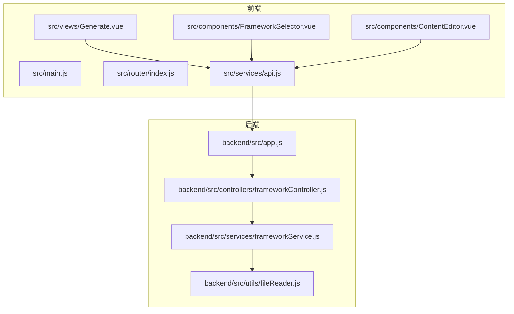
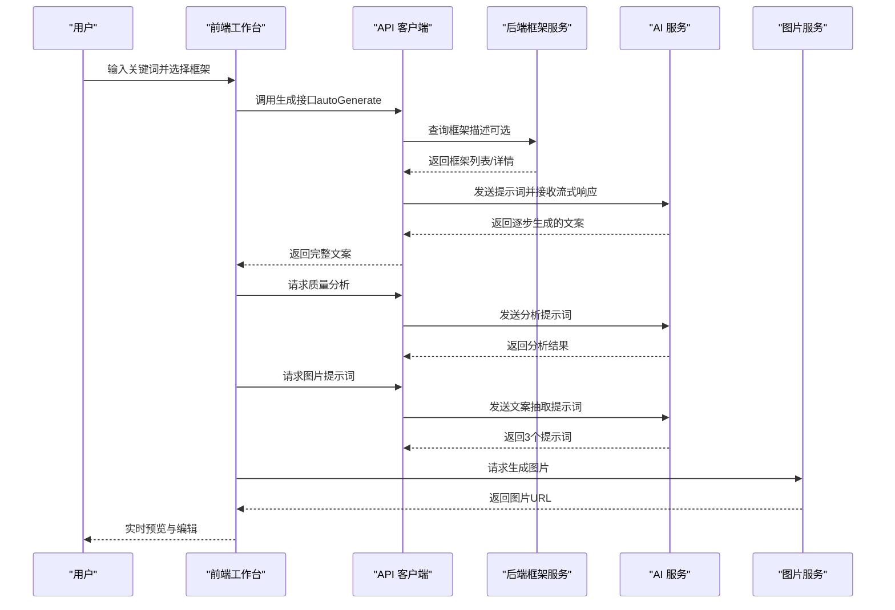
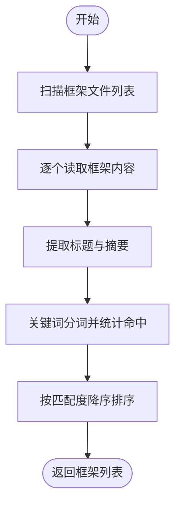
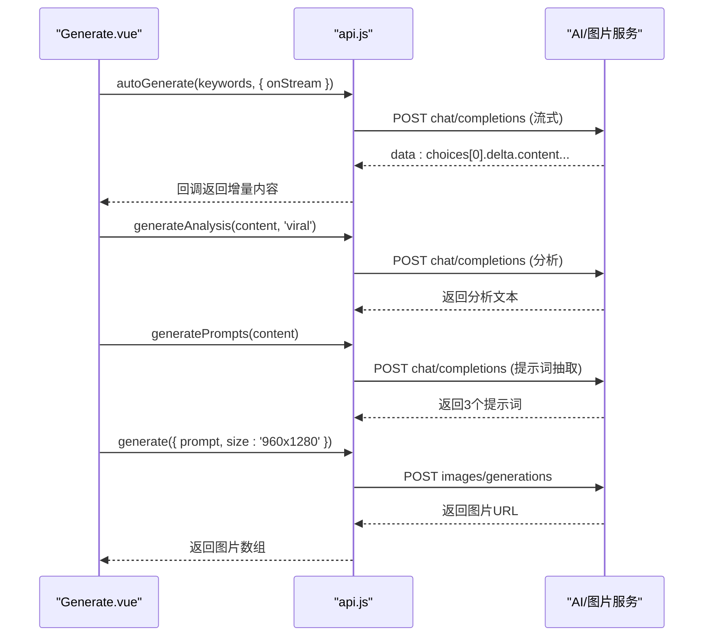
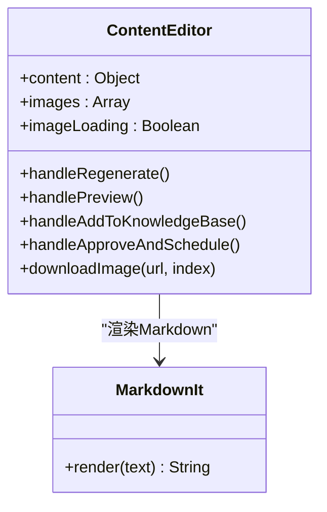
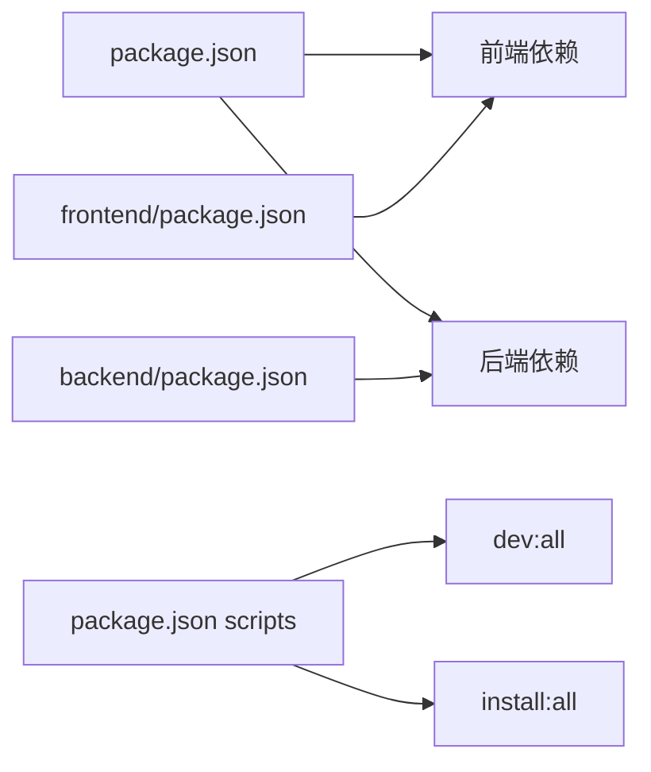

# 生活方式分享框架

<cite>
**本文引用的文件**
- [README.md](file://README.md)
- [生活方式分享框架.md](file://生活方式分享框架.md)
- [package.json](file://package.json)
- [backend/package.json](file://backend/package.json)
- [frontend/package.json](file://frontend/package.json)
- [backend/src/app.js](file://backend/src/app.js)
- [backend/src/controllers/frameworkController.js](file://backend/src/controllers/frameworkController.js)
- [backend/src/services/frameworkService.js](file://backend/src/services/frameworkService.js)
- [backend/src/utils/fileReader.js](file://backend/src/utils/fileReader.js)
- [src/main.js](file://src/main.js)
- [src/router/index.js](file://src/router/index.js)
- [src/views/Generate.vue](file://src/views/Generate.vue)
- [src/components/FrameworkSelector.vue](file://src/components/FrameworkSelector.vue)
- [src/components/ContentEditor.vue](file://src/components/ContentEditor.vue)
- [src/services/api.js](file://src/services/api.js)
</cite>

## 目录
1. [简介](#简介)
2. [项目结构](#项目结构)
3. [核心组件](#核心组件)
4. [架构总览](#架构总览)
5. [详细组件分析](#详细组件分析)
6. [依赖分析](#依赖分析)
7. [性能考量](#性能考量)
8. [故障排查指南](#故障排查指南)
9. [结论](#结论)
10. [附录](#附录)

## 简介
本项目面向小红书创作者，提供“生活方式分享框架”的系统化落地工具。该框架以“身份定义×日常细节×价值传递×可复制性”为核心公式，帮助创作者通过真实、可感知的生活片段，构建具有共鸣与影响力的个人IP。前端工作台提供关键词输入、框架选择、一键生成、实时预览与质量分析等功能；后端提供框架清单读取与匹配能力；AI服务负责文案生成、图片提示词抽取与图片生成。

## 项目结构
项目采用前后端分离架构：
- 前端：Vue 3 + Vite，提供工作台界面、组件与路由。
- 后端：Node.js + Express，提供框架清单查询与匹配服务。
- AI与图片服务：通过环境变量配置的外部服务（如火山引擎、大模型服务）对接。

图表来源
- [src/main.js](file://src/main.js#L1-L16)
- [src/router/index.js](file://src/router/index.js#L1-L26)
- [src/views/Generate.vue](file://src/views/Generate.vue#L1-L668)
- [src/components/FrameworkSelector.vue](file://src/components/FrameworkSelector.vue#L1-L241)
- [src/components/ContentEditor.vue](file://src/components/ContentEditor.vue#L1-L418)
- [src/services/api.js](file://src/services/api.js#L1-L454)
- [backend/src/app.js](file://backend/src/app.js#L1-L26)
- [backend/src/controllers/frameworkController.js](file://backend/src/controllers/frameworkController.js#L1-L49)
- [backend/src/services/frameworkService.js](file://backend/src/services/frameworkService.js#L1-L64)
- [backend/src/utils/fileReader.js](file://backend/src/utils/fileReader.js#L1-L49)

章节来源
- [README.md](file://README.md#L1-L76)
- [package.json](file://package.json#L1-L32)
- [backend/package.json](file://backend/package.json#L1-L17)
- [frontend/package.json](file://frontend/package.json#L1-L21)

## 核心组件
- 框架选择器：支持多选框架，展示匹配度与描述，便于组合使用。
- 内容编辑器：支持Markdown预览与编辑、图片生成展示与下载、一键重新生成与预览。
- 生成工作台：提供关键词输入、一键全自动生成、进度日志、质量分析、图片生成与历史记录。
- 框架服务：从本地框架文件读取内容，提取标题与摘要，支持按关键词匹配框架。
- API 客户端：封装大模型与图片服务调用，支持流式生成与提示词抽取。

章节来源
- [src/components/FrameworkSelector.vue](file://src/components/FrameworkSelector.vue#L1-L241)
- [src/components/ContentEditor.vue](file://src/components/ContentEditor.vue#L1-L418)
- [src/views/Generate.vue](file://src/views/Generate.vue#L1-L668)
- [backend/src/services/frameworkService.js](file://backend/src/services/frameworkService.js#L1-L64)
- [src/services/api.js](file://src/services/api.js#L1-L454)

## 架构总览
前端通过API模块调用后端路由，后端从本地框架文件读取内容并返回给前端；前端再调用AI服务生成文案与图片提示词，并请求图片服务生成配图。整体流程强调“关键词→框架→文案→图片→预览→分析→发布”。

图表来源
- [src/views/Generate.vue](file://src/views/Generate.vue#L257-L324)
- [src/services/api.js](file://src/services/api.js#L250-L364)
- [backend/src/controllers/frameworkController.js](file://backend/src/controllers/frameworkController.js#L8-L45)

## 详细组件分析

### 框架服务与文件读取
- 文件读取：从项目根目录扫描框架文件，兼容回退路径，避免因相对路径差异导致读取失败。
- 框架描述：解析首若干行，提取标题与摘要，用于前端展示与匹配。
- 关键词匹配：将关键词拆分为词集合，统计与框架内容的命中数量，按匹配度排序。

图表来源
- [backend/src/utils/fileReader.js](file://backend/src/utils/fileReader.js#L29-L45)
- [backend/src/services/frameworkService.js](file://backend/src/services/frameworkService.js#L10-L58)

章节来源
- [backend/src/utils/fileReader.js](file://backend/src/utils/fileReader.js#L1-L49)
- [backend/src/services/frameworkService.js](file://backend/src/services/frameworkService.js#L1-L64)

### 前端生成工作台
- 关键词输入与快捷生成：支持输入关键词与特殊要求，触发全自动生成流程。
- 流式生成与进度：通过回调实时更新生成进度与日志，展示“行业分析→文案创作→内容校验→视觉设计”的阶段。
- 质量分析：调用AI分析文案在Hook、框架原则、内容结构、平台适配四方面的表现。
- 图片生成：从文案中抽取3个场景提示词，调用图片服务生成高清配图。
- 历史记录：保存关键词、内容、图片与分析结果，支持加载、删除与清空。

图表来源
- [src/views/Generate.vue](file://src/views/Generate.vue#L257-L354)
- [src/services/api.js](file://src/services/api.js#L250-L449)

章节来源
- [src/views/Generate.vue](file://src/views/Generate.vue#L1-L668)
- [src/services/api.js](file://src/services/api.js#L1-L454)

### 内容编辑器
- Markdown 预览：使用MarkdownIt渲染，支持标题、列表、引用等语法。
- 编辑模式：支持直接编辑原始文本，便于二次创作。
- 图片展示：网格展示生成图片，支持下载与占位骨架。
- 操作按钮：重新生成、预览、加入知识库、人工审批并发布（UI预留）。

图表来源
- [src/components/ContentEditor.vue](file://src/components/ContentEditor.vue#L1-L418)

章节来源
- [src/components/ContentEditor.vue](file://src/components/ContentEditor.vue#L1-L418)

### 框架选择器
- 多选支持：点击切换选中状态，支持关闭标签移除。
- 推荐徽章：当匹配度高于阈值时显示“推荐”。
- 默认选中：首次加载时自动选中第一个框架，便于快速开始。

章节来源
- [src/components/FrameworkSelector.vue](file://src/components/FrameworkSelector.vue#L1-L241)

### 后端应用与控制器
- CORS 与JSON中间件：统一跨域与请求体解析。
- 路由挂载：统一前缀“/api”，便于前端代理转发。
- 控制器职责：获取全部框架描述与按名称查询框架详情。

章节来源
- [backend/src/app.js](file://backend/src/app.js#L1-L26)
- [backend/src/controllers/frameworkController.js](file://backend/src/controllers/frameworkController.js#L1-L49)

## 依赖分析
- 前端依赖：Vue 3、Naive UI、Axios、Element Plus、Vue Router、Vite。
- 后端依赖：Express、CORS、Dotenv、Axios。
- 项目脚本：提供一键安装与启动前后端的命令，便于快速部署。

图表来源
- [package.json](file://package.json#L1-L32)
- [frontend/package.json](file://frontend/package.json#L1-L21)
- [backend/package.json](file://backend/package.json#L1-L17)

章节来源
- [package.json](file://package.json#L1-L32)
- [frontend/package.json](file://frontend/package.json#L1-L21)
- [backend/package.json](file://backend/package.json#L1-L17)

## 性能考量
- 流式生成：前端通过回调逐步接收AI输出，减少等待时间，提升交互体验。
- 图片批量生成：并发请求多个提示词对应的图片，缩短整体等待时间。
- 进度与日志：阶段性更新进度与日志，有助于用户感知生成状态。
- 本地缓存：历史记录使用本地存储，避免重复网络请求。

章节来源
- [src/views/Generate.vue](file://src/views/Generate.vue#L272-L324)
- [src/services/api.js](file://src/services/api.js#L377-L449)

## 故障排查指南
- 无法读取框架文件：检查文件名与路径，确保与扫描列表一致；若读取失败，确认回退路径可用。
- 生成失败：查看前端日志与错误提示，确认AI服务地址与密钥配置正确；检查网络连通性。
- 图片生成异常：确认图片服务的模型、鉴权与尺寸参数；检查返回格式是否符合预期。
- CORS 问题：确认后端CORS允许的来源与端口，确保前端代理正确转发。

章节来源
- [backend/src/utils/fileReader.js](file://backend/src/utils/fileReader.js#L13-L26)
- [backend/src/app.js](file://backend/src/app.js#L14-L16)
- [src/services/api.js](file://src/services/api.js#L377-L449)

## 结论
本项目将“生活方式分享框架”的理论体系与工程实践结合，通过关键词驱动、框架组合、AI生成与图片自动化，形成从内容生产到视觉呈现的一体化工作流。前端工作台提供直观易用的操作界面，后端与AI服务提供稳定的技术支撑，帮助创作者高效产出高质量、可复制的生活方式内容。

## 附录
- 生活方式分享框架要点回顾
  - 身份定义：标签化、具体化、独特化、可对号入座。
  - 日常细节：真实感、具体性、时序性、规律性。
  - 价值传递：感受价值、效率价值、健康价值、关系价值、财务价值。
  - 可复制性：普通人视角、低成本切入、渐进式建议、工具资源、失败与调整。
- 视觉呈现建议：真实感、生活化、一致性；场景选择与细节展示。
- 成功案例结构：标题、身份定义、日常细节（时间切片）、价值传递、可复制性保障、行动引导与标签。

章节来源
- [生活方式分享框架.md](file://生活方式分享框架.md#L17-L393)