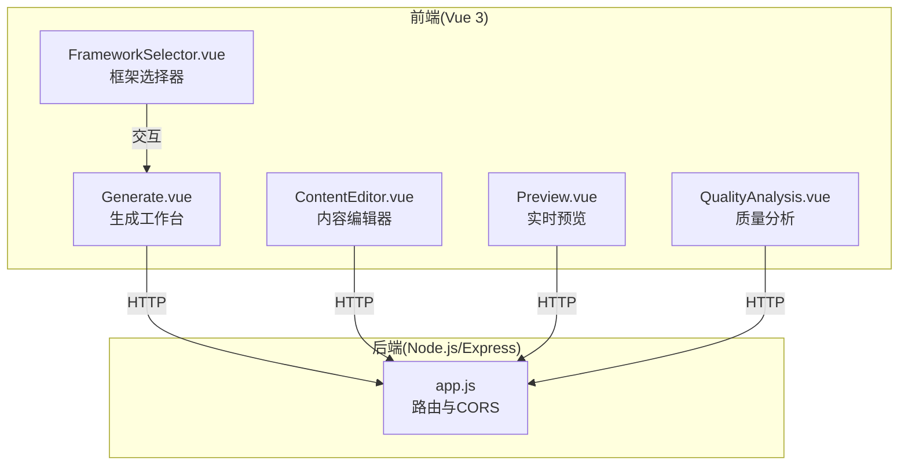
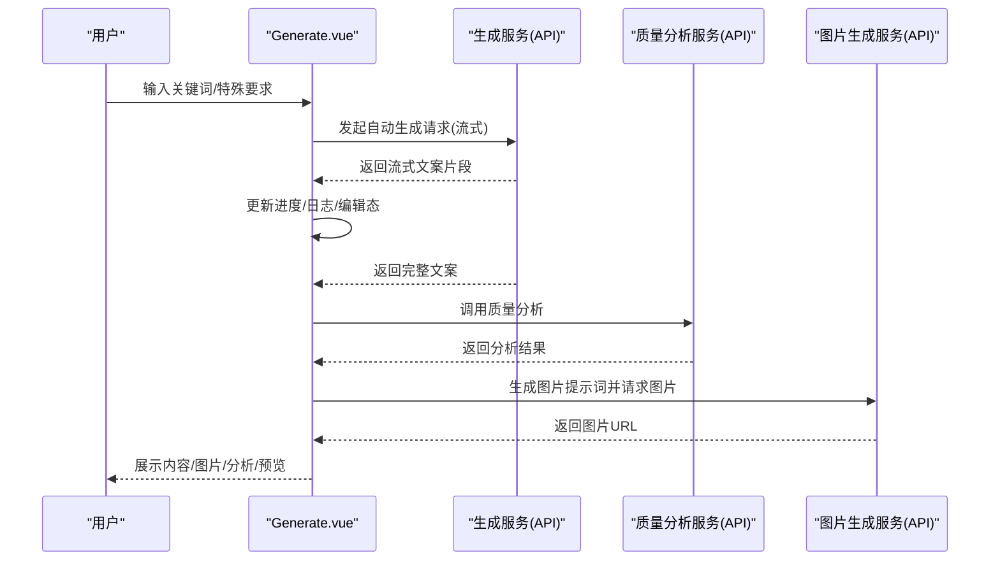
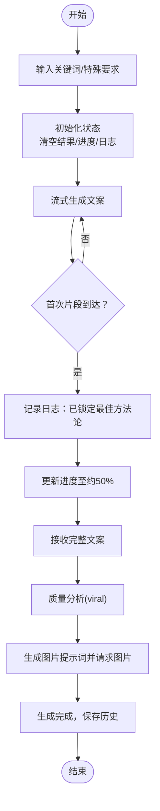
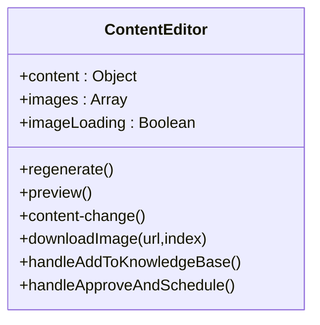
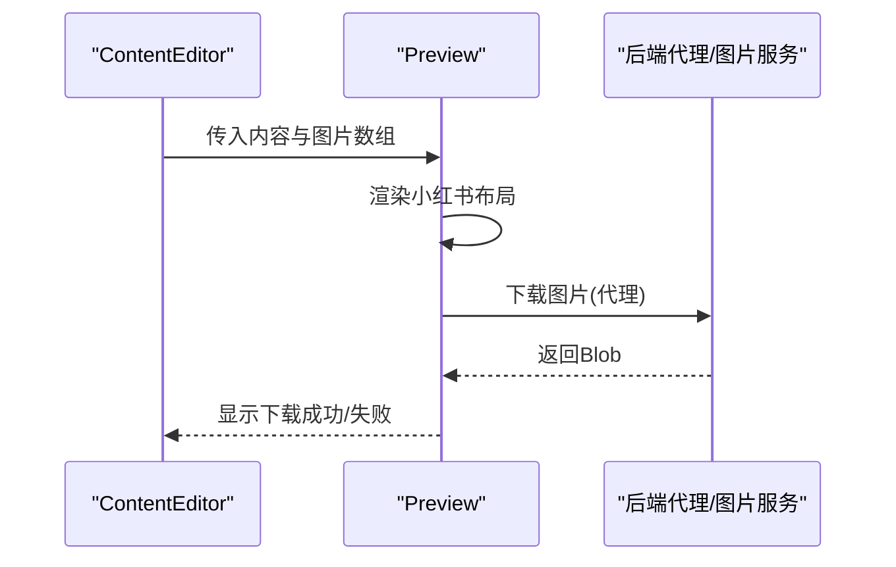
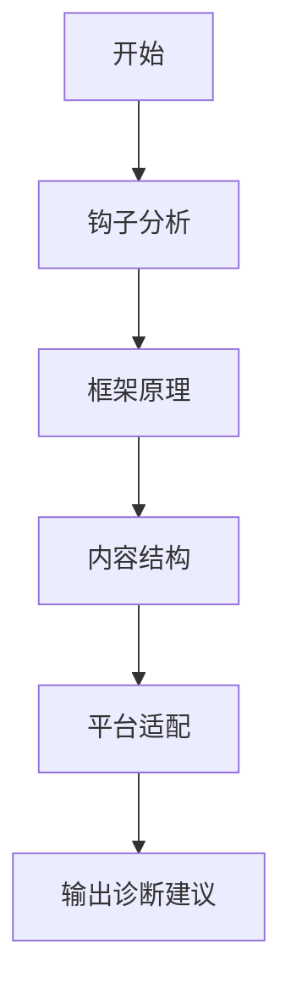
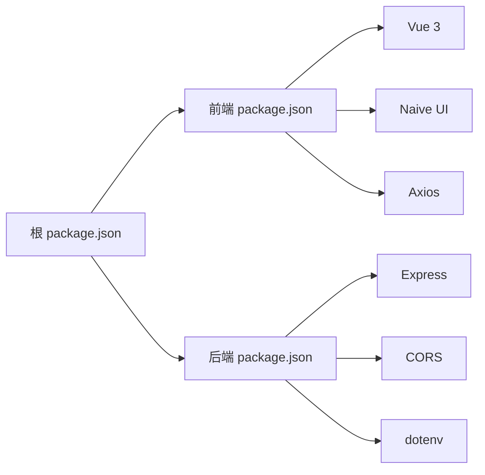

# 种草推荐框架

<cite>
**本文引用的文件**
- [种草推荐框架.md](file://种草推荐框架.md)
- [README.md](file://README.md)
- [小红书爆款框架.md](file://小红书爆款框架.md)
- [PROJECT_HIGHLIGHTS.md](file://PROJECT_HIGHLIGHTS.md)
- [docs/GUIDE.md](file://docs/GUIDE.md)
- [backend/src/app.js](file://backend/src/app.js)
- [backend/package.json](file://backend/package.json)
- [frontend/package.json](file://frontend/package.json)
- [package.json](file://package.json)
- [src/views/Generate.vue](file://src/views/Generate.vue)
- [src/components/ContentEditor.vue](file://src/components/ContentEditor.vue)
- [src/components/FrameworkSelector.vue](file://src/components/FrameworkSelector.vue)
- [src/components/Preview.vue](file://src/components/Preview.vue)
- [src/components/QualityAnalysis.vue](file://src/components/QualityAnalysis.vue)
</cite>

## 目录
1. [简介](#简介)
2. [项目结构](#项目结构)
3. [核心组件](#核心组件)
4. [架构总览](#架构总览)
5. [详细组件分析](#详细组件分析)
6. [依赖关系分析](#依赖关系分析)
7. [性能考量](#性能考量)
8. [故障排查指南](#故障排查指南)
9. [结论](#结论)
10. [附录](#附录)

## 简介
本项目是面向小红书平台的“种草推荐”内容创作与发布工作台，围绕“识别需求×展示效果×降低疑虑×稀缺促动”的种草链条，结合 AIDA、SCQA、黄金圈法则等经典营销模型，提供从关键词输入、AI 文案生成、质量诊断、图片生成到实时预览的一体化能力。其目标是帮助创作者以“真实体验+结构化框架+平台适配”的方式，高效产出高转化的种草内容。

## 项目结构
项目采用前后端分离架构：
- 前端：Vue 3 + Vite，提供可视化工作台、内容编辑、质量分析、实时预览等功能。
- 后端：Node.js + Express，提供 API 路由与跨域配置，承载生成流程的后端编排。
- 根目录：统一脚本与多端管理，支持一键安装与并行开发。

图表来源
- [backend/src/app.js](file://backend/src/app.js#L1-L26)
- [src/views/Generate.vue](file://src/views/Generate.vue#L1-L668)
- [src/components/ContentEditor.vue](file://src/components/ContentEditor.vue#L1-L418)
- [src/components/Preview.vue](file://src/components/Preview.vue#L1-L411)
- [src/components/QualityAnalysis.vue](file://src/components/QualityAnalysis.vue#L1-L138)
- [src/components/FrameworkSelector.vue](file://src/components/FrameworkSelector.vue#L1-L241)

章节来源
- [README.md](file://README.md#L13-L22)
- [package.json](file://package.json#L6-L14)
- [backend/src/app.js](file://backend/src/app.js#L1-L26)

## 核心组件
- 生成工作台（Generate.vue）
  - 负责关键词输入、一键生成、进度日志、历史记录、预览侧栏与图片生成编排。
- 内容编辑器（ContentEditor.vue）
  - 支持原始文本预览/编辑、Markdown 渲染、图片下载、标签管理、重新生成与发布审批入口。
- 实时预览（Preview.vue）
  - 模拟小红书 App 布局，支持手机/桌面双端预览，图片可下载。
- 质量分析（QualityAnalysis.vue）
  - 输出钩子分析、框架原理、内容结构、平台适配等维度的诊断建议。
- 框架选择器（FrameworkSelector.vue）
  - 提供 AIDA、SCQA、黄金圈等框架卡片化选择，便于组合使用。

章节来源
- [src/views/Generate.vue](file://src/views/Generate.vue#L1-L668)
- [src/components/ContentEditor.vue](file://src/components/ContentEditor.vue#L1-L418)
- [src/components/Preview.vue](file://src/components/Preview.vue#L1-L411)
- [src/components/QualityAnalysis.vue](file://src/components/QualityAnalysis.vue#L1-L138)
- [src/components/FrameworkSelector.vue](file://src/components/FrameworkSelector.vue#L1-L241)

## 架构总览
整体流程从“关键词输入”出发，经“AI 生成（文案/图片）”、“质量分析”、“实时预览”，最终进入“编辑与发布”阶段。后端提供统一 API 入口与跨域支持，前端通过服务层对接生成与分析接口。

图表来源
- [src/views/Generate.vue](file://src/views/Generate.vue#L257-L324)
- [src/views/Generate.vue](file://src/views/Generate.vue#L356-L370)
- [src/views/Generate.vue](file://src/views/Generate.vue#L329-L354)

章节来源
- [README.md](file://README.md#L5-L12)
- [PROJECT_HIGHLIGHTS.md](file://PROJECT_HIGHLIGHTS.md#L7-L31)

## 详细组件分析

### 生成工作台（Generate.vue）
- 关键职责
  - 接收关键词与特殊要求，触发“自动生成”流程。
  - 管理生成进度、处理日志、维护历史记录。
  - 协调图片生成与质量分析，驱动预览侧栏与编辑器联动。
- 生成链路
  - 行业分析 → 锁定方法论 → 流式生成文案 → 质量诊断 → 视觉设计（图片）→ 完成。
- 交互特性
  - 底部悬浮输入区、右侧预览侧栏、历史抽屉、进度条与时间轴日志。

图表来源
- [src/views/Generate.vue](file://src/views/Generate.vue#L257-L324)
- [src/views/Generate.vue](file://src/views/Generate.vue#L356-L370)
- [src/views/Generate.vue](file://src/views/Generate.vue#L329-L354)

章节来源
- [src/views/Generate.vue](file://src/views/Generate.vue#L177-L427)

### 内容编辑器（ContentEditor.vue）
- 关键职责
  - 支持原始文本预览/编辑与 Markdown 渲染；提供图片下载、标签管理、重新生成与发布审批入口。
- 设计要点
  - 两种内容形态：原始文本（流式/可编辑）与结构化表单（标题/正文/标签/图片建议）。
  - 图片生成区支持批量展示与下载，增强素材可用性。

图表来源
- [src/components/ContentEditor.vue](file://src/components/ContentEditor.vue#L197-L316)

章节来源
- [src/components/ContentEditor.vue](file://src/components/ContentEditor.vue#L1-L418)

### 实时预览（Preview.vue）
- 关键职责
  - 以手机/桌面双端布局模拟小红书内容展示，支持图片下载与互动模拟。
- 设计要点
  - 桌面端支持左右分区展示图片与正文；紧凑模式用于嵌入侧栏。
  - 通过后端代理下载图片，规避跨域问题。

图表来源
- [src/components/Preview.vue](file://src/components/Preview.vue#L146-L166)

章节来源
- [src/components/Preview.vue](file://src/components/Preview.vue#L1-L411)

### 质量分析（QualityAnalysis.vue）
- 关键职责
  - 输出钩子分析、框架原理、内容结构、平台适配等维度的诊断建议。
- 使用场景
  - 在生成完成后自动调用，辅助优化文案结构与平台适配度。

图表来源
- [src/components/QualityAnalysis.vue](file://src/components/QualityAnalysis.vue#L31-L108)

章节来源
- [src/components/QualityAnalysis.vue](file://src/components/QualityAnalysis.vue#L1-L138)

### 框架选择器（FrameworkSelector.vue）
- 关键职责
  - 提供 AIDA、SCQA、黄金圈等框架卡片化选择，支持多选与推荐标识。
- 使用场景
  - 在生成前或生成后，配合内容编辑器进行方法论选择与组合。

章节来源
- [src/components/FrameworkSelector.vue](file://src/components/FrameworkSelector.vue#L1-L241)

## 依赖关系分析
- 前端依赖
  - Vue 3、Naive UI、Axios、vue-router 等，提供组件生态与路由能力。
- 后端依赖
  - Express、CORS、dotenv、axios，提供路由、跨域与外部请求能力。
- 根脚本
  - 提供一键安装与并行开发脚本，简化本地联调。

图表来源
- [package.json](file://package.json#L15-L31)
- [frontend/package.json](file://frontend/package.json#L10-L19)
- [backend/package.json](file://backend/package.json#L10-L16)

章节来源
- [package.json](file://package.json#L6-L14)
- [frontend/package.json](file://frontend/package.json#L1-L21)
- [backend/package.json](file://backend/package.json#L1-L17)

## 性能考量
- 流式生成
  - 通过流式传输减少等待时间，提升感知性能与交互流畅度。
- 图片生成并发
  - 并行请求多张图片，缩短等待时间；失败兜底与成功计数提示。
- 预览与渲染
  - 预览组件按需渲染，桌面端采用左右分区布局，避免冗余计算。
- 跨域与代理
  - 图片下载通过后端代理，避免浏览器跨域限制，提升稳定性。

章节来源
- [src/views/Generate.vue](file://src/views/Generate.vue#L282-L294)
- [src/views/Generate.vue](file://src/views/Generate.vue#L337-L342)
- [src/components/Preview.vue](file://src/components/Preview.vue#L146-L166)

## 故障排查指南
- 无法启动后端
  - 检查环境变量与 CORS 配置，确认端口占用与跨域来源。
- 生成失败
  - 查看进度日志与错误提示，确认关键词与特殊要求是否合理。
- 图片下载失败
  - 检查后端代理是否可达，确认网络状态与图片 URL 有效性。
- 预览空白
  - 确认内容对象结构与图片数组是否正确传入，检查渲染逻辑。

章节来源
- [backend/src/app.js](file://backend/src/app.js#L14-L16)
- [src/views/Generate.vue](file://src/views/Generate.vue#L315-L323)
- [src/components/Preview.vue](file://src/components/Preview.vue#L146-L166)

## 结论
本工作台以“种草推荐框架”为核心，融合多种爆款方法论与平台适配策略，提供从关键词到图文成品的全链路自动化与可视化能力。通过质量分析与实时预览，创作者可在生成过程中持续优化内容结构与平台适配度，最终形成高转化、可发布的种草内容。

## 附录
- 方法论与框架
  - 种草推荐框架：识别需求、展示效果、降低疑虑、稀缺促动。
  - 小红书爆款框架：视觉钩子、标题吸睛、情绪价值、实用信息、互动引导。
  - 核心心法：真实感 > 完美感，实用价值 > 信息量，情感共鸣 > 理性说服。
- 应用检查清单
  - 封面是否3秒内抓住用户、标题是否包含吸睛元素、正文是否第一人称+口语化、信息密度是否足够、话题标签是否相关、互动引导是否明确、发布后是否及时回复评论、整体是否真实感人。

章节来源
- [种草推荐框架.md](file://种草推荐框架.md#L23-L362)
- [小红书爆款框架.md](file://小红书爆款框架.md#L115-L225)
- [PROJECT_HIGHLIGHTS.md](file://PROJECT_HIGHLIGHTS.md#L7-L37)