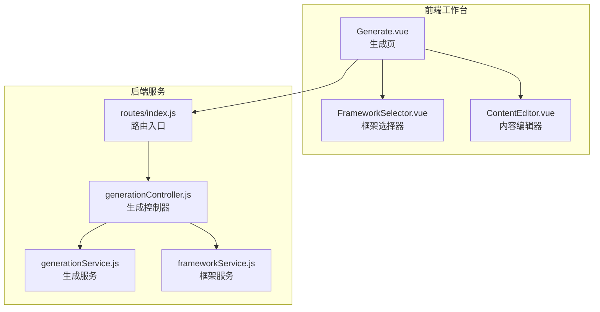
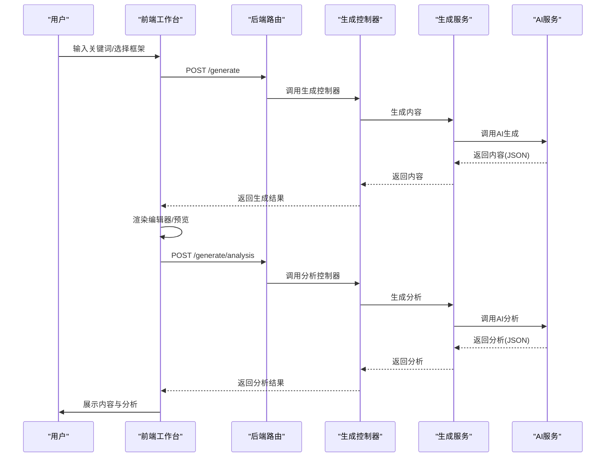
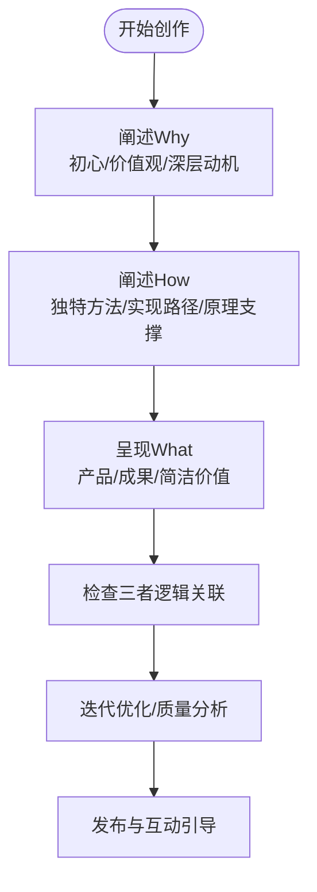
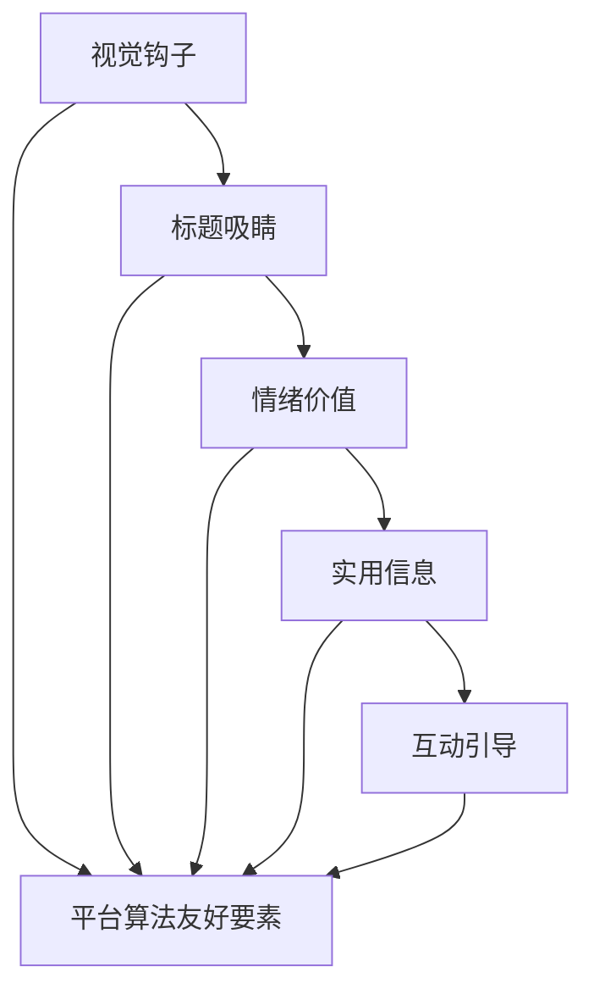
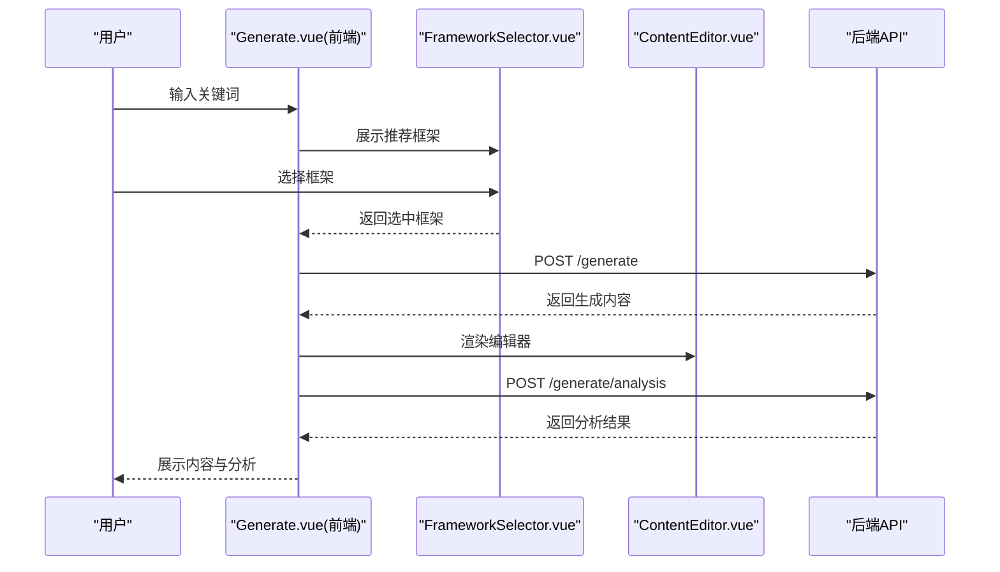
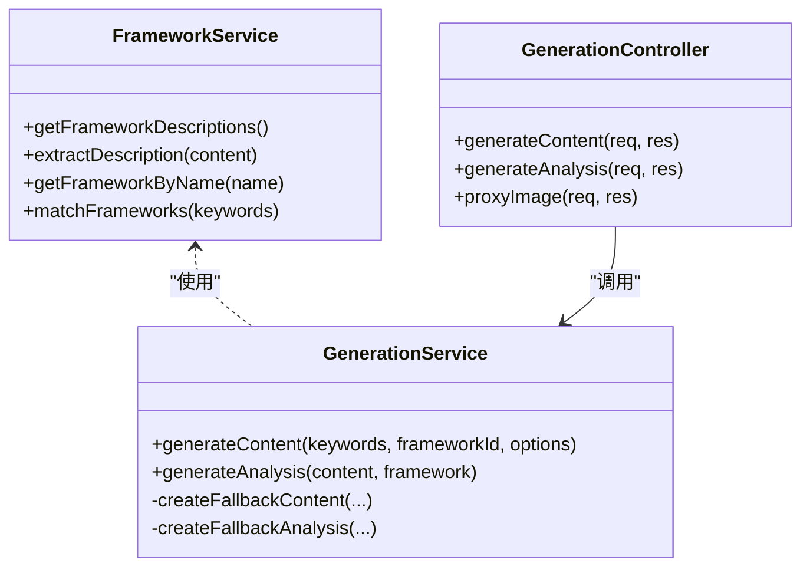
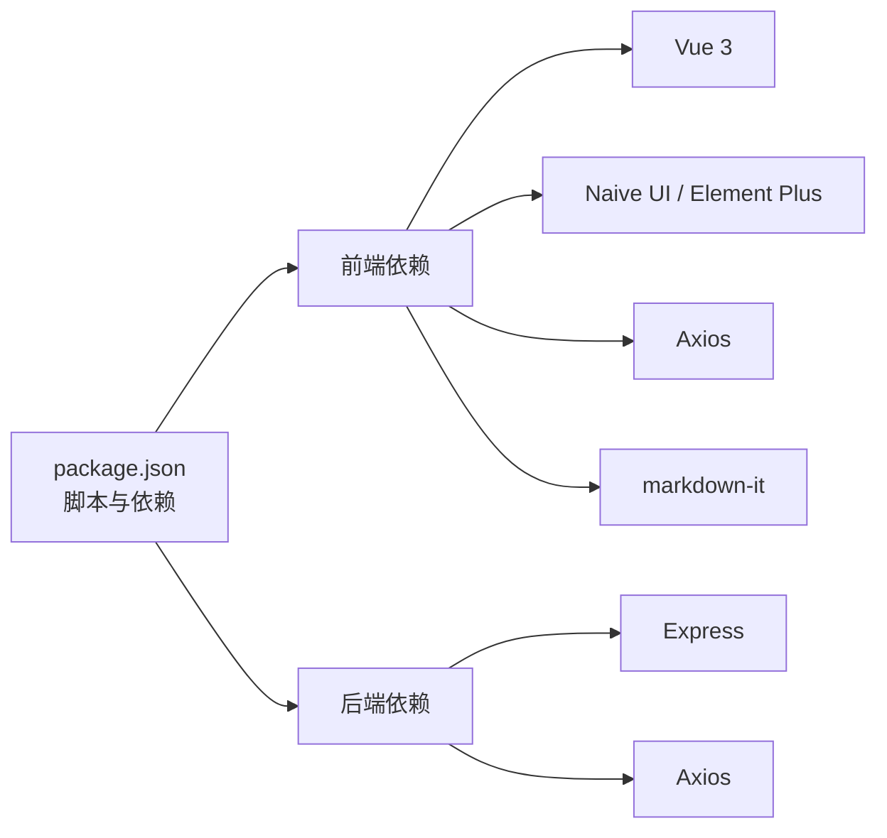

# 黄金圈法则框架

<cite>
**本文引用的文件**
- [黄金圈法则框架.md](file://黄金圈法则框架.md)
- [README.md](file://README.md)
- [小红书爆款框架.md](file://小红书爆款框架.md)
- [src/views/Generate.vue](file://src/views/Generate.vue)
- [frontend/src/views/Generate.vue](file://frontend/src/views/Generate.vue)
- [src/components/FrameworkSelector.vue](file://src/components/FrameworkSelector.vue)
- [frontend/src/components/FrameworkSelector.vue](file://frontend/src/components/FrameworkSelector.vue)
- [src/components/ContentEditor.vue](file://src/components/ContentEditor.vue)
- [backend/src/services/frameworkService.js](file://backend/src/services/frameworkService.js)
- [backend/src/services/generationService.js](file://backend/src/services/generationService.js)
- [backend/src/controllers/generationController.js](file://backend/src/controllers/generationController.js)
- [backend/src/routes/index.js](file://backend/src/routes/index.js)
- [package.json](file://package.json)
</cite>

## 目录
1. [简介](#简介)
2. [项目结构](#项目结构)
3. [核心组件](#核心组件)
4. [架构总览](#架构总览)
5. [详细组件分析](#详细组件分析)
6. [依赖关系分析](#依赖关系分析)
7. [性能考量](#性能考量)
8. [故障排查指南](#故障排查指南)
9. [结论](#结论)
10. [附录](#附录)

## 简介
本文件围绕“黄金圈法则框架”展开，系统阐述 Why-How-What 的三层思维模型在内容创作中的应用，结合小红书平台的爆款要素与本项目的前端工作台实现，给出可操作的创作策略、结构化流程与可视化图示。黄金圈法则强调“从为什么开始”，通过建立情感连接与身份认同，实现更强的信任与传播力。

## 项目结构
本项目采用前后端分离架构，前端工作台负责关键词输入、框架选择、内容生成与预览；后端提供框架解析、内容生成与分析服务，并通过统一路由暴露接口。

图表来源
- [backend/src/routes/index.js](file://backend/src/routes/index.js#L9-L18)
- [backend/src/controllers/generationController.js](file://backend/src/controllers/generationController.js#L10-L64)
- [backend/src/services/generationService.js](file://backend/src/services/generationService.js#L63-L193)
- [backend/src/services/frameworkService.js](file://backend/src/services/frameworkService.js#L9-L59)
- [src/views/Generate.vue](file://src/views/Generate.vue#L177-L427)
- [src/components/FrameworkSelector.vue](file://src/components/FrameworkSelector.vue#L15-L141)
- [src/components/ContentEditor.vue](file://src/components/ContentEditor.vue#L1-L418)

章节来源
- [README.md](file://README.md#L13-L22)
- [package.json](file://package.json#L6-L14)

## 核心组件
- 框架选择器：支持多选/单选，展示框架名称、描述与匹配度，触发生成流程。
- 内容编辑器：支持预览/编辑、图片展示与下载、话题标签管理、重新生成与发布审批。
- 生成页：整合关键词输入、分析与生成、质量分析、实时预览与历史记录。
- 后端服务：解析框架文件、匹配关键词、调用AI生成内容与分析、提供图片代理。

章节来源
- [src/components/FrameworkSelector.vue](file://src/components/FrameworkSelector.vue#L15-L141)
- [src/components/ContentEditor.vue](file://src/components/ContentEditor.vue#L1-L418)
- [src/views/Generate.vue](file://src/views/Generate.vue#L177-L427)
- [backend/src/services/frameworkService.js](file://backend/src/services/frameworkService.js#L9-L59)
- [backend/src/services/generationService.js](file://backend/src/services/generationService.js#L63-L193)

## 架构总览
从用户输入关键词与选择框架，到后端生成内容与分析，再到前端实时预览与编辑，形成一条完整的创作闭环。

图表来源
- [backend/src/routes/index.js](file://backend/src/routes/index.js#L13-L16)
- [backend/src/controllers/generationController.js](file://backend/src/controllers/generationController.js#L10-L64)
- [backend/src/services/generationService.js](file://backend/src/services/generationService.js#L63-L193)

## 详细组件分析

### 黄金圈法则在内容结构中的应用
- Why（为什么）：表达初心、价值观与深层动机，建立情感认同与身份归属。
- How（怎么做）：呈现独特方法论与实现路径，强调“与众不同的做法”和“有效原理”。
- What（是什么）：最终呈现产品/服务/成果，强调“简洁易执行”的价值与结果。

章节来源
- [黄金圈法则框架.md](file://黄金圈法则框架.md#L21-L82)
- [黄金圈法则框架.md](file://黄金圈法则框架.md#L114-L136)

### 小红书平台适配策略
- 视觉钩子：封面高对比、情绪脸庞、关键信息、真实感。
- 标题吸睛：数字/对比/情绪 + 核心关键词 + 价值承诺。
- 情绪价值：第一人称、真实细节、脆弱表达、情绪词汇。
- 实用信息：3分钟阅读、分块呈现、重点标注、以实用结尾。
- 互动引导：低门槛互动、评论引导、关注诱发、分享呼吁。

章节来源
- [小红书爆款框架.md](file://小红书爆款框架.md#L19-L134)
- [小红书爆款框架.md](file://小红书爆款框架.md#L135-L222)

### 前端工作台与生成流程
- 关键词输入与分析：用户输入关键词，前端触发分析并推荐框架。
- 框架选择：支持多选/单选，展示匹配度与描述。
- 内容生成：调用后端生成接口，流式渲染内容，支持重新生成。
- 质量分析：调用分析接口，返回框架有效性、结构与吸引力评分。
- 实时预览：支持手机/桌面双端预览，便于调整。
- 历史记录：保存/加载/删除/清空历史，便于复用。

图表来源
- [src/views/Generate.vue](file://src/views/Generate.vue#L177-L427)
- [src/components/FrameworkSelector.vue](file://src/components/FrameworkSelector.vue#L76-L141)
- [src/components/ContentEditor.vue](file://src/components/ContentEditor.vue#L197-L318)
- [backend/src/routes/index.js](file://backend/src/routes/index.js#L13-L16)
- [backend/src/controllers/generationController.js](file://backend/src/controllers/generationController.js#L10-L64)

章节来源
- [src/views/Generate.vue](file://src/views/Generate.vue#L177-L427)
- [frontend/src/views/Generate.vue](file://frontend/src/views/Generate.vue#L56-L155)

### 后端服务与AI集成
- 框架服务：扫描框架文件，提取标题与描述，支持按关键词匹配。
- 生成服务：构造提示词，调用AI生成内容与分析，提供回退策略。
- 控制器：接收请求参数，调用服务并返回标准化响应。
- 路由：统一暴露框架查询、关键词分析、内容生成与分析、图片代理接口。

图表来源
- [backend/src/services/frameworkService.js](file://backend/src/services/frameworkService.js#L9-L59)
- [backend/src/services/generationService.js](file://backend/src/services/generationService.js#L63-L193)
- [backend/src/controllers/generationController.js](file://backend/src/controllers/generationController.js#L10-L94)

章节来源
- [backend/src/services/frameworkService.js](file://backend/src/services/frameworkService.js#L9-L59)
- [backend/src/services/generationService.js](file://backend/src/services/generationService.js#L63-L193)
- [backend/src/controllers/generationController.js](file://backend/src/controllers/generationController.js#L10-L94)
- [backend/src/routes/index.js](file://backend/src/routes/index.js#L9-L18)

### 黄金圈内容创作检查清单
- Why 是否足够打动人心（不是泛泛而谈）
- How 是否有独特的方法论支撑
- What 是否简洁易执行
- 三者之间是否有紧密的逻辑关联
- 整体是否传递出清晰的价值主张
- 用户读完是否觉得“这个人说的有道理”

章节来源
- [黄金圈法则框架.md](file://黄金圈法则框架.md#L145-L153)

## 依赖关系分析
- 前端依赖：Vue 3、Naive UI、Element Plus、Axios、Markdown-it、并发执行工具等。
- 后端依赖：Express、Axios（用于图片代理）、文件读取工具等。
- 脚本：一键安装与启动前后端、并行开发模式。

图表来源
- [package.json](file://package.json#L15-L31)

章节来源
- [package.json](file://package.json#L6-L14)

## 性能考量
- 前端：组件懒加载、虚拟滚动（如资源列表）、图片懒加载与压缩、CDN加速。
- 后端：接口限流与超时控制、图片代理缓存、错误快速失败与回退策略。
- 生成链路：提示词精简、流式返回、分析与生成并行优化。

## 故障排查指南
- 生成失败：检查关键词与框架是否为空；查看后端错误日志；确认AI服务可用性。
- 分析失败：确认内容结构与框架参数；查看回退分析是否正常返回。
- 图片下载跨域：通过后端代理接口下载，避免前端跨域限制。
- 预览异常：切换手机/桌面预览模式；检查内容渲染与图片加载状态。

章节来源
- [backend/src/controllers/generationController.js](file://backend/src/controllers/generationController.js#L66-L94)
- [src/components/ContentEditor.vue](file://src/components/ContentEditor.vue#L209-L227)

## 结论
黄金圈法则为内容创作提供了从“动机与信念”到“方法与实现”再到“价值呈现”的系统化结构。结合小红书平台的爆款要素与本项目的前端工作台实现，创作者可以更高效地构建有深度、有情感、可执行的内容，并通过质量分析与实时预览持续优化，最终实现更高的互动与传播效果。

## 附录
- 成功案例结构示例：从 Why 的个人经历出发，How 的独特方法论，What 的结果呈现，三者层层递进，逻辑紧密。
- 适配场景：个人品牌塑造、方法论分享、价值主张表达、产品/服务价值传递、长期教育类内容。

章节来源
- [黄金圈法则框架.md](file://黄金圈法则框架.md#L114-L144)