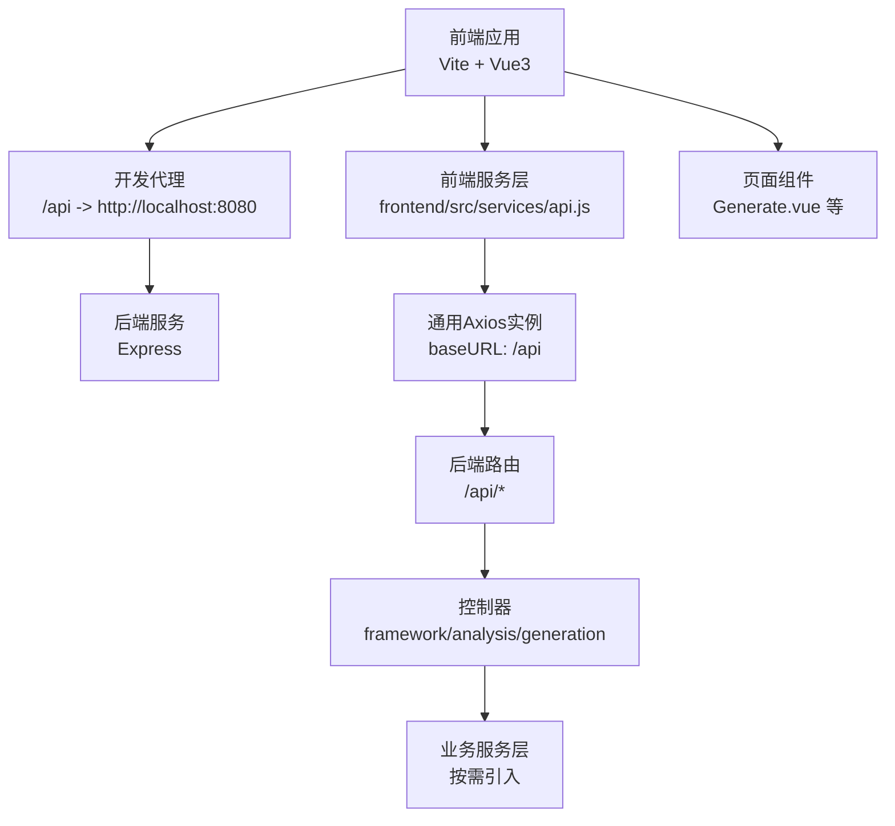
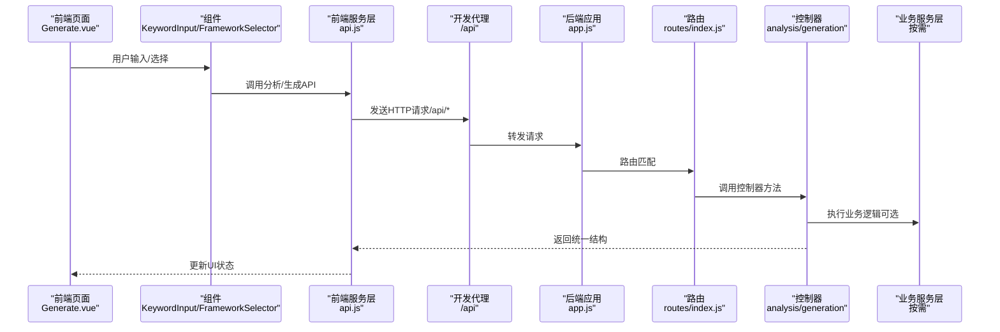
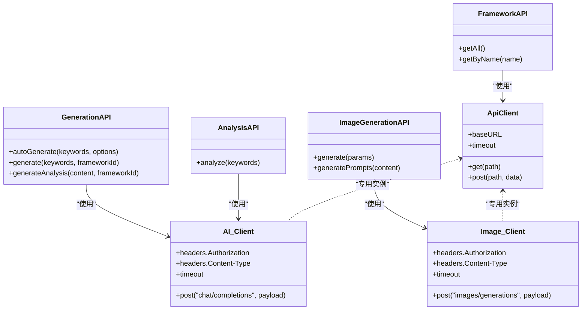
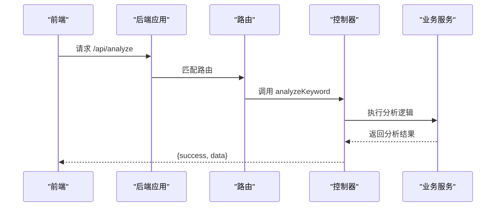
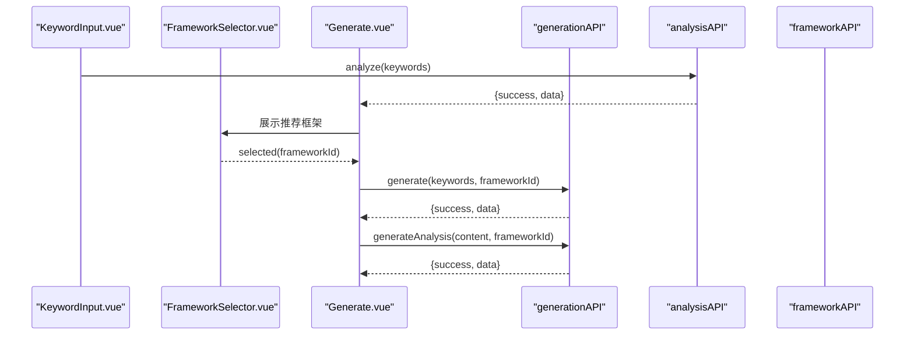
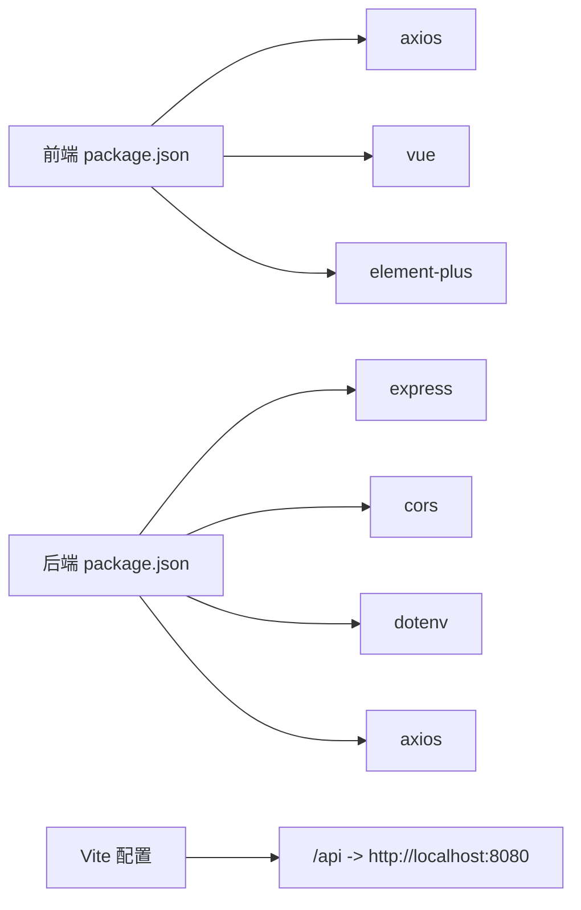

# API集成策略

<cite>
**本文引用的文件**
- [frontend/src/services/api.js](file://frontend/src/services/api.js)
- [src/services/api.js](file://src/services/api.js)
- [frontend/src/views/Generate.vue](file://frontend/src/views/Generate.vue)
- [frontend/src/components/KeywordInput.vue](file://frontend/src/components/KeywordInput.vue)
- [frontend/src/components/FrameworkSelector.vue](file://frontend/src/components/FrameworkSelector.vue)
- [frontend/src/components/ContentEditor.vue](file://frontend/src/components/ContentEditor.vue)
- [backend/src/app.js](file://backend/src/app.js)
- [backend/src/routes/index.js](file://backend/src/routes/index.js)
- [backend/src/controllers/frameworkController.js](file://backend/src/controllers/frameworkController.js)
- [backend/src/controllers/analysisController.js](file://backend/src/controllers/analysisController.js)
- [backend/src/controllers/generationController.js](file://backend/src/controllers/generationController.js)
- [frontend/vite.config.js](file://frontend/vite.config.js)
- [backend/.env.example](file://backend/.env.example)
- [backend/package.json](file://backend/package.json)
- [frontend/package.json](file://frontend/package.json)
</cite>

## 目录
1. [简介](#简介)
2. [项目结构](#项目结构)
3. [核心组件](#核心组件)
4. [架构总览](#架构总览)
5. [详细组件分析](#详细组件分析)
6. [依赖关系分析](#依赖关系分析)
7. [性能考量](#性能考量)
8. [故障排查指南](#故障排查指南)
9. [结论](#结论)
10. [附录](#附录)

## 简介
本文件系统化阐述前端与后端API的集成策略与通信机制，覆盖HTTP客户端配置（Axios实例）、请求/响应拦截器扩展点、API调用模式（同步/异步/流式）、错误处理策略、缓存与重试机制、认证与安全、以及API版本管理与兼容性处理方法。文档基于仓库中现有的前端服务层、后端路由与控制器、开发服务器代理配置等实现进行分析与总结。

## 项目结构
- 前端采用Vite+Vue3，服务层集中于src/services/api.js，封装通用HTTP客户端与各领域API模块（框架、分析、生成、图片生成等）。
- 后端采用Express，统一在app.js中启用CORS与JSON解析，路由集中在routes/index.js，控制器分别处理框架、分析、生成与图片代理等业务。
- 开发阶段通过Vite代理将/api前缀转发至后端服务端口，便于前后端联调。

图表来源
- [frontend/vite.config.js](file://frontend/vite.config.js#L8-L16)
- [backend/src/app.js](file://backend/src/app.js#L14-L20)
- [backend/src/routes/index.js](file://backend/src/routes/index.js#L9-L18)
- [frontend/src/services/api.js](file://frontend/src/services/api.js#L8-L11)

章节来源
- [frontend/vite.config.js](file://frontend/vite.config.js#L8-L16)
- [backend/src/app.js](file://backend/src/app.js#L14-L20)
- [backend/src/routes/index.js](file://backend/src/routes/index.js#L9-L18)
- [frontend/src/services/api.js](file://frontend/src/services/api.js#L8-L11)

## 核心组件
- 前端通用HTTP客户端
  - 创建基础Axios实例，设置baseURL为/api与超时时间；同时定义多套专用客户端（AI、火山引擎图片）以满足不同第三方服务的鉴权与超时需求。
  - 提供框架、分析、生成、图片生成等API模块，统一返回结构体，便于前端消费。
- 后端HTTP服务
  - Express应用启用CORS与JSON解析，挂载路由至/api前缀。
  - 路由映射到对应控制器，控制器负责参数校验、调用业务服务并返回统一结构。
- 开发代理
  - Vite开发服务器将/api前缀代理到后端端口，避免跨域与本地联调问题。

章节来源
- [src/services/api.js](file://src/services/api.js#L8-L11)
- [src/services/api.js](file://src/services/api.js#L16-L25)
- [src/services/api.js](file://src/services/api.js#L30-L37)
- [backend/src/app.js](file://backend/src/app.js#L14-L20)
- [backend/src/routes/index.js](file://backend/src/routes/index.js#L11-L16)
- [frontend/vite.config.js](file://frontend/vite.config.js#L10-L15)

## 架构总览
从前端到后端的关键交互路径如下：前端组件触发API调用，经由前端服务层封装的Axios实例发送请求；开发代理将/api请求转发至后端；后端路由解析请求并交由控制器处理；控制器调用业务服务（必要时）并返回统一结构；前端接收响应并更新UI状态。

图表来源
- [frontend/src/views/Generate.vue](file://frontend/src/views/Generate.vue#L75-L116)
- [frontend/src/components/KeywordInput.vue](file://frontend/src/components/KeywordInput.vue#L81-L102)
- [frontend/src/components/FrameworkSelector.vue](file://frontend/src/components/FrameworkSelector.vue#L56-L60)
- [src/services/api.js](file://src/services/api.js#L211-L244)
- [src/services/api.js](file://src/services/api.js#L256-L320)
- [frontend/vite.config.js](file://frontend/vite.config.js#L10-L15)
- [backend/src/app.js](file://backend/src/app.js#L20)
- [backend/src/routes/index.js](file://backend/src/routes/index.js#L13-L16)
- [backend/src/controllers/analysisController.js](file://backend/src/controllers/analysisController.js#L6-L29)
- [backend/src/controllers/generationController.js](file://backend/src/controllers/generationController.js#L10-L33)

## 详细组件分析

### 前端HTTP客户端与API模块
- 通用Axios实例
  - baseURL统一为/api，超时10秒，便于与后端路由保持一致。
- 专用客户端
  - AI客户端：读取环境变量中的AI服务地址与API Key，设置Authorization与Content-Type，超时120秒，支持流式输出。
  - 图片客户端：读取火山引擎服务地址与API Key，设置Authorization与Content-Type，超时120秒。
- API模块
  - 框架API：提供获取全部框架与按名称查询的接口。
  - 分析API：向AI客户端发起分析请求，返回推荐框架与原始文本。
  - 生成API：提供一键全自动生成、按框架生成、质量分析等接口，内部调用AI客户端。
  - 图片生成API：封装火山引擎图片生成接口，返回图片URL与原始响应；提供将文案转为图片提示词的能力。
- 流式数据传输
  - 在AI客户端中，当传入流式回调时，使用fetch与ReadableStream进行增量数据解析与回调，实现边读边用的流式体验。

图表来源
- [src/services/api.js](file://src/services/api.js#L8-L11)
- [src/services/api.js](file://src/services/api.js#L16-L25)
- [src/services/api.js](file://src/services/api.js#L30-L37)
- [src/services/api.js](file://src/services/api.js#L182-L201)
- [src/services/api.js](file://src/services/api.js#L206-L245)
- [src/services/api.js](file://src/services/api.js#L250-L364)
- [src/services/api.js](file://src/services/api.js#L369-L449)

章节来源
- [src/services/api.js](file://src/services/api.js#L8-L11)
- [src/services/api.js](file://src/services/api.js#L16-L25)
- [src/services/api.js](file://src/services/api.js#L30-L37)
- [src/services/api.js](file://src/services/api.js#L182-L201)
- [src/services/api.js](file://src/services/api.js#L206-L245)
- [src/services/api.js](file://src/services/api.js#L250-L364)
- [src/services/api.js](file://src/services/api.js#L369-L449)

### 后端路由与控制器
- 应用启动
  - 启用CORS并限制来源，解析JSON，挂载/api路由。
- 路由映射
  - GET /api/frameworks：获取所有框架
  - GET /api/frameworks/:name：按名称获取框架
  - POST /api/analyze：关键词分析
  - POST /api/generate：生成内容
  - POST /api/generate/analysis：质量分析
  - GET /api/proxy-image：图片下载代理（解决跨域）
- 控制器职责
  - 参数校验与错误处理，统一返回success/data/error结构。
  - 生成控制器提供图片代理功能，使用axios以流式方式下载远端图片并转发给前端。

图表来源
- [backend/src/app.js](file://backend/src/app.js#L14-L20)
- [backend/src/routes/index.js](file://backend/src/routes/index.js#L13-L16)
- [backend/src/controllers/analysisController.js](file://backend/src/controllers/analysisController.js#L6-L29)

章节来源
- [backend/src/app.js](file://backend/src/app.js#L14-L20)
- [backend/src/routes/index.js](file://backend/src/routes/index.js#L11-L16)
- [backend/src/controllers/frameworkController.js](file://backend/src/controllers/frameworkController.js#L8-L21)
- [backend/src/controllers/analysisController.js](file://backend/src/controllers/analysisController.js#L6-L29)
- [backend/src/controllers/generationController.js](file://backend/src/controllers/generationController.js#L10-L33)

### 前端页面与组件的API调用模式
- 页面流程
  - 关键词输入组件触发分析API，返回推荐框架与原始文本。
  - 框架选择组件默认选中首个推荐框架。
  - 生成按钮触发生成API，随后调用质量分析API，最终将结果交给编辑器组件展示。
- 调用模式
  - 同步调用：页面组件通过await等待API返回，保证UI状态更新顺序。
  - 异步处理：使用Element Plus消息提示与加载状态，提升用户体验。
  - 流式数据传输：AI客户端支持onStream回调，前端可实时渲染增量内容（当前页面未直接使用流式回调，但底层能力已具备）。

图表来源
- [frontend/src/components/KeywordInput.vue](file://frontend/src/components/KeywordInput.vue#L81-L102)
- [frontend/src/components/FrameworkSelector.vue](file://frontend/src/components/FrameworkSelector.vue#L56-L60)
- [frontend/src/views/Generate.vue](file://frontend/src/views/Generate.vue#L75-L135)
- [src/services/api.js](file://src/services/api.js#L206-L245)
- [src/services/api.js](file://src/services/api.js#L250-L320)

章节来源
- [frontend/src/views/Generate.vue](file://frontend/src/views/Generate.vue#L75-L135)
- [frontend/src/components/KeywordInput.vue](file://frontend/src/components/KeywordInput.vue#L81-L102)
- [frontend/src/components/FrameworkSelector.vue](file://frontend/src/components/FrameworkSelector.vue#L56-L60)
- [src/services/api.js](file://src/services/api.js#L206-L245)
- [src/services/api.js](file://src/services/api.js#L250-L320)

### 错误处理机制
- 前端
  - 分析/生成API在异常时返回结构化的错误提示，页面组件捕获并显示友好信息。
  - 图片生成API对响应格式异常与错误信息进行兜底处理，返回包含错误字段的对象。
- 后端
  - 控制器对必填参数缺失返回400，业务异常返回500，并统一返回success/error结构。
  - 图片代理控制器对远端下载异常进行日志记录并返回错误响应。

章节来源
- [src/services/api.js](file://src/services/api.js#L233-L243)
- [src/services/api.js](file://src/services/api.js#L310-L319)
- [src/services/api.js](file://src/services/api.js#L403-L409)
- [backend/src/controllers/analysisController.js](file://backend/src/controllers/analysisController.js#L10-L15)
- [backend/src/controllers/generationController.js](file://backend/src/controllers/generationController.js#L69-L94)

### 缓存策略与重试机制
- 现状
  - 前端知识库API使用localStorage进行本地持久化，提供增删改查能力，属于“本地缓存”而非“网络缓存”。
  - 未发现显式的HTTP缓存策略与自动重试机制。
- 建议
  - 对频繁访问的静态资源（如框架列表）可在前端引入HTTP缓存头或基于内存缓存的装饰器。
  - 对易失败的网络请求可引入指数退避重试，结合请求去重与超时控制，避免重复请求风暴。

章节来源
- [src/services/api.js](file://src/services/api.js#L42-L85)

### 认证机制与安全
- 前端
  - AI客户端通过Authorization头携带API Key；图片客户端同样携带API Key。
  - 通过环境变量注入密钥，避免硬编码。
- 后端
  - 未见后端鉴权中间件；CORS允许来自配置来源的请求。
- 安全建议
  - 后端应引入鉴权中间件（如JWT或API Key校验），并对敏感接口进行权限控制。
  - 前端密钥应通过后端代理访问第三方服务，避免在浏览器暴露密钥。

章节来源
- [src/services/api.js](file://src/services/api.js#L18-L23)
- [src/services/api.js](file://src/services/api.js#L32-L36)
- [backend/src/app.js](file://backend/src/app.js#L14-L16)

### API版本管理与兼容性
- 现状
  - 当前路由未体现版本前缀（如/v1），所有接口均在根路径下。
- 建议
  - 引入版本前缀（如/api/v1），并在迁移期间保留旧接口一段时间，逐步淘汰。
  - 对返回结构进行约束与变更日志，确保向后兼容或提供迁移指引。

章节来源
- [backend/src/routes/index.js](file://backend/src/routes/index.js#L11-L16)

## 依赖关系分析
- 前端依赖
  - axios用于HTTP请求；element-plus提供UI组件；vue与vue-router支撑页面与导航。
- 后端依赖
  - express提供Web框架；cors与dotenv提供跨域与环境变量支持；axios用于图片代理下载。
- 代理与运行
  - 前端Vite开发服务器通过代理将/api转发至后端端口；后端监听配置端口并提供服务。

图表来源
- [frontend/package.json](file://frontend/package.json#L10-L15)
- [backend/package.json](file://backend/package.json#L10-L15)
- [frontend/vite.config.js](file://frontend/vite.config.js#L10-L15)

章节来源
- [frontend/package.json](file://frontend/package.json#L10-L15)
- [backend/package.json](file://backend/package.json#L10-L15)
- [frontend/vite.config.js](file://frontend/vite.config.js#L10-L15)

## 性能考量
- 超时设置
  - 通用客户端10秒；AI与图片客户端120秒，满足长耗时任务需求。
- 流式传输
  - AI客户端支持流式回调，前端可按块增量渲染，降低首屏等待时间。
- 代理与跨域
  - 开发代理减少跨域问题，提高联调效率；生产环境建议后端统一处理CORS与缓存头。

章节来源
- [src/services/api.js](file://src/services/api.js#L10)
- [src/services/api.js](file://src/services/api.js#L24)
- [src/services/api.js](file://src/services/api.js#L36)
- [src/services/api.js](file://src/services/api.js#L123-L167)
- [frontend/vite.config.js](file://frontend/vite.config.js#L10-L15)
- [backend/src/app.js](file://backend/src/app.js#L14-L16)

## 故障排查指南
- 常见问题
  - CORS错误：检查后端CORS配置与前端代理是否正确。
  - 400错误：确认请求体包含必需字段（关键词、框架ID等）。
  - 500错误：查看后端日志定位业务异常；前端对异常进行兜底提示。
  - 图片生成失败：检查第三方服务地址与API Key配置；关注响应格式与错误信息。
- 排查步骤
  - 确认Vite代理规则与后端端口一致。
  - 在浏览器开发者工具Network面板观察请求与响应。
  - 在后端控制器中添加日志，定位参数与业务逻辑问题。

章节来源
- [backend/src/app.js](file://backend/src/app.js#L14-L16)
- [backend/src/controllers/analysisController.js](file://backend/src/controllers/analysisController.js#L10-L15)
- [backend/src/controllers/generationController.js](file://backend/src/controllers/generationController.js#L69-L94)
- [src/services/api.js](file://src/services/api.js#L403-L409)

## 结论
本项目在前后端分离架构下，通过统一的HTTP客户端与路由设计实现了清晰的API集成策略。前端提供了完善的分析、生成与图片生成能力，后端控制器承担参数校验与统一响应职责。建议后续在后端引入鉴权与版本管理，在前端补充缓存与重试机制，并在生产环境强化安全与性能治理。

## 附录
- 环境变量与配置
  - 后端示例环境变量包含端口与CORS来源。
  - 前端服务层通过环境变量注入第三方服务地址与API Key。
- 文件清单
  - 前端服务层与页面组件、组件文件位于frontend/src目录。
  - 后端应用、路由与控制器位于backend/src目录。
  - Vite开发代理配置位于frontend/vite.config.js。

章节来源
- [backend/.env.example](file://backend/.env.example#L1-L3)
- [src/services/api.js](file://src/services/api.js#L16-L25)
- [src/services/api.js](file://src/services/api.js#L30-L37)
- [frontend/src/views/Generate.vue](file://frontend/src/views/Generate.vue#L1-L54)
- [frontend/src/components/KeywordInput.vue](file://frontend/src/components/KeywordInput.vue#L1-L44)
- [frontend/src/components/FrameworkSelector.vue](file://frontend/src/components/FrameworkSelector.vue#L1-L40)
- [frontend/src/components/ContentEditor.vue](file://frontend/src/components/ContentEditor.vue#L1-L40)
- [backend/src/app.js](file://backend/src/app.js#L1-L26)
- [backend/src/routes/index.js](file://backend/src/routes/index.js#L1-L21)