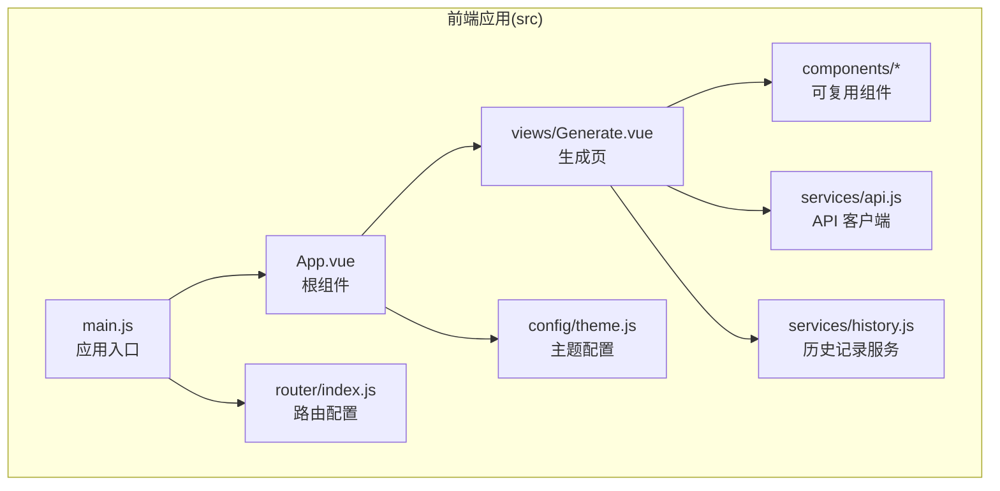
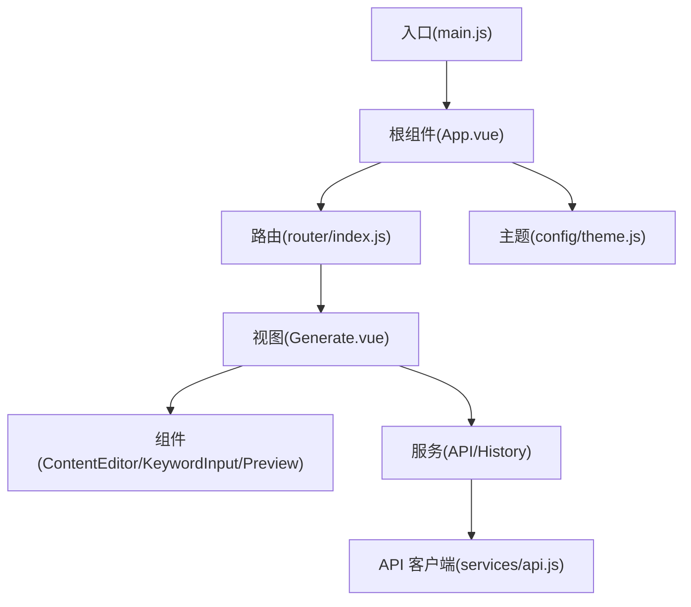
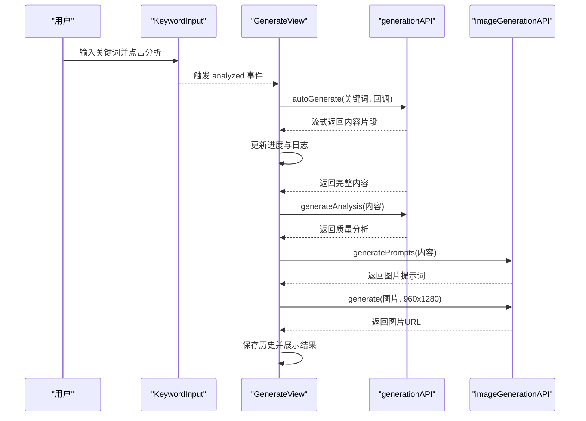
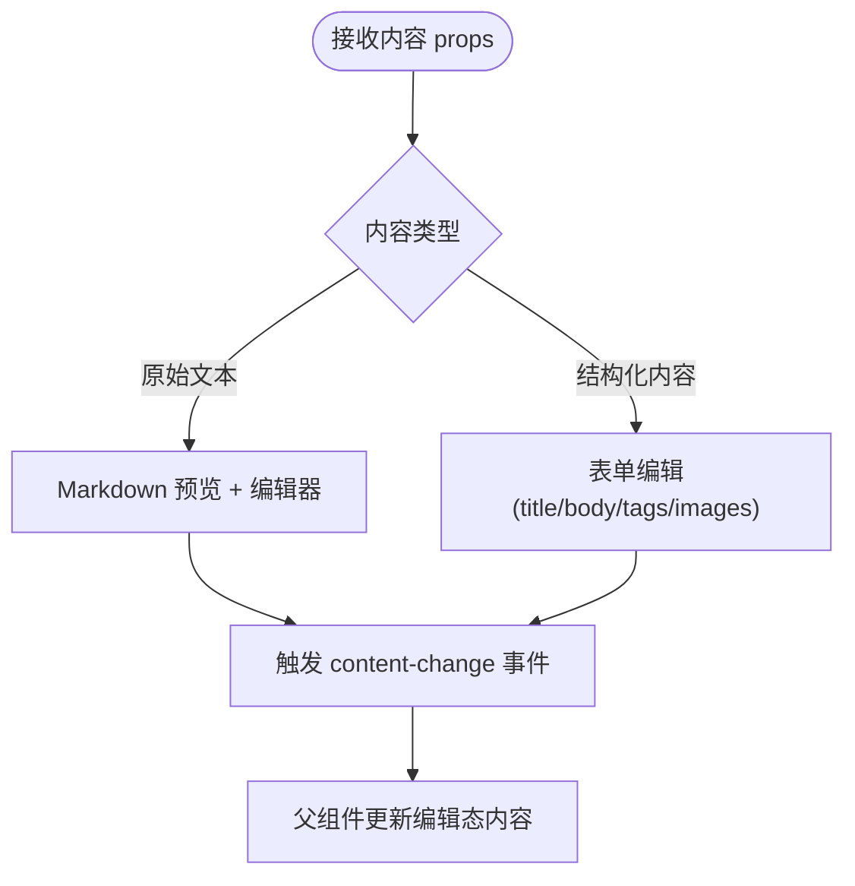
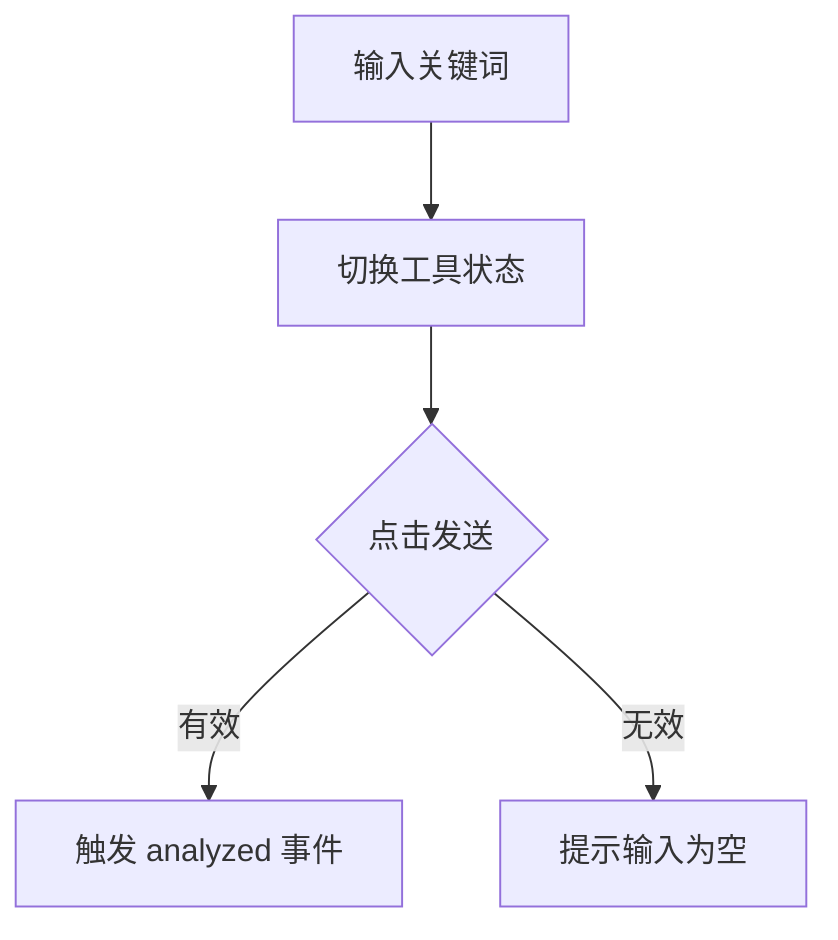
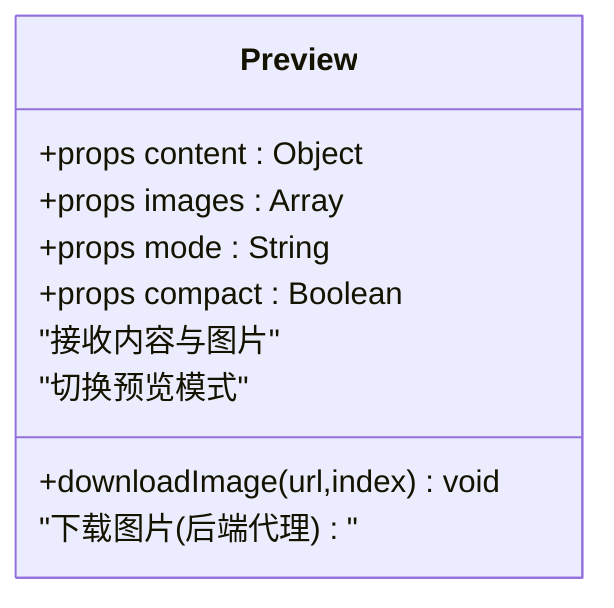
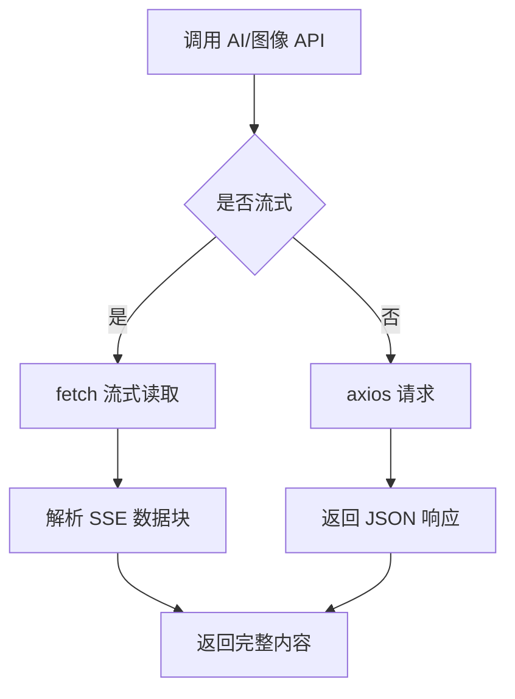
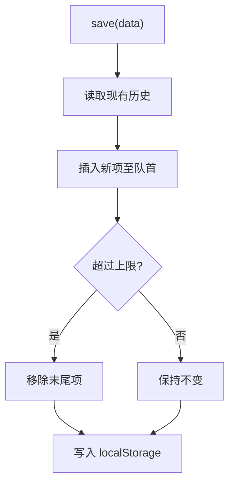
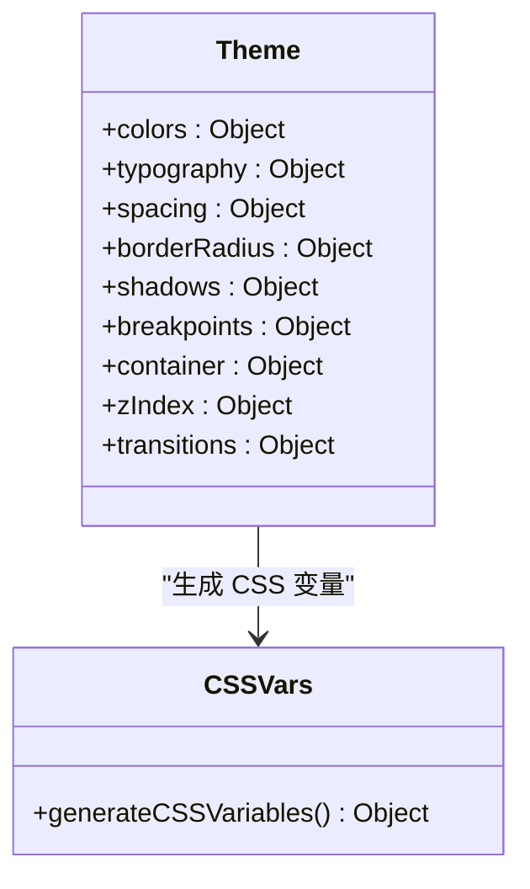
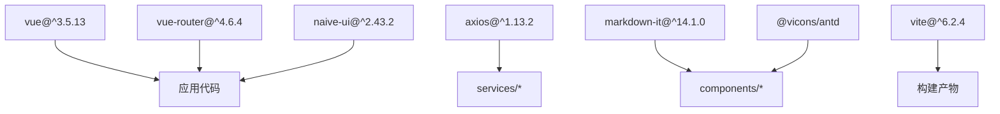

# 前端应用架构

<cite>
**本文档引用的文件**
- [main.js](file://src/main.js)
- [App.vue](file://src/App.vue)
- [router/index.js](file://src/router/index.js)
- [services/api.js](file://src/services/api.js)
- [views/Generate.vue](file://src/views/Generate.vue)
- [components/ContentEditor.vue](file://src/components/ContentEditor.vue)
- [components/KeywordInput.vue](file://src/components/KeywordInput.vue)
- [components/Preview.vue](file://src/components/Preview.vue)
- [services/history.js](file://src/services/history.js)
- [config/theme.js](file://src/config/theme.js)
- [package.json](file://package.json)
</cite>

## 目录
1. [简介](#简介)
2. [项目结构](#项目结构)
3. [核心组件](#核心组件)
4. [架构总览](#架构总览)
5. [详细组件分析](#详细组件分析)
6. [依赖关系分析](#依赖关系分析)
7. [性能考虑](#性能考虑)
8. [故障排除指南](#故障排除指南)
9. [结论](#结论)
10. [附录](#附录)

## 简介
本项目是一个基于 Vue 3 的前端应用，专注于小红书文案与图文内容的智能生成与管理工作。应用采用组件化架构，结合 Element Plus 与 Naive UI 提供现代化界面，通过 Axios 与自定义 API 客户端集成后端服务与第三方 AI/图像服务，实现了从关键词输入、AI 内容生成、质量分析到图片生成与预览的完整工作流。

## 项目结构
应用采用典型的 Vue 3 单页应用结构，主要目录与职责如下：
- src：核心源码目录
  - components：可复用 UI 组件（如内容编辑器、关键词输入、预览等）
  - views：页面级视图（如生成页、知识库、设置等）
  - services：API 客户端与业务服务（如历史记录、AI/图像 API）
  - router：路由配置
  - config：主题与设计系统配置
  - main.js：应用入口，初始化 Vue 实例、插件与路由
  - App.vue：根组件，承载全局布局与主题配置
- frontend：早期版本的前端实现（Element Plus 版本）
- backend：后端服务（控制器、路由、服务层）
- docs：项目文档与示例
- 根目录：构建配置、环境变量与包管理

**图表来源**
- [main.js](file://src/main.js#L1-L16)
- [App.vue](file://src/App.vue#L1-L108)
- [router/index.js](file://src/router/index.js#L1-L26)
- [services/api.js](file://src/services/api.js#L1-L454)
- [views/Generate.vue](file://src/views/Generate.vue#L1-L668)
- [components/ContentEditor.vue](file://src/components/ContentEditor.vue#L1-L418)
- [components/KeywordInput.vue](file://src/components/KeywordInput.vue#L1-L265)
- [components/Preview.vue](file://src/components/Preview.vue#L1-L411)
- [services/history.js](file://src/services/history.js#L1-L89)
- [config/theme.js](file://src/config/theme.js#L1-L274)

**章节来源**
- [main.js](file://src/main.js#L1-L16)
- [package.json](file://package.json#L1-L32)

## 核心组件
- 应用入口与初始化
  - 在入口文件中创建 Vue 应用实例，挂载 Element Plus/Naive UI 插件与路由，随后挂载到 DOM。
- 根组件与布局
  - 根组件负责全局主题配置、消息/对话/通知/加载条等 Provider 包裹，以及工作台布局与侧边栏导航。
- 视图组件
  - 生成页作为核心工作流容器，整合关键词输入、内容编辑、质量分析与图片预览。
- 可复用组件
  - 内容编辑器：支持 Markdown 预览与富文本编辑，提供 AI 配图展示与下载。
  - 关键词输入：胶囊式输入，支持快捷工具选择与分析触发。
  - 预览组件：模拟小红书图文内容在移动端与桌面端的预览效果。
- 服务层
  - API 客户端：统一管理 AI/图像服务与本地知识库，支持流式输出与错误处理。
  - 历史记录服务：基于 localStorage 的生成历史管理。

**章节来源**
- [main.js](file://src/main.js#L1-L16)
- [App.vue](file://src/App.vue#L1-L108)
- [views/Generate.vue](file://src/views/Generate.vue#L1-L668)
- [components/ContentEditor.vue](file://src/components/ContentEditor.vue#L1-L418)
- [components/KeywordInput.vue](file://src/components/KeywordInput.vue#L1-L265)
- [components/Preview.vue](file://src/components/Preview.vue#L1-L411)
- [services/api.js](file://src/services/api.js#L1-L454)
- [services/history.js](file://src/services/history.js#L1-L89)

## 架构总览
应用采用“入口 -> 根组件 -> 视图 -> 组件 -> 服务”的分层架构：
- 入口负责插件与路由注册
- 根组件负责主题与全局布局
- 视图承载业务流程与状态
- 组件封装 UI 与交互
- 服务层抽象 API 与本地存储

**图表来源**
- [main.js](file://src/main.js#L1-L16)
- [App.vue](file://src/App.vue#L1-L108)
- [router/index.js](file://src/router/index.js#L1-L26)
- [views/Generate.vue](file://src/views/Generate.vue#L1-L668)
- [services/api.js](file://src/services/api.js#L1-L454)
- [config/theme.js](file://src/config/theme.js#L1-L274)

## 详细组件分析

### 组件 A：生成页（Generate.vue）
- 设计理念
  - 采用“欢迎面板 + 生成流程 + 编辑与分析 + 预览侧边栏 + 历史抽屉”的组合布局，强调从输入到产出的完整工作流。
  - 使用固定底部输入区与可展开预览侧边栏，兼顾移动端与桌面端体验。
- 状态管理
  - 通过响应式引用管理生成状态、进度、日志、内容与图片等。
  - 使用计算属性动态调整侧边栏宽度与预览设备。
- 生命周期与事件
  - 在挂载时加载历史记录；在生成过程中通过流式回调更新进度与内容。
- 数据流
  - 关键词输入触发分析与生成；生成完成后自动进行质量分析与图片生成；支持历史记录的增删查改。

**图表来源**
- [views/Generate.vue](file://src/views/Generate.vue#L257-L324)
- [services/api.js](file://src/services/api.js#L256-L320)
- [services/api.js](file://src/services/api.js#L417-L448)

**章节来源**
- [views/Generate.vue](file://src/views/Generate.vue#L1-L668)

### 组件 B：内容编辑器（ContentEditor.vue）
- 功能特性
  - 支持 Markdown 预览与富文本编辑双模式；展示 AI 生成的配图并提供下载。
  - 提供“重新生成”、“预览效果”、“加入知识库”、“人工审批并发布”等操作。
- 数据绑定与事件
  - 通过 props 接收内容与图片，通过 emits 向父组件传递变更与操作事件。
  - 使用 MarkdownIt 解析 Markdown 内容，实现预览区域渲染。
- 交互设计
  - 图片卡片悬停显示下载按钮；标签输入支持动态添加与移除。

**图表来源**
- [components/ContentEditor.vue](file://src/components/ContentEditor.vue#L245-L316)

**章节来源**
- [components/ContentEditor.vue](file://src/components/ContentEditor.vue#L1-L418)

### 组件 C：关键词输入（KeywordInput.vue）
- 功能特性
  - 胶囊式输入框，支持快捷工具选择（搜索、爬虫、电商监控、趋势分析）。
  - 支持 Enter 快速提交与分析事件向上抛出。
- 交互设计
  - 工具按钮采用激活态与默认态区分；输入区支持隐藏与显示切换。
  - 通过暴露的 setValues 方法供父组件自动填充选品信息。

**图表来源**
- [components/KeywordInput.vue](file://src/components/KeywordInput.vue#L132-L142)

**章节来源**
- [components/KeywordInput.vue](file://src/components/KeywordInput.vue#L1-L265)

### 组件 D：预览组件（Preview.vue）
- 功能特性
  - 支持移动端与桌面端两种预览模式；展示图片轮播与内容正文。
  - 提供点赞、收藏、评论等互动模拟；支持图片下载。
- 技术实现
  - 使用 Naive UI 组件库构建卡片与交互；通过 props 接收内容与图片。
  - 图片下载通过后端代理解决跨域问题。

**图表来源**
- [components/Preview.vue](file://src/components/Preview.vue#L168-L208)

**章节来源**
- [components/Preview.vue](file://src/components/Preview.vue#L1-L411)

### 组件 E：API 客户端（services/api.js）
- 设计理念
  - 将不同服务（AI、图像、知识库）抽象为独立模块，便于扩展与维护。
  - 对 AI 服务采用 fetch 流式传输与 axios 非流式两种调用方式，满足不同场景。
- 关键能力
  - AI 模型调用：支持系统提示词、用户提示词与流式输出回调。
  - 图像生成：基于火山引擎 API，支持提示词解析与批量生成。
  - 知识库：基于 localStorage 的 CRUD 操作，提供条目管理。
- 错误处理
  - 对 HTTP 错误与解析异常进行捕获与降级处理，保证 UI 稳定性。

**图表来源**
- [services/api.js](file://src/services/api.js#L94-L177)
- [services/api.js](file://src/services/api.js#L377-L410)

**章节来源**
- [services/api.js](file://src/services/api.js#L1-L454)

### 组件 F：历史记录服务（services/history.js）
- 设计理念
  - 以 localStorage 为基础的轻量级历史管理，限制最大长度，保证性能与稳定性。
- 关键能力
  - 保存、读取、按 ID 查询、删除与清空历史。
  - 新增项插入队首，超出上限时移除末尾项。

**图表来源**
- [services/history.js](file://src/services/history.js#L14-L41)

**章节来源**
- [services/history.js](file://src/services/history.js#L1-L89)

### 组件 G：主题系统（config/theme.js）
- 设计理念
  - 通过集中化的主题配置管理颜色、字体、间距、圆角、阴影、断点等设计变量。
  - 提供 CSS 变量生成函数，便于在样式中统一引用。
- 关键能力
  - 颜色系统：主色、辅色、成功/警告/错误/中性色，背景与文字色。
  - 字体系统：字体族、字号、字重、行高。
  - 间距、圆角、阴影、断点、容器宽度、Z-index 层级与过渡动画。

**图表来源**
- [config/theme.js](file://src/config/theme.js#L6-L235)
- [config/theme.js](file://src/config/theme.js#L241-L271)

**章节来源**
- [config/theme.js](file://src/config/theme.js#L1-L274)

## 依赖关系分析
- 框架与库
  - Vue 3：核心框架
  - vue-router：路由管理
  - naive-ui：UI 组件库
  - element-plus：早期版本 UI 库
  - axios：HTTP 客户端
  - markdown-it：Markdown 渲染
  - @vicons/antd：图标库
- 构建与开发
  - Vite：构建工具
  - concurrently：并发启动前后端

**图表来源**
- [package.json](file://package.json#L15-L30)

**章节来源**
- [package.json](file://package.json#L1-L32)

## 性能考虑
- 流式渲染
  - 生成过程采用流式回调逐步更新内容，避免一次性渲染大量文本导致卡顿。
- 图片懒加载与下载代理
  - 预览组件使用轮播与占位，减少初始渲染压力；图片下载通过后端代理降低跨域风险。
- 本地存储优化
  - 历史记录限制最大长度，避免 localStorage 过大影响性能。
- 组件拆分与复用
  - 将编辑、预览、输入等模块拆分为独立组件，提升可维护性与复用性。

## 故障排除指南
- AI 生成失败
  - 检查环境变量（AI 基础地址、API Key、模型名称）是否正确配置。
  - 查看网络面板与控制台错误信息，确认流式响应解析是否异常。
- 图片生成异常
  - 确认图像服务的 API Key 与模型配置；检查返回数据结构是否符合预期。
- 预览下载失败
  - 确认后端代理接口可用；检查跨域设置与响应状态码。
- 历史记录无法读取
  - 检查 localStorage 是否被浏览器禁用或空间不足；查看序列化/反序列化错误。

**章节来源**
- [services/api.js](file://src/services/api.js#L120-L177)
- [services/api.js](file://src/services/api.js#L390-L410)
- [components/Preview.vue](file://src/components/Preview.vue#L146-L166)
- [services/history.js](file://src/services/history.js#L48-L54)

## 结论
本项目通过清晰的组件化架构、完善的 API 集成策略与主题系统，构建了一个从输入到产出的完整工作流。生成页作为核心枢纽，串联关键词输入、AI 生成、质量分析与图片生成，配合可复用组件与本地历史管理，提供了良好的用户体验与可扩展性。建议后续在错误边界、国际化与测试覆盖率方面进一步完善。

## 附录
- 最佳实践与代码规范
  - 组件命名：使用语义化名称，遵循 PascalCase；功能单一，职责清晰。
  - Props 与 Emits：明确类型与默认值；事件命名使用动词短语。
  - 状态管理：优先使用响应式引用；复杂状态迁移使用组合式 API。
  - API 调用：统一错误处理与降级策略；区分流式与非流式场景。
  - 样式组织：使用主题变量与 CSS 变量；组件样式作用域化。
  - 性能优化：长列表虚拟化、图片懒加载、事件节流防抖。
- 响应式设计与主题系统
  - 使用断点与容器宽度控制布局；通过主题配置统一颜色与间距。
  - 在组件中优先使用主题变量而非硬编码值，确保一致性与可维护性。