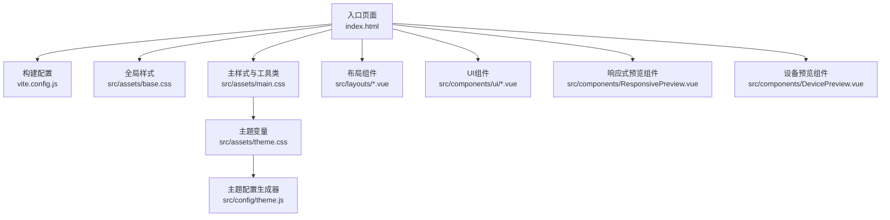
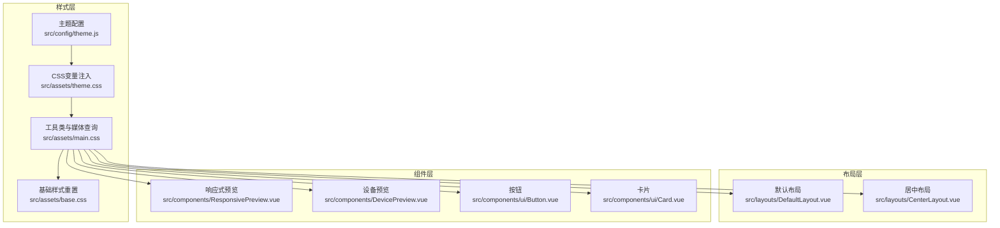
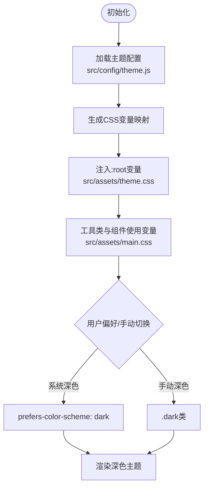
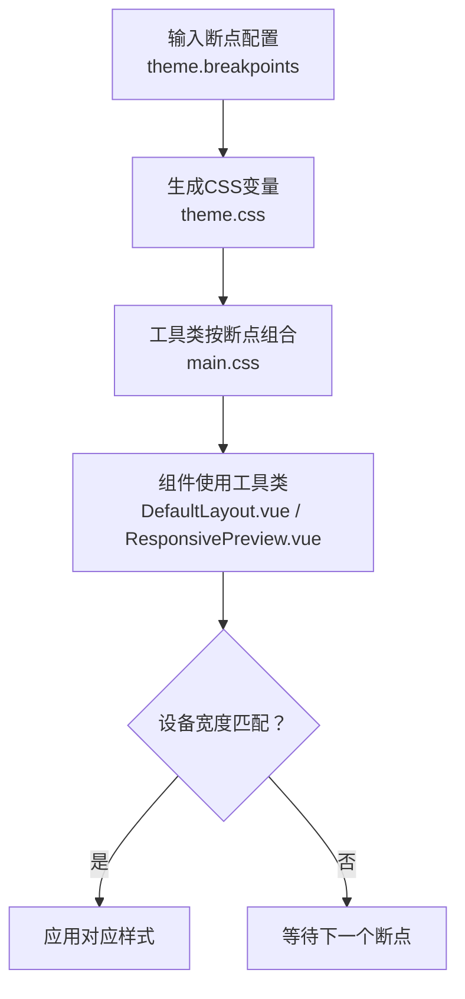
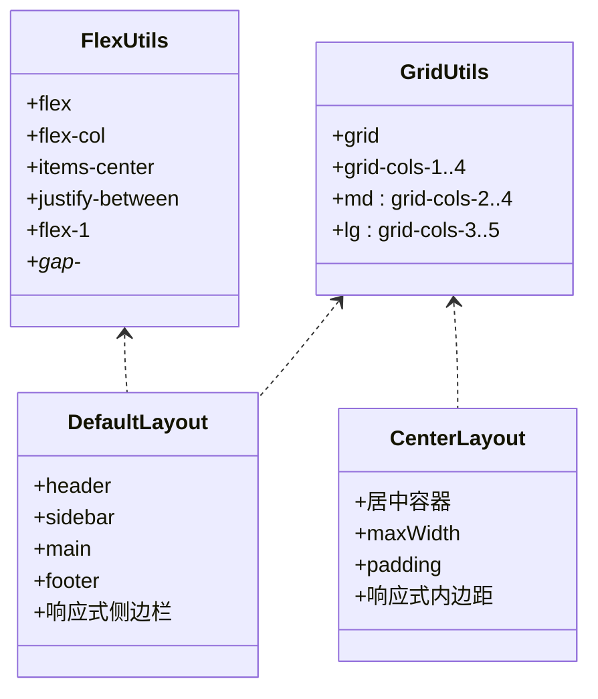
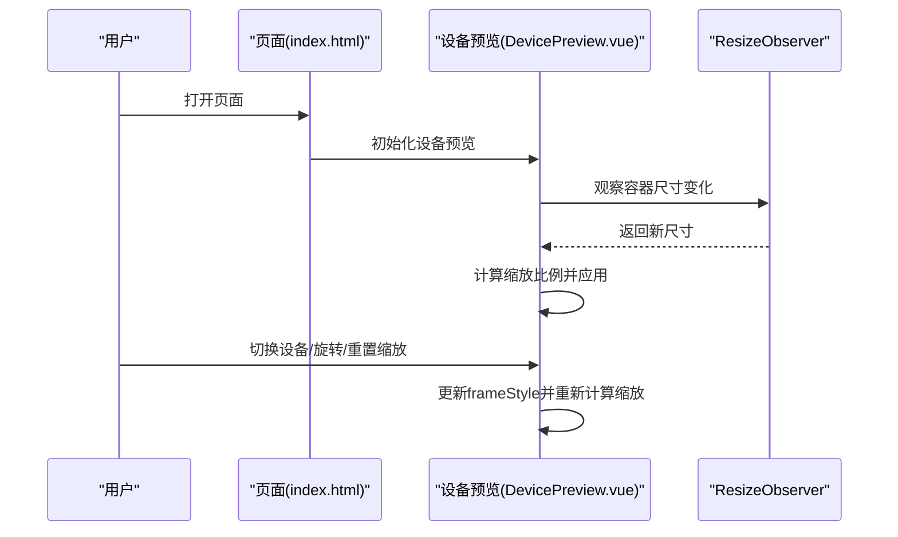
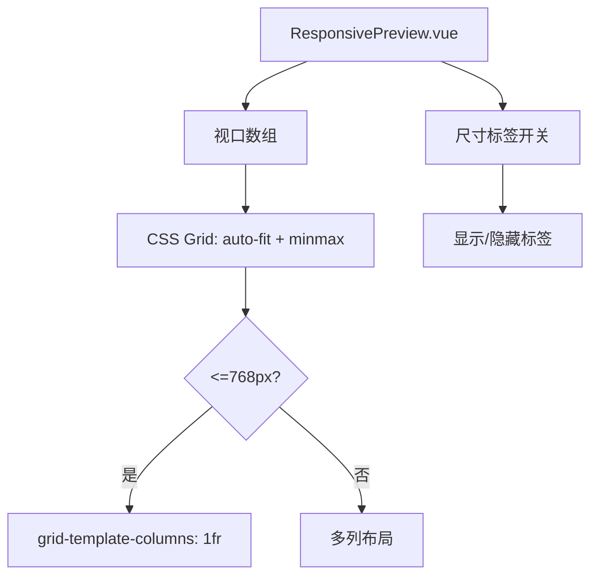
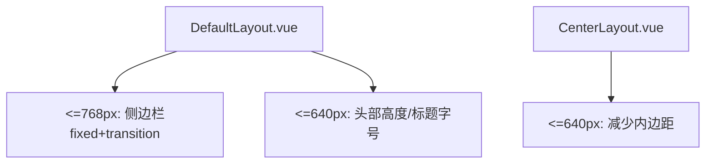
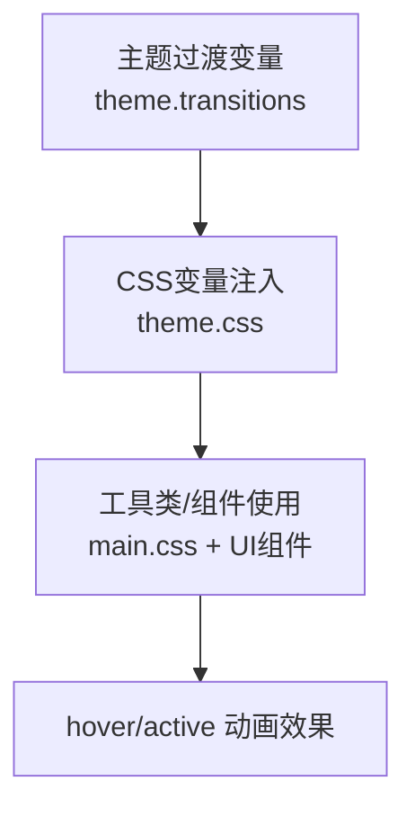
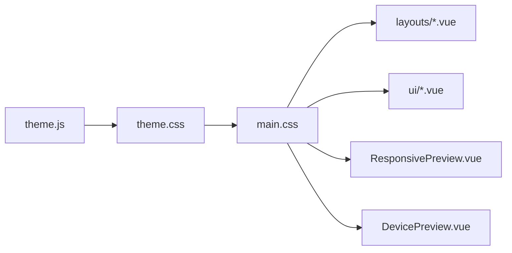

# 响应式设计实现

<cite>
**本文档引用的文件**
- [index.html](file://index.html)
- [vite.config.js](file://vite.config.js)
- [src/assets/base.css](file://src/assets/base.css)
- [src/assets/main.css](file://src/assets/main.css)
- [src/assets/theme.css](file://src/assets/theme.css)
- [src/config/theme.js](file://src/config/theme.js)
- [src/layouts/DefaultLayout.vue](file://src/layouts/DefaultLayout.vue)
- [src/layouts/CenterLayout.vue](file://src/layouts/CenterLayout.vue)
- [src/components/ResponsivePreview.vue](file://src/components/ResponsivePreview.vue)
- [src/components/DevicePreview.vue](file://src/components/DevicePreview.vue)
- [src/components/ui/Button.vue](file://src/components/ui/Button.vue)
- [src/components/ui/Card.vue](file://src/components/ui/Card.vue)
- [package.json](file://package.json)
</cite>

## 目录
1. [简介](#简介)
2. [项目结构](#项目结构)
3. [核心组件](#核心组件)
4. [架构总览](#架构总览)
5. [详细组件分析](#详细组件分析)
6. [依赖关系分析](#依赖关系分析)
7. [性能考虑](#性能考虑)
8. [故障排除指南](#故障排除指南)
9. [结论](#结论)

## 简介
本文件系统性梳理该项目的响应式设计实现，覆盖断点与媒体查询策略、Flexbox 与 Grid 布局应用、移动端适配方案（viewport、触摸交互）、主题系统（含深色模式）、动画与过渡的响应式处理，以及浏览器兼容性与性能优化建议。目标是帮助开发者快速理解并扩展现有响应式体系。

## 项目结构
项目采用前端单页应用架构，样式通过 CSS 变量与工具类组织，布局由 Vue 组件承载，并辅以响应式预览组件用于多设备调试与展示。

**图表来源**
- [index.html](file://index.html#L1-L61)
- [vite.config.js](file://vite.config.js#L1-L37)
- [src/assets/base.css](file://src/assets/base.css#L1-L154)
- [src/assets/main.css](file://src/assets/main.css#L1-L207)
- [src/assets/theme.css](file://src/assets/theme.css#L1-L207)
- [src/config/theme.js](file://src/config/theme.js#L1-L274)
- [src/layouts/DefaultLayout.vue](file://src/layouts/DefaultLayout.vue#L1-L185)
- [src/components/ResponsivePreview.vue](file://src/components/ResponsivePreview.vue#L1-L216)
- [src/components/DevicePreview.vue](file://src/components/DevicePreview.vue#L1-L228)
- [src/components/ui/Button.vue](file://src/components/ui/Button.vue#L1-L244)
- [src/components/ui/Card.vue](file://src/components/ui/Card.vue#L1-L204)

**章节来源**
- [index.html](file://index.html#L1-L61)
- [vite.config.js](file://vite.config.js#L1-L37)

## 核心组件
- 主题系统：统一的颜色、字体、间距、圆角、阴影、断点、容器宽度与过渡时间等设计变量，通过 CSS 变量注入与暗色模式媒体查询实现。
- 布局系统：基于 Flexbox 的容器与工具类，配合 Grid 实现响应式栅格布局。
- 响应式预览：内置多断点网格与可选尺寸标签，便于在桌面端快速对比不同设备下的布局表现。
- 设备预览：支持手机/平板/桌面/笔记本等设备模拟，动态计算缩放比例，适配容器尺寸变化。
- UI 组件：Button、Card 等组件遵循主题变量，具备一致的响应式行为与过渡动画。

**章节来源**
- [src/assets/theme.css](file://src/assets/theme.css#L1-L207)
- [src/config/theme.js](file://src/config/theme.js#L1-L274)
- [src/assets/main.css](file://src/assets/main.css#L1-L207)
- [src/components/ResponsivePreview.vue](file://src/components/ResponsivePreview.vue#L1-L216)
- [src/components/DevicePreview.vue](file://src/components/DevicePreview.vue#L1-L228)
- [src/components/ui/Button.vue](file://src/components/ui/Button.vue#L1-L244)
- [src/components/ui/Card.vue](file://src/components/ui/Card.vue#L1-L204)

## 架构总览
整体响应式架构围绕“主题变量驱动 + 媒体查询 + 布局工具类 + 组件化 UI”的思路展开，确保在不同设备上保持一致的视觉与交互体验。

**图表来源**
- [src/config/theme.js](file://src/config/theme.js#L1-L274)
- [src/assets/theme.css](file://src/assets/theme.css#L1-L207)
- [src/assets/main.css](file://src/assets/main.css#L1-L207)
- [src/assets/base.css](file://src/assets/base.css#L1-L154)
- [src/layouts/DefaultLayout.vue](file://src/layouts/DefaultLayout.vue#L1-L185)
- [src/layouts/CenterLayout.vue](file://src/layouts/CenterLayout.vue#L1-L63)
- [src/components/ResponsivePreview.vue](file://src/components/ResponsivePreview.vue#L1-L216)
- [src/components/DevicePreview.vue](file://src/components/DevicePreview.vue#L1-L228)
- [src/components/ui/Button.vue](file://src/components/ui/Button.vue#L1-L244)
- [src/components/ui/Card.vue](file://src/components/ui/Card.vue#L1-L204)

## 详细组件分析

### 主题系统与深色模式
- 设计变量集中于主题配置文件，导出颜色、字体、间距、圆角、阴影、断点、容器宽度、Z-index、过渡时间等。
- 通过 CSS 变量注入到 :root，组件与工具类直接消费这些变量，保证一致性。
- 暗色模式通过 prefers-color-scheme 媒体查询与 .dark 类两种方式实现，优先级与覆盖逻辑清晰。

**图表来源**
- [src/config/theme.js](file://src/config/theme.js#L1-L274)
- [src/assets/theme.css](file://src/assets/theme.css#L1-L207)
- [src/assets/main.css](file://src/assets/main.css#L1-L207)

**章节来源**
- [src/config/theme.js](file://src/config/theme.js#L1-L274)
- [src/assets/theme.css](file://src/assets/theme.css#L1-L207)

### 媒体查询与断点策略
- 断点与容器最大宽度在主题配置中统一定义，工具类按断点前缀组合使用，形成“移动优先”的响应式策略。
- 常见断点：xs、sm、md、lg、xl、2xl；对应容器最大宽度与栅格列数。
- 响应式显示控制：通过 max-width 与 min-width 控制元素在不同设备上的显隐。

**图表来源**
- [src/config/theme.js](file://src/config/theme.js#L199-L216)
- [src/assets/main.css](file://src/assets/main.css#L18-L47)
- [src/layouts/DefaultLayout.vue](file://src/layouts/DefaultLayout.vue#L154-L182)
- [src/components/ResponsivePreview.vue](file://src/components/ResponsivePreview.vue#L201-L210)

**章节来源**
- [src/config/theme.js](file://src/config/theme.js#L199-L216)
- [src/assets/main.css](file://src/assets/main.css#L18-L47)
- [src/layouts/DefaultLayout.vue](file://src/layouts/DefaultLayout.vue#L154-L182)
- [src/components/ResponsivePreview.vue](file://src/components/ResponsivePreview.vue#L201-L210)

### Flexbox 与 Grid 布局应用
- Flexbox：提供 flex、flex-col、items-*、justify-*、flex-1、flex-wrap、gap-* 等工具类，支撑导航栏、侧边栏、居中布局等场景。
- Grid：提供 grid 与 grid-cols-* 工具类，并在 md/lg 断点下扩展列数，实现灵活的栅格布局。
- 布局组件：DefaultLayout 与 CenterLayout 分别演示了侧边栏折叠、居中容器、响应式内边距等实践。

**图表来源**
- [src/assets/main.css](file://src/assets/main.css#L56-L132)
- [src/layouts/DefaultLayout.vue](file://src/layouts/DefaultLayout.vue#L1-L185)
- [src/layouts/CenterLayout.vue](file://src/layouts/CenterLayout.vue#L1-L63)

**章节来源**
- [src/assets/main.css](file://src/assets/main.css#L56-L132)
- [src/layouts/DefaultLayout.vue](file://src/layouts/DefaultLayout.vue#L1-L185)
- [src/layouts/CenterLayout.vue](file://src/layouts/CenterLayout.vue#L1-L63)

### 移动端适配方案
- viewport 配置：在入口页面设置 viewport，限制最大缩放与用户缩放，确保移动端初始渲染稳定。
- 响应式显示：通过 max-width 与 min-width 控制元素在移动端的显隐，避免布局拥挤。
- 设备预览：提供设备模拟、旋转、缩放功能，结合 ResizeObserver 动态计算缩放比例，适配容器尺寸变化。

**图表来源**
- [index.html](file://index.html#L6-L6)
- [src/components/DevicePreview.vue](file://src/components/DevicePreview.vue#L194-L213)
- [src/components/DevicePreview.vue](file://src/components/DevicePreview.vue#L173-L186)

**章节来源**
- [index.html](file://index.html#L6-L6)
- [src/components/DevicePreview.vue](file://src/components/DevicePreview.vue#L194-L213)
- [src/components/DevicePreview.vue](file://src/components/DevicePreview.vue#L173-L186)

### 响应式预览组件
- 多断点网格：使用 CSS Grid 的 auto-fit 与 minmax，自动适配容器宽度，移动端时变为单列布局。
- 可选尺寸标签：通过开关控制是否显示设备名称与像素尺寸，便于对比不同断点下的布局差异。
- 内容区域：通过插槽支持自定义内容或嵌入 iframe，便于预览真实页面在不同断点下的表现。

**图表来源**
- [src/components/ResponsivePreview.vue](file://src/components/ResponsivePreview.vue#L130-L136)
- [src/components/ResponsivePreview.vue](file://src/components/ResponsivePreview.vue#L201-L210)

**章节来源**
- [src/components/ResponsivePreview.vue](file://src/components/ResponsivePreview.vue#L1-L216)

### 布局组件响应式实践
- DefaultLayout：在 <=768px 时，侧边栏从左侧滑入/滑出，标题与中间区域布局调整；在 <=640px 时，头部高度与标题字号自适应。
- CenterLayout：在 <=640px 时，减少外层与内容区的内边距，提升移动端阅读体验。

**图表来源**
- [src/layouts/DefaultLayout.vue](file://src/layouts/DefaultLayout.vue#L154-L182)
- [src/layouts/CenterLayout.vue](file://src/layouts/CenterLayout.vue#L51-L59)

**章节来源**
- [src/layouts/DefaultLayout.vue](file://src/layouts/DefaultLayout.vue#L154-L182)
- [src/layouts/CenterLayout.vue](file://src/layouts/CenterLayout.vue#L51-L59)

### 动画与过渡的响应式处理
- 过渡时间：提供 fast/base/slow 三档过渡时间，组件与工具类统一使用变量，确保在不同设备上的一致性。
- Hover/Active 效果：按钮与卡片在 hover/active 状态下有位移与阴影变化，移动端建议谨慎使用可能影响可读性的复杂动画。
- 页面过渡：全局路由视图过渡类，保证页面切换时的流畅体验。

**图表来源**
- [src/config/theme.js](file://src/config/theme.js#L229-L234)
- [src/assets/theme.css](file://src/assets/theme.css#L156-L159)
- [src/assets/main.css](file://src/assets/main.css#L189-L192)
- [src/components/ui/Button.vue](file://src/components/ui/Button.vue#L134-L145)
- [src/components/ui/Card.vue](file://src/components/ui/Card.vue#L133-L146)

**章节来源**
- [src/config/theme.js](file://src/config/theme.js#L229-L234)
- [src/assets/theme.css](file://src/assets/theme.css#L156-L159)
- [src/assets/main.css](file://src/assets/main.css#L189-L192)
- [src/components/ui/Button.vue](file://src/components/ui/Button.vue#L134-L145)
- [src/components/ui/Card.vue](file://src/components/ui/Card.vue#L133-L146)

## 依赖关系分析
- 主题配置与 CSS 变量：主题配置文件生成 CSS 变量，被主题 CSS 与工具类共同消费。
- 布局与组件：布局组件依赖工具类，UI 组件同样依赖工具类与主题变量。
- 预览组件：响应式预览与设备预览组件不依赖后端，仅依赖前端样式与工具类。

**图表来源**
- [src/config/theme.js](file://src/config/theme.js#L241-L271)
- [src/assets/theme.css](file://src/assets/theme.css#L1-L207)
- [src/assets/main.css](file://src/assets/main.css#L1-L207)
- [src/layouts/DefaultLayout.vue](file://src/layouts/DefaultLayout.vue#L1-L185)
- [src/components/ResponsivePreview.vue](file://src/components/ResponsivePreview.vue#L1-L216)
- [src/components/DevicePreview.vue](file://src/components/DevicePreview.vue#L1-L228)
- [src/components/ui/Button.vue](file://src/components/ui/Button.vue#L1-L244)
- [src/components/ui/Card.vue](file://src/components/ui/Card.vue#L1-L204)

**章节来源**
- [src/config/theme.js](file://src/config/theme.js#L241-L271)
- [src/assets/theme.css](file://src/assets/theme.css#L1-L207)
- [src/assets/main.css](file://src/assets/main.css#L1-L207)

## 性能考虑
- CSS 变量与工具类：通过集中变量与原子化工具类，减少重复样式与选择器层级，有利于缓存与复用。
- 响应式预览与设备预览：使用 CSS Grid 与 transform 缩放，避免频繁重排；设备预览使用 ResizeObserver 监听容器变化，降低监听频率。
- 基础样式重置：统一盒模型与滚动条样式，减少跨浏览器差异带来的额外计算。
- 构建与运行：Vite 提供快速热更新与按需打包，适合开发阶段的响应式调试与迭代。

**章节来源**
- [src/assets/base.css](file://src/assets/base.css#L1-L154)
- [src/components/DevicePreview.vue](file://src/components/DevicePreview.vue#L194-L213)
- [vite.config.js](file://vite.config.js#L1-L37)

## 故障排除指南
- 深色模式未生效
  - 检查系统深色模式或手动添加 .dark 类是否正确。
  - 确认主题 CSS 中的暗色变量覆盖顺序。
- 布局错乱或断点无效
  - 确认工具类是否正确拼接断点前缀（如 md:、lg:）。
  - 检查容器类（container/container-fluid）与断点配置是否匹配。
- 设备预览缩放异常
  - 确保容器存在且可观察；检查 ResizeObserver 是否正常工作。
  - 避免在极端小尺寸容器中强制过大缩放导致内容溢出。
- 移动端交互卡顿
  - 减少复杂动画或在移动端禁用部分 hover 效果。
  - 使用 transform 代替改变布局相关属性（如 width/height）。

**章节来源**
- [src/assets/theme.css](file://src/assets/theme.css#L171-L205)
- [src/assets/main.css](file://src/assets/main.css#L18-L47)
- [src/components/DevicePreview.vue](file://src/components/DevicePreview.vue#L194-L213)

## 结论
该项目以主题配置为核心，结合 CSS 变量、媒体查询与原子化工具类，构建了完整的响应式体系。布局组件与 UI 组件遵循统一的设计语言，预览组件提供了便捷的多设备调试能力。通过合理的断点策略、Flexbox/Grid 布局与过渡动画，能够在桌面与移动端提供一致且高效的用户体验。后续可在动画性能与交互细节上持续优化，进一步提升移动端的可用性与流畅度。