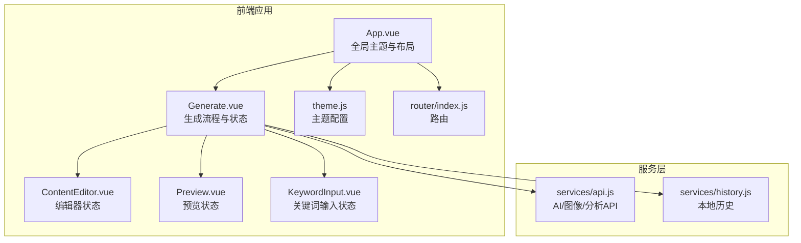
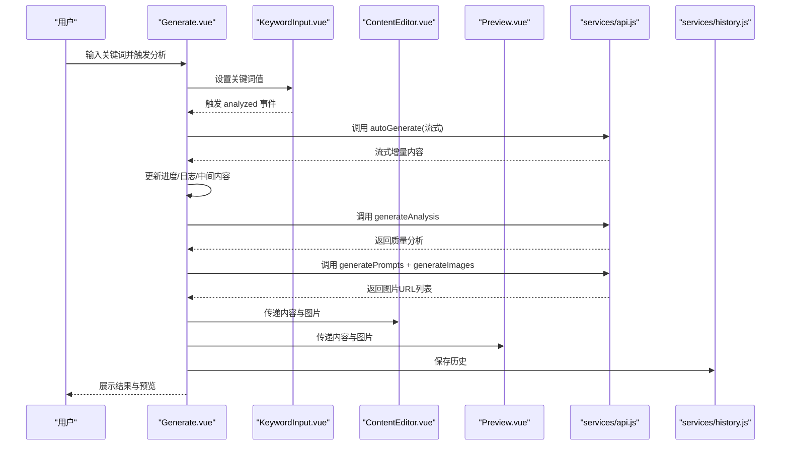
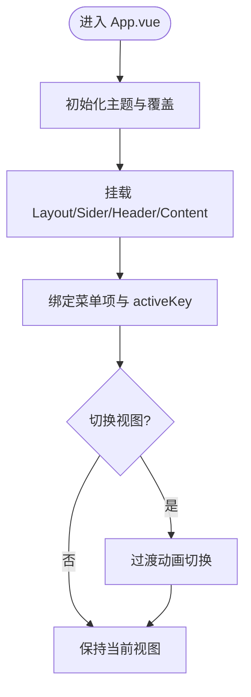
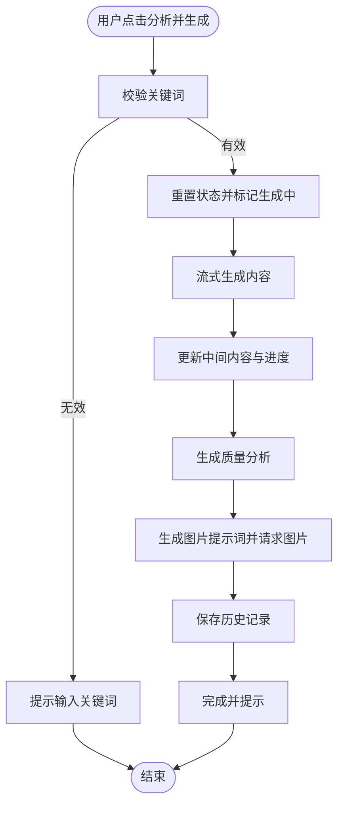
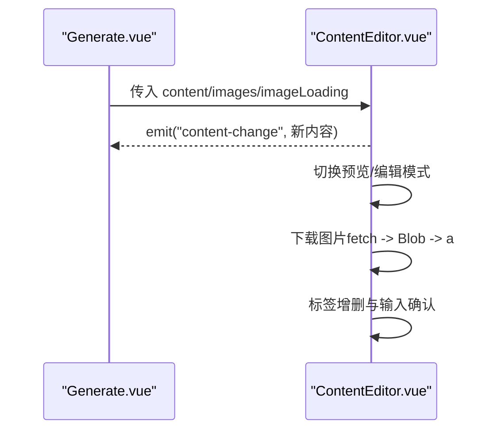
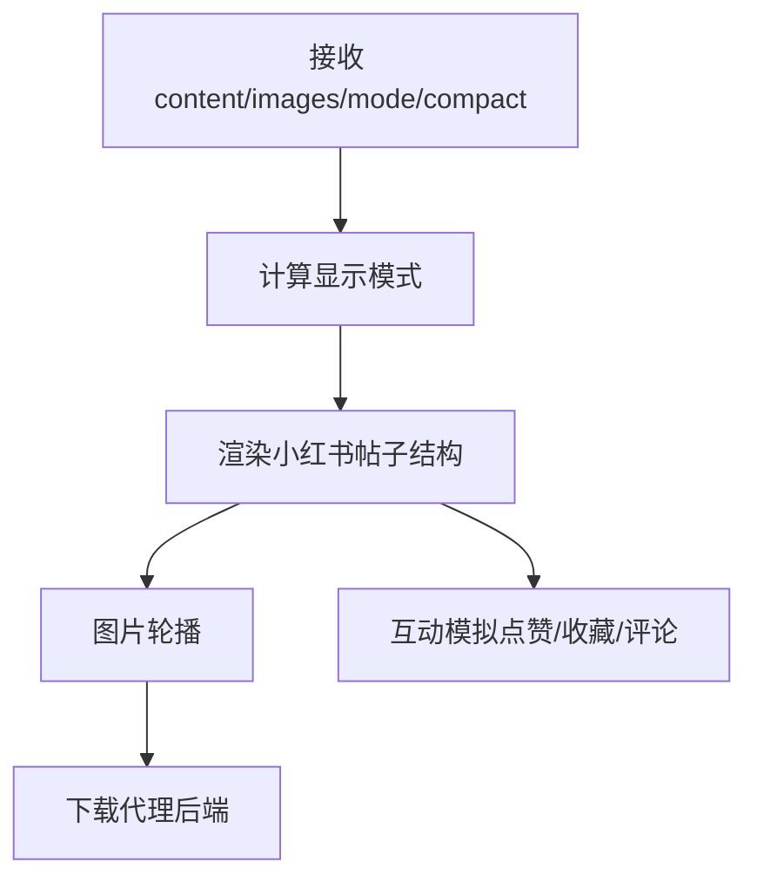
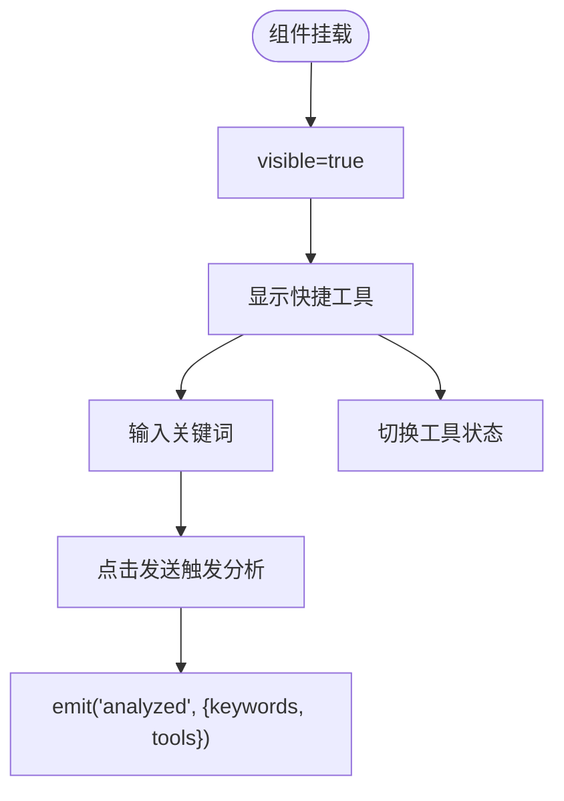
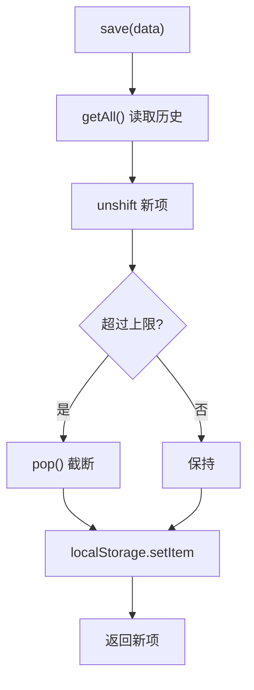
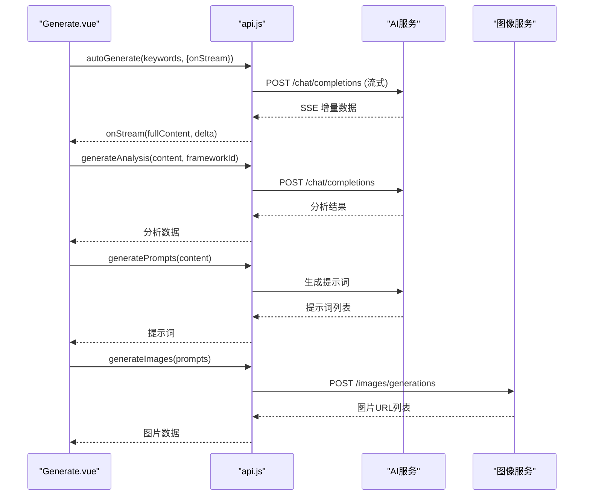
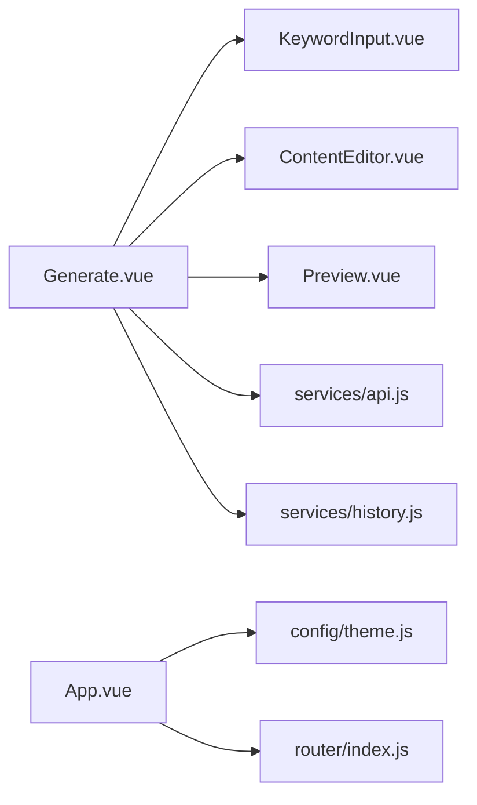

# 状态管理

<cite>
**本文引用的文件**
- [src/App.vue](file://src/App.vue)
- [src/views/Generate.vue](file://src/views/Generate.vue)
- [src/components/ContentEditor.vue](file://src/components/ContentEditor.vue)
- [src/components/Preview.vue](file://src/components/Preview.vue)
- [src/components/KeywordInput.vue](file://src/components/KeywordInput.vue)
- [src/services/api.js](file://src/services/api.js)
- [src/services/history.js](file://src/services/history.js)
- [src/config/theme.js](file://src/config/theme.js)
- [src/router/index.js](file://src/router/index.js)
- [frontend/src/App.vue](file://frontend/src/App.vue)
- [frontend/src/main.js](file://frontend/src/main.js)
- [src/main.js](file://src/main.js)
</cite>

## 目录
1. [简介](#简介)
2. [项目结构](#项目结构)
3. [核心组件](#核心组件)
4. [架构总览](#架构总览)
5. [详细组件分析](#详细组件分析)
6. [依赖关系分析](#依赖关系分析)
7. [性能考量](#性能考量)
8. [故障排查指南](#故障排查指南)
9. [结论](#结论)
10. [附录](#附录)

## 简介
本文件系统性梳理小红书文案生成工具项目中的状态管理策略与实现方式，覆盖全局状态与主题配置、组件内部状态、表单与临时状态、本地持久化（localStorage）、状态更新最佳实践、调试与性能优化，以及跨组件状态共享与同步方案。文档面向不同技术背景的读者，力求以循序渐进的方式呈现。

## 项目结构
项目采用前后端同构的多入口布局，前端以 Vue 3 Composition API 为主，结合 Naive UI 与 Element Plus 两类 UI 框架；后端提供统一的 API 服务与持久化能力。状态管理主要围绕以下方面展开：
- 全局状态：应用主题、布局状态、路由与视图切换
- 组件内部状态：生成流程、编辑器、预览、关键词输入等
- 本地持久化：生成历史、知识库、主题与偏好
- 跨组件通信：事件发射与 props 传递
- 数据流：API 调用、流式响应、图像生成与分析

图表来源
- [src/App.vue](file://src/App.vue#L110-L254)
- [src/views/Generate.vue](file://src/views/Generate.vue#L177-L427)
- [src/components/ContentEditor.vue](file://src/components/ContentEditor.vue#L197-L316)
- [src/components/Preview.vue](file://src/components/Preview.vue#L134-L208)
- [src/components/KeywordInput.vue](file://src/components/KeywordInput.vue#L78-L151)
- [src/services/api.js](file://src/services/api.js#L1-L454)
- [src/services/history.js](file://src/services/history.js#L1-L89)
- [src/config/theme.js](file://src/config/theme.js#L1-L274)
- [src/router/index.js](file://src/router/index.js#L1-L26)

章节来源
- [src/App.vue](file://src/App.vue#L110-L254)
- [src/views/Generate.vue](file://src/views/Generate.vue#L177-L427)
- [src/components/ContentEditor.vue](file://src/components/ContentEditor.vue#L197-L316)
- [src/components/Preview.vue](file://src/components/Preview.vue#L134-L208)
- [src/components/KeywordInput.vue](file://src/components/KeywordInput.vue#L78-L151)
- [src/services/api.js](file://src/services/api.js#L1-L454)
- [src/services/history.js](file://src/services/history.js#L1-L89)
- [src/config/theme.js](file://src/config/theme.js#L1-L274)
- [src/router/index.js](file://src/router/index.js#L1-L26)

## 核心组件
- 全局应用状态与主题
  - 应用容器与布局：主导航、侧边栏、头部、内容区、过渡动画
  - 主题系统：Naive UI 主题覆盖与自定义变量
- 生成流程状态
  - 生成中、进度、日志、内容、图片、质量分析、历史记录
- 编辑器状态
  - 预览/编辑双模式、Markdown 渲染、图片下载、标签管理
- 预览状态
  - 移动/桌面模式切换、图片轮播、下载代理
- 关键词输入状态
  - 快捷工具选择、关键词输入、分析触发
- 本地持久化
  - 生成历史、知识库条目

章节来源
- [src/App.vue](file://src/App.vue#L110-L254)
- [src/views/Generate.vue](file://src/views/Generate.vue#L177-L427)
- [src/components/ContentEditor.vue](file://src/components/ContentEditor.vue#L197-L316)
- [src/components/Preview.vue](file://src/components/Preview.vue#L134-L208)
- [src/components/KeywordInput.vue](file://src/components/KeywordInput.vue#L78-L151)
- [src/services/history.js](file://src/services/history.js#L1-L89)

## 架构总览
本项目采用“组件内状态 + 本地存储 + API 服务”的轻量状态管理模式：
- 组件内状态：使用 ref/computed/localState 管理 UI 与业务状态
- 本地持久化：localStorage 存储生成历史与知识库
- API 服务：封装 AI、图像、分析接口，支持流式响应
- 跨组件通信：props 传递与 emit 事件
- 全局主题：通过 Naive UI Provider 与主题配置文件统一管理

图表来源
- [src/views/Generate.vue](file://src/views/Generate.vue#L257-L324)
- [src/components/KeywordInput.vue](file://src/components/KeywordInput.vue#L132-L142)
- [src/components/ContentEditor.vue](file://src/components/ContentEditor.vue#L273-L281)
- [src/components/Preview.vue](file://src/components/Preview.vue#L168-L185)
- [src/services/api.js](file://src/services/api.js#L250-L364)
- [src/services/history.js](file://src/services/history.js#L14-L41)

## 详细组件分析

### 全局应用状态与主题
- 布局与导航
  - 使用 Naive UI 的 Layout/Sider/Header/Content 组件构建工作台布局
  - 侧边栏菜单项与 activeKey 控制视图切换
  - landing 与 workbench 的切换通过 showLanding 控制
- 主题配置
  - Naive UI 主题覆盖：通过 theme 与 themeOverrides 注入全局样式变量
  - 主题变量来源于 theme.js，提供颜色、字体、间距、阴影、断点等
- 路由
  - 使用 vue-router 创建路由，当前指向 Generate 页面

图表来源
- [src/App.vue](file://src/App.vue#L110-L254)
- [src/config/theme.js](file://src/config/theme.js#L1-L274)
- [src/router/index.js](file://src/router/index.js#L1-L26)

章节来源
- [src/App.vue](file://src/App.vue#L110-L254)
- [src/config/theme.js](file://src/config/theme.js#L1-L274)
- [src/router/index.js](file://src/router/index.js#L1-L26)

### 生成流程状态（Generate.vue）
- 状态清单
  - 生成中 generating、进度 generationProgress、日志 processingLogs
  - 内容 generatedContent/editedContent、图片 generatedImages/imageGenerating
  - 质量分析 qualityAnalysis、关键词 currentKeywords/specialRequirements
  - 预览 previewDevice、历史 showHistory、历史列表 historyList
- 关键流程
  - handleQuickGenerate：触发生成、流式更新、质量分析、图片生成、保存历史
  - generateImages：并发请求多张图片，聚合结果
  - generateQualityAnalysis：基于内容生成分析
  - 历史操作：保存、加载、删除、清空
- 性能注意
  - 流式更新时避免频繁重渲染，合理设置进度上限
  - 图片生成使用 Promise.all 并发，注意错误兜底

图表来源
- [src/views/Generate.vue](file://src/views/Generate.vue#L257-L324)
- [src/views/Generate.vue](file://src/views/Generate.vue#L329-L354)
- [src/views/Generate.vue](file://src/views/Generate.vue#L356-L370)
- [src/views/Generate.vue](file://src/views/Generate.vue#L390-L422)

章节来源
- [src/views/Generate.vue](file://src/views/Generate.vue#L177-L427)

### 编辑器状态（ContentEditor.vue）
- 状态与行为
  - 预览/编辑双模式：tabs 切换
  - Markdown 渲染：computed + MarkdownIt
  - 图片下载：fetch + Blob + a 标签
  - 标签管理：增删、输入确认
  - 事件发射：regenerate/preview/content-change
- 依赖
  - props.content/images/imageLoading
  - emit('content-change', deep watcher)

图表来源
- [src/components/ContentEditor.vue](file://src/components/ContentEditor.vue#L197-L316)

章节来源
- [src/components/ContentEditor.vue](file://src/components/ContentEditor.vue#L197-L316)

### 预览状态（Preview.vue）
- 状态与行为
  - 模式切换：mobile/desktop
  - 图片轮播：n-carousel
  - 下载代理：后端代理下载，解决跨域
  - 互动模拟：点赞计数随机变化
- 依赖
  - props.content/images/mode/compact

图表来源
- [src/components/Preview.vue](file://src/components/Preview.vue#L134-L208)

章节来源
- [src/components/Preview.vue](file://src/components/Preview.vue#L134-L208)

### 关键词输入状态（KeywordInput.vue）
- 状态与行为
  - 可见性控制：visible/showQuickKeywords
  - 快捷工具：hotKeywords + activeTools
  - 输入校验与分析触发：emit('analyzed')
  - 外部赋值：setValues
- 依赖
  - props.analyzing
  - emit('analyzed')

图表来源
- [src/components/KeywordInput.vue](file://src/components/KeywordInput.vue#L78-L151)

章节来源
- [src/components/KeywordInput.vue](file://src/components/KeywordInput.vue#L78-L151)

### 本地持久化（localStorage）
- 生成历史
  - 保存：追加到数组头部，限制长度
  - 读取：JSON.parse
  - 删除/清空：过滤或移除
- 知识库
  - 保存/读取/新增/删除：基于 localStorage 的 CRUD

图表来源
- [src/services/history.js](file://src/services/history.js#L14-L41)

章节来源
- [src/services/history.js](file://src/services/history.js#L1-L89)
- [src/services/api.js](file://src/services/api.js#L42-L85)

### API 服务与数据流
- AI 生成（支持流式）
  - getAIResponse：根据 onStream 是否存在决定 fetch/axios
  - 流式：逐块解析 data: 行，增量更新
- 图像生成
  - generatePrompts：将文案转为提示词
  - generate：调用图像服务，返回 URL 列表
- 分析服务
  - generateAnalysis：对内容进行质量分析
- 知识库
  - localStorage 读写

图表来源
- [src/services/api.js](file://src/services/api.js#L94-L177)
- [src/services/api.js](file://src/services/api.js#L250-L364)
- [src/services/api.js](file://src/services/api.js#L369-L449)

章节来源
- [src/services/api.js](file://src/services/api.js#L1-L454)

### 主题与样式体系（theme.js）
- 设计变量
  - 颜色：主色、辅色、成功/警告/错误/中性
  - 字体：族、字号、字重、行高
  - 间距、圆角、阴影、断点、容器、Z-index、过渡
- 导出
  - theme 对象与 generateCSSVariables（将主题映射为 CSS 变量）

章节来源
- [src/config/theme.js](file://src/config/theme.js#L1-L274)

## 依赖关系分析
- 组件耦合
  - Generate.vue 是核心协调者，依赖 KeywordInput、ContentEditor、Preview、historyService、api.js
  - ContentEditor 与 Preview 通过 props 接收数据，彼此独立
- 外部依赖
  - Naive UI：布局、表单、消息、抽屉、模态框等
  - Axios/fetch：API 调用与图片下载
  - localStorage：历史与知识库持久化
- 路由与入口
  - src/main.js 与 frontend/src/main.js 分别挂载不同入口
  - src/router/index.js 提供路由配置

图表来源
- [src/views/Generate.vue](file://src/views/Generate.vue#L177-L427)
- [src/components/KeywordInput.vue](file://src/components/KeywordInput.vue#L78-L151)
- [src/components/ContentEditor.vue](file://src/components/ContentEditor.vue#L197-L316)
- [src/components/Preview.vue](file://src/components/Preview.vue#L134-L208)
- [src/services/api.js](file://src/services/api.js#L1-L454)
- [src/services/history.js](file://src/services/history.js#L1-L89)
- [src/App.vue](file://src/App.vue#L110-L254)
- [src/config/theme.js](file://src/config/theme.js#L1-L274)
- [src/router/index.js](file://src/router/index.js#L1-L26)

章节来源
- [src/main.js](file://src/main.js#L1-L16)
- [frontend/src/main.js](file://frontend/src/main.js#L1-L15)
- [frontend/src/App.vue](file://frontend/src/App.vue#L1-L50)

## 性能考量
- 流式渲染
  - 仅在首次收到增量时才更新中间内容，避免重复渲染
  - 进度计算基于内容长度，注意上限与抖动
- 并发请求
  - 图片生成使用 Promise.all，需做好错误兜底与重试策略
- 渲染优化
  - ContentEditor 的 Markdown 渲染使用 computed 缓存
  - 预览组件按需渲染图片轮播与下载按钮
- 存储优化
  - 历史记录限制长度，避免 localStorage 过大
  - 知识库条目按需读取，避免全量解析

[本节为通用指导，无需列出章节来源]

## 故障排查指南
- 生成失败
  - 检查 AI API 响应与流式解析，关注 onStream 回调与错误分支
  - 查看日志队列与进度百分比，定位卡顿阶段
- 图片生成异常
  - 核对图像服务返回格式与 URL 字段
  - 使用后端代理下载图片，规避跨域问题
- 历史读写失败
  - 捕获 JSON 解析异常，必要时降级为空数组
  - 清空历史后重建，确保键名一致
- 主题不生效
  - 确认 Naive UI ConfigProvider 的 theme 与 themeOverrides 注入路径
  - 检查 CSS 变量生成与命名空间

章节来源
- [src/services/api.js](file://src/services/api.js#L120-L177)
- [src/components/Preview.vue](file://src/components/Preview.vue#L146-L166)
- [src/services/history.js](file://src/services/history.js#L47-L54)
- [src/App.vue](file://src/App.vue#L159-L207)

## 结论
本项目采用“组件内状态 + 本地存储 + API 服务”的轻量状态管理模式，配合 Naive UI 主题系统与路由，实现了从关键词输入到内容生成、编辑、预览与发布的完整闭环。通过合理的流式处理、并发请求与本地持久化，兼顾了用户体验与性能表现。建议后续可引入集中式状态库（如 Pinia）以进一步简化跨层级状态共享与调试。

[本节为总结性内容，无需列出章节来源]

## 附录
- 最佳实践清单
  - 使用 ref/computed 管理组件内部状态，避免深层嵌套
  - 对外暴露 emit 事件，减少跨层级依赖
  - 对流式数据进行节流/去抖，避免频繁更新
  - 对 API 调用进行超时与重试策略
  - 对 localStorage 操作进行 try/catch 与降级
  - 使用主题变量统一管理样式，便于扩展与维护
- 调试技巧
  - 在流式回调中打印增量内容与时间戳
  - 使用浏览器开发者工具观察网络请求与响应
  - 通过 localStorage DevTools 检查历史与知识库数据

[本节为通用指导，无需列出章节来源]