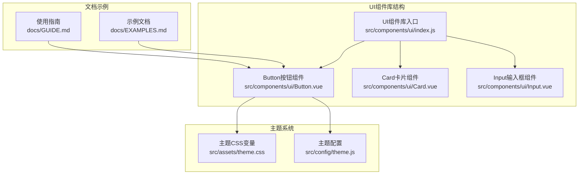
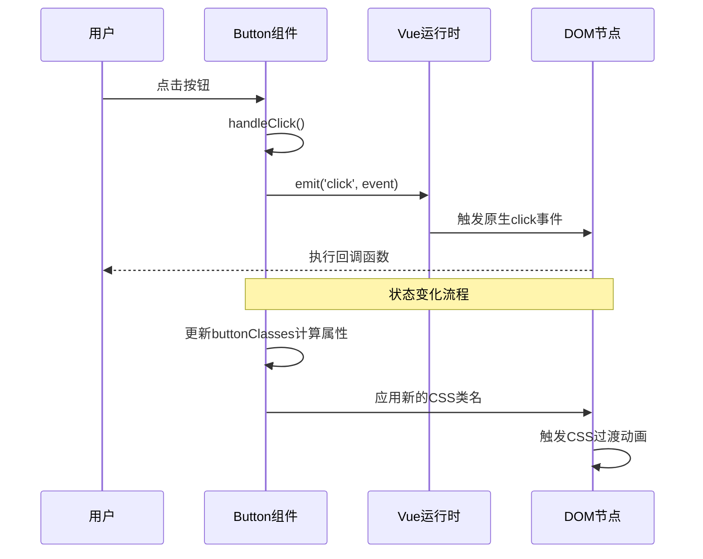
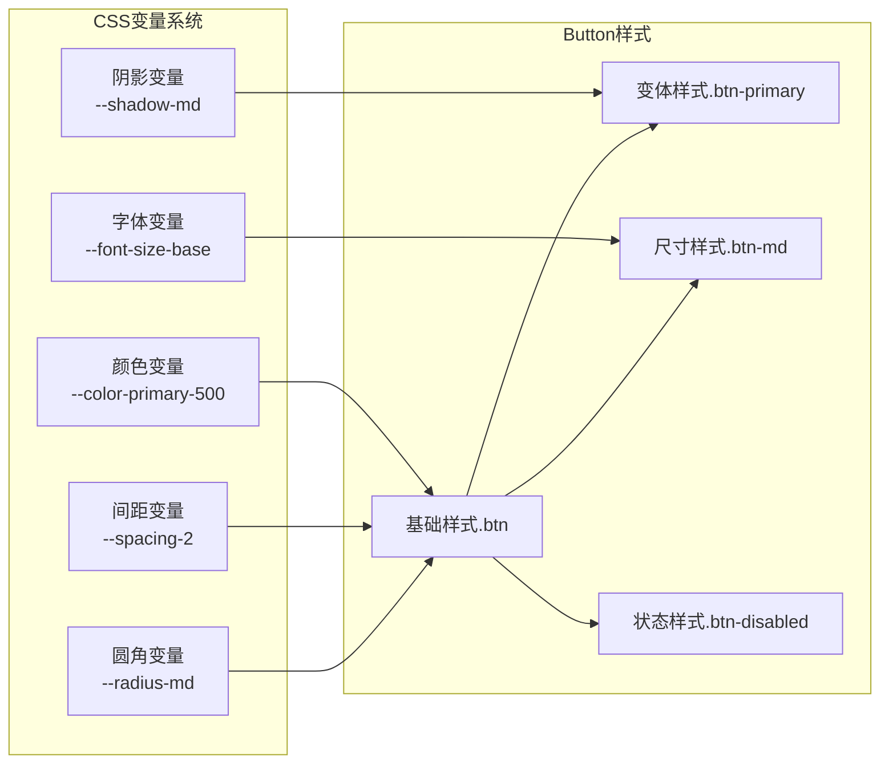
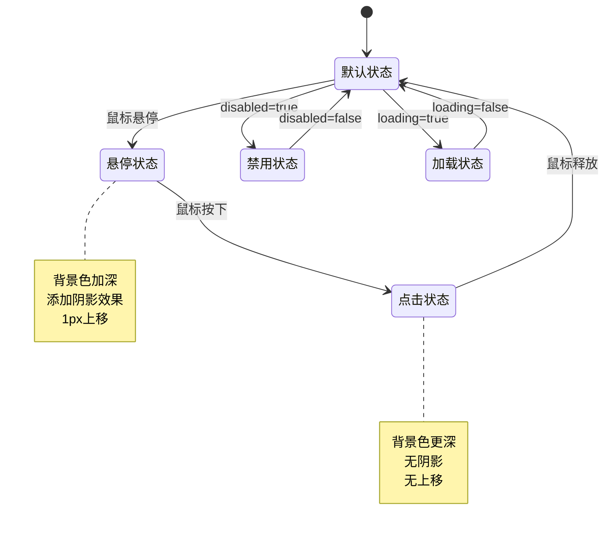
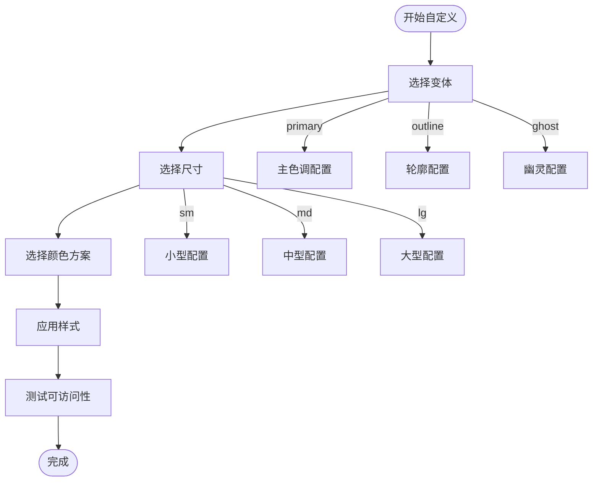
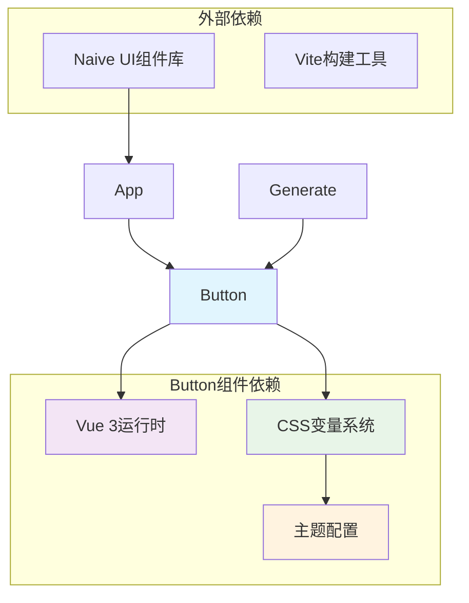

# Button按钮组件

<cite>
**本文档引用的文件**
- [Button.vue](file://src/components/ui/Button.vue)
- [index.js](file://src/components/ui/index.js)
- [theme.css](file://src/assets/theme.css)
- [theme.js](file://src/config/theme.js)
- [GUIDE.md](file://docs/GUIDE.md)
- [EXAMPLES.md](file://docs/EXAMPLES.md)
- [App.vue](file://src/App.vue)
- [Generate.vue](file://src/views/Generate.vue)
</cite>

## 目录
1. [简介](#简介)
2. [项目结构](#项目结构)
3. [核心组件](#核心组件)
4. [架构概览](#架构概览)
5. [详细组件分析](#详细组件分析)
6. [依赖关系分析](#依赖关系分析)
7. [性能考虑](#性能考虑)
8. [故障排除指南](#故障排除指南)
9. [结论](#结论)
10. [附录](#附录)

## 简介

Button按钮组件是本项目UI组件库的核心组成部分，采用Vue 3 Composition API和TypeScript语法编写。该组件提供了完整的按钮功能，包括多种样式变体、尺寸规格、状态管理和视觉反馈机制。组件设计遵循现代化的用户体验原则，支持无障碍访问和键盘导航。

## 项目结构

Button组件位于前端项目的UI组件库中，采用模块化设计，便于在不同场景中复用和扩展。



**图表来源**
- [index.js](file://src/components/ui/index.js#L1-L23)
- [Button.vue](file://src/components/ui/Button.vue#L1-L244)
- [theme.css](file://src/assets/theme.css#L1-L207)
- [theme.js](file://src/config/theme.js#L1-L274)

**章节来源**
- [index.js](file://src/components/ui/index.js#L1-L23)
- [Button.vue](file://src/components/ui/Button.vue#L1-L244)

## 核心组件

### Button组件概述

Button组件是一个高度可定制的按钮控件，支持以下核心特性：

- **多种样式变体**：primary、secondary、outline、ghost、danger
- **尺寸规格**：sm、md、lg三种尺寸
- **状态管理**：默认、悬停、点击、禁用、加载中状态
- **视觉反馈**：平滑的过渡动画和阴影效果
- **无障碍支持**：键盘导航和焦点管理

### 组件属性配置

| 属性名 | 类型 | 默认值 | 描述 |
|--------|------|--------|------|
| variant | String | 'primary' | 按钮样式变体 |
| size | String | 'md' | 按钮尺寸规格 |
| type | String | 'button' | HTML button类型 |
| disabled | Boolean | false | 是否禁用按钮 |
| loading | Boolean | false | 是否显示加载状态 |
| block | Boolean | false | 是否块级显示 |

### 组件事件处理

- **click**：按钮点击事件，包含原生事件对象参数

**章节来源**
- [Button.vue](file://src/components/ui/Button.vue#L25-L80)

## 架构概览

Button组件采用组合式API设计，结合CSS变量系统实现主题化样式。



**图表来源**
- [Button.vue](file://src/components/ui/Button.vue#L75-L79)

### 样式架构

Button组件使用CSS变量系统实现主题化设计：



**图表来源**
- [theme.css](file://src/assets/theme.css#L7-L169)
- [Button.vue](file://src/components/ui/Button.vue#L82-L237)

**章节来源**
- [theme.css](file://src/assets/theme.css#L1-L207)
- [Button.vue](file://src/components/ui/Button.vue#L82-L237)

## 详细组件分析

### 设计理念

Button组件的设计遵循以下核心理念：

1. **一致性**：统一的视觉语言和交互模式
2. **可访问性**：完整的键盘导航和屏幕阅读器支持
3. **可定制性**：灵活的主题系统和样式变体
4. **性能优化**：最小化的DOM结构和高效的CSS动画

### 状态管理系统



**图表来源**
- [Button.vue](file://src/components/ui/Button.vue#L134-L145)
- [Button.vue](file://src/components/ui/Button.vue#L141-L145)

### 视觉反馈设计

#### 主要按钮变体
- **默认状态**：使用主色调背景，白色文字
- **悬停状态**：背景色加深，添加阴影，轻微上移
- **点击状态**：背景色进一步加深，无阴影
- **禁用状态**：透明度降低至50%，鼠标指针变为禁止符号
- **加载状态**：显示旋转动画，鼠标指针变为等待状态

#### 尺寸规格
- **小型按钮**：内边距较小，字体12px，圆角适中
- **中型按钮**：标准内边距，字体16px，圆角适中
- **大型按钮**：内边距较大，字体18px，圆角较大

#### 颜色主题
- **主要变体**：使用主色调系列（0ea5e9）
- **次要变体**：使用灰色系列（#4b5563）
- **轮廓变体**：透明背景，主色调边框
- **幽灵变体**：透明背景和边框
- **危险变体**：使用错误色系列（#ef4444）

**章节来源**
- [Button.vue](file://src/components/ui/Button.vue#L127-L197)
- [Button.vue](file://src/components/ui/Button.vue#L108-L125)

### 样式定制化配置

#### 主题变量映射

| CSS变量 | 实际用途 | 示例值 |
|---------|----------|--------|
| --color-primary-500 | 主按钮背景色 | #0ea5e9 |
| --color-error-500 | 危险按钮背景色 | #ef4444 |
| --color-gray-600 | 次要按钮背景色 | #4b5563 |
| --spacing-2 | 中型按钮内边距 | 0.5rem |
| --radius-md | 标准圆角半径 | 0.375rem |
| --shadow-md | 中等阴影效果 | 0 4px 6px -1px rgba(...) |

#### 自定义样式方案



**图表来源**
- [theme.css](file://src/assets/theme.css#L7-L169)
- [theme.js](file://src/config/theme.js#L6-L235)

**章节来源**
- [theme.css](file://src/assets/theme.css#L1-L207)
- [theme.js](file://src/config/theme.js#L1-L274)

### 使用示例

#### 基础按钮使用

```vue
<!-- 文本按钮 -->
<Button>点击我</Button>

<!-- 主要按钮 -->
<Button variant="primary">确认</Button>

<!-- 危险按钮 -->
<Button variant="danger">删除</Button>

<!-- 小型按钮 -->
<Button size="sm">取消</Button>

<!-- 块级按钮 -->
<Button block>完整宽度</Button>
```

#### 高级使用场景

```vue
<!-- 表单提交按钮 -->
<Button type="submit" :loading="isLoading">
  提交
</Button>

<!-- 图标按钮 -->
<Button>
  <template #default>
    <span>📤</span>
    导出数据
  </template>
</Button>

<!-- 链接按钮样式 -->
<Button variant="ghost" size="sm">
  查看详情
</Button>
```

**章节来源**
- [GUIDE.md](file://docs/GUIDE.md#L85-L136)
- [EXAMPLES.md](file://docs/EXAMPLES.md#L131-L273)

### 最佳实践

#### 1. 语义化使用
- 使用适当的按钮变体表达操作意图
- 主要操作使用primary变体
- 危险操作使用danger变体
- 取消操作使用secondary或ghost变体

#### 2. 可访问性设计
- 确保按钮具有清晰的标签文本
- 支持键盘导航（Tab键聚焦）
- 提供视觉焦点指示器
- 为图标按钮提供替代文本

#### 3. 性能优化
- 避免频繁的状态切换
- 合理使用loading状态
- 优化CSS动画性能
- 减少不必要的重新渲染

## 依赖关系分析

### 组件间依赖



**图表来源**
- [Button.vue](file://src/components/ui/Button.vue#L22-L23)
- [App.vue](file://src/App.vue#L110-L130)
- [Generate.vue](file://src/views/Generate.vue#L146-L195)

### 主题系统集成

Button组件与主题系统的集成通过以下方式实现：

1. **CSS变量继承**：直接使用CSS自定义属性
2. **JavaScript配置**：通过theme.js提供主题配置
3. **动态样式**：运行时根据主题变量生成样式

**章节来源**
- [Button.vue](file://src/components/ui/Button.vue#L82-L237)
- [theme.css](file://src/assets/theme.css#L1-L207)
- [theme.js](file://src/config/theme.js#L241-L271)

## 性能考虑

### 渲染优化

- **计算属性缓存**：buttonClasses使用computed确保缓存
- **条件渲染**：loading状态使用v-if避免不必要的DOM节点
- **事件防抖**：复杂交互场景下考虑使用防抖处理

### 样式性能

- **CSS变量优化**：减少重复的样式声明
- **过渡动画**：使用transform和opacity优化GPU加速
- **阴影效果**：合理使用box-shadow避免过度渲染

### 内存管理

- **事件监听器**：组件销毁时自动清理事件监听
- **响应式数据**：避免创建不必要的响应式属性

## 故障排除指南

### 常见问题及解决方案

#### 1. 按钮状态不正确
**问题**：按钮状态与预期不符
**解决方案**：
- 检查disabled和loading属性的值
- 确认CSS类名是否正确应用
- 验证事件处理函数是否正常执行

#### 2. 样式显示异常
**问题**：按钮样式不符合预期
**解决方案**：
- 检查CSS变量是否正确加载
- 确认主题配置是否生效
- 验证CSS优先级冲突

#### 3. 可访问性问题
**问题**：键盘导航或屏幕阅读器支持异常
**解决方案**：
- 确保按钮具有正确的role属性
- 检查tabindex设置
- 验证aria-label属性

**章节来源**
- [Button.vue](file://src/components/ui/Button.vue#L75-L79)
- [Button.vue](file://src/components/ui/Button.vue#L103-L106)

## 结论

Button按钮组件作为UI组件库的核心组件，展现了现代前端开发的最佳实践。通过合理的架构设计、完善的主题系统集成和全面的可访问性支持，该组件为开发者提供了强大而灵活的按钮解决方案。

组件的主要优势包括：
- **高度可定制性**：丰富的样式变体和主题配置
- **优秀的用户体验**：流畅的视觉反馈和交互效果
- **完整的可访问性**：支持键盘导航和屏幕阅读器
- **良好的性能表现**：优化的渲染和样式系统

未来可以考虑的功能扩展包括：
- 更多的动画效果选项
- 自定义图标支持
- 更丰富的状态管理
- 增强的可访问性功能

## 附录

### API参考

#### Props
- `variant`: 'primary' | 'secondary' | 'outline' | 'ghost' | 'danger'
- `size`: 'sm' | 'md' | 'lg'
- `type`: 'button' | 'submit' | 'reset'
- `disabled`: Boolean
- `loading`: Boolean
- `block`: Boolean

#### Events
- `click`: (event: MouseEvent) => void

#### Slots
- `default`: 默认插槽，用于按钮内容

### 主题变量对照表

| 变量类别 | 变量名称 | 用途 | 示例值 |
|----------|----------|------|--------|
| 颜色 | --color-primary-500 | 主按钮背景色 | #0ea5e9 |
| 颜色 | --color-error-500 | 危险按钮背景色 | #ef4444 |
| 间距 | --spacing-2 | 中型按钮内边距 | 0.5rem |
| 圆角 | --radius-md | 标准圆角半径 | 0.375rem |
| 阴影 | --shadow-md | 中等阴影效果 | 0 4px 6px -1px rgba(...) |
| 字体 | --font-size-base | 标准字体大小 | 1rem |