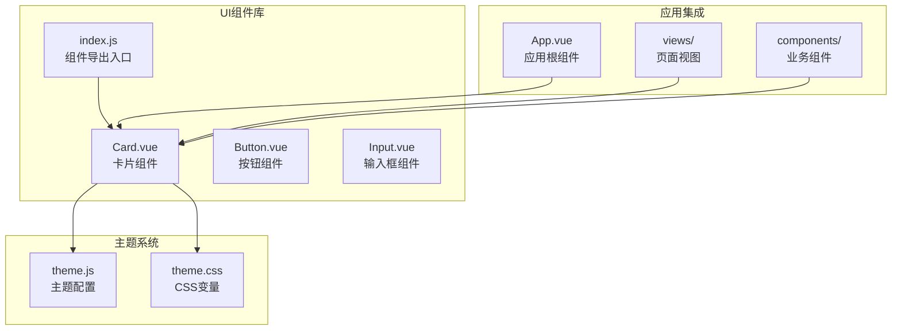
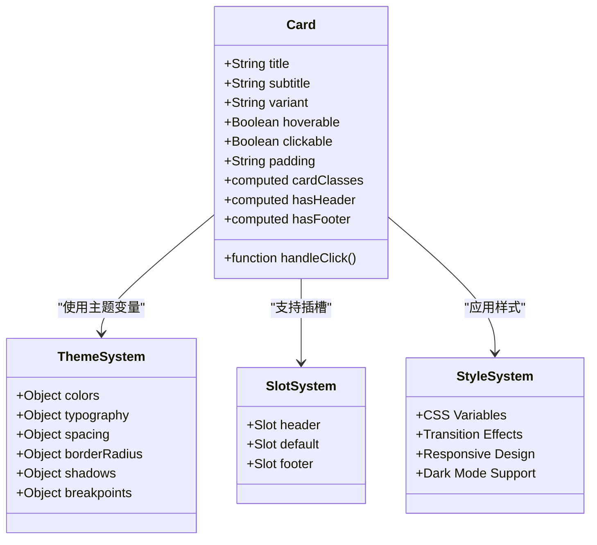
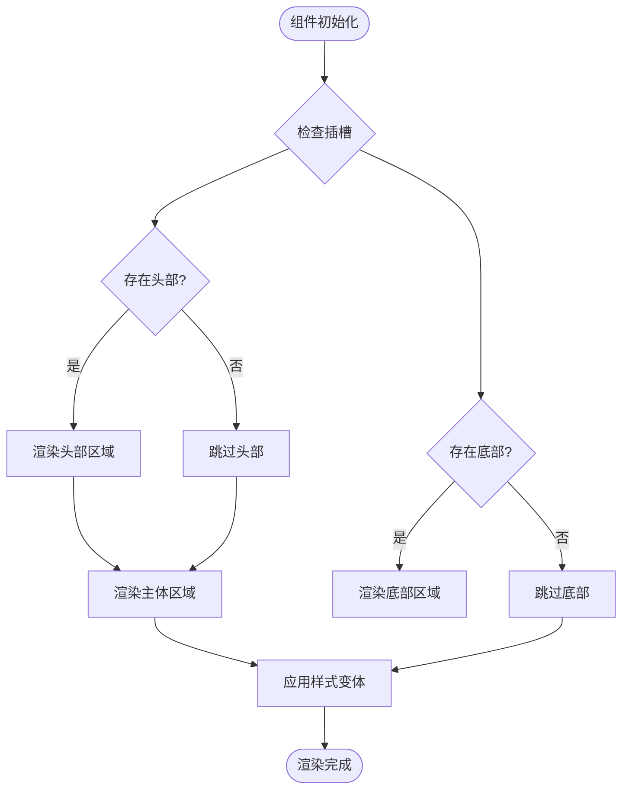
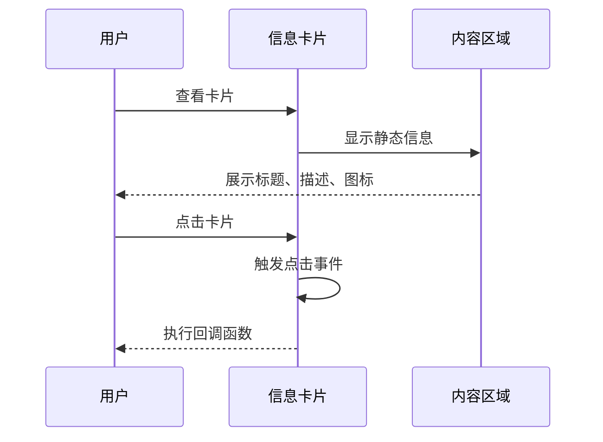
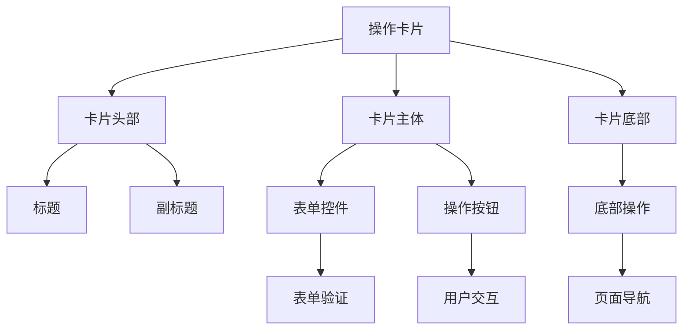
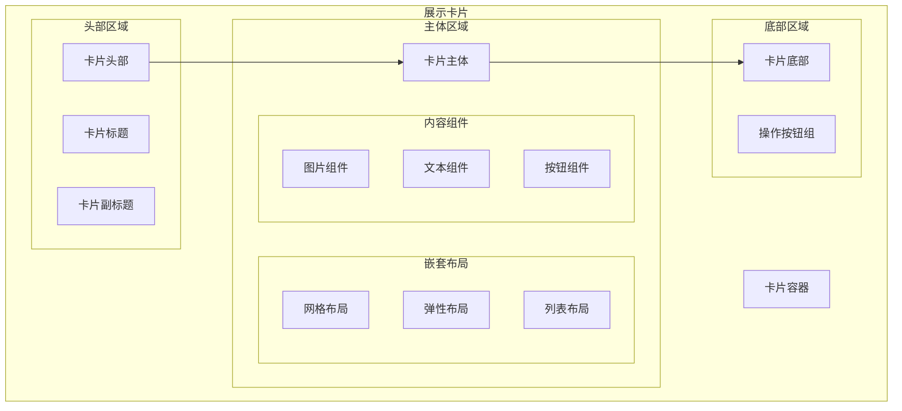
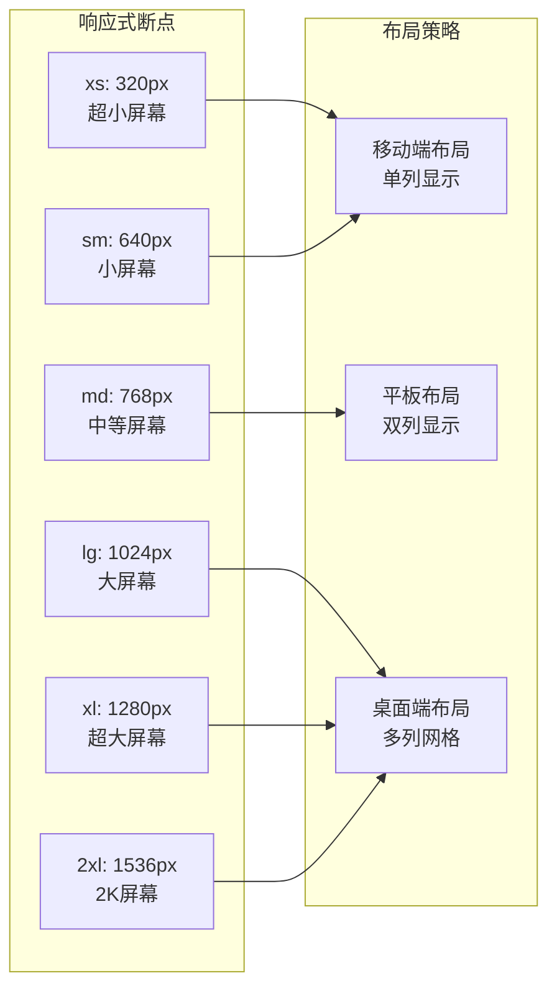
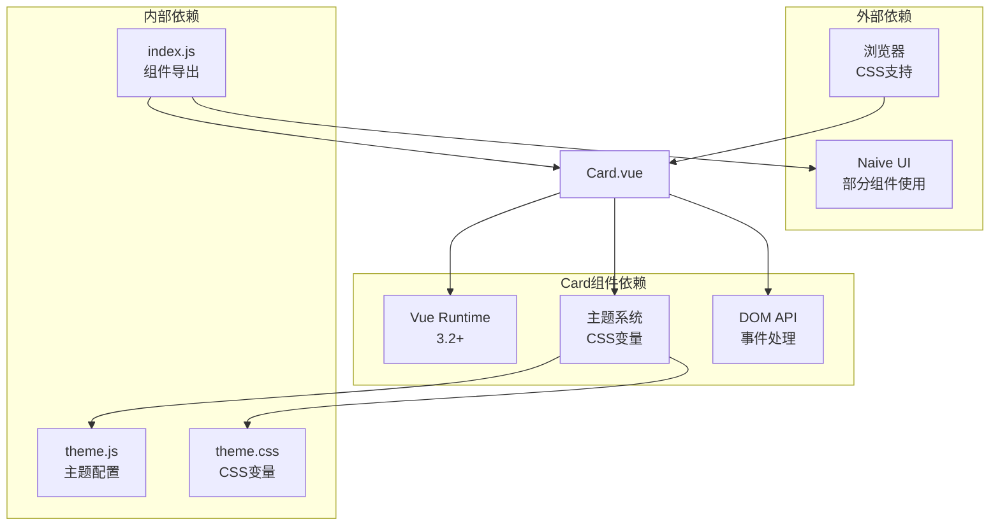

# Card卡片组件

<cite>
**本文档引用的文件**
- [Card.vue](file://src/components/ui/Card.vue)
- [index.js](file://src/components/ui/index.js)
- [theme.css](file://src/assets/theme.css)
- [theme.js](file://src/config/theme.js)
- [GUIDE.md](file://docs/GUIDE.md)
- [Preview.vue](file://src/components/Preview.vue)
- [Generate.vue](file://src/views/Generate.vue)
- [ContentEditor.vue](file://src/components/ContentEditor.vue)
</cite>

## 目录
1. [简介](#简介)
2. [项目结构](#项目结构)
3. [核心组件](#核心组件)
4. [架构概览](#架构概览)
5. [详细组件分析](#详细组件分析)
6. [依赖关系分析](#依赖关系分析)
7. [性能考虑](#性能考虑)
8. [故障排除指南](#故障排除指南)
9. [结论](#结论)

## 简介

Card卡片组件是本项目UI组件库的核心组件之一，采用Vue 3 Composition API和TypeScript语法编写。该组件提供了灵活的卡片布局设计，支持多种变体样式、响应式设计和丰富的交互功能。Card组件遵循现代UI设计原则，通过CSS自定义属性实现主题化设计，支持深色模式切换，并提供了完整的无障碍访问支持。

## 项目结构

Card组件位于UI组件库目录中，与Button、Input等其他基础组件共同构成完整的组件生态系统：



**图表来源**
- [Card.vue](file://src/components/ui/Card.vue#L1-L204)
- [index.js](file://src/components/ui/index.js#L1-L23)
- [theme.css](file://src/assets/theme.css#L1-L207)
- [theme.js](file://src/config/theme.js#L1-L274)

**章节来源**
- [Card.vue](file://src/components/ui/Card.vue#L1-L204)
- [index.js](file://src/components/ui/index.js#L1-L23)

## 核心组件

Card组件提供了完整的卡片功能，包括头部、主体和底部三个主要区域，以及灵活的样式变体和交互特性。

### 主要特性

- **三段式布局**：头部(header)、主体(body)、底部(footer)结构化设计
- **多变体样式**：default、bordered、elevated、ghost四种样式变体
- **响应式设计**：支持移动端和桌面端适配
- **交互增强**：hoverable悬停效果、clickable点击反馈
- **内边距控制**：none、sm、md、lg四种内边距级别
- **插槽系统**：支持自定义头部、主体和底部内容

### 核心属性

| 属性名 | 类型 | 默认值 | 描述 |
|--------|------|--------|------|
| title | String | '' | 卡片标题文本 |
| subtitle | String | '' | 卡片副标题文本 |
| variant | String | 'default' | 卡片样式变体 |
| hoverable | Boolean | false | 是否启用悬停效果 |
| clickable | Boolean | false | 是否启用点击反馈 |
| padding | String | 'md' | 内边距大小 |

**章节来源**
- [Card.vue](file://src/components/ui/Card.vue#L35-L68)

## 架构概览

Card组件采用模块化设计，通过CSS自定义属性实现主题化，通过插槽系统实现内容扩展，通过计算属性实现动态样式绑定。



**图表来源**
- [Card.vue](file://src/components/ui/Card.vue#L32-L99)
- [theme.js](file://src/config/theme.js#L6-L235)
- [theme.css](file://src/assets/theme.css#L7-L169)

## 详细组件分析

### 布局设计与内容组织

Card组件采用了Flexbox布局，确保内容的垂直排列和自适应高度：



**图表来源**
- [Card.vue](file://src/components/ui/Card.vue#L74-L80)

### 样式变体系统

Card组件提供了四种不同的样式变体，每种变体都有独特的视觉特征：

| 变体名称 | 特征描述 | CSS类名 | 配置参数 |
|----------|----------|---------|----------|
| default | 标准卡片样式 | card-default | 基础边框 + 轻微阴影 |
| bordered | 边框强调样式 | card-bordered | 粗边框 + 无阴影 |
| elevated | 浮动强调样式 | card-elevated | 无边框 + 显著阴影 |
| ghost | 透明卡片样式 | card-ghost | 无边框 + 透明背景 |

### 阴影效果与圆角边框

Card组件通过CSS自定义属性实现了统一的阴影和圆角系统：

```mermaid
graph LR
subgraph "阴影系统"
ShadowSM[Shadow SM<br/>0 1px 2px 0 rgba(0,0,0,0.05)]
ShadowLG[Shadow LG<br/>0 10px 15px -3px rgba(0,0,0,0.1)]
ShadowXL[Shadow XL<br/>0 20px 25px -5px rgba(0,0,0,0.1)]
end
subgraph "圆角系统"
RadiusSM[Radius SM<br/>0.125rem]
RadiusLG[Radius LG<br/>0.5rem]
RadiusFull[Radius Full<br/>9999px]
end
subgraph "背景系统"
BGPrimary[Background Primary<br/>#ffffff]
BGSecondary[Background Secondary<br/>#f9fafb]
BGTransparent[Background Transparent<br/>transparent]
end
ShadowSM --> CardDefault[Card Default]
ShadowLG --> CardElevated[Card Elevated]
ShadowXL --> CardHover[Card Hover]
RadiusLG --> AllCards[所有卡片]
BGPrimary --> CardDefault
BGSecondary --> CardHeaderFooter[头部/底部]
BGTransparent --> CardGhost[Card Ghost]
```

**图表来源**
- [theme.css](file://src/assets/theme.css#L130-L139)
- [theme.css](file://src/assets/theme.css#L119-L129)
- [theme.css](file://src/assets/theme.css#L82-L86)

### 背景色配置

Card组件支持三种主要的背景色配置，通过CSS自定义属性实现主题化：

- **Primary Background** (`--color-bg-primary`): #ffffff (白色)
- **Secondary Background** (`--color-bg-secondary`): #f9fafb (浅灰)
- **Tertiary Background** (`--color-bg-tertiary`): #f3f4f6 (中灰)

这些背景色在暗色模式下会自动切换到深色版本，确保良好的对比度和可读性。

**章节来源**
- [Card.vue](file://src/components/ui/Card.vue#L103-L130)
- [theme.css](file://src/assets/theme.css#L82-L98)

### 使用场景与组合模式

Card组件在项目中有多种使用场景，展示了不同的组合模式：

#### 信息卡片模式

信息卡片主要用于展示静态信息，通常不需要复杂的交互功能：



#### 操作卡片模式

操作卡片包含交互元素，如按钮、表单控件等：



#### 展示卡片模式

展示卡片用于呈现复杂的内容结构，支持嵌套布局：



**章节来源**
- [GUIDE.md](file://docs/GUIDE.md#L177-L202)
- [Generate.vue](file://src/views/Generate.vue#L508-L566)

### 响应式设计与嵌套布局支持

Card组件支持完整的响应式设计，通过CSS媒体查询和断点系统实现不同设备上的最佳显示效果：



**章节来源**
- [theme.js](file://src/config/theme.js#L199-L217)
- [theme.css](file://src/assets/theme.css#L171-L207)

## 依赖关系分析

Card组件的依赖关系相对简单，主要依赖于主题系统和Vue运行时：



**图表来源**
- [Card.vue](file://src/components/ui/Card.vue#L32-L33)
- [theme.js](file://src/config/theme.js#L241-L271)
- [index.js](file://src/components/ui/index.js#L15-L21)

**章节来源**
- [Card.vue](file://src/components/ui/Card.vue#L32-L33)
- [index.js](file://src/components/ui/index.js#L15-L21)

## 性能考虑

Card组件在设计时充分考虑了性能优化：

### 渲染优化
- 使用计算属性缓存样式类名
- 条件渲染头部和底部区域
- 避免不必要的DOM操作

### 样式优化
- CSS自定义属性减少样式重复
- 过渡动画使用硬件加速
- 响应式设计避免过度重绘

### 交互优化
- 事件委托减少监听器数量
- 悬停效果使用CSS过渡而非JavaScript动画
- 点击反馈采用轻量级动画

## 故障排除指南

### 常见问题及解决方案

#### 样式不生效
**问题描述**：Card组件样式未正确显示
**可能原因**：
- CSS变量未正确加载
- 主题配置文件未更新
- 样式作用域冲突

**解决方案**：
1. 检查主题CSS文件是否正确引入
2. 验证CSS变量是否在:root中定义
3. 确认组件样式没有被其他样式覆盖

#### 插槽内容不显示
**问题描述**：自定义插槽内容未显示
**可能原因**：
- 插槽名称不匹配
- 插槽内容为空
- 作用域插槽使用错误

**解决方案**：
1. 确认插槽名称与组件定义一致
2. 检查插槽内容是否正确传递
3. 验证作用域插槽的使用方式

#### 响应式布局异常
**问题描述**：卡片在不同设备上显示异常
**可能原因**：
- 断点配置不正确
- CSS媒体查询冲突
- 容器宽度设置问题

**解决方案**：
1. 检查断点配置是否符合预期
2. 验证CSS媒体查询的优先级
3. 确认父容器的宽度设置

**章节来源**
- [Card.vue](file://src/components/ui/Card.vue#L101-L195)

## 结论

Card卡片组件是一个设计精良、功能完整的UI组件，具有以下特点：

### 设计优势
- **模块化架构**：清晰的职责分离和组件边界
- **主题化设计**：通过CSS自定义属性实现统一的主题系统
- **响应式支持**：完整的移动优先设计策略
- **无障碍支持**：符合WCAG标准的可访问性设计

### 技术特色
- **性能优化**：计算属性缓存、条件渲染、硬件加速
- **灵活性**：插槽系统、样式变体、交互扩展
- **可维护性**：单一职责、清晰的API设计、完善的文档

### 应用价值
Card组件为项目提供了强大的内容组织能力，支持从简单的信息展示到复杂的交互界面，是构建现代Web应用的理想选择。通过合理的使用和扩展，可以满足各种业务场景的需求。