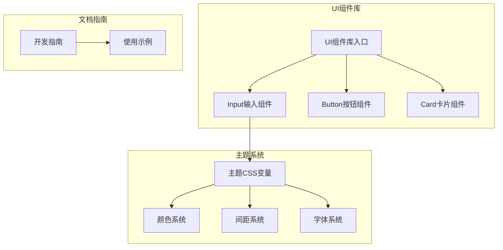
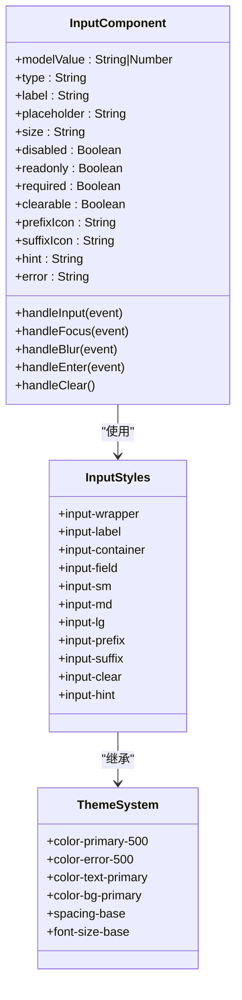
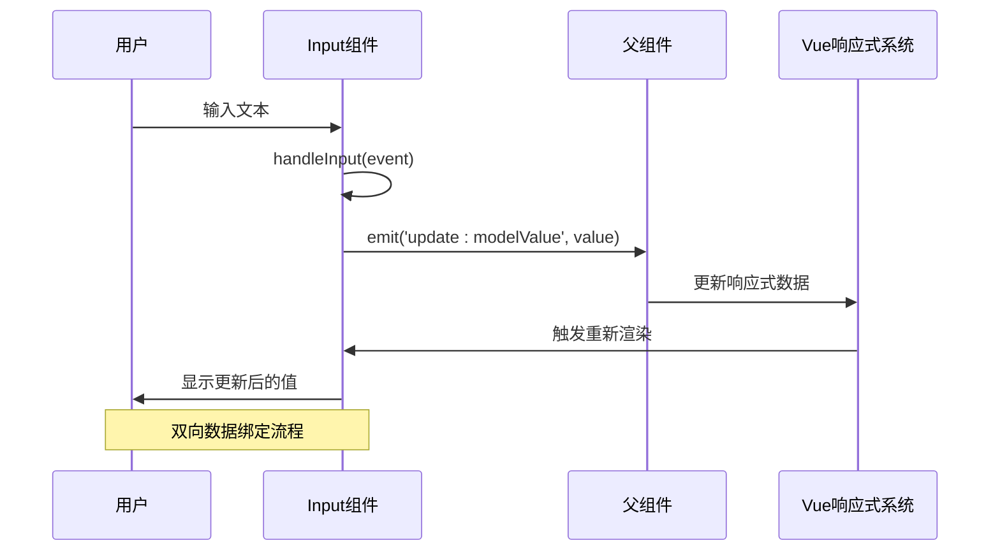
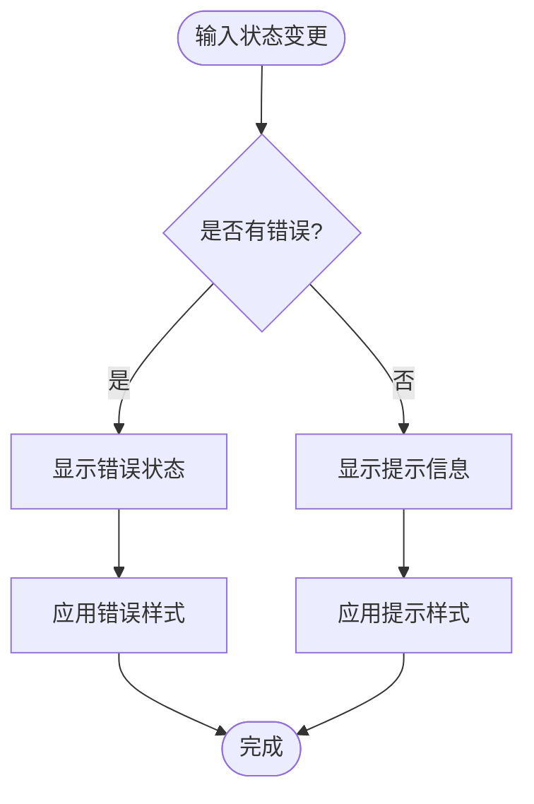
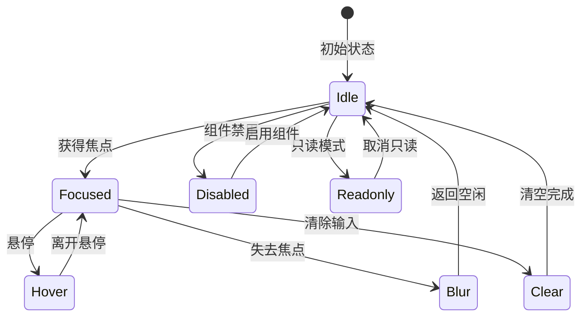
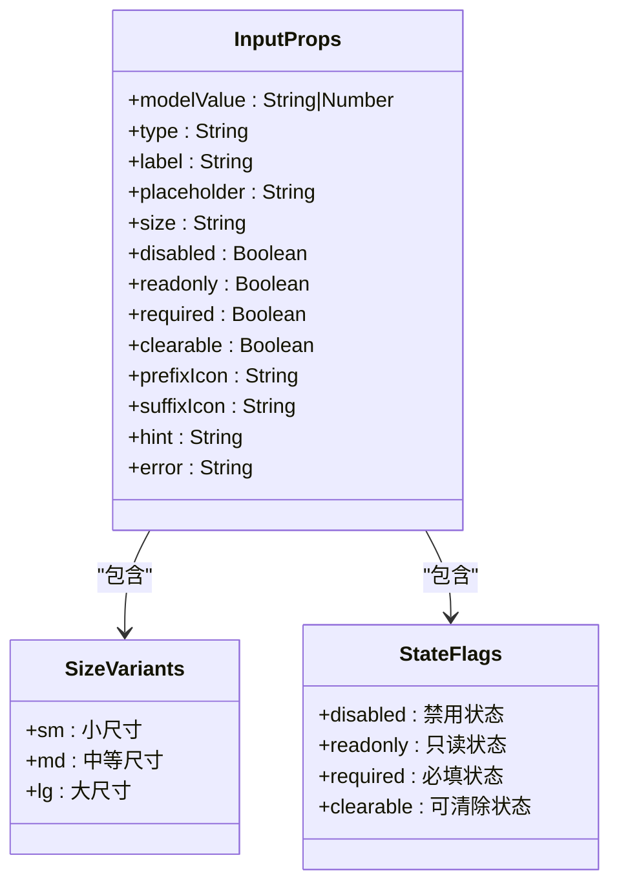
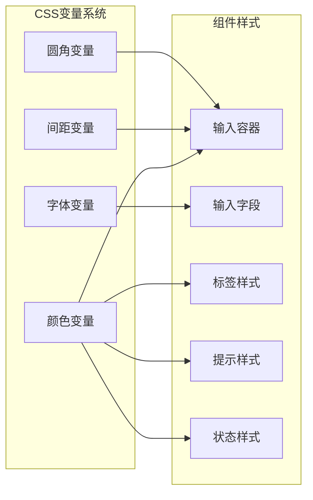
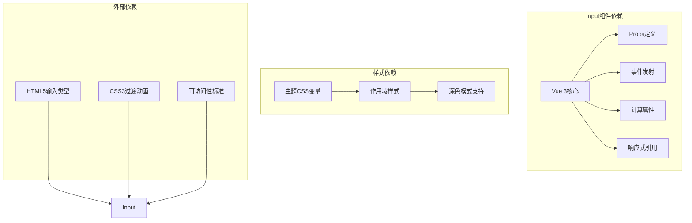
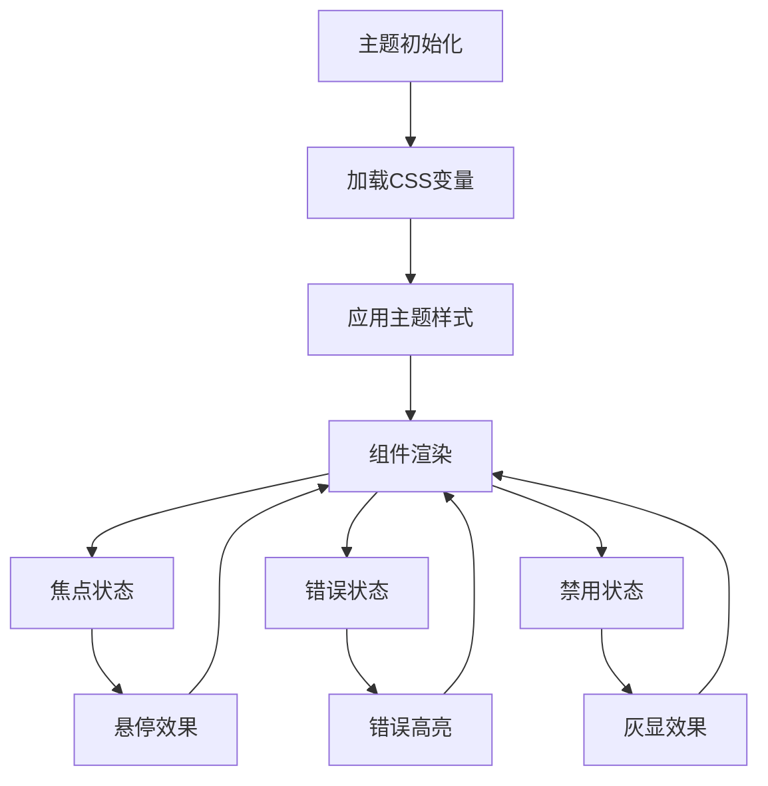

# Input输入组件

<cite>
**本文档引用的文件**
- [Input.vue](file://src/components/ui/Input.vue)
- [index.js](file://src/components/ui/index.js)
- [GUIDE.md](file://docs/GUIDE.md)
- [theme.css](file://src/assets/theme.css)
- [Generate.vue](file://src/views/Generate.vue)
</cite>

## 目录
1. [简介](#简介)
2. [项目结构](#项目结构)
3. [核心组件](#核心组件)
4. [架构概览](#架构概览)
5. [详细组件分析](#详细组件分析)
6. [依赖关系分析](#依赖关系分析)
7. [性能考虑](#性能考虑)
8. [故障排除指南](#故障排除指南)
9. [结论](#结论)

## 简介
Input输入组件是本项目UI组件库的核心组成部分，提供了完整的表单输入解决方案。该组件支持多种输入类型、数据绑定、验证机制和用户交互设计，为开发者提供了灵活而强大的输入控件。

## 项目结构
Input组件位于UI组件库目录下，采用Vue 3 Composition API和单文件组件格式实现。

**图表来源**
- [index.js](file://src/components/ui/index.js#L1-L23)
- [Input.vue](file://src/components/ui/Input.vue#L1-L325)
- [theme.css](file://src/assets/theme.css#L1-L207)

**章节来源**
- [index.js](file://src/components/ui/index.js#L1-L23)
- [Input.vue](file://src/components/ui/Input.vue#L1-L325)

## 核心组件
Input组件实现了完整的表单输入功能，包括数据绑定、验证显示、用户交互和样式定制。

### 主要特性
- **双向数据绑定**: 支持v-model双向绑定
- **多种输入类型**: 文本、密码、邮箱、数字等
- **验证状态显示**: 错误状态高亮和提示信息
- **用户交互**: 焦点状态、悬停效果、键盘事件
- **可访问性**: 标签关联、禁用状态处理
- **响应式设计**: 支持不同尺寸和主题

**章节来源**
- [Input.vue](file://src/components/ui/Input.vue#L64-L131)
- [Input.vue](file://src/components/ui/Input.vue#L138-L155)

## 架构概览
Input组件采用模块化设计，通过props接收配置，通过events向外发出状态变化。

**图表来源**
- [Input.vue](file://src/components/ui/Input.vue#L64-L131)
- [Input.vue](file://src/components/ui/Input.vue#L181-L314)
- [theme.css](file://src/assets/theme.css#L7-L169)

## 详细组件分析

### 数据绑定机制
Input组件通过Vue 3的Composition API实现响应式数据绑定。

**图表来源**
- [Input.vue](file://src/components/ui/Input.vue#L157-L159)

### 验证机制
组件支持错误状态显示和提示信息展示。

**图表来源**
- [Input.vue](file://src/components/ui/Input.vue#L55-L57)
- [Input.vue](file://src/components/ui/Input.vue#L138-L148)

### 用户交互设计
组件提供完整的用户交互体验，包括焦点管理、悬停效果和键盘支持。

**图表来源**
- [Input.vue](file://src/components/ui/Input.vue#L135-L178)

**章节来源**
- [Input.vue](file://src/components/ui/Input.vue#L157-L178)

### 输入类型支持
组件支持多种HTML5输入类型，每种类型都有相应的验证和行为。

| 类型 | 描述 | 验证特性 |
|------|------|----------|
| text | 普通文本输入 | 基础字符验证 |
| password | 密码输入 | 隐藏字符显示 |
| email | 邮箱地址 | 格式验证 |
| number | 数字输入 | 数值范围验证 |
| tel | 电话号码 | 格式验证 |
| url | 网址 | URL格式验证 |

**章节来源**
- [Input.vue](file://src/components/ui/Input.vue#L70-L74)

### 属性配置详解
Input组件提供了丰富的属性配置选项。

**图表来源**
- [Input.vue](file://src/components/ui/Input.vue#L64-L131)

**章节来源**
- [Input.vue](file://src/components/ui/Input.vue#L64-L131)

### 样式系统
组件采用CSS变量驱动的主题系统，支持深色模式和自定义主题。

**图表来源**
- [theme.css](file://src/assets/theme.css#L7-L169)
- [Input.vue](file://src/components/ui/Input.vue#L181-L314)

**章节来源**
- [theme.css](file://src/assets/theme.css#L1-L207)
- [Input.vue](file://src/components/ui/Input.vue#L181-L314)

## 依赖关系分析

### 组件依赖图
Input组件与其他UI组件和主题系统的依赖关系如下：

**图表来源**
- [Input.vue](file://src/components/ui/Input.vue#L61-L178)
- [theme.css](file://src/assets/theme.css#L171-L205)

**章节来源**
- [Input.vue](file://src/components/ui/Input.vue#L61-L178)
- [theme.css](file://src/assets/theme.css#L171-L205)

### 主题系统集成
Input组件深度集成了项目的主题系统，支持动态主题切换。

**图表来源**
- [theme.css](file://src/assets/theme.css#L171-L205)
- [Input.vue](file://src/components/ui/Input.vue#L213-L234)

**章节来源**
- [theme.css](file://src/assets/theme.css#L171-L205)
- [Input.vue](file://src/components/ui/Input.vue#L213-L234)

## 性能考虑
Input组件在设计时充分考虑了性能优化：

### 渲染优化
- 使用计算属性缓存样式类名
- 条件渲染避免不必要的DOM节点
- 事件处理函数的合理使用

### 内存管理
- 响应式引用的正确使用
- 事件监听器的生命周期管理
- DOM节点的及时清理

### 用户体验优化
- CSS过渡动画的性能考虑
- 主题切换的流畅性
- 键盘导航的支持

## 故障排除指南

### 常见问题及解决方案

#### 输入值不更新
**问题**: v-model绑定的值不随输入变化
**解决方案**: 确保正确使用`update:modelValue`事件

#### 样式不生效
**问题**: 自定义样式或主题变量不生效
**解决方案**: 检查CSS变量是否正确加载，确认作用域样式优先级

#### 验证状态异常
**问题**: 错误状态显示不符合预期
**解决方案**: 检查error和hint属性的设置逻辑

#### 可访问性问题
**问题**: 屏幕阅读器无法正确读取输入信息
**解决方案**: 确保label与input的正确关联，提供适当的aria属性

**章节来源**
- [Input.vue](file://src/components/ui/Input.vue#L133-L178)
- [Input.vue](file://src/components/ui/Input.vue#L181-L314)

## 结论
Input输入组件是一个功能完整、设计精良的表单输入解决方案。它不仅提供了基本的输入功能，还包含了完整的验证机制、用户交互设计和主题系统集成。通过合理的架构设计和性能优化，该组件能够满足各种复杂的表单输入需求，为开发者提供了强大而灵活的输入控件。

组件的主要优势包括：
- 完整的Vue 3响应式支持
- 灵活的属性配置选项
- 优秀的可访问性设计
- 深度集成的主题系统
- 良好的性能表现

在未来的发展中，可以考虑进一步增强实时验证、国际化支持和移动端优化等功能，以提升用户体验。