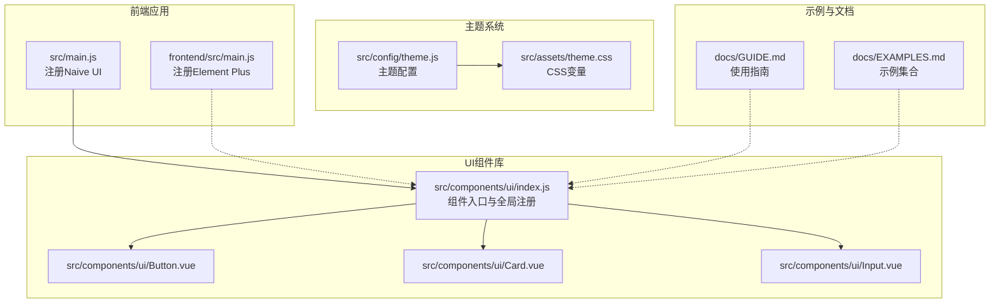
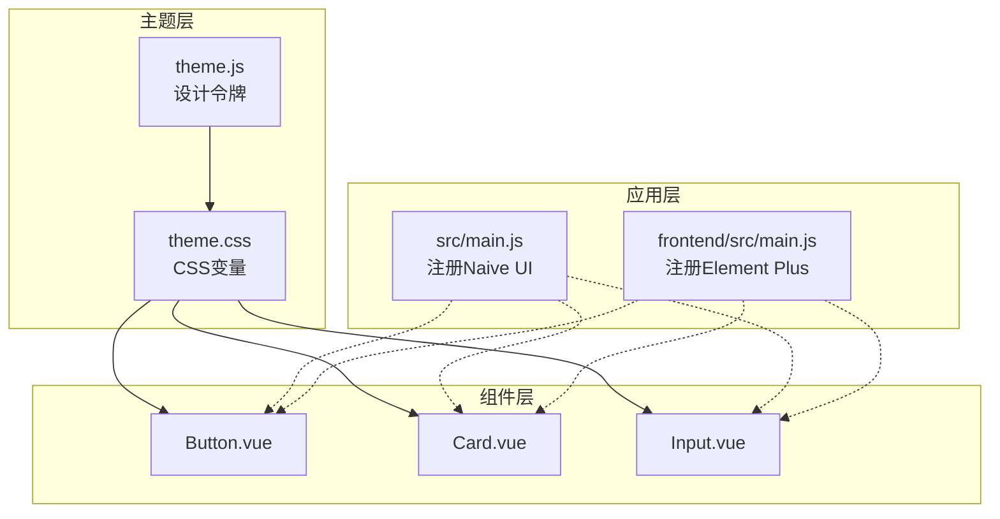
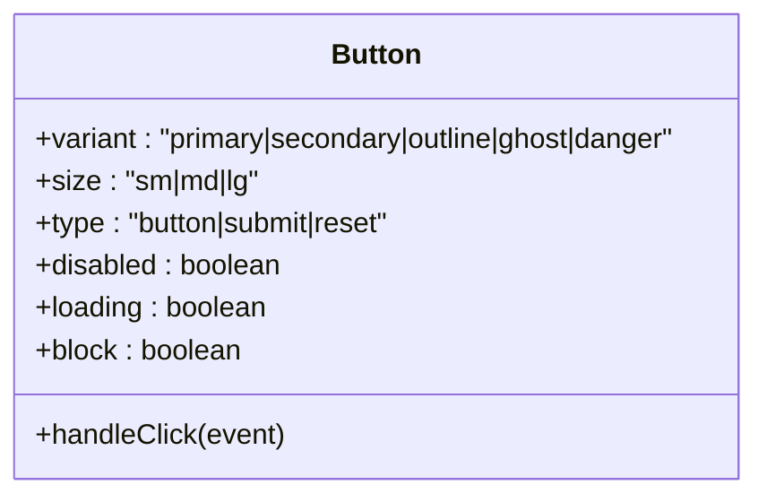
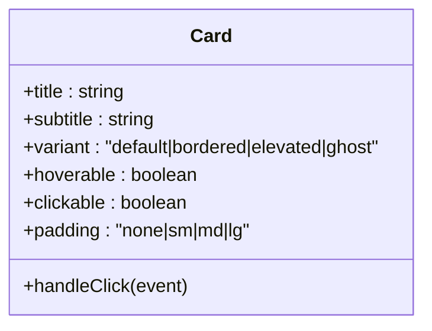
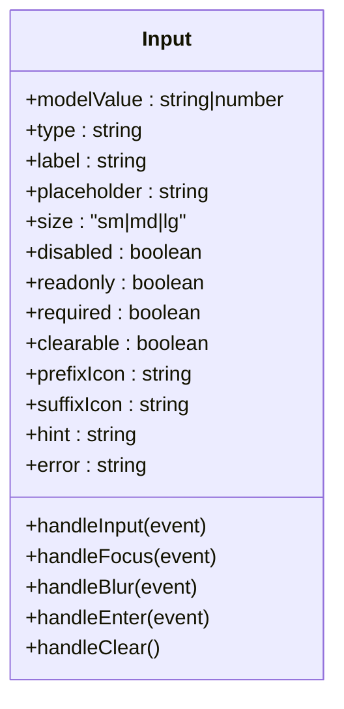
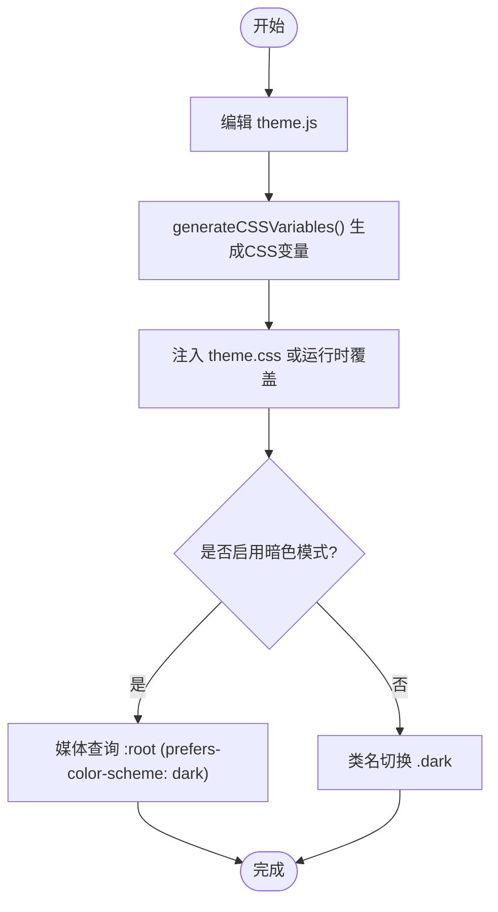
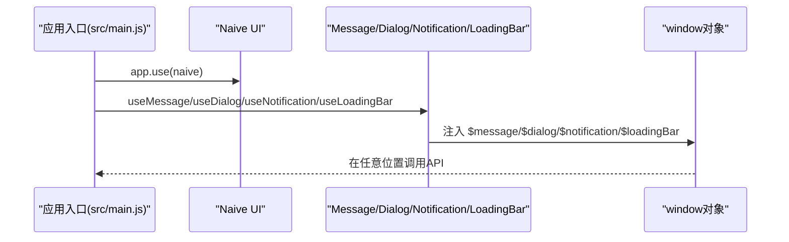
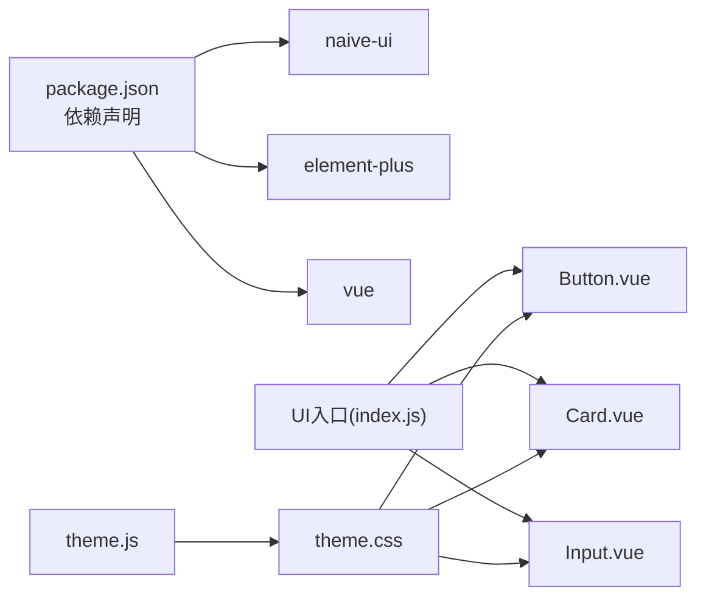

# UI组件库与基础组件

<cite>
**本文档引用的文件**
- [src/components/ui/Button.vue](file://src/components/ui/Button.vue)
- [src/components/ui/Card.vue](file://src/components/ui/Card.vue)
- [src/components/ui/Input.vue](file://src/components/ui/Input.vue)
- [src/components/ui/index.js](file://src/components/ui/index.js)
- [src/config/theme.js](file://src/config/theme.js)
- [src/assets/theme.css](file://src/assets/theme.css)
- [src/main.js](file://src/main.js)
- [frontend/src/main.js](file://frontend/src/main.js)
- [src/components/MessageApi.vue](file://src/components/MessageApi.vue)
- [src/assets/base.css](file://src/assets/base.css)
- [docs/GUIDE.md](file://docs/GUIDE.md)
- [docs/EXAMPLES.md](file://docs/EXAMPLES.md)
- [package.json](file://package.json)
- [index.html](file://index.html)
</cite>

## 目录
1. [简介](#简介)
2. [项目结构](#项目结构)
3. [核心组件](#核心组件)
4. [架构概览](#架构概览)
5. [详细组件分析](#详细组件分析)
6. [依赖关系分析](#依赖关系分析)
7. [性能考量](#性能考量)
8. [故障排除指南](#故障排除指南)
9. [结论](#结论)
10. [附录](#附录)

## 简介
本项目提供了一套基于Vue 3的UI组件库，包含Button、Card、Input等基础组件，并配套完整的主题系统与可定制化方案。组件采用组合式API与CSS变量驱动，支持暗色模式、响应式设计与无障碍访问。同时集成了Naive UI与Element Plus，满足不同场景下的组件需求。

## 项目结构
UI组件库位于 `src/components/ui` 目录，主题系统位于 `src/config/theme.js` 与 `src/assets/theme.css`，并通过入口文件统一导出与全局注册。

**图表来源**
- [src/main.js](file://src/main.js#L4-L13)
- [frontend/src/main.js](file://frontend/src/main.js#L4-L13)
- [src/components/ui/index.js](file://src/components/ui/index.js#L7-L21)
- [src/config/theme.js](file://src/config/theme.js#L6-L235)
- [src/assets/theme.css](file://src/assets/theme.css#L7-L207)
- [docs/GUIDE.md](file://docs/GUIDE.md#L140-L175)
- [docs/EXAMPLES.md](file://docs/EXAMPLES.md#L279-L362)

**章节来源**
- [src/components/ui/index.js](file://src/components/ui/index.js#L7-L21)
- [src/config/theme.js](file://src/config/theme.js#L6-L235)
- [src/assets/theme.css](file://src/assets/theme.css#L7-L207)
- [src/main.js](file://src/main.js#L4-L13)
- [frontend/src/main.js](file://frontend/src/main.js#L4-L13)
- [docs/GUIDE.md](file://docs/GUIDE.md#L140-L175)
- [docs/EXAMPLES.md](file://docs/EXAMPLES.md#L279-L362)

## 核心组件
- Button：支持多种变体（primary、secondary、outline、ghost、danger）、尺寸（sm、md、lg）、块级显示、禁用与加载态。
- Card：支持多种变体（default、bordered、elevated、ghost）、悬停与点击态、标题/副标题、头部/底部插槽。
- Input：支持标签、前缀/后缀图标、清除功能、提示与错误状态、尺寸与禁用/只读控制。

组件通过CSS变量与类名组合实现样式定制，事件系统遵循Vue规范，支持v-model双向绑定与原生事件透传。

**章节来源**
- [src/components/ui/Button.vue](file://src/components/ui/Button.vue#L25-L79)
- [src/components/ui/Card.vue](file://src/components/ui/Card.vue#L35-L98)
- [src/components/ui/Input.vue](file://src/components/ui/Input.vue#L64-L179)

## 架构概览
UI组件库采用“配置驱动 + CSS变量”的架构，主题系统集中管理颜色、字体、间距、阴影等设计令牌，并通过CSS变量注入到组件样式中。组件通过计算属性动态生成类名，确保样式一致性与可维护性。

**图表来源**
- [src/config/theme.js](file://src/config/theme.js#L6-L235)
- [src/assets/theme.css](file://src/assets/theme.css#L7-L207)
- [src/components/ui/Button.vue](file://src/components/ui/Button.vue#L82-L237)
- [src/components/ui/Card.vue](file://src/components/ui/Card.vue#L101-L195)
- [src/components/ui/Input.vue](file://src/components/ui/Input.vue#L181-L314)
- [src/main.js](file://src/main.js#L4-L13)
- [frontend/src/main.js](file://frontend/src/main.js#L4-L13)

## 详细组件分析

### Button组件
- 设计理念：以语义化变体与尺寸为核心，结合CSS变量实现一致的视觉与交互体验；加载态与禁用态通过类名组合实现。
- 属性设计：
  - variant：primary、secondary、outline、ghost、danger
  - size：sm、md、lg
  - type：button、submit、reset（透传HTML button type）
  - disabled：禁用态
  - loading：加载态
  - block：块级按钮
- 事件处理：仅在非禁用且非加载状态下触发click事件。
- 样式定制：通过CSS变量覆盖主题令牌，如颜色、圆角、阴影与过渡时间。

**图表来源**
- [src/components/ui/Button.vue](file://src/components/ui/Button.vue#L25-L79)

**章节来源**
- [src/components/ui/Button.vue](file://src/components/ui/Button.vue#L25-L79)
- [src/components/ui/Button.vue](file://src/components/ui/Button.vue#L82-L237)

### Card组件
- 设计理念：卡片容器支持头部、主体、底部三段式结构，通过插槽与属性组合实现灵活布局；hoverable与clickable增强交互反馈。
- 属性设计：
  - title/subtitle：标题与副标题
  - variant：default、bordered、elevated、ghost
  - hoverable：悬停提升与阴影
  - clickable：点击反馈与指针变化
  - padding：none、sm、md、lg
- 事件处理：click事件仅在clickable为true时触发。
- 样式定制：通过CSS变量控制背景、边框、阴影与内边距。

**图表来源**
- [src/components/ui/Card.vue](file://src/components/ui/Card.vue#L35-L98)

**章节来源**
- [src/components/ui/Card.vue](file://src/components/ui/Card.vue#L35-L98)
- [src/components/ui/Card.vue](file://src/components/ui/Card.vue#L101-L195)

### Input组件
- 设计理念：围绕表单输入场景，提供标签、前缀/后缀图标、清除按钮、聚焦态与错误态的完整交互闭环；通过v-model实现双向绑定。
- 属性设计：
  - modelValue：v-model绑定值
  - type：text、email、password等
  - label：标签文本
  - placeholder：占位符
  - size：sm、md、lg
  - disabled/readonly：禁用与只读
  - required：必填标记
  - clearable：可清除
  - prefixIcon/suffixIcon：前后缀图标
  - hint/error：提示与错误信息
- 事件处理：update:modelValue、focus、blur、enter、clear。
- 样式定制：通过CSS变量控制容器边框、阴影、文字颜色与尺寸。

**图表来源**
- [src/components/ui/Input.vue](file://src/components/ui/Input.vue#L64-L179)

**章节来源**
- [src/components/ui/Input.vue](file://src/components/ui/Input.vue#L64-L179)
- [src/components/ui/Input.vue](file://src/components/ui/Input.vue#L181-L314)

### 组件注册与使用
- 按需导入：在组件中直接引入所需组件，适合按需打包与Tree-shaking。
- 全局注册：通过入口文件统一注册，便于在任意组件中直接使用。

```mermaid
sequenceDiagram
participant App as "应用入口"
participant Entry as "UI入口(index.js)"
participant Btn as "Button.vue"
participant Card as "Card.vue"
participant Input as "Input.vue"
App->>Entry : app.use(UI)
Entry->>Btn : app.component("Button", Button)
Entry->>Card : app.component("Card", Card)
Entry->>Input : app.component("Input", Input)
App-->>App : 在模板中直接使用 <Button/> <Card/> <Input/>
```

**图表来源**
- [src/components/ui/index.js](file://src/components/ui/index.js#L15-L21)

**章节来源**
- [src/components/ui/index.js](file://src/components/ui/index.js#L7-L21)
- [docs/GUIDE.md](file://docs/GUIDE.md#L140-L175)

### 主题系统与定制化
- 主题配置：集中定义颜色、字体、间距、圆角、阴影、断点、z-index与过渡时间等设计令牌。
- CSS变量生成：将主题配置映射为CSS自定义属性，供组件样式引用。
- 暗色模式：通过媒体查询与类名切换实现深色主题适配。
- 定制化方案：
  - 覆盖CSS变量：在全局或组件作用域覆盖特定变量。
  - 修改主题配置：调整theme.js中的令牌值后重新生成CSS变量。
  - 创建主题变体：通过类名切换实现多主题方案。

**图表来源**
- [src/config/theme.js](file://src/config/theme.js#L241-L271)
- [src/assets/theme.css](file://src/assets/theme.css#L171-L207)

**章节来源**
- [src/config/theme.js](file://src/config/theme.js#L6-L235)
- [src/assets/theme.css](file://src/assets/theme.css#L7-L207)
- [docs/GUIDE.md](file://docs/GUIDE.md#L283-L341)

### Naive UI集成与定制
- 集成方式：在应用入口通过app.use注册Naive UI。
- API注入：通过Message、Dialog、Notification、LoadingBar的API注入到window对象，便于在非组件上下文中使用。
- 定制化：可通过主题变量与组件属性调整外观与行为；注意与内置样式隔离，避免冲突。

**图表来源**
- [src/main.js](file://src/main.js#L4-L13)
- [src/components/MessageApi.vue](file://src/components/MessageApi.vue#L1-L15)

**章节来源**
- [src/main.js](file://src/main.js#L4-L13)
- [src/components/MessageApi.vue](file://src/components/MessageApi.vue#L1-L15)
- [package.json](file://package.json#L23-L23)

### 使用示例与最佳实践
- 表单场景：结合Card与Input实现表单布局，Button负责提交与加载态控制。
- 列表场景：Card网格布局展示资源列表，配合Input搜索与Button分页。
- 最佳实践：
  - 优先使用按需导入，减少包体积。
  - 通过插槽与属性组合实现复杂布局，保持组件单一职责。
  - 使用CSS变量与主题系统统一风格，避免硬编码样式。
  - 为Input提供清晰的错误提示与焦点状态反馈。

**章节来源**
- [docs/GUIDE.md](file://docs/GUIDE.md#L85-L136)
- [docs/GUIDE.md](file://docs/GUIDE.md#L177-L202)
- [docs/EXAMPLES.md](file://docs/EXAMPLES.md#L275-L362)

## 依赖关系分析
- 组件依赖：Button、Card、Input均依赖CSS变量与基础样式；通过入口文件统一导出与注册。
- 应用依赖：src/main.js注册Naive UI，frontend/src/main.js注册Element Plus；两者互不冲突，可按需选择。
- 主题依赖：theme.js与theme.css形成主题链路，组件样式依赖CSS变量。

**图表来源**
- [package.json](file://package.json#L15-L26)
- [src/components/ui/index.js](file://src/components/ui/index.js#L7-L21)
- [src/config/theme.js](file://src/config/theme.js#L6-L235)
- [src/assets/theme.css](file://src/assets/theme.css#L7-L207)

**章节来源**
- [package.json](file://package.json#L15-L26)
- [src/components/ui/index.js](file://src/components/ui/index.js#L7-L21)
- [src/config/theme.js](file://src/config/theme.js#L6-L235)
- [src/assets/theme.css](file://src/assets/theme.css#L7-L207)

## 性能考量
- 按需导入：减少初始包体积，提高首屏加载速度。
- 计算属性：通过computed组合类名，避免重复渲染。
- CSS变量：集中管理样式令牌，降低样式冲突与重绘成本。
- 滚动条优化：统一Naive UI滚动条样式，提升滚动性能与一致性。
- 响应式设计：利用断点系统与CSS变量，减少媒体查询数量。

**章节来源**
- [src/assets/base.css](file://src/assets/base.css#L143-L153)
- [src/config/theme.js](file://src/config/theme.js#L199-L217)

## 故障排除指南
- 组件未生效：检查是否正确导入或全局注册；确认入口文件导出与注册逻辑。
- 样式异常：检查CSS变量是否正确注入；确认主题文件加载顺序。
- 交互无效：检查事件绑定与禁用/加载状态；确认事件透传是否正确。
- 暗色模式不生效：检查媒体查询与类名切换逻辑；确认CSS变量覆盖是否正确。
- 滚动条样式不一致：检查base.css中的滚动条样式规则与Naive UI容器类名。

**章节来源**
- [src/components/ui/index.js](file://src/components/ui/index.js#L15-L21)
- [src/assets/theme.css](file://src/assets/theme.css#L171-L207)
- [src/assets/base.css](file://src/assets/base.css#L143-L153)
- [src/main.js](file://src/main.js#L4-L13)

## 结论
本UI组件库通过主题系统与CSS变量实现了高度可定制的视觉体系，结合Button、Card、Input等基础组件，能够快速搭建一致、美观且易维护的界面。配合Naive UI与Element Plus，可在不同场景下灵活选择组件生态。建议在实际项目中遵循按需导入、主题统一与无障碍访问的最佳实践，持续优化性能与用户体验。

## 附录
- 可访问性设计要点：
  - 为Input提供label与aria属性，确保屏幕阅读器友好。
  - 为Button提供明确的语义与键盘可访问性。
  - 为Card提供可点击区域的视觉反馈与键盘交互。
- 跨浏览器兼容性：
  - 使用CSS变量与现代浏览器特性，确保在主流浏览器中正常工作。
  - 通过base.css统一滚动条样式，减少浏览器差异带来的视觉不一致。
  - 在index.html中设置viewport与基础样式，提升移动端兼容性。

**章节来源**
- [index.html](file://index.html#L6-L6)
- [src/assets/base.css](file://src/assets/base.css#L95-L153)