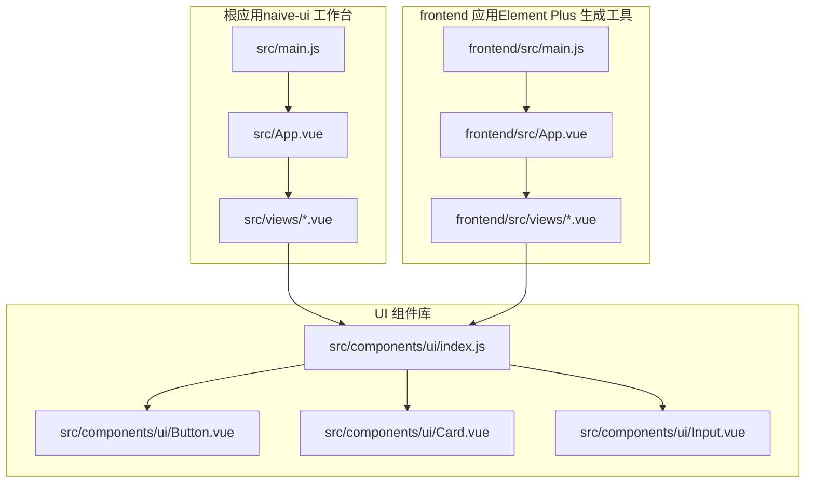
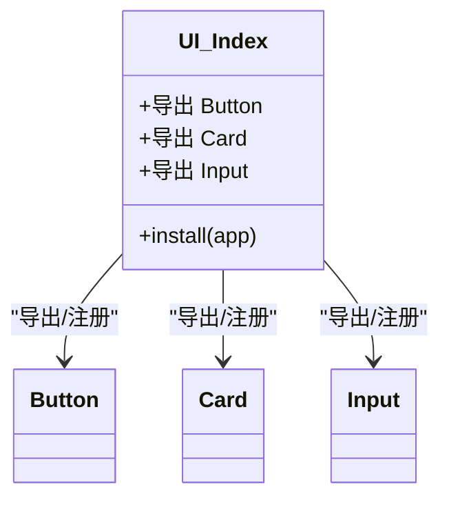
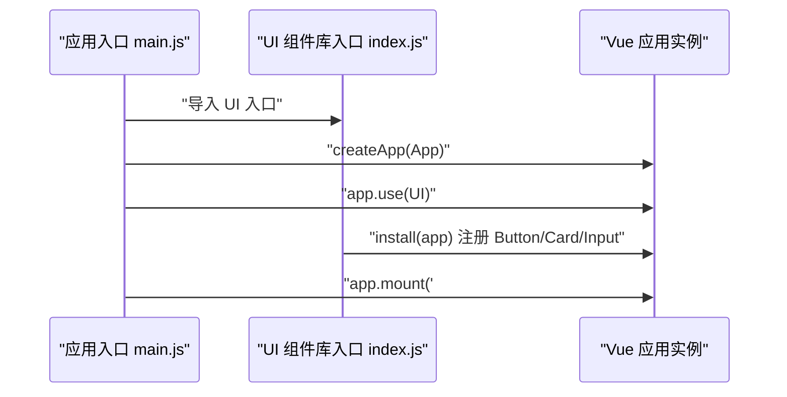
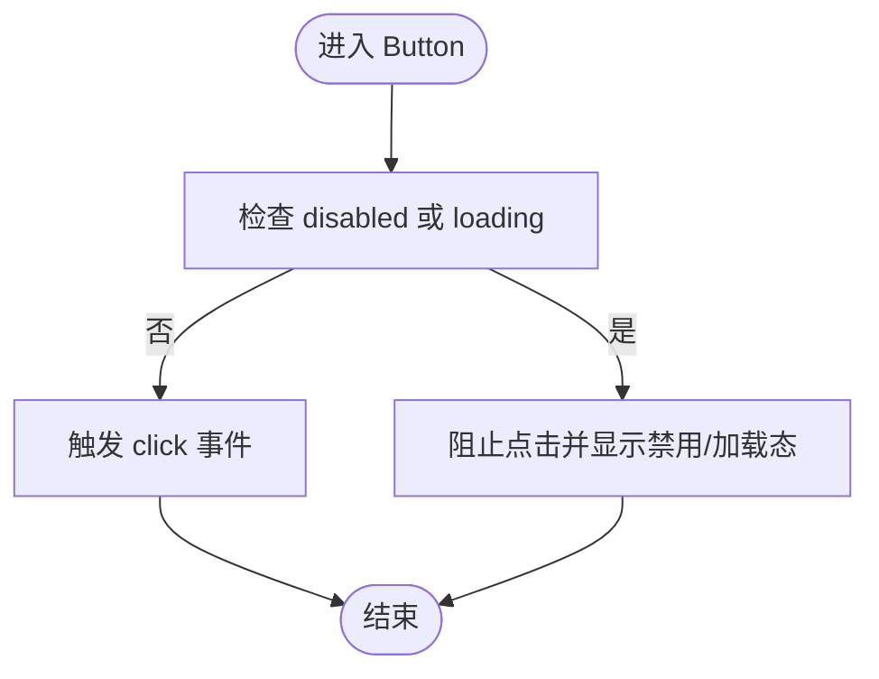
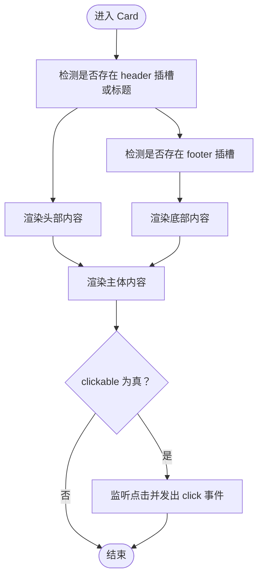
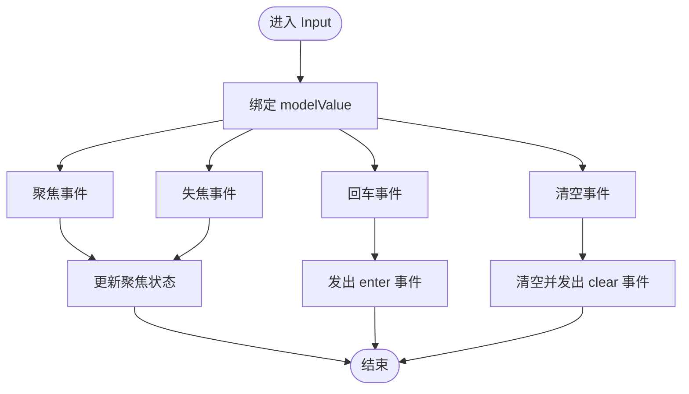
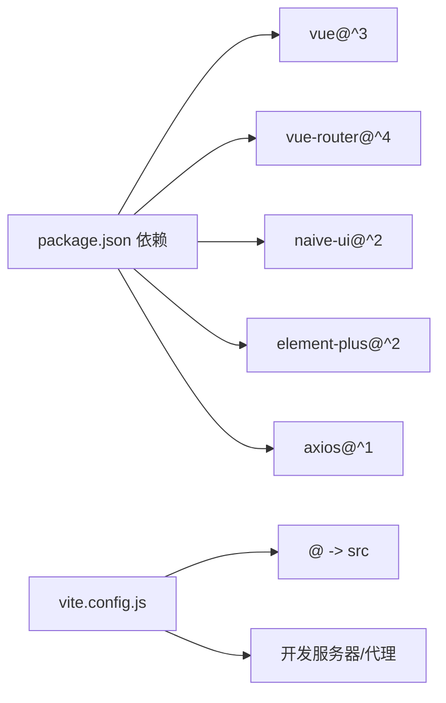

# 组件集成与配置

<cite>
**本文引用的文件**
- [package.json](file://package.json)
- [vite.config.js](file://vite.config.js)
- [src/main.js](file://src/main.js)
- [frontend/src/main.js](file://frontend/src/main.js)
- [src/components/ui/index.js](file://src/components/ui/index.js)
- [src/components/ui/Button.vue](file://src/components/ui/Button.vue)
- [src/components/ui/Card.vue](file://src/components/ui/Card.vue)
- [src/components/ui/Input.vue](file://src/components/ui/Input.vue)
- [src/App.vue](file://src/App.vue)
- [frontend/src/App.vue](file://frontend/src/App.vue)
- [src/views/Generate.vue](file://src/views/Generate.vue)
- [frontend/src/views/Generate.vue](file://frontend/src/views/Generate.vue)
- [docs/GUIDE.md](file://docs/GUIDE.md)
- [docs/EXAMPLES.md](file://docs/EXAMPLES.md)
</cite>

## 目录
1. [简介](#简介)
2. [项目结构](#项目结构)
3. [核心组件](#核心组件)
4. [架构总览](#架构总览)
5. [组件详细分析](#组件详细分析)
6. [依赖关系分析](#依赖关系分析)
7. [性能考量](#性能考量)
8. [故障排查指南](#故障排查指南)
9. [结论](#结论)
10. [附录](#附录)

## 简介
本文件面向前端开发者与技术负责人，系统性阐述本项目的组件库架构与集成配置，重点包括：
- UI组件库的整体架构与统一导出机制
- 组件的全局注册与按需引入两种使用方式
- 组件库的安装配置与初始化流程
- 在不同项目中的集成方案与最佳实践
- 组件命名规范、导入方式与版本管理策略
- 组件库升级与迁移指南

## 项目结构
本仓库包含两套前端应用与一套共享的UI组件库：
- 根目录下的主应用（基于 naive-ui 的工作台）
- frontend 目录下的另一个前端应用（基于 Element Plus 的生成工具）
- src/components/ui 为统一的 Vue 3 组件库，提供 Button、Card、Input 等基础 UI 组件

图表来源
- [src/main.js](file://src/main.js#L1-L16)
- [frontend/src/main.js](file://frontend/src/main.js#L1-L15)
- [src/App.vue](file://src/App.vue#L1-L108)
- [frontend/src/App.vue](file://frontend/src/App.vue#L1-L50)
- [src/components/ui/index.js](file://src/components/ui/index.js#L1-L23)

章节来源
- [package.json](file://package.json#L1-L32)
- [vite.config.js](file://vite.config.js#L1-L37)
- [src/main.js](file://src/main.js#L1-L16)
- [frontend/src/main.js](file://frontend/src/main.js#L1-L15)
- [src/App.vue](file://src/App.vue#L1-L108)
- [frontend/src/App.vue](file://frontend/src/App.vue#L1-L50)

## 核心组件
本节聚焦 UI 组件库的核心文件与职责：
- 统一入口与导出：通过 index.js 暴露组件与安装函数，支持全局注册与按需导入
- Button：提供多种变体、尺寸、状态与加载态
- Card：支持标题、副标题、多种变体、悬停与点击行为
- Input：支持标签、前后缀、清空、提示与错误状态

章节来源
- [src/components/ui/index.js](file://src/components/ui/index.js#L1-L23)
- [src/components/ui/Button.vue](file://src/components/ui/Button.vue#L1-L244)
- [src/components/ui/Card.vue](file://src/components/ui/Card.vue#L1-L204)
- [src/components/ui/Input.vue](file://src/components/ui/Input.vue#L1-L325)

## 架构总览
UI 组件库采用“统一入口 + 插件式安装”的设计：
- 统一入口负责聚合导出组件与安装函数
- 安装函数在应用初始化时被调用，实现全局注册
- 组件内部通过 props/emit/slots 实现高内聚、低耦合

图表来源
- [src/components/ui/index.js](file://src/components/ui/index.js#L7-L21)

章节来源
- [src/components/ui/index.js](file://src/components/ui/index.js#L1-L23)

## 组件详细分析

### 组件库安装与初始化
- 根应用（naive-ui）：在 main.js 中引入并挂载 naive-ui，未使用 UI 组件库的全局注册
- frontend 应用（Element Plus）：在 main.js 中引入并挂载 Element Plus，同样未使用 UI 组件库的全局注册
- UI 组件库安装：通过在任意应用的 main.js 中引入 UI 入口并调用 app.use(UI)，即可完成全局注册

图表来源
- [src/main.js](file://src/main.js#L1-L16)
- [frontend/src/main.js](file://frontend/src/main.js#L1-L15)
- [src/components/ui/index.js](file://src/components/ui/index.js#L14-L21)

章节来源
- [src/main.js](file://src/main.js#L1-L16)
- [frontend/src/main.js](file://frontend/src/main.js#L1-L15)
- [src/components/ui/index.js](file://src/components/ui/index.js#L14-L21)

### 组件使用方式：按需导入与全局注册
- 按需导入（推荐）：在具体页面或组件中直接从 UI 入口导入所需组件，减少打包体积
- 全局注册：在应用入口调用 UI.install(app)，随后可在任意模板中直接使用组件标签

章节来源
- [docs/GUIDE.md](file://docs/GUIDE.md#L140-L175)

### Button 组件
- 设计要点：多变体（primary/secondary/outlined/ghost/danger）、多尺寸（sm/md/lg）、禁用与加载态、块级按钮
- 交互要点：点击事件在非禁用且非加载时触发；加载态下显示旋转指示器
- 样式要点：通过 CSS 变量与类名组合实现主题化与响应式

图表来源
- [src/components/ui/Button.vue](file://src/components/ui/Button.vue#L25-L79)

章节来源
- [src/components/ui/Button.vue](file://src/components/ui/Button.vue#L1-L244)

### Card 组件
- 设计要点：支持 header/footer 插槽与标题/副标题；多种变体（default/bordered/elevated/ghost）；可悬停与可点击
- 交互要点：当 clickable 为真时，点击事件可被外部监听
- 样式要点：通过 padding 变体控制内容内边距；hover 与 active 效果提升交互反馈

图表来源
- [src/components/ui/Card.vue](file://src/components/ui/Card.vue#L35-L98)

章节来源
- [src/components/ui/Card.vue](file://src/components/ui/Card.vue#L1-L204)

### Input 组件
- 设计要点：支持标签、占位符、尺寸、禁用/只读、必填、前后缀图标、清空按钮、提示与错误信息
- 交互要点：双向绑定 v-model；聚焦/失焦/回车事件；清空逻辑
- 样式要点：容器在聚焦与错误状态下有高亮边框与阴影；前缀/后缀图标与清空按钮布局

图表来源
- [src/components/ui/Input.vue](file://src/components/ui/Input.vue#L64-L178)

章节来源
- [src/components/ui/Input.vue](file://src/components/ui/Input.vue#L1-L325)

### 应用集成示例
- 根应用（naive-ui）：在 App.vue 中使用 naive-ui 的 Provider 体系与内置组件，未使用 UI 组件库
- frontend 应用（Element Plus）：在 App.vue 中使用 Element Plus 的 Header/Main 容器与内置组件，未使用 UI 组件库
- 页面中使用 UI 组件：在 views 中通过按需导入 UI 组件进行组合使用

章节来源
- [src/App.vue](file://src/App.vue#L1-L108)
- [frontend/src/App.vue](file://frontend/src/App.vue#L1-L50)
- [src/views/Generate.vue](file://src/views/Generate.vue#L1-L200)
- [frontend/src/views/Generate.vue](file://frontend/src/views/Generate.vue#L1-L189)

## 依赖关系分析
- 项目依赖：包含 Vue 3、vue-router、naive-ui、element-plus、axios 等
- Vite 配置：启用 Vue 插件、路径别名 @ 指向 src、开发服务器与代理配置
- 组件库依赖：UI 组件库不依赖第三方 UI 框架，仅依赖 Vue 3

图表来源
- [package.json](file://package.json#L15-L26)
- [vite.config.js](file://vite.config.js#L30-L35)

章节来源
- [package.json](file://package.json#L1-L32)
- [vite.config.js](file://vite.config.js#L1-L37)

## 性能考量
- 按需导入优先：在大型项目中建议按需导入 UI 组件，避免全局注册带来的包体膨胀
- 组件懒加载：对复杂页面中的重型组件可结合路由懒加载进一步优化首屏
- 样式隔离：组件使用 scoped 样式，避免全局污染；同时注意 CSS 变量的复用以降低重复样式体积
- 构建优化：Vite 默认开启 Tree Shaking，配合按需导入可有效裁剪未使用代码

## 故障排查指南
- 组件未生效（全局注册后仍报错）：确认已在应用入口调用 app.use(UI) 并确保 UI 入口路径正确
- 组件样式异常：检查是否正确引入 UI 组件库样式（如 Element Plus 的样式），或确认 CSS 变量覆盖是否生效
- 路径别名无效：确认 Vite 配置中的 @ 别名指向 src，避免相对路径过深导致的导入问题
- 开发服务器跨域与代理：若接口请求失败，检查 vite.config.js 中的代理配置与后端服务地址

章节来源
- [src/components/ui/index.js](file://src/components/ui/index.js#L14-L21)
- [vite.config.js](file://vite.config.js#L23-L28)

## 结论
本项目通过统一的 UI 组件库入口与插件式安装机制，实现了组件的灵活集成与扩展。按需导入与全局注册两种方式满足不同规模项目的使用场景；结合 Vite 的路径别名与代理配置，能够快速搭建开发环境。建议在实际项目中遵循组件命名规范与导入策略，配合版本管理与升级迁移流程，持续提升开发效率与维护性。

## 附录

### 命名规范与导入方式
- 组件命名：采用 PascalCase，如 Button、Card、Input
- 导入方式：按需导入优先；全局注册适用于需要在多处直接使用标签的场景
- 路径别名：统一使用 @ 指向 src，简化导入路径

章节来源
- [docs/GUIDE.md](file://docs/GUIDE.md#L140-L175)
- [vite.config.js](file://vite.config.js#L30-L35)

### 版本管理策略
- 依赖锁定：使用 pnpm 锁定文件保证团队一致性
- 组件升级：建议先在测试分支升级 UI 组件库版本，验证无破坏性变更后再合并
- 兼容性：关注 Vue 3 生态变化，确保组件库与框架版本兼容

章节来源
- [package.json](file://package.json#L1-L32)

### 升级与迁移指南
- 升级步骤
  - 更新依赖：执行安装命令更新 UI 组件库与相关框架版本
  - 本地验证：运行 dev 服务，检查页面组件是否正常渲染与交互
  - 回归测试：对关键页面进行端到端测试，确保无样式或行为异常
- 迁移建议
  - 从全局注册迁移到按需导入：逐步替换 app.use(UI) 为按需导入，减少包体
  - 统一主题变量：集中管理 CSS 变量，避免多处主题覆盖导致的冲突

章节来源
- [docs/GUIDE.md](file://docs/GUIDE.md#L140-L175)
- [docs/EXAMPLES.md](file://docs/EXAMPLES.md#L131-L273)