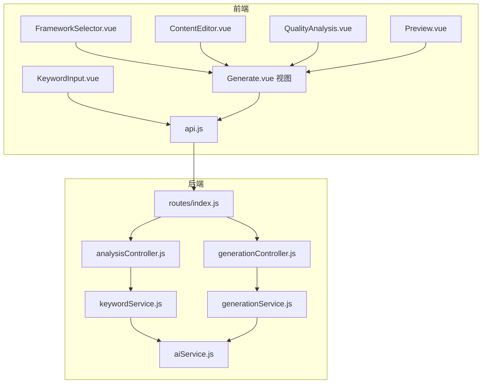
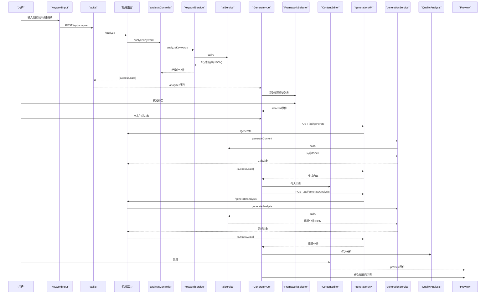
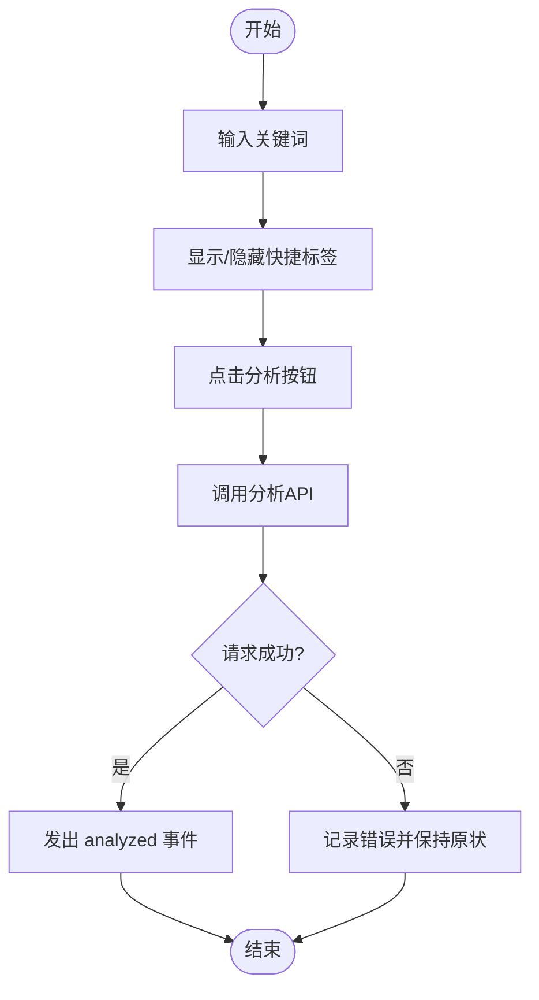
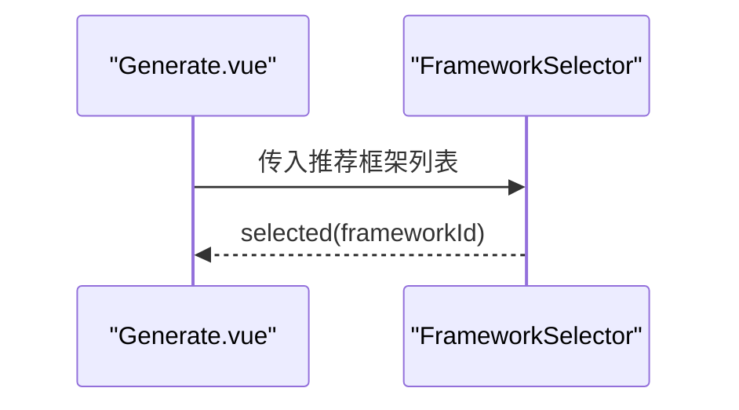
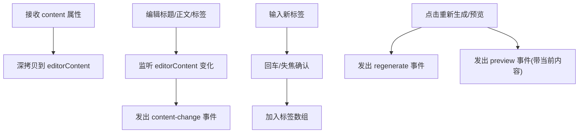
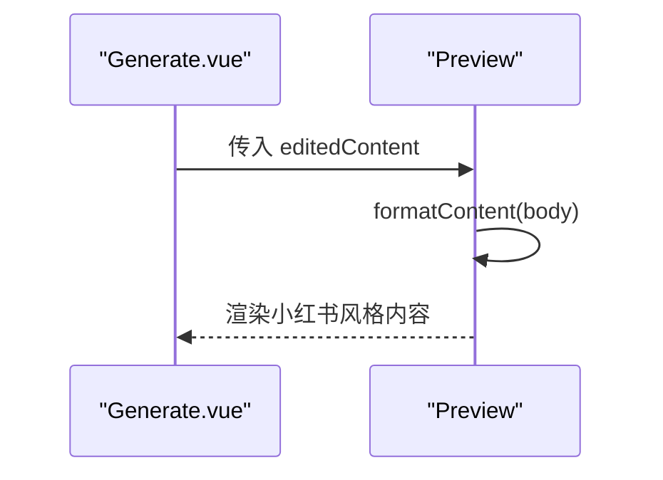
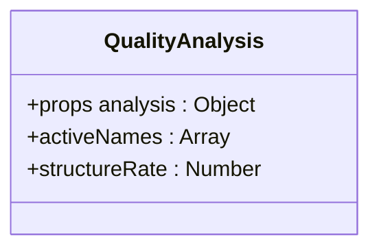
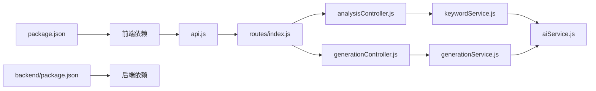

# 业务功能组件

<cite>
**本文引用的文件列表**
- [frontend/src/components/ContentEditor.vue](file://frontend/src/components/ContentEditor.vue)
- [frontend/src/components/KeywordInput.vue](file://frontend/src/components/KeywordInput.vue)
- [frontend/src/components/FrameworkSelector.vue](file://frontend/src/components/FrameworkSelector.vue)
- [frontend/src/components/Preview.vue](file://frontend/src/components/Preview.vue)
- [frontend/src/components/QualityAnalysis.vue](file://frontend/src/components/QualityAnalysis.vue)
- [frontend/src/views/Generate.vue](file://frontend/src/views/Generate.vue)
- [frontend/src/services/api.js](file://frontend/src/services/api.js)
- [backend/src/services/aiService.js](file://backend/src/services/aiService.js)
- [backend/src/services/keywordService.js](file://backend/src/services/keywordService.js)
- [backend/src/services/generationService.js](file://backend/src/services/generationService.js)
- [backend/src/controllers/analysisController.js](file://backend/src/controllers/analysisController.js)
- [backend/src/routes/index.js](file://backend/src/routes/index.js)
- [package.json](file://package.json)
- [backend/package.json](file://backend/package.json)
</cite>

## 目录
1. [简介](#简介)
2. [项目结构](#项目结构)
3. [核心组件](#核心组件)
4. [架构总览](#架构总览)
5. [组件详细分析](#组件详细分析)
6. [依赖关系分析](#依赖关系分析)
7. [性能与可扩展性](#性能与可扩展性)
8. [故障排查指南](#故障排查指南)
9. [结论](#结论)
10. [附录](#附录)

## 简介
本文件面向“小红书文案图文生成工具”的前端业务功能组件，系统化梳理内容编辑器、关键词输入、框架选择器、实时预览与质量分析五大核心组件的设计与实现，重点阐述：
- 组件职责与数据流
- 用户交互模式与事件传递
- 组件间通信机制（父子通信、事件冒泡、状态同步）
- 数据绑定策略（单向/双向、响应式更新）
- 组件集成示例与扩展指南（自定义组件与第三方组件集成）

## 项目结构
项目采用前后端分离架构，前端基于 Vue 3 Composition API，后端基于 Express，通过统一的 API 前缀进行通信。核心业务流程为：关键词输入 -> 框架推荐 -> 内容生成 -> 质量分析 -> 编辑与预览。

图表来源
- [frontend/src/views/Generate.vue](file://frontend/src/views/Generate.vue#L10-L54)
- [frontend/src/services/api.js](file://frontend/src/services/api.js#L13-L35)
- [backend/src/routes/index.js](file://backend/src/routes/index.js#L9-L16)
- [backend/src/controllers/analysisController.js](file://backend/src/controllers/analysisController.js#L6-L30)
- [backend/src/services/keywordService.js](file://backend/src/services/keywordService.js#L39-L84)
- [backend/src/services/generationService.js](file://backend/src/services/generationService.js#L63-L193)
- [backend/src/services/aiService.js](file://backend/src/services/aiService.js#L14-L53)

章节来源
- [package.json](file://package.json#L1-L32)
- [backend/package.json](file://backend/package.json#L1-L17)

## 核心组件
- 关键词输入组件：负责接收用户输入的关键词，提供快捷标签与分析触发，输出分析结果供上层决策。
- 框架选择器组件：接收后端分析推荐的框架列表，允许用户选择最优框架。
- 内容编辑器组件：承载标题、正文、话题标签与图片建议的编辑，支持重新生成与预览触发。
- 实时预览组件：在手机/桌面两种模式下渲染小红书风格内容，模拟真实发布效果。
- 质量分析组件：以折叠面板形式呈现钩子分析、框架原理、内容结构与吸引力评估等维度。

章节来源
- [frontend/src/components/KeywordInput.vue](file://frontend/src/components/KeywordInput.vue#L7-L42)
- [frontend/src/components/FrameworkSelector.vue](file://frontend/src/components/FrameworkSelector.vue#L8-L39)
- [frontend/src/components/ContentEditor.vue](file://frontend/src/components/ContentEditor.vue#L11-L77)
- [frontend/src/components/Preview.vue](file://frontend/src/components/Preview.vue#L37-L97)
- [frontend/src/components/QualityAnalysis.vue](file://frontend/src/components/QualityAnalysis.vue#L13-L128)

## 架构总览
前端通过 api.js 统一封装 HTTP 请求，分别对接后端的分析、生成与分析生成接口；后端控制器调用对应服务，服务层封装 AI 调用与提示词工程，最终返回结构化的数据。

图表来源
- [frontend/src/services/api.js](file://frontend/src/services/api.js#L22-L35)
- [backend/src/routes/index.js](file://backend/src/routes/index.js#L13-L16)
- [backend/src/controllers/analysisController.js](file://backend/src/controllers/analysisController.js#L6-L30)
- [backend/src/services/keywordService.js](file://backend/src/services/keywordService.js#L39-L84)
- [backend/src/services/generationService.js](file://backend/src/services/generationService.js#L63-L193)
- [backend/src/services/aiService.js](file://backend/src/services/aiService.js#L14-L53)
- [frontend/src/views/Generate.vue](file://frontend/src/views/Generate.vue#L75-L154)
- [frontend/src/components/ContentEditor.vue](file://frontend/src/components/ContentEditor.vue#L130-L132)

## 组件详细分析

### 关键词输入组件（KeywordInput）
- 功能职责
  - 接收用户输入的关键词（支持逗号/空格分隔），提供热门标签一键添加。
  - 调用分析接口，将分析结果通过事件向上抛出，供父组件处理。
- 数据绑定策略
  - 单向数据流：父组件通过属性接收分析结果；组件内部通过本地响应式状态管理输入与加载态。
  - 双向绑定：关键词输入框使用 v-model 双向绑定，配合输入事件控制快捷标签显示。
- 事件与状态
  - 事件：analyzed（分析完成，携带 keywords 与 analysis）。
  - 状态：analyzing 控制按钮加载态；hotKeywords 为静态推荐列表。
- 用户交互
  - 快捷标签点击追加到输入框；分析按钮触发异步请求；输入框变化隐藏快捷标签。

图表来源
- [frontend/src/components/KeywordInput.vue](file://frontend/src/components/KeywordInput.vue#L81-L102)

章节来源
- [frontend/src/components/KeywordInput.vue](file://frontend/src/components/KeywordInput.vue#L7-L42)
- [frontend/src/components/KeywordInput.vue](file://frontend/src/components/KeywordInput.vue#L45-L102)

### 框架选择器组件（FrameworkSelector）
- 功能职责
  - 接收推荐框架数组，渲染为单选卡片列表，支持匹配度展示。
- 数据绑定策略
  - 单向数据流：frameworks 由父组件传入；内部使用 v-model 绑定选中项。
  - 响应式更新：监听选中值变化，通过 selected 事件通知父组件。
- 用户交互
  - 点击任一框架卡片即完成选择；选中项变更时立即触发事件。

图表来源
- [frontend/src/components/FrameworkSelector.vue](file://frontend/src/components/FrameworkSelector.vue#L56-L60)
- [frontend/src/views/Generate.vue](file://frontend/src/views/Generate.vue#L14-L18)

章节来源
- [frontend/src/components/FrameworkSelector.vue](file://frontend/src/components/FrameworkSelector.vue#L8-L39)
- [frontend/src/components/FrameworkSelector.vue](file://frontend/src/components/FrameworkSelector.vue#L42-L61)

### 内容编辑器组件（ContentEditor）
- 功能职责
  - 编辑标题、正文、话题标签；展示图片建议；支持重新生成与预览。
- 数据绑定策略
  - 单向数据流：content 由父组件传入；内部使用响应式对象 editorContent 存储编辑态副本。
  - 双向绑定：表单项通过 v-model 与 editorContent 同步；标签输入通过临时输入框与状态切换。
  - 响应式更新：深度监听 editorContent，通过 content-change 事件向父组件同步变更。
- 事件与状态
  - 事件：regenerate、preview、content-change。
  - 状态：inputVisible/inputValue 控制新增标签输入；InputRef 用于聚焦。
- 用户交互
  - 添加/删除标签；回车或失焦确认；点击预览触发 preview 事件；点击重新生成触发 regenerate 事件。

图表来源
- [frontend/src/components/ContentEditor.vue](file://frontend/src/components/ContentEditor.vue#L97-L105)
- [frontend/src/components/ContentEditor.vue](file://frontend/src/components/ContentEditor.vue#L118-L132)

章节来源
- [frontend/src/components/ContentEditor.vue](file://frontend/src/components/ContentEditor.vue#L11-L77)
- [frontend/src/components/ContentEditor.vue](file://frontend/src/components/ContentEditor.vue#L80-L133)

### 实时预览组件（Preview）
- 功能职责
  - 在手机/桌面两种模式下渲染小红书风格内容，模拟真实发布页。
- 数据绑定策略
  - 单向数据流：content 由父组件传入；内部格式化函数 formatContent 处理正文换行与特殊标记。
  - 响应式更新：props 改变时自动刷新预览。
- 用户交互
  - 切换预览模式（手机/桌面）；随机点赞/评论/收藏数用于模拟。
- 渲染细节
  - 使用 v-html 输出正文，确保段落与特殊标记正确渲染。

图表来源
- [frontend/src/components/Preview.vue](file://frontend/src/components/Preview.vue#L112-L127)
- [frontend/src/views/Generate.vue](file://frontend/src/views/Generate.vue#L141-L147)

章节来源
- [frontend/src/components/Preview.vue](file://frontend/src/components/Preview.vue#L37-L97)
- [frontend/src/components/Preview.vue](file://frontend/src/components/Preview.vue#L100-L128)

### 质量分析组件（QualityAnalysis）
- 功能职责
  - 折叠面板展示钩子分析、框架原理、内容结构与吸引力评估。
- 数据绑定策略
  - 单向数据流：analysis 由父组件传入；内部使用 activeNames 控制展开项。
- 用户交互
  - 折叠面板逐项展开查看；结构评分使用只读评分控件。

图表来源
- [frontend/src/components/QualityAnalysis.vue](file://frontend/src/components/QualityAnalysis.vue#L135-L144)

章节来源
- [frontend/src/components/QualityAnalysis.vue](file://frontend/src/components/QualityAnalysis.vue#L13-L128)

## 依赖关系分析
- 前端依赖
  - Vue 3、Element Plus、Axios、Vue Router 等。
- 后端依赖
  - Express、CORS、Axios、dotenv 等。
- 组件间耦合
  - Generate.vue 作为编排者，聚合 KeywordInput、FrameworkSelector、ContentEditor、QualityAnalysis、Preview 的状态与事件。
  - api.js 作为统一 HTTP 客户端，避免各组件直接耦合后端路径。
- 外部依赖
  - AI 服务通过 aiService.js 统一封装，便于替换与限流。

图表来源
- [package.json](file://package.json#L15-L26)
- [backend/package.json](file://backend/package.json#L10-L15)
- [frontend/src/services/api.js](file://frontend/src/services/api.js#L8-L11)
- [backend/src/routes/index.js](file://backend/src/routes/index.js#L9-L16)
- [backend/src/services/aiService.js](file://backend/src/services/aiService.js#L14-L53)

章节来源
- [package.json](file://package.json#L1-L32)
- [backend/package.json](file://backend/package.json#L1-L17)

## 性能与可扩展性
- 性能特性
  - 组件内使用响应式状态与浅拷贝/深拷贝策略，避免不必要的重渲染。
  - 预览组件仅在 content 变更时刷新，减少 DOM 更新。
  - 质量分析组件使用折叠面板，按需渲染，降低初始开销。
- 可扩展性
  - 新增组件建议遵循单向数据流与事件驱动模式，保持与 Generate.vue 的松耦合。
  - API 层抽象清晰，便于替换后端服务或接入新的分析/生成能力。
  - AI 服务封装独立，便于替换不同模型或接入本地推理。

[本节为通用指导，无需列出具体文件来源]

## 故障排查指南
- 关键词分析失败
  - 现象：分析按钮无响应或报错。
  - 排查：检查网络请求是否到达 /api/analyze；查看后端日志；确认 AI 服务可用性。
  - 参考
    - [frontend/src/services/api.js](file://frontend/src/services/api.js#L22-L26)
    - [backend/src/controllers/analysisController.js](file://backend/src/controllers/analysisController.js#L6-L30)
    - [backend/src/services/aiService.js](file://backend/src/services/aiService.js#L45-L52)
- 内容生成失败
  - 现象：生成按钮点击无效或报错。
  - 排查：确认已选择框架；检查 /api/generate 返回；查看 AI 返回是否为合法 JSON。
  - 参考
    - [frontend/src/views/Generate.vue](file://frontend/src/views/Generate.vue#L88-L116)
    - [backend/src/services/generationService.js](file://backend/src/services/generationService.js#L63-L94)
- 预览空白或样式异常
  - 现象：预览区域无内容或布局错乱。
  - 排查：确认传入 content 是否包含必要字段；检查 formatContent 的正则与 v-html 使用。
  - 参考
    - [frontend/src/components/Preview.vue](file://frontend/src/components/Preview.vue#L112-L127)
- 质量分析未显示
  - 现象：分析面板不出现。
  - 排查：确认已调用 generateAnalysis 并返回 success；检查 analysis prop 是否传入。
  - 参考
    - [frontend/src/views/Generate.vue](file://frontend/src/views/Generate.vue#L118-L135)
    - [frontend/src/components/QualityAnalysis.vue](file://frontend/src/components/QualityAnalysis.vue#L135-L144)

章节来源
- [frontend/src/services/api.js](file://frontend/src/services/api.js#L22-L35)
- [backend/src/controllers/analysisController.js](file://backend/src/controllers/analysisController.js#L6-L30)
- [backend/src/services/generationService.js](file://backend/src/services/generationService.js#L63-L193)
- [frontend/src/components/Preview.vue](file://frontend/src/components/Preview.vue#L112-L127)
- [frontend/src/views/Generate.vue](file://frontend/src/views/Generate.vue#L118-L135)

## 结论
本项目通过清晰的组件边界与事件驱动的通信机制，实现了从关键词分析到内容生成、质量分析与实时预览的完整闭环。前端组件遵循单向数据流与响应式更新原则，后端服务通过提示词工程与 AI 能力提供结构化输出，整体具备良好的可维护性与扩展性。

[本节为总结性内容，无需列出具体文件来源]

## 附录

### 组件通信与数据流一览
- KeywordInput.analyzed → Generate.handleAnalyzed
- FrameworkSelector.selected → Generate.handleFrameworkSelected
- ContentEditor.regenerate → Generate.handleRegenerate
- ContentEditor.preview → Generate.handlePreview
- ContentEditor.content-change → Generate.handleContentChange
- Generate 通过 generationAPI/generationAPI 调用后端生成与分析接口

章节来源
- [frontend/src/views/Generate.vue](file://frontend/src/views/Generate.vue#L75-L154)
- [frontend/src/components/ContentEditor.vue](file://frontend/src/components/ContentEditor.vue#L90-L132)
- [frontend/src/components/FrameworkSelector.vue](file://frontend/src/components/FrameworkSelector.vue#L52-L60)
- [frontend/src/components/KeywordInput.vue](file://frontend/src/components/KeywordInput.vue#L50-L102)

### 组件集成示例与扩展指南
- 自定义组件开发
  - 建议：使用 Composition API + defineProps/defineEmits；保持单向数据流；通过事件向上反馈。
  - 示例：新增“图片建议”组件时，可复用 ContentEditor 中的标签/输入模式。
- 第三方组件集成
  - 图表/可视化：可在 QualityAnalysis 中引入图表库，按需渲染评分与指标。
  - 富文本编辑器：可替换 ContentEditor 的正文输入为富文本组件，但需保证输出结构与后端期望一致。
- 后端扩展
  - 新增分析维度：在 keywordService/generationService 中扩展提示词与解析逻辑；在前端组件中新增对应展示面板。

[本节为通用指导，无需列出具体文件来源]