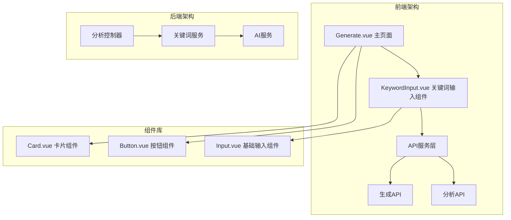
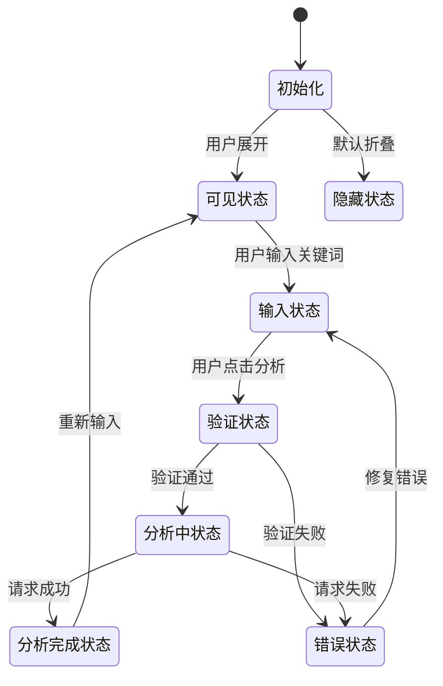
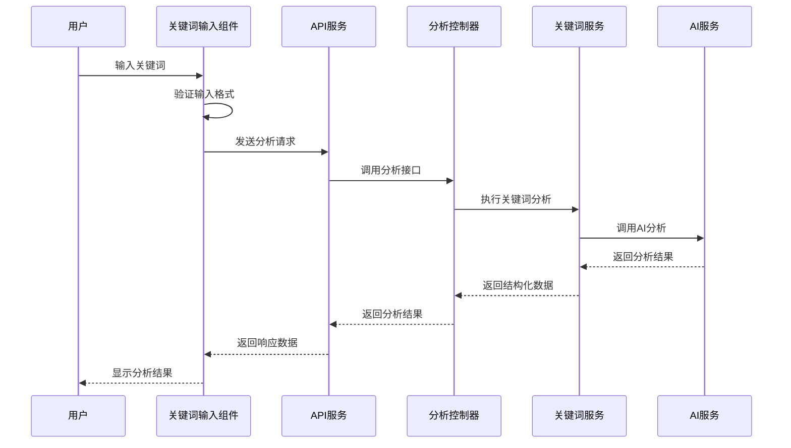
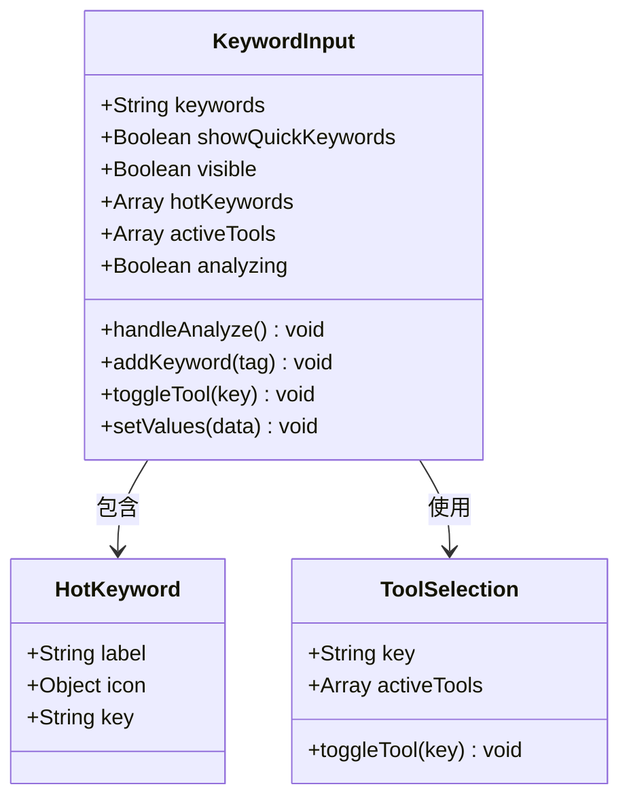
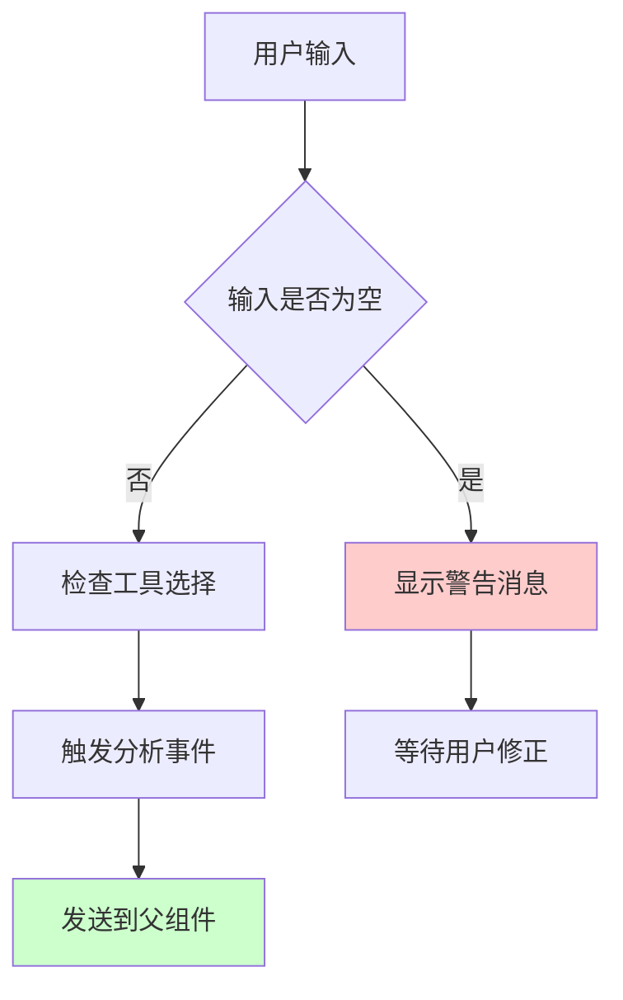
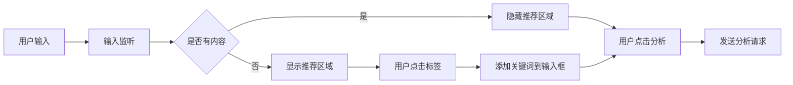
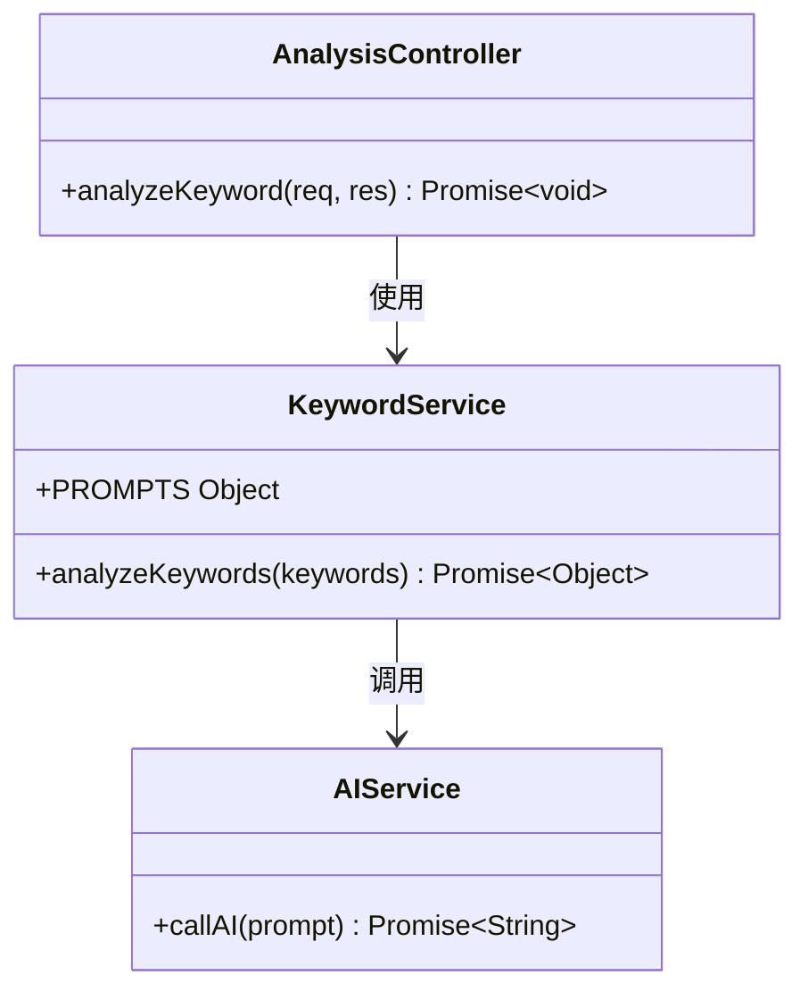
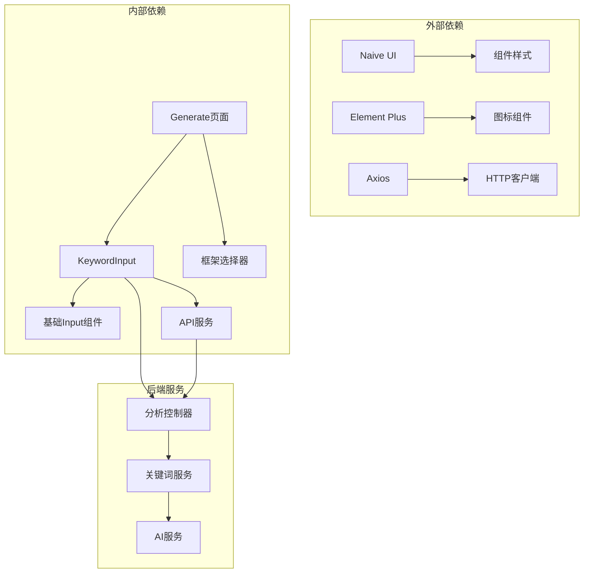
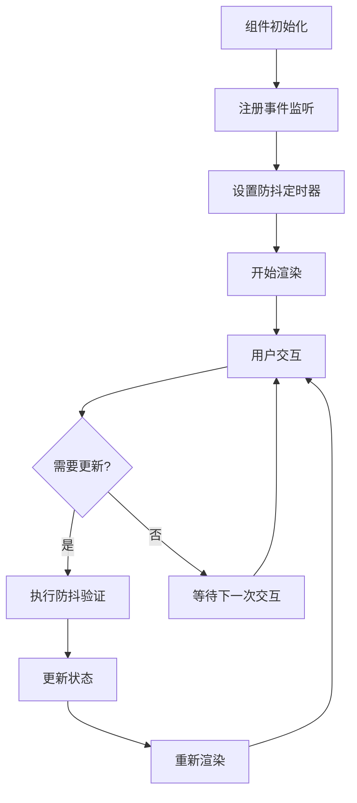
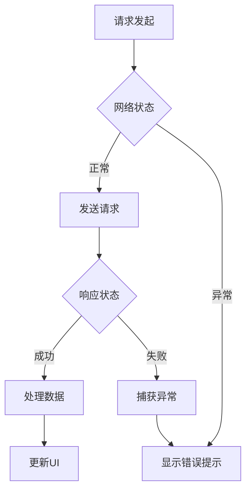

# 关键词输入组件

<cite>
**本文档引用的文件**
- [KeywordInput.vue](file://src/components/KeywordInput.vue)
- [KeywordInput.vue](file://frontend/src/components/KeywordInput.vue)
- [Generate.vue](file://frontend/src/views/Generate.vue)
- [keywordService.js](file://backend/src/services/keywordService.js)
- [analysisController.js](file://backend/src/controllers/analysisController.js)
- [api.js](file://frontend/src/services/api.js)
- [Input.vue](file://src/components/ui/Input.vue)
- [index.js](file://src/components/ui/index.js)
</cite>

## 目录
1. [简介](#简介)
2. [项目结构](#项目结构)
3. [核心组件](#核心组件)
4. [架构概览](#架构概览)
5. [详细组件分析](#详细组件分析)
6. [依赖关系分析](#依赖关系分析)
7. [性能考虑](#性能考虑)
8. [故障排除指南](#故障排除指南)
9. [结论](#结论)

## 简介

关键词输入组件是小红书内容创作工具中的核心组件之一，负责接收用户输入的关键词，提供智能推荐功能，并触发内容分析流程。该组件采用现代化的Vue 3 Composition API设计，集成了多种交互模式和用户体验优化功能。

组件支持两种主要模式：
- **Naive UI版本**：提供圆角胶囊式输入界面，包含工具选择器
- **Element Plus版本**：提供卡片式布局，包含热门关键词推荐

## 项目结构

该项目采用前后端分离架构，关键词输入组件位于前端部分，与后端AI分析服务紧密集成。

**图表来源**
- [Generate.vue](file://frontend/src/views/Generate.vue#L10-L18)
- [KeywordInput.vue](file://src/components/KeywordInput.vue#L12-L76)
- [api.js](file://frontend/src/services/api.js#L22-L35)

**章节来源**
- [Generate.vue](file://frontend/src/views/Generate.vue#L10-L18)
- [KeywordInput.vue](file://src/components/KeywordInput.vue#L12-L76)

## 核心组件

### 组件特性概述

关键词输入组件具备以下核心特性：

1. **多模式输入支持**：支持单关键词和多关键词输入
2. **智能推荐系统**：提供热门关键词快速添加功能
3. **实时验证机制**：输入时自动验证关键词格式
4. **工具集成**：可选的AI工具集成（搜索、爬虫、监控等）
5. **响应式设计**：适配不同屏幕尺寸的设备

### 组件状态管理

组件使用Vue 3的响应式系统管理状态：

**图表来源**
- [KeywordInput.vue](file://src/components/KeywordInput.vue#L105-L146)

**章节来源**
- [KeywordInput.vue](file://src/components/KeywordInput.vue#L78-L151)

## 架构概览

关键词输入组件在整个应用架构中扮演着关键角色，连接用户界面与AI分析服务。

**图表来源**
- [Generate.vue](file://frontend/src/views/Generate.vue#L75-L82)
- [api.js](file://frontend/src/services/api.js#L22-L25)
- [analysisController.js](file://backend/src/controllers/analysisController.js#L6-L30)
- [keywordService.js](file://backend/src/services/keywordService.js#L39-L67)

## 详细组件分析

### Naive UI版本组件分析

#### 组件结构设计

Naive UI版本的关键词输入组件采用了现代化的胶囊式设计：

**图表来源**
- [KeywordInput.vue](file://src/components/KeywordInput.vue#L95-L150)

#### 交互逻辑实现

组件实现了完整的用户交互流程：

1. **输入处理**：实时监听用户输入，提供智能推荐
2. **工具选择**：支持多工具组合选择
3. **分析触发**：一键触发AI分析流程
4. **状态反馈**：提供加载状态和错误提示

#### 关键验证机制

**图表来源**
- [KeywordInput.vue](file://src/components/KeywordInput.vue#L132-L142)

**章节来源**
- [KeywordInput.vue](file://src/components/KeywordInput.vue#L127-L150)

### Element Plus版本组件分析

#### 组件功能对比

Element Plus版本提供了不同的用户体验：

- **布局设计**：采用卡片式布局，更加传统
- **推荐系统**：提供热门关键词标签推荐
- **交互方式**：支持标签点击快速添加

#### 数据处理流程

**图表来源**
- [KeywordInput.vue](file://frontend/src/components/KeywordInput.vue#L67-L79)

**章节来源**
- [KeywordInput.vue](file://frontend/src/components/KeywordInput.vue#L45-L102)

### 后端服务集成

#### AI分析服务

后端提供了强大的AI分析能力：

**图表来源**
- [keywordService.js](file://backend/src/services/keywordService.js#L39-L84)
- [analysisController.js](file://backend/src/controllers/analysisController.js#L6-L30)

#### 关键词分析算法

后端服务采用多步骤分析流程：

1. **意图识别**：分析用户输入的创作意图
2. **主题提取**：确定内容的核心主题
3. **受众分析**：识别目标受众特征
4. **框架推荐**：基于分析结果推荐合适的写作框架

**章节来源**
- [keywordService.js](file://backend/src/services/keywordService.js#L4-L37)

## 依赖关系分析

### 组件依赖图

**图表来源**
- [KeywordInput.vue](file://src/components/KeywordInput.vue#L79-L93)
- [Generate.vue](file://frontend/src/views/Generate.vue#L60-L64)

### 组件耦合度分析

组件设计遵循低耦合高内聚原则：

- **输入组件**：专注于关键词输入和验证
- **API服务**：封装所有网络请求逻辑
- **业务逻辑**：在控制器和服务层集中处理
- **UI组件**：保持纯粹的展示职责

**章节来源**
- [Input.vue](file://src/components/ui/Input.vue#L122-L131)
- [index.js](file://src/components/ui/index.js#L11-L21)

## 性能考虑

### 优化策略

1. **懒加载机制**：推荐区域采用条件渲染，减少初始渲染负担
2. **防抖处理**：输入验证采用防抖技术，避免频繁验证
3. **内存管理**：及时清理事件监听器和定时器
4. **缓存策略**：热门关键词数据本地缓存

### 性能监控

**图表来源**
- [KeywordInput.vue](file://src/components/KeywordInput.vue#L132-L142)

## 故障排除指南

### 常见问题及解决方案

#### 输入验证问题

| 问题类型 | 症状 | 解决方案 |
|---------|------|----------|
| 空输入 | 分析按钮无响应 | 添加输入验证逻辑 |
| 格式错误 | 关键词解析异常 | 实施正则表达式验证 |
| 重复输入 | 关键词列表混乱 | 实现去重和排序功能 |

#### 网络请求问题

**图表来源**
- [Generate.vue](file://frontend/src/views/Generate.vue#L88-L116)

#### 错误处理机制

组件实现了多层次的错误处理：

1. **前端验证**：输入格式和必填字段验证
2. **网络异常**：请求超时和服务器错误处理
3. **AI服务异常**：降级到默认分析结果
4. **用户反馈**：友好的错误提示和恢复机制

**章节来源**
- [Generate.vue](file://frontend/src/views/Generate.vue#L88-L116)
- [keywordService.js](file://backend/src/services/keywordService.js#L68-L84)

## 结论

关键词输入组件作为小红书内容创作工具的核心组件，展现了现代前端开发的最佳实践。组件设计充分考虑了用户体验、性能优化和可维护性。

### 主要优势

1. **用户体验优秀**：直观的输入界面和智能推荐功能
2. **技术架构清晰**：前后端分离，职责明确
3. **扩展性强**：模块化设计便于功能扩展
4. **稳定性高**：完善的错误处理和降级机制

### 改进建议

1. **国际化支持**：添加多语言支持
2. **无障碍访问**：提升键盘导航和屏幕阅读器支持
3. **性能监控**：集成性能指标收集
4. **测试覆盖**：增加单元测试和集成测试

该组件为类似的内容创作工具提供了优秀的参考实现，其设计理念和实现方式值得其他项目借鉴。