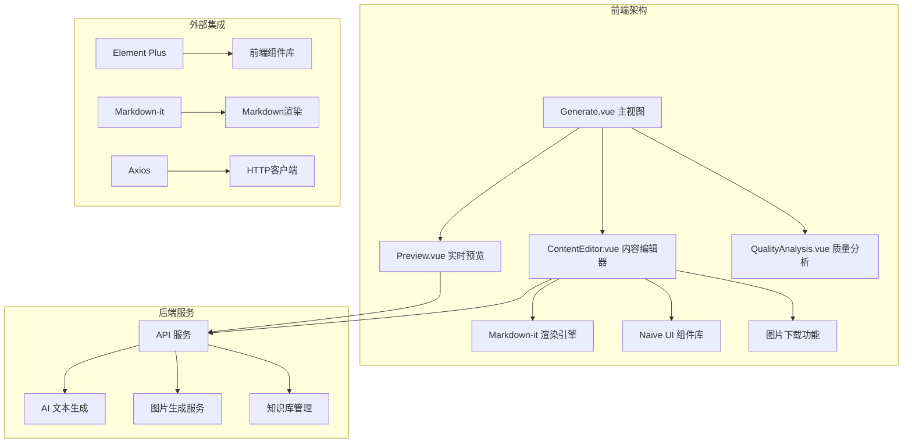
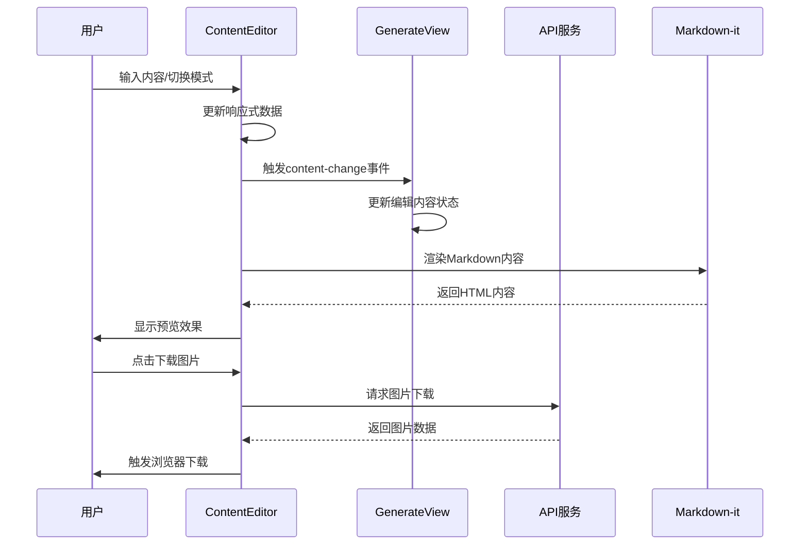
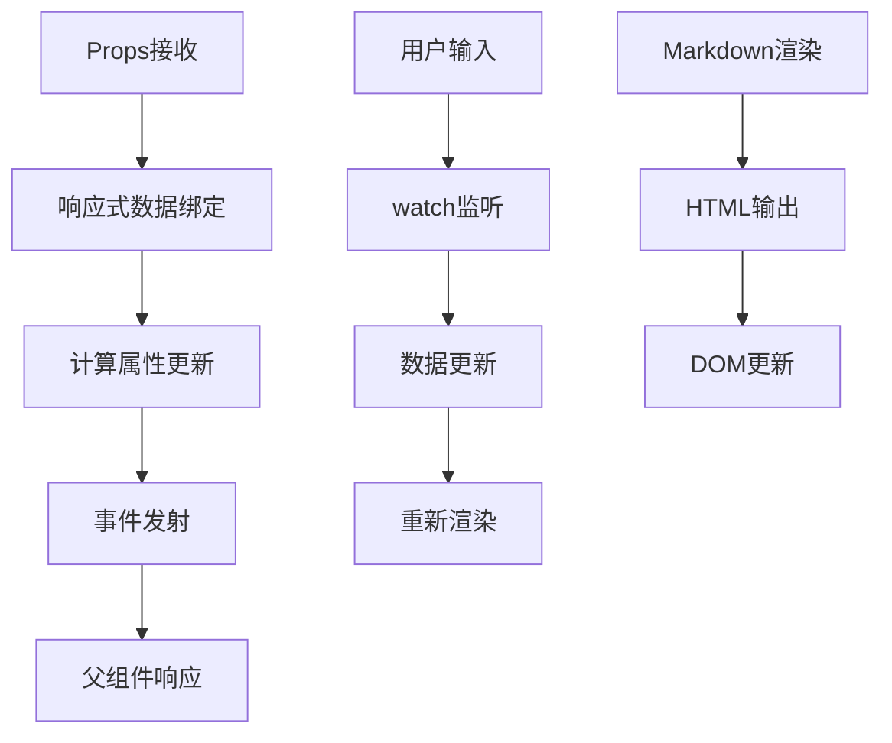
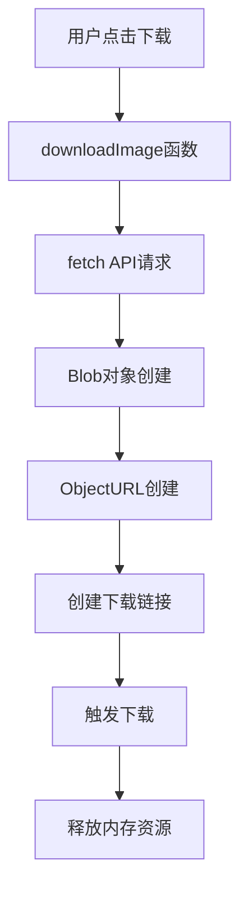
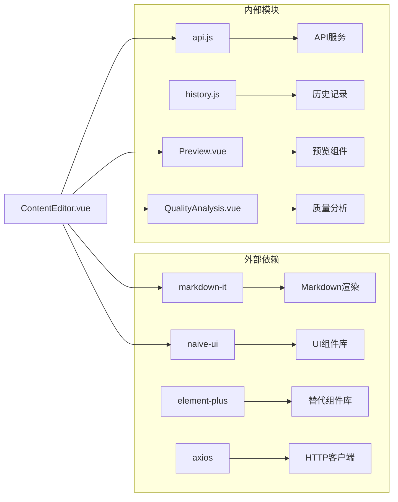

# 内容编辑器组件

<cite>
**本文档引用的文件**
- [ContentEditor.vue](file://src/components/ContentEditor.vue)
- [Generate.vue](file://src/views/Generate.vue)
- [api.js](file://src/services/api.js)
- [Preview.vue](file://src/components/Preview.vue)
- [QualityAnalysis.vue](file://src/components/QualityAnalysis.vue)
- [package.json](file://package.json)
- [history.js](file://src/services/history.js)
</cite>

## 目录
1. [简介](#简介)
2. [项目结构](#项目结构)
3. [核心组件](#核心组件)
4. [架构概览](#架构概览)
5. [详细组件分析](#详细组件分析)
6. [依赖关系分析](#依赖关系分析)
7. [性能考虑](#性能考虑)
8. [故障排除指南](#故障排除指南)
9. [结论](#结论)
10. [附录](#附录)

## 简介

内容编辑器组件是小红书爆款内容生成工具的核心组件之一，负责提供用户友好的内容编辑界面，支持原始文本模式和编辑模式的切换、Markdown渲染、图片生成展示、标签管理和内容操作功能。该组件集成了现代化的Vue 3 Composition API，使用Naive UI组件库构建，并通过Markdown-it库实现高效的Markdown渲染。

## 项目结构

该项目采用前后端分离的架构设计，前端使用Vue 3 + Vite构建，后端使用Node.js + Express提供API服务。内容编辑器组件位于前端项目的组件目录中，与生成视图、预览组件、质量分析组件协同工作。



**图表来源**
- [Generate.vue](file://src/views/Generate.vue#L1-L100)
- [ContentEditor.vue](file://src/components/ContentEditor.vue#L1-L50)

**章节来源**
- [Generate.vue](file://src/views/Generate.vue#L1-L100)
- [package.json](file://package.json#L15-L30)

## 核心组件

内容编辑器组件是整个内容生成系统的核心，它提供了完整的编辑体验，包括：

### 主要功能特性
- **双模式编辑**：支持原始文本模式和富文本编辑模式
- **Markdown渲染**：实时预览Markdown格式内容
- **图片生成展示**：集成AI生成的图片展示和下载功能
- **标签管理系统**：动态添加、删除话题标签
- **响应式更新**：双向数据绑定和事件通信
- **质量分析集成**：与质量分析组件无缝对接

### 技术架构
组件采用Vue 3 Composition API编写，使用响应式数据绑定和计算属性实现高效的状态管理。通过Naive UI组件库提供一致的用户体验，通过Markdown-it库实现专业的Markdown渲染。

**章节来源**
- [ContentEditor.vue](file://src/components/ContentEditor.vue#L1-L195)
- [ContentEditor.vue](file://src/components/ContentEditor.vue#L197-L316)

## 架构概览

内容编辑器组件在整个系统中扮演着关键角色，它不仅负责内容编辑，还承担着与其他组件协调的重要职责。



**图表来源**
- [ContentEditor.vue](file://src/components/ContentEditor.vue#L205-L227)
- [Generate.vue](file://src/views/Generate.vue#L372-L385)

**章节来源**
- [ContentEditor.vue](file://src/components/ContentEditor.vue#L197-L316)
- [Generate.vue](file://src/views/Generate.vue#L177-L427)

## 详细组件分析

### 数据绑定策略

内容编辑器组件采用了多层次的数据绑定策略，确保组件间的数据流转顺畅：

#### Props接收机制
组件通过props接收外部传入的内容数据，包括：
- `content`: 主要内容对象，包含标题、正文、标签等信息
- `images`: 图片数组，用于展示AI生成的配图
- `imageLoading`: 图片加载状态指示

#### 响应式更新机制
使用Vue 3的ref和reactive实现响应式数据管理：
- `editorContent`: 主要编辑状态
- `activeTab`: 当前激活的标签页
- `inputVisible`: 标签输入框显示状态
- `markdownHtml`: 计算属性，用于Markdown渲染

#### 事件通信机制
组件通过emit事件向父组件传递状态变化：
- `regenerate`: 触发重新生成内容
- `preview`: 请求预览效果
- `content-change`: 内容变更通知



**图表来源**
- [ContentEditor.vue](file://src/components/ContentEditor.vue#L245-L281)

**章节来源**
- [ContentEditor.vue](file://src/components/ContentEditor.vue#L245-L316)

### Markdown渲染功能

组件集成了Markdown-it库，提供专业的Markdown渲染能力：

#### Markdown-it配置
```javascript
const md = new MarkdownIt({
  html: true,
  linkify: true,
  typographer: true
})
```

#### 渲染流程
1. **输入验证**：检查editorContent.content是否存在
2. **内容转换**：使用md.render()将Markdown转换为HTML
3. **安全处理**：通过v-html直接插入DOM
4. **样式美化**：应用专门的CSS类名进行样式定制

#### 支持的Markdown特性
- 标题层级（h1-h3）
- 段落和换行
- 无序列表和有序列表
- 代码块高亮
- 引用块
- 链接识别

**章节来源**
- [ContentEditor.vue](file://src/components/ContentEditor.vue#L239-L271)

### 图片生成展示区域

组件提供了完整的图片生成展示功能：

#### 图片展示布局
使用Naive UI的网格系统实现响应式布局：
- 3列网格布局
- 12px间距的水平和垂直间距
- 260px高度的图片容器

#### 交互功能
- **悬停效果**：鼠标悬停显示下载按钮
- **图片覆盖层**：半透明遮罩层增强视觉效果
- **下载功能**：一键下载AI生成的图片

#### 图片下载实现原理


**图表来源**
- [ContentEditor.vue](file://src/components/ContentEditor.vue#L210-L227)

**章节来源**
- [ContentEditor.vue](file://src/components/ContentEditor.vue#L210-L227)

### 标签管理系统

组件实现了灵活的标签管理功能：

#### 标签添加流程
1. **显示输入框**：点击"添加标签"按钮
2. **输入验证**：检查输入内容是否为空
3. **自动添加**：支持回车键和失焦两种确认方式
4. **标签显示**：使用Naive UI的标签组件展示

#### 标签操作功能
- **动态添加**：运行时添加新的标签
- **删除功能**：支持关闭按钮删除标签
- **样式定制**：使用primary类型和medium尺寸

**章节来源**
- [ContentEditor.vue](file://src/components/ContentEditor.vue#L283-L303)

### 内容操作功能

组件提供了丰富的内容操作功能：

#### 重新生成功能
- 触发父组件的handleRegenerate方法
- 重新执行内容生成流程
- 保持当前关键词和特殊要求

#### 预览功能
- 触发父组件的handlePreview方法
- 切换到预览模式
- 在右侧侧边栏显示实时预览

#### 审批发布功能
- 打开审批发布模态框
- 配置发布时间和发布类型
- 支持立即发布和定时发布

**章节来源**
- [ContentEditor.vue](file://src/components/ContentEditor.vue#L305-L315)

## 依赖关系分析

内容编辑器组件依赖多个外部库和内部模块：



**图表来源**
- [package.json](file://package.json#L15-L30)
- [ContentEditor.vue](file://src/components/ContentEditor.vue#L198-L201)

**章节来源**
- [package.json](file://package.json#L15-L30)
- [ContentEditor.vue](file://src/components/ContentEditor.vue#L198-L201)

### 核心依赖说明

#### Markdown-it集成
- 版本：^14.1.0
- 功能：提供Markdown到HTML的转换能力
- 配置：启用HTML解析、链接识别、排版美化

#### Naive UI组件库
- 版本：^2.43.2
- 功能：提供现代化的Vue 3组件
- 使用：卡片、标签、按钮、表单等组件

#### Element Plus组件库
- 版本：^2.13.0
- 功能：提供Element UI的Vue 3版本
- 使用：替代版本中的编辑器组件

**章节来源**
- [package.json](file://package.json#L22-L24)

## 性能考虑

内容编辑器组件在设计时充分考虑了性能优化：

### 渲染优化
- **计算属性缓存**：markdownHtml使用computed确保只在依赖变化时重新计算
- **条件渲染**：图片生成区域只有在有图片或加载状态时才渲染
- **懒加载**：图片使用懒加载避免不必要的资源消耗

### 内存管理
- **资源释放**：下载完成后及时释放ObjectURL资源
- **事件清理**：组件销毁时自动清理事件监听器
- **状态重置**：重新生成时重置相关状态

### 网络优化
- **流式处理**：支持AI生成的流式响应处理
- **并发控制**：图片生成使用Promise.all并发处理
- **错误处理**：完善的错误捕获和降级处理

## 故障排除指南

### 常见问题及解决方案

#### Markdown渲染问题
**症状**：Markdown内容没有正确渲染
**原因**：可能的HTML注入或渲染配置问题
**解决方案**：
1. 检查Markdown-it配置选项
2. 验证输入内容的Markdown格式
3. 确认CSS样式未影响渲染效果

#### 图片下载失败
**症状**：点击下载按钮无响应或报错
**原因**：跨域问题或网络请求失败
**解决方案**：
1. 检查后端代理配置
2. 验证图片URL的有效性
3. 确认浏览器允许下载弹窗

#### 标签添加异常
**症状**：无法添加新标签或标签显示异常
**原因**：输入验证或事件处理问题
**解决方案**：
1. 检查输入框的焦点管理
2. 验证标签数组的数据结构
3. 确认事件监听器正常工作

**章节来源**
- [ContentEditor.vue](file://src/components/ContentEditor.vue#L223-L226)
- [Preview.vue](file://src/components/Preview.vue#L146-L166)

## 结论

内容编辑器组件是一个功能完整、架构清晰的Vue 3组件，它成功地整合了多种技术栈，为用户提供了一流的内容编辑体验。组件的设计体现了现代前端开发的最佳实践，包括：

- **模块化设计**：清晰的组件边界和职责分离
- **响应式架构**：基于Vue 3 Composition API的现代化开发模式
- **性能优化**：合理的渲染策略和资源管理
- **用户体验**：直观的操作界面和流畅的交互体验

通过集成Markdown-it、Naive UI等优秀库，组件不仅提供了强大的功能，还保证了良好的可维护性和扩展性。未来可以在以下方面进一步改进：
- 增加更多的Markdown语法支持
- 优化移动端的用户体验
- 扩展插件系统以支持更多功能

## 附录

### 组件使用示例

#### 基本使用
```vue
<template>
  <ContentEditor
    :content="contentData"
    :images="imageData"
    @regenerate="handleRegenerate"
    @preview="handlePreview"
    @content-change="handleContentChange"
  />
</template>
```

#### 自定义样式定制
```css
/* 修改编辑器主题色 */
.custom-editor :deep(.n-card) {
  border-color: #ff2442;
}

/* 自定义标签样式 */
.custom-editor :deep(.n-tag) {
  background-color: #f9f9f9;
  border-color: #e0e0e0;
}
```

#### 功能增强建议
1. **撤销重做功能**：添加内容变更的历史记录
2. **模板系统**：支持常用内容模板的快速应用
3. **协作功能**：支持多人同时编辑和评论
4. **导出功能**：支持多种格式的内容导出