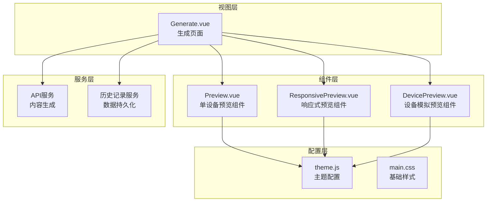
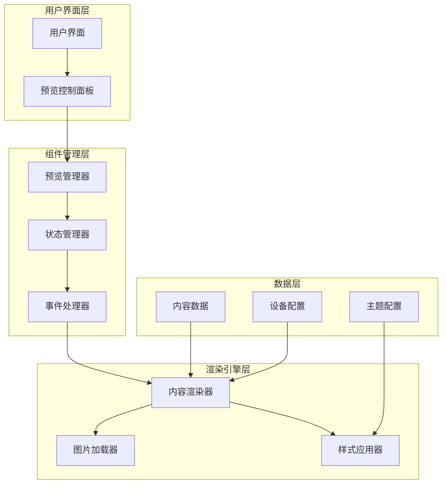
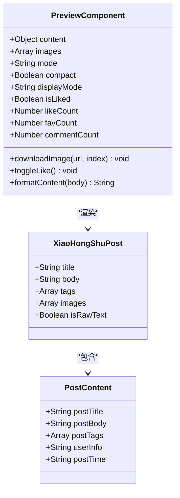
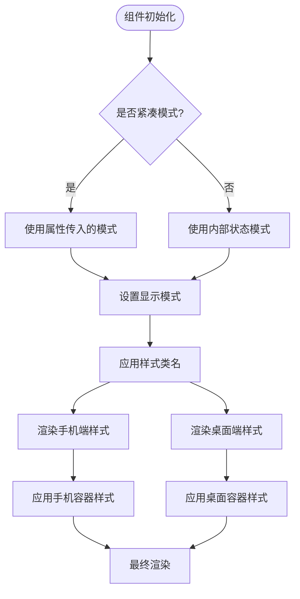
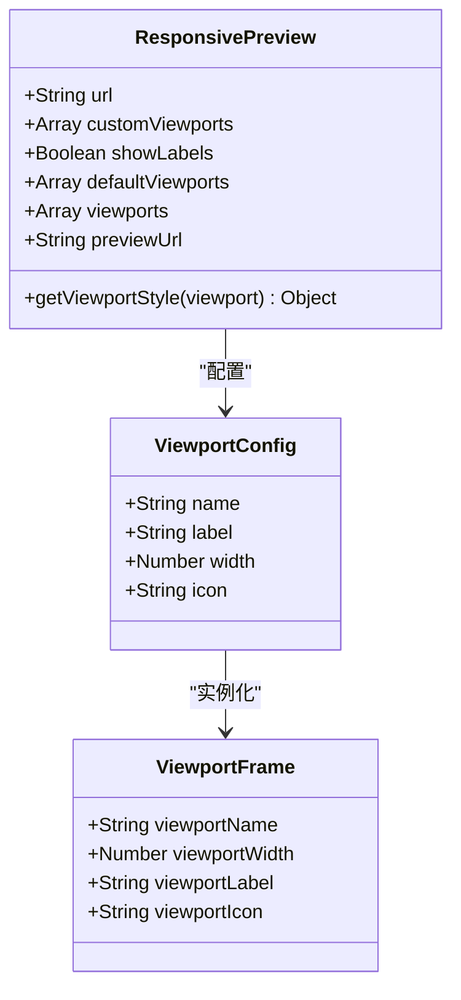
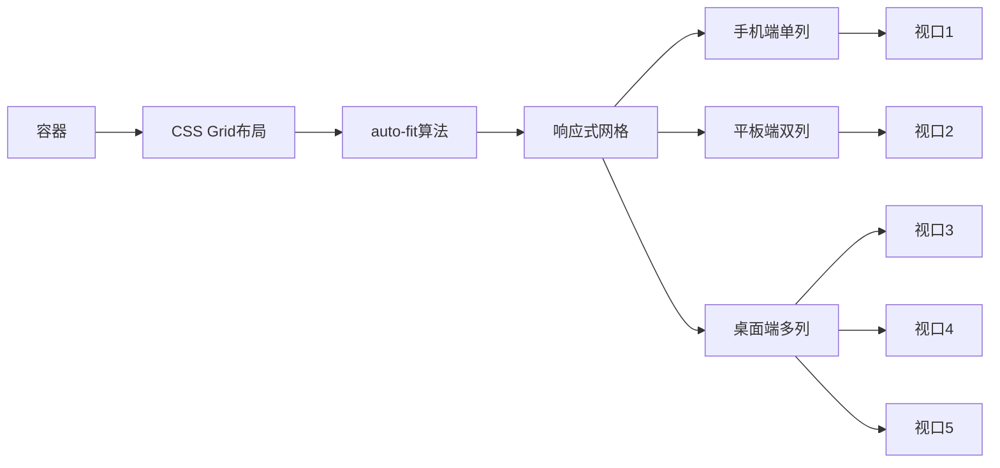
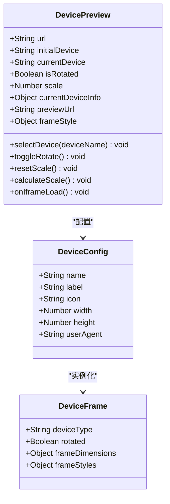
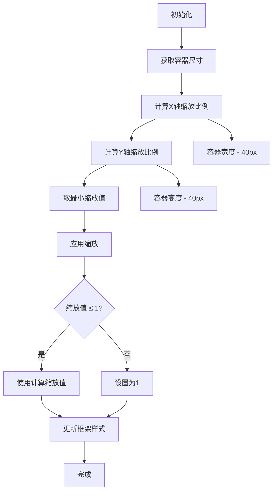
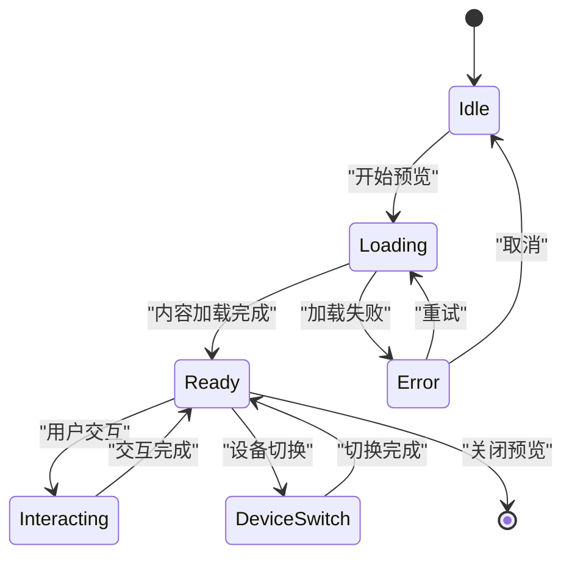
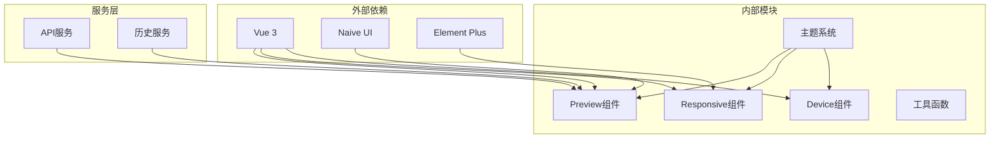

# 实时预览组件

<cite>
**本文档引用的文件**
- [Preview.vue](file://src/components/Preview.vue)
- [ResponsivePreview.vue](file://src/components/ResponsivePreview.vue)
- [DevicePreview.vue](file://src/components/DevicePreview.vue)
- [Generate.vue](file://src/views/Generate.vue)
- [theme.js](file://src/config/theme.js)
- [main.css](file://src/assets/main.css)
</cite>

## 目录
1. [简介](#简介)
2. [项目结构](#项目结构)
3. [核心组件](#核心组件)
4. [架构概览](#架构概览)
5. [详细组件分析](#详细组件分析)
6. [依赖关系分析](#依赖关系分析)
7. [性能考虑](#性能考虑)
8. [故障排除指南](#故障排除指南)
9. [结论](#结论)

## 简介

实时预览组件是小红书内容创作平台的核心功能模块，为用户提供多设备、多场景的内容预览能力。该组件系统包含三种主要预览模式：单设备预览、响应式预览和设备模拟预览，支持移动端和桌面端的实时内容展示。

组件设计遵循现代化前端架构原则，采用Vue 3 Composition API构建，结合CSS变量主题系统，实现了高度可定制化的预览体验。通过统一的接口设计，开发者可以轻松集成到各种内容创作工作流中。

## 项目结构

实时预览组件系统在项目中的组织结构如下：

**图表来源**
- [Preview.vue](file://src/components/Preview.vue#L1-L411)
- [ResponsivePreview.vue](file://src/components/ResponsivePreview.vue#L1-L216)
- [DevicePreview.vue](file://src/components/DevicePreview.vue#L1-L378)
- [Generate.vue](file://src/views/Generate.vue#L1-L668)

**章节来源**
- [Preview.vue](file://src/components/Preview.vue#L1-L50)
- [ResponsivePreview.vue](file://src/components/ResponsivePreview.vue#L1-L50)
- [DevicePreview.vue](file://src/components/DevicePreview.vue#L1-L80)

## 核心组件

实时预览组件系统由三个核心组件构成，每个组件都有其特定的使用场景和功能特点：

### 单设备预览组件 (Preview.vue)
这是最基础的预览组件，专门用于展示单个设备上的内容效果。支持手机端和桌面端两种模式，具有简洁的界面设计和高效的渲染性能。

### 响应式预览组件 (ResponsivePreview.vue)
该组件提供多设备同时预览功能，可以在同一界面中展示不同设备尺寸下的内容效果，便于开发者进行响应式设计验证。

### 设备模拟预览组件 (DevicePreview.vue)
这是最复杂的预览组件，提供真实的设备模拟体验，包括设备框架、旋转功能、缩放控制等高级特性。

**章节来源**
- [Preview.vue](file://src/components/Preview.vue#L21-L132)
- [ResponsivePreview.vue](file://src/components/ResponsivePreview.vue#L5-L45)
- [DevicePreview.vue](file://src/components/DevicePreview.vue#L4-L64)

## 架构概览

实时预览组件系统采用分层架构设计，确保了良好的可维护性和扩展性：

**图表来源**
- [Generate.vue](file://src/views/Generate.vue#L117-L142)
- [Preview.vue](file://src/components/Preview.vue#L134-L208)
- [DevicePreview.vue](file://src/components/DevicePreview.vue#L66-L214)

## 详细组件分析

### 单设备预览组件 (Preview.vue)

#### 组件结构分析

单设备预览组件采用了模块化的Vue单文件组件设计，包含模板、脚本和样式三个部分：

**图表来源**
- [Preview.vue](file://src/components/Preview.vue#L134-L208)

#### 渲染机制详解

组件的渲染机制基于Vue的响应式系统，实现了高效的DOM更新：

1. **内容格式化**：通过`formatContent`函数将原始文本转换为HTML格式
2. **图片处理**：支持动态图片加载和下载功能
3. **状态管理**：使用Vue响应式数据管理点赞状态和计数
4. **样式应用**：通过CSS类名动态切换不同设备模式

#### 多设备适配实现

组件支持两种主要的设备适配模式：

**图表来源**
- [Preview.vue](file://src/components/Preview.vue#L187-L188)
- [Preview.vue](file://src/components/Preview.vue#L220-L255)

**章节来源**
- [Preview.vue](file://src/components/Preview.vue#L134-L208)
- [Preview.vue](file://src/components/Preview.vue#L210-L405)

### 响应式预览组件 (ResponsivePreview.vue)

#### 视口管理系统

响应式预览组件提供了灵活的视口配置系统：

**图表来源**
- [ResponsivePreview.vue](file://src/components/ResponsivePreview.vue#L47-L87)

#### 响应式布局实现

组件采用CSS Grid布局实现响应式预览网格：

**图表来源**
- [ResponsivePreview.vue](file://src/components/ResponsivePreview.vue#L131-L136)
- [ResponsivePreview.vue](file://src/components/ResponsivePreview.vue#L202-L210)

**章节来源**
- [ResponsivePreview.vue](file://src/components/ResponsivePreview.vue#L47-L87)
- [ResponsivePreview.vue](file://src/components/ResponsivePreview.vue#L90-L211)

### 设备模拟预览组件 (DevicePreview.vue)

#### 设备配置系统

设备模拟预览组件提供了完整的设备配置和模拟功能：

**图表来源**
- [DevicePreview.vue](file://src/components/DevicePreview.vue#L66-L171)

#### 缩放和适配算法

组件实现了智能的缩放计算算法：

**图表来源**
- [DevicePreview.vue](file://src/components/DevicePreview.vue#L173-L186)

**章节来源**
- [DevicePreview.vue](file://src/components/DevicePreview.vue#L66-L214)

### 预览状态管理

实时预览组件系统实现了完整的状态管理机制：

**图表来源**
- [Generate.vue](file://src/views/Generate.vue#L117-L142)
- [Preview.vue](file://src/components/Preview.vue#L146-L166)

## 依赖关系分析

实时预览组件系统具有清晰的依赖关系结构：

**图表来源**
- [Generate.vue](file://src/views/Generate.vue#L195-L195)
- [theme.js](file://src/config/theme.js#L1-L274)

**章节来源**
- [Generate.vue](file://src/views/Generate.vue#L177-L195)
- [theme.js](file://src/config/theme.js#L1-L274)

## 性能考虑

实时预览组件系统在性能方面采用了多项优化策略：

### 渲染优化
- 使用Vue响应式系统避免不必要的DOM更新
- 采用虚拟滚动技术处理大量内容
- 实现懒加载机制减少初始渲染负担

### 内存管理
- 合理的组件生命周期管理
- 及时清理事件监听器和定时器
- 优化图片资源的内存使用

### 网络优化
- 图片预加载和缓存策略
- CDN加速和资源压缩
- 懒加载和按需加载机制

## 故障排除指南

### 常见问题及解决方案

#### 预览内容不显示
1. **检查内容数据格式**：确保传入的内容对象包含必要的字段
2. **验证图片URL有效性**：确认图片链接可访问且格式正确
3. **检查CSS样式冲突**：排查可能影响预览显示的样式规则

#### 设备适配问题
1. **确认设备配置正确**：检查设备参数设置是否合理
2. **验证视口尺寸**：确保视口宽度和高度符合预期
3. **检查缩放算法**：确认缩放计算逻辑正常执行

#### 性能问题
1. **监控内存使用**：定期检查组件的内存占用情况
2. **优化渲染频率**：避免频繁的状态更新触发大量重绘
3. **实施节流机制**：对高频操作实施防抖和节流处理

**章节来源**
- [Preview.vue](file://src/components/Preview.vue#L146-L166)
- [DevicePreview.vue](file://src/components/DevicePreview.vue#L194-L213)

## 结论

实时预览组件系统展现了现代前端开发的最佳实践，通过精心设计的架构和实现方案，为用户提供了丰富而高效的预览体验。组件系统不仅满足了当前的功能需求，还为未来的扩展和定制预留了充足的空间。

该系统的成功关键在于：
- 清晰的分层架构设计
- 高度模块化的组件结构
- 完善的主题和样式系统
- 优秀的性能优化策略
- 良好的错误处理机制

通过持续的优化和改进，实时预览组件系统将继续为内容创作者提供卓越的预览体验，助力高质量内容的创作和发布。