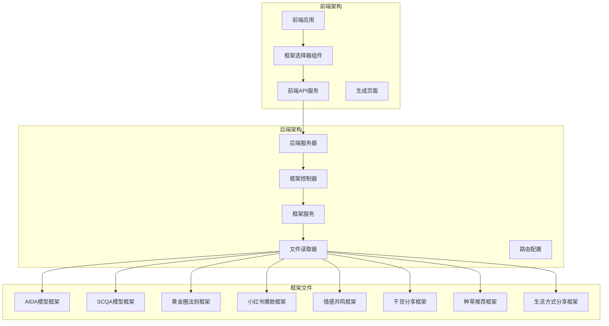
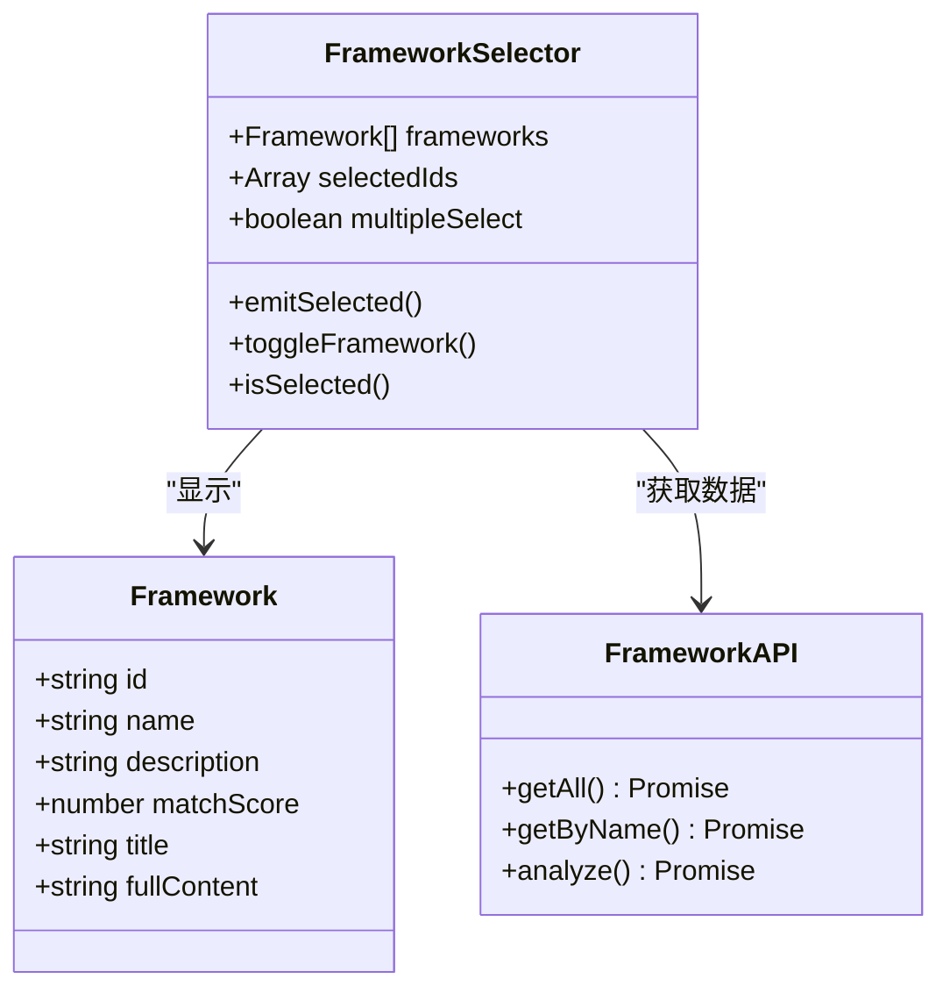
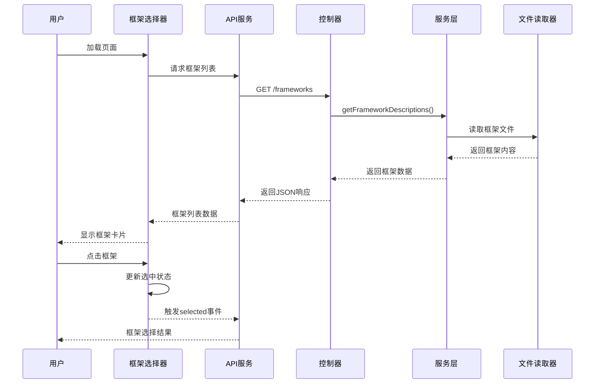
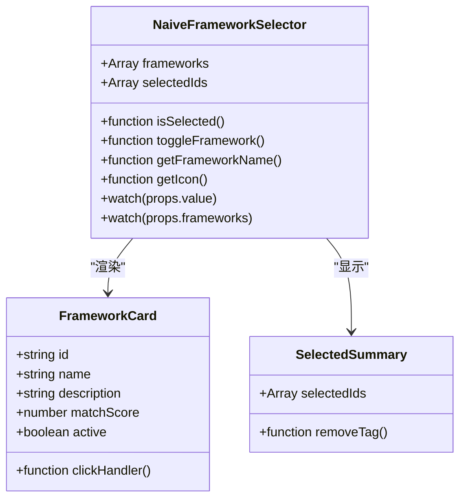
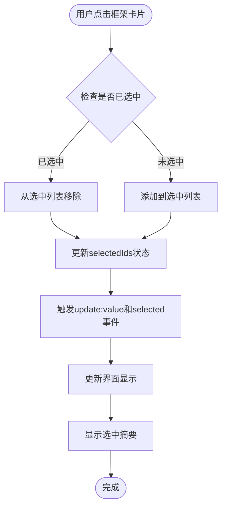
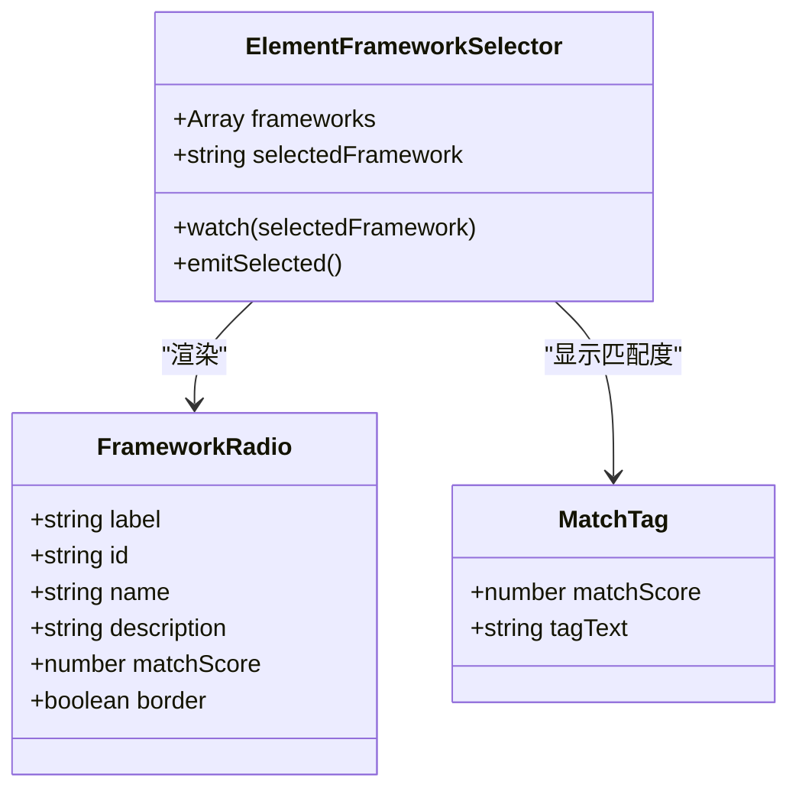
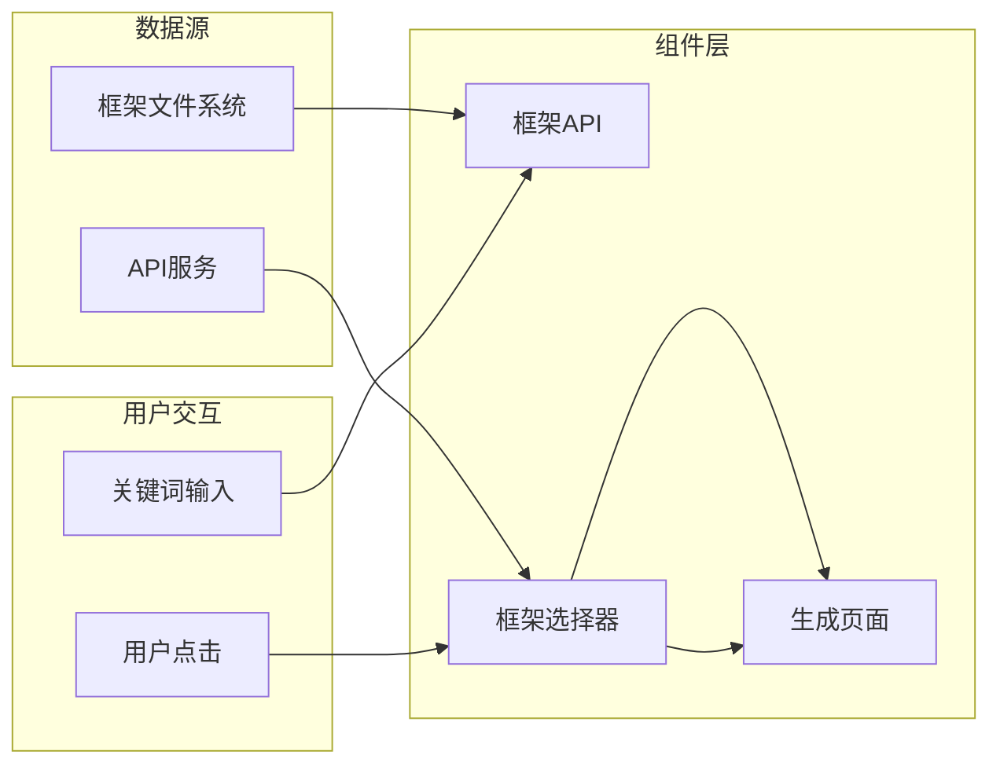
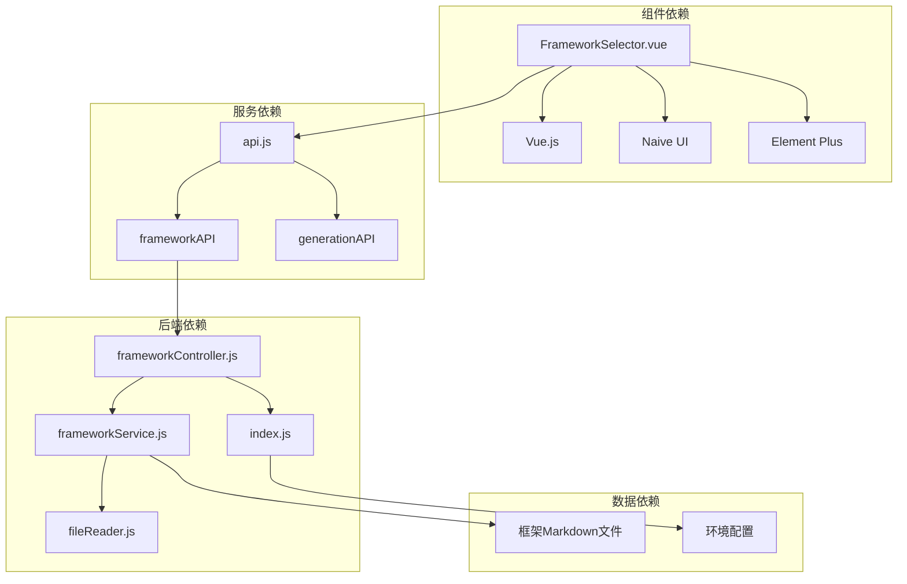

# 框架选择器组件

<cite>
**本文档引用的文件**
- [FrameworkSelector.vue](file://src/components/FrameworkSelector.vue)
- [FrameworkSelector.vue](file://frontend/src/components/FrameworkSelector.vue)
- [api.js](file://src/services/api.js)
- [api.js](file://frontend/src/services/api.js)
- [Generate.vue](file://src/views/Generate.vue)
- [Generate.vue](file://frontend/src/views/Generate.vue)
- [frameworkController.js](file://backend/src/controllers/frameworkController.js)
- [frameworkService.js](file://backend/src/services/frameworkService.js)
- [fileReader.js](file://backend/src/utils/fileReader.js)
- [index.js](file://backend/src/routes/index.js)
- [main.js](file://src/main.js)
- [main.js](file://frontend/src/main.js)
</cite>

## 目录
1. [简介](#简介)
2. [项目结构](#项目结构)
3. [核心组件](#核心组件)
4. [架构概览](#架构概览)
5. [详细组件分析](#详细组件分析)
6. [依赖关系分析](#依赖关系分析)
7. [性能考虑](#性能考虑)
8. [故障排除指南](#故障排除指南)
9. [结论](#结论)
10. [附录](#附录)

## 简介

框架选择器组件是小红书文案图文生成工具中的核心交互组件，负责为用户提供多种写作框架的选择界面。该组件实现了完整的框架展示、用户选择交互和框架信息动态加载功能，支持单选机制、默认选择和用户偏好记忆。

组件采用响应式设计，提供了两种不同的实现版本：基于 Naive UI 的网格卡片布局版本和基于 Element Plus 的单选按钮版本。两种版本都遵循统一的接口规范，确保在不同场景下的兼容性和一致性。

## 项目结构

该项目采用前后端分离的架构设计，框架选择器组件位于前端代码中，与后端框架管理系统形成完整的生态系统。



**图表来源**
- [FrameworkSelector.vue](file://src/components/FrameworkSelector.vue#L1-L241)
- [frameworkController.js](file://backend/src/controllers/frameworkController.js#L1-L49)
- [frameworkService.js](file://backend/src/services/frameworkService.js#L1-L64)
- [fileReader.js](file://backend/src/utils/fileReader.js#L1-L49)

**章节来源**
- [FrameworkSelector.vue](file://src/components/FrameworkSelector.vue#L1-L241)
- [main.js](file://src/main.js#L1-L16)
- [main.js](file://frontend/src/main.js#L1-L15)

## 核心组件

框架选择器组件的核心功能围绕三个主要方面构建：

### 数据结构设计

组件采用统一的数据格式来表示框架信息：



**图表来源**
- [FrameworkSelector.vue](file://src/components/FrameworkSelector.vue#L79-L88)
- [api.js](file://src/services/api.js#L182-L201)

### 选择机制

组件支持灵活的选择机制，包括单选和多选模式：

- **单选模式**：适用于 Element Plus 版本，使用 radio-group 实现互斥选择
- **多选模式**：适用于 Naive UI 版本，支持同时选择多个框架
- **默认选择**：当没有框架被选中时，默认选择第一个框架
- **状态同步**：双向绑定 selectedIds 确保选择状态的一致性

### 动态加载

框架数据通过 API 动态加载，支持实时更新：

- **框架列表**：从后端获取完整的框架描述列表
- **匹配度计算**：基于关键词分析计算框架匹配度
- **实时更新**：当框架数据变化时自动重新渲染

**章节来源**
- [FrameworkSelector.vue](file://src/components/FrameworkSelector.vue#L76-L141)
- [api.js](file://src/services/api.js#L182-L201)

## 架构概览

框架选择器组件在整个系统架构中扮演着关键角色，连接用户界面与后端服务。



**图表来源**
- [Generate.vue](file://frontend/src/views/Generate.vue#L14-L18)
- [frameworkController.js](file://backend/src/controllers/frameworkController.js#L8-L21)
- [frameworkService.js](file://backend/src/services/frameworkService.js#L10-L26)
- [fileReader.js](file://backend/src/utils/fileReader.js#L29-L45)

## 详细组件分析

### Naive UI 版本分析

Naive UI 版本提供了更加丰富的交互体验，支持多选和视觉反馈。

#### 组件结构



**图表来源**
- [FrameworkSelector.vue](file://src/components/FrameworkSelector.vue#L24-L73)
- [FrameworkSelector.vue](file://src/components/FrameworkSelector.vue#L96-L107)

#### 交互流程



**图表来源**
- [FrameworkSelector.vue](file://src/components/FrameworkSelector.vue#L96-L107)
- [FrameworkSelector.vue](file://src/components/FrameworkSelector.vue#L127-L140)

#### 样式设计

组件采用了现代化的设计语言：

- **网格布局**：使用 n-grid 实现响应式布局
- **卡片设计**：每个框架以卡片形式展示
- **视觉反馈**：悬停效果、选中状态指示
- **标签系统**：高亮显示推荐框架
- **响应式设计**：适配移动端和桌面端

**章节来源**
- [FrameworkSelector.vue](file://src/components/FrameworkSelector.vue#L143-L235)

### Element Plus 版本分析

Element Plus 版本专注于简洁的单选体验，适合快速选择场景。

#### 组件特性



**图表来源**
- [FrameworkSelector.vue](file://frontend/src/components/FrameworkSelector.vue#L8-L39)
- [FrameworkSelector.vue](file://frontend/src/components/FrameworkSelector.vue#L56-L60)

#### 单选机制

组件实现了严格的单选机制：

- **互斥选择**：使用 el-radio-group 确保只能选择一个框架
- **即时反馈**：选择后立即触发 selected 事件
- **状态同步**：与父组件的双向数据绑定

**章节来源**
- [FrameworkSelector.vue](file://frontend/src/components/FrameworkSelector.vue#L1-L121)

### 数据流分析

框架选择器的数据流贯穿整个应用：



**图表来源**
- [api.js](file://src/services/api.js#L182-L201)
- [Generate.vue](file://src/views/Generate.vue#L1-L668)

**章节来源**
- [api.js](file://src/services/api.js#L1-L454)
- [Generate.vue](file://src/views/Generate.vue#L1-L668)

## 依赖关系分析

框架选择器组件的依赖关系体现了清晰的分层架构。



**图表来源**
- [FrameworkSelector.vue](file://src/components/FrameworkSelector.vue#L1-L241)
- [api.js](file://src/services/api.js#L1-L454)
- [frameworkController.js](file://backend/src/controllers/frameworkController.js#L1-L49)

### 组件耦合度

组件设计遵循低耦合高内聚的原则：

- **接口统一**：两个版本共享相同的属性和事件接口
- **数据解耦**：通过 API 层实现数据访问的抽象
- **样式独立**：样式通过 scoped CSS 避免全局污染
- **功能模块化**：每个功能模块职责单一

### 外部依赖

组件依赖的关键外部库：

- **Vue.js**：提供响应式数据绑定和组件系统
- **Naive UI**：提供丰富的 UI 组件和设计系统
- **Element Plus**：提供简洁的表单控件
- **Axios**：提供 HTTP 客户端功能

**章节来源**
- [main.js](file://src/main.js#L1-L16)
- [main.js](file://frontend/src/main.js#L1-L15)

## 性能考虑

框架选择器组件在设计时充分考虑了性能优化：

### 渲染优化

- **虚拟滚动**：对于大量框架的情况，可考虑实现虚拟滚动
- **懒加载**：框架内容按需加载，减少初始渲染负担
- **防抖处理**：输入框的实时分析功能使用防抖避免频繁请求

### 数据缓存

- **本地存储**：用户选择的偏好可以缓存到 localStorage
- **API 缓存**：框架列表数据可以缓存，避免重复请求
- **计算属性**：使用 Vue 的计算属性避免不必要的重新计算

### 网络优化

- **请求合并**：多个 API 请求可以合并执行
- **超时处理**：合理的超时设置避免长时间等待
- **错误重试**：网络异常时提供自动重试机制

## 故障排除指南

### 常见问题及解决方案

#### 框架无法加载

**问题症状**：框架列表为空或显示加载错误

**可能原因**：
- 后端服务未启动
- 框架文件路径配置错误
- 网络连接问题

**解决步骤**：
1. 检查后端服务状态
2. 验证框架文件存在性
3. 确认网络连接正常
4. 查看浏览器开发者工具的网络面板

#### 选择状态异常

**问题症状**：框架选择状态不正确或无法切换

**可能原因**：
- 数据类型不匹配
- 事件监听器冲突
- 状态同步问题

**解决步骤**：
1. 检查传入的 frameworks prop 类型
2. 验证 value prop 的数据格式
3. 确认事件正确触发和监听
4. 使用 Vue DevTools 检查组件状态

#### 性能问题

**问题症状**：页面卡顿或响应缓慢

**可能原因**：
- 框架数量过多
- 复杂的样式计算
- 频繁的重新渲染

**优化建议**：
1. 实施虚拟滚动
2. 减少不必要的计算
3. 使用 v-memo 优化渲染
4. 懒加载框架详情

**章节来源**
- [FrameworkSelector.vue](file://src/components/FrameworkSelector.vue#L127-L140)
- [api.js](file://src/services/api.js#L1-L454)

## 结论

框架选择器组件作为小红书文案生成工具的核心交互组件，成功实现了以下目标：

### 技术成就

- **双版本兼容**：同时支持 Naive UI 和 Element Plus 两种 UI 框架
- **响应式设计**：完美适配移动设备和桌面设备
- **性能优化**：通过合理的架构设计确保良好的用户体验
- **可扩展性**：模块化的组件设计便于功能扩展

### 用户体验

- **直观的界面**：清晰的框架展示和选择反馈
- **流畅的交互**：即时的状态更新和视觉反馈
- **个性化支持**：支持用户偏好的记忆和恢复
- **无障碍设计**：考虑了不同用户的需求

### 架构优势

- **分层清晰**：前端组件、服务层、后端控制器职责分明
- **数据一致**：通过 API 层实现数据的统一管理
- **扩展性强**：新的框架类型可以轻松集成
- **维护友好**：清晰的代码结构便于长期维护

该组件为整个文案生成系统奠定了坚实的基础，通过其优秀的架构设计和用户体验，为用户提供了高效、便捷的框架选择体验。

## 附录

### 组件使用示例

#### 基础使用

```javascript
// 在模板中使用
<FrameworkSelector 
  :frameworks="frameworkList"
  v-model:value="selectedFramework"
  @selected="handleFrameworkChange"
/>
```

#### 高级配置

```javascript
// 自定义框架图标映射
const iconMap = {
  'viral': '🔥',
  'emotional': '🎭',
  'tutorial': '📚'
}

// 动态框架列表
const frameworkList = ref([
  {
    id: 'custom-framework',
    name: '自定义框架',
    description: '用户自定义的写作框架',
    matchScore: 95
  }
])
```

### 扩展指南

#### 添加新框架类型

1. 在后端添加新的框架文件
2. 更新框架服务以支持新类型
3. 在前端组件中添加对应的图标映射
4. 更新样式以支持新框架的视觉设计

#### 自定义样式

```css
/* 修改框架卡片样式 */
.custom-framework-card {
  border-radius: 16px;
  box-shadow: 0 8px 24px rgba(0,0,0,0.12);
}

/* 自定义选中状态 */
.custom-framework-card.active {
  transform: scale(1.02);
  border-color: #00d4aa;
}
```

#### 集成新功能

1. 扩展 API 服务以支持新功能
2. 更新后端控制器处理新请求
3. 在前端组件中添加相应的 UI 元素
4. 确保向后兼容性

**章节来源**
- [FrameworkSelector.vue](file://src/components/FrameworkSelector.vue#L114-L125)
- [frameworkService.js](file://backend/src/services/frameworkService.js#L10-L26)