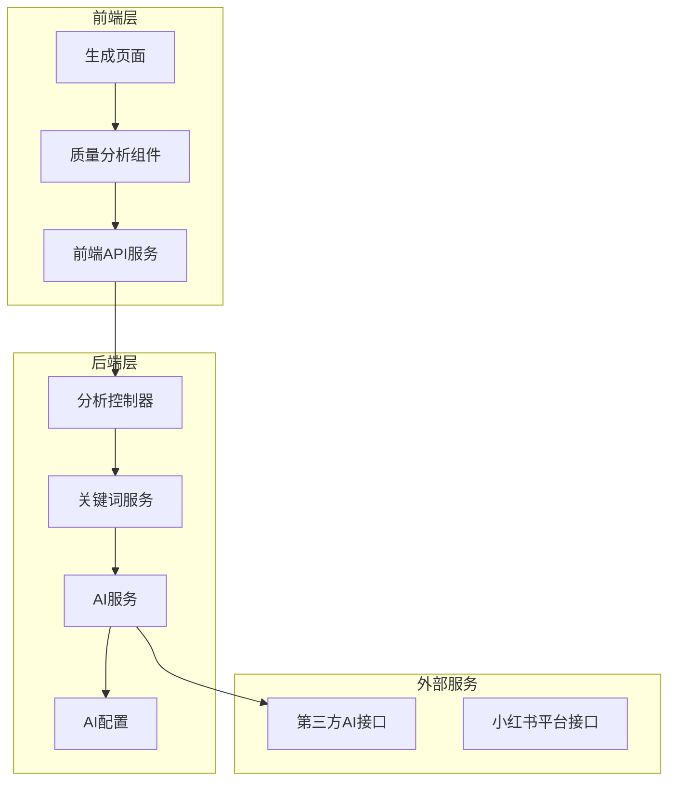
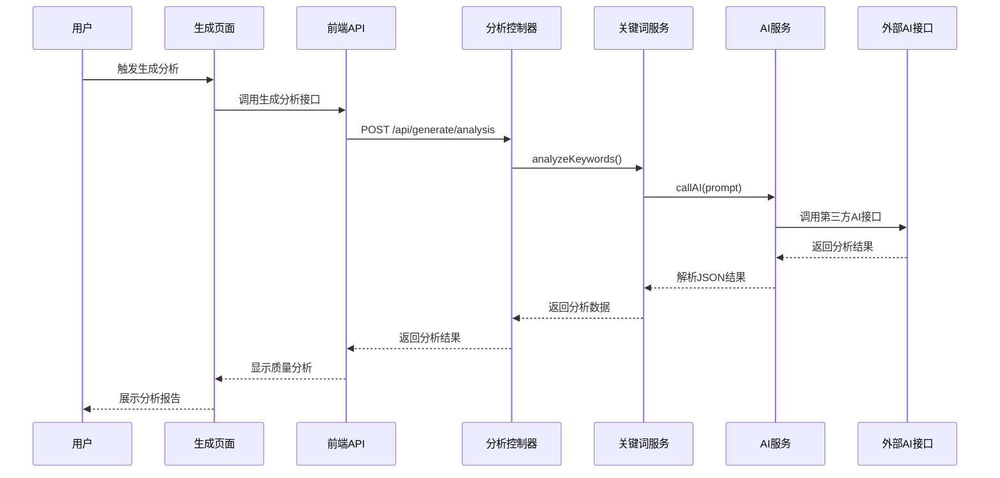
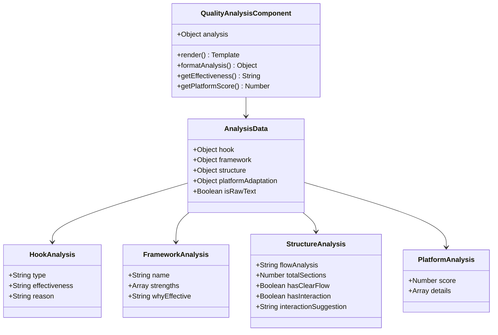
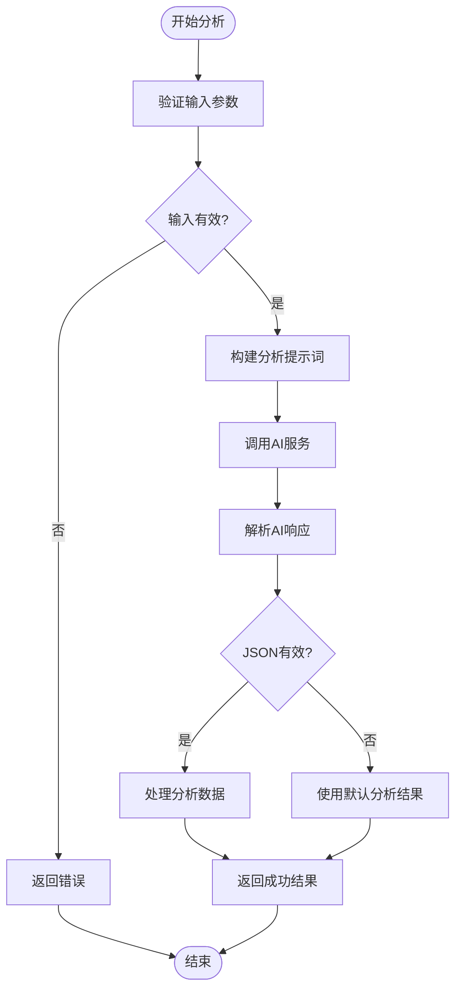
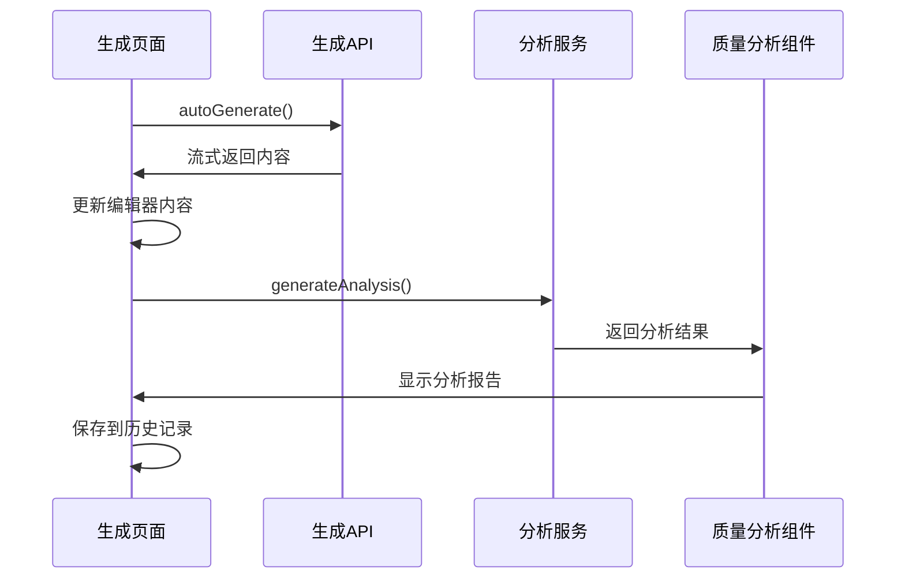
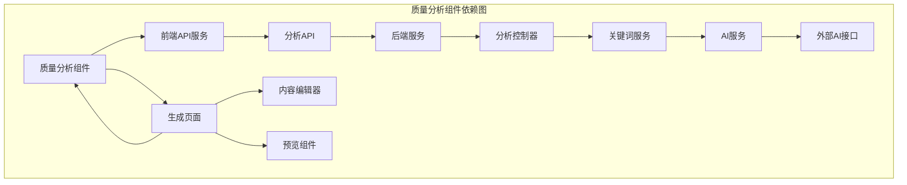

# 质量分析组件

<cite>
**本文档引用的文件**
- [QualityAnalysis.vue](file://src/components/QualityAnalysis.vue)
- [QualityAnalysis.vue](file://frontend/src/components/QualityAnalysis.vue)
- [Generate.vue](file://src/views/Generate.vue)
- [Generate.vue](file://frontend/src/views/Generate.vue)
- [api.js](file://src/services/api.js)
- [api.js](file://frontend/src/services/api.js)
- [analysisController.js](file://backend/src/controllers/analysisController.js)
- [keywordService.js](file://backend/src/services/keywordService.js)
- [aiService.js](file://backend/src/services/aiService.js)
- [ai.config.js](file://backend/src/config/ai.config.js)
- [小红书爆款框架.md](file://小红书爆款框架.md)
- [README.md](file://README.md)
</cite>

## 目录
1. [简介](#简介)
2. [项目结构](#项目结构)
3. [核心组件](#核心组件)
4. [架构概览](#架构概览)
5. [详细组件分析](#详细组件分析)
6. [依赖关系分析](#依赖关系分析)
7. [性能考虑](#性能考虑)
8. [故障排除指南](#故障排除指南)
9. [结论](#结论)
10. [附录](#附录)

## 简介

质量分析组件是小红书文案生成工具的核心功能模块，负责对生成的文案进行全面的质量评估和分析。该组件通过AI技术对文案进行深度分析，提供多维度的质量评分、详细的分析报告和针对性的优化建议。

该项目采用前后端分离架构，前端使用Vue 3 + Vite构建现代化的用户界面，后端基于Node.js + Express提供API服务。质量分析功能集成了多种AI能力，包括内容结构分析、语言质量检测和平台适配度评估。

## 项目结构

项目采用模块化的组织方式，质量分析组件分布在多个层次中：

**图表来源**
- [Generate.vue](file://src/views/Generate.vue#L177-L427)
- [analysisController.js](file://backend/src/controllers/analysisController.js#L1-L37)
- [keywordService.js](file://backend/src/services/keywordService.js#L1-L85)

**章节来源**
- [README.md](file://README.md#L1-L76)
- [Generate.vue](file://src/views/Generate.vue#L1-L668)

## 核心组件

质量分析组件主要由以下几个核心部分组成：

### 1. 前端质量分析组件

前端提供了两个版本的质量分析组件，分别使用不同的UI框架：

- **Naive UI版本**：位于 `src/components/QualityAnalysis.vue`
- **Element Plus版本**：位于 `frontend/src/components/QualityAnalysis.vue`

### 2. 生成流程集成

质量分析功能深度集成在生成流程中，通过 `Generate.vue` 页面协调整个分析过程。

### 3. 后端分析服务

后端提供完整的分析服务，包括关键词分析、AI调用和结果处理。

**章节来源**
- [QualityAnalysis.vue](file://src/components/QualityAnalysis.vue#L21-L138)
- [QualityAnalysis.vue](file://frontend/src/components/QualityAnalysis.vue#L13-L227)
- [Generate.vue](file://src/views/Generate.vue#L356-L370)

## 架构概览

质量分析组件的整体架构采用分层设计，确保各组件职责清晰、耦合度低：

**图表来源**
- [Generate.vue](file://src/views/Generate.vue#L356-L370)
- [api.js](file://src/services/api.js#L327-L363)
- [analysisController.js](file://backend/src/controllers/analysisController.js#L6-L30)
- [keywordService.js](file://backend/src/services/keywordService.js#L39-L84)

## 详细组件分析

### 前端质量分析组件

#### 组件结构

质量分析组件采用响应式设计，支持多种展示模式：

**图表来源**
- [QualityAnalysis.vue](file://src/components/QualityAnalysis.vue#L112-L118)
- [QualityAnalysis.vue](file://frontend/src/components/QualityAnalysis.vue#L135-L140)

#### 数据结构设计

分析结果采用标准化的数据结构，确保前后端一致性：

| 字段名 | 类型 | 描述 | 示例 |
|--------|------|------|------|
| hook | Object | 钩子分析结果 | 包含类型、有效性、原因 |
| framework | Object | 框架分析结果 | 包含名称、优势、有效性说明 |
| structure | Object | 内容结构分析 | 包含逻辑分析、段落数、互动引导 |
| platformAdaptation | Object | 平台适配度 | 包含评分和详细说明 |
| isRawText | Boolean | 是否为原始文本 | true/false |

#### 可视化展示

组件提供多种可视化元素：

1. **评分条展示**：使用星级评分直观显示有效性
2. **标签系统**：使用颜色标签区分不同状态
3. **折叠面板**：支持展开/收起详细分析
4. **统计图表**：平台适配度评分展示

**章节来源**
- [QualityAnalysis.vue](file://src/components/QualityAnalysis.vue#L31-L108)
- [QualityAnalysis.vue](file://frontend/src/components/QualityAnalysis.vue#L27-L126)

### 后端分析服务

#### AI调用机制

后端通过统一的AI服务层处理所有外部API调用：

**图表来源**
- [keywordService.js](file://backend/src/services/keywordService.js#L39-L84)
- [aiService.js](file://backend/src/services/aiService.js#L14-L53)

#### 分析算法逻辑

质量分析采用多维度评估算法：

1. **内容结构分析**：评估逻辑层次、段落组织、信息密度
2. **语言质量检测**：检查语言表达、情感价值、实用性
3. **平台适配度评估**：基于小红书平台特性进行评分
4. **框架匹配度分析**：验证所选框架的适用性

**章节来源**
- [keywordService.js](file://backend/src/services/keywordService.js#L4-L37)
- [aiService.js](file://backend/src/services/aiService.js#L9-L53)

### 生成流程集成

#### 自动化分析流程

质量分析深度集成在生成流程中，确保分析的及时性和准确性：

**图表来源**
- [Generate.vue](file://src/views/Generate.vue#L257-L324)
- [api.js](file://src/services/api.js#L327-L363)

**章节来源**
- [Generate.vue](file://src/views/Generate.vue#L257-L370)
- [api.js](file://src/services/api.js#L327-L363)

## 依赖关系分析

质量分析组件的依赖关系清晰明确，遵循单一职责原则：

**图表来源**
- [QualityAnalysis.vue](file://src/components/QualityAnalysis.vue#L194-L195)
- [Generate.vue](file://src/views/Generate.vue#L189-L195)
- [api.js](file://src/services/api.js#L205-L364)

**章节来源**
- [api.js](file://src/services/api.js#L1-L454)
- [analysisController.js](file://backend/src/controllers/analysisController.js#L1-L37)

## 性能考虑

### 1. 异步处理优化

质量分析组件采用异步处理机制，避免阻塞主线程：

- **流式分析**：支持渐进式分析结果展示
- **并发请求**：多个分析步骤并行执行
- **缓存策略**：合理利用浏览器缓存减少重复请求

### 2. 内存管理

组件实现了良好的内存管理机制：

- **响应式数据**：使用Vue 3的响应式系统自动管理数据更新
- **组件卸载**：正确处理组件销毁时的资源清理
- **事件监听**：避免内存泄漏的事件监听器管理

### 3. 网络优化

前端API服务提供了多项网络优化措施：

- **超时控制**：合理的请求超时设置
- **错误重试**：网络异常时的自动重试机制
- **进度反馈**：分析过程的实时进度展示

## 故障排除指南

### 常见问题及解决方案

#### 1. AI服务调用失败

**问题现象**：分析请求返回失败或超时

**可能原因**：
- 外部AI接口不可用
- 网络连接异常
- API密钥配置错误

**解决方案**：
- 检查网络连接状态
- 验证API配置信息
- 查看后端服务日志

#### 2. 分析结果格式异常

**问题现象**：AI返回的内容无法解析为JSON

**可能原因**：
- AI模型返回格式不符合预期
- 网络传输过程中数据损坏

**解决方案**：
- 使用默认分析结果作为回退方案
- 增加重试机制
- 记录原始响应数据便于调试

#### 3. 组件渲染异常

**问题现象**：质量分析组件无法正常显示

**可能原因**：
- 分析数据格式不正确
- 组件属性传递错误
- UI框架版本兼容性问题

**解决方案**：
- 验证传入的analysis属性格式
- 检查组件依赖的UI库版本
- 查看浏览器控制台错误信息

**章节来源**
- [aiService.js](file://backend/src/services/aiService.js#L45-L52)
- [keywordService.js](file://backend/src/services/keywordService.js#L44-L54)

## 结论

质量分析组件作为小红书文案生成工具的核心功能，通过精心设计的架构和完善的实现，为用户提供了全面、准确的文案质量评估服务。组件采用了现代化的技术栈，具备良好的可维护性和扩展性。

### 主要优势

1. **多维度分析**：涵盖内容结构、语言质量、平台适配等多个维度
2. **实时反馈**：支持流式分析结果展示，提供即时反馈
3. **用户友好**：直观的可视化展示和清晰的优化建议
4. **技术先进**：基于最新的AI技术和Vue 3响应式系统

### 技术特色

- **前后端分离**：清晰的职责划分和良好的可维护性
- **异步处理**：高效的异步处理机制，提升用户体验
- **错误处理**：完善的错误处理和回退机制
- **性能优化**：合理的性能优化策略，确保流畅运行

## 附录

### 使用示例

#### 基本使用流程

1. **触发分析**：在生成页面中调用分析接口
2. **等待结果**：组件自动显示分析进度
3. **查看报告**：浏览详细的分析结果和建议
4. **应用建议**：根据分析结果优化文案内容

#### 扩展指南

##### 自定义评估指标

要添加新的评估指标，可以：

1. 修改后端分析服务，添加新的分析逻辑
2. 更新前端组件，添加相应的展示元素
3. 调整数据结构，确保前后端一致性

##### 集成新的分析算法

要集成新的分析算法：

1. 在AI服务中添加新的调用方法
2. 更新分析控制器，支持新的算法
3. 扩展前端组件，支持新的分析维度

**章节来源**
- [小红书爆款框架.md](file://小红书爆款框架.md#L1-L225)
- [README.md](file://README.md#L58-L70)