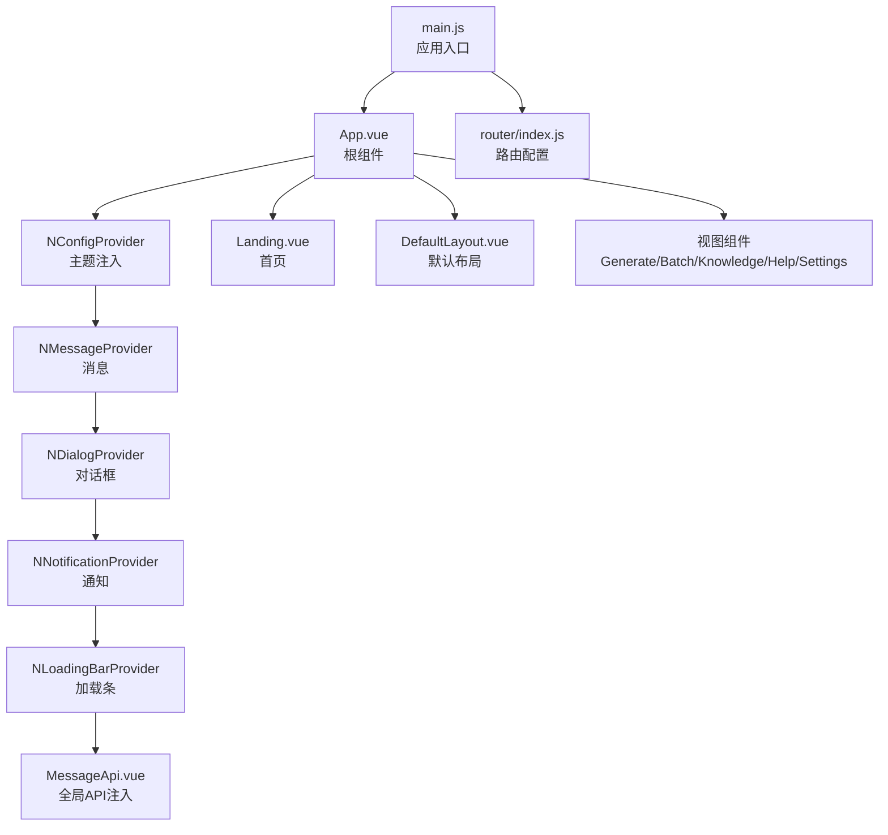
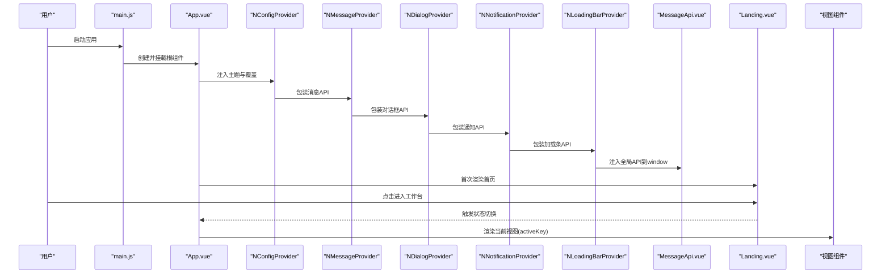
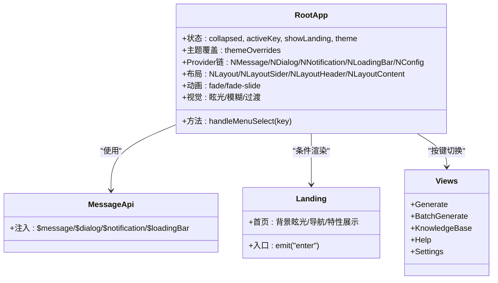
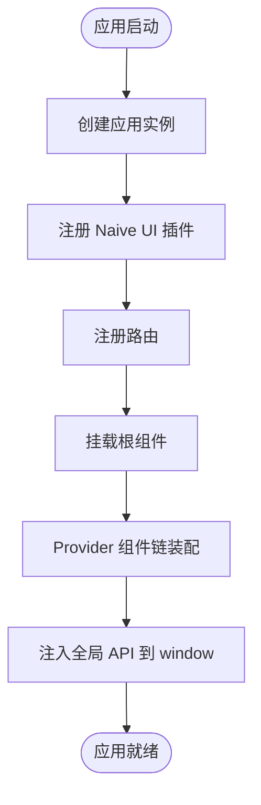
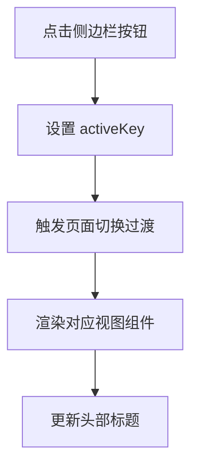
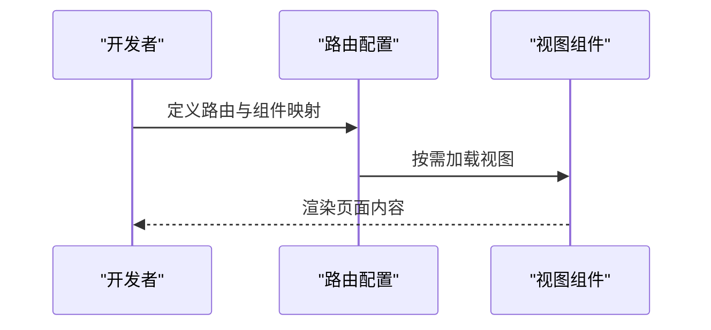
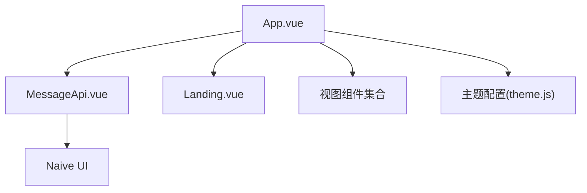

# 根组件与应用布局

<cite>
**本文档引用的文件**
- [App.vue](file://src/App.vue)
- [main.js](file://src/main.js)
- [DefaultLayout.vue](file://src/layouts/DefaultLayout.vue)
- [index.js](file://src/router/index.js)
- [theme.js](file://src/config/theme.js)
- [Landing.vue](file://src/views/Landing.vue)
- [MessageApi.vue](file://src/components/MessageApi.vue)
- [base.css](file://src/assets/base.css)
- [main.css](file://src/assets/main.css)
- [Generate.vue](file://src/views/Generate.vue)
- [BatchGenerate.vue](file://src/views/BatchGenerate.vue)
- [KnowledgeBase.vue](file://src/views/KnowledgeBase.vue)
- [Help.vue](file://src/views/Help.vue)
- [Settings.vue](file://src/views/Settings.vue)
</cite>

## 目录
1. [引言](#引言)
2. [项目结构](#项目结构)
3. [核心组件](#核心组件)
4. [架构总览](#架构总览)
5. [详细组件分析](#详细组件分析)
6. [依赖关系分析](#依赖关系分析)
7. [性能考虑](#性能考虑)
8. [故障排除指南](#故障排除指南)
9. [结论](#结论)

## 引言
本文件聚焦于根组件与应用布局，系统性阐述以下主题：
- App.vue 作为根组件的整体架构设计，包括全局布局管理、主题系统配置与导航体系
- Naive UI Provider 组件链的作用与全局配置（消息、对话框、通知、加载条）
- 应用状态管理机制（活动页面切换、侧边栏导航、头部布局）
- 响应式设计实现（玻璃拟态、背景眩光动画、过渡动画系统）
- 应用启动流程与路由配置策略

## 项目结构
该应用采用前端单页应用架构，根组件负责顶层布局与全局状态，配合路由系统实现多页面工作台。主题系统通过集中配置与 CSS 变量注入，统一视觉语言；Naive UI 提供丰富的 UI 组件与全局 Provider，保证交互一致性。

**图表来源**
- [main.js](file://src/main.js#L1-L16)
- [App.vue](file://src/App.vue#L1-L120)
- [MessageApi.vue](file://src/components/MessageApi.vue#L1-L16)
- [index.js](file://src/router/index.js#L1-L26)

**章节来源**
- [main.js](file://src/main.js#L1-L16)
- [App.vue](file://src/App.vue#L1-L120)
- [index.js](file://src/router/index.js#L1-L26)

## 核心组件
本节聚焦根组件 App.vue 的设计要点，涵盖布局容器、Provider 链、主题覆盖、导航与动画系统。

- 全局 Provider 组件链：以嵌套 Provider 形式提供全局 UI 能力，确保消息、对话框、通知与加载条在任意子组件可用。
- 主题系统：通过 NConfigProvider 与主题覆盖对象，统一圆角、主色、卡片与滚动条等视觉元素。
- 布局容器：采用 Naive UI 的布局组件构建主工作台，左侧为精简侧边栏，右侧为主内容区。
- 导航与页面切换：基于响应式状态 activeKey 控制当前视图，配合过渡动画实现平滑切换。
- 视觉与动画：引入背景眩光装饰与多种过渡动画，提升沉浸感与交互体验。

**章节来源**
- [App.vue](file://src/App.vue#L1-L254)

## 架构总览
下图展示了应用启动到页面渲染的关键流程，以及 Provider 链与主题系统的装配关系。

**图表来源**
- [main.js](file://src/main.js#L1-L16)
- [App.vue](file://src/App.vue#L1-L120)
- [MessageApi.vue](file://src/components/MessageApi.vue#L1-L16)
- [Landing.vue](file://src/views/Landing.vue#L1-L80)

## 详细组件分析

### 根组件 App.vue 设计架构
- Provider 组件链与作用域
  - NMessageProvider：提供全局消息提示能力，便于在非组件上下文使用。
  - NDialogProvider：提供全局对话框能力，统一弹窗交互。
  - NNotificationProvider：提供全局通知能力，支持多条通知叠加。
  - NLoadingBarProvider：提供全局加载条能力，统一页面级加载状态。
  - NConfigProvider：注入主题与主题覆盖，统一组件样式。
- 主题系统配置
  - 使用轻色主题基底，结合主题覆盖对象，定制主色、圆角、卡片、按钮、输入与滚动条等。
  - 布局组件的颜色覆盖，确保侧栏与头部具备透明与模糊效果。
- 布局与导航
  - 使用 Naive UI 布局组件构建主容器，左侧为固定宽度的侧边栏，右侧为主内容区。
  - 侧边栏采用精简模式，仅保留图标按钮，点击切换 activeKey。
  - 头部为透明背景，右侧包含功能按钮，整体呈现极简风格。
- 页面切换与动画
  - 首页 Landing 通过事件驱动切换到工作台。
  - 工作台内通过 transition name 控制页面切换动画，实现淡入淡出与滑动效果。
- 视觉与动画系统
  - 背景眩光：三个径向渐变球体，模糊与浮动动画，营造动态氛围。
  - 过渡动画：全局 fade 与 fade-slide，配合按钮悬停与卡片阴影变化。

**图表来源**
- [App.vue](file://src/App.vue#L1-L254)
- [MessageApi.vue](file://src/components/MessageApi.vue#L1-L16)
- [Landing.vue](file://src/views/Landing.vue#L1-L80)

**章节来源**
- [App.vue](file://src/App.vue#L1-L254)

### Naive UI Provider 组件链与全局配置
- Provider 组件链顺序与职责
  - NMessageProvider：提供 useMessage，注入到 window，便于在任意模块调用。
  - NDialogProvider：提供 useDialog，统一弹窗交互。
  - NNotificationProvider：提供 useNotification，支持多条通知。
  - NLoadingBarProvider：提供 useLoadingBar，统一页面级加载条。
- 全局 API 注入
  - MessageApi 将上述 API 绑定到 window 对象，避免在每个组件中重复初始化。
- 主题覆盖
  - 通过 NConfigProvider 的 theme 与 theme-overrides，统一圆角、主色、卡片、按钮、输入与滚动条等视觉元素。
  - 布局组件的颜色覆盖，确保侧栏与头部具备透明与模糊效果。

**图表来源**
- [main.js](file://src/main.js#L1-L16)
- [MessageApi.vue](file://src/components/MessageApi.vue#L1-L16)

**章节来源**
- [MessageApi.vue](file://src/components/MessageApi.vue#L1-L16)
- [App.vue](file://src/App.vue#L1-L120)

### 应用状态管理机制
- 活动页面切换
  - activeKey 作为核心状态，决定当前渲染的视图组件。
  - handleMenuSelect 与侧边栏按钮绑定，实现页面切换。
- 侧边栏导航
  - 精简侧边栏仅保留图标按钮，点击切换 activeKey。
  - 通过布局组件与样式类，实现透明与模糊效果。
- 头部布局
  - 透明头部，右侧包含功能按钮，整体简洁。
- 页面切换动画
  - 使用 transition name 控制淡入淡出与滑动效果，提升用户体验。

**图表来源**
- [App.vue](file://src/App.vue#L209-L253)

**章节来源**
- [App.vue](file://src/App.vue#L209-L253)

### 响应式设计与视觉系统
- 响应式断点与容器
  - 通过 CSS 变量与媒体查询，适配不同屏幕尺寸。
  - 容器类提供固定宽度与全宽两种模式。
- 玻璃拟态与背景眩光
  - 侧栏与头部采用透明与模糊效果，营造通透感。
  - 背景眩光通过径向渐变与模糊滤镜实现，配合浮动动画。
- 过渡动画系统
  - 全局 fade 与 fade-slide 动画，配合按钮悬停与卡片阴影变化，提升交互质感。

**章节来源**
- [App.vue](file://src/App.vue#L256-L463)
- [base.css](file://src/assets/base.css#L1-L154)
- [main.css](file://src/assets/main.css#L1-L207)

### 应用启动流程与路由配置策略
- 启动流程
  - main.js 创建应用实例，注册 Naive UI 与路由插件，挂载根组件。
- 路由策略
  - 当前路由仅包含首页（Generate），后续可在路由配置中扩展更多页面。
  - 建议采用按需加载与命名路由，提升首屏性能与可维护性。

**图表来源**
- [main.js](file://src/main.js#L1-L16)
- [index.js](file://src/router/index.js#L1-L26)

**章节来源**
- [main.js](file://src/main.js#L1-L16)
- [index.js](file://src/router/index.js#L1-L26)

## 依赖关系分析
- 组件耦合
  - App.vue 与各视图组件松耦合，通过 activeKey 与过渡动画进行编排。
  - MessageApi 与 Provider 链解耦，通过 window 注入实现全局可用。
- 外部依赖
  - Naive UI 提供完整的 UI 能力与 Provider 链。
  - 主题系统通过集中配置与 CSS 变量注入，降低样式维护成本。

**图表来源**
- [App.vue](file://src/App.vue#L1-L120)
- [MessageApi.vue](file://src/components/MessageApi.vue#L1-L16)
- [theme.js](file://src/config/theme.js#L1-L274)

**章节来源**
- [App.vue](file://src/App.vue#L1-L120)
- [MessageApi.vue](file://src/components/MessageApi.vue#L1-L16)
- [theme.js](file://src/config/theme.js#L1-L274)

## 性能考虑
- Provider 组件链的层级较深，建议在业务组件中按需使用对应 API，避免不必要的全局刷新。
- 视觉动画（眩光与过渡）在低端设备上可能影响帧率，可通过媒体查询或设备检测进行降级。
- 路由懒加载与代码分割有助于减少首屏体积，建议对大型视图组件启用异步加载。

## 故障排除指南
- 全局消息/通知不可用
  - 检查 Provider 链是否正确装配，确认 MessageApi 是否已注入到 window。
- 主题不生效
  - 检查 NConfigProvider 的 theme 与 theme-overrides 是否正确传入。
- 页面切换无动画
  - 检查 transition name 与 key 的绑定是否正确，确保视图组件存在。
- 路由无法跳转
  - 检查路由配置与组件映射，确认路径与组件引用正确。

**章节来源**
- [MessageApi.vue](file://src/components/MessageApi.vue#L1-L16)
- [App.vue](file://src/App.vue#L1-L120)
- [index.js](file://src/router/index.js#L1-L26)

## 结论
App.vue 作为根组件，承担了全局布局、主题系统与 Provider 链装配的核心职责。通过精简的侧边栏导航与流畅的页面切换动画，配合玻璃拟态与背景眩光等视觉设计，构建了现代化的工作台体验。结合统一的主题配置与路由策略，为后续功能扩展提供了清晰的架构基础。