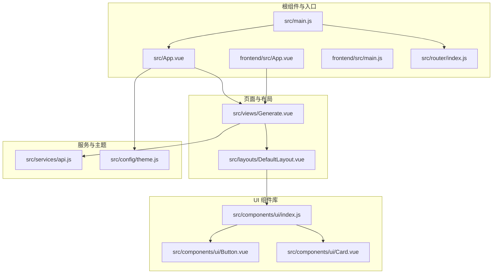
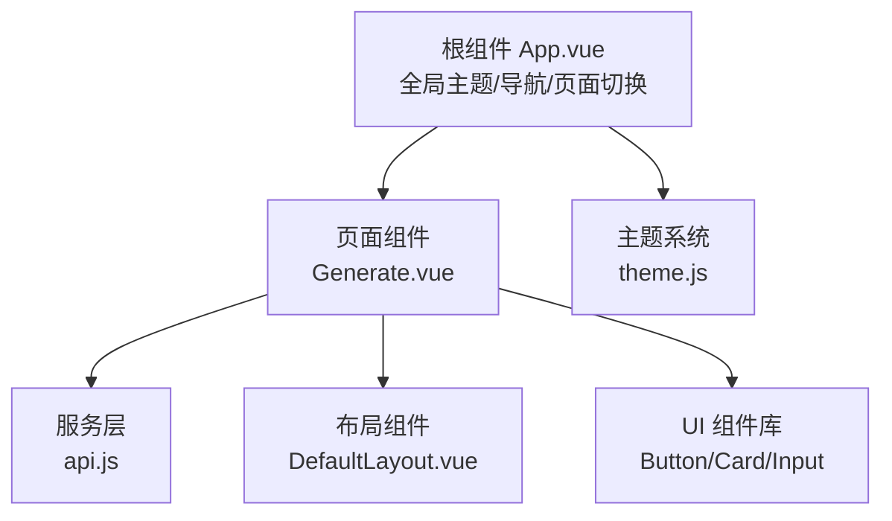
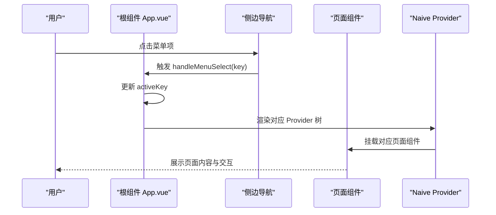
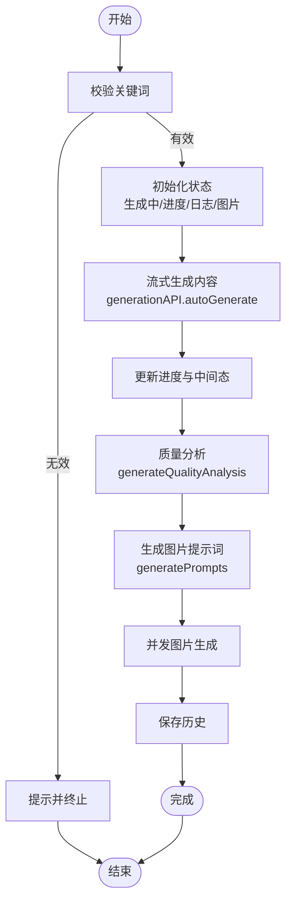
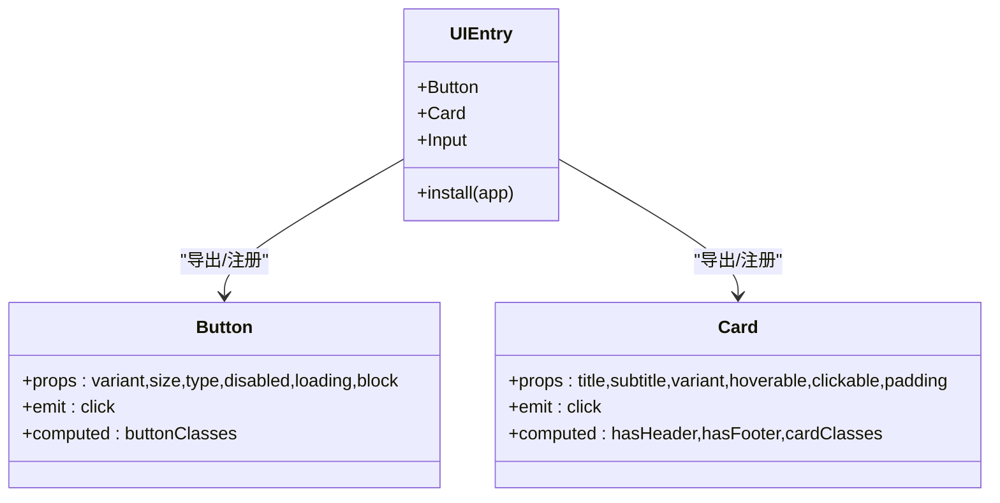
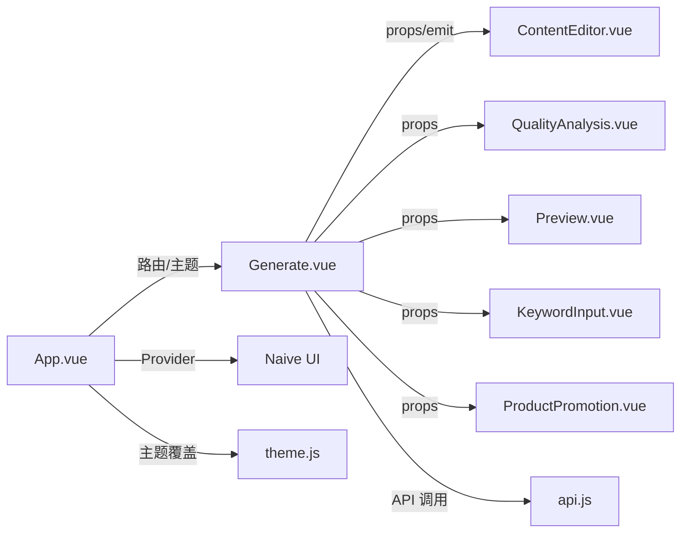

# 组件架构设计

<cite>
**本文档引用的文件**
- [src/App.vue](file://src/App.vue)
- [frontend/src/App.vue](file://frontend/src/App.vue)
- [src/main.js](file://src/main.js)
- [frontend/src/main.js](file://frontend/src/main.js)
- [src/router/index.js](file://src/router/index.js)
- [src/views/Generate.vue](file://src/views/Generate.vue)
- [src/components/ui/index.js](file://src/components/ui/index.js)
- [src/layouts/DefaultLayout.vue](file://src/layouts/DefaultLayout.vue)
- [src/components/ContentEditor.vue](file://src/components/ContentEditor.vue)
- [src/components/FrameworkSelector.vue](file://src/components/FrameworkSelector.vue)
- [src/components/ui/Button.vue](file://src/components/ui/Button.vue)
- [src/components/ui/Card.vue](file://src/components/ui/Card.vue)
- [src/services/api.js](file://src/services/api.js)
- [src/config/theme.js](file://src/config/theme.js)
</cite>

## 目录
1. [简介](#简介)
2. [项目结构](#项目结构)
3. [核心组件](#核心组件)
4. [架构总览](#架构总览)
5. [组件详细分析](#组件详细分析)
6. [依赖关系分析](#依赖关系分析)
7. [性能考量](#性能考量)
8. [故障排查指南](#故障排查指南)
9. [结论](#结论)
10. [附录](#附录)

## 简介
本文件系统性梳理 Vue 3 组件化架构设计，围绕根组件布局管理、页面级组件组织、UI 组件库集成、组件通信机制、生命周期与状态管理、Composition API 使用与响应式绑定、最佳实践以及自定义 UI 组件开发与 Naive UI 定制化配置展开。文档同时提供可视化图表与路径引用，便于不同技术背景的读者理解与落地。

## 项目结构
项目采用“多入口、双前端”架构：
- 根目录前端（Naive UI 版）：位于 src，使用 Naive UI 作为主要 UI 库，提供现代化玻璃拟态界面与全局主题覆盖。
- 前端目录前端（Element Plus 版）：位于 frontend/src，使用 Element Plus 作为 UI 库，提供简洁的单页应用布局。

核心模块划分：
- 根组件与布局：src/App.vue 作为工作台根组件，frontend/src/App.vue 作为演示入口。
- 页面级组件：src/views/Generate.vue 为核心生成页面，承载内容生成、编辑、预览与历史管理。
- UI 组件库：src/components/ui 提供 Button、Card、Input 等通用组件，并通过入口文件统一导出与安装。
- 布局组件：src/layouts/DefaultLayout.vue 提供可插槽的三段式布局（头/侧/主/脚）。
- 服务层：src/services/api.js 封装 AI 与图片生成 API，支持流式传输与错误兜底。
- 主题系统：src/config/theme.js 提供完整的设计令牌与 CSS 变量生成器。

**图表来源**
- [src/App.vue](file://src/App.vue#L8-L107)
- [frontend/src/App.vue](file://frontend/src/App.vue#L5-L22)
- [src/main.js](file://src/main.js#L4-L13)
- [frontend/src/main.js](file://frontend/src/main.js#L4-L13)
- [src/router/index.js](file://src/router/index.js#L6-L22)
- [src/views/Generate.vue](file://src/views/Generate.vue#L1-L175)
- [src/layouts/DefaultLayout.vue](file://src/layouts/DefaultLayout.vue#L2-L50)
- [src/components/ui/index.js](file://src/components/ui/index.js#L7-L21)
- [src/components/ui/Button.vue](file://src/components/ui/Button.vue#L9-L19)
- [src/components/ui/Card.vue](file://src/components/ui/Card.vue#L10-L29)
- [src/services/api.js](file://src/services/api.js#L8-L25)
- [src/config/theme.js](file://src/config/theme.js#L6-L273)

**章节来源**
- [src/App.vue](file://src/App.vue#L8-L107)
- [frontend/src/App.vue](file://frontend/src/App.vue#L5-L22)
- [src/main.js](file://src/main.js#L4-L13)
- [frontend/src/main.js](file://frontend/src/main.js#L4-L13)
- [src/router/index.js](file://src/router/index.js#L6-L22)

## 核心组件
- 根组件 App.vue（Naive UI 工作台）
  - 负责全局主题注入、消息/对话/通知/加载条提供者、侧边栏导航与页面切换、首页与工作台的条件渲染。
  - 使用 Composition API 管理 activeKey、showLanding、主题覆盖等响应式状态。
- 页面组件 Generate.vue
  - 负责生成流程编排：关键词输入、流式生成、质量分析、图片生成、历史记录与预览侧边栏。
  - 通过 props 传入内容与图片，通过 emits 向父组件回传事件。
- UI 组件库
  - Button、Card、Input 统一导出并通过 install 全局注册，支持 variants/sizes/loading/disabled/block 等通用能力。
- 布局组件 DefaultLayout.vue
  - 提供 header/sidebar/main/footer 插槽，支持 containerType 控制容器宽度，响应式侧边栏。
- 服务层 api.js
  - 封装 AI 与图片生成客户端，支持流式传输、错误处理与本地知识库操作。
- 主题系统 theme.js
  - 提供颜色、字体、间距、圆角、阴影、断点、Z-index、过渡等设计令牌，并可生成 CSS 变量。

**章节来源**
- [src/App.vue](file://src/App.vue#L110-L254)
- [src/views/Generate.vue](file://src/views/Generate.vue#L177-L427)
- [src/components/ui/index.js](file://src/components/ui/index.js#L7-L21)
- [src/layouts/DefaultLayout.vue](file://src/layouts/DefaultLayout.vue#L53-L89)
- [src/services/api.js](file://src/services/api.js#L8-L25)
- [src/config/theme.js](file://src/config/theme.js#L6-L273)

## 架构总览
整体采用“根组件 + 页面组件 + UI 组件库 + 布局组件 + 服务层”的分层架构。根组件负责全局外观与导航；页面组件承担业务流程编排；UI 组件库提供一致的交互体验；布局组件抽象通用结构；服务层封装外部 API 与本地存储。

**图表来源**
- [src/App.vue](file://src/App.vue#L14-L103)
- [src/views/Generate.vue](file://src/views/Generate.vue#L1-L175)
- [src/layouts/DefaultLayout.vue](file://src/layouts/DefaultLayout.vue#L1-L50)
- [src/components/ui/index.js](file://src/components/ui/index.js#L7-L21)
- [src/services/api.js](file://src/services/api.js#L8-L25)
- [src/config/theme.js](file://src/config/theme.js#L241-L271)

## 组件详细分析

### 根组件 App.vue（工作台布局与主题）
- 布局管理
  - 使用 Naive UI 的布局组件构建主容器，左侧瘦侧边栏 + 右侧内容区，支持透明玻璃效果与背景眩光装饰。
  - 通过 v-if/v-else 实现首页 Landing 与工作台的切换，过渡动画增强用户体验。
- 页面级组件组织
  - 通过 activeKey 控制当前视图，使用 key 与 transition 实现页面切换动画与缓存隔离。
  - 视图映射：generate/batch/knowledge/help/settings/analysis 对应不同页面组件。
- UI 组件库集成
  - 在根组件引入 Naive UI Provider，统一注入主题、消息、对话、通知、加载条。
  - 自定义 SVG 图标与菜单项，支持图标渲染与选中态。
- 主题与样式
  - 通过 theme 与 themeOverrides 注入全局主题变量，覆盖圆角、主色、卡片、按钮、滚动条等样式。
  - 内联样式定义背景眩光、透明头、侧边栏样式与页面过渡动画。

**图表来源**
- [src/App.vue](file://src/App.vue#L209-L253)
- [src/App.vue](file://src/App.vue#L87-L96)

**章节来源**
- [src/App.vue](file://src/App.vue#L8-L107)
- [src/App.vue](file://src/App.vue#L110-L254)

### 页面组件 Generate.vue（生成流程编排）
- 数据与状态
  - 使用 ref/computed 管理生成状态、进度、日志、图片生成状态与历史列表。
  - 通过 onMounted 初始化历史列表。
- 业务流程
  - 快速生成：handleQuickGenerate 调用 generationAPI.autoGenerate，支持流式回调更新进度与中间态。
  - 质量分析：generateQualityAnalysis 调用 AI 分析接口，生成结构化质量报告。
  - 图片生成：generateImages 基于文案生成提示词，调用 imageGenerationAPI 并并发请求。
  - 历史管理：historyService 封装 localStorage，支持保存、加载、删除、清空。
- 事件与通信
  - 通过 emits 向父组件回传 regenerate/preview/content-change。
  - 子组件 ContentEditor、QualityAnalysis、Preview 通过 props 接收数据，实现单向数据流与事件回传。

**图表来源**
- [src/views/Generate.vue](file://src/views/Generate.vue#L257-L324)
- [src/views/Generate.vue](file://src/views/Generate.vue#L356-L370)
- [src/views/Generate.vue](file://src/views/Generate.vue#L329-L354)

**章节来源**
- [src/views/Generate.vue](file://src/views/Generate.vue#L177-L427)

### UI 组件库与自定义组件
- 组件库入口
  - 统一导出 Button、Card、Input，并提供 install(app) 全局注册能力。
- Button 组件
  - 支持 variant/size/type/disabled/loading/block 等属性，计算类名与点击事件过滤。
- Card 组件
  - 支持 title/subtitle/variant/hoverable/clickable/padding 等属性，利用插槽扩展头部/底部。
- 与 Naive UI 的关系
  - 本项目同时存在自定义 UI 组件库与 Naive UI Provider，前者用于通用交互，后者用于全局主题与高级组件。

**图表来源**
- [src/components/ui/index.js](file://src/components/ui/index.js#L7-L21)
- [src/components/ui/Button.vue](file://src/components/ui/Button.vue#L25-L79)
- [src/components/ui/Card.vue](file://src/components/ui/Card.vue#L35-L98)

**章节来源**
- [src/components/ui/index.js](file://src/components/ui/index.js#L7-L21)
- [src/components/ui/Button.vue](file://src/components/ui/Button.vue#L25-L79)
- [src/components/ui/Card.vue](file://src/components/ui/Card.vue#L35-L98)

### 布局组件 DefaultLayout.vue（可插槽布局）
- 设计要点
  - 通过具名插槽暴露 header/sidebar/main/footer，支持 header-left/center/right 与 sidebar-content。
  - containerType 支持 container/container-fluid/none，响应式侧边栏在移动端固定定位。
- 使用场景
  - 适用于需要统一头部、侧边栏与主内容区的页面，减少重复布局代码。

**章节来源**
- [src/layouts/DefaultLayout.vue](file://src/layouts/DefaultLayout.vue#L2-L50)
- [src/layouts/DefaultLayout.vue](file://src/layouts/DefaultLayout.vue#L53-L89)

### 服务层与主题系统
- 服务层 api.js
  - 创建 axios 实例与自定义客户端，封装知识库、AI 生成、图片生成与提示词工程。
  - 支持流式传输（ReadableStream Reader）与错误兜底，提供 generatePrompts 与 generate 等方法。
- 主题系统 theme.js
  - 提供完整的颜色、字体、间距、圆角、阴影、断点、Z-index、过渡等设计令牌。
  - generateCSSVariables 将主题映射为 CSS 变量，便于在组件中使用。

**章节来源**
- [src/services/api.js](file://src/services/api.js#L8-L25)
- [src/services/api.js](file://src/services/api.js#L94-L177)
- [src/services/api.js](file://src/services/api.js#L417-L448)
- [src/config/theme.js](file://src/config/theme.js#L241-L271)

## 依赖关系分析
- 组件耦合
  - Generate.vue 与 ContentEditor.vue 通过 props/emit 形成父子通信，职责清晰。
  - 根组件与页面组件通过 activeKey 与 key 控制视图切换，避免深层嵌套。
- 外部依赖
  - Naive UI Provider 为全局提供主题与交互组件。
  - axios 与 fetch 用于 API 调用，流式传输使用 ReadableStream。
- 循环依赖
  - 当前结构未见循环依赖，组件间通信以单向数据流为主。

**图表来源**
- [src/views/Generate.vue](file://src/views/Generate.vue#L81-L97)
- [src/App.vue](file://src/App.vue#L14-L103)
- [src/services/api.js](file://src/services/api.js#L8-L25)
- [src/config/theme.js](file://src/config/theme.js#L165-L207)

**章节来源**
- [src/views/Generate.vue](file://src/views/Generate.vue#L81-L97)
- [src/App.vue](file://src/App.vue#L14-L103)
- [src/services/api.js](file://src/services/api.js#L8-L25)

## 性能考量
- 渲染性能
  - 使用 v-if/v-show 控制组件挂载与卸载，结合 key 与 transition 减少不必要的重渲染。
  - 预览侧边栏与底部输入区采用 fixed 定位，避免频繁触发主内容区滚动重绘。
- 网络性能
  - 流式生成使用 fetch + ReadableStream，逐步更新 UI，降低首屏等待。
  - 图片生成并发 Promise.all，缩短总耗时。
- 状态管理
  - 使用 ref/computed 管理轻量状态，避免过度拆分导致的响应式开销。
  - 历史记录使用 localStorage，注意序列化/反序列化成本。

[本节为通用指导，无需特定文件引用]

## 故障排查指南
- 生成失败
  - 检查 VITE_AI_BASE_URL/VITE_AI_API_KEY 等环境变量是否正确配置。
  - 查看流式传输日志与 onStream 回调，确认数据片段解析与拼接。
- 图片生成异常
  - 核对提示词生成逻辑与模型参数，关注 generatePrompts 返回数量与 generate 接口响应格式。
- 历史记录异常
  - 确认 localStorage 权限与容量限制，必要时清理过期数据。
- 主题不生效
  - 检查 themeOverrides 结构与 Naive Provider 注入顺序，确保在根组件内生效。

**章节来源**
- [src/services/api.js](file://src/services/api.js#L16-L25)
- [src/services/api.js](file://src/services/api.js#L417-L448)
- [src/App.vue](file://src/App.vue#L165-L207)

## 结论
本项目以 Vue 3 + Naive UI 为基础，构建了清晰的组件化架构：根组件负责全局布局与主题，页面组件承担业务编排，UI 组件库提供一致交互，布局组件抽象结构，服务层封装外部能力。通过 props/emit 与 Provider 模式实现松耦合通信，结合 Composition API 与响应式数据绑定，形成可维护、可扩展的前端体系。

[本节为总结，无需特定文件引用]

## 附录

### 组件通信机制
- Props 传递
  - 页面组件向子组件传递内容、图片、加载状态等只读数据。
- 事件发射
  - 子组件通过 emits 向父组件回传用户操作（如 regenerate、preview、content-change）。
- provide/inject 模式
  - 当前项目未显式使用 provide/inject，可在跨层级共享主题或服务时引入。

**章节来源**
- [src/views/Generate.vue](file://src/views/Generate.vue#L81-L97)
- [src/components/ContentEditor.vue](file://src/components/ContentEditor.vue#L245-L260)

### 生命周期与状态管理
- 生命周期
  - onMounted 初始化历史列表；watch 监听 props 变化并同步到本地状态。
- 状态管理
  - 使用 ref/computed 管理生成状态、进度、日志与历史；通过 emits 与父组件解耦。

**章节来源**
- [src/views/Generate.vue](file://src/views/Generate.vue#L223-L225)
- [src/views/Generate.vue](file://src/views/Generate.vue#L273-L277)

### 最佳实践
- 组件命名
  - 采用语义化命名（如 ContentEditor、FrameworkSelector），避免缩写。
- 属性设计
  - 明确默认值与校验器，提供最小可用属性集；区分只读 props 与可变 props。
- 事件处理
  - 事件命名采用动词短语（如 regenerate、preview），避免在事件中做复杂逻辑。
- 响应式绑定
  - 使用 computed 与 watch 管理派生状态，避免在模板中执行复杂表达式。

[本节为通用指导，无需特定文件引用]

### 自定义 UI 组件开发指南与 Naive UI 定制化
- 自定义组件开发
  - 以 Button/Card 为例，定义明确的 props/emit/computed，提供多种变体与尺寸。
  - 通过入口文件统一导出与 install，便于全局注册。
- Naive UI 定制化
  - 在根组件使用 NConfigProvider 注入 theme 与 themeOverrides，覆盖全局组件样式。
  - 结合 theme.js 的设计令牌，确保主题一致性与可维护性。

**章节来源**
- [src/components/ui/Button.vue](file://src/components/ui/Button.vue#L25-L79)
- [src/components/ui/Card.vue](file://src/components/ui/Card.vue#L35-L98)
- [src/App.vue](file://src/App.vue#L14-L103)
- [src/App.vue](file://src/App.vue#L165-L207)
- [src/config/theme.js](file://src/config/theme.js#L241-L271)