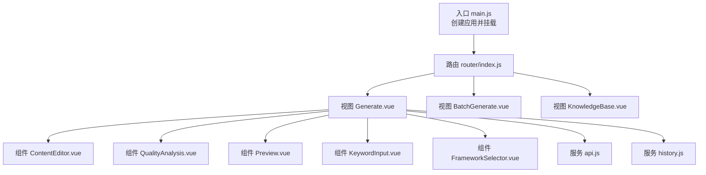
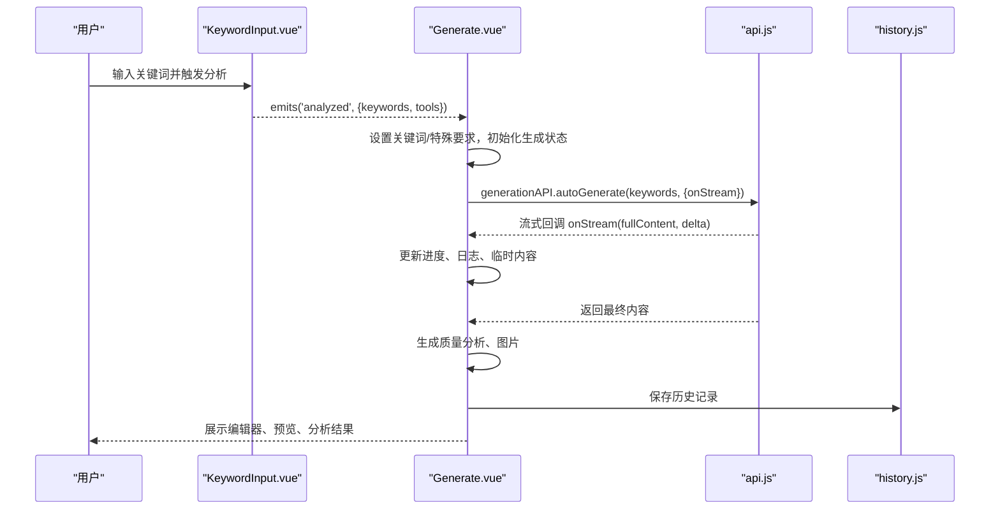
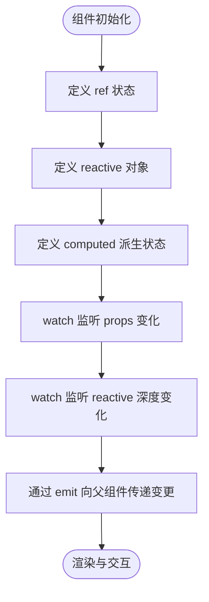
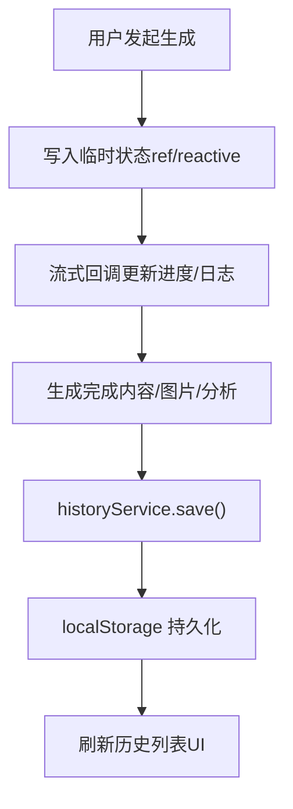
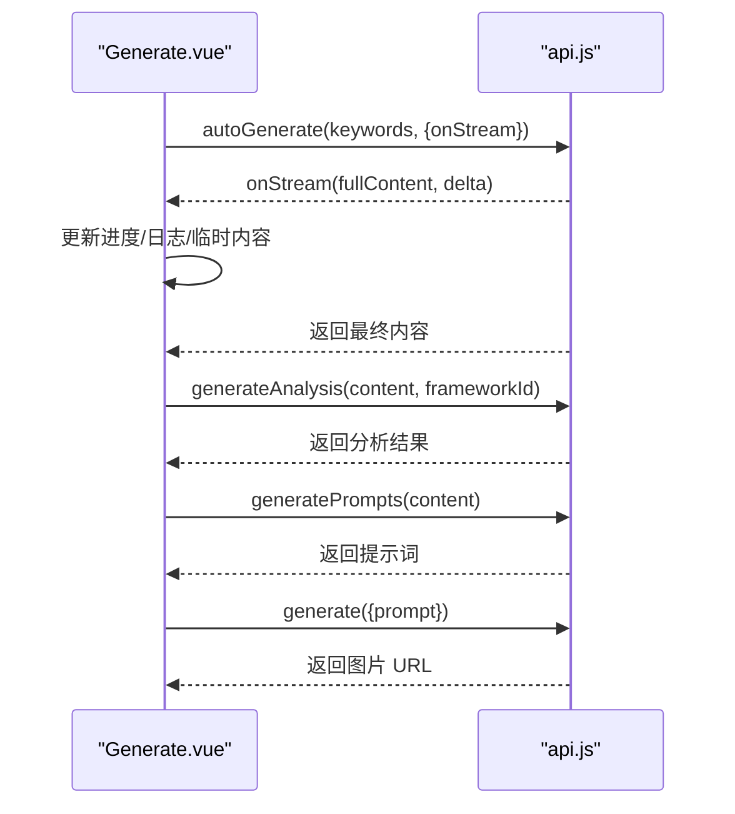
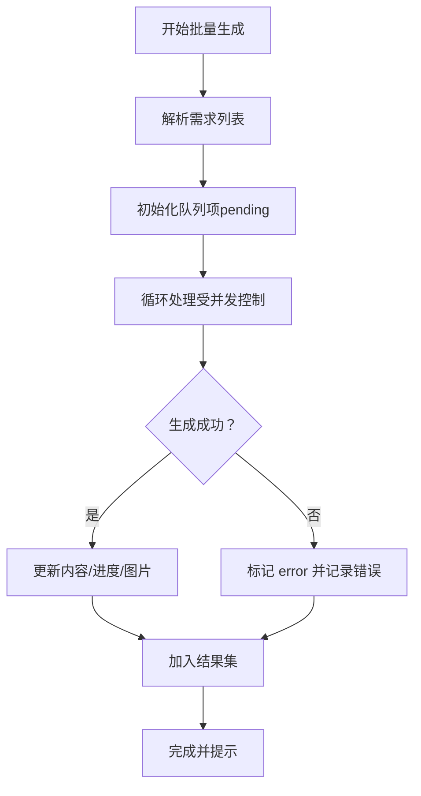
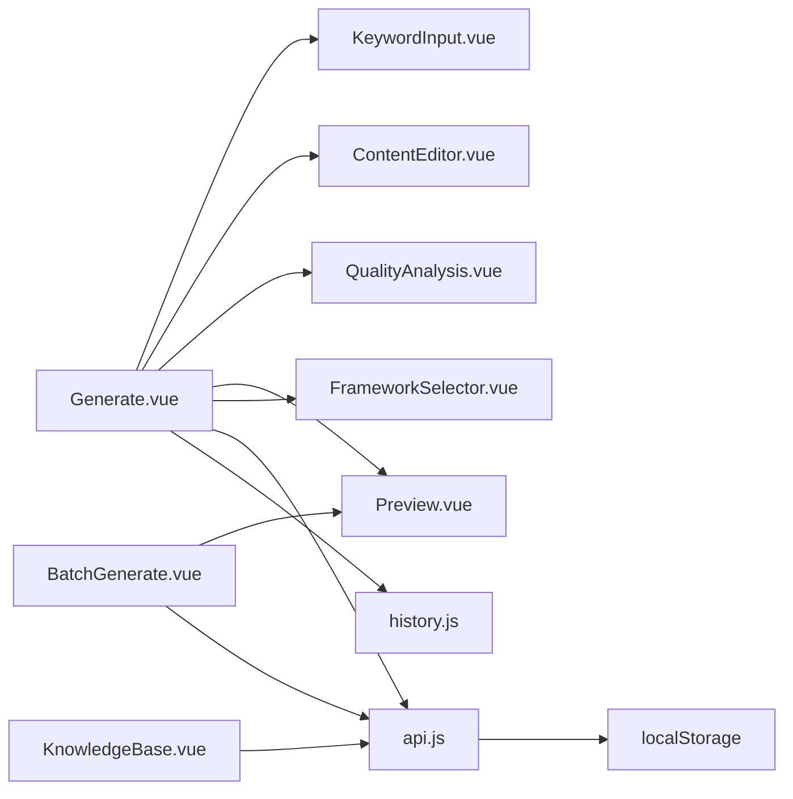

# 组件生命周期与状态管理

<cite>
**本文档引用的文件**
- [App.vue](file://src/App.vue)
- [main.js](file://src/main.js)
- [router/index.js](file://src/router/index.js)
- [views/Generate.vue](file://src/views/Generate.vue)
- [components/ContentEditor.vue](file://src/components/ContentEditor.vue)
- [components/FrameworkSelector.vue](file://src/components/FrameworkSelector.vue)
- [components/KeywordInput.vue](file://src/components/KeywordInput.vue)
- [components/Preview.vue](file://src/components/Preview.vue)
- [components/QualityAnalysis.vue](file://src/components/QualityAnalysis.vue)
- [views/BatchGenerate.vue](file://src/views/BatchGenerate.vue)
- [views/KnowledgeBase.vue](file://src/views/KnowledgeBase.vue)
- [services/api.js](file://src/services/api.js)
- [services/history.js](file://src/services/history.js)
</cite>

## 目录
1. [简介](#简介)
2. [项目结构](#项目结构)
3. [核心组件](#核心组件)
4. [架构总览](#架构总览)
5. [详细组件分析](#详细组件分析)
6. [依赖关系分析](#依赖关系分析)
7. [性能考量](#性能考量)
8. [故障排查指南](#故障排查指南)
9. [结论](#结论)
10. [附录](#附录)

## 简介
本文件聚焦于 Vue 3 Composition API 的组件生命周期与状态管理实践，结合仓库中的实际组件与服务，系统阐述：
- 生命周期钩子的使用场景与最佳实践（如 onMounted）
- 响应式数据管理策略（ref、reactive、computed、watch）
- 组件状态持久化（本地存储、会话与历史记录）
- 卸载与资源清理（内存泄漏防护、事件监听器清理思路）
- 调试技巧与性能监控方法

## 项目结构
前端采用单页应用结构，基于 Vue 3 + Naive UI，路由集中于 src/router，业务视图位于 src/views，通用组件位于 src/components，服务封装在 src/services。

图表来源
- [main.js](file://src/main.js#L1-L16)
- [router/index.js](file://src/router/index.js#L1-L26)
- [views/Generate.vue](file://src/views/Generate.vue#L1-L668)
- [components/ContentEditor.vue](file://src/components/ContentEditor.vue#L1-L418)
- [components/QualityAnalysis.vue](file://src/components/QualityAnalysis.vue#L1-L138)
- [components/Preview.vue](file://src/components/Preview.vue#L1-L411)
- [components/KeywordInput.vue](file://src/components/KeywordInput.vue#L1-L265)
- [components/FrameworkSelector.vue](file://src/components/FrameworkSelector.vue#L1-L241)
- [services/api.js](file://src/services/api.js#L1-L454)
- [services/history.js](file://src/services/history.js#L1-L89)

章节来源
- [main.js](file://src/main.js#L1-L16)
- [router/index.js](file://src/router/index.js#L1-L26)

## 核心组件
- 应用根组件 App.vue：全局主题、布局、消息与通知提供者、页面切换与视图容器。
- 视图 Generate.vue：生成流程编排、进度与日志、历史记录、预览与质量分析。
- 视图 BatchGenerate.vue：批量生成任务队列、并发控制、结果打包下载。
- 视图 KnowledgeBase.vue：本地知识库增删改查。
- 组件 ContentEditor.vue：内容编辑与预览、标签管理、图片下载。
- 组件 Preview.vue：移动端/桌面端预览模拟、图片下载代理。
- 组件 KeywordInput.vue：关键词输入与工具选择。
- 组件 FrameworkSelector.vue：框架选择与多选汇总。
- 服务 api.js：AI 与图片生成 API、知识库 API、流式响应处理。
- 服务 history.js：本地历史记录持久化。

章节来源
- [App.vue](file://src/App.vue#L1-L468)
- [views/Generate.vue](file://src/views/Generate.vue#L1-L668)
- [views/BatchGenerate.vue](file://src/views/BatchGenerate.vue#L1-L345)
- [views/KnowledgeBase.vue](file://src/views/KnowledgeBase.vue#L1-L186)
- [components/ContentEditor.vue](file://src/components/ContentEditor.vue#L1-L418)
- [components/Preview.vue](file://src/components/Preview.vue#L1-L411)
- [components/KeywordInput.vue](file://src/components/KeywordInput.vue#L1-L265)
- [components/FrameworkSelector.vue](file://src/components/FrameworkSelector.vue#L1-L241)
- [services/api.js](file://src/services/api.js#L1-L454)
- [services/history.js](file://src/services/history.js#L1-L89)

## 架构总览
下图展示从用户交互到服务调用与状态更新的关键路径，体现 Composition API 在组件内的状态组织与生命周期使用。

图表来源
- [components/KeywordInput.vue](file://src/components/KeywordInput.vue#L132-L142)
- [views/Generate.vue](file://src/views/Generate.vue#L257-L324)
- [services/api.js](file://src/services/api.js#L256-L282)
- [services/history.js](file://src/services/history.js#L14-L41)

## 详细组件分析

### 组件生命周期与状态管理实践
- onMounted 的使用
  - Generate.vue 在挂载后加载历史记录，确保首次进入即呈现历史列表。
  - KnowledgeBase.vue 在挂载时拉取知识库条目，保证页面渲染即有数据。
- 最佳实践
  - 将副作用（如数据加载）集中在 onMounted 中，避免在模板渲染阶段产生昂贵操作。
  - 对于需要在组件销毁时清理的副作用，应在合适的时机释放资源（见“卸载与资源清理”）。

章节来源
- [views/Generate.vue](file://src/views/Generate.vue#L223-L225)
- [views/KnowledgeBase.vue](file://src/views/KnowledgeBase.vue#L178-L179)

### 响应式数据管理策略
- ref：用于基本状态（布尔、数值、字符串、对象引用）。
  - 示例：生成状态 generating、进度 generationProgress、日志 processingLogs、图片生成 imageGenerating、预览开关 showPreview、关键词 currentKeywords、特殊要求 currentSpecialRequirements、预览设备 previewDevice、历史抽屉 showHistory。
- reactive：用于复杂对象或需要深层响应的集合。
  - 示例：编辑器内容 editorContent、分析结果 analysisResult、质量分析 qualityAnalysis、生成结果 generatedContent/editedContent、生成图片 generatedImages。
- computed：用于派生状态与计算属性。
  - 示例：当前侧边栏宽度 currentSidebarWidth；Markdown 渲染结果 markdownHtml；当前标题 currentTitle。
- watch/watchEffect：用于监听状态变化并触发副作用。
  - 示例：监听 props.content 同步 editorContent（immediate: true）；监听 editorContent 深度变化并向上游发出 content-change 事件；监听 props.value 同步 selectedIds；监听 props.frameworks 在空状态时默认选中第一个框架。

图表来源
- [components/ContentEditor.vue](file://src/components/ContentEditor.vue#L273-L281)
- [components/FrameworkSelector.vue](file://src/components/FrameworkSelector.vue#L127-L140)

章节来源
- [views/Generate.vue](file://src/views/Generate.vue#L199-L221)
- [components/ContentEditor.vue](file://src/components/ContentEditor.vue#L198-L316)
- [components/FrameworkSelector.vue](file://src/components/FrameworkSelector.vue#L77-L141)

### 组件状态持久化机制
- 本地存储
  - 历史记录：history.js 提供 save/getAll/remove/clear，统一管理生成历史，限制最大长度，使用 localStorage 存储。
  - 知识库：knowledgeAPI 使用 localStorage 存储知识条目，支持增删改查。
- 会话管理
  - 生成过程中的中间态（如临时内容、进度、日志）保存在组件内 ref/reactive 中，随组件生命周期存在。
- 历史记录功能
  - Generate.vue 在 onMounted 时加载历史列表；在生成完成后保存最新结果；支持删除与清空；提供抽屉式浏览与按条目恢复。

图表来源
- [views/Generate.vue](file://src/views/Generate.vue#L390-L422)
- [services/history.js](file://src/services/history.js#L14-L87)

章节来源
- [services/history.js](file://src/services/history.js#L1-L89)
- [services/api.js](file://src/services/api.js#L42-L85)
- [views/Generate.vue](file://src/views/Generate.vue#L223-L240)

### 卸载与资源清理策略
- 组件卸载
  - 当前代码未显式注册 beforeUnmount 钩子，但生成流程中使用了 ref/reactive 管理状态，组件销毁时这些状态会被垃圾回收。
- 事件监听器清理
  - 代码中未发现显式的 addEventListener/removeEventListener 注册，因此不存在需要在卸载时移除的监听器。
- 内存泄漏防护
  - 避免在组件外持有对 DOM 或组件实例的强引用。
  - 对于定时器、轮询、流式订阅等，应在组件卸载时清理（当前未见此类场景）。

章节来源
- [views/Generate.vue](file://src/views/Generate.vue#L223-L324)
- [components/ContentEditor.vue](file://src/components/ContentEditor.vue#L198-L316)

### API 与服务调用的生命周期配合
- 流式生成
  - generationAPI.autoGenerate 支持 onStream 回调，在流式过程中不断更新组件状态，最后返回完整内容。
- 图片生成
  - imageGenerationAPI.generatePrompts 与 generate 并行处理，最终合并到 generatedImages。
- 质量分析
  - generateQualityAnalysis 调用 generationAPI.generateAnalysis，将分析结果注入到 UI。

图表来源
- [services/api.js](file://src/services/api.js#L256-L363)
- [views/Generate.vue](file://src/views/Generate.vue#L282-L354)

章节来源
- [services/api.js](file://src/services/api.js#L1-L454)
- [views/Generate.vue](file://src/views/Generate.vue#L257-L354)

### 批量生成与并发控制
- 批量生成视图 BatchGenerate.vue
  - 输入需求列表，逐条处理并维护队列状态（pending/processing/completed/error）。
  - 并发数由 concurrency 控制，当前实现为顺序串行推进，便于简化与可观测性。
  - 支持打包下载全部结果为 ZIP，包含文案与图片。

图表来源
- [views/BatchGenerate.vue](file://src/views/BatchGenerate.vue#L163-L230)

章节来源
- [views/BatchGenerate.vue](file://src/views/BatchGenerate.vue#L1-L345)

### 知识库管理
- 知识库视图 KnowledgeBase.vue
  - 通过 knowledgeAPI 读写 localStorage，支持新增、删除、导入模板（预留）。
  - onMounted 拉取初始数据，保证页面渲染即有内容。

章节来源
- [views/KnowledgeBase.vue](file://src/views/KnowledgeBase.vue#L88-L179)
- [services/api.js](file://src/services/api.js#L42-L85)

## 依赖关系分析
- 组件间依赖
  - Generate.vue 依赖 KeywordInput、ContentEditor、QualityAnalysis、Preview、FrameworkSelector、history.js、api.js。
  - BatchGenerate.vue 依赖 Preview、api.js。
  - KnowledgeBase.vue 依赖 knowledgeAPI。
- 服务依赖
  - api.js 依赖 axios 与环境变量，封装 AI 与图片生成接口。
  - history.js 依赖 localStorage。

图表来源
- [views/Generate.vue](file://src/views/Generate.vue#L191-L195)
- [views/BatchGenerate.vue](file://src/views/BatchGenerate.vue#L136-L138)
- [views/KnowledgeBase.vue](file://src/views/KnowledgeBase.vue#L92-L92)
- [services/api.js](file://src/services/api.js#L1-L454)
- [services/history.js](file://src/services/history.js#L1-L89)

章节来源
- [views/Generate.vue](file://src/views/Generate.vue#L1-L668)
- [views/BatchGenerate.vue](file://src/views/BatchGenerate.vue#L1-L345)
- [views/KnowledgeBase.vue](file://src/views/KnowledgeBase.vue#L1-L186)
- [services/api.js](file://src/services/api.js#L1-L454)
- [services/history.js](file://src/services/history.js#L1-L89)

## 性能考量
- 渲染性能
  - 使用 computed 仅在依赖变化时重算，减少不必要的渲染。
  - 使用 v-if/v-show 控制重型组件（如编辑器、分析卡片）的渲染时机。
- 网络与流式
  - 流式生成通过 onStream 逐步更新，避免一次性大对象拼接。
  - 图片生成采用 Promise.all 并行，注意后端限流与错误兜底。
- 存储与内存
  - 历史记录限制最大长度，避免 localStorage 膨胀。
  - 批量生成结果在完成后再统一处理，避免长期持有大量中间态。

## 故障排查指南
- 生成失败
  - 检查 onStream 回调是否正确接收增量内容；查看日志与进度条。
  - 若分析或图片生成失败，查看对应 API 返回与错误信息。
- 历史记录异常
  - 确认 localStorage 是否被清理或容量不足；检查 historyService 的 save/getAll/remove/clear 行为。
- 知识库为空
  - 确认 knowledgeAPI 的 getAll/save/add/delete 是否正常；检查浏览器 localStorage 权限。
- 批量下载失败
  - 检查代理下载接口 /api/proxy-image 是否可用；确认网络状态与跨域配置。

章节来源
- [views/Generate.vue](file://src/views/Generate.vue#L315-L324)
- [services/history.js](file://src/services/history.js#L14-L87)
- [services/api.js](file://src/services/api.js#L389-L448)
- [views/BatchGenerate.vue](file://src/views/BatchGenerate.vue#L235-L280)

## 结论
本项目在 Composition API 的实践中，合理运用 ref/reactive/computed/watch 管理状态，结合 onMounted 进行副作用初始化，利用 localStorage 实现关键状态持久化，并通过服务层抽象 API 调用与流式处理。整体结构清晰、职责分离良好，具备良好的扩展性与可维护性。

## 附录
- 环境变量与配置
  - VITE_AI_BASE_URL、VITE_AI_API_KEY、VITE_AI_MODEL、VITE_VOLCENGINE_BASE_URL、VITE_VOLCENGINE_API_KEY 等需在运行环境中正确配置。
- 调试建议
  - 使用浏览器开发者工具的 Vue DevTools 查看组件状态树与变更。
  - 在关键流程（onStream、API 调用、历史保存）添加日志，便于定位问题。
  - 对于性能瓶颈，使用 Performance 面板观察渲染与网络请求。