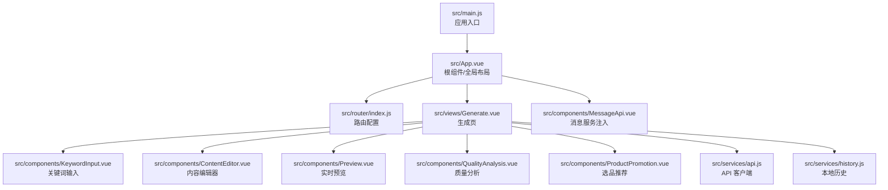
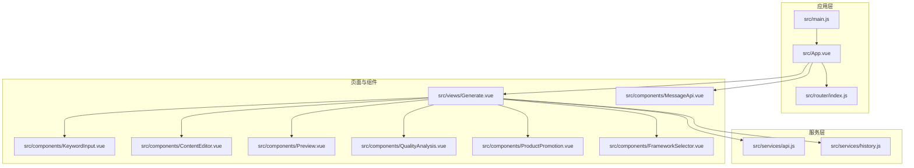
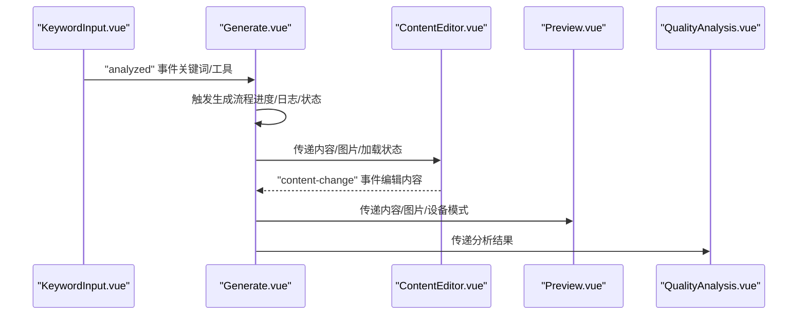
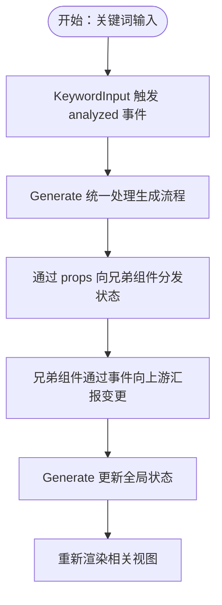
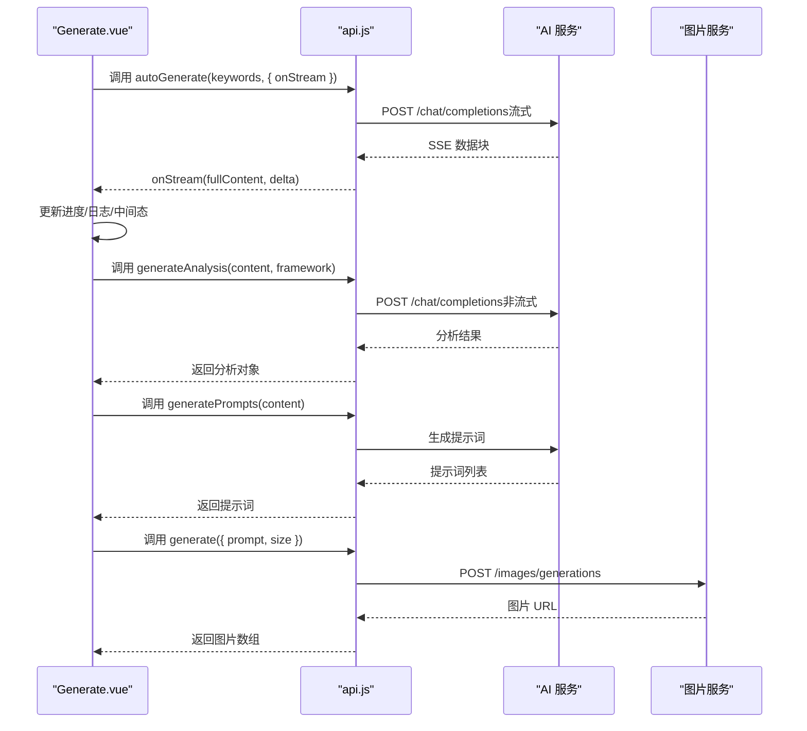
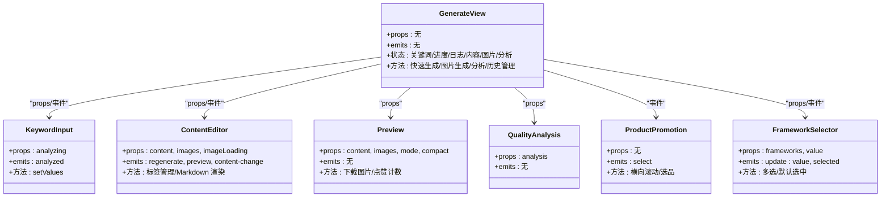
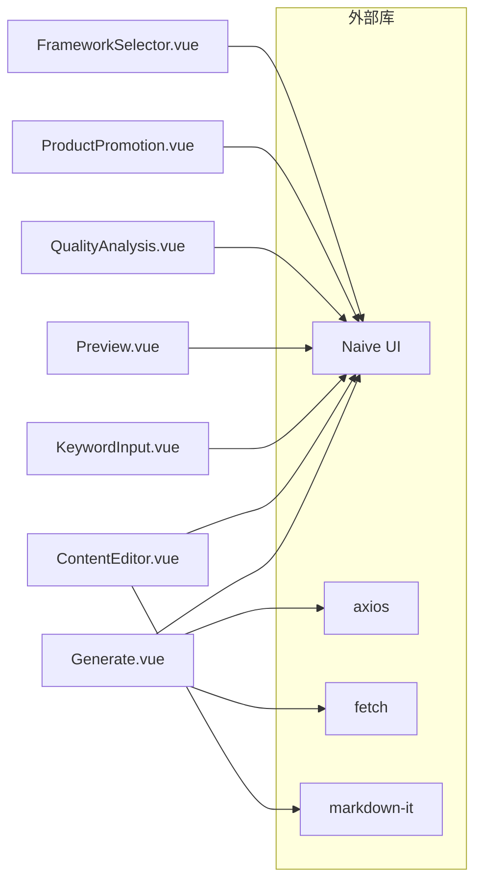

# 组件通信机制

<cite>
**本文档引用的文件**
- [src/App.vue](file://src/App.vue)
- [src/main.js](file://src/main.js)
- [src/router/index.js](file://src/router/index.js)
- [src/views/Generate.vue](file://src/views/Generate.vue)
- [src/components/ContentEditor.vue](file://src/components/ContentEditor.vue)
- [src/components/KeywordInput.vue](file://src/components/KeywordInput.vue)
- [src/components/Preview.vue](file://src/components/Preview.vue)
- [src/components/QualityAnalysis.vue](file://src/components/QualityAnalysis.vue)
- [src/components/FrameworkSelector.vue](file://src/components/FrameworkSelector.vue)
- [src/components/ProductPromotion.vue](file://src/components/ProductPromotion.vue)
- [src/services/api.js](file://src/services/api.js)
- [src/services/history.js](file://src/services/history.js)
- [src/components/MessageApi.vue](file://src/components/MessageApi.vue)
</cite>

## 目录
1. [简介](#简介)
2. [项目结构](#项目结构)
3. [核心组件](#核心组件)
4. [架构概览](#架构概览)
5. [详细组件分析](#详细组件分析)
6. [依赖关系分析](#依赖关系分析)
7. [性能考虑](#性能考虑)
8. [故障排除指南](#故障排除指南)
9. [结论](#结论)

## 简介
本文件系统性梳理了基于 Vue 3 Composition API 的组件通信机制，涵盖父子组件通信（props、事件、插槽）、兄弟组件与跨层级通信策略、异步数据通信（API 调用、流式传输、缓存与错误处理），并总结最佳实践与性能优化建议。文档以代码为依据，配合可视化图表帮助不同技术背景的读者理解。

## 项目结构
项目采用前端单页应用架构，根组件负责全局布局与主题注入，页面组件承载业务功能，通用组件封装 UI 与交互，服务层统一处理 API 与本地存储。

**图表来源**
- [src/main.js](file://src/main.js#L1-L16)
- [src/App.vue](file://src/App.vue#L1-L108)
- [src/router/index.js](file://src/router/index.js#L1-L26)
- [src/views/Generate.vue](file://src/views/Generate.vue#L1-L175)
- [src/components/KeywordInput.vue](file://src/components/KeywordInput.vue#L1-L76)
- [src/components/ContentEditor.vue](file://src/components/ContentEditor.vue#L1-L60)
- [src/components/Preview.vue](file://src/components/Preview.vue#L21-L132)
- [src/components/QualityAnalysis.vue](file://src/components/QualityAnalysis.vue#L21-L110)
- [src/components/ProductPromotion.vue](file://src/components/ProductPromotion.vue#L1-L51)
- [src/services/api.js](file://src/services/api.js#L1-L454)
- [src/services/history.js](file://src/services/history.js#L1-L89)
- [src/components/MessageApi.vue](file://src/components/MessageApi.vue#L1-L16)

**章节来源**
- [src/main.js](file://src/main.js#L1-L16)
- [src/App.vue](file://src/App.vue#L1-L108)
- [src/router/index.js](file://src/router/index.js#L1-L26)

## 核心组件
- 根组件与全局布局：负责主题注入、全局 Provider、页面切换与工作台布局。
- 生成页：聚合关键词输入、内容编辑、质量分析、预览与历史管理。
- 通用组件：内容编辑器、关键词输入、实时预览、质量分析、框架选择器、选品推荐。
- 服务层：API 客户端（AI、图片生成、知识库）、本地历史服务、消息服务注入。

**章节来源**
- [src/App.vue](file://src/App.vue#L8-L107)
- [src/views/Generate.vue](file://src/views/Generate.vue#L1-L175)
- [src/components/ContentEditor.vue](file://src/components/ContentEditor.vue#L1-L60)
- [src/components/KeywordInput.vue](file://src/components/KeywordInput.vue#L1-L76)
- [src/components/Preview.vue](file://src/components/Preview.vue#L21-L132)
- [src/components/QualityAnalysis.vue](file://src/components/QualityAnalysis.vue#L21-L110)
- [src/components/FrameworkSelector.vue](file://src/components/FrameworkSelector.vue#L76-L141)
- [src/components/ProductPromotion.vue](file://src/components/ProductPromotion.vue#L1-L51)
- [src/services/api.js](file://src/services/api.js#L1-L454)
- [src/services/history.js](file://src/services/history.js#L1-L89)
- [src/components/MessageApi.vue](file://src/components/MessageApi.vue#L1-L16)

## 架构概览
系统采用“根组件 + 页面组件 + 通用组件 + 服务层”的分层架构。根组件通过 Provider 注入全局主题与消息服务；页面组件协调多个子组件完成端到端工作流；服务层抽象 API 与本地存储，统一错误处理与缓存策略。

**图表来源**
- [src/main.js](file://src/main.js#L1-L16)
- [src/App.vue](file://src/App.vue#L1-L108)
- [src/router/index.js](file://src/router/index.js#L1-L26)
- [src/views/Generate.vue](file://src/views/Generate.vue#L1-L175)
- [src/components/KeywordInput.vue](file://src/components/KeywordInput.vue#L1-L76)
- [src/components/ContentEditor.vue](file://src/components/ContentEditor.vue#L1-L60)
- [src/components/Preview.vue](file://src/components/Preview.vue#L21-L132)
- [src/components/QualityAnalysis.vue](file://src/components/QualityAnalysis.vue#L21-L110)
- [src/components/FrameworkSelector.vue](file://src/components/FrameworkSelector.vue#L76-L141)
- [src/components/ProductPromotion.vue](file://src/components/ProductPromotion.vue#L1-L51)
- [src/services/api.js](file://src/services/api.js#L1-L454)
- [src/services/history.js](file://src/services/history.js#L1-L89)
- [src/components/MessageApi.vue](file://src/components/MessageApi.vue#L1-L16)

## 详细组件分析

### 父子组件通信：props、事件与插槽
- 父传子（props）
  - 生成页向内容编辑器传递内容、图片与加载状态，向质量分析传递分析结果，向预览传递内容与图片。
  - 生成页向关键词输入传递“分析中”状态，向框架选择器传递框架列表与默认值。
- 子传父（事件）
  - 内容编辑器向上游发出“重新生成”“预览”“内容变更”事件，生成页监听并更新状态。
  - 关键词输入向上游发出“分析完成”事件，携带关键词与工具集合。
  - 选品推荐组件向上游发出“选品”事件，携带关键词与特殊要求。
  - 框架选择器通过事件同步选中值与选中集合。
- 插槽（slots）
  - 生成页通过具名插槽组合多个功能模块，形成统一的工作台界面。

**图表来源**
- [src/views/Generate.vue](file://src/views/Generate.vue#L109-L115)
- [src/components/ContentEditor.vue](file://src/components/ContentEditor.vue#L245-L261)
- [src/components/Preview.vue](file://src/components/Preview.vue#L168-L185)
- [src/components/QualityAnalysis.vue](file://src/components/QualityAnalysis.vue#L113-L118)
- [src/components/KeywordInput.vue](file://src/components/KeywordInput.vue#L102-L142)

**章节来源**
- [src/views/Generate.vue](file://src/views/Generate.vue#L80-L98)
- [src/components/ContentEditor.vue](file://src/components/ContentEditor.vue#L245-L316)
- [src/components/KeywordInput.vue](file://src/components/KeywordInput.vue#L95-L150)
- [src/components/ProductPromotion.vue](file://src/components/ProductPromotion.vue#L57-L176)
- [src/components/FrameworkSelector.vue](file://src/components/FrameworkSelector.vue#L79-L141)

### 兄弟组件与跨层级通信策略
- 事件总线（Event Bus）
  - 本项目未显式引入第三方事件总线库，主要通过 Vue 组件树的事件冒泡与监听实现跨层级通信。
- 状态提升（Lifting State Up）
  - 生成页集中管理生成状态（关键词、进度、日志、内容、图片、分析结果），兄弟组件通过 props 与事件共享状态。
- 集中式状态管理
  - 项目未使用 Vuex/Pinia，而是通过服务层（API、历史）与根组件 Provider 实现轻量状态共享。

**图表来源**
- [src/views/Generate.vue](file://src/views/Generate.vue#L257-L324)
- [src/components/KeywordInput.vue](file://src/components/KeywordInput.vue#L132-L142)
- [src/components/ContentEditor.vue](file://src/components/ContentEditor.vue#L279-L281)

**章节来源**
- [src/views/Generate.vue](file://src/views/Generate.vue#L223-L427)
- [src/components/KeywordInput.vue](file://src/components/KeywordInput.vue#L132-L142)

### 异步数据通信机制
- API 客户端
  - 使用 axios 创建基础客户端与专用客户端（AI、图片），统一配置 baseURL、超时与请求头。
  - 支持流式传输：AI 客户端通过 fetch + ReadableStream 解码 SSE 数据，逐块推送增量内容。
- 数据缓存与持久化
  - 本地历史服务基于 localStorage 存储生成记录，限制最大长度并提供增删查清操作。
  - 知识库 API 使用 localStorage 模拟 CRUD。
- 错误处理
  - API 层捕获异常并返回标准化结构；UI 层通过消息组件提示用户。
  - 图片下载通过后端代理解决跨域问题，增强健壮性。

**图表来源**
- [src/views/Generate.vue](file://src/views/Generate.vue#L272-L354)
- [src/services/api.js](file://src/services/api.js#L94-L177)
- [src/services/api.js](file://src/services/api.js#L250-L364)
- [src/services/api.js](file://src/services/api.js#L369-L449)

**章节来源**
- [src/services/api.js](file://src/services/api.js#L1-L454)
- [src/services/history.js](file://src/services/history.js#L1-L89)

### 组件类关系图

**图表来源**
- [src/views/Generate.vue](file://src/views/Generate.vue#L1-L175)
- [src/components/KeywordInput.vue](file://src/components/KeywordInput.vue#L95-L150)
- [src/components/ContentEditor.vue](file://src/components/ContentEditor.vue#L245-L316)
- [src/components/Preview.vue](file://src/components/Preview.vue#L168-L185)
- [src/components/QualityAnalysis.vue](file://src/components/QualityAnalysis.vue#L113-L118)
- [src/components/ProductPromotion.vue](file://src/components/ProductPromotion.vue#L57-L176)
- [src/components/FrameworkSelector.vue](file://src/components/FrameworkSelector.vue#L79-L141)

## 依赖关系分析
- 组件依赖
  - Generate.vue 依赖多个子组件与服务层，承担协调职责。
  - 子组件之间通过事件与 props 解耦，避免直接互相引用。
- 外部依赖
  - UI 框架：Naive UI（Provider、消息、通知、加载条）。
  - 路由：Vue Router。
  - 网络：axios、fetch（SSE）。
  - 工具：markdown-it（编辑器渲染）。

**图表来源**
- [src/views/Generate.vue](file://src/views/Generate.vue#L1-L175)
- [src/components/ContentEditor.vue](file://src/components/ContentEditor.vue#L1-L60)
- [src/components/KeywordInput.vue](file://src/components/KeywordInput.vue#L1-L76)
- [src/components/Preview.vue](file://src/components/Preview.vue#L21-L132)
- [src/components/QualityAnalysis.vue](file://src/components/QualityAnalysis.vue#L21-L110)
- [src/components/ProductPromotion.vue](file://src/components/ProductPromotion.vue#L1-L51)
- [src/components/FrameworkSelector.vue](file://src/components/FrameworkSelector.vue#L76-L141)

**章节来源**
- [src/main.js](file://src/main.js#L1-L16)
- [src/App.vue](file://src/App.vue#L110-L130)

## 性能考虑
- 渲染优化
  - 使用计算属性与响应式引用减少重复计算（如生成页的侧边栏宽度）。
  - 条件渲染与懒加载（如预览侧边栏仅在生成中或生成后展示）。
- 网络优化
  - 流式传输降低首屏等待时间，及时更新 UI。
  - 本地历史缓存减少重复请求与服务器压力。
- 事件与状态
  - 事件监听尽量集中在父组件，避免深层嵌套导致的事件风暴。
  - 合理拆分状态，避免单一组件持有过多全局状态。

[本节为通用指导，无需特定文件引用]

## 故障排除指南
- API 调用失败
  - 检查环境变量与 baseURL 配置，确认鉴权头正确。
  - 在流式场景中，确保服务端返回正确的 SSE 格式。
- 图片下载失败
  - 使用后端代理下载，避免跨域问题。
  - 捕获网络异常并提示用户重试。
- 本地历史异常
  - 检查 localStorage 是否可用，必要时清理异常数据。

**章节来源**
- [src/services/api.js](file://src/services/api.js#L120-L177)
- [src/components/Preview.vue](file://src/components/Preview.vue#L146-L166)
- [src/services/history.js](file://src/services/history.js#L14-L41)

## 结论
本项目通过清晰的组件分层与事件驱动的通信模式，实现了从关键词输入到内容生成、分析与预览的完整工作流。结合流式 API、本地缓存与消息服务，兼顾了用户体验与系统稳定性。建议在后续迭代中评估引入轻量状态管理库以进一步简化跨层级状态同步，并持续优化网络层的重试与降级策略。