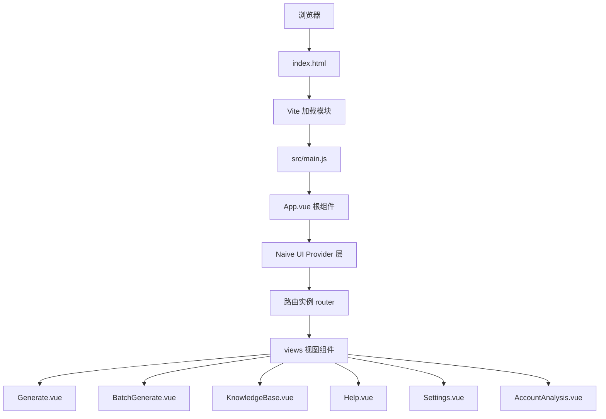
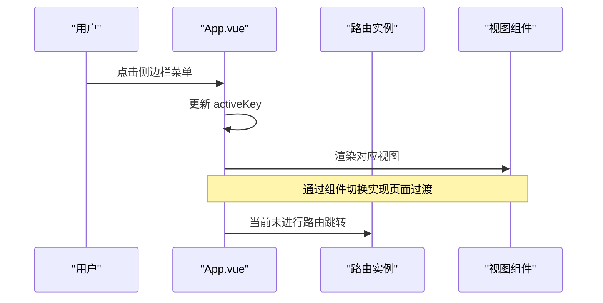
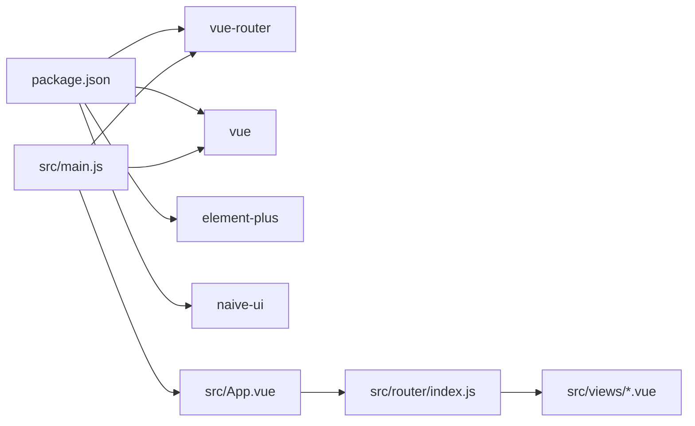

# 路由系统设计

<cite>
**本文引用的文件**
- [src/router/index.js](file://src/router/index.js)
- [frontend/src/router/index.js](file://frontend/src/router/index.js)
- [src/main.js](file://src/main.js)
- [frontend/src/main.js](file://frontend/src/main.js)
- [src/App.vue](file://src/App.vue)
- [src/views/Generate.vue](file://src/views/Generate.vue)
- [src/views/BatchGenerate.vue](file://src/views/BatchGenerate.vue)
- [src/views/KnowledgeBase.vue](file://src/views/KnowledgeBase.vue)
- [src/views/Help.vue](file://src/views/Help.vue)
- [src/views/Settings.vue](file://src/views/Settings.vue)
- [src/views/AccountAnalysis.vue](file://src/views/AccountAnalysis.vue)
- [vite.config.js](file://vite.config.js)
- [package.json](file://package.json)
- [index.html](file://index.html)
</cite>

## 目录
1. [引言](#引言)
2. [项目结构](#项目结构)
3. [核心组件](#核心组件)
4. [架构总览](#架构总览)
5. [详细组件分析](#详细组件分析)
6. [依赖关系分析](#依赖关系分析)
7. [性能考虑](#性能考虑)
8. [故障排查指南](#故障排查指南)
9. [结论](#结论)
10. [附录](#附录)

## 引言
本文件系统化梳理并深入解读本项目中 Vue Router 的路由体系设计与实现，重点覆盖以下方面：
- 路由结构设计：页面路由组织、嵌套路由与动态路由配置现状与扩展建议
- 导航守卫：路由拦截、权限控制与访问限制的实践路径
- 路由懒加载：代码分割与性能优化策略
- 参数传递与查询字符串：路由参数、查询参数与路由元信息的使用
- 路由动画与页面过渡：基于内置过渡与第三方 UI 库的动画配置
- 路由元信息与导航状态：如何利用 meta 字段与导航状态提升用户体验

## 项目结构
前端采用单页应用（SPA）架构，入口为根组件 App.vue，路由通过 Vue Router 进行集中管理。项目同时存在两套路由配置文件，分别位于 src 与 frontend/src 目录下，实际运行以 src 为主。

图表来源
- [src/main.js](file://src/main.js#L1-L16)
- [src/App.vue](file://src/App.vue#L1-L120)
- [src/router/index.js](file://src/router/index.js#L1-L26)

章节来源
- [src/router/index.js](file://src/router/index.js#L1-L26)
- [frontend/src/router/index.js](file://frontend/src/router/index.js#L1-L26)
- [src/main.js](file://src/main.js#L1-L16)
- [frontend/src/main.js](file://frontend/src/main.js#L1-L15)
- [src/App.vue](file://src/App.vue#L1-L120)

## 核心组件
- 路由实例与入口
  - 路由实例在 src/router/index.js 中创建，当前仅包含根路径 '/' 映射到 Generate 视图。
  - 应用入口在 src/main.js 中注册路由插件，随后挂载根组件 App.vue。
- 根组件与视图
  - App.vue 作为工作台容器，内部通过菜单切换 activeKey 控制不同视图的渲染，而非通过路由切换。
  - 视图组件位于 src/views 目录，包含 Generate、BatchGenerate、KnowledgeBase、Help、Settings、AccountAnalysis 等页面。

章节来源
- [src/router/index.js](file://src/router/index.js#L1-L26)
- [src/main.js](file://src/main.js#L1-L16)
- [src/App.vue](file://src/App.vue#L140-L254)
- [src/views/Generate.vue](file://src/views/Generate.vue#L1-L668)

## 架构总览
当前项目采用“菜单驱动视图切换 + 路由轻量配置”的混合模式：
- 菜单切换：App.vue 内部通过 activeKey 控制视图渲染，实现快速切换与无刷新体验。
- 路由配置：仅配置根路径 '/'，指向 Generate 页面；其余页面未通过路由直接访问。
- 动画与过渡：App.vue 使用 Vue transition 实现页面切换动画，配合 Naive UI Provider 提供全局消息与加载条等服务。

图表来源
- [src/App.vue](file://src/App.vue#L86-L98)
- [src/router/index.js](file://src/router/index.js#L9-L15)

章节来源
- [src/App.vue](file://src/App.vue#L86-L98)
- [src/router/index.js](file://src/router/index.js#L9-L15)

## 详细组件分析

### 路由配置与页面映射
- 当前路由仅包含根路径 '/'，指向 Generate 视图，未见嵌套路由与动态路由配置。
- 建议扩展点：
  - 新增页面路由：在 routes 数组中添加新的路由对象，如 '/batch'、'/knowledge'、'/help'、'/settings'、'/analysis'。
  - 嵌套路由：为工作台类页面（如 Generate）设置子路由，实现侧边栏与内容区域的联动。
  - 动态路由：使用路径参数（如 /user/:id）实现详情页或动态内容页。
  - 路由懒加载：将视图组件改为异步加载，结合 Vite 的动态导入实现代码分割。

章节来源
- [src/router/index.js](file://src/router/index.js#L9-L15)
- [src/views/BatchGenerate.vue](file://src/views/BatchGenerate.vue#L1-L200)
- [src/views/KnowledgeBase.vue](file://src/views/KnowledgeBase.vue#L1-L186)
- [src/views/Help.vue](file://src/views/Help.vue#L1-L42)
- [src/views/Settings.vue](file://src/views/Settings.vue#L1-L200)
- [src/views/AccountAnalysis.vue](file://src/views/AccountAnalysis.vue#L1-L84)

### 导航守卫与权限控制
- 现状：当前路由配置未使用导航守卫（前置守卫、后置守卫、独享守卫）。
- 实施建议：
  - 前置守卫：在进入路由前检查登录状态与权限，未满足条件则跳转至登录页或提示。
  - 独享守卫：针对特定路由（如付费功能）进行访问限制。
  - 后置守卫：用于统计埋点或页面标题更新。
- 路由元信息：通过 route.meta 字段承载页面标题、权限标识、面包屑等信息，便于守卫与 UI 组件统一消费。

章节来源
- [src/router/index.js](file://src/router/index.js#L9-L15)

### 路由懒加载与性能优化
- 现状：当前路由未启用懒加载，视图组件以静态导入方式加载。
- 优化策略：
  - 使用动态导入实现按需加载：将组件定义为异步函数，结合 Vite 的动态导入实现代码分割。
  - 结合路由懒加载与路由分块：为高频页面单独拆分包，降低首屏体积。
  - 预加载与预取：对用户可能访问的下一个页面进行预加载，提升切换流畅度。
- Vite 配置：项目已配置别名与代理，便于模块解析与 API 请求转发，构建阶段可进一步优化打包策略。

章节来源
- [src/router/index.js](file://src/router/index.js#L6-L14)
- [vite.config.js](file://vite.config.js#L1-L37)

### 参数传递与查询字符串处理
- 路由参数：通过动态路由参数（如 /user/:id）传递标识符，可在组件内通过 $route.params 获取。
- 查询参数：通过 URL 查询串（如 ?q=xxx&tab=home）传递筛选条件，可通过 $route.query 获取。
- 路由元信息：通过 route.meta 传递页面标题、权限、面包屑等元数据，便于统一渲染与守卫判断。
- 实践建议：在路由配置中明确参数与查询参数的用途，避免滥用；在组件中统一处理参数变更与副作用。

章节来源
- [src/router/index.js](file://src/router/index.js#L9-L15)

### 路由动画与页面过渡
- 页面切换动画：App.vue 使用 Vue transition 实现视图切换的淡入淡出与位移动画，提升用户体验。
- 全局加载条：通过 Naive UI 的 Loading Bar Provider 在路由切换时显示加载进度。
- 建议：若引入路由级动画，可结合路由元信息控制不同页面的过渡效果，或在路由钩子中注入动画类名。

章节来源
- [src/App.vue](file://src/App.vue#L16-L96)
- [src/App.vue](file://src/App.vue#L104-L107)

### 导航状态与菜单联动
- 当前实现：App.vue 通过 activeKey 控制视图渲染，菜单项与视图之间通过事件绑定实现联动。
- 建议：将菜单状态与路由状态解耦但保持一致，既保留菜单切换的即时性，又能在需要时通过路由访问具体页面。

章节来源
- [src/App.vue](file://src/App.vue#L209-L253)

## 依赖关系分析
- 路由依赖：App.vue 依赖路由实例进行视图切换；路由实例依赖各视图组件。
- 第三方依赖：项目使用 Naive UI 提供全局 Provider 与 UI 组件，Element Plus 在 frontend/src 项目中使用。
- 构建与开发：Vite 提供开发服务器与模块解析，支持热更新与代理；package.json 指定 Vue 与 Vue Router 版本。

图表来源
- [package.json](file://package.json#L15-L31)
- [src/main.js](file://src/main.js#L4-L13)
- [src/router/index.js](file://src/router/index.js#L6-L22)
- [src/App.vue](file://src/App.vue#L110-L154)

章节来源
- [package.json](file://package.json#L15-L31)
- [src/main.js](file://src/main.js#L4-L13)
- [src/router/index.js](file://src/router/index.js#L6-L22)
- [src/App.vue](file://src/App.vue#L110-L154)

## 性能考虑
- 代码分割：将大型视图组件改为异步加载，减少首屏 JavaScript 体积。
- 路由懒加载：结合路由配置实现按需加载，降低初始包大小。
- 虚拟滚动与资源优化：在长列表与图片场景中采用虚拟滚动与懒加载，结合 WebP 等格式优化资源。
- 构建优化：启用 Gzip 压缩与合适的打包策略，减少网络传输时间。

## 故障排查指南
- 路由不生效
  - 检查路由实例是否正确注册到应用：确保在 main.js 中调用 app.use(router)。
  - 确认路由配置中的路径与组件是否正确映射。
- 页面切换无动画
  - 检查 App.vue 中的 transition 配置与类名是否正确。
  - 确认未被全局样式覆盖导致动画失效。
- 菜单与路由状态不一致
  - 若引入路由访问，需保证菜单 activeKey 与路由路径同步更新。
- 构建或开发问题
  - 检查 Vite 配置中的别名与代理是否正确，确保模块解析与 API 请求正常。

章节来源
- [src/main.js](file://src/main.js#L10-L13)
- [src/App.vue](file://src/App.vue#L16-L96)
- [vite.config.js](file://vite.config.js#L30-L35)

## 结论
本项目当前采用“菜单驱动视图切换 + 轻量路由配置”的混合架构，兼顾了交互流畅性与实现简洁性。为进一步提升可维护性与可扩展性，建议：
- 补充完整页面路由，引入嵌套路由与动态路由
- 配置导航守卫与路由元信息，强化权限控制与导航状态管理
- 实施路由懒加载与代码分割，优化首屏性能
- 在需要时引入路由级动画与过渡，统一用户体验

## 附录
- 快速对照
  - 路由配置位置：src/router/index.js
  - 应用入口与路由注册：src/main.js
  - 根组件与视图切换：src/App.vue
  - 视图组件清单：src/views 下各页面组件
  - 构建与开发配置：vite.config.js、package.json