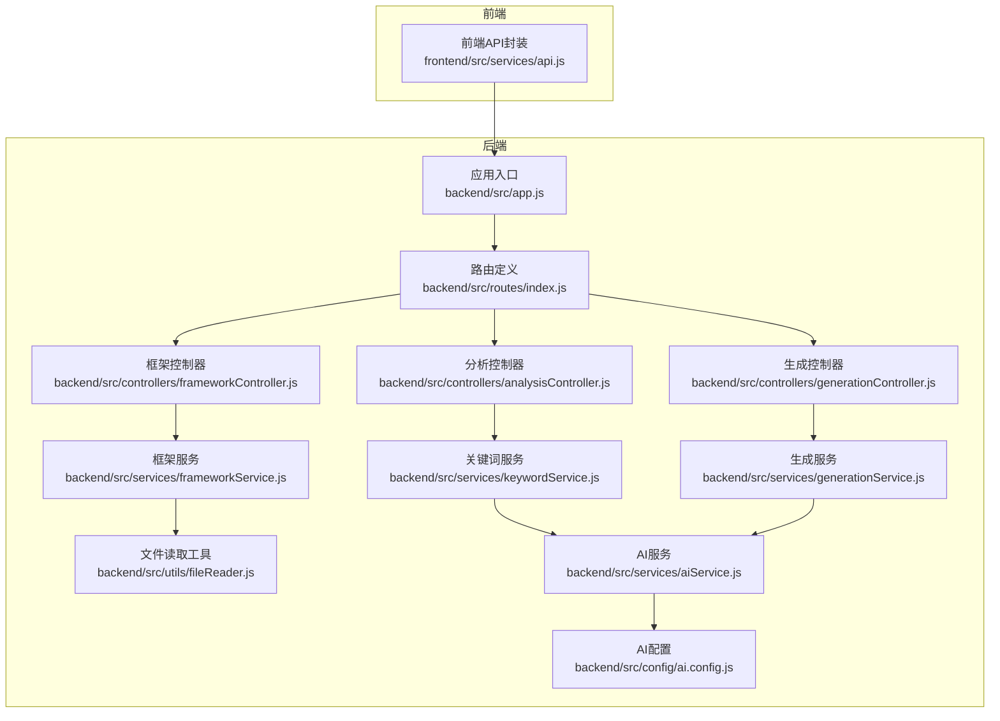
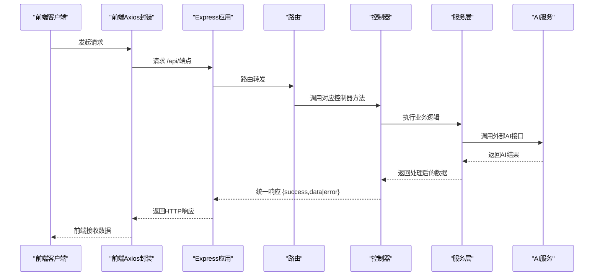
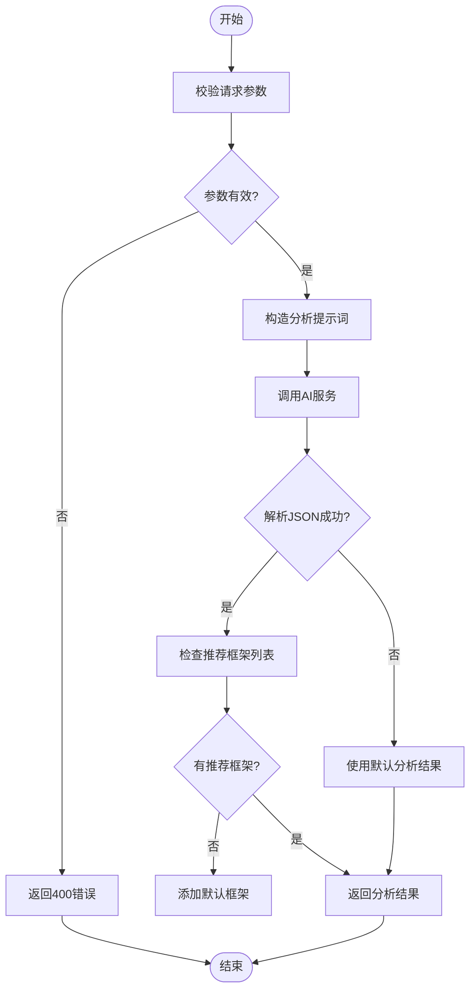
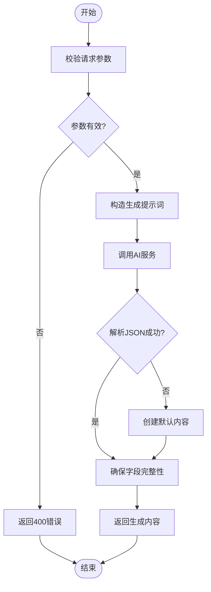
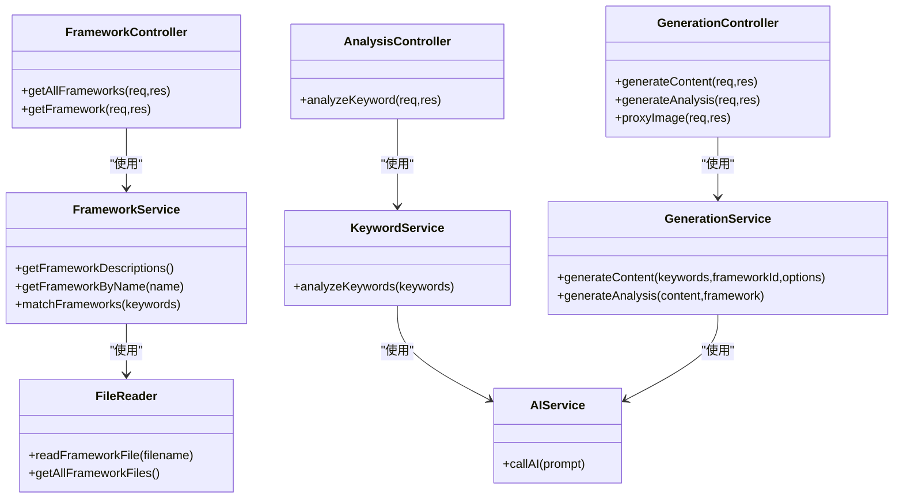
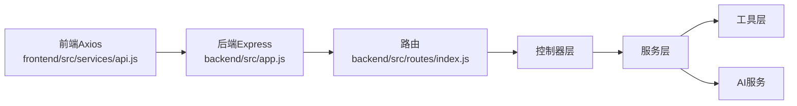

# API设计规范

<cite>
**本文引用的文件**
- [后端应用入口 app.js](file://backend/src/app.js)
- [路由定义 index.js](file://backend/src/routes/index.js)
- [框架控制器 frameworkController.js](file://backend/src/controllers/frameworkController.js)
- [分析控制器 analysisController.js](file://backend/src/controllers/analysisController.js)
- [生成控制器 generationController.js](file://backend/src/controllers/generationController.js)
- [框架服务 frameworkService.js](file://backend/src/services/frameworkService.js)
- [关键词服务 keywordService.js](file://backend/src/services/keywordService.js)
- [生成服务 generationService.js](file://backend/src/services/generationService.js)
- [文件读取工具 fileReader.js](file://backend/src/utils/fileReader.js)
- [AI服务 aiService.js](file://backend/src/services/aiService.js)
- [AI配置 ai.config.js](file://backend/src/config/ai.config.js)
- [后端包配置 package.json](file://backend/package.json)
- [后端环境示例 .env.example](file://backend/.env.example)
- [前端API封装 api.js](file://frontend/src/services/api.js)
</cite>

## 目录
1. [简介](#简介)
2. [项目结构](#项目结构)
3. [核心组件](#核心组件)
4. [架构总览](#架构总览)
5. [详细组件分析](#详细组件分析)
6. [依赖关系分析](#依赖关系分析)
7. [性能考虑](#性能考虑)
8. [故障排查指南](#故障排查指南)
9. [结论](#结论)
10. [附录](#附录)

## 简介
本文件为“小红书文案生成工具”项目的后端API设计规范，系统性阐述RESTful API设计原则与路由组织结构，详细说明各端点功能、HTTP方法、URL模式与参数规范；文档化统一的请求/响应格式、错误处理策略与状态码定义；涵盖身份验证机制、CORS配置与跨域处理方案；提供API版本管理策略与向后兼容性建议；并给出实际调用示例与最佳实践指导。

## 项目结构
后端采用Express框架，遵循“路由-控制器-服务-工具”的分层架构：
- 应用入口负责中间件与路由挂载
- 路由集中定义API端点
- 控制器处理请求参数校验与响应格式
- 服务层封装业务逻辑与外部调用
- 工具模块提供通用能力（如文件读取）

图表来源
- [后端应用入口 app.js](file://backend/src/app.js#L1-L26)
- [路由定义 index.js](file://backend/src/routes/index.js#L1-L21)
- [框架控制器 frameworkController.js](file://backend/src/controllers/frameworkController.js#L1-L49)
- [分析控制器 analysisController.js](file://backend/src/controllers/analysisController.js#L1-L37)
- [生成控制器 generationController.js](file://backend/src/controllers/generationController.js#L1-L100)
- [框架服务 frameworkService.js](file://backend/src/services/frameworkService.js#L1-L64)
- [关键词服务 keywordService.js](file://backend/src/services/keywordService.js#L1-L85)
- [生成服务 generationService.js](file://backend/src/services/generationService.js#L1-L194)
- [文件读取工具 fileReader.js](file://backend/src/utils/fileReader.js#L1-L49)
- [AI服务 aiService.js](file://backend/src/services/aiService.js#L1-L55)
- [AI配置 ai.config.js](file://backend/src/config/ai.config.js#L1-L18)
- [前端API封装 api.js](file://frontend/src/services/api.js#L1-L40)

章节来源
- [后端应用入口 app.js](file://backend/src/app.js#L1-L26)
- [路由定义 index.js](file://backend/src/routes/index.js#L1-L21)

## 核心组件
- 应用入口与中间件
  - 启用CORS并限制来源
  - 解析JSON请求体
  - 将所有API路由前缀统一为 /api
- 路由层
  - 集中式声明端点，便于版本化与维护
- 控制器层
  - 参数校验与错误处理
  - 统一响应结构 { success, data|error }
- 服务层
  - 关键词分析、内容生成、框架匹配
  - 对外AI服务调用与降级策略
- 工具层
  - 框架文档读取与解析

章节来源
- [后端应用入口 app.js](file://backend/src/app.js#L1-L26)
- [路由定义 index.js](file://backend/src/routes/index.js#L1-L21)
- [框架控制器 frameworkController.js](file://backend/src/controllers/frameworkController.js#L1-L49)
- [分析控制器 analysisController.js](file://backend/src/controllers/analysisController.js#L1-L37)
- [生成控制器 generationController.js](file://backend/src/controllers/generationController.js#L1-L100)
- [框架服务 frameworkService.js](file://backend/src/services/frameworkService.js#L1-L64)
- [关键词服务 keywordService.js](file://backend/src/services/keywordService.js#L1-L85)
- [生成服务 generationService.js](file://backend/src/services/generationService.js#L1-L194)
- [文件读取工具 fileReader.js](file://backend/src/utils/fileReader.js#L1-L49)
- [AI服务 aiService.js](file://backend/src/services/aiService.js#L1-L55)

## 架构总览
后端API采用RESTful风格，统一前缀 /api，结合Express Router组织端点。前端通过Axios封装统一基础路径，后端通过CORS允许指定来源访问。AI能力通过独立服务封装，具备降级与容错处理。

图表来源
- [后端应用入口 app.js](file://backend/src/app.js#L1-L26)
- [路由定义 index.js](file://backend/src/routes/index.js#L1-L21)
- [前端API封装 api.js](file://frontend/src/services/api.js#L1-L40)
- [AI服务 aiService.js](file://backend/src/services/aiService.js#L1-L55)

## 详细组件分析

### 路由与端点定义
- 基础路径：/api
- 端点一览
  - GET /api/frameworks：获取所有框架描述
  - GET /api/frameworks/:name：按名称获取框架详情
  - POST /api/analyze：关键词分析
  - POST /api/generate：基于关键词与框架生成内容
  - POST /api/generate/analysis：对已生成内容进行质量分析
  - GET /api/proxy-image：图片下载代理（解决前端跨域）

章节来源
- [路由定义 index.js](file://backend/src/routes/index.js#L1-L21)

### 统一响应与错误处理
- 成功响应结构
  - { success: true, data: any }
- 失败响应结构
  - { success: false, error: string }
- 状态码策略
  - 200：正常响应
  - 400：缺少必要参数或参数非法
  - 404：资源不存在
  - 500：服务器内部错误或外部服务异常

章节来源
- [框架控制器 frameworkController.js](file://backend/src/controllers/frameworkController.js#L1-L49)
- [分析控制器 analysisController.js](file://backend/src/controllers/analysisController.js#L1-L37)
- [生成控制器 generationController.js](file://backend/src/controllers/generationController.js#L1-L100)

### CORS与跨域处理
- 后端启用CORS并允许指定来源
- 前端Axios基础路径为 /api，避免显式写死后端域名
- 图片代理端点提供跨域下载能力

章节来源
- [后端应用入口 app.js](file://backend/src/app.js#L1-L26)
- [生成控制器 generationController.js](file://backend/src/controllers/generationController.js#L66-L94)
- [后端环境示例 .env.example](file://backend/.env.example#L1-L3)

### 身份验证机制
- 当前实现未包含认证中间件
- 建议在路由层引入鉴权中间件，或在网关层统一处理
- JWT/Session等方案需配合安全头与HTTPS部署

章节来源
- [后端应用入口 app.js](file://backend/src/app.js#L1-L26)
- [路由定义 index.js](file://backend/src/routes/index.js#L1-L21)

### API端点详解

#### 获取所有框架描述
- 方法：GET
- 路径：/api/frameworks
- 请求参数：无
- 响应：success + frameworks数组（包含id、name、title、description等）
- 错误：500（读取框架文件异常时）

章节来源
- [路由定义 index.js](file://backend/src/routes/index.js#L11-L11)
- [框架控制器 frameworkController.js](file://backend/src/controllers/frameworkController.js#L8-L21)
- [框架服务 frameworkService.js](file://backend/src/services/frameworkService.js#L10-L26)

#### 按名称获取框架详情
- 方法：GET
- 路径：/api/frameworks/:name
- 路径参数：name（框架文件名或名称）
- 响应：success + framework对象；若不存在返回404
- 错误：404（未找到）、500（内部错误）

章节来源
- [路由定义 index.js](file://backend/src/routes/index.js#L12-L12)
- [框架控制器 frameworkController.js](file://backend/src/controllers/frameworkController.js#L23-L45)
- [框架服务 frameworkService.js](file://backend/src/services/frameworkService.js#L39-L42)

#### 关键词分析
- 方法：POST
- 路径：/api/analyze
- 请求体：{ keywords: string }
- 响应：success + 分析结果（包含意图、主题、受众、推荐框架等）
- 错误：400（缺少keywords）、500（AI服务异常）

章节来源
- [路由定义 index.js](file://backend/src/routes/index.js#L13-L13)
- [分析控制器 analysisController.js](file://backend/src/controllers/analysisController.js#L6-L30)
- [关键词服务 keywordService.js](file://backend/src/services/keywordService.js#L39-L84)

#### 生成内容
- 方法：POST
- 路径：/api/generate
- 请求体：{ keywords: string|string[], frameworkId: string }
- 响应：success + 内容对象（包含title、body、images、tags等）
- 错误：400（缺少keywords或frameworkId）、500（AI服务异常）

章节来源
- [路由定义 index.js](file://backend/src/routes/index.js#L14-L14)
- [生成控制器 generationController.js](file://backend/src/controllers/generationController.js#L10-L33)
- [生成服务 generationService.js](file://backend/src/services/generationService.js#L64-L94)

#### 生成内容质量分析
- 方法：POST
- 路径：/api/generate/analysis
- 请求体：{ content: object, frameworkId: string }
- 响应：success + 质量分析（包含钩子、框架、结构、吸引力评分等）
- 错误：400（缺少content或frameworkId）、500（AI服务异常）

章节来源
- [路由定义 index.js](file://backend/src/routes/index.js#L15-L15)
- [生成控制器 generationController.js](file://backend/src/controllers/generationController.js#L35-L64)
- [生成服务 generationService.js](file://backend/src/services/generationService.js#L114-L162)

#### 图片下载代理
- 方法：GET
- 路径：/api/proxy-image?url=...
- 查询参数：url（目标图片地址）
- 响应：图片流（自动转发原始Content-Type），设置跨域头
- 错误：400（缺少url）、500（代理失败）

章节来源
- [路由定义 index.js](file://backend/src/routes/index.js#L16-L16)
- [生成控制器 generationController.js](file://backend/src/controllers/generationController.js#L69-L94)

### 数据模型与流程

#### 关键词分析流程

图表来源
- [分析控制器 analysisController.js](file://backend/src/controllers/analysisController.js#L6-L30)
- [关键词服务 keywordService.js](file://backend/src/services/keywordService.js#L39-L84)

#### 内容生成流程

图表来源
- [生成控制器 generationController.js](file://backend/src/controllers/generationController.js#L10-L33)
- [生成服务 generationService.js](file://backend/src/services/generationService.js#L64-L112)

### 类关系图（代码级）

图表来源
- [框架控制器 frameworkController.js](file://backend/src/controllers/frameworkController.js#L1-L49)
- [分析控制器 analysisController.js](file://backend/src/controllers/analysisController.js#L1-L37)
- [生成控制器 generationController.js](file://backend/src/controllers/generationController.js#L1-L100)
- [框架服务 frameworkService.js](file://backend/src/services/frameworkService.js#L1-L64)
- [关键词服务 keywordService.js](file://backend/src/services/keywordService.js#L1-L85)
- [生成服务 generationService.js](file://backend/src/services/generationService.js#L1-L194)
- [文件读取工具 fileReader.js](file://backend/src/utils/fileReader.js#L1-L49)
- [AI服务 aiService.js](file://backend/src/services/aiService.js#L1-L55)

## 依赖关系分析
- Express中间件链：CORS -> JSON解析 -> 路由 -> 控制器 -> 服务 -> 工具
- 外部依赖：axios用于HTTP调用，dotenv用于环境变量，cors用于跨域
- 前后端通信：前端Axios基础路径为 /api，后端统一挂载在 /api

图表来源
- [后端应用入口 app.js](file://backend/src/app.js#L1-L26)
- [前端API封装 api.js](file://frontend/src/services/api.js#L1-L40)
- [后端包配置 package.json](file://backend/package.json#L1-L17)

章节来源
- [后端包配置 package.json](file://backend/package.json#L1-L17)
- [后端应用入口 app.js](file://backend/src/app.js#L1-L26)
- [前端API封装 api.js](file://frontend/src/services/api.js#L1-L40)

## 性能考虑
- 请求超时与重试
  - Axios默认超时时间可在前端封装中配置
  - 后端AI调用设置合理超时，避免阻塞线程
- 流式响应
  - 图片代理采用流式传输，减少内存占用
- 缓存策略
  - 对静态框架描述可增加缓存，降低文件读取开销
- 并发控制
  - 对外部AI接口进行限流与熔断，防止雪崩效应

## 故障排查指南
- 常见错误定位
  - 400错误：检查请求体字段是否缺失或类型不符
  - 404错误：确认资源是否存在或路径拼写
  - 500错误：查看后端日志与AI服务返回
- CORS问题
  - 确认后端CORS允许的来源与前端基础路径一致
- 图片代理失败
  - 检查目标URL可达性与响应头Content-Type
- AI服务异常
  - 核对API密钥、模型名称与网络连通性

章节来源
- [生成控制器 generationController.js](file://backend/src/controllers/generationController.js#L69-L94)
- [AI服务 aiService.js](file://backend/src/services/aiService.js#L14-L53)

## 结论
本API设计遵循RESTful原则，采用分层架构与统一响应格式，具备良好的可维护性与扩展性。当前实现未包含认证与细粒度权限控制，建议在后续版本中引入鉴权中间件与更完善的错误分类。通过合理的超时与降级策略，可进一步提升系统的稳定性与用户体验。

## 附录

### API版本管理与向后兼容
- 版本策略
  - 在基础路径中加入版本号：/api/v1/端点
  - 保持现有端点不变，新增v2端点以提供改进功能
- 向后兼容
  - 修改仅影响新增字段或非关键行为
  - 严格遵守语义化版本控制，重大变更升级主版本

### 最佳实践
- 前端调用
  - 使用统一的Axios实例，设置基础路径与超时
  - 对必填参数进行前端校验，减少无效请求
- 后端健壮性
  - 对外部服务调用增加超时与重试
  - 记录关键错误日志，便于追踪
- 安全加固
  - 引入鉴权中间件与HTTPS
  - 对敏感参数进行脱敏与白名单校验