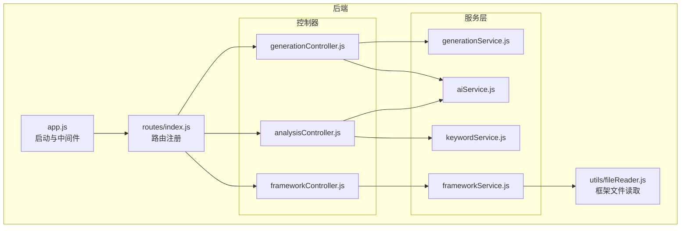
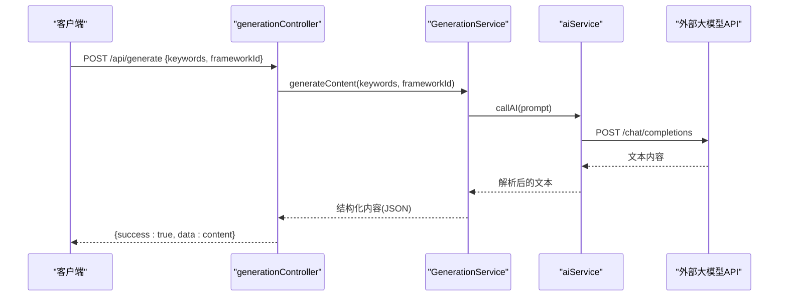
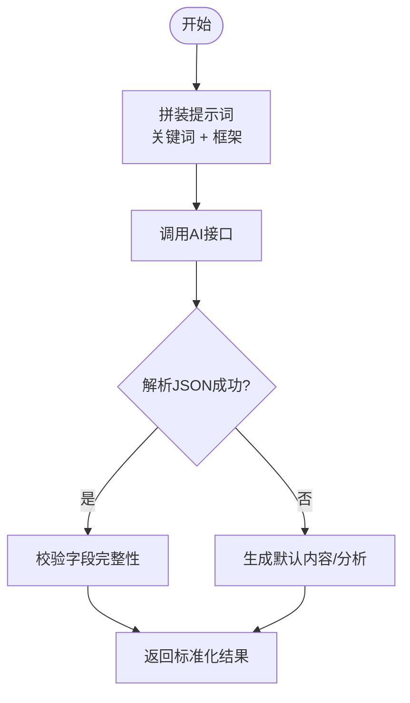
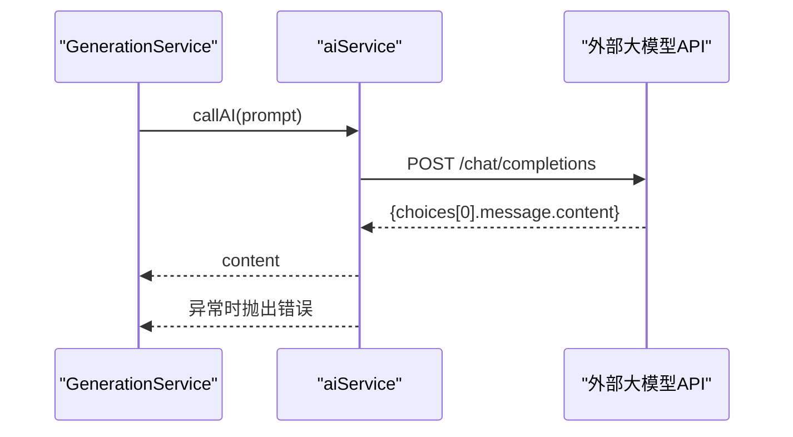
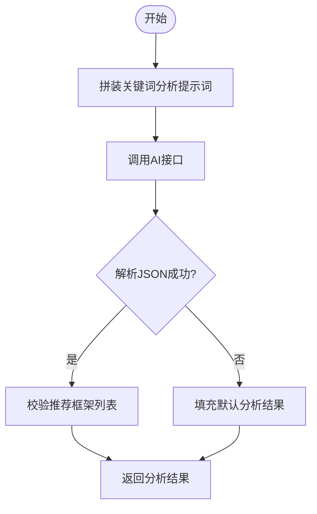
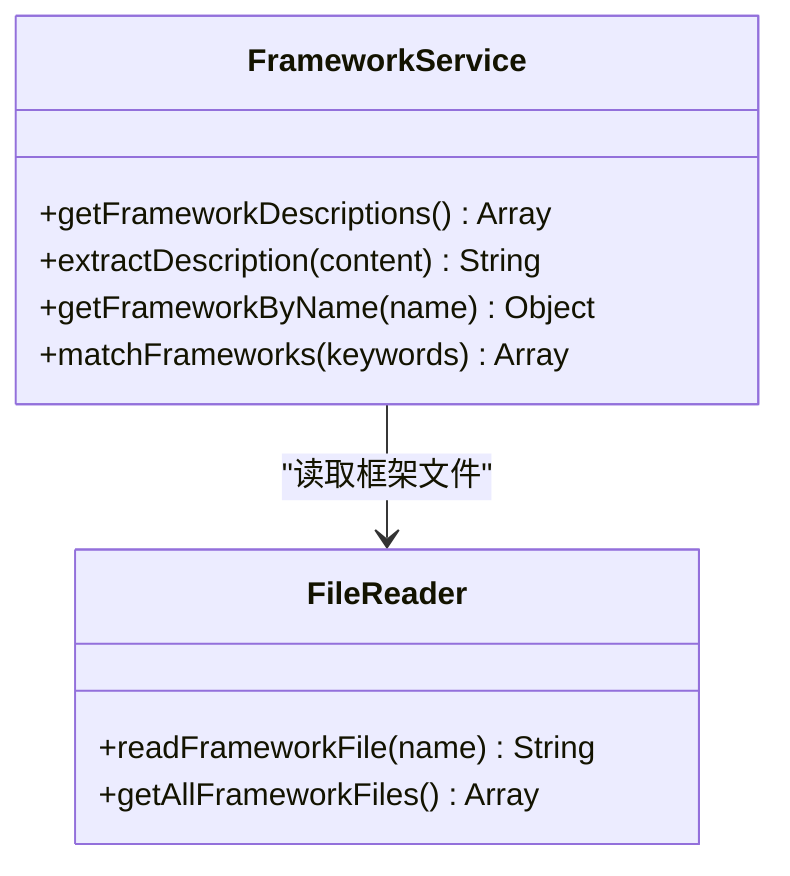
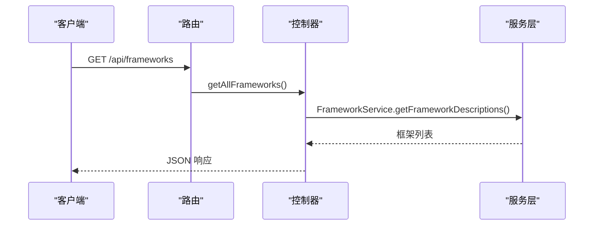
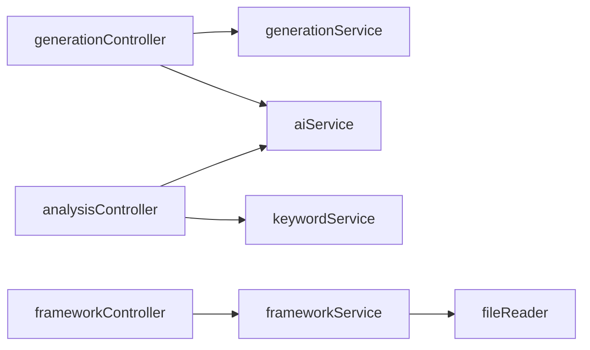

# 业务逻辑层

<cite>
**本文引用的文件**
- [backend/src/services/generationService.js](file://backend/src/services/generationService.js)
- [backend/src/services/aiService.js](file://backend/src/services/aiService.js)
- [backend/src/services/keywordService.js](file://backend/src/services/keywordService.js)
- [backend/src/services/frameworkService.js](file://backend/src/services/frameworkService.js)
- [backend/src/controllers/generationController.js](file://backend/src/controllers/generationController.js)
- [backend/src/controllers/analysisController.js](file://backend/src/controllers/analysisController.js)
- [backend/src/controllers/frameworkController.js](file://backend/src/controllers/frameworkController.js)
- [backend/src/routes/index.js](file://backend/src/routes/index.js)
- [backend/src/utils/fileReader.js](file://backend/src/utils/fileReader.js)
- [backend/src/config/ai.config.js](file://backend/src/config/ai.config.js)
- [backend/src/app.js](file://backend/src/app.js)
- [小红书爆款框架.md](file://小红书爆款框架.md)
- [SCQA模型框架.md](file://SCQA模型框架.md)
</cite>

## 目录
1. [引言](#引言)
2. [项目结构](#项目结构)
3. [核心组件](#核心组件)
4. [架构总览](#架构总览)
5. [详细组件分析](#详细组件分析)
6. [依赖关系分析](#依赖关系分析)
7. [性能考量](#性能考量)
8. [故障排查指南](#故障排查指南)
9. [结论](#结论)
10. [附录](#附录)

## 引言
本文件聚焦于业务逻辑层（服务层）的设计与实现，系统梳理 generationService、aiService、keywordService、frameworkService 的职责边界、数据流与控制流，深入解析 AI 内容生成算法、质量分析流程与框架应用机制，说明外部 API 集成策略（大模型调用、流式数据处理与错误重试），并给出业务规则、数据校验与异常处理的最佳实践路径与可视化图示。

## 项目结构
后端采用“控制器-服务-工具”分层，服务层封装核心业务逻辑，控制器负责请求参数校验与响应封装，路由统一暴露 REST 接口；框架元数据通过本地 Markdown 文件管理，由工具模块读取并注入服务层。

图表来源
- [backend/src/app.js](file://backend/src/app.js#L1-L26)
- [backend/src/routes/index.js](file://backend/src/routes/index.js#L1-L21)
- [backend/src/controllers/generationController.js](file://backend/src/controllers/generationController.js#L1-L100)
- [backend/src/controllers/analysisController.js](file://backend/src/controllers/analysisController.js#L1-L37)
- [backend/src/controllers/frameworkController.js](file://backend/src/controllers/frameworkController.js#L1-L49)
- [backend/src/services/generationService.js](file://backend/src/services/generationService.js#L1-L194)
- [backend/src/services/aiService.js](file://backend/src/services/aiService.js#L1-L55)
- [backend/src/services/keywordService.js](file://backend/src/services/keywordService.js#L1-L85)
- [backend/src/services/frameworkService.js](file://backend/src/services/frameworkService.js#L1-L64)
- [backend/src/utils/fileReader.js](file://backend/src/utils/fileReader.js#L1-L49)

章节来源
- [backend/src/app.js](file://backend/src/app.js#L1-L26)
- [backend/src/routes/index.js](file://backend/src/routes/index.js#L1-L21)

## 核心组件
- generationService：负责内容生成与质量分析，内置提示词模板与回退策略，确保输出结构化且可用。
- aiService：封装外部大模型调用，统一鉴权、超时与错误处理。
- keywordService：对关键词进行意图、主题、受众与框架匹配分析，返回推荐框架列表。
- frameworkService：读取本地框架文档，抽取描述与标题，提供匹配与检索能力。

章节来源
- [backend/src/services/generationService.js](file://backend/src/services/generationService.js#L1-L194)
- [backend/src/services/aiService.js](file://backend/src/services/aiService.js#L1-L55)
- [backend/src/services/keywordService.js](file://backend/src/services/keywordService.js#L1-L85)
- [backend/src/services/frameworkService.js](file://backend/src/services/frameworkService.js#L1-L64)

## 架构总览
服务层围绕“提示词工程 + 大模型调用 + 结构化解析 + 回退策略”的闭环展开，控制器仅承担参数校验与响应封装，保证服务层的纯业务性与可测试性。

图表来源
- [backend/src/controllers/generationController.js](file://backend/src/controllers/generationController.js#L10-L33)
- [backend/src/services/generationService.js](file://backend/src/services/generationService.js#L63-L94)
- [backend/src/services/aiService.js](file://backend/src/services/aiService.js#L14-L53)

## 详细组件分析

### generationService：内容生成与质量分析
- 设计模式
  - 单例风格静态方法：集中管理提示词与业务流程，便于控制器直接调用。
  - 回退策略：当大模型返回非 JSON 或异常时，生成默认内容/分析，保证可用性。
- 核心流程
  - 生成内容：拼装提示词，调用外部 AI，解析 JSON，补全缺失字段，返回标准化内容。
  - 质量分析：基于内容与框架生成分析报告，包含钩子、框架、结构与吸引力评分。
- 数据结构与复杂度
  - 输入：keywords（字符串或数组）、frameworkId（字符串）
  - 输出：内容对象（title/body/images/tags）与分析对象（hook/framework/structure/appeal）
  - 复杂度：生成与分析均为 O(n)（n 为提示词长度与内容长度），回退为 O(1)。
- 错误处理
  - 大模型异常捕获并记录，触发回退；JSON 解析失败时构造默认结构。
- 业务规则
  - 标题长度约束、正文分段与 emoji 使用建议、图片类型与风格规范、标签数量与相关性要求。
  - 分析评分维度：情感、实用、行动引导与综合评价。

图表来源
- [backend/src/services/generationService.js](file://backend/src/services/generationService.js#L63-L112)
- [backend/src/services/generationService.js](file://backend/src/services/generationService.js#L114-L162)

章节来源
- [backend/src/services/generationService.js](file://backend/src/services/generationService.js#L1-L194)

### aiService：外部API集成策略
- 外部集成
  - 基础地址、模型与端点来自配置；统一鉴权头与请求头设置。
  - 请求超时控制，避免阻塞；响应体解析与空内容校验。
- 流式数据处理
  - 当前实现为非流式（stream=false），若需升级为流式，可在请求参数中启用并按事件驱动处理。
- 错误重试机制
  - 当前未实现自动重试；建议在调用方（如 generationService）增加指数退避重试与最大次数限制。
- 安全与合规
  - 鉴权头动态注入，避免硬编码泄露；设置 HTTP-Referer 与 X-Title 以满足第三方路由要求。

图表来源
- [backend/src/services/aiService.js](file://backend/src/services/aiService.js#L14-L53)
- [backend/src/config/ai.config.js](file://backend/src/config/ai.config.js#L6-L17)

章节来源
- [backend/src/services/aiService.js](file://backend/src/services/aiService.js#L1-L55)
- [backend/src/config/ai.config.js](file://backend/src/config/ai.config.js#L1-L18)

### keywordService：关键词提取与分析算法
- 任务目标
  - 解析关键词意图、确定主题、识别受众、推荐匹配框架。
- 算法要点
  - 基于预设框架集合与关键词匹配度排序，返回推荐框架列表与匹配分数。
  - 若解析失败或为空，回退到默认推荐（小红书爆款框架）。
- 输出结构
  - intent、topic、targetAudience、recommendedFrameworks（含 id/name/description/matchScore）。

图表来源
- [backend/src/services/keywordService.js](file://backend/src/services/keywordService.js#L39-L84)

章节来源
- [backend/src/services/keywordService.js](file://backend/src/services/keywordService.js#L1-L85)

### frameworkService：内容框架管理与应用逻辑
- 框架来源
  - 通过工具模块读取本地框架 Markdown 文件，支持多目录回退读取。
- 描述抽取
  - 从文件内容前若干字符中抽取首行标题与前若干行摘要，作为框架简介。
- 匹配算法
  - 将关键词转为小写集合，遍历框架内容统计命中词数，按匹配度排序返回。
- 控制器交互
  - 提供获取全部框架、按名称查询与按关键词匹配的接口。

图表来源
- [backend/src/services/frameworkService.js](file://backend/src/services/frameworkService.js#L9-L59)
- [backend/src/utils/fileReader.js](file://backend/src/utils/fileReader.js#L9-L45)

章节来源
- [backend/src/services/frameworkService.js](file://backend/src/services/frameworkService.js#L1-L64)
- [backend/src/utils/fileReader.js](file://backend/src/utils/fileReader.js#L1-L49)

### 控制器与路由：请求入口与响应封装
- generationController
  - generateContent：校验 keywords 与 frameworkId，调用服务层生成内容并返回 JSON。
  - generateAnalysis：接收 content 与 frameworkId，生成分析并返回。
  - proxyImage：解决前端图片跨域下载问题，透传响应头与流式数据。
- analysisController
  - analyzeKeyword：校验 keywords，调用 keywordService 返回分析结果。
- frameworkController
  - getAllFrameworks：返回所有框架描述。
  - getFramework：按名称查询框架详情。
- 路由注册
  - 统一挂载至 /api 前缀，暴露 GET/POST 接口。

图表来源
- [backend/src/routes/index.js](file://backend/src/routes/index.js#L11-L16)
- [backend/src/controllers/frameworkController.js](file://backend/src/controllers/frameworkController.js#L8-L21)

章节来源
- [backend/src/controllers/generationController.js](file://backend/src/controllers/generationController.js#L1-L100)
- [backend/src/controllers/analysisController.js](file://backend/src/controllers/analysisController.js#L1-L37)
- [backend/src/controllers/frameworkController.js](file://backend/src/controllers/frameworkController.js#L1-L49)
- [backend/src/routes/index.js](file://backend/src/routes/index.js#L1-L21)

## 依赖关系分析
- 服务层耦合
  - generationService 依赖 aiService；keywordService 依赖 aiService；frameworkService 依赖 fileReader。
- 控制器与服务层
  - 控制器仅依赖服务层接口，保持薄控制器与厚服务层的分层原则。
- 外部依赖
  - axios 用于 HTTP 请求；dotenv/cors 用于环境变量与跨域配置；Express 路由与中间件。

图表来源
- [backend/src/controllers/generationController.js](file://backend/src/controllers/generationController.js#L7-L8)
- [backend/src/controllers/analysisController.js](file://backend/src/controllers/analysisController.js#L4)
- [backend/src/controllers/frameworkController.js](file://backend/src/controllers/frameworkController.js#L6)
- [backend/src/services/generationService.js](file://backend/src/services/generationService.js#L1)
- [backend/src/services/keywordService.js](file://backend/src/services/keywordService.js#L2)
- [backend/src/services/frameworkService.js](file://backend/src/services/frameworkService.js#L7)

章节来源
- [backend/src/app.js](file://backend/src/app.js#L4-L24)
- [backend/src/routes/index.js](file://backend/src/routes/index.js#L4-L18)

## 性能考量
- 大模型调用
  - 合理设置超时与重试策略，避免阻塞；对高频请求考虑缓存热点关键词的分析结果。
- JSON 解析与回退
  - 生成与分析均包含 JSON 解析与回退逻辑，减少异常对用户体验的影响。
- 文件读取
  - 框架文件读取为同步 I/O，建议在应用启动时预加载并缓存，避免运行时重复读取。
- 响应头与流式传输
  - 图片代理使用流式传输，注意设置合适的超时与缓冲策略。

## 故障排查指南
- AI 服务调用失败
  - 检查鉴权头、基础 URL 与模型标识；确认网络连通性与第三方路由状态码。
  - 参考路径：[backend/src/services/aiService.js](file://backend/src/services/aiService.js#L14-L53)
- 生成内容为空或非 JSON
  - 查看提示词是否完整；检查大模型返回内容；确认回退逻辑是否生效。
  - 参考路径：[backend/src/services/generationService.js](file://backend/src/services/generationService.js#L63-L94)
- 关键词分析异常
  - 校验输入 keywords；确认 AI 返回 JSON；检查默认回退逻辑。
  - 参考路径：[backend/src/services/keywordService.js](file://backend/src/services/keywordService.js#L39-L84)
- 框架文件读取失败
  - 检查文件名与路径；确认回退读取逻辑；查看日志输出。
  - 参考路径：[backend/src/utils/fileReader.js](file://backend/src/utils/fileReader.js#L9-L45)
- 跨域与图片下载
  - 确认代理接口参数与响应头设置；检查第三方图片服务可用性。
  - 参考路径：[backend/src/controllers/generationController.js](file://backend/src/controllers/generationController.js#L69-L94)

章节来源
- [backend/src/services/aiService.js](file://backend/src/services/aiService.js#L1-L55)
- [backend/src/services/generationService.js](file://backend/src/services/generationService.js#L1-L194)
- [backend/src/services/keywordService.js](file://backend/src/services/keywordService.js#L1-L85)
- [backend/src/utils/fileReader.js](file://backend/src/utils/fileReader.js#L1-L49)
- [backend/src/controllers/generationController.js](file://backend/src/controllers/generationController.js#L1-L100)

## 结论
本业务逻辑层通过清晰的服务边界与稳健的回退策略，实现了从关键词到内容再到质量分析的完整链路。建议后续在 AI 调用层面引入流式处理与重试机制，在框架读取层面引入缓存与异步加载，进一步提升稳定性与性能。

## 附录
- 框架文档示例
  - 小红书爆款框架：[小红书爆款框架.md](file://小红书爆款框架.md#L1-L225)
  - SCQA 模型框架：[SCQA模型框架.md](file://SCQA模型框架.md#L1-L180)