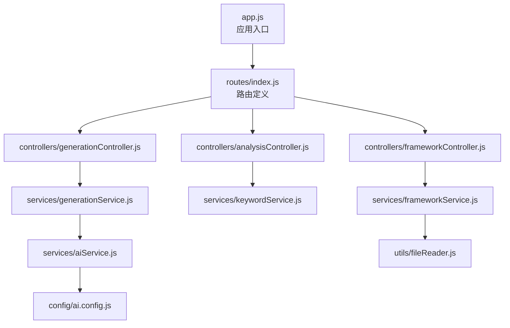
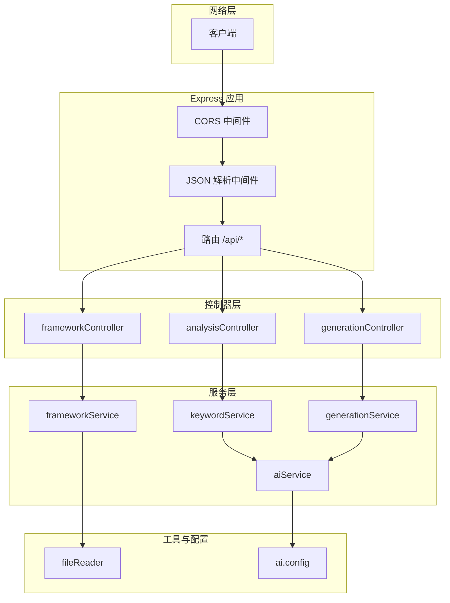
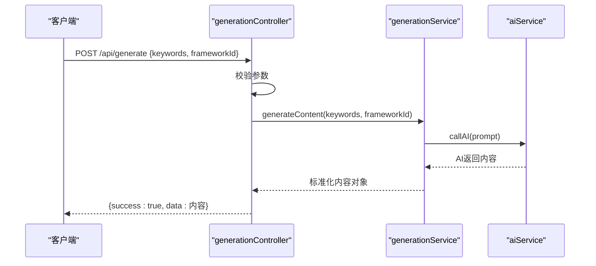
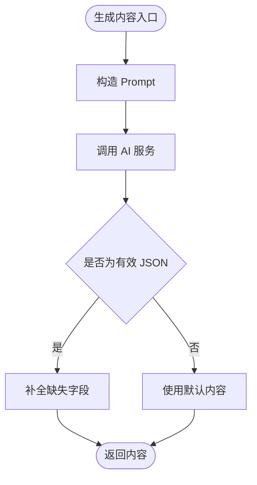
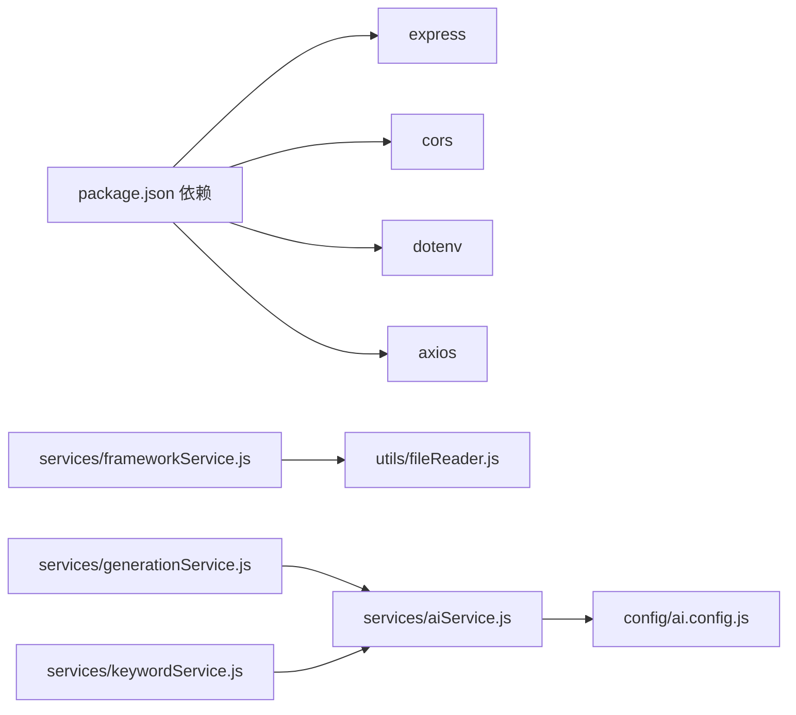

# 后端服务架构

<cite>
**本文引用的文件**
- [backend/src/app.js](file://backend/src/app.js)
- [backend/src/routes/index.js](file://backend/src/routes/index.js)
- [backend/src/controllers/frameworkController.js](file://backend/src/controllers/frameworkController.js)
- [backend/src/controllers/analysisController.js](file://backend/src/controllers/analysisController.js)
- [backend/src/controllers/generationController.js](file://backend/src/controllers/generationController.js)
- [backend/src/services/frameworkService.js](file://backend/src/services/frameworkService.js)
- [backend/src/services/aiService.js](file://backend/src/services/aiService.js)
- [backend/src/services/generationService.js](file://backend/src/services/generationService.js)
- [backend/src/services/keywordService.js](file://backend/src/services/keywordService.js)
- [backend/src/utils/fileReader.js](file://backend/src/utils/fileReader.js)
- [backend/src/config/ai.config.js](file://backend/src/config/ai.config.js)
- [backend/package.json](file://backend/package.json)
- [backend/.env.example](file://backend/.env.example)
- [README.md](file://README.md)
</cite>

## 目录
1. [简介](#简介)
2. [项目结构](#项目结构)
3. [核心组件](#核心组件)
4. [架构总览](#架构总览)
5. [详细组件分析](#详细组件分析)
6. [依赖关系分析](#依赖关系分析)
7. [性能考虑](#性能考虑)
8. [故障排查指南](#故障排查指南)
9. [结论](#结论)
10. [附录](#附录)

## 简介
本项目为小红书内容创作工作台的后端服务，基于 Node.js + Express 构建，提供 RESTful API，用于：
- 获取内容框架列表与详情
- 关键词分析与推荐
- 文案内容生成与质量分析
- 图片下载代理（解决跨域）

后端通过服务层封装业务逻辑与外部 AI 能力集成，控制器层负责请求处理与响应格式化，路由层统一暴露 /api 前缀接口。

## 项目结构
后端采用经典的 MVC 分层与模块化组织：
- app.js：应用入口，初始化 Express、中间件、CORS、路由挂载与端口监听
- routes/index.js：路由定义，映射到各控制器
- controllers/*：控制器层，处理请求参数、调用服务、返回标准化响应
- services/*：服务层，封装业务规则、AI 调用、数据处理与容错
- utils/*：工具类，如框架文件读取
- config/*：配置模块，集中管理 AI 服务配置
- package.json：依赖与脚本

图表来源
- [backend/src/app.js](file://backend/src/app.js#L1-L26)
- [backend/src/routes/index.js](file://backend/src/routes/index.js#L1-L21)
- [backend/src/controllers/frameworkController.js](file://backend/src/controllers/frameworkController.js#L1-L49)
- [backend/src/controllers/analysisController.js](file://backend/src/controllers/analysisController.js#L1-L37)
- [backend/src/controllers/generationController.js](file://backend/src/controllers/generationController.js#L1-L100)
- [backend/src/services/frameworkService.js](file://backend/src/services/frameworkService.js#L1-L64)
- [backend/src/services/aiService.js](file://backend/src/services/aiService.js#L1-L55)
- [backend/src/services/generationService.js](file://backend/src/services/generationService.js#L1-L194)
- [backend/src/services/keywordService.js](file://backend/src/services/keywordService.js#L1-L85)
- [backend/src/utils/fileReader.js](file://backend/src/utils/fileReader.js#L1-L49)
- [backend/src/config/ai.config.js](file://backend/src/config/ai.config.js#L1-L18)

章节来源
- [backend/src/app.js](file://backend/src/app.js#L1-L26)
- [backend/src/routes/index.js](file://backend/src/routes/index.js#L1-L21)

## 核心组件
- 应用入口与中间件
  - 初始化 Express，启用 CORS（可从环境变量配置），解析 JSON 请求体，挂载 /api 路由，监听端口
- 路由层
  - 提供 /api/frameworks（GET）、/api/frameworks/:name（GET）、/api/analyze（POST）、/api/generate（POST）、/api/generate/analysis（POST）、/api/proxy-image（GET）
- 控制器层
  - frameworkController：列举与查询框架；analysisController：关键词分析；generationController：内容生成、质量分析、图片代理
- 服务层
  - frameworkService：读取本地框架 Markdown 文件，提取描述与标题，匹配关键词并排序
  - keywordService：将关键词转为 AI Prompt，返回意图、主题、受众与推荐框架
  - generationService：组合 Prompt 与 AI 能力生成内容与分析，含降级策略
  - aiService：封装外部 AI API 调用，统一错误处理与超时控制
- 工具层
  - fileReader：读取框架文件，支持回退路径
- 配置层
  - ai.config：集中存放 AI 服务地址、模型、鉴权头等

章节来源
- [backend/src/app.js](file://backend/src/app.js#L1-L26)
- [backend/src/routes/index.js](file://backend/src/routes/index.js#L1-L21)
- [backend/src/controllers/frameworkController.js](file://backend/src/controllers/frameworkController.js#L1-L49)
- [backend/src/controllers/analysisController.js](file://backend/src/controllers/analysisController.js#L1-L37)
- [backend/src/controllers/generationController.js](file://backend/src/controllers/generationController.js#L1-L100)
- [backend/src/services/frameworkService.js](file://backend/src/services/frameworkService.js#L1-L64)
- [backend/src/services/aiService.js](file://backend/src/services/aiService.js#L1-L55)
- [backend/src/services/generationService.js](file://backend/src/services/generationService.js#L1-L194)
- [backend/src/services/keywordService.js](file://backend/src/services/keywordService.js#L1-L85)
- [backend/src/utils/fileReader.js](file://backend/src/utils/fileReader.js#L1-L49)
- [backend/src/config/ai.config.js](file://backend/src/config/ai.config.js#L1-L18)

## 架构总览
后端采用分层架构，职责清晰：
- 控制器层：仅处理请求与响应，不做业务判断
- 服务层：封装业务规则、调用 AI 与数据处理
- 工具层：通用能力复用
- 配置层：集中化外部服务配置

图表来源
- [backend/src/app.js](file://backend/src/app.js#L1-L26)
- [backend/src/routes/index.js](file://backend/src/routes/index.js#L1-L21)
- [backend/src/controllers/frameworkController.js](file://backend/src/controllers/frameworkController.js#L1-L49)
- [backend/src/controllers/analysisController.js](file://backend/src/controllers/analysisController.js#L1-L37)
- [backend/src/controllers/generationController.js](file://backend/src/controllers/generationController.js#L1-L100)
- [backend/src/services/frameworkService.js](file://backend/src/services/frameworkService.js#L1-L64)
- [backend/src/services/aiService.js](file://backend/src/services/aiService.js#L1-L55)
- [backend/src/services/generationService.js](file://backend/src/services/generationService.js#L1-L194)
- [backend/src/services/keywordService.js](file://backend/src/services/keywordService.js#L1-L85)
- [backend/src/utils/fileReader.js](file://backend/src/utils/fileReader.js#L1-L49)
- [backend/src/config/ai.config.js](file://backend/src/config/ai.config.js#L1-L18)

## 详细组件分析

### 路由与控制器层
- 路由组织
  - /api/frameworks：获取全部框架描述
  - /api/frameworks/:name：按名称获取框架
  - /api/analyze：关键词分析
  - /api/generate：生成内容
  - /api/generate/analysis：内容质量分析
  - /api/proxy-image：图片下载代理（解决跨域）
- 控制器职责
  - 参数校验与错误处理
  - 调用对应服务
  - 返回统一结构的 JSON 响应（success、data 或 error）

图表来源
- [backend/src/routes/index.js](file://backend/src/routes/index.js#L11-L16)
- [backend/src/controllers/generationController.js](file://backend/src/controllers/generationController.js#L10-L33)
- [backend/src/services/generationService.js](file://backend/src/services/generationService.js#L63-L94)
- [backend/src/services/aiService.js](file://backend/src/services/aiService.js#L14-L53)

章节来源
- [backend/src/routes/index.js](file://backend/src/routes/index.js#L1-L21)
- [backend/src/controllers/frameworkController.js](file://backend/src/controllers/frameworkController.js#L1-L49)
- [backend/src/controllers/analysisController.js](file://backend/src/controllers/analysisController.js#L1-L37)
- [backend/src/controllers/generationController.js](file://backend/src/controllers/generationController.js#L1-L100)

### 服务层设计与业务规则
- frameworkService
  - 读取框架 Markdown 文件，提取标题与描述
  - 基于关键词集合计算匹配分数并排序
- keywordService
  - 将关键词转为 AI Prompt，返回意图、主题、受众与推荐框架
  - 若 AI 返回非 JSON，回退为默认结构
- generationService
  - 组合 Prompt 生成内容与分析
  - 对 AI 返回内容进行 JSON 解析与字段补全
  - 失败时回退到默认内容与分析
- aiService
  - 统一封装外部 AI 调用，设置超时、鉴权头
  - 捕获错误并抛出可读异常

图表来源
- [backend/src/services/generationService.js](file://backend/src/services/generationService.js#L63-L112)
- [backend/src/services/aiService.js](file://backend/src/services/aiService.js#L14-L53)

章节来源
- [backend/src/services/frameworkService.js](file://backend/src/services/frameworkService.js#L1-L64)
- [backend/src/services/keywordService.js](file://backend/src/services/keywordService.js#L1-L85)
- [backend/src/services/generationService.js](file://backend/src/services/generationService.js#L1-L194)
- [backend/src/services/aiService.js](file://backend/src/services/aiService.js#L1-L55)

### 数据验证与异常处理
- 控制器层
  - 对必填参数进行校验，返回 400 错误
  - 捕获异常并返回 500，包含错误信息
- 服务层
  - 对 AI 返回内容进行 JSON 解析与字段校验
  - 回退策略确保响应结构稳定
- 工具层
  - 文件读取失败时记录日志并返回空结果，避免中断

章节来源
- [backend/src/controllers/analysisController.js](file://backend/src/controllers/analysisController.js#L6-L30)
- [backend/src/controllers/generationController.js](file://backend/src/controllers/generationController.js#L10-L33)
- [backend/src/services/generationService.js](file://backend/src/services/generationService.js#L63-L94)
- [backend/src/utils/fileReader.js](file://backend/src/utils/fileReader.js#L13-L26)

### AI 服务集成与配置管理
- 配置集中化
  - ai.config.js 统一存放 baseURL、apiKey、model、endpoint、headers
- 调用封装
  - aiService.callAI 封装 axios 请求，设置超时与鉴权头
- 业务集成
  - keywordService 与 generationService 通过 callAI 调用外部模型
- 安全与稳定性
  - 错误日志输出，响应状态与数据打印便于定位
  - 超时时间合理设置，避免阻塞请求

章节来源
- [backend/src/config/ai.config.js](file://backend/src/config/ai.config.js#L1-L18)
- [backend/src/services/aiService.js](file://backend/src/services/aiService.js#L1-L55)
- [backend/src/services/keywordService.js](file://backend/src/services/keywordService.js#L1-L85)
- [backend/src/services/generationService.js](file://backend/src/services/generationService.js#L1-L194)

### 图片下载代理
- 场景
  - 前端直接下载可能受跨域限制，后端提供代理接口
- 实现
  - generationController.proxyImage 使用 axios 流式下载，设置响应头并透传
  - 超时控制与错误捕获，返回标准错误信息

章节来源
- [backend/src/controllers/generationController.js](file://backend/src/controllers/generationController.js#L66-L94)

## 依赖关系分析
- 模块耦合
  - 控制器仅依赖服务层接口，低耦合
  - 服务层依赖 aiService 与工具层，形成清晰边界
- 外部依赖
  - express、cors、dotenv、axios
- 环境变量
  - PORT、CORS_ORIGIN 通过 .env.example 提供示例

图表来源
- [backend/package.json](file://backend/package.json#L10-L15)
- [backend/src/services/frameworkService.js](file://backend/src/services/frameworkService.js#L1-L64)
- [backend/src/services/generationService.js](file://backend/src/services/generationService.js#L1-L194)
- [backend/src/services/keywordService.js](file://backend/src/services/keywordService.js#L1-L85)
- [backend/src/services/aiService.js](file://backend/src/services/aiService.js#L1-L55)
- [backend/src/config/ai.config.js](file://backend/src/config/ai.config.js#L1-L18)

章节来源
- [backend/package.json](file://backend/package.json#L1-L17)
- [backend/.env.example](file://backend/.env.example#L1-L3)

## 性能考虑
- 请求处理
  - 合理设置超时，避免长时间阻塞
  - 控制响应体大小，必要时分页或压缩
- 业务逻辑
  - 关键词匹配与内容生成涉及字符串处理，建议缓存热门框架与常用 Prompt
- 外部服务
  - AI 调用应设置合理的重试与熔断策略，避免雪崩
- 部署
  - 使用进程管理器与负载均衡，结合健康检查

## 故障排查指南
- 常见错误
  - 400 参数缺失：检查请求体字段 keywords、frameworkId、content 等
  - 404 框架不存在：确认框架名称或文件是否存在
  - 500 服务内部错误：查看后端日志，关注 AI 调用异常与文件读取失败
- AI 服务问题
  - 检查 apiKey、baseURL、headers 是否正确
  - 观察超时与响应状态码，必要时调整超时时间
- 跨域与图片下载
  - 代理接口需提供 url 查询参数，确认 URL 可访问且未被防盗链拦截

章节来源
- [backend/src/controllers/frameworkController.js](file://backend/src/controllers/frameworkController.js#L23-L44)
- [backend/src/controllers/analysisController.js](file://backend/src/controllers/analysisController.js#L6-L30)
- [backend/src/controllers/generationController.js](file://backend/src/controllers/generationController.js#L66-L94)
- [backend/src/services/aiService.js](file://backend/src/services/aiService.js#L45-L52)

## 结论
本后端服务通过清晰的分层架构与模块化设计，实现了小红书内容创作的完整链路：关键词分析、框架匹配、内容生成、质量分析与图片代理。服务层封装了业务规则与外部 AI 集成，控制器层专注于请求与响应，具备良好的可维护性与扩展性。建议后续引入统一日志、指标监控与限流熔断，进一步提升稳定性与可观测性。

## 附录
- 快速启动
  - 后端开发：在 backend 目录执行安装与启动脚本
- 环境变量
  - 可通过 .env.example 了解可配置项（端口、CORS 源）

章节来源
- [README.md](file://README.md#L40-L56)
- [backend/.env.example](file://backend/.env.example#L1-L3)