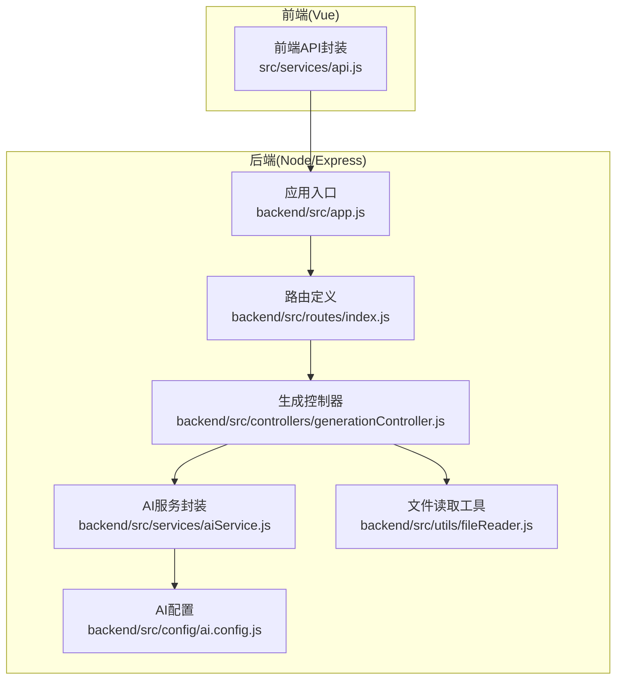
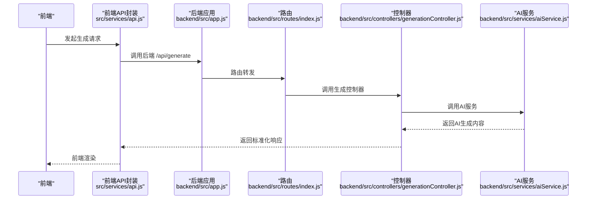
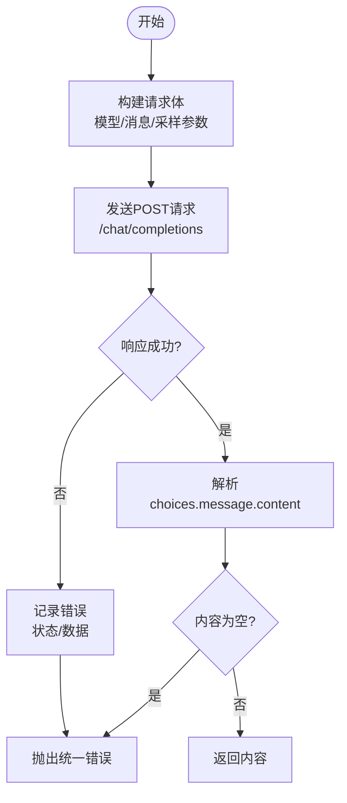
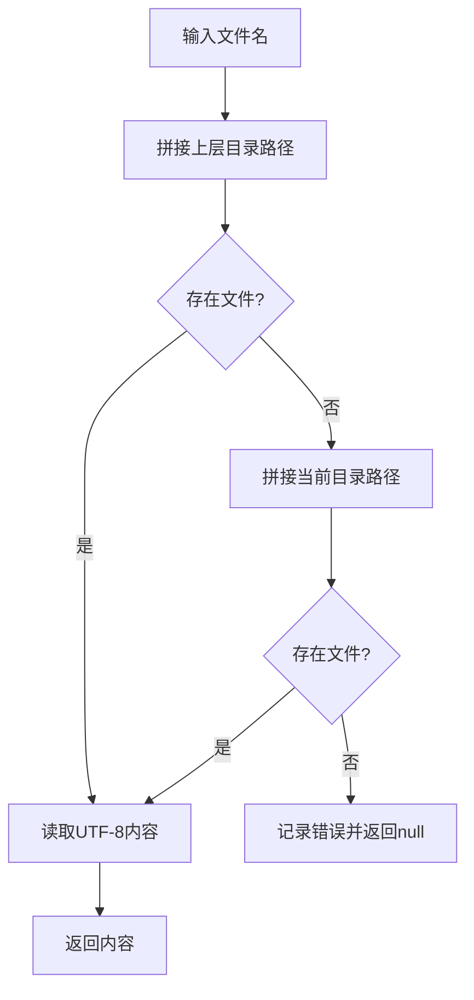
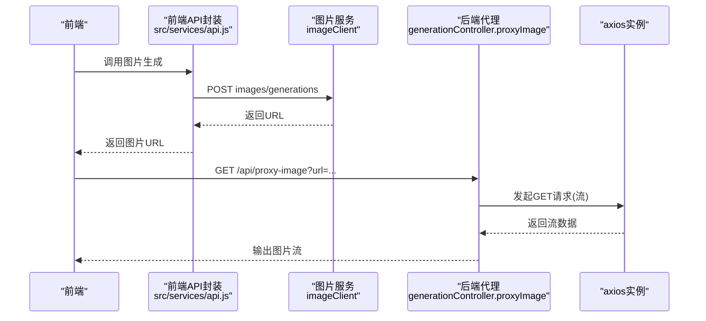
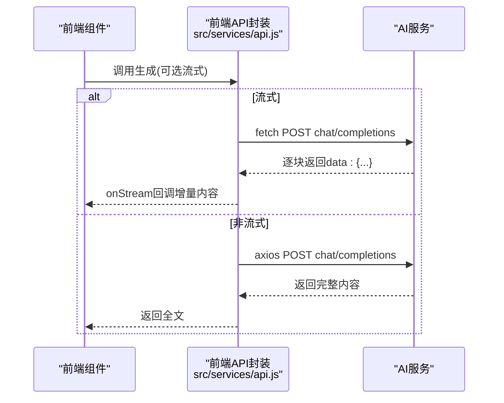
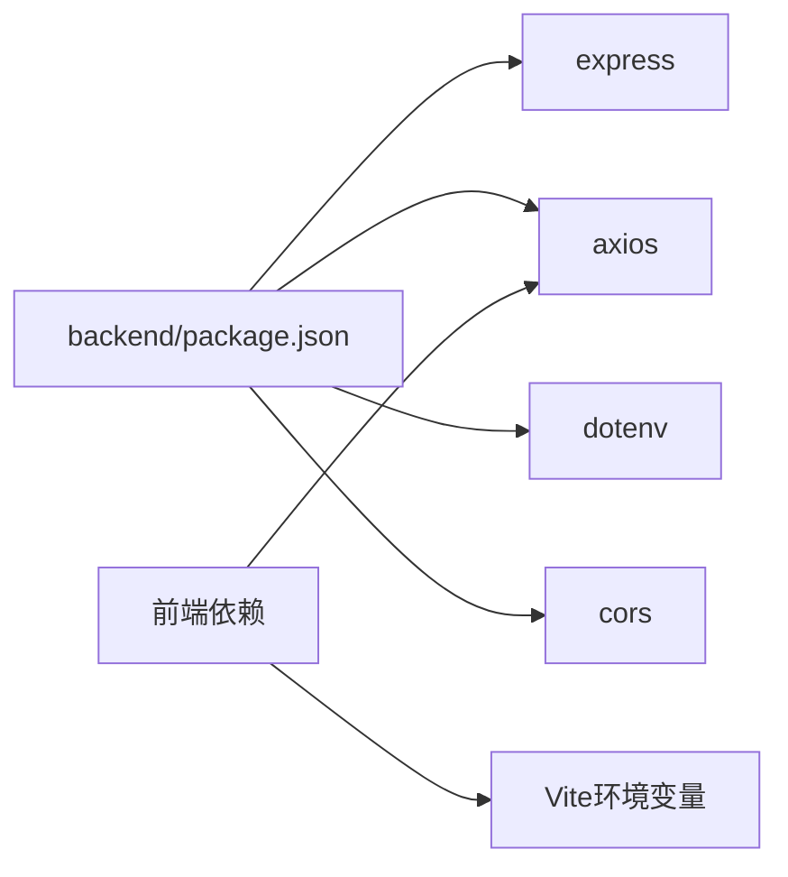

# 外部服务集成

<cite>
**本文档引用的文件**
- [backend/src/config/ai.config.js](file://backend/src/config/ai.config.js)
- [backend/src/services/aiService.js](file://backend/src/services/aiService.js)
- [backend/src/utils/fileReader.js](file://backend/src/utils/fileReader.js)
- [backend/src/controllers/generationController.js](file://backend/src/controllers/generationController.js)
- [backend/src/routes/index.js](file://backend/src/routes/index.js)
- [backend/src/app.js](file://backend/src/app.js)
- [backend/.env](file://backend/.env)
- [backend/.env.example](file://backend/.env.example)
- [backend/package.json](file://backend/package.json)
- [src/services/api.js](file://src/services/api.js)
</cite>

## 目录
1. [简介](#简介)
2. [项目结构](#项目结构)
3. [核心组件](#核心组件)
4. [架构总览](#架构总览)
5. [详细组件分析](#详细组件分析)
6. [依赖关系分析](#依赖关系分析)
7. [性能考量](#性能考量)
8. [故障排查指南](#故障排查指南)
9. [结论](#结论)
10. [附录](#附录)

## 简介
本技术文档聚焦于后端系统与第三方服务的集成实现，涵盖以下方面：
- AI服务配置与调用机制：API密钥管理、请求参数配置、响应处理策略
- 环境变量配置系统：敏感信息保护与多环境部署支持
- 文件读取与处理工具：框架模板文件的读取与聚合
- 火山引擎图片服务集成：基于配置的图片生成与代理下载
- 大模型API调用：前端与后端的统一调用封装与流式处理
- 最佳实践：故障转移、超时处理与重试机制的实现方案

## 项目结构
后端采用Express框架，前端采用Vue 3 + Vite，二者通过REST API交互。后端负责：
- 路由注册与控制器编排
- AI服务调用与响应处理
- 图片代理下载（解决跨域问题）
- 框架模板文件读取与聚合

图表来源
- [backend/src/app.js](file://backend/src/app.js#L1-L26)
- [backend/src/routes/index.js](file://backend/src/routes/index.js#L1-L21)
- [backend/src/controllers/generationController.js](file://backend/src/controllers/generationController.js#L1-L100)
- [backend/src/services/aiService.js](file://backend/src/services/aiService.js#L1-L55)
- [backend/src/utils/fileReader.js](file://backend/src/utils/fileReader.js#L1-L49)
- [backend/src/config/ai.config.js](file://backend/src/config/ai.config.js#L1-L18)

章节来源
- [backend/src/app.js](file://backend/src/app.js#L1-L26)
- [backend/src/routes/index.js](file://backend/src/routes/index.js#L1-L21)

## 核心组件
- 应用入口与中间件：加载环境变量、启用CORS、挂载路由
- 路由层：暴露框架查询、关键词分析、内容生成、质量分析、图片代理等接口
- 控制器层：接收请求参数、调用服务层、返回标准化响应
- 服务层：封装AI调用、图片代理下载、文件读取
- 配置层：集中管理AI服务的基础地址、模型、API密钥与请求头

章节来源
- [backend/src/app.js](file://backend/src/app.js#L9-L24)
- [backend/src/routes/index.js](file://backend/src/routes/index.js#L11-L16)
- [backend/src/controllers/generationController.js](file://backend/src/controllers/generationController.js#L10-L33)
- [backend/src/services/aiService.js](file://backend/src/services/aiService.js#L14-L53)
- [backend/src/utils/fileReader.js](file://backend/src/utils/fileReader.js#L9-L45)
- [backend/src/config/ai.config.js](file://backend/src/config/ai.config.js#L6-L17)

## 架构总览
系统通过前端API封装统一调用后端接口，后端控制器协调服务层完成业务处理。AI服务与图片服务分别通过独立客户端进行配置与调用。

图表来源
- [src/services/api.js](file://src/services/api.js#L250-L320)
- [backend/src/app.js](file://backend/src/app.js#L20-L24)
- [backend/src/routes/index.js](file://backend/src/routes/index.js#L14-L16)
- [backend/src/controllers/generationController.js](file://backend/src/controllers/generationController.js#L21-L26)
- [backend/src/services/aiService.js](file://backend/src/services/aiService.js#L14-L53)

## 详细组件分析

### AI服务配置与调用
- 配置集中化：基础地址、模型、API密钥与请求头在配置文件中集中维护，便于切换与审计
- 请求参数：包含模型、消息数组（system与user）、温度、采样策略、流式开关等
- 响应处理：解析choices.message.content，空内容抛出错误；捕获网络与HTTP错误并统一包装
- 超时设置：axios默认超时60秒，确保复杂推理与长文本生成的稳定性

图表来源
- [backend/src/services/aiService.js](file://backend/src/services/aiService.js#L14-L53)

章节来源
- [backend/src/config/ai.config.js](file://backend/src/config/ai.config.js#L6-L17)
- [backend/src/services/aiService.js](file://backend/src/services/aiService.js#L14-L53)

### 环境变量配置系统
- 后端环境变量：端口、CORS来源，通过dotenv加载
- 前端环境变量：通过Vite导入，包含AI与火山引擎服务的基地址、模型、API密钥等
- 敏感信息保护：API密钥在前端以环境变量注入，避免硬编码；生产部署需确保仅在受控环境下暴露
- 多环境支持：通过不同环境文件与构建脚本切换，实现开发/测试/生产环境隔离

章节来源
- [backend/.env](file://backend/.env#L3-L5)
- [backend/.env.example](file://backend/.env.example#L1-L3)
- [backend/src/app.js](file://backend/src/app.js#L9-L16)
- [src/services/api.js](file://src/services/api.js#L16-L37)

### 文件读取与处理工具
- 路径策略：优先从上层目录读取框架模板，失败回退至当前目录
- 错误处理：双层读取失败记录错误并返回null，保证流程健壮性
- 聚合接口：批量读取预定义框架名称，过滤空内容，返回{name, content}

图表来源
- [backend/src/utils/fileReader.js](file://backend/src/utils/fileReader.js#L9-L27)

章节来源
- [backend/src/utils/fileReader.js](file://backend/src/utils/fileReader.js#L9-L45)

### 火山引擎图片服务集成
- 客户端配置：基于Vite环境变量设置baseURL与Authorization，统一超时时间
- 图片生成：构造payload（模型、提示词、尺寸、响应格式等），解析第一张图片URL
- 代理下载：后端代理解决前端跨域限制，透传原始Content-Type并输出二进制流

图表来源
- [src/services/api.js](file://src/services/api.js#L369-L410)
- [backend/src/controllers/generationController.js](file://backend/src/controllers/generationController.js#L69-L94)

章节来源
- [src/services/api.js](file://src/services/api.js#L29-L37)
- [src/services/api.js](file://src/services/api.js#L369-L410)
- [backend/src/controllers/generationController.js](file://backend/src/controllers/generationController.js#L69-L94)

### 大模型API调用与流式处理
- 前端统一封装：基于fetch实现流式读取，按行解析SSE-like数据，增量回调给UI
- 后端兼容：保留axios非流式调用，用于简单分析接口
- 参数策略：系统提示词固定，用户提示词动态，采样参数可调

图表来源
- [src/services/api.js](file://src/services/api.js#L94-L177)

章节来源
- [src/services/api.js](file://src/services/api.js#L94-L177)

## 依赖关系分析
- 后端依赖：Express提供Web框架，Axios用于HTTP调用，Dotenv加载环境变量，CORS处理跨域
- 前端依赖：Axios、Vite环境变量注入、浏览器Fetch用于流式读取

图表来源
- [backend/package.json](file://backend/package.json#L10-L15)

章节来源
- [backend/package.json](file://backend/package.json#L1-L17)

## 性能考量
- 超时设置：AI与图片服务均设置较长超时，避免复杂推理与生成过程被中断
- 流式传输：前端使用流式读取，降低首屏等待时间，提升用户体验
- 代理下载：后端代理图片下载，减少前端跨域与并发限制带来的性能损耗
- 缓存与重试：建议在网关或反向代理层引入缓存与指数退避重试，避免上游抖动影响

## 故障排查指南
- AI服务调用失败
  - 检查API密钥与模型配置是否正确
  - 查看响应状态与数据，定位上游错误
  - 确认超时设置是否合理
- 图片生成异常
  - 校验模型与尺寸参数是否符合服务端约束
  - 检查返回数据结构是否包含期望字段
- 代理下载失败
  - 确认URL有效且未过期
  - 检查CORS与Content-Type透传
- 环境变量问题
  - 确保后端与前端环境变量文件存在且值正确
  - 验证CORS来源允许范围

章节来源
- [backend/src/services/aiService.js](file://backend/src/services/aiService.js#L45-L52)
- [backend/src/controllers/generationController.js](file://backend/src/controllers/generationController.js#L76-L93)
- [backend/src/app.js](file://backend/src/app.js#L14-L16)
- [backend/.env](file://backend/.env#L3-L5)

## 结论
本项目通过集中化的配置与统一的API封装，实现了对AI服务与图片服务的稳定集成。前端采用流式处理优化用户体验，后端提供代理能力解决跨域问题。建议在生产环境中进一步完善环境变量安全策略、引入重试与熔断机制，并对关键路径进行监控与告警。

## 附录
- 接口清单
  - GET /api/frameworks：获取框架列表
  - GET /api/frameworks/:name：获取指定框架内容
  - POST /api/analyze：关键词分析
  - POST /api/generate：内容生成
  - POST /api/generate/analysis：质量分析
  - GET /api/proxy-image：图片代理下载

章节来源
- [backend/src/routes/index.js](file://backend/src/routes/index.js#L11-L16)