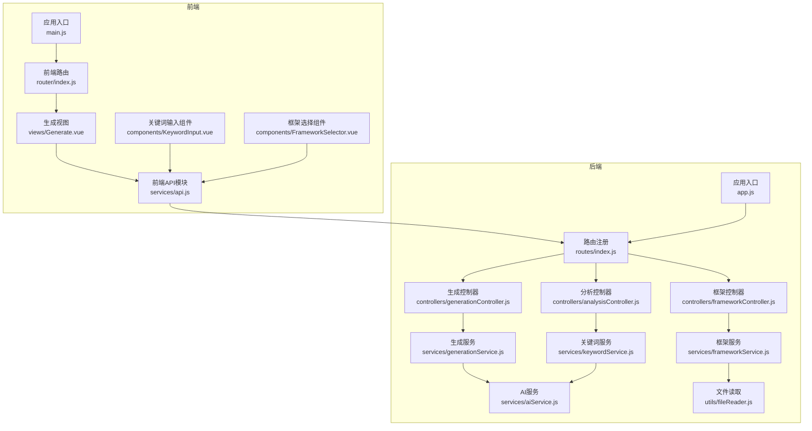
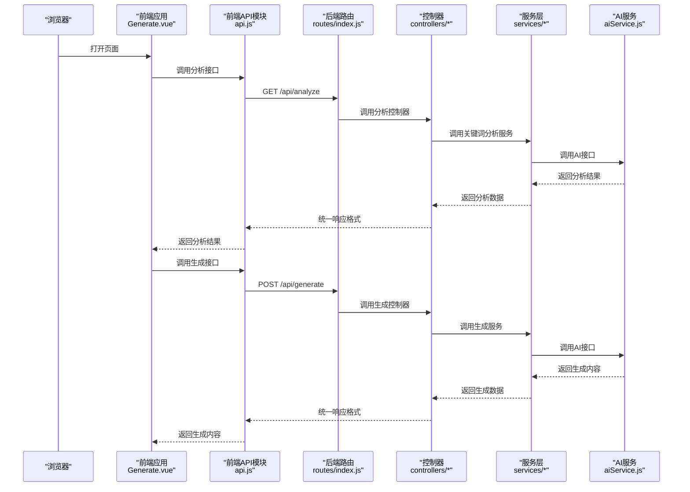
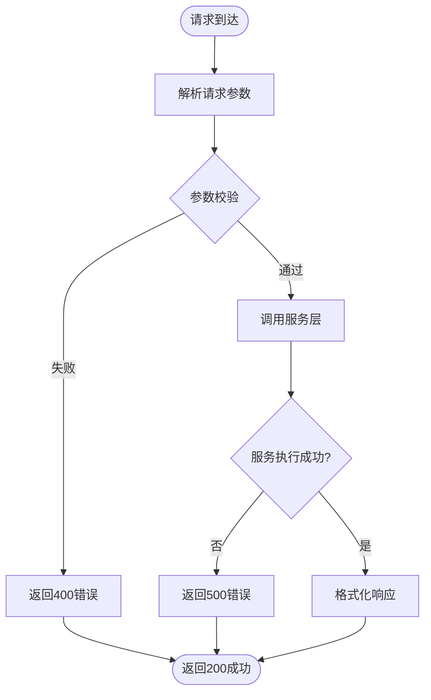
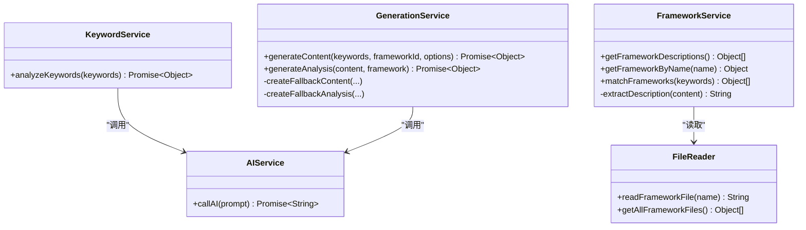
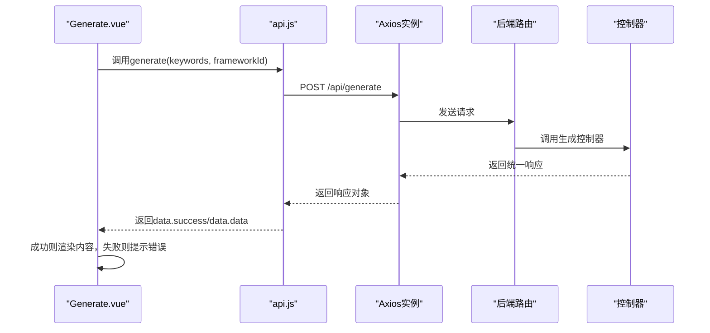
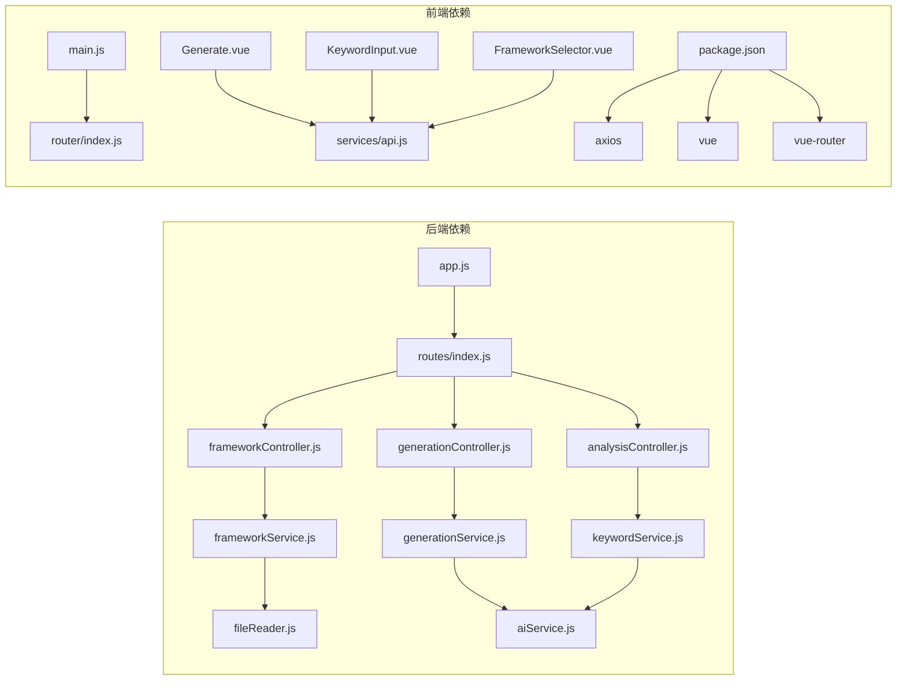

# API扩展开发

<cite>
**本文档引用的文件**
- [backend/src/app.js](file://backend/src/app.js)
- [backend/src/routes/index.js](file://backend/src/routes/index.js)
- [backend/src/controllers/frameworkController.js](file://backend/src/controllers/frameworkController.js)
- [backend/src/controllers/analysisController.js](file://backend/src/controllers/analysisController.js)
- [backend/src/controllers/generationController.js](file://backend/src/controllers/generationController.js)
- [backend/src/services/frameworkService.js](file://backend/src/services/frameworkService.js)
- [backend/src/services/generationService.js](file://backend/src/services/generationService.js)
- [backend/src/services/keywordService.js](file://backend/src/services/keywordService.js)
- [backend/src/services/aiService.js](file://backend/src/services/aiService.js)
- [backend/src/utils/fileReader.js](file://backend/src/utils/fileReader.js)
- [frontend/src/services/api.js](file://frontend/src/services/api.js)
- [frontend/src/views/Generate.vue](file://frontend/src/views/Generate.vue)
- [frontend/src/components/KeywordInput.vue](file://frontend/src/components/KeywordInput.vue)
- [frontend/src/components/FrameworkSelector.vue](file://frontend/src/components/FrameworkSelector.vue)
- [frontend/src/router/index.js](file://frontend/src/router/index.js)
- [frontend/src/main.js](file://frontend/src/main.js)
- [package.json](file://package.json)
</cite>

## 目录
1. [简介](#简介)
2. [项目结构](#项目结构)
3. [核心组件](#核心组件)
4. [架构总览](#架构总览)
5. [详细组件分析](#详细组件分析)
6. [依赖关系分析](#依赖关系分析)
7. [性能考虑](#性能考虑)
8. [故障排除指南](#故障排除指南)
9. [结论](#结论)
10. [附录](#附录)

## 简介
本指南面向希望在现有系统基础上扩展API能力的开发者，系统性阐述RESTful API设计原则与实现方法，覆盖后端控制器开发流程（路由定义、请求处理、响应格式化、错误处理）、服务层开发模式（业务逻辑封装、数据验证、异步处理）、前端API集成方法（Axios配置、请求拦截器、响应处理、错误处理），以及API版本管理与向后兼容性策略。文档基于仓库中的实际代码进行分析，确保内容可落地、可复用。

## 项目结构
项目采用前后端分离架构，后端基于Express提供REST API，前端基于Vue 3 + Element Plus构建交互界面。核心目录与职责如下：
- 后端
  - app.js：应用入口，配置CORS、中间件、路由挂载与启动监听
  - routes/index.js：统一路由注册，映射HTTP方法与控制器
  - controllers/*：控制器层，负责请求解析、参数校验、调用服务层并格式化响应
  - services/*：服务层，封装业务逻辑、调用AI服务与文件读取
  - utils/fileReader.js：文件读取工具，用于加载框架文档
- 前端
  - services/api.js：Axios实例与API模块封装
  - views/Generate.vue：生成页面主视图，协调关键词分析、框架选择与内容生成
  - components/*：可复用UI组件（关键词输入、框架选择等）
  - router/index.js：前端路由配置
  - main.js：应用初始化与插件挂载

图表来源
- [backend/src/app.js](file://backend/src/app.js#L1-L26)
- [backend/src/routes/index.js](file://backend/src/routes/index.js#L1-L21)
- [backend/src/controllers/frameworkController.js](file://backend/src/controllers/frameworkController.js#L1-L49)
- [backend/src/controllers/analysisController.js](file://backend/src/controllers/analysisController.js#L1-L37)
- [backend/src/controllers/generationController.js](file://backend/src/controllers/generationController.js#L1-L100)
- [backend/src/services/frameworkService.js](file://backend/src/services/frameworkService.js#L1-L64)
- [backend/src/services/generationService.js](file://backend/src/services/generationService.js#L1-L194)
- [backend/src/services/keywordService.js](file://backend/src/services/keywordService.js#L1-L85)
- [backend/src/services/aiService.js](file://backend/src/services/aiService.js#L1-L55)
- [backend/src/utils/fileReader.js](file://backend/src/utils/fileReader.js#L1-L49)
- [frontend/src/services/api.js](file://frontend/src/services/api.js#L1-L40)
- [frontend/src/views/Generate.vue](file://frontend/src/views/Generate.vue#L1-L189)
- [frontend/src/components/KeywordInput.vue](file://frontend/src/components/KeywordInput.vue#L1-L148)
- [frontend/src/components/FrameworkSelector.vue](file://frontend/src/components/FrameworkSelector.vue#L1-L121)
- [frontend/src/router/index.js](file://frontend/src/router/index.js#L1-L26)
- [frontend/src/main.js](file://frontend/src/main.js#L1-L15)

章节来源
- [backend/src/app.js](file://backend/src/app.js#L1-L26)
- [backend/src/routes/index.js](file://backend/src/routes/index.js#L1-L21)
- [frontend/src/services/api.js](file://frontend/src/services/api.js#L1-L40)

## 核心组件
- 应用入口与中间件
  - CORS配置允许指定源访问
  - JSON请求体解析
  - 路由前缀统一为/api
- 路由层
  - 定义GET/POST接口，分别对应框架查询、关键词分析、内容生成、内容质量分析与图片代理
- 控制器层
  - 参数校验与错误捕获
  - 统一响应格式（success/data/error）
  - 异步处理与超时控制
- 服务层
  - 业务逻辑封装（AI调用、文件读取、内容/分析生成）
  - 失败回退策略（备用内容/分析）
- 前端API层
  - Axios实例配置baseURL与超时
  - 模块化API导出（frameworkAPI、analysisAPI、generationAPI）

章节来源
- [backend/src/app.js](file://backend/src/app.js#L14-L20)
- [backend/src/routes/index.js](file://backend/src/routes/index.js#L11-L16)
- [backend/src/controllers/frameworkController.js](file://backend/src/controllers/frameworkController.js#L8-L44)
- [backend/src/controllers/analysisController.js](file://backend/src/controllers/analysisController.js#L6-L29)
- [backend/src/controllers/generationController.js](file://backend/src/controllers/generationController.js#L10-L94)
- [backend/src/services/generationService.js](file://backend/src/services/generationService.js#L64-L94)
- [backend/src/services/keywordService.js](file://backend/src/services/keywordService.js#L39-L67)
- [frontend/src/services/api.js](file://frontend/src/services/api.js#L8-L35)

## 架构总览
下图展示了从浏览器到后端API再到AI服务的整体调用链路，以及前端各组件之间的协作关系。

图表来源
- [frontend/src/views/Generate.vue](file://frontend/src/views/Generate.vue#L96-L115)
- [frontend/src/services/api.js](file://frontend/src/services/api.js#L22-L35)
- [backend/src/routes/index.js](file://backend/src/routes/index.js#L13-L15)
- [backend/src/controllers/analysisController.js](file://backend/src/controllers/analysisController.js#L6-L29)
- [backend/src/controllers/generationController.js](file://backend/src/controllers/generationController.js#L10-L33)
- [backend/src/services/keywordService.js](file://backend/src/services/keywordService.js#L39-L67)
- [backend/src/services/generationService.js](file://backend/src/services/generationService.js#L64-L94)
- [backend/src/services/aiService.js](file://backend/src/services/aiService.js#L14-L53)

## 详细组件分析

### 后端API控制器开发流程
- 路由定义
  - 在路由文件中注册GET/POST端点，映射到对应控制器函数
- 请求处理
  - 控制器内进行参数校验（必填字段检查）
  - 调用服务层执行业务逻辑
- 响应格式化
  - 统一返回结构：success标识、data承载业务数据、error承载错误信息
- 错误处理
  - 显式HTTP状态码（400/404/500）
  - 捕获异常并返回标准化错误响应

图表来源
- [backend/src/controllers/frameworkController.js](file://backend/src/controllers/frameworkController.js#L8-L44)
- [backend/src/controllers/analysisController.js](file://backend/src/controllers/analysisController.js#L6-L29)
- [backend/src/controllers/generationController.js](file://backend/src/controllers/generationController.js#L10-L33)

章节来源
- [backend/src/routes/index.js](file://backend/src/routes/index.js#L11-L16)
- [backend/src/controllers/frameworkController.js](file://backend/src/controllers/frameworkController.js#L8-L44)
- [backend/src/controllers/analysisController.js](file://backend/src/controllers/analysisController.js#L6-L29)
- [backend/src/controllers/generationController.js](file://backend/src/controllers/generationController.js#L10-L33)

### 服务层开发模式
- 业务逻辑封装
  - 关键词分析：将用户输入转换为结构化分析结果
  - 内容生成：构造提示词并调用AI，解析/回退处理
  - 框架读取：从本地文件系统读取框架文档并提取元信息
- 数据验证
  - 控制器层进行基础参数校验，服务层进行业务规则校验
- 异步处理
  - 使用async/await处理AI调用与文件读取
  - 超时控制与错误日志记录

图表来源
- [backend/src/services/keywordService.js](file://backend/src/services/keywordService.js#L39-L67)
- [backend/src/services/generationService.js](file://backend/src/services/generationService.js#L64-L94)
- [backend/src/services/frameworkService.js](file://backend/src/services/frameworkService.js#L9-L58)
- [backend/src/services/aiService.js](file://backend/src/services/aiService.js#L14-L53)
- [backend/src/utils/fileReader.js](file://backend/src/utils/fileReader.js#L9-L44)

章节来源
- [backend/src/services/keywordService.js](file://backend/src/services/keywordService.js#L1-L85)
- [backend/src/services/generationService.js](file://backend/src/services/generationService.js#L1-L194)
- [backend/src/services/frameworkService.js](file://backend/src/services/frameworkService.js#L1-L64)
- [backend/src/utils/fileReader.js](file://backend/src/utils/fileReader.js#L1-L49)

### 前端API集成方法
- Axios配置
  - baseURL设置为/api，统一前缀
  - 超时时间设置为10秒
- 请求拦截器
  - 可扩展：添加认证头、请求签名、重试机制
- 响应处理
  - 统一处理success/data/error结构
  - 成功时提取data，失败时弹窗提示
- 错误处理
  - 捕获网络错误与业务错误
  - 统一错误提示与日志记录

图表来源
- [frontend/src/views/Generate.vue](file://frontend/src/views/Generate.vue#L96-L115)
- [frontend/src/services/api.js](file://frontend/src/services/api.js#L28-L35)
- [backend/src/routes/index.js](file://backend/src/routes/index.js#L14-L15)
- [backend/src/controllers/generationController.js](file://backend/src/controllers/generationController.js#L10-L33)

章节来源
- [frontend/src/services/api.js](file://frontend/src/services/api.js#L1-L40)
- [frontend/src/views/Generate.vue](file://frontend/src/views/Generate.vue#L96-L115)

### 前端组件与路由
- Generate.vue
  - 协调关键词分析、框架选择、内容生成与预览
  - 使用Element Plus组件库与消息提示
- KeywordInput.vue
  - 支持快捷关键词与输入分析触发
- FrameworkSelector.vue
  - 展示匹配度与框架描述，支持选中事件
- 路由配置
  - 基于Vue Router的单页应用路由

章节来源
- [frontend/src/views/Generate.vue](file://frontend/src/views/Generate.vue#L1-L189)
- [frontend/src/components/KeywordInput.vue](file://frontend/src/components/KeywordInput.vue#L1-L148)
- [frontend/src/components/FrameworkSelector.vue](file://frontend/src/components/FrameworkSelector.vue#L1-L121)
- [frontend/src/router/index.js](file://frontend/src/router/index.js#L1-L26)
- [frontend/src/main.js](file://frontend/src/main.js#L1-L15)

## 依赖关系分析
- 后端
  - app.js依赖dotenv、cors、express与routes
  - routes/index.js依赖各控制器
  - 控制器依赖对应服务层
  - 服务层依赖utils与aiService
- 前端
  - main.js挂载Element Plus与路由
  - views与components依赖services/api
  - package.json声明axios、vue、vue-router等依赖

图表来源
- [backend/src/app.js](file://backend/src/app.js#L4-L7)
- [backend/src/routes/index.js](file://backend/src/routes/index.js#L4-L7)
- [backend/src/controllers/frameworkController.js](file://backend/src/controllers/frameworkController.js#L6)
- [backend/src/controllers/analysisController.js](file://backend/src/controllers/analysisController.js#L4)
- [backend/src/controllers/generationController.js](file://backend/src/controllers/generationController.js#L7-L8)
- [backend/src/services/frameworkService.js](file://backend/src/services/frameworkService.js#L7)
- [backend/src/services/generationService.js](file://backend/src/services/generationService.js#L1)
- [backend/src/services/keywordService.js](file://backend/src/services/keywordService.js#L2)
- [backend/src/services/aiService.js](file://backend/src/services/aiService.js#L3)
- [backend/src/utils/fileReader.js](file://backend/src/utils/fileReader.js#L6-L7)
- [frontend/src/main.js](file://frontend/src/main.js#L4-L8)
- [frontend/src/router/index.js](file://frontend/src/router/index.js#L6)
- [frontend/src/views/Generate.vue](file://frontend/src/views/Generate.vue#L59)
- [frontend/src/components/KeywordInput.vue](file://frontend/src/components/KeywordInput.vue#L48)
- [frontend/src/components/FrameworkSelector.vue](file://frontend/src/components/FrameworkSelector.vue#L52)
- [frontend/src/services/api.js](file://frontend/src/services/api.js#L6)
- [package.json](file://package.json#L15-L26)

章节来源
- [package.json](file://package.json#L1-L32)

## 性能考虑
- 请求超时与并发
  - 后端控制器对第三方AI调用设置合理超时，避免阻塞线程
  - 前端Axios设置超时，防止长时间等待
- 响应格式化
  - 统一响应结构便于前端快速判断与处理，减少重复判断逻辑
- 缓存策略
  - 对静态框架文档可引入内存缓存，减少文件系统IO
- 错误降级
  - 服务层提供备用内容/分析，保证在AI不可用时仍可返回可用结果

## 故障排除指南
- 常见错误与定位
  - 400错误：前端未传入必要参数或参数格式错误
  - 404错误：资源不存在（如框架名称不匹配）
  - 500错误：服务内部异常或AI调用失败
- 日志与调试
  - 后端控制器与服务层均输出错误日志，便于定位问题
  - 前端在生成失败时弹窗提示并记录错误
- 解决建议
  - 检查环境变量与CORS配置
  - 确认AI服务可用性与鉴权头
  - 校验请求体结构与必填字段

章节来源
- [backend/src/controllers/frameworkController.js](file://backend/src/controllers/frameworkController.js#L28-L33)
- [backend/src/controllers/analysisController.js](file://backend/src/controllers/analysisController.js#L10-L15)
- [backend/src/controllers/generationController.js](file://backend/src/controllers/generationController.js#L14-L19)
- [backend/src/services/aiService.js](file://backend/src/services/aiService.js#L45-L52)
- [frontend/src/views/Generate.vue](file://frontend/src/views/Generate.vue#L110-L113)

## 结论
本指南基于现有代码实现了完整的API扩展开发路径：后端控制器与服务层的职责划分、统一响应格式与错误处理、前端Axios封装与组件化调用。通过遵循这些设计原则与实现方法，可以高效、稳定地扩展新的API功能，并在需要时平滑引入版本管理与向后兼容策略。

## 附录

### API版本管理与向后兼容
- 版本策略
  - URL前缀版本化：/api/v1/analyze、/api/v1/generate
  - 响应字段版本标记：在data中加入meta.version
- 迁移策略
  - 新增接口保持旧接口不变，逐步引导客户端迁移
  - 对破坏性变更提供过渡期与多版本共存
- 向后兼容
  - 默认保留旧字段与默认值，新增字段可选
  - 在响应中提供兼容性说明与弃用警告

### 最佳实践清单
- 后端
  - 控制器只做参数校验与响应格式化
  - 业务逻辑全部下沉至服务层
  - 统一错误处理与日志记录
- 前端
  - Axios实例集中配置，按模块导出API
  - 组件内仅关注UI逻辑，数据请求通过API模块
  - 错误处理与用户提示一致化