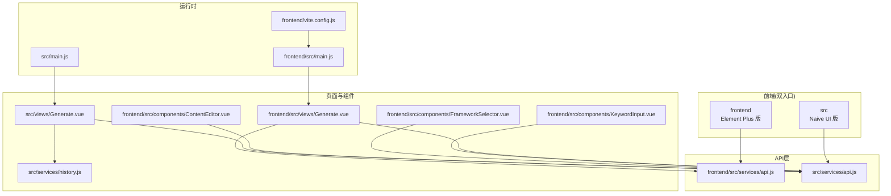
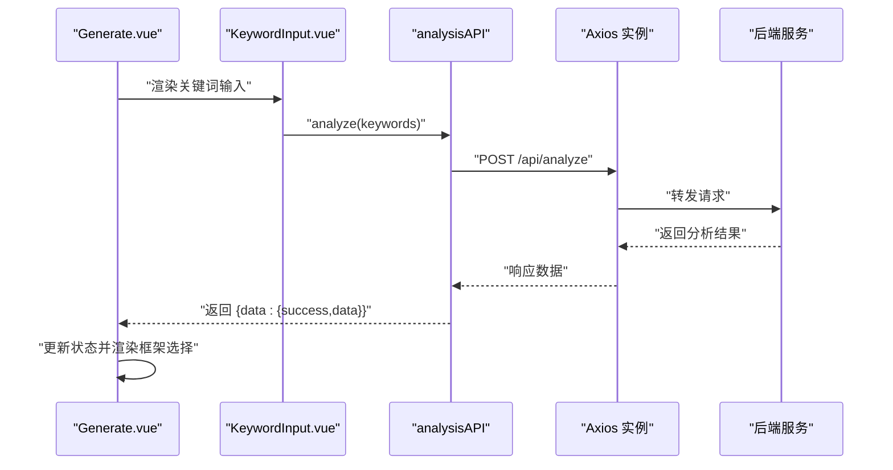
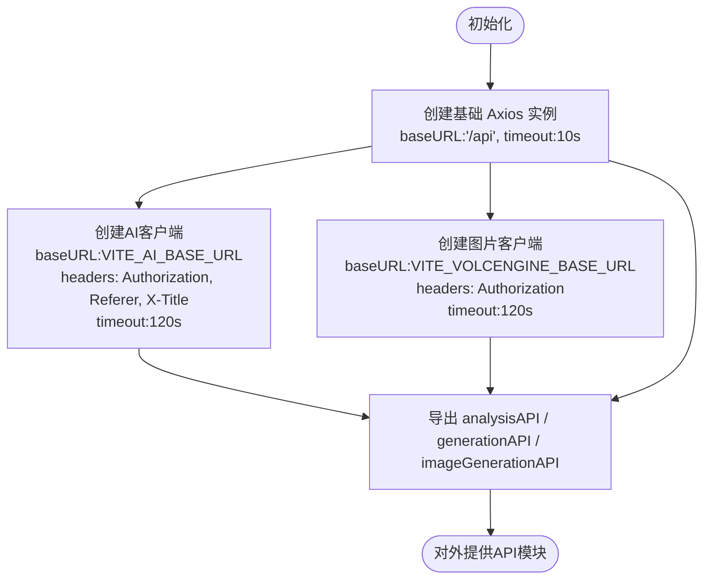
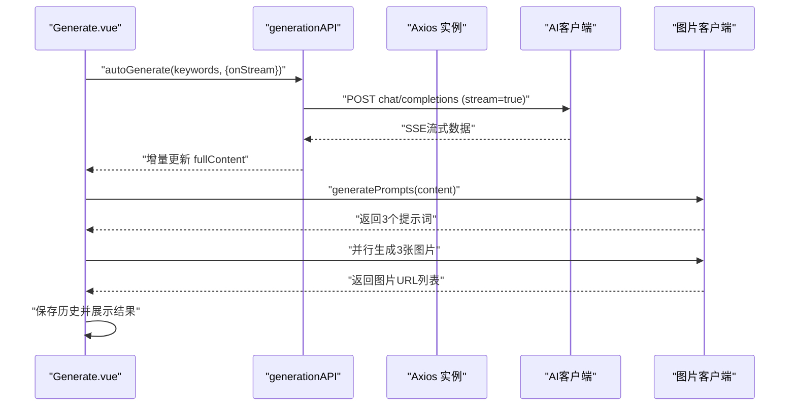
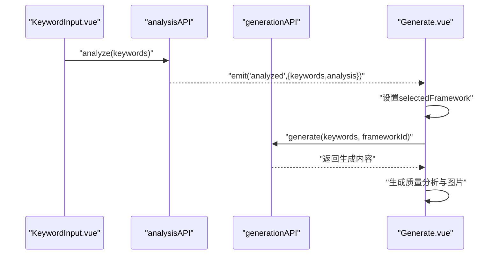
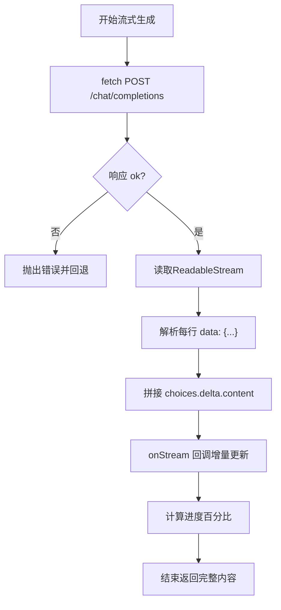
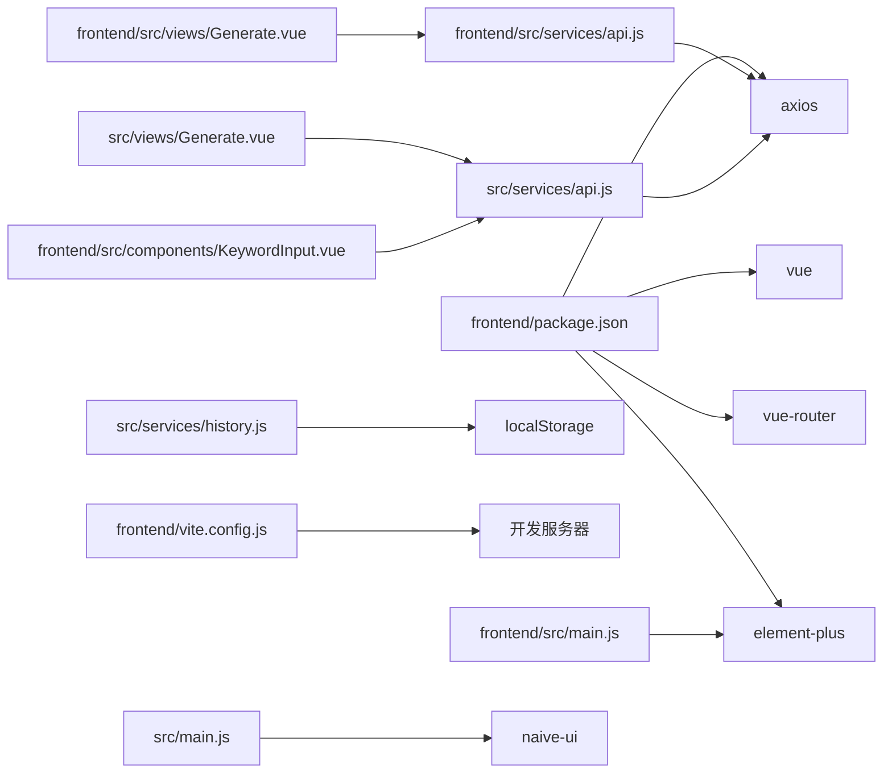

# 前端API集成

<cite>
**本文档引用的文件**
- [frontend/src/services/api.js](file://frontend/src/services/api.js)
- [src/services/api.js](file://src/services/api.js)
- [frontend/src/views/Generate.vue](file://frontend/src/views/Generate.vue)
- [src/views/Generate.vue](file://src/views/Generate.vue)
- [frontend/src/components/KeywordInput.vue](file://frontend/src/components/KeywordInput.vue)
- [frontend/src/components/FrameworkSelector.vue](file://frontend/src/components/FrameworkSelector.vue)
- [frontend/src/components/ContentEditor.vue](file://frontend/src/components/ContentEditor.vue)
- [src/services/history.js](file://src/services/history.js)
- [frontend/src/main.js](file://frontend/src/main.js)
- [src/main.js](file://src/main.js)
- [frontend/vite.config.js](file://frontend/vite.config.js)
- [frontend/package.json](file://frontend/package.json)
- [src/App.vue](file://src/App.vue)
</cite>

## 目录
1. [简介](#简介)
2. [项目结构](#项目结构)
3. [核心组件](#核心组件)
4. [架构总览](#架构总览)
5. [详细组件分析](#详细组件分析)
6. [依赖关系分析](#依赖关系分析)
7. [性能考虑](#性能考虑)
8. [故障排查指南](#故障排查指南)
9. [结论](#结论)
10. [附录](#附录)

## 简介
本指南聚焦于前端API集成功能，围绕Vue应用中的HTTP客户端配置与API调用模式展开，涵盖：
- Axios实例配置与代理设置
- 请求/响应拦截器与错误统一处理思路
- API服务封装模式（接口定义、参数传递、响应处理、加载状态）
- 具体集成示例（GET/POST、流式数据、图片生成）
- 前端状态管理与API交互协调（异步、并发、缓存）
- 调试技巧与常见问题解决

## 项目结构
前端采用双入口（Element Plus版与Naive UI版）并行开发，API集中于各自根目录下的services/api.js，页面组件位于views与components目录，构建与代理通过Vite配置。

图表来源
- [frontend/src/services/api.js](file://frontend/src/services/api.js#L1-L40)
- [src/services/api.js](file://src/services/api.js#L1-L454)
- [frontend/src/views/Generate.vue](file://frontend/src/views/Generate.vue#L1-L189)
- [src/views/Generate.vue](file://src/views/Generate.vue#L1-L668)
- [frontend/src/components/KeywordInput.vue](file://frontend/src/components/KeywordInput.vue#L1-L148)
- [frontend/src/components/FrameworkSelector.vue](file://frontend/src/components/FrameworkSelector.vue#L1-L121)
- [frontend/src/components/ContentEditor.vue](file://frontend/src/components/ContentEditor.vue#L1-L195)
- [src/services/history.js](file://src/services/history.js#L1-L89)
- [frontend/src/main.js](file://frontend/src/main.js#L1-L15)
- [src/main.js](file://src/main.js#L1-L16)
- [frontend/vite.config.js](file://frontend/vite.config.js#L1-L19)

章节来源
- [frontend/src/services/api.js](file://frontend/src/services/api.js#L1-L40)
- [src/services/api.js](file://src/services/api.js#L1-L454)
- [frontend/src/views/Generate.vue](file://frontend/src/views/Generate.vue#L1-L189)
- [src/views/Generate.vue](file://src/views/Generate.vue#L1-L668)
- [frontend/src/main.js](file://frontend/src/main.js#L1-L15)
- [src/main.js](file://src/main.js#L1-L16)
- [frontend/vite.config.js](file://frontend/vite.config.js#L1-L19)

## 核心组件
- HTTP客户端与API封装
  - 基础Axios实例：统一baseURL与超时
  - 多客户端：AI客户端、图片生成客户端（火山引擎）
  - API模块化：frameworkAPI、analysisAPI、generationAPI、imageGenerationAPI、knowledgeAPI
- 页面与组件
  - Generate页面：关键词输入、框架选择、内容编辑、质量分析、预览与历史
  - 组件：KeywordInput、FrameworkSelector、ContentEditor
- 构建与代理
  - Vite代理：/api -> 后端服务
  - 依赖：axios、vue、vue-router、element-plus/naive-ui

章节来源
- [frontend/src/services/api.js](file://frontend/src/services/api.js#L8-L37)
- [src/services/api.js](file://src/services/api.js#L8-L454)
- [frontend/src/views/Generate.vue](file://frontend/src/views/Generate.vue#L56-L155)
- [src/views/Generate.vue](file://src/views/Generate.vue#L177-L427)
- [frontend/vite.config.js](file://frontend/vite.config.js#L8-L16)
- [frontend/package.json](file://frontend/package.json#L10-L19)

## 架构总览
前端通过独立的API服务模块统一管理HTTP请求，页面组件通过组合式API发起调用，状态通过响应数据与本地存储协同维护。

图表来源
- [frontend/src/views/Generate.vue](file://frontend/src/views/Generate.vue#L75-L82)
- [frontend/src/components/KeywordInput.vue](file://frontend/src/components/KeywordInput.vue#L81-L102)
- [frontend/src/services/api.js](file://frontend/src/services/api.js#L22-L26)
- [frontend/vite.config.js](file://frontend/vite.config.js#L10-L15)

## 详细组件分析

### Axios实例与多客户端配置
- 基础实例
  - baseURL统一为/api，超时10秒
  - 导出默认实例与命名模块（frameworkAPI、analysisAPI、generationAPI）
- AI客户端
  - baseURL来自环境变量，携带鉴权头与Referer/X-Title
  - 超时120秒，支持流式输出
- 图片生成客户端（火山引擎）
  - baseURL与鉴权头，超时120秒
  - 生成图片并返回URL

图表来源
- [src/services/api.js](file://src/services/api.js#L8-L37)

章节来源
- [frontend/src/services/api.js](file://frontend/src/services/api.js#L8-L11)
- [src/services/api.js](file://src/services/api.js#L8-L37)

### API服务封装模式
- 接口定义
  - analysisAPI.analyze：POST /api/analyze
  - generationAPI.generate/generateAnalysis：POST /api/generate 与 /api/generate/analysis
  - frameworkAPI.getAll/getByName：GET /api/frameworks 与 /api/frameworks/:name
  - imageGenerationAPI.generate/generatePrompts：POST /images/generations 与提示词生成
- 参数传递
  - 关键词与框架ID作为JSON体传递
  - 图片生成携带prompt、size等参数
- 响应处理
  - 统一包装 { data: { success, data } } 结构
  - 流式输出通过onStream回调增量更新
- 加载状态管理
  - 页面通过ref布尔值控制按钮loading与进度条
  - 生成过程日志与进度条联动

图表来源
- [src/views/Generate.vue](file://src/views/Generate.vue#L257-L324)
- [src/services/api.js](file://src/services/api.js#L94-L177)
- [src/services/api.js](file://src/services/api.js#L369-L449)

章节来源
- [frontend/src/services/api.js](file://frontend/src/services/api.js#L13-L37)
- [src/services/api.js](file://src/services/api.js#L206-L364)
- [src/views/Generate.vue](file://src/views/Generate.vue#L257-L354)

### 组件与页面的API调用流程
- KeywordInput
  - 输入关键词，触发分析请求，返回分析结果并向上抛出事件
- FrameworkSelector
  - 展示推荐框架，选择后向下传递
- ContentEditor
  - 显示/编辑内容，支持重新生成与预览
- Generate页面
  - 组合上述组件，协调状态与API调用，处理错误与加载

图表来源
- [frontend/src/components/KeywordInput.vue](file://frontend/src/components/KeywordInput.vue#L81-L102)
- [frontend/src/views/Generate.vue](file://frontend/src/views/Generate.vue#L75-L116)
- [src/services/api.js](file://src/services/api.js#L206-L320)

章节来源
- [frontend/src/components/KeywordInput.vue](file://frontend/src/components/KeywordInput.vue#L45-L102)
- [frontend/src/components/FrameworkSelector.vue](file://frontend/src/components/FrameworkSelector.vue#L42-L61)
- [frontend/src/components/ContentEditor.vue](file://frontend/src/components/ContentEditor.vue#L80-L133)
- [frontend/src/views/Generate.vue](file://frontend/src/views/Generate.vue#L56-L155)

### 流式数据处理与并发控制
- 流式输出
  - 通过fetch + ReadableStream读取SSE数据，逐块解析choices.delta.content
  - 增量更新页面内容与进度
- 并发控制
  - 图片生成采用Promise.all并行请求，合并成功结果
- 缓存策略
  - 本地历史：localStorage持久化，上限50条
  - 知识库：localStorage缓存知识条目

图表来源
- [src/services/api.js](file://src/services/api.js#L94-L177)
- [src/views/Generate.vue](file://src/views/Generate.vue#L282-L294)

章节来源
- [src/services/api.js](file://src/services/api.js#L94-L177)
- [src/views/Generate.vue](file://src/views/Generate.vue#L329-L354)
- [src/services/history.js](file://src/services/history.js#L9-L88)

### 错误统一处理机制
- 统一响应结构
  - 成功时返回 { data: { success: true, data } }
  - 失败时返回 { data: { success: true, data: fallback } } 以保证UI稳定
- 错误捕获
  - try/catch包裹API调用，必要时降级为本地提示
- 控制台日志
  - 记录AI调用模型、流式状态、图片生成异常

章节来源
- [src/services/api.js](file://src/services/api.js#L233-L244)
- [src/services/api.js](file://src/services/api.js#L309-L319)
- [src/services/api.js](file://src/services/api.js#L352-L362)
- [src/services/api.js](file://src/services/api.js#L403-L409)

### 文件上传与图片生成
- 图片生成
  - generate(params)：传入prompt、size等，返回URL与原始响应
  - generatePrompts(content)：基于文案提取3个配图提示词
- 并行生成
  - 对3个提示词并行请求，聚合成功结果

章节来源
- [src/services/api.js](file://src/services/api.js#L369-L449)
- [src/views/Generate.vue](file://src/views/Generate.vue#L329-L354)

## 依赖关系分析
- 依赖矩阵
  - frontend/src/services/api.js 依赖 axios
  - src/services/api.js 依赖 axios、环境变量
  - 页面与组件依赖对应API模块
  - 构建依赖 Vite 与插件
- 运行时入口
  - frontend/src/main.js 使用 ElementPlus 与路由
  - src/main.js 使用 naive-ui 与路由

图表来源
- [frontend/package.json](file://frontend/package.json#L10-L19)
- [frontend/src/services/api.js](file://frontend/src/services/api.js#L6)
- [src/services/api.js](file://src/services/api.js#L6)
- [frontend/src/views/Generate.vue](file://frontend/src/views/Generate.vue#L59)
- [src/views/Generate.vue](file://src/views/Generate.vue#L189)
- [frontend/src/components/KeywordInput.vue](file://frontend/src/components/KeywordInput.vue#L48)
- [src/services/history.js](file://src/services/history.js#L6)
- [frontend/vite.config.js](file://frontend/vite.config.js#L6-L16)
- [frontend/src/main.js](file://frontend/src/main.js#L5-L12)
- [src/main.js](file://src/main.js#L4-L12)

章节来源
- [frontend/package.json](file://frontend/package.json#L10-L19)
- [frontend/src/main.js](file://frontend/src/main.js#L5-L12)
- [src/main.js](file://src/main.js#L4-L12)
- [frontend/vite.config.js](file://frontend/vite.config.js#L6-L16)

## 性能考虑
- 超时与并发
  - AI与图片生成超时延长至120秒，避免复杂推理中断
  - 图片生成并行请求，缩短总耗时
- 流式渲染
  - SSE增量更新，降低首屏等待
- 本地缓存
  - 历史与知识库使用localStorage，减少重复请求
- 代理与跨域
  - Vite代理简化开发期跨域问题

## 故障排查指南
- 代理未生效
  - 检查Vite server.proxy配置与后端端口
- 环境变量缺失
  - AI与图片客户端依赖VITE_*变量，确认.env与导入路径
- CORS与鉴权
  - AI客户端需Referer与X-Title头；图片客户端需Authorization
- 流式数据异常
  - 检查SSE响应格式与onStream回调
- 生成失败降级
  - API对异常返回结构化提示，确保UI可读性

章节来源
- [frontend/vite.config.js](file://frontend/vite.config.js#L8-L16)
- [src/services/api.js](file://src/services/api.js#L16-L25)
- [src/services/api.js](file://src/services/api.js#L30-L37)
- [src/services/api.js](file://src/services/api.js#L120-L177)

## 结论
本项目通过模块化的API服务封装与清晰的页面组件职责划分，实现了从关键词分析到内容生成、质量分析与图片配套的完整链路。Axios多实例与Vite代理配合，兼顾开发效率与生产稳定性。建议在后续迭代中补充请求/响应拦截器与统一错误处理钩子，进一步增强可观测性与可维护性。

## 附录
- 快速集成步骤
  - 在页面中引入对应API模块
  - 在事件回调中调用API方法，处理响应数据
  - 使用ref控制加载状态与进度
  - 对异常进行try/catch并降级提示
- 示例路径
  - 关键词分析：[frontend/src/components/KeywordInput.vue](file://frontend/src/components/KeywordInput.vue#L81-L102)
  - 内容生成：[frontend/src/views/Generate.vue](file://frontend/src/views/Generate.vue#L88-L116)
  - 流式生成：[src/views/Generate.vue](file://src/views/Generate.vue#L282-L294)
  - 图片生成：[src/services/api.js](file://src/services/api.js#L369-L449)
  - 历史管理：[src/services/history.js](file://src/services/history.js#L14-L41)