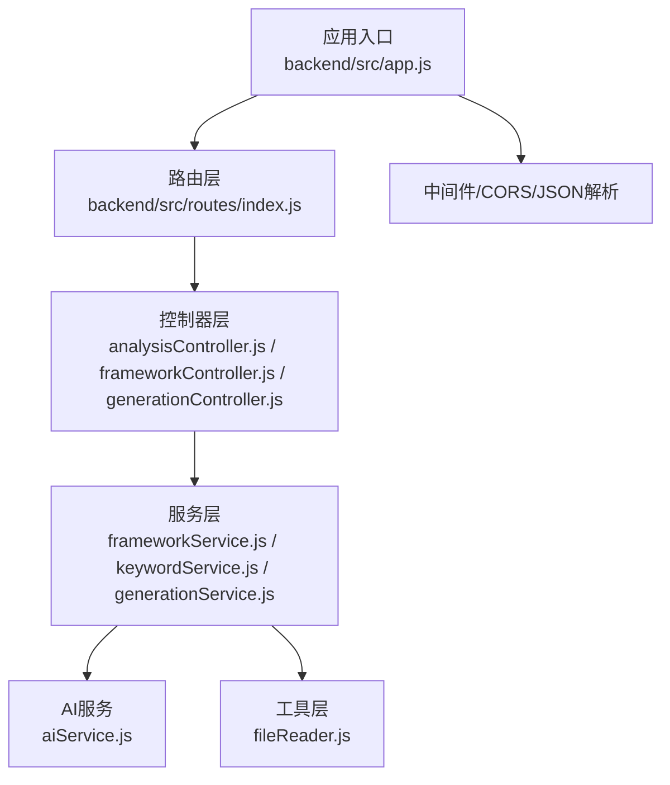
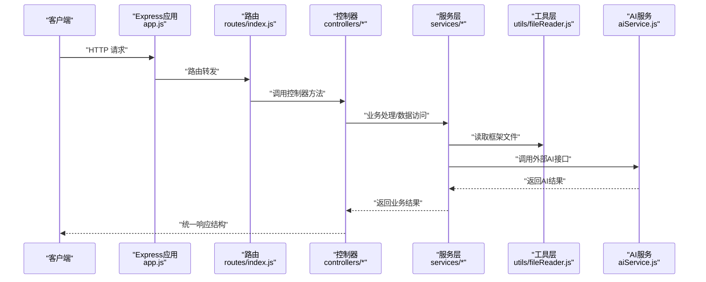
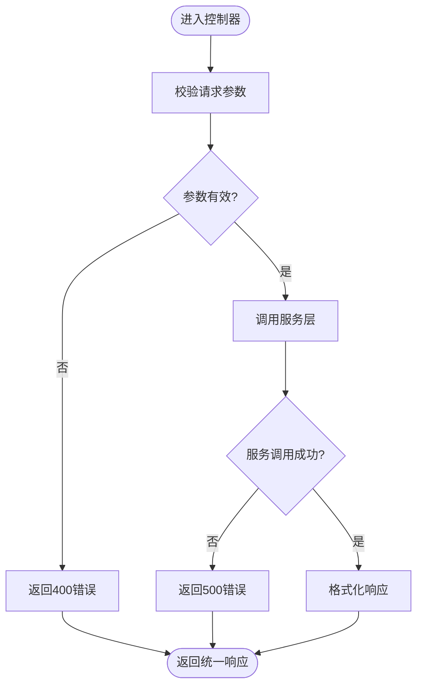
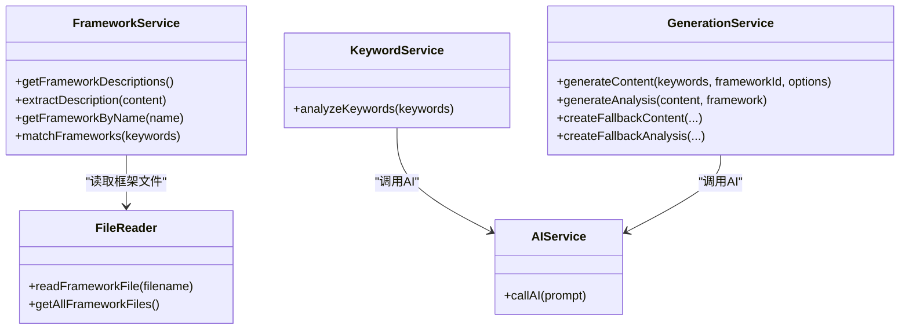
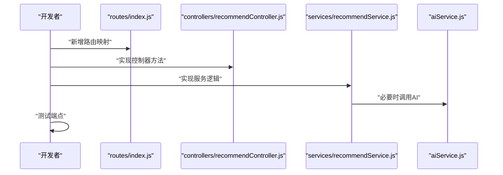
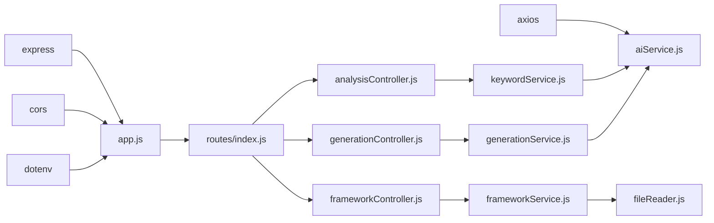

# 后端API开发

<cite>
**本文引用的文件**
- [backend/src/app.js](file://backend/src/app.js)
- [backend/src/routes/index.js](file://backend/src/routes/index.js)
- [backend/src/controllers/analysisController.js](file://backend/src/controllers/analysisController.js)
- [backend/src/controllers/frameworkController.js](file://backend/src/controllers/frameworkController.js)
- [backend/src/controllers/generationController.js](file://backend/src/controllers/generationController.js)
- [backend/src/services/frameworkService.js](file://backend/src/services/frameworkService.js)
- [backend/src/services/keywordService.js](file://backend/src/services/keywordService.js)
- [backend/src/services/generationService.js](file://backend/src/services/generationService.js)
- [backend/src/services/aiService.js](file://backend/src/services/aiService.js)
- [backend/src/utils/fileReader.js](file://backend/src/utils/fileReader.js)
- [backend/package.json](file://backend/package.json)
- [backend/.env.example](file://backend/.env.example)
</cite>

## 目录
1. [简介](#简介)
2. [项目结构](#项目结构)
3. [核心组件](#核心组件)
4. [架构总览](#架构总览)
5. [详细组件分析](#详细组件分析)
6. [依赖关系分析](#依赖关系分析)
7. [性能考量](#性能考量)
8. [故障排查指南](#故障排查指南)
9. [结论](#结论)
10. [附录](#附录)

## 简介
本指南面向后端API开发者，系统讲解基于 Express 的 RESTful API 设计与实现，涵盖路由设计、控制器层职责分离、服务层封装模式、错误处理策略、中间件与 CORS 配置等最佳实践。文档结合仓库现有代码，提供从零新增 API 端点的完整流程与可视化图示，帮助团队快速构建稳定、可维护的后端服务。

## 项目结构
后端采用经典的 MVC 分层架构：
- 应用入口负责初始化 Express、中间件与路由挂载
- 路由层统一暴露 RESTful 端点
- 控制器层负责请求参数校验、业务调度与响应格式化
- 服务层封装业务逻辑与数据访问抽象
- 工具层提供文件读取等通用能力
- 配置层通过环境变量控制运行参数

图表来源
- [backend/src/app.js](file://backend/src/app.js#L1-L26)
- [backend/src/routes/index.js](file://backend/src/routes/index.js#L1-L21)
- [backend/src/controllers/analysisController.js](file://backend/src/controllers/analysisController.js#L1-L37)
- [backend/src/controllers/frameworkController.js](file://backend/src/controllers/frameworkController.js#L1-L49)
- [backend/src/controllers/generationController.js](file://backend/src/controllers/generationController.js#L1-L100)
- [backend/src/services/frameworkService.js](file://backend/src/services/frameworkService.js#L1-L64)
- [backend/src/services/keywordService.js](file://backend/src/services/keywordService.js#L1-L85)
- [backend/src/services/generationService.js](file://backend/src/services/generationService.js#L1-L194)
- [backend/src/services/aiService.js](file://backend/src/services/aiService.js#L1-L55)
- [backend/src/utils/fileReader.js](file://backend/src/utils/fileReader.js#L1-L49)

章节来源
- [backend/src/app.js](file://backend/src/app.js#L1-L26)
- [backend/src/routes/index.js](file://backend/src/routes/index.js#L1-L21)

## 核心组件
- 应用入口与中间件
  - 初始化 Express、CORS、JSON 解析、路由挂载
  - 通过环境变量控制端口与跨域来源
- 路由层
  - 统一前缀 /api，暴露 GET/POST 端点
  - 对应控制器函数，遵循 RESTful 命名规范
- 控制器层
  - 参数校验（必填字段、类型）
  - 异常捕获与统一错误响应
  - 统一响应结构 { success, data|error }
- 服务层
  - 封装业务逻辑与数据访问
  - AI 调用抽象与降级策略
  - 文件读取与框架匹配算法

章节来源
- [backend/src/app.js](file://backend/src/app.js#L1-L26)
- [backend/src/routes/index.js](file://backend/src/routes/index.js#L1-L21)
- [backend/src/controllers/analysisController.js](file://backend/src/controllers/analysisController.js#L1-L37)
- [backend/src/controllers/frameworkController.js](file://backend/src/controllers/frameworkController.js#L1-L49)
- [backend/src/controllers/generationController.js](file://backend/src/controllers/generationController.js#L1-L100)
- [backend/src/services/keywordService.js](file://backend/src/services/keywordService.js#L1-L85)
- [backend/src/services/generationService.js](file://backend/src/services/generationService.js#L1-L194)
- [backend/src/services/aiService.js](file://backend/src/services/aiService.js#L1-L55)
- [backend/src/utils/fileReader.js](file://backend/src/utils/fileReader.js#L1-L49)

## 架构总览
下图展示了从客户端请求到响应返回的完整链路，体现控制器-服务-工具-外部AI的调用关系。

图表来源
- [backend/src/app.js](file://backend/src/app.js#L1-L26)
- [backend/src/routes/index.js](file://backend/src/routes/index.js#L1-L21)
- [backend/src/controllers/analysisController.js](file://backend/src/controllers/analysisController.js#L1-L37)
- [backend/src/controllers/frameworkController.js](file://backend/src/controllers/frameworkController.js#L1-L49)
- [backend/src/controllers/generationController.js](file://backend/src/controllers/generationController.js#L1-L100)
- [backend/src/services/frameworkService.js](file://backend/src/services/frameworkService.js#L1-L64)
- [backend/src/services/keywordService.js](file://backend/src/services/keywordService.js#L1-L85)
- [backend/src/services/generationService.js](file://backend/src/services/generationService.js#L1-L194)
- [backend/src/services/aiService.js](file://backend/src/services/aiService.js#L1-L55)
- [backend/src/utils/fileReader.js](file://backend/src/utils/fileReader.js#L1-L49)

## 详细组件分析

### 应用入口与中间件
- 功能要点
  - 读取 .env 环境变量
  - 配置 CORS（origin 来自环境变量）
  - 启用 JSON 请求体解析
  - 将 /api 前缀路由挂载至 routes/index.js
  - 监听端口并输出启动日志
- 最佳实践
  - 将敏感配置放入 .env，避免硬编码
  - CORS.origin 建议限定为可信域名
  - JSON 解析大小限制可根据业务调整

章节来源
- [backend/src/app.js](file://backend/src/app.js#L1-L26)
- [backend/.env.example](file://backend/.env.example#L1-L3)

### 路由层设计
- 端点一览
  - GET /api/frameworks：获取所有框架描述
  - GET /api/frameworks/:name：按名称获取框架详情
  - POST /api/analyze：关键词分析
  - POST /api/generate：内容生成
  - POST /api/generate/analysis：内容质量分析
  - GET /api/proxy-image：图片代理（解决跨域下载）
- 设计原则
  - 使用名词复数表示集合（/frameworks）
  - 使用路径参数定位单个资源（/frameworks/:name）
  - 使用动词表示动作（/analyze, /generate）
  - 统一前缀 /api，便于版本化与扩展

章节来源
- [backend/src/routes/index.js](file://backend/src/routes/index.js#L1-L21)

### 控制器层职责分离
- 请求参数验证
  - 关键字段必填校验（keywords、frameworkId、content 等）
  - 缺失时返回 400 与统一错误结构
- 业务逻辑处理
  - 调用对应服务层方法
  - 对于代理图片，使用 axios 流式传输
- 响应格式化
  - 成功：{ success: true, data }
  - 失败：{ success: false, error }

图表来源
- [backend/src/controllers/analysisController.js](file://backend/src/controllers/analysisController.js#L1-L37)
- [backend/src/controllers/frameworkController.js](file://backend/src/controllers/frameworkController.js#L1-L49)
- [backend/src/controllers/generationController.js](file://backend/src/controllers/generationController.js#L1-L100)

章节来源
- [backend/src/controllers/analysisController.js](file://backend/src/controllers/analysisController.js#L1-L37)
- [backend/src/controllers/frameworkController.js](file://backend/src/controllers/frameworkController.js#L1-L49)
- [backend/src/controllers/generationController.js](file://backend/src/controllers/generationController.js#L1-L100)

### 服务层封装模式
- 数据访问抽象
  - fileReader 提供框架文件读取与回退机制
  - frameworkService 将文件内容解析为框架元数据
- 事务管理
  - 当前服务层未涉及数据库事务；若引入数据库，建议在服务层或中间件中封装事务上下文
- 异常处理
  - 服务层内部 try/catch 包裹异步调用
  - AI 调用失败时提供降级策略（返回默认值）
  - 严格区分业务异常与网络异常，避免泄漏内部错误

图表来源
- [backend/src/services/frameworkService.js](file://backend/src/services/frameworkService.js#L1-L64)
- [backend/src/services/generationService.js](file://backend/src/services/generationService.js#L1-L194)
- [backend/src/services/keywordService.js](file://backend/src/services/keywordService.js#L1-L85)
- [backend/src/services/aiService.js](file://backend/src/services/aiService.js#L1-L55)
- [backend/src/utils/fileReader.js](file://backend/src/utils/fileReader.js#L1-L49)

章节来源
- [backend/src/services/frameworkService.js](file://backend/src/services/frameworkService.js#L1-L64)
- [backend/src/services/keywordService.js](file://backend/src/services/keywordService.js#L1-L85)
- [backend/src/services/generationService.js](file://backend/src/services/generationService.js#L1-L194)
- [backend/src/services/aiService.js](file://backend/src/services/aiService.js#L1-L55)
- [backend/src/utils/fileReader.js](file://backend/src/utils/fileReader.js#L1-L49)

### 新增API端点完整流程
以下流程以“新增 POST /api/recommend”为例，展示从路由到控制器再到服务层的完整实现步骤。

- 步骤1：在路由层注册端点
  - 在 routes/index.js 中添加路由映射
  - 参考路径：[backend/src/routes/index.js](file://backend/src/routes/index.js#L1-L21)
- 步骤2：编写控制器方法
  - 在 controllers 目录新增 recommendController.js 或复用现有控制器
  - 实现参数校验与统一响应
  - 参考路径：[backend/src/controllers/analysisController.js](file://backend/src/controllers/analysisController.js#L1-L37)
- 步骤3：实现服务层逻辑
  - 在 services 目录新增 recommendService.js 或复用现有服务
  - 封装业务逻辑与降级策略
  - 参考路径：[backend/src/services/keywordService.js](file://backend/src/services/keywordService.js#L1-L85)
- 步骤4：调用AI或外部服务（如需）
  - 通过 aiService.callAI(prompt) 获取结果
  - 参考路径：[backend/src/services/aiService.js](file://backend/src/services/aiService.js#L1-L55)
- 步骤5：测试与验证
  - 使用 curl 或 Postman 访问 /api/recommend
  - 确认响应结构与状态码符合预期

图表来源
- [backend/src/routes/index.js](file://backend/src/routes/index.js#L1-L21)
- [backend/src/controllers/analysisController.js](file://backend/src/controllers/analysisController.js#L1-L37)
- [backend/src/services/keywordService.js](file://backend/src/services/keywordService.js#L1-L85)
- [backend/src/services/aiService.js](file://backend/src/services/aiService.js#L1-L55)

章节来源
- [backend/src/routes/index.js](file://backend/src/routes/index.js#L1-L21)
- [backend/src/controllers/analysisController.js](file://backend/src/controllers/analysisController.js#L1-L37)
- [backend/src/services/keywordService.js](file://backend/src/services/keywordService.js#L1-L85)
- [backend/src/services/aiService.js](file://backend/src/services/aiService.js#L1-L55)

## 依赖关系分析
- 模块耦合
  - 控制器仅依赖服务层接口，保持低耦合
  - 服务层依赖工具层与外部AI，边界清晰
- 外部依赖
  - express、cors、dotenv、axios
  - 通过 package.json 管理依赖版本
- 循环依赖
  - 当前结构未发现循环依赖风险

图表来源
- [backend/src/app.js](file://backend/src/app.js#L1-L26)
- [backend/src/routes/index.js](file://backend/src/routes/index.js#L1-L21)
- [backend/src/controllers/analysisController.js](file://backend/src/controllers/analysisController.js#L1-L37)
- [backend/src/controllers/frameworkController.js](file://backend/src/controllers/frameworkController.js#L1-L49)
- [backend/src/controllers/generationController.js](file://backend/src/controllers/generationController.js#L1-L100)
- [backend/src/services/keywordService.js](file://backend/src/services/keywordService.js#L1-L85)
- [backend/src/services/frameworkService.js](file://backend/src/services/frameworkService.js#L1-L64)
- [backend/src/services/generationService.js](file://backend/src/services/generationService.js#L1-L194)
- [backend/src/services/aiService.js](file://backend/src/services/aiService.js#L1-L55)
- [backend/src/utils/fileReader.js](file://backend/src/utils/fileReader.js#L1-L49)
- [backend/package.json](file://backend/package.json#L1-L17)

章节来源
- [backend/package.json](file://backend/package.json#L1-L17)

## 性能考量
- 请求体解析
  - 当前启用 express.json()，建议根据业务场景设置大小限制
- 超时与重试
  - AI 调用设置超时时间，建议在服务层增加指数退避重试
- 响应缓存
  - 对只读数据（如框架描述）可考虑短期缓存
- 并发与限流
  - 在网关或中间件层增加限流策略，防止突发流量压垮 AI 服务

## 故障排查指南
- 常见错误与处理
  - 400 错误：控制器参数校验失败，检查必填字段与类型
  - 404 错误：资源不存在（如框架名称），确认路径参数
  - 500 错误：服务层异常或 AI 调用失败，查看日志与降级策略
- CORS 问题
  - 确认 CORS.origin 与前端地址一致
  - 代理图片时检查响应头与跨域设置
- 环境变量
  - 确认 .env 文件存在且包含 PORT、CORS_ORIGIN

章节来源
- [backend/src/controllers/frameworkController.js](file://backend/src/controllers/frameworkController.js#L1-L49)
- [backend/src/controllers/generationController.js](file://backend/src/controllers/generationController.js#L1-L100)
- [backend/src/app.js](file://backend/src/app.js#L1-L26)
- [backend/.env.example](file://backend/.env.example#L1-L3)

## 结论
本指南基于现有代码库总结了 Express 后端 API 的设计与实现要点，强调了控制器-服务-工具三层职责分离与统一响应格式的重要性。通过标准化的路由设计、严格的参数校验与完善的错误处理，可以显著提升系统的稳定性与可维护性。新增端点时，遵循“路由-控制器-服务”的标准流程，有助于快速交付高质量功能。

## 附录
- RESTful 设计原则摘要
  - HTTP 方法：GET（查询）、POST（创建）、PUT/PATCH（更新）、DELETE（删除）
  - URL 命名：使用名词复数表示集合，路径参数定位单个资源
  - 状态码：200/201/204、400/401/403/404、500
- 最佳实践清单
  - 统一响应结构 { success, data|error }
  - 参数必填与类型校验
  - 服务层异常捕获与降级策略
  - CORS 与中间件合理配置
  - 环境变量集中管理