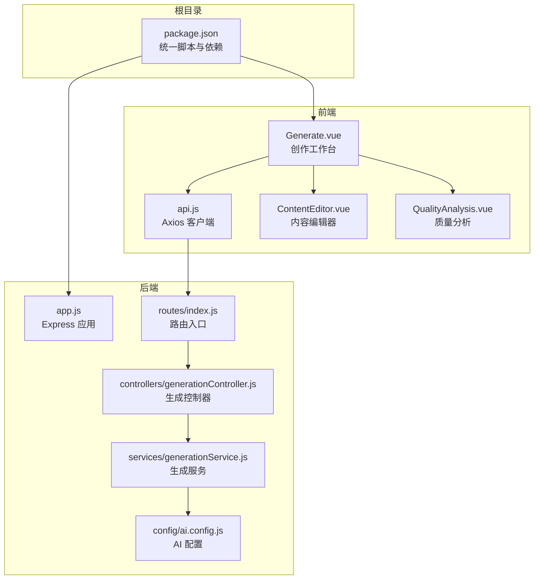
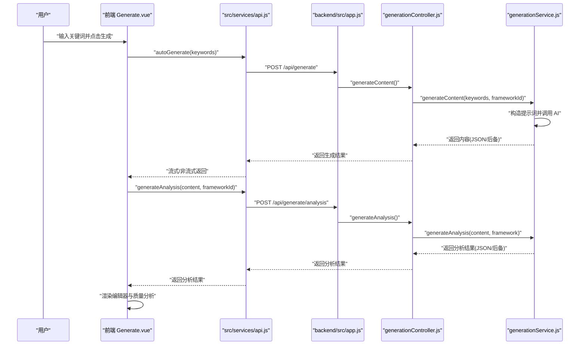
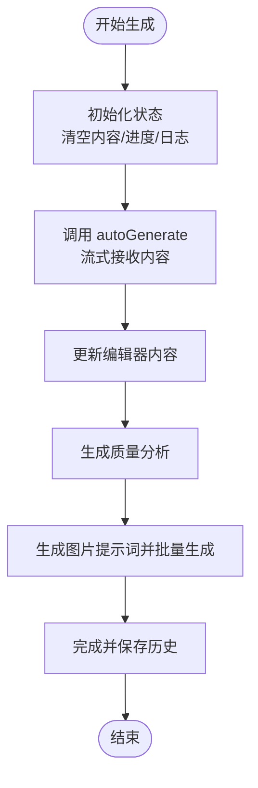
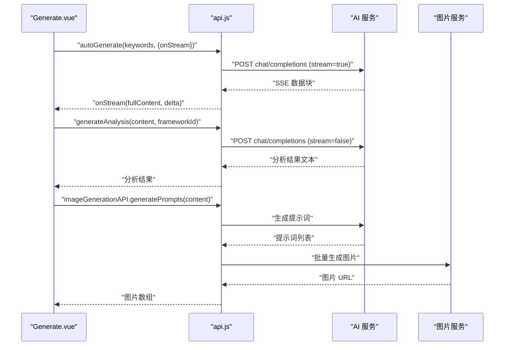
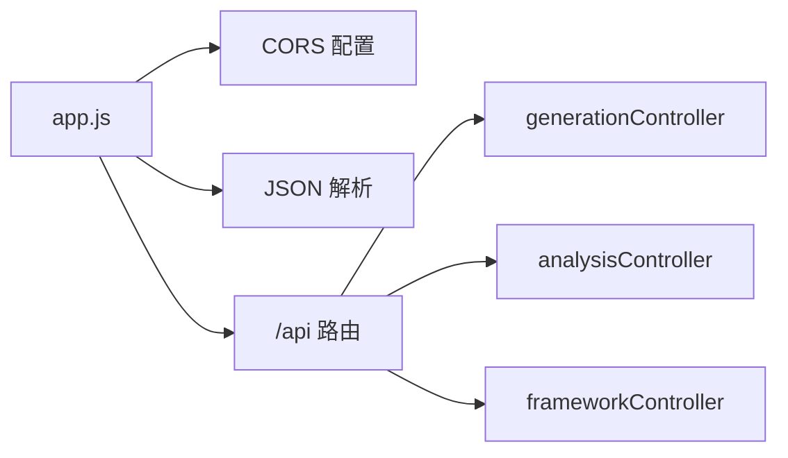
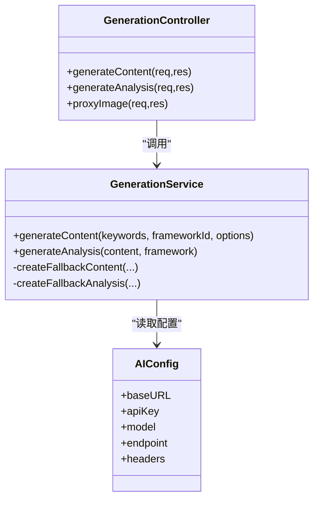
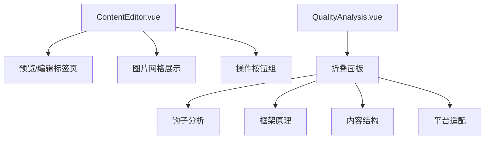
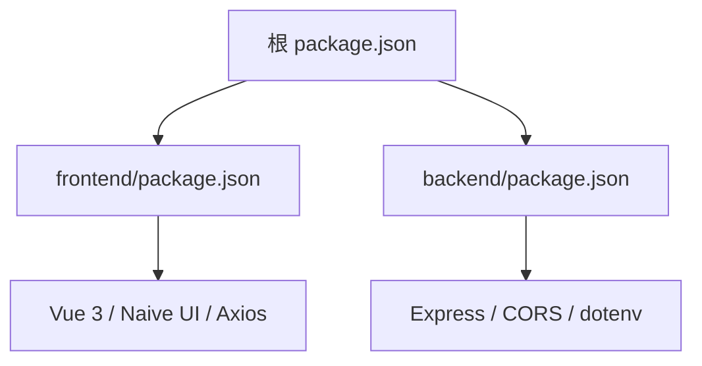

# 开发指南

<cite>
**本文引用的文件**   
- [README.md](file://README.md)
- [package.json](file://package.json)
- [backend/package.json](file://backend/package.json)
- [frontend/package.json](file://frontend/package.json)
- [backend/src/app.js](file://backend/src/app.js)
- [backend/src/routes/index.js](file://backend/src/routes/index.js)
- [backend/src/controllers/generationController.js](file://backend/src/controllers/generationController.js)
- [backend/src/services/generationService.js](file://backend/src/services/generationService.js)
- [backend/src/config/ai.config.js](file://backend/src/config/ai.config.js)
- [src/views/Generate.vue](file://src/views/Generate.vue)
- [src/services/api.js](file://src/services/api.js)
- [src/components/ContentEditor.vue](file://src/components/ContentEditor.vue)
- [src/components/QualityAnalysis.vue](file://src/components/QualityAnalysis.vue)
- [docs/GUIDE.md](file://docs/GUIDE.md)
- [docs/EXAMPLES.md](file://docs/EXAMPLES.md)
</cite>

## 目录
1. [简介](#简介)
2. [项目结构](#项目结构)
3. [核心组件](#核心组件)
4. [架构总览](#架构总览)
5. [详细组件分析](#详细组件分析)
6. [依赖关系分析](#依赖关系分析)
7. [性能考虑](#性能考虑)
8. [故障排除指南](#故障排除指南)
9. [结论](#结论)
10. [附录](#附录)

## 简介
本指南面向希望参与“小红书爆款文案生成工具”开发与扩展的工程师，提供从环境搭建、开发流程、组件与API扩展、性能优化到部署与运维的全流程说明。项目采用前后端分离架构：前端基于 Vue 3/Vite，后端基于 Node.js/Express，通过统一的 /api 路由与后端交互；同时集成了 AI 与图片生成功能，支持流式生成、质量分析与实时预览。

## 项目结构
- 根目录提供统一的脚本与打包配置，便于一键安装与启动前后端。
- 前端 src 目录包含视图、组件、服务与路由，提供“创作工作台”的完整 UI 体验。
- 后端 backend 目录提供 Express 服务、路由与控制器，封装 AI 生成与图片代理能力。
- docs 目录包含通用开发指南与示例，便于快速上手与规范开发。

**图表来源**
- [package.json](file://package.json#L6-L13)
- [backend/src/app.js](file://backend/src/app.js#L1-L26)
- [backend/src/routes/index.js](file://backend/src/routes/index.js#L1-L21)
- [backend/src/controllers/generationController.js](file://backend/src/controllers/generationController.js#L1-L100)
- [backend/src/services/generationService.js](file://backend/src/services/generationService.js#L1-L194)
- [backend/src/config/ai.config.js](file://backend/src/config/ai.config.js#L1-L18)
- [src/views/Generate.vue](file://src/views/Generate.vue#L1-L668)
- [src/services/api.js](file://src/services/api.js#L1-L454)
- [src/components/ContentEditor.vue](file://src/components/ContentEditor.vue#L1-L200)
- [src/components/QualityAnalysis.vue](file://src/components/QualityAnalysis.vue#L1-L138)

**章节来源**
- [README.md](file://README.md#L13-L22)
- [package.json](file://package.json#L6-L13)

## 核心组件
- 前端创作工作台：负责关键词输入、一键生成、流式进度展示、内容编辑、质量分析与图片生成。
- 生成服务：封装 AI 提示词与调用，提供内容生成与质量分析的后备策略。
- 控制器与路由：暴露 /api 路由，处理生成、分析与图片代理请求。
- AI 配置：集中管理 AI 服务地址、模型与鉴权信息。

**章节来源**
- [src/views/Generate.vue](file://src/views/Generate.vue#L177-L427)
- [src/services/api.js](file://src/services/api.js#L8-L454)
- [backend/src/controllers/generationController.js](file://backend/src/controllers/generationController.js#L10-L100)
- [backend/src/services/generationService.js](file://backend/src/services/generationService.js#L63-L194)
- [backend/src/config/ai.config.js](file://backend/src/config/ai.config.js#L6-L17)

## 架构总览
前端通过 /api 路由与后端通信，后端再调用 AI 服务生成内容与图片，最终返回给前端进行展示与编辑。

**图表来源**
- [src/views/Generate.vue](file://src/views/Generate.vue#L257-L324)
- [src/services/api.js](file://src/services/api.js#L250-L364)
- [backend/src/routes/index.js](file://backend/src/routes/index.js#L11-L16)
- [backend/src/controllers/generationController.js](file://backend/src/controllers/generationController.js#L10-L64)
- [backend/src/services/generationService.js](file://backend/src/services/generationService.js#L63-L162)

## 详细组件分析

### 前端：创作工作台（Generate.vue）
- 功能职责
  - 欢迎与功能卡片引导
  - 底部浮动输入区（关键词与特殊要求）
  - 生成流程可视化（进度条、时间线日志）
  - 内容编辑器（原始文本/结构化编辑）
  - 质量分析卡片
  - 实时预览（手机/桌面）
  - 历史记录管理（本地存储）
- 关键流程
  - handleQuickGenerate：触发全自动生成，支持流式回调，逐步推进进度与日志。
  - generateImages：基于文案生成图片提示词并批量生成图片。
  - generateQualityAnalysis：调用分析接口生成质量报告。
  - 历史记录：保存/加载/删除/清空。

**图表来源**
- [src/views/Generate.vue](file://src/views/Generate.vue#L257-L354)

**章节来源**
- [src/views/Generate.vue](file://src/views/Generate.vue#L177-L427)

### 前端：API 客户端（api.js）
- 职责
  - 统一配置 axios 客户端（/api 前缀、超时、鉴权头）。
  - AI 客户端：支持流式与非流式两种模式，构造系统提示词与用户消息。
  - 图片生成客户端：对接火山引擎（申图）接口，生成小红书推荐比例图片。
  - 框架与分析 API：提供框架列表、关键词分析与生成分析。
- 关键点
  - 流式传输：基于 fetch + ReadableStream，逐行解析 data: 行，增量回传。
  - 超时与错误：分别针对 AI 与图片生成设置较长超时，捕获并抛出错误。

**图表来源**
- [src/services/api.js](file://src/services/api.js#L8-L454)

**章节来源**
- [src/services/api.js](file://src/services/api.js#L8-L454)

### 后端：Express 应用与路由
- 应用启动
  - 加载 .env，启用 CORS，解析 JSON，挂载 /api 路由。
- 路由
  - GET /api/frameworks：获取框架列表
  - GET /api/frameworks/:name：获取指定框架
  - POST /api/analyze：关键词分析
  - POST /api/generate：生成内容
  - POST /api/generate/analysis：生成分析
  - GET /api/proxy-image：图片代理（解决跨域）

**图表来源**
- [backend/src/app.js](file://backend/src/app.js#L9-L24)
- [backend/src/routes/index.js](file://backend/src/routes/index.js#L4-L18)

**章节来源**
- [backend/src/app.js](file://backend/src/app.js#L1-L26)
- [backend/src/routes/index.js](file://backend/src/routes/index.js#L1-L21)

### 后端：生成控制器与服务
- 控制器
  - generateContent：校验参数，调用生成服务，返回 JSON。
  - generateAnalysis：校验参数，调用生成服务，返回分析结果。
  - proxyImage：拉取远端图片并以流方式转发，设置必要响应头。
- 服务
  - generateContent：构造提示词，调用 AI，解析 JSON，后备策略补全缺失字段。
  - generateAnalysis：构造分析提示词，调用 AI，解析 JSON，后备策略补全字段。
  - AI 配置：集中管理 AI 服务地址、模型与鉴权头。

**图表来源**
- [backend/src/controllers/generationController.js](file://backend/src/controllers/generationController.js#L10-L94)
- [backend/src/services/generationService.js](file://backend/src/services/generationService.js#L63-L194)
- [backend/src/config/ai.config.js](file://backend/src/config/ai.config.js#L6-L17)

**章节来源**
- [backend/src/controllers/generationController.js](file://backend/src/controllers/generationController.js#L1-L100)
- [backend/src/services/generationService.js](file://backend/src/services/generationService.js#L1-L194)
- [backend/src/config/ai.config.js](file://backend/src/config/ai.config.js#L1-L18)

### 前端：内容编辑器与质量分析
- 内容编辑器
  - 支持“预览模式”（Markdown 渲染）与“编辑模式”（原始文本编辑）。
  - 展示 AI 生成的图片，支持下载。
  - 提供重新生成、预览、加入知识库、人工审批发布等操作。
- 质量分析
  - 支持“原始文本”与“结构化分析”两种形态。
  - 分模块展示钩子分析、框架原理、内容结构与平台适配。

**图表来源**
- [src/components/ContentEditor.vue](file://src/components/ContentEditor.vue#L1-L200)
- [src/components/QualityAnalysis.vue](file://src/components/QualityAnalysis.vue#L21-L109)

**章节来源**
- [src/components/ContentEditor.vue](file://src/components/ContentEditor.vue#L1-L200)
- [src/components/QualityAnalysis.vue](file://src/components/QualityAnalysis.vue#L1-L138)

## 依赖关系分析
- 根脚本
  - 提供统一的 dev、build、preview 与并发启动脚本，便于快速开发与联调。
- 前端依赖
  - Vue 3、Naive UI、Axios、Element Plus 等，支撑 UI 与网络请求。
- 后端依赖
  - Express、CORS、dotenv，支撑服务启动与跨域配置。

**图表来源**
- [package.json](file://package.json#L6-L13)
- [frontend/package.json](file://frontend/package.json#L10-L15)
- [backend/package.json](file://backend/package.json#L10-L15)

**章节来源**
- [package.json](file://package.json#L1-L32)
- [frontend/package.json](file://frontend/package.json#L1-L21)
- [backend/package.json](file://backend/package.json#L1-L17)

## 性能考虑
- 前端性能
  - 懒加载与代码分割：按需加载大型组件与页面，减少首屏体积。
  - 图片优化：使用现代格式（WebP）、懒加载与占位骨架，降低阻塞。
  - 虚拟滚动：对长列表（如历史记录）采用虚拟滚动，避免 DOM 节点过多。
  - 事件节流/防抖：对高频输入与滚动事件进行节流/防抖。
- 后端性能
  - 请求超时与重试：为外部 AI 与图片服务设置合理超时与指数退避。
  - 流式响应：对长耗时任务采用流式返回，提升用户体验。
  - 缓存策略：对热点框架与分析模板进行缓存，减少重复计算。
  - 并发控制：限制同一关键词的并发生成数量，避免资源争用。
- 网络与跨域
  - 后端统一 CORS 配置，前端通过代理路径 /api 访问，避免跨域问题。
  - 图片代理：后端转发远端图片流，解决前端跨域下载限制。

[本节为通用性能建议，无需特定文件引用]

## 故障排除指南
- 启动与联调
  - 依赖未安装：使用根脚本一键安装前后端依赖。
  - 端口冲突：后端默认端口可在环境变量中调整。
  - CORS 错误：检查后端 CORS 配置与前端 baseURL。
- AI 与图片服务
  - AI 调用失败：检查鉴权头、模型名与超时设置；查看流式解析日志。
  - 图片生成失败：检查图片服务地址、鉴权与提示词格式；关注返回数据结构。
- 生成与分析
  - 参数缺失：确保 keywords 与 frameworkId 存在；控制器会返回 400。
  - JSON 解析失败：服务层具备后备策略，若 AI 返回非标准 JSON，将回退到默认内容。
- 图片代理
  - 代理失败：检查 URL 参数与远端服务可达性；查看后端错误日志。

**章节来源**
- [package.json](file://package.json#L6-L13)
- [backend/src/app.js](file://backend/src/app.js#L14-L16)
- [backend/src/controllers/generationController.js](file://backend/src/controllers/generationController.js#L14-L32)
- [backend/src/services/generationService.js](file://backend/src/services/generationService.js#L70-L94)
- [src/services/api.js](file://src/services/api.js#L120-L177)

## 结论
本指南从环境搭建、开发流程、组件与 API 扩展、性能优化到故障排除提供了系统化的实践路径。建议在新增功能时遵循“前端 API -> 后端路由/控制器 -> 服务层 -> AI/图片服务”的链路，确保错误处理与后备策略完备，并通过统一的脚本与配置管理提升开发效率与稳定性。

## 附录

### 开发环境搭建
- 一键安装与启动
  - 在项目根目录执行安装与启动脚本，同时启动前端与后端。
- 手动分步启动
  - 后端：进入 backend 目录安装依赖并启动开发服务器。
  - 前端：回到根目录安装依赖并启动开发服务器。
- 环境变量
  - 参考 .env.example 配置 AI 与图片服务的地址、模型与密钥。

**章节来源**
- [README.md](file://README.md#L24-L56)
- [package.json](file://package.json#L6-L13)

### 新功能开发流程（组件/API/测试）
- 组件开发
  - 在 src/components 中新增组件，按需导入或全局注册。
  - 在 views 中组合使用，确保与 api.js 的接口一致。
- API 扩展
  - 前端：在 src/services/api.js 中新增 API 方法，设置 baseURL 与鉴权。
  - 后端：在 backend/src/routes 与 controllers 中新增路由与控制器，服务层补充逻辑与后备策略。
- 测试策略
  - 单元测试：针对服务层与工具函数编写断言。
  - 集成测试：通过前端 mock 或后端接口测试工具验证端到端流程。
  - 回归测试：在新增功能后回归生成、分析与图片代理链路。

**章节来源**
- [docs/GUIDE.md](file://docs/GUIDE.md#L18-L460)
- [docs/EXAMPLES.md](file://docs/EXAMPLES.md#L1-L464)
- [src/services/api.js](file://src/services/api.js#L1-L454)
- [backend/src/routes/index.js](file://backend/src/routes/index.js#L1-L21)
- [backend/src/controllers/generationController.js](file://backend/src/controllers/generationController.js#L1-L100)
- [backend/src/services/generationService.js](file://backend/src/services/generationService.js#L1-L194)

### 部署与运维
- 构建与预览
  - 前端：使用构建脚本生成 dist 目录，本地预览生产包。
  - 后端：使用 Node 启动生产应用。
- 部署建议
  - 前端：将 dist 部署至静态服务器或 CDN。
  - 后端：容器化部署，配置环境变量与健康检查。
- 运维监控
  - 日志：统一输出请求与错误日志，便于排查。
  - 指标：采集生成耗时、成功率与图片生成成功率等指标。

**章节来源**
- [docs/GUIDE.md](file://docs/GUIDE.md#L342-L381)
- [backend/src/app.js](file://backend/src/app.js#L22-L24)