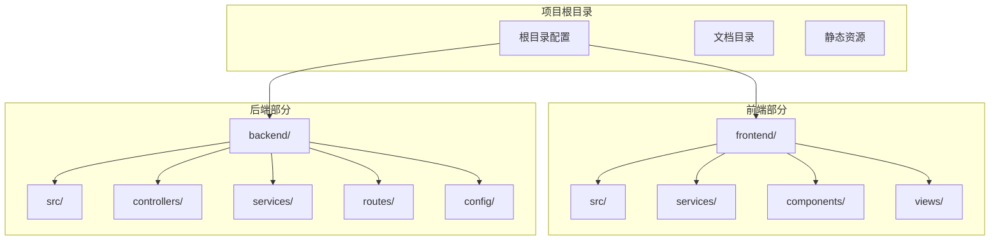
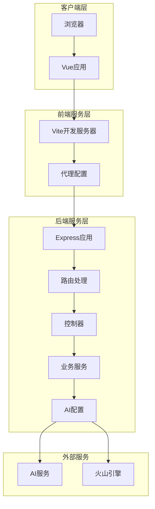
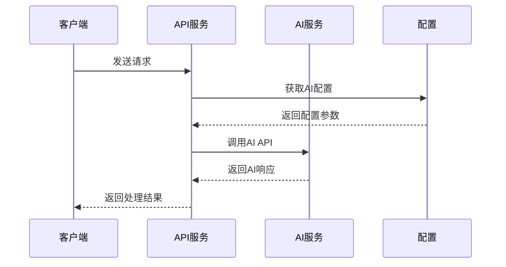

# 开发环境搭建

<cite>
**本文档引用的文件**
- [package.json](file://package.json)
- [backend/package.json](file://backend/package.json)
- [frontend/package.json](file://frontend/package.json)
- [.env.example](file://.env.example)
- [backend/.env.example](file://backend/.env.example)
- [vite.config.js](file://vite.config.js)
- [frontend/vite.config.js](file://frontend/vite.config.js)
- [backend/src/config/ai.config.js](file://backend/src/config/ai.config.js)
- [backend/src/app.js](file://backend/src/app.js)
- [frontend/src/services/api.js](file://frontend/src/services/api.js)
- [backend/src/routes/index.js](file://backend/src/routes/index.js)
- [backend/src/services/aiService.js](file://backend/src/services/aiService.js)
- [README.md](file://README.md)
</cite>

## 目录
1. [简介](#简介)
2. [项目结构](#项目结构)
3. [核心组件](#核心组件)
4. [架构概览](#架构概览)
5. [详细组件分析](#详细组件分析)
6. [依赖分析](#依赖分析)
7. [性能考虑](#性能考虑)
8. [故障排除指南](#故障排除指南)
9. [结论](#结论)
10. [附录](#附录)

## 简介

这是一个基于Vue 3和Node.js的前后端分离项目，专门为小红书（Xiaohongshu）创作者打造的智能图文生成工具。项目集成了多种AI能力与爆款文案框架，支持智能文案生成、实时效果预览、全自动配图和质量分析诊断等功能。

## 项目结构

该项目采用前后端分离架构，主要包含以下核心目录：



**图表来源**
- [package.json](file://package.json#L1-L32)
- [backend/package.json](file://backend/package.json#L1-L17)
- [frontend/package.json](file://frontend/package.json#L1-L21)

**章节来源**
- [README.md](file://README.md#L13-L22)

## 核心组件

### 环境变量配置

项目使用dotenv进行环境变量管理，包含两个主要配置文件：

#### 前端环境变量 (.env.example)
- **VITE_AI_API_KEY**: AI服务API密钥
- **VITE_AI_BASE_URL**: AI服务基础URL
- **VITE_AI_MODEL**: AI模型名称
- **VITE_VOLCENGINE_API_KEY**: 字节跳动火山引擎API密钥
- **VITE_VOLCENGINE_BASE_URL**: 火山引擎基础URL
- **VITE_VOLCENGINE_MODEL**: 火山引擎模型名称

#### 后端环境变量 (.env.example)
- **PORT**: 服务器端口号，默认8099
- **CORS_ORIGIN**: CORS允许的源地址，默认http://localhost:3000

**章节来源**
- [.env.example](file://.env.example#L1-L9)
- [backend/.env.example](file://backend/.env.example#L1-L3)

### 包管理器选择

项目同时支持npm和pnpm两种包管理器，但推荐使用pnpm以获得更好的性能和磁盘空间利用率。

**章节来源**
- [package.json](file://package.json#L6-L14)
- [backend/package.json](file://backend/package.json#L1-L17)
- [frontend/package.json](file://frontend/package.json#L1-L21)

## 架构概览

系统采用前后端分离架构，通过Vite开发服务器提供前端服务，Node.js Express提供后端API服务。



**图表来源**
- [vite.config.js](file://vite.config.js#L11-L29)
- [backend/src/app.js](file://backend/src/app.js#L1-L26)
- [backend/src/routes/index.js](file://backend/src/routes/index.js#L1-L21)
- [backend/src/config/ai.config.js](file://backend/src/config/ai.config.js#L6-L17)

## 详细组件分析

### 开发服务器配置

#### 前端Vite配置
前端使用Vite作为开发服务器，默认配置如下：
- **端口**: 3000
- **代理**: 将/api前缀代理到后端服务器
- **热重载**: 支持HMR功能

#### 后端Express配置
后端使用Express作为API服务器，默认配置如下：
- **端口**: 8099 (可通过环境变量PORT修改)
- **CORS**: 允许指定源访问
- **中间件**: JSON解析、路由挂载

**章节来源**
- [frontend/vite.config.js](file://frontend/vite.config.js#L8-L16)
- [vite.config.js](file://vite.config.js#L11-L29)
- [backend/src/app.js](file://backend/src/app.js#L12-L16)

### API服务配置

#### 前端API配置
前端使用Axios创建API实例，配置如下：
- **baseURL**: `/api` (通过代理转发)
- **timeout**: 10000ms
- **模块化API**: 分别定义frameworkAPI、analysisAPI、generationAPI

#### 后端路由配置
后端提供以下API端点：
- `GET /api/frameworks` - 获取所有框架
- `GET /api/frameworks/:name` - 根据名称获取框架
- `POST /api/analyze` - 关键词分析
- `POST /api/generate` - 内容生成
- `POST /api/generate/analysis` - 生成内容分析
- `GET /api/proxy-image` - 图片代理

**章节来源**
- [frontend/src/services/api.js](file://frontend/src/services/api.js#L8-L11)
- [frontend/src/services/api.js](file://frontend/src/services/api.js#L13-L35)
- [backend/src/routes/index.js](file://backend/src/routes/index.js#L11-L16)

### AI服务配置

#### AI配置参数
系统集成了多个AI服务，主要配置包括：
- **基础URL**: `https://router.shengsuanyun.com/v1`
- **API Key**: 预设的测试密钥
- **模型**: `bigmodel/glm-4.7`
- **端点**: `/chat/completions`
- **请求头**: 包含Content-Type、Authorization、HTTP-Referer等

#### AI服务调用流程


**图表来源**
- [backend/src/services/aiService.js](file://backend/src/services/aiService.js#L14-L53)
- [backend/src/config/ai.config.js](file://backend/src/config/ai.config.js#L6-L17)

**章节来源**
- [backend/src/config/ai.config.js](file://backend/src/config/ai.config.js#L6-L17)
- [backend/src/services/aiService.js](file://backend/src/services/aiService.js#L14-L53)

## 依赖分析

### 核心依赖关系

```mermaid
graph TB
subgraph "前端依赖"
Vue[Vue 3]
Vite[Vite]
Axios[Axios]
ElementPlus[Element Plus]
VueRouter[Vue Router]
end
subgraph "后端依赖"
Express[Express]
Dotenv[Dotenv]
Cors[Cors]
AxiosBackend[Axios]
end
subgraph "开发工具"
Concurrently[Concurrently]
PluginVue[@vitejs/plugin-vue]
end
Vue --> Axios
Vite --> PluginVue
Express --> Dotenv
Express --> Cors
Express --> AxiosBackend
```

**图表来源**
- [package.json](file://package.json#L15-L30)
- [backend/package.json](file://backend/package.json#L10-L15)
- [frontend/package.json](file://frontend/package.json#L10-L19)

### 依赖安装策略

项目提供了多种依赖安装方式：

1. **一键安装**: `npm run install:all` - 安装根目录和后端所有依赖
2. **分别安装**: 分别在根目录和backend目录执行npm install
3. **独立安装**: 前端和后端可独立安装和启动

**章节来源**
- [package.json](file://package.json#L13-L13)

## 性能考虑

### 开发服务器性能优化

1. **端口配置**: 前端默认3000端口，后端默认8099端口，避免端口冲突
2. **代理配置**: Vite代理确保前后端分离开发时的API通信
3. **热重载**: HMR提供快速的开发体验
4. **并发启动**: 使用concurrently同时启动前后端服务

### 环境变量优化

1. **前端变量前缀**: 使用VITE_前缀确保变量在构建时可用
2. **配置分离**: 将敏感信息存储在.env文件中
3. **默认值设置**: 为配置项提供合理的默认值

## 故障排除指南

### 常见问题及解决方案

#### 端口冲突问题

**问题**: 开发服务器启动时提示端口已被占用

**解决方案**:
1. 修改前端端口配置 (frontend/vite.config.js)
2. 修改后端端口配置 (backend/.env 或 backend/src/app.js)
3. 使用系统命令查找占用端口的进程并终止

**章节来源**
- [vite.config.js](file://vite.config.js#L13-L13)
- [backend/src/app.js](file://backend/src/app.js#L12-L12)

#### 依赖安装失败

**问题**: npm install或pnpm install执行失败

**解决方案**:
1. 清理缓存: `npm cache clean --force`
2. 删除node_modules和lock文件重新安装
3. 检查网络连接和npm registry配置
4. 使用pnpm替代npm进行安装

**章节来源**
- [package.json](file://package.json#L13-L13)

#### API调用失败

**问题**: 前端无法连接到后端API

**解决方案**:
1. 检查后端服务是否正常启动
2. 验证代理配置是否正确
3. 确认CORS设置允许前端源访问
4. 检查防火墙设置

**章节来源**
- [frontend/src/services/api.js](file://frontend/src/services/api.js#L8-L11)
- [vite.config.js](file://vite.config.js#L23-L28)

#### AI服务配置错误

**问题**: AI服务调用失败或返回空内容

**解决方案**:
1. 更新.env文件中的API密钥
2. 验证AI服务的基础URL和模型配置
3. 检查网络连接和API服务可用性
4. 查看控制台错误日志

**章节来源**
- [.env.example](file://.env.example#L1-L9)
- [backend/src/services/aiService.js](file://backend/src/services/aiService.js#L45-L52)

## 结论

本项目提供了一个完整的前后端分离开发环境，具有以下特点：

1. **清晰的架构分离**: 前后端职责明确，便于独立开发和部署
2. **灵活的配置管理**: 通过dotenv实现环境变量管理
3. **高效的开发体验**: Vite提供快速的热重载和构建体验
4. **完善的错误处理**: 包含详细的错误处理和调试信息

建议开发者按照本文档的步骤进行环境搭建，并根据实际需求调整配置参数。

## 附录

### 开发环境搭建步骤

1. **克隆项目**: `git clone <repository-url>`
2. **安装依赖**: `npm run install:all`
3. **配置环境变量**: 复制.env.example为.env并填写配置
4. **启动服务**: `npm run dev:all` 或分别启动前后端
5. **访问应用**: 浏览器访问 http://localhost:3000

### IDE配置建议

1. **VS Code扩展**:
   - Vue Language Features (Volar)
   - ESLint
   - Prettier
   - Auto Rename Tag

2. **调试配置**:
   - 前端: 配置Vite调试配置
   - 后端: 配置Node.js调试配置

### 调试工具设置

1. **浏览器开发者工具**: 检查网络请求和控制台错误
2. **Node.js调试器**: 设置断点调试后端逻辑
3. **API测试工具**: 使用Postman测试API端点
4. **日志监控**: 查看控制台输出的错误信息