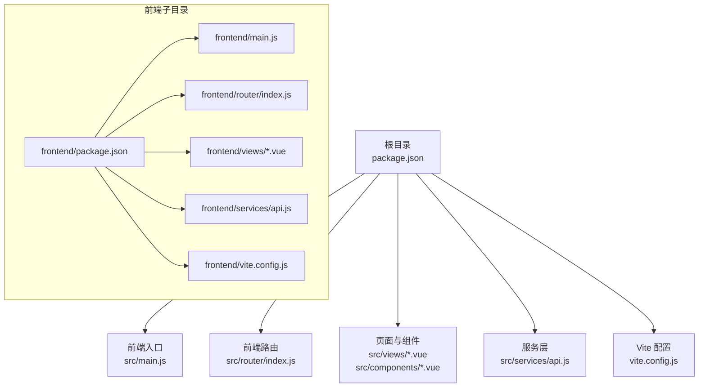
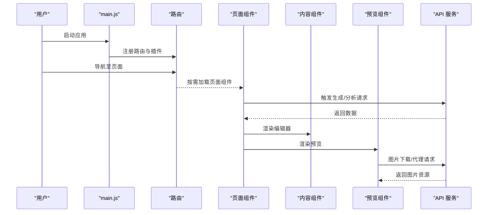
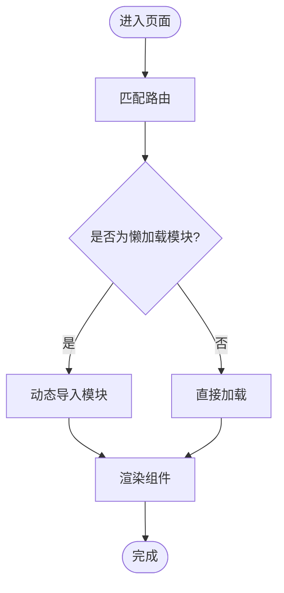
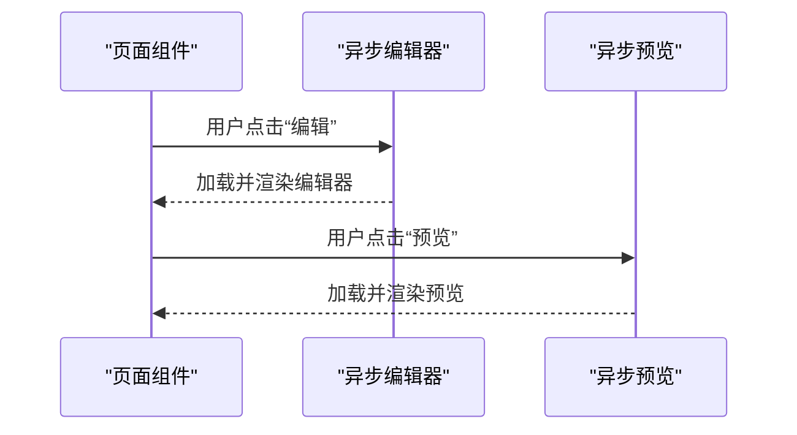
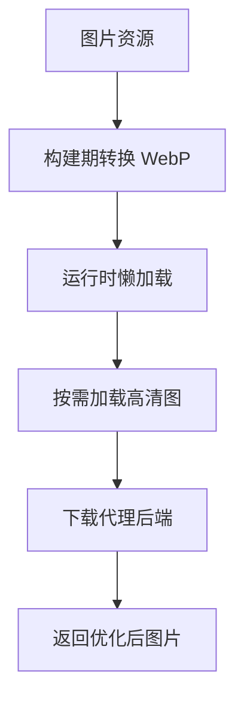
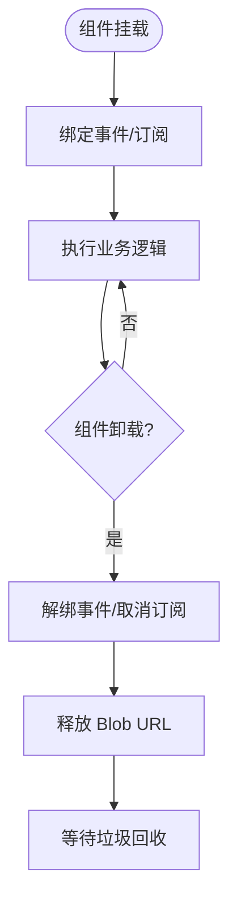
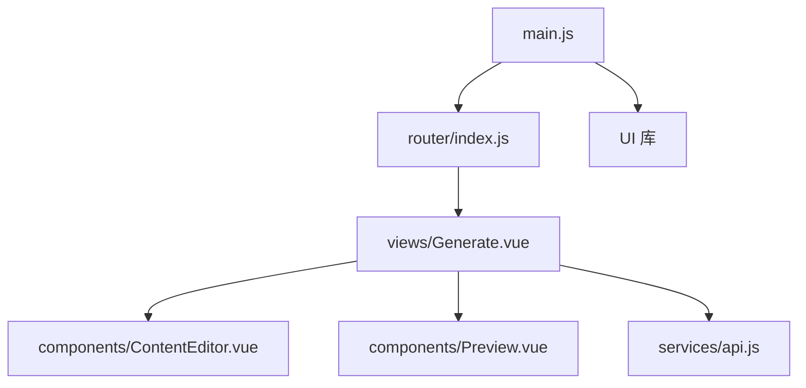

# 前端性能优化

<cite>
**本文引用的文件**
- [vite.config.js](file://vite.config.js)
- [frontend/vite.config.js](file://frontend/vite.config.js)
- [package.json](file://package.json)
- [frontend/package.json](file://frontend/package.json)
- [src/main.js](file://src/main.js)
- [frontend/src/main.js](file://frontend/src/main.js)
- [src/router/index.js](file://src/router/index.js)
- [frontend/src/router/index.js](file://frontend/src/router/index.js)
- [src/views/Generate.vue](file://src/views/Generate.vue)
- [frontend/src/views/Generate.vue](file://frontend/src/views/Generate.vue)
- [src/components/ContentEditor.vue](file://src/components/ContentEditor.vue)
- [src/components/Preview.vue](file://src/components/Preview.vue)
- [src/services/api.js](file://src/services/api.js)
- [frontend/src/services/api.js](file://frontend/src/services/api.js)
- [src/App.vue](file://src/App.vue)
</cite>

## 目录
1. [简介](#简介)
2. [项目结构](#项目结构)
3. [核心组件](#核心组件)
4. [架构总览](#架构总览)
5. [详细组件分析](#详细组件分析)
6. [依赖关系分析](#依赖关系分析)
7. [性能考量](#性能考量)
8. [故障排查指南](#故障排查指南)
9. [结论](#结论)
10. [附录](#附录)

## 简介
本指南面向 Vue 3 + Vite 的前端工程，聚焦于在现有代码基础上实施系统性的性能优化。内容覆盖代码分割与组件懒加载、图片资源优化（WebP 转换与懒加载）、构建期优化（Vite 插件与压缩策略）、内存与垃圾回收优化、以及性能监控工具的使用方法。文档同时提供可落地的配置与实现路径，帮助在不改变业务逻辑的前提下显著提升首屏速度、交互流畅度与资源占用表现。

## 项目结构
该项目采用前后端同仓库组织，前端位于根目录与 frontend 子目录，分别对应两套独立的 Vite 配置与依赖。核心入口为 main.js，路由位于 router/index.js，页面与组件集中在 src/views 与 src/components 中，服务层封装在 src/services/api.js。

图表来源
- [package.json](file://package.json#L1-L32)
- [src/main.js](file://src/main.js#L1-L16)
- [src/router/index.js](file://src/router/index.js#L1-L26)
- [src/services/api.js](file://src/services/api.js#L1-L454)
- [vite.config.js](file://vite.config.js#L1-L37)
- [frontend/package.json](file://frontend/package.json#L1-L21)
- [frontend/src/main.js](file://frontend/src/main.js#L1-L15)
- [frontend/src/router/index.js](file://frontend/src/router/index.js#L1-L26)
- [frontend/src/services/api.js](file://frontend/src/services/api.js#L1-L40)
- [frontend/vite.config.js](file://frontend/vite.config.js#L1-L19)

章节来源
- [package.json](file://package.json#L1-L32)
- [frontend/package.json](file://frontend/package.json#L1-L21)

## 核心组件
- 应用入口与插件注册：在 main.js 中注册路由与 UI 库，确保最小启动体积与按需加载。
- 路由与视图：路由定义集中，页面组件在首次访问时才加载，利于代码分割。
- 服务层：统一封装 API 请求，便于在构建期与运行期做缓存与并发控制优化。
- 组件层：内容编辑器与预览组件承担大量 DOM 与图片渲染，是性能优化的关键落点。

章节来源
- [src/main.js](file://src/main.js#L1-L16)
- [frontend/src/main.js](file://frontend/src/main.js#L1-L15)
- [src/router/index.js](file://src/router/index.js#L1-L26)
- [frontend/src/router/index.js](file://frontend/src/router/index.js#L1-L26)
- [src/services/api.js](file://src/services/api.js#L1-L454)
- [frontend/src/services/api.js](file://frontend/src/services/api.js#L1-L40)

## 架构总览
下图展示了前端启动、路由导航与页面渲染的整体流程，以及图片懒加载与服务层请求的交互位置。

图表来源
- [src/main.js](file://src/main.js#L1-L16)
- [src/router/index.js](file://src/router/index.js#L1-L26)
- [src/views/Generate.vue](file://src/views/Generate.vue#L1-L668)
- [src/components/ContentEditor.vue](file://src/components/ContentEditor.vue#L1-L418)
- [src/components/Preview.vue](file://src/components/Preview.vue#L1-L411)
- [src/services/api.js](file://src/services/api.js#L1-L454)

## 详细组件分析

### 路由与代码分割
- 现状：路由定义集中，页面组件在首次访问时加载，具备天然的按需加载能力。
- 优化建议：
  - 将大型页面拆分为多个子路由模块，结合动态导入进一步细化分割点。
  - 对非关键路径（如“设置/帮助”）使用异步组件，减少初始包体。
  - 在路由守卫中对低优先级功能延迟初始化，避免阻塞首屏。

图表来源
- [src/router/index.js](file://src/router/index.js#L1-L26)
- [frontend/src/router/index.js](file://frontend/src/router/index.js#L1-L26)

章节来源
- [src/router/index.js](file://src/router/index.js#L1-L26)
- [frontend/src/router/index.js](file://frontend/src/router/index.js#L1-L26)

### 组件懒加载与按需渲染
- 现状：页面组件在路由命中时加载；编辑器与预览组件在条件渲染时出现。
- 优化建议：
  - 将重型组件（如编辑器、预览）改为异步组件，仅在用户显式触发时加载。
  - 对图片较多的组件启用虚拟滚动或分页加载，降低一次性渲染压力。
  - 使用 keep-alive 缓存稳定不变的子树，避免重复渲染。

图表来源
- [src/views/Generate.vue](file://src/views/Generate.vue#L1-L668)
- [src/components/ContentEditor.vue](file://src/components/ContentEditor.vue#L1-L418)
- [src/components/Preview.vue](file://src/components/Preview.vue#L1-L411)

章节来源
- [src/views/Generate.vue](file://src/views/Generate.vue#L1-L668)
- [src/components/ContentEditor.vue](file://src/components/ContentEditor.vue#L1-L418)
- [src/components/Preview.vue](file://src/components/Preview.vue#L1-L411)

### 图片资源优化（WebP 与懒加载）
- 现状：图片以静态资源形式引入，预览组件使用图片展示与下载。
- 优化建议：
  - 构建期将 PNG/JPG 转换为 WebP，优先级降级回 PNG/JPEG，以减小体积。
  - 对长列表图片启用懒加载（IntersectionObserver + loading="lazy"），减少首屏渲染负担。
  - 对下载场景使用后端代理，避免跨域与缓存问题，同时可统一做格式转换与尺寸裁剪。
  - 对缩略图与大图分离，移动端优先加载低分辨率版本，再按需替换高清图。

图表来源
- [src/components/Preview.vue](file://src/components/Preview.vue#L146-L166)
- [src/components/ContentEditor.vue](file://src/components/ContentEditor.vue#L28-L58)

章节来源
- [src/components/Preview.vue](file://src/components/Preview.vue#L1-L411)
- [src/components/ContentEditor.vue](file://src/components/ContentEditor.vue#L1-L418)

### 构建优化（Vite 插件与压缩策略）
- 现状：使用 @vitejs/plugin-vue，开发服务器与代理已配置。
- 优化建议：
  - 启用压缩（terser 或 esbuild），开启资源内联阈值与最小化策略。
  - 使用 rollup 插件进行产物分析与重复依赖剔除。
  - 配置 external 与 dynamicImport，减少 vendor 包体积。
  - 在生产环境开启资源哈希与长效缓存策略，配合 CDN。

图表来源
- [vite.config.js](file://vite.config.js#L1-L37)
- [frontend/vite.config.js](file://frontend/vite.config.js#L1-L19)

章节来源
- [vite.config.js](file://vite.config.js#L1-L37)
- [frontend/vite.config.js](file://frontend/vite.config.js#L1-L19)
- [package.json](file://package.json#L27-L30)
- [frontend/package.json](file://frontend/package.json#L16-L19)

### 内存管理与垃圾回收优化
- 现状：组件中存在大量响应式引用与事件绑定，图片下载涉及 Blob URL 创建。
- 优化建议：
  - 在组件卸载时清理定时器、订阅与事件监听，释放闭包引用。
  - 对图片 Blob URL 使用 URL.revokeObjectURL 及时释放。
  - 避免在模板中频繁创建新对象，使用计算属性与浅拷贝减少不必要的响应式追踪。
  - 控制并发请求数量，避免短时间内大量内存峰值。

图表来源
- [src/components/ContentEditor.vue](file://src/components/ContentEditor.vue#L210-L227)
- [src/components/Preview.vue](file://src/components/Preview.vue#L146-L166)

章节来源
- [src/components/ContentEditor.vue](file://src/components/ContentEditor.vue#L1-L418)
- [src/components/Preview.vue](file://src/components/Preview.vue#L1-L411)

### 性能监控与测试
- Chrome DevTools Performance 面板：录制首屏渲染、交互卡顿、内存增长曲线，定位长任务与布局抖动。
- Lighthouse：定期跑分，关注首屏时间、交互时间、资源大小与缓存策略。
- WebPageTest/自建埋点：对关键路径（路由切换、图片加载）做端到端观测。

（本节为通用指导，无需特定文件引用）

## 依赖关系分析
- 入口依赖：main.js 依赖路由与 UI 库；路由依赖各页面组件。
- 页面依赖：Generate 页面依赖编辑器、预览、分析组件与服务层 API。
- 服务层依赖：API 封装基于 axios，区分不同后端服务与超时策略。

图表来源
- [src/main.js](file://src/main.js#L1-L16)
- [src/router/index.js](file://src/router/index.js#L1-L26)
- [src/views/Generate.vue](file://src/views/Generate.vue#L1-L668)
- [src/components/ContentEditor.vue](file://src/components/ContentEditor.vue#L1-L418)
- [src/components/Preview.vue](file://src/components/Preview.vue#L1-L411)
- [src/services/api.js](file://src/services/api.js#L1-L454)

章节来源
- [src/main.js](file://src/main.js#L1-L16)
- [src/router/index.js](file://src/router/index.js#L1-L26)
- [src/views/Generate.vue](file://src/views/Generate.vue#L1-L668)

## 性能考量
- 首屏优化
  - 代码分割：将非关键页面与组件改为异步加载。
  - 资源优化：启用 WebP、压缩与缓存，减少 TTFB 与 TTI。
  - 渲染优化：避免首屏大量图片与复杂布局，使用骨架屏或占位图。
- 交互流畅度
  - 控制帧率：避免在主线程执行重任务，使用 requestIdleCallback 或 Web Worker。
  - 事件节流：高频滚动/缩放场景使用节流/防抖。
- 内存与 GC
  - 及时释放资源：Blob URL、事件监听、定时器。
  - 减少闭包持有：避免在模板中创建新对象与函数。

（本节为通用指导，无需特定文件引用）

## 故障排查指南
- 图片无法显示或跨域
  - 使用后端代理下载图片，避免跨域限制。
  - 确认代理路径与权限头设置。
- 请求超时或失败
  - 检查服务端超时与网络策略，必要时调整 axios 超时时间。
  - 在 UI 层增加重试与错误提示。
- 内存泄漏
  - 检查组件卸载钩子是否清理事件与订阅。
  - 确认 Blob URL 是否被及时 revoke。

章节来源
- [src/components/Preview.vue](file://src/components/Preview.vue#L146-L166)
- [src/services/api.js](file://src/services/api.js#L1-L454)

## 结论
通过在路由与组件层面实施懒加载、在构建期引入 WebP 与压缩、在运行期优化图片懒加载与内存释放，并结合性能监控工具持续观测，可在不牺牲功能与体验的前提下显著提升首屏速度与交互流畅度。建议优先落地代码分割与图片懒加载，再逐步完善构建与内存优化策略。

## 附录
- 配置与脚本参考
  - Vite 配置：在 vite.config.js 中扩展插件与压缩策略。
  - 依赖管理：在 package.json 中维护开发与运行时依赖。
  - 入口与路由：在 main.js 与 router/index.js 中确保最小启动体积与按需加载。

章节来源
- [vite.config.js](file://vite.config.js#L1-L37)
- [frontend/vite.config.js](file://frontend/vite.config.js#L1-L19)
- [package.json](file://package.json#L1-L32)
- [frontend/package.json](file://frontend/package.json#L1-L21)
- [src/main.js](file://src/main.js#L1-L16)
- [frontend/src/main.js](file://frontend/src/main.js#L1-L15)
- [src/router/index.js](file://src/router/index.js#L1-L26)
- [frontend/src/router/index.js](file://frontend/src/router/index.js#L1-L26)