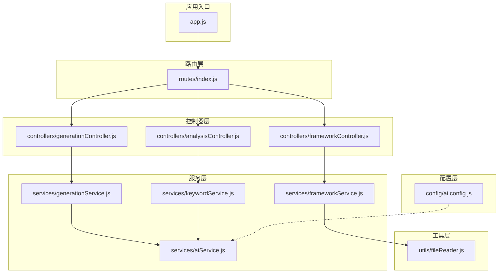
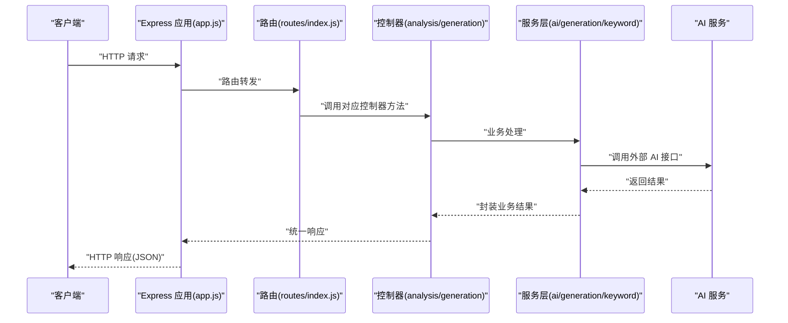
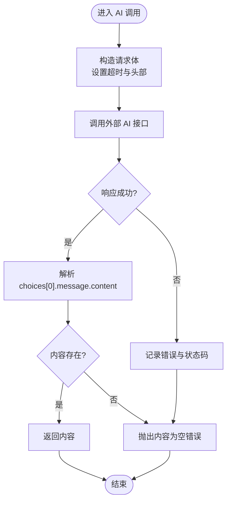
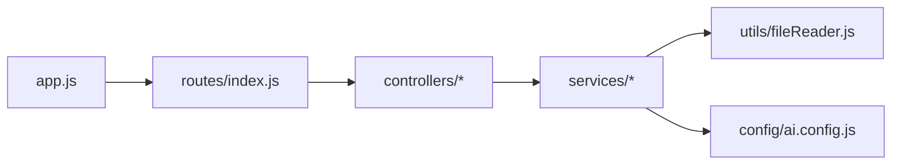

# 后端性能优化

<cite>
**本文引用的文件**
- [backend/src/app.js](file://backend/src/app.js)
- [backend/src/routes/index.js](file://backend/src/routes/index.js)
- [backend/src/controllers/frameworkController.js](file://backend/src/controllers/frameworkController.js)
- [backend/src/controllers/analysisController.js](file://backend/src/controllers/analysisController.js)
- [backend/src/controllers/generationController.js](file://backend/src/controllers/generationController.js)
- [backend/src/services/aiService.js](file://backend/src/services/aiService.js)
- [backend/src/services/generationService.js](file://backend/src/services/generationService.js)
- [backend/src/services/keywordService.js](file://backend/src/services/keywordService.js)
- [backend/src/services/frameworkService.js](file://backend/src/services/frameworkService.js)
- [backend/src/utils/fileReader.js](file://backend/src/utils/fileReader.js)
- [backend/src/config/ai.config.js](file://backend/src/config/ai.config.js)
- [backend/package.json](file://backend/package.json)
- [backend/.env.example](file://backend/.env.example)
- [docs/GUIDE.md](file://docs/GUIDE.md)
- [README.md](file://README.md)
</cite>

## 目录
1. [简介](#简介)
2. [项目结构](#项目结构)
3. [核心组件](#核心组件)
4. [架构总览](#架构总览)
5. [详细组件分析](#详细组件分析)
6. [依赖关系分析](#依赖关系分析)
7. [性能考量](#性能考量)
8. [故障排查指南](#故障排查指南)
9. [结论](#结论)
10. [附录](#附录)

## 简介
本指南面向基于 Node.js + Express 的后端系统，聚焦于 API 响应优化、中间件性能、数据库查询优化、连接池配置、并发处理策略、AI 服务调用优化、缓存策略、错误处理优化、API 限流与熔断机制，以及性能监控与日志分析方法。结合当前仓库的 Express 应用、控制器、服务层与 AI 调用实现，给出可落地的优化建议与最佳实践。

## 项目结构
后端采用典型的 MVC 结构：
- 应用入口负责初始化 Express、中间件与路由挂载
- 路由层定义 REST 接口
- 控制器层负责请求参数校验、调用服务层并返回响应
- 服务层封装业务逻辑与外部调用（含 AI 服务）
- 工具层提供文件读取等通用能力
- 配置层集中存放 AI 服务基础配置

图表来源
- [backend/src/app.js](file://backend/src/app.js#L1-L26)
- [backend/src/routes/index.js](file://backend/src/routes/index.js#L1-L21)
- [backend/src/controllers/frameworkController.js](file://backend/src/controllers/frameworkController.js#L1-L49)
- [backend/src/controllers/analysisController.js](file://backend/src/controllers/analysisController.js#L1-L37)
- [backend/src/controllers/generationController.js](file://backend/src/controllers/generationController.js#L1-L100)
- [backend/src/services/aiService.js](file://backend/src/services/aiService.js#L1-L55)
- [backend/src/services/generationService.js](file://backend/src/services/generationService.js#L1-L194)
- [backend/src/services/keywordService.js](file://backend/src/services/keywordService.js#L1-L85)
- [backend/src/services/frameworkService.js](file://backend/src/services/frameworkService.js#L1-L64)
- [backend/src/utils/fileReader.js](file://backend/src/utils/fileReader.js#L1-L49)
- [backend/src/config/ai.config.js](file://backend/src/config/ai.config.js#L1-L18)

章节来源
- [backend/src/app.js](file://backend/src/app.js#L1-L26)
- [backend/src/routes/index.js](file://backend/src/routes/index.js#L1-L21)

## 核心组件
- 应用入口与中间件
  - 初始化 Express、CORS、JSON 解析、路由挂载
  - 端口与 CORS 来源从环境变量读取
- 路由层
  - 提供框架查询、关键词分析、内容生成、内容分析、图片代理等接口
- 控制器层
  - 参数校验、异常捕获、统一响应结构
- 服务层
  - AI 调用封装、内容生成与分析、关键词分析、框架匹配与描述提取
- 工具层
  - 框架文件读取与容错
- 配置层
  - AI 服务基础地址、模型、鉴权头等

章节来源
- [backend/src/app.js](file://backend/src/app.js#L1-L26)
- [backend/src/routes/index.js](file://backend/src/routes/index.js#L1-L21)
- [backend/src/controllers/frameworkController.js](file://backend/src/controllers/frameworkController.js#L1-L49)
- [backend/src/controllers/analysisController.js](file://backend/src/controllers/analysisController.js#L1-L37)
- [backend/src/controllers/generationController.js](file://backend/src/controllers/generationController.js#L1-L100)
- [backend/src/services/aiService.js](file://backend/src/services/aiService.js#L1-L55)
- [backend/src/services/generationService.js](file://backend/src/services/generationService.js#L1-L194)
- [backend/src/services/keywordService.js](file://backend/src/services/keywordService.js#L1-L85)
- [backend/src/services/frameworkService.js](file://backend/src/services/frameworkService.js#L1-L64)
- [backend/src/utils/fileReader.js](file://backend/src/utils/fileReader.js#L1-L49)
- [backend/src/config/ai.config.js](file://backend/src/config/ai.config.js#L1-L18)

## 架构总览
后端整体为纯 API 服务，未包含数据库层；AI 服务调用集中在服务层，控制器负责参数校验与响应包装。请求链路从 Express 入口经路由、控制器到服务层，最终调用外部 AI 接口。

图表来源
- [backend/src/app.js](file://backend/src/app.js#L1-L26)
- [backend/src/routes/index.js](file://backend/src/routes/index.js#L1-L21)
- [backend/src/controllers/analysisController.js](file://backend/src/controllers/analysisController.js#L1-L37)
- [backend/src/controllers/generationController.js](file://backend/src/controllers/generationController.js#L1-L100)
- [backend/src/services/aiService.js](file://backend/src/services/aiService.js#L1-L55)
- [backend/src/services/generationService.js](file://backend/src/services/generationService.js#L1-L194)
- [backend/src/services/keywordService.js](file://backend/src/services/keywordService.js#L1-L85)

## 详细组件分析

### Express 应用与中间件配置
- 初始化与中间件
  - CORS：允许指定来源访问，默认从环境变量读取
  - JSON 解析：解析请求体
  - 路由挂载：统一前缀 /api
- 性能优化建议
  - 启用 gzip 压缩中间件减少响应体积
  - 使用 helmet 提升安全头部
  - 使用 morgan 或 pino-http 记录访问日志
  - 对静态资源启用缓存与压缩（若后续引入）

章节来源
- [backend/src/app.js](file://backend/src/app.js#L1-L26)
- [backend/.env.example](file://backend/.env.example#L1-L3)

### 路由层
- 接口清单
  - GET /api/frameworks：获取框架列表
  - GET /api/frameworks/:name：按名称获取框架
  - POST /api/analyze：关键词分析
  - POST /api/generate：内容生成
  - POST /api/generate/analysis：内容分析
  - GET /api/proxy-image：图片代理（解决跨域下载）
- 性能优化建议
  - 为高频接口设置缓存头（如框架列表）
  - 对图片代理接口限制 URL 白名单与大小上限
  - 对批量接口启用分页与条数限制

章节来源
- [backend/src/routes/index.js](file://backend/src/routes/index.js#L1-L21)

### 控制器层
- 关键点
  - 参数校验：关键词、内容、框架 ID 等必填项检查
  - 异常捕获：统一 500 错误响应
  - 统一响应结构：success/data/error 字段
- 性能优化建议
  - 对入参进行轻量校验（避免昂贵计算）
  - 对外部调用超时与重试策略进行控制
  - 对大响应体启用流式输出（如图片代理）

章节来源
- [backend/src/controllers/frameworkController.js](file://backend/src/controllers/frameworkController.js#L1-L49)
- [backend/src/controllers/analysisController.js](file://backend/src/controllers/analysisController.js#L1-L37)
- [backend/src/controllers/generationController.js](file://backend/src/controllers/generationController.js#L1-L100)

### 服务层与 AI 调用
- AI 服务封装
  - 固定基础地址、模型与鉴权头
  - 超时设置与错误日志记录
- 内容生成与分析
  - 使用提示词模板与 JSON 输出约束
  - 对 AI 返回非 JSON 的降级处理
- 框架匹配与描述提取
  - 从本地 Markdown 文件读取并解析描述
- 性能优化建议
  - 将提示词模板与默认值缓存
  - 对 AI 调用增加超时与重试、熔断与隔离
  - 对频繁调用的结果进行缓存（如框架列表）

图表来源
- [backend/src/services/aiService.js](file://backend/src/services/aiService.js#L1-L55)

章节来源
- [backend/src/services/aiService.js](file://backend/src/services/aiService.js#L1-L55)
- [backend/src/services/generationService.js](file://backend/src/services/generationService.js#L1-L194)
- [backend/src/services/keywordService.js](file://backend/src/services/keywordService.js#L1-L85)
- [backend/src/services/frameworkService.js](file://backend/src/services/frameworkService.js#L1-L64)
- [backend/src/utils/fileReader.js](file://backend/src/utils/fileReader.js#L1-L49)
- [backend/src/config/ai.config.js](file://backend/src/config/ai.config.js#L1-L18)

### 图片代理与流式传输
- 功能：解决前端下载跨域问题，将远端图片以流方式转发
- 性能要点：设置响应头、超时控制、流式 pipe
- 优化建议：限制 URL 白名单、限制最大响应大小、增加速率限制

章节来源
- [backend/src/controllers/generationController.js](file://backend/src/controllers/generationController.js#L66-L94)

## 依赖关系分析
- Express 应用依赖路由、控制器与服务层
- 控制器依赖服务层
- 服务层依赖 AI 服务与工具层
- 配置层为服务层提供外部调用参数

图表来源
- [backend/src/app.js](file://backend/src/app.js#L1-L26)
- [backend/src/routes/index.js](file://backend/src/routes/index.js#L1-L21)
- [backend/src/controllers/frameworkController.js](file://backend/src/controllers/frameworkController.js#L1-L49)
- [backend/src/controllers/analysisController.js](file://backend/src/controllers/analysisController.js#L1-L37)
- [backend/src/controllers/generationController.js](file://backend/src/controllers/generationController.js#L1-L100)
- [backend/src/services/aiService.js](file://backend/src/services/aiService.js#L1-L55)
- [backend/src/services/generationService.js](file://backend/src/services/generationService.js#L1-L194)
- [backend/src/services/keywordService.js](file://backend/src/services/keywordService.js#L1-L85)
- [backend/src/services/frameworkService.js](file://backend/src/services/frameworkService.js#L1-L64)
- [backend/src/utils/fileReader.js](file://backend/src/utils/fileReader.js#L1-L49)
- [backend/src/config/ai.config.js](file://backend/src/config/ai.config.js#L1-L18)

章节来源
- [backend/package.json](file://backend/package.json#L1-L17)

## 性能考量

### API 响应优化
- 统一响应结构：success/data/error，便于前端与监控系统解析
- 响应体精简：仅返回必要字段，避免冗余数据
- 流式输出：图片代理使用流式传输，减少内存占用
- 缓存策略：对只读且稳定的接口（如框架列表）设置强缓存与协商缓存

章节来源
- [backend/src/controllers/frameworkController.js](file://backend/src/controllers/frameworkController.js#L1-L49)
- [backend/src/controllers/analysisController.js](file://backend/src/controllers/analysisController.js#L1-L37)
- [backend/src/controllers/generationController.js](file://backend/src/controllers/generationController.js#L66-L94)

### 中间件性能优化
- 启用 gzip 压缩中间件，减少网络传输体积
- 使用 helmet 设置安全头部，减少潜在攻击面
- 使用 morgan 或 pino-http 记录访问日志，避免阻塞主线程
- 限制请求体大小，防止 OOM

章节来源
- [backend/src/app.js](file://backend/src/app.js#L1-L26)

### 数据库查询优化
- 当前项目未包含数据库层，无需数据库查询优化
- 若未来引入数据库，建议：
  - 使用连接池（如 pg-pool/mysql2/pool）并合理配置最大连接数
  - 为高频查询建立索引，避免全表扫描
  - 使用分页与 LIMIT 限制结果集
  - 对复杂查询进行拆分与缓存

[本节为通用指导，不直接分析具体文件]

### 并发处理策略
- 控制器层已使用 try/catch 捕获异常，避免未处理异常导致进程崩溃
- 对外部 AI 调用设置超时与重试，避免阻塞请求队列
- 对图片代理接口限制并发与超时，防止资源耗尽

章节来源
- [backend/src/controllers/analysisController.js](file://backend/src/controllers/analysisController.js#L1-L37)
- [backend/src/controllers/generationController.js](file://backend/src/controllers/generationController.js#L66-L94)
- [backend/src/services/aiService.js](file://backend/src/services/aiService.js#L1-L55)

### AI 服务调用优化
- 超时与重试：为 AI 调用设置合理超时与指数退避重试
- 熔断：当错误率过高时快速失败，保护下游系统
- 隔离：将 AI 调用置于独立线程池或进程池
- 缓存：对热点提示词与结果进行缓存
- 降级：AI 失败时返回默认内容或兜底策略

章节来源
- [backend/src/services/aiService.js](file://backend/src/services/aiService.js#L1-L55)
- [backend/src/services/generationService.js](file://backend/src/services/generationService.js#L64-L94)
- [backend/src/services/keywordService.js](file://backend/src/services/keywordService.js#L39-L67)

### 缓存策略实现
- 内存缓存：对框架列表与常用提示词进行 LRU 缓存
- 分布式缓存：Redis 存储热点数据与会话
- 响应缓存：对只读接口设置 ETag/Last-Modified 协商缓存
- CDN：静态资源与图片代理走 CDN

章节来源
- [backend/src/services/frameworkService.js](file://backend/src/services/frameworkService.js#L1-L64)
- [backend/src/services/generationService.js](file://backend/src/services/generationService.js#L1-L194)

### 错误处理优化
- 控制器层统一捕获异常并返回标准错误结构
- 服务层对 AI 返回非 JSON 进行降级处理
- 记录错误日志并包含上下文信息（请求 ID、参数等）

章节来源
- [backend/src/controllers/frameworkController.js](file://backend/src/controllers/frameworkController.js#L1-L49)
- [backend/src/controllers/analysisController.js](file://backend/src/controllers/analysisController.js#L1-L37)
- [backend/src/controllers/generationController.js](file://backend/src/controllers/generationController.js#L1-L100)
- [backend/src/services/generationService.js](file://backend/src/services/generationService.js#L90-L94)

### API 限流与熔断机制
- 限流：基于令牌桶/滑动窗口实现请求速率限制，保护 AI 与内部服务
- 熔断：当错误率超过阈值（如 50%）时，短时间内拒绝请求，快速失败
- 隔离：将 AI 调用置于独立线程池，避免影响其他接口
- 降级：熔断期间返回缓存数据或默认响应

章节来源
- [backend/src/services/aiService.js](file://backend/src/services/aiService.js#L1-L55)
- [backend/src/services/generationService.js](file://backend/src/services/generationService.js#L64-L94)

### 性能监控指标与日志分析
- 指标
  - QPS、P95/P99 延迟、错误率、AI 调用成功率与延迟
  - 连接池使用率、队列长度
- 日志
  - 访问日志：请求路径、方法、状态码、耗时
  - 错误日志：堆栈、上下文、请求 ID
  - AI 调用日志：入参摘要、响应时间、错误码
- 工具
  - Prometheus + Grafana 监控
  - OpenTelemetry 分布式追踪
  - ELK/EFK 日志聚合

章节来源
- [backend/src/app.js](file://backend/src/app.js#L1-L26)
- [backend/src/services/aiService.js](file://backend/src/services/aiService.js#L1-L55)

## 故障排查指南
- 常见问题
  - CORS 跨域：确认 CORS 来源与预检请求
  - 请求体过大：调整 body-parser 限制或前端分块上传
  - AI 调用超时：检查超时配置与网络连通性
  - 图片代理失败：检查 URL 白名单与远端服务状态
- 排查步骤
  - 查看访问日志定位慢请求
  - 检查 AI 服务返回状态与错误信息
  - 使用压测工具（如 wrk/ab）验证瓶颈
  - 分析 GC 与内存占用，避免内存泄漏

章节来源
- [backend/src/app.js](file://backend/src/app.js#L1-L26)
- [backend/src/controllers/generationController.js](file://backend/src/controllers/generationController.js#L66-L94)
- [backend/src/services/aiService.js](file://backend/src/services/aiService.js#L1-L55)

## 结论
本项目为纯 API 服务，重点在于优化控制器与服务层的响应速度、外部 AI 调用的稳定性与可靠性。建议优先实施 gzip 压缩、统一响应结构、AI 调用超时与熔断、缓存与降级策略，并配合完善的监控与日志体系，持续迭代性能表现。

## 附录
- 环境变量
  - PORT：服务监听端口
  - CORS_ORIGIN：允许的前端来源
- 依赖
  - express、cors、dotenv、axios

章节来源
- [backend/.env.example](file://backend/.env.example#L1-L3)
- [backend/package.json](file://backend/package.json#L1-L17)
- [README.md](file://README.md#L71-L76)
- [docs/GUIDE.md](file://docs/GUIDE.md#L441-L450)