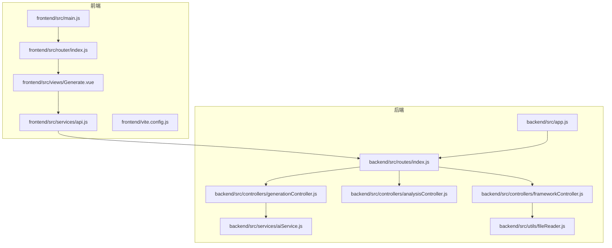
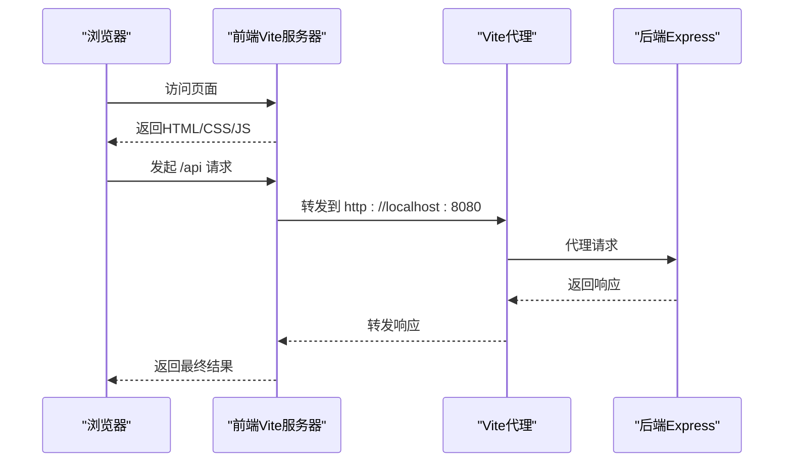
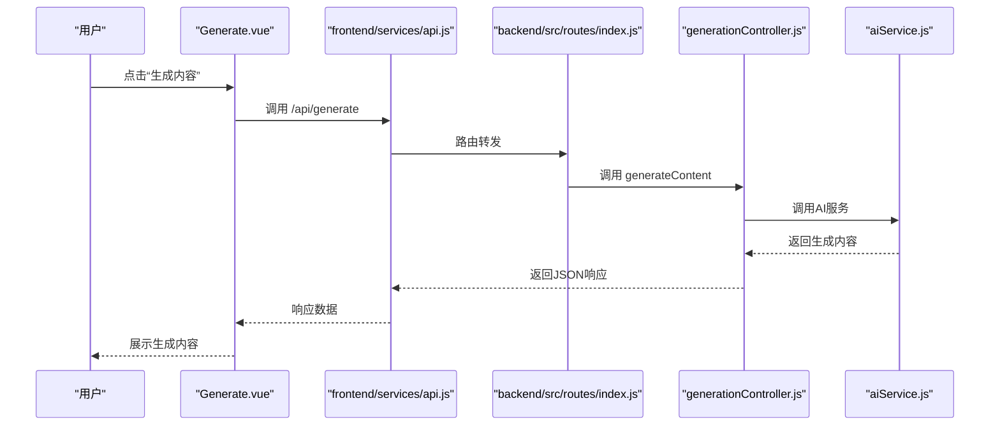
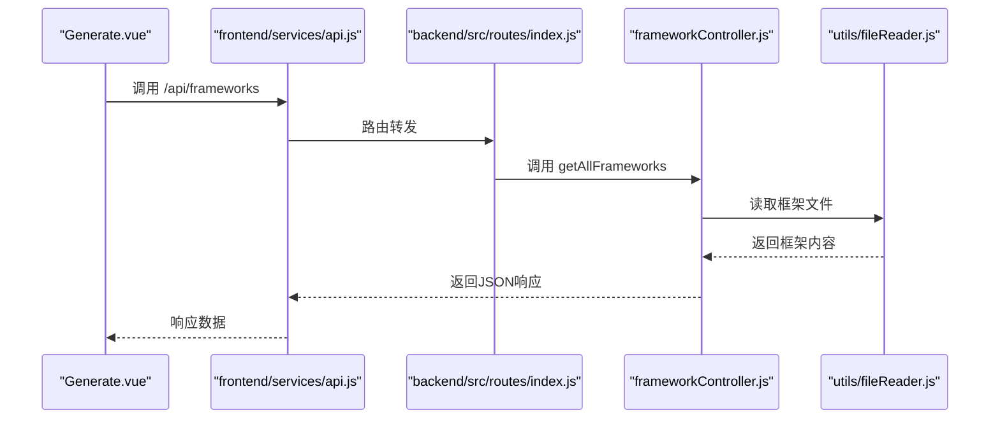
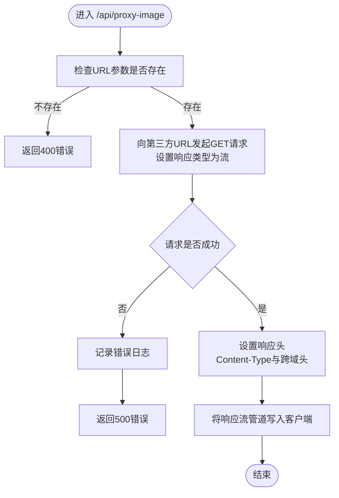
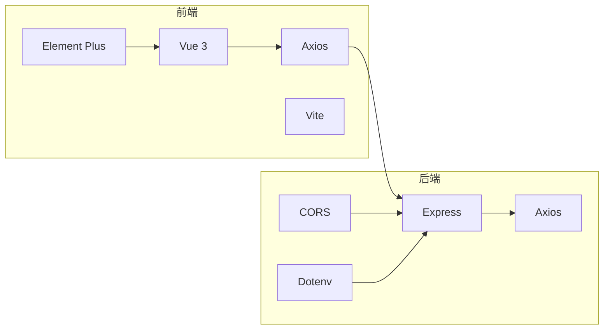

# 性能优化指南

<cite>
**本文档引用的文件**
- [vite.config.js](file://frontend/vite.config.js)
- [package.json](file://frontend/package.json)
- [main.js](file://frontend/src/main.js)
- [router/index.js](file://frontend/src/router/index.js)
- [services/api.js](file://frontend/src/services/api.js)
- [views/Generate.vue](file://frontend/src/views/Generate.vue)
- [app.js](file://backend/src/app.js)
- [routes/index.js](file://backend/src/routes/index.js)
- [controllers/generationController.js](file://backend/src/controllers/generationController.js)
- [controllers/analysisController.js](file://backend/src/controllers/analysisController.js)
- [controllers/frameworkController.js](file://backend/src/controllers/frameworkController.js)
- [services/aiService.js](file://backend/src/services/aiService.js)
- [utils/fileReader.js](file://backend/src/utils/fileReader.js)
- [package.json](file://backend/package.json)
</cite>

## 目录
1. [引言](#引言)
2. [项目结构](#项目结构)
3. [核心组件](#核心组件)
4. [架构概览](#架构概览)
5. [详细组件分析](#详细组件分析)
6. [依赖分析](#依赖分析)
7. [性能考虑](#性能考虑)
8. [故障排除指南](#故障排除指南)
9. [结论](#结论)
10. [附录](#附录)

## 引言
本指南面向小红书文案生成工具项目，提供系统性的性能优化策略，覆盖前端与后端两大层面。前端优化重点包括：代码分割、懒加载、图片优化（WebP格式、懒加载）、缓存策略、构建优化（Vite配置）、内存管理；后端优化涵盖：数据库查询优化、API响应优化、中间件优化、并发处理、资源管理。同时提供性能监控方法与工具使用建议，包括性能指标收集、瓶颈分析与优化效果评估，并补充移动端性能优化与用户体验优化建议。

## 项目结构
该项目采用前后端分离架构，前端基于 Vue 3 + Vite，后端基于 Express，通过代理实现开发环境下的跨域通信。前端负责用户交互与内容展示，后端提供内容框架、关键词分析与内容生成等服务。

**图表来源**
- [main.js](file://frontend/src/main.js#L1-L15)
- [router/index.js](file://frontend/src/router/index.js#L1-L26)
- [services/api.js](file://frontend/src/services/api.js#L1-L40)
- [views/Generate.vue](file://frontend/src/views/Generate.vue#L1-L189)
- [app.js](file://backend/src/app.js#L1-L26)
- [routes/index.js](file://backend/src/routes/index.js#L1-L21)
- [controllers/generationController.js](file://backend/src/controllers/generationController.js#L1-L100)
- [controllers/analysisController.js](file://backend/src/controllers/analysisController.js#L1-L37)
- [controllers/frameworkController.js](file://backend/src/controllers/frameworkController.js#L1-L49)
- [services/aiService.js](file://backend/src/services/aiService.js#L1-L55)
- [utils/fileReader.js](file://backend/src/utils/fileReader.js#L1-L49)

**章节来源**
- [main.js](file://frontend/src/main.js#L1-L15)
- [router/index.js](file://frontend/src/router/index.js#L1-L26)
- [services/api.js](file://frontend/src/services/api.js#L1-L40)
- [views/Generate.vue](file://frontend/src/views/Generate.vue#L1-L189)
- [app.js](file://backend/src/app.js#L1-L26)
- [routes/index.js](file://backend/src/routes/index.js#L1-L21)

## 核心组件
- 前端应用入口与路由：应用在入口文件初始化并挂载，路由定义了主要页面路径，视图组件负责业务逻辑与UI渲染。
- 前端API层：封装Axios实例，统一设置基础URL与超时时间，提供框架、分析与生成接口。
- 后端应用与路由：Express应用启用CORS与JSON解析，路由集中暴露内容框架、关键词分析与内容生成等接口。
- 控制器层：分别处理框架列表、单个框架查询、关键词分析、内容生成与图片代理。
- 服务层：包含AI服务调用与本地框架文件读取工具。

**章节来源**
- [main.js](file://frontend/src/main.js#L1-L15)
- [router/index.js](file://frontend/src/router/index.js#L1-L26)
- [services/api.js](file://frontend/src/services/api.js#L1-L40)
- [app.js](file://backend/src/app.js#L1-L26)
- [routes/index.js](file://backend/src/routes/index.js#L1-L21)
- [controllers/generationController.js](file://backend/src/controllers/generationController.js#L1-L100)
- [controllers/analysisController.js](file://backend/src/controllers/analysisController.js#L1-L37)
- [controllers/frameworkController.js](file://backend/src/controllers/frameworkController.js#L1-L49)
- [services/aiService.js](file://backend/src/services/aiService.js#L1-L55)
- [utils/fileReader.js](file://backend/src/utils/fileReader.js#L1-L49)

## 架构概览
前端通过Vite开发服务器运行，后端Express提供REST API。开发环境下，前端Vite服务器通过代理将/api前缀请求转发至后端端口，实现跨域访问。

**图表来源**
- [vite.config.js](file://frontend/vite.config.js#L1-L19)
- [app.js](file://backend/src/app.js#L1-L26)
- [services/api.js](file://frontend/src/services/api.js#L1-L40)

**章节来源**
- [vite.config.js](file://frontend/vite.config.js#L1-L19)
- [app.js](file://backend/src/app.js#L1-L26)
- [services/api.js](file://frontend/src/services/api.js#L1-L40)

## 详细组件分析

### 前端性能优化要点
- 代码分割与懒加载
  - 使用Vue Router的异步组件实现按需加载，减少初始包体积。
  - 在路由中仅注册必要页面组件，避免一次性加载所有视图。
- 图片优化
  - 对于静态图片，优先使用WebP格式以降低体积；对于动态或第三方图片，可结合后端代理进行缓存与压缩。
  - 实施图片懒加载策略，延迟非首屏图片的加载。
- 缓存策略
  - 利用浏览器缓存与HTTP缓存头控制静态资源缓存周期。
  - 对于API响应，合理设置ETag/Last-Modified以减少重复请求。
- 构建优化（Vite）
  - 配置合适的打包目标与插件，启用生产模式压缩与Tree Shaking。
  - 通过别名与路径映射减少模块解析开销。
- 内存管理
  - 及时清理事件监听器与定时器，避免闭包持有不必要的DOM引用。
  - 大列表渲染时采用虚拟滚动，减少DOM节点数量。

**章节来源**
- [router/index.js](file://frontend/src/router/index.js#L1-L26)
- [views/Generate.vue](file://frontend/src/views/Generate.vue#L1-L189)
- [services/api.js](file://frontend/src/services/api.js#L1-L40)

### 后端性能优化要点
- 数据库查询优化
  - 当前项目未直接使用数据库，但若后续接入数据库，应确保索引设计合理、避免N+1查询、使用连接池与查询缓存。
- API响应优化
  - 控制器层对必填参数进行校验，及时返回错误信息，避免无效计算。
  - 合理设置超时时间与并发限制，防止慢查询拖垮服务。
- 中间件优化
  - CORS与JSON解析已在应用层启用，建议根据部署环境调整允许源与预检缓存。
- 并发处理
  - 对外部AI服务调用设置合理的超时与重试策略，避免阻塞线程。
- 资源管理
  - 文件读取采用同步方式，建议改为异步读取并增加缓存，减少I/O等待。

**章节来源**
- [controllers/generationController.js](file://backend/src/controllers/generationController.js#L1-L100)
- [controllers/analysisController.js](file://backend/src/controllers/analysisController.js#L1-L37)
- [controllers/frameworkController.js](file://backend/src/controllers/frameworkController.js#L1-L49)
- [services/aiService.js](file://backend/src/services/aiService.js#L1-L55)
- [utils/fileReader.js](file://backend/src/utils/fileReader.js#L1-L49)

### 关键流程序列图

#### 内容生成流程

**图表来源**
- [views/Generate.vue](file://frontend/src/views/Generate.vue#L88-L116)
- [services/api.js](file://frontend/src/services/api.js#L28-L35)
- [routes/index.js](file://backend/src/routes/index.js#L14-L15)
- [controllers/generationController.js](file://backend/src/controllers/generationController.js#L10-L33)
- [services/aiService.js](file://backend/src/services/aiService.js#L14-L53)

#### 框架列表获取流程

**图表来源**
- [views/Generate.vue](file://frontend/src/views/Generate.vue#L14-L18)
- [services/api.js](file://frontend/src/services/api.js#L13-L20)
- [routes/index.js](file://backend/src/routes/index.js#L11-L12)
- [controllers/frameworkController.js](file://backend/src/controllers/frameworkController.js#L8-L21)
- [utils/fileReader.js](file://backend/src/utils/fileReader.js#L9-L45)

### 复杂逻辑流程图（图片代理）

**图表来源**
- [controllers/generationController.js](file://backend/src/controllers/generationController.js#L69-L94)

## 依赖分析
- 前端依赖
  - Vue 3用于响应式与组件化；Element Plus提供UI组件；Axios用于HTTP请求；Vite作为构建工具。
- 后端依赖
  - Express提供Web框架；CORS处理跨域；Dotenv加载环境变量；Axios用于外部API调用。

**图表来源**
- [package.json](file://frontend/package.json#L1-L21)
- [package.json](file://backend/package.json#L1-L17)

**章节来源**
- [package.json](file://frontend/package.json#L1-L21)
- [package.json](file://backend/package.json#L1-L17)

## 性能考虑
- 前端性能优化
  - 代码分割：将大型组件拆分为异步组件，按需加载。
  - 懒加载：图片与非首屏组件采用懒加载策略。
  - 缓存：静态资源与API响应合理利用缓存。
  - 构建：生产构建开启压缩与Tree Shaking。
  - 内存：避免长生命周期引用，及时释放资源。
- 后端性能优化
  - 参数校验：控制器层尽早校验输入，减少无效调用。
  - 超时与重试：对外部服务调用设置超时与重试。
  - 文件读取：从同步改为异步并增加缓存。
  - 并发：限制并发数，避免雪崩效应。
- 监控与评估
  - 前端：使用浏览器开发者工具的性能面板与网络面板；集成性能监控SDK（如自定义埋点）。
  - 后端：使用日志与指标（如响应时间、错误率、并发数）；结合APM工具（如Prometheus+Grafana）。
  - 效果评估：对比优化前后的指标变化，持续迭代。

[本节为通用指导，无需特定文件引用]

## 故障排除指南
- 常见问题
  - 跨域问题：确认CORS配置与代理设置正确。
  - 接口超时：检查前端Axios超时与后端服务超时设置。
  - 图片加载失败：检查代理URL与第三方服务可用性。
- 日志与调试
  - 后端控制器捕获异常并输出详细错误信息，便于定位问题。
  - 前端在请求失败时提示用户并记录错误日志。

**章节来源**
- [controllers/generationController.js](file://backend/src/controllers/generationController.js#L90-L94)
- [services/aiService.js](file://backend/src/services/aiService.js#L45-L52)
- [services/api.js](file://frontend/src/services/api.js#L8-L11)

## 结论
本指南从架构与组件两个维度提出了系统性的性能优化策略。前端侧重于代码分割、懒加载、图片优化、缓存与构建优化，后端则聚焦于参数校验、超时与重试、文件读取优化与并发控制。配合完善的监控与评估机制，可有效提升整体性能与用户体验。

[本节为总结，无需特定文件引用]

## 附录
- 移动端优化建议
  - 采用响应式布局与触摸友好的交互设计。
  - 减少主线程阻塞，使用Web Workers处理复杂计算。
  - 优化首屏加载，优先加载关键CSS与JS。
- 用户体验优化建议
  - 显示加载状态与进度反馈，提供取消与重试机制。
  - 合理的错误提示与引导，帮助用户理解下一步操作。

[本节为通用建议，无需特定文件引用]