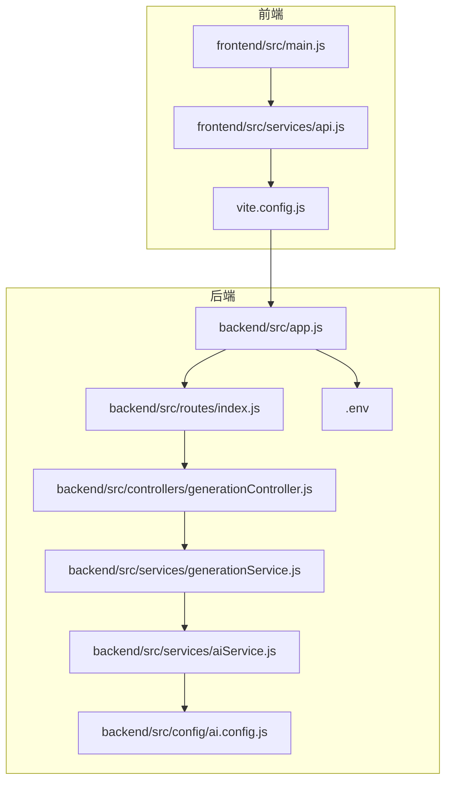
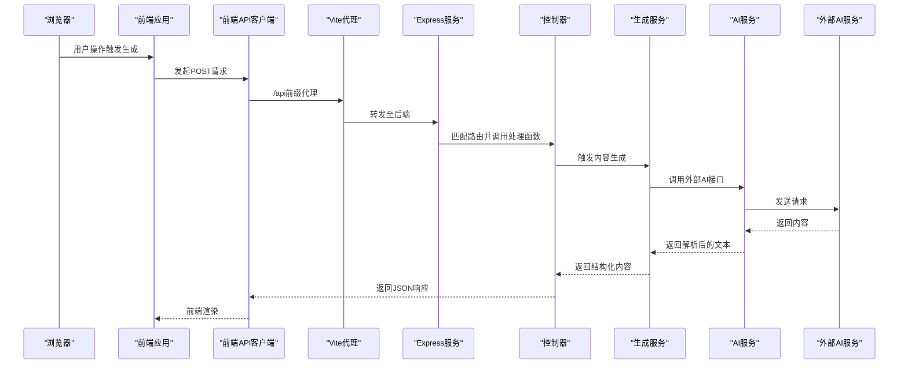
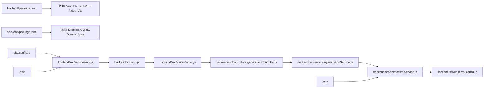

# 性能监控与指标

<cite>
**本文引用的文件**
- [README.md](file://README.md)
- [backend/src/app.js](file://backend/src/app.js)
- [backend/src/routes/index.js](file://backend/src/routes/index.js)
- [backend/src/controllers/generationController.js](file://backend/src/controllers/generationController.js)
- [backend/src/services/generationService.js](file://backend/src/services/generationService.js)
- [backend/src/services/aiService.js](file://backend/src/services/aiService.js)
- [backend/src/config/ai.config.js](file://backend/src/config/ai.config.js)
- [backend/package.json](file://backend/package.json)
- [backend/.env](file://backend/.env)
- [frontend/src/main.js](file://frontend/src/main.js)
- [frontend/src/services/api.js](file://frontend/src/services/api.js)
- [frontend/package.json](file://frontend/package.json)
- [vite.config.js](file://vite.config.js)
- [.env](file://.env)
</cite>

## 目录
1. [简介](#简介)
2. [项目结构](#项目结构)
3. [核心组件](#核心组件)
4. [架构总览](#架构总览)
5. [详细组件分析](#详细组件分析)
6. [依赖关系分析](#依赖关系分析)
7. [性能考虑](#性能考虑)
8. [故障排查指南](#故障排查指南)
9. [结论](#结论)
10. [附录](#附录)

## 简介
本指南面向小红书文案生成工具项目，系统化构建前端与后端的性能监控与指标体系。内容覆盖关键性能指标（KPI）定义、性能数据采集方法、监控工具使用、前端性能指标（FID、LCP、CLS 等）、后端响应时间与错误率统计、告警机制与趋势分析方法，并提供生产环境部署与维护策略。

## 项目结构
项目采用前后端分离架构：
- 前端：基于 Vue 3 + Vite 的单页应用，负责用户交互与内容展示。
- 后端：基于 Node.js + Express 的 REST API 服务，提供内容生成、分析与代理能力。
- 配置：通过 .env 与 Vite 代理配置实现跨域与本地联调。

图表来源
- [frontend/src/main.js](file://frontend/src/main.js#L1-L15)
- [frontend/src/services/api.js](file://frontend/src/services/api.js#L1-L40)
- [vite.config.js](file://vite.config.js#L1-L37)
- [backend/src/app.js](file://backend/src/app.js#L1-L26)
- [backend/src/routes/index.js](file://backend/src/routes/index.js#L1-L21)
- [backend/src/controllers/generationController.js](file://backend/src/controllers/generationController.js#L1-L100)
- [backend/src/services/generationService.js](file://backend/src/services/generationService.js#L1-L194)
- [backend/src/services/aiService.js](file://backend/src/services/aiService.js#L1-L55)
- [backend/src/config/ai.config.js](file://backend/src/config/ai.config.js#L1-L18)
- [backend/.env](file://backend/.env#L1-L5)

章节来源
- [README.md](file://README.md#L1-L76)
- [backend/src/app.js](file://backend/src/app.js#L1-L26)
- [frontend/src/main.js](file://frontend/src/main.js#L1-L15)
- [vite.config.js](file://vite.config.js#L1-L37)

## 核心组件
- 前端应用入口与路由初始化，负责挂载应用与路由导航。
- 前端 API 客户端封装，统一基地址与超时配置，便于后续埋点与指标采集。
- 后端应用入口，启用 CORS、JSON 解析与路由挂载。
- 后端路由与控制器，暴露内容生成、分析与图片代理接口。
- 生成服务与 AI 服务，封装提示词、调用外部大模型与降级策略。
- Vite 开发服务器与代理，实现前端到后端的本地联调。

章节来源
- [frontend/src/main.js](file://frontend/src/main.js#L1-L15)
- [frontend/src/services/api.js](file://frontend/src/services/api.js#L1-L40)
- [backend/src/app.js](file://backend/src/app.js#L1-L26)
- [backend/src/routes/index.js](file://backend/src/routes/index.js#L1-L21)
- [backend/src/controllers/generationController.js](file://backend/src/controllers/generationController.js#L1-L100)
- [backend/src/services/generationService.js](file://backend/src/services/generationService.js#L1-L194)
- [backend/src/services/aiService.js](file://backend/src/services/aiService.js#L1-L55)
- [vite.config.js](file://vite.config.js#L1-L37)

## 架构总览
下图展示从浏览器到后端服务的关键调用链路，以及与外部 AI 服务的交互。

图表来源
- [frontend/src/services/api.js](file://frontend/src/services/api.js#L1-L40)
- [vite.config.js](file://vite.config.js#L23-L28)
- [backend/src/app.js](file://backend/src/app.js#L1-L26)
- [backend/src/routes/index.js](file://backend/src/routes/index.js#L1-L21)
- [backend/src/controllers/generationController.js](file://backend/src/controllers/generationController.js#L10-L33)
- [backend/src/services/generationService.js](file://backend/src/services/generationService.js#L63-L94)
- [backend/src/services/aiService.js](file://backend/src/services/aiService.js#L14-L53)

## 详细组件分析

### 前端性能指标采集与可视化
- 关键指标建议
  - FID（首次输入延迟）：衡量用户首次交互的响应速度，关注页面可交互时间。
  - LCP（最大内容绘制）：衡量首屏主要内容的加载完成时间。
  - CLS（累积布局偏移）：衡量页面布局稳定性，避免元素位移造成误触。
  - TTFB（首字节时间）：从请求到收到第一个字节的时间。
  - 页面整体加载时间与交互可用时间。
- 采集方法
  - 使用浏览器 Web Vitals 库或 PerformanceObserver API 记录上述指标。
  - 在关键交互节点（如点击“生成”按钮）前后记录时间戳，计算请求-响应耗时。
  - 将指标上报至后端或独立监控平台，结合用户会话、页面路径、设备信息进行聚合。
- 可视化与趋势分析
  - 以小时/日维度聚合指标均值、P95/P99 分位数，观察波动与回归。
  - 结合业务场景（如高峰期/低峰期）对比不同时间段表现。
- 告警策略
  - LCP > 2.5s、CLS > 0.1、FID > 300ms、TTFB > 1s 等阈值触发告警。
  - 对异常波动设置环比/同比阈值，减少误报。

### 后端响应时间与错误率监控
- 关键指标
  - 响应时间（P50/P90/P95/P99）
  - 错误率（4xx/5xx）
  - 吞吐量（QPS）
  - AI 服务调用耗时与成功率
- 采集方法
  - 在 Express 中间件层统一记录请求开始时间、结束时间与状态码，计算耗时并分类统计。
  - 对 AI 服务调用单独埋点，记录外部接口耗时、重试次数与错误原因。
  - 统一输出 JSON 指标，供 Prometheus/Grafana 或其他监控平台消费。
- 可视化与趋势分析
  - 以路由维度、错误码维度、AI 调用维度分别展示趋势。
  - 结合环境（开发/测试/生产）与版本号进行对比分析。
- 告警策略
  - 响应时间 P95 超过阈值、错误率上升、AI 调用失败率升高触发告警。
  - 对特定路由或错误码设置专项告警。

### 图片代理与跨域性能
- 当前实现
  - 后端提供图片代理接口，解决前端直连外部图片的跨域问题；设置响应头与流式传输。
- 性能关注点
  - 代理超时控制与连接池复用。
  - 流式传输避免内存峰值，注意断流与错误处理。
  - 对频繁请求的图片缓存策略（可选）。

章节来源
- [backend/src/controllers/generationController.js](file://backend/src/controllers/generationController.js#L69-L94)

### AI 服务调用与降级策略
- 当前实现
  - 外部 AI 接口调用，设置超时与鉴权头；对空响应进行错误处理。
  - 生成服务对 AI 返回内容进行 JSON 解析，失败时回退到默认内容。
- 性能与可靠性
  - 外部调用超时与重试策略需谨慎设计，避免雪崩。
  - 降级策略保证核心功能可用，同时记录失败原因以便优化。
  - 对 AI 调用耗时与成功率进行埋点，纳入后端指标体系。

章节来源
- [backend/src/services/aiService.js](file://backend/src/services/aiService.js#L14-L53)
- [backend/src/services/generationService.js](file://backend/src/services/generationService.js#L63-L94)

### 前后端通信与代理
- 前端 API 客户端
  - 统一基地址与超时配置，便于集中埋点与错误统计。
- Vite 代理
  - 将 /api 请求转发至后端服务，支持跨域与本地联调。
- CORS 配置
  - 后端启用 CORS，限制来源与允许的方法与头，确保安全与兼容。

章节来源
- [frontend/src/services/api.js](file://frontend/src/services/api.js#L8-L11)
- [vite.config.js](file://vite.config.js#L23-L28)
- [backend/src/app.js](file://backend/src/app.js#L14-L16)
- [backend/.env](file://backend/.env#L3-L4)

## 依赖关系分析
- 前端依赖
  - Vue 3、Element Plus、Axios、Vue Router、Vite。
- 后端依赖
  - Express、CORS、Dotenv、Axios。
- 配置与环境
  - .env 与 backend/.env 提供运行参数，Vite 配置用于开发代理与跨域。

图表来源
- [frontend/package.json](file://frontend/package.json#L1-L21)
- [backend/package.json](file://backend/package.json#L1-L17)
- [frontend/src/services/api.js](file://frontend/src/services/api.js#L1-L40)
- [vite.config.js](file://vite.config.js#L1-L37)
- [backend/src/app.js](file://backend/src/app.js#L1-L26)
- [backend/src/routes/index.js](file://backend/src/routes/index.js#L1-L21)
- [backend/src/controllers/generationController.js](file://backend/src/controllers/generationController.js#L1-L100)
- [backend/src/services/generationService.js](file://backend/src/services/generationService.js#L1-L194)
- [backend/src/services/aiService.js](file://backend/src/services/aiService.js#L1-L55)
- [backend/src/config/ai.config.js](file://backend/src/config/ai.config.js#L1-L18)
- [.env](file://.env#L1-L9)
- [backend/.env](file://backend/.env#L1-L5)

章节来源
- [frontend/package.json](file://frontend/package.json#L1-L21)
- [backend/package.json](file://backend/package.json#L1-L17)
- [vite.config.js](file://vite.config.js#L1-L37)
- [backend/src/app.js](file://backend/src/app.js#L1-L26)

## 性能考虑
- 前端
  - 使用懒加载与代码分割，减少首屏体积。
  - 图片与静态资源 CDN 加速，合理设置缓存策略。
  - 避免主线程阻塞，将耗时任务放入 Web Worker 或异步队列。
- 后端
  - 合理设置超时与并发上限，防止突发流量导致雪崩。
  - 对外部 AI 服务调用增加熔断与限流策略。
  - 使用连接池与流式传输，降低内存占用。
- 监控
  - 统一埋点规范，确保指标口径一致。
  - 指标聚合与存储需考虑成本与查询效率。

## 故障排查指南
- 前端
  - 若请求超时或失败，检查前端 API 客户端超时与基地址配置。
  - 检查 Vite 代理是否正确转发到后端服务。
- 后端
  - 检查 CORS 配置与来源白名单，确认跨域请求被允许。
  - 查看控制器与服务层的错误处理与日志输出。
  - 关注 AI 服务调用失败原因与响应体。
- 通用
  - 使用中间件统一记录请求耗时与状态码，定位慢请求与错误请求。
  - 对图片代理接口，检查外部 URL 与网络连通性。

章节来源
- [frontend/src/services/api.js](file://frontend/src/services/api.js#L8-L11)
- [vite.config.js](file://vite.config.js#L23-L28)
- [backend/src/app.js](file://backend/src/app.js#L14-L16)
- [backend/src/controllers/generationController.js](file://backend/src/controllers/generationController.js#L69-L94)
- [backend/src/services/aiService.js](file://backend/src/services/aiService.js#L45-L52)

## 结论
通过在前端与后端分别建立指标采集与告警体系，结合对关键依赖（如 AI 服务）的可观测性改造，可以有效保障系统的稳定性与用户体验。建议优先落地响应时间、错误率与外部依赖耗时的监控，并逐步扩展到前端 Web Vitals 指标，形成闭环的性能治理流程。

## 附录

### 监控配置示例（概念性）
- 前端埋点
  - 在关键交互事件前后记录时间戳，上报 LCP/FID/CLS/TTFB 等指标。
  - 通过统一上报接口或第三方 SDK（如埋点平台）实现。
- 后端埋点
  - Express 中间件记录请求开始时间、结束时间、状态码、路由、IP 等。
  - 对 AI 服务调用单独埋点，记录耗时、重试次数与错误码。
- 指标导出
  - 输出 JSON 指标供 Prometheus/Grafana 或日志平台消费。
- 告警规则（示例）
  - LCP > 2.5s、CLS > 0.1、FID > 300ms、TTFB > 1s、错误率 > 1%、AI 调用失败率 > 5%。
- 趋势分析
  - 按小时/日聚合指标，对比不同版本与环境的表现，识别回归与改进点。

### 生产环境部署与维护策略
- 部署
  - 前端：构建产物部署至 CDN 或静态托管，配置缓存与压缩。
  - 后端：容器化部署，设置健康检查与自动重启；配置反向代理与 TLS。
- 运维
  - 指标与日志集中化存储与检索，定期回顾性能报告。
  - 对外部依赖（如 AI 服务）建立 SLA 与备选方案，确保降级可用。
  - 制定变更发布流程与回滚预案，配合灰度发布降低风险。