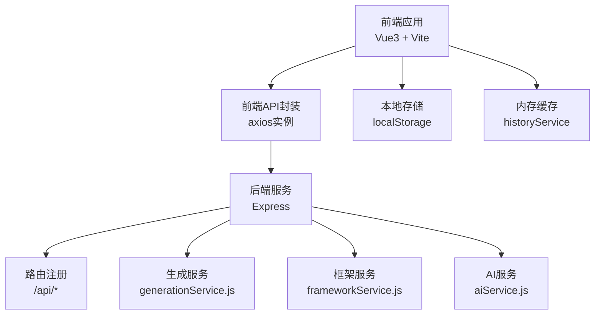
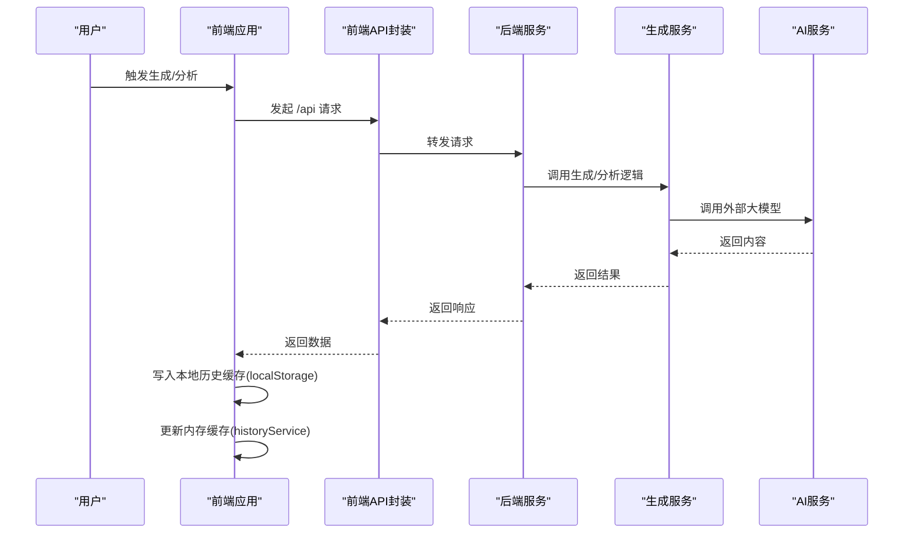
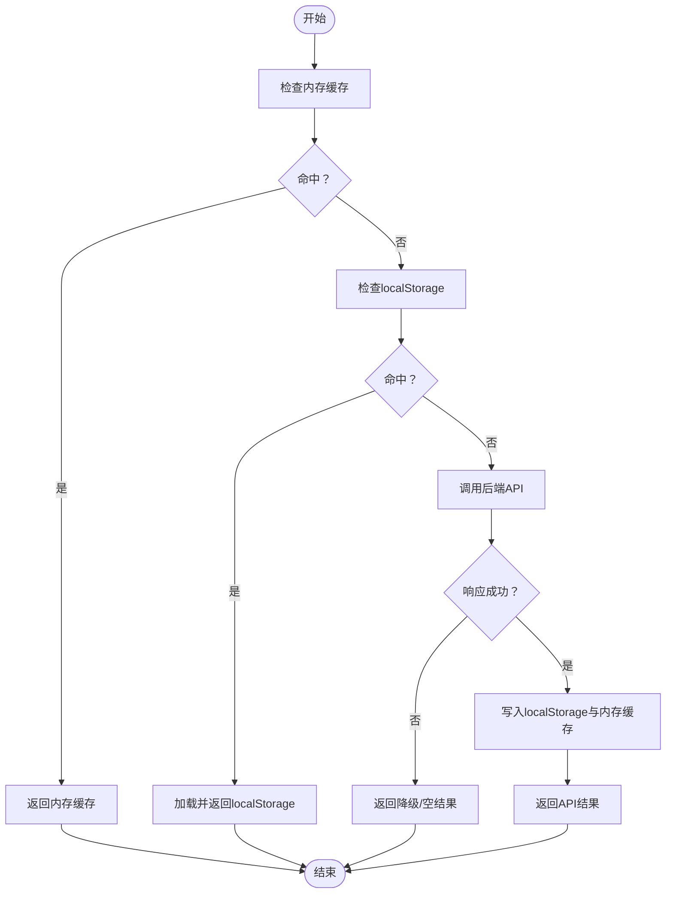
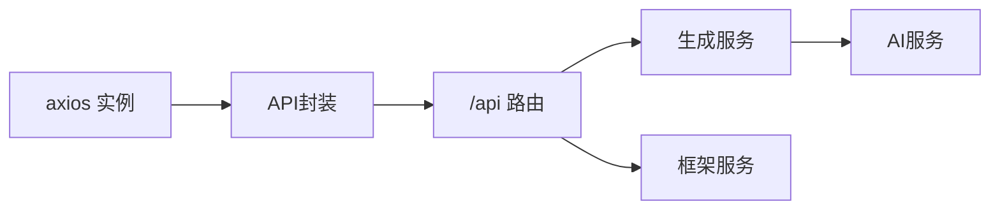

# 缓存策略优化

<cite>
**本文引用的文件**
- [frontend/src/services/api.js](file://frontend/src/services/api.js)
- [src/services/api.js](file://src/services/api.js)
- [src/services/history.js](file://src/services/history.js)
- [backend/src/services/generationService.js](file://backend/src/services/generationService.js)
- [backend/src/services/frameworkService.js](file://backend/src/services/frameworkService.js)
- [backend/src/services/aiService.js](file://backend/src/services/aiService.js)
- [backend/src/app.js](file://backend/src/app.js)
- [backend/src/routes/index.js](file://backend/src/routes/index.js)
- [src/router/index.js](file://src/router/index.js)
- [frontend/src/router/index.js](file://frontend/src/router/index.js)
</cite>

## 目录
1. [引言](#引言)
2. [项目结构](#项目结构)
3. [核心组件](#核心组件)
4. [架构总览](#架构总览)
5. [详细组件分析](#详细组件分析)
6. [依赖关系分析](#依赖关系分析)
7. [性能考虑](#性能考虑)
8. [故障排查指南](#故障排查指南)
9. [结论](#结论)
10. [附录](#附录)

## 引言
本文件聚焦于“多层缓存架构设计”的专项优化，覆盖浏览器缓存策略、API 响应缓存、内存缓存与持久化缓存，并结合当前仓库中的实现，系统阐述缓存失效策略、缓存一致性保证与缓存穿透防护。同时提供可落地的代码实现示例路径、命中率优化与性能监控方法，帮助在小红书文案生成工具中构建稳定高效的缓存体系。

## 项目结构
该项目采用前后端分离架构：
- 前端（Vite + Vue3）负责用户交互、本地历史缓存与部分业务 API 调用
- 后端（Express）提供内容生成、框架检索与 AI 调用能力
- 路由与跨域在后端集中配置，前端通过 /api 前缀访问后端接口

图表来源
- [frontend/src/services/api.js](file://frontend/src/services/api.js#L6-L11)
- [src/services/api.js](file://src/services/api.js#L6-L25)
- [backend/src/app.js](file://backend/src/app.js#L11-L24)
- [backend/src/routes/index.js](file://backend/src/routes/index.js)
- [src/services/history.js](file://src/services/history.js#L6-L88)

章节来源
- [frontend/src/services/api.js](file://frontend/src/services/api.js#L6-L11)
- [src/services/api.js](file://src/services/api.js#L6-L25)
- [backend/src/app.js](file://backend/src/app.js#L11-L24)
- [src/router/index.js](file://src/router/index.js#L6-L22)
- [frontend/src/router/index.js](file://frontend/src/router/index.js#L6-L22)

## 核心组件
- 前端 axios 实例与 API 封装：统一基础 URL、超时与请求拦截器，便于后续注入缓存层
- 本地历史缓存（localStorage）：持久化生成历史，避免重复请求与提升用户体验
- 后端生成服务：面向内容生成与分析的业务服务，具备降级与回退机制
- 后端框架服务：基于本地框架文件的检索与匹配，适合静态资源缓存
- 后端 AI 服务：对第三方大模型的调用封装，需关注超时与重试策略

章节来源
- [frontend/src/services/api.js](file://frontend/src/services/api.js#L6-L11)
- [src/services/api.js](file://src/services/api.js#L6-L25)
- [src/services/history.js](file://src/services/history.js#L6-L88)
- [backend/src/services/generationService.js](file://backend/src/services/generationService.js#L63-L94)
- [backend/src/services/frameworkService.js](file://backend/src/services/frameworkService.js#L9-L26)
- [backend/src/services/aiService.js](file://backend/src/services/aiService.js#L14-L53)

## 架构总览
下图展示了从前端到后端的关键调用链路与缓存位置：

图表来源
- [frontend/src/services/api.js](file://frontend/src/services/api.js#L13-L35)
- [src/services/api.js](file://src/services/api.js#L250-L363)
- [backend/src/services/generationService.js](file://backend/src/services/generationService.js#L63-L94)
- [backend/src/services/aiService.js](file://backend/src/services/aiService.js#L14-L53)
- [src/services/history.js](file://src/services/history.js#L14-L41)

## 详细组件分析

### 浏览器缓存策略
- 资源缓存：静态资源由 Vite 构建后交由浏览器缓存；可通过构建配置设置长缓存策略（例如对哈希文件名的资源）
- 页面缓存：Vue Router 使用 History 模式，页面级缓存可结合 keep-alive 或路由 meta 控制
- 本地存储缓存：前端已内置 localStorage 的知识库与生成历史缓存，建议为不同键空间设置 TTL 与版本号，避免陈旧数据

章节来源
- [src/services/api.js](file://src/services/api.js#L42-L85)
- [src/services/history.js](file://src/services/history.js#L6-L88)
- [src/router/index.js](file://src/router/index.js#L6-L22)
- [frontend/src/router/index.js](file://frontend/src/router/index.js#L6-L22)

### API 响应缓存
- 当前后端未实现通用响应缓存中间件；可在 Express 中间件层引入缓存逻辑（如基于查询参数与路径的键值缓存）
- 对于生成类接口，建议按“关键词 + 框架ID + 时间戳”组合键缓存，配合失效时间与最大容量淘汰策略
- 对于框架检索类接口，由于内容相对静态，可采用更强的缓存策略

章节来源
- [backend/src/app.js](file://backend/src/app.js#L11-L24)
- [backend/src/routes/index.js](file://backend/src/routes/index.js)
- [backend/src/services/frameworkService.js](file://backend/src/services/frameworkService.js#L9-L26)

### 内存缓存
- 前端 historyService 已实现内存缓存（数组头部插入、长度限制），可作为短期命中优化
- 建议扩展：为每次写入记录附加 TTL，定期清理过期项；对高频查询项建立索引以 O(1) 查找

章节来源
- [src/services/history.js](file://src/services/history.js#L6-L88)

### 持久化缓存
- localStorage：知识库与生成历史持久化，适合跨会话复用
- 建议：为每个键设置版本号与过期时间；提供批量清理与迁移策略

章节来源
- [src/services/api.js](file://src/services/api.js#L42-L85)
- [src/services/history.js](file://src/services/history.js#L6-L88)

### 缓存失效策略
- TTL 失效：为 localStorage 与内存缓存项附加过期时间，到期即剔除
- 版本失效：为缓存键加入版本号，升级时触发全量失效
- 主动失效：当用户更新知识库或删除历史时，同步清理对应缓存键

章节来源
- [src/services/api.js](file://src/services/api.js#L42-L85)
- [src/services/history.js](file://src/services/history.js#L6-L88)

### 缓存一致性保证
- 读写一致性：先写入持久化存储，再更新内存缓存，最后返回成功
- 广播一致性：在多标签页场景，监听 storage 事件进行缓存同步
- 服务端一致性：后端生成服务具备降级与回退逻辑，确保缓存未命中时仍可返回可用结果

章节来源
- [src/services/history.js](file://src/services/history.js#L14-L41)
- [backend/src/services/generationService.js](file://backend/src/services/generationService.js#L96-L112)

### 缓存穿透防护
- 白名单校验：对空结果进行短 TTL 缓存，避免频繁穿透
- 参数校验：对关键词与框架ID进行格式与范围校验，拒绝非法请求
- 限流熔断：在网关或中间件层对同一键进行 QPS 限制与快速失败

章节来源
- [backend/src/services/generationService.js](file://backend/src/services/generationService.js#L63-L94)
- [backend/src/services/aiService.js](file://backend/src/services/aiService.js#L14-L53)

### 具体实现示例（代码路径）
- localStorage 使用（知识库增删改查）
  - [知识库读取](file://src/services/api.js#L46-L52)
  - [知识库保存](file://src/services/api.js#L57-L60)
  - [知识库新增](file://src/services/api.js#L65-L74)
  - [知识库删除](file://src/services/api.js#L79-L84)
- 生成历史持久化
  - [保存历史](file://src/services/history.js#L14-L41)
  - [读取历史](file://src/services/history.js#L47-L54)
  - [按ID查询](file://src/services/history.js#L61-L64)
  - [删除历史](file://src/services/history.js#L70-L80)
  - [清空历史](file://src/services/history.js#L85-L87)
- HTTP 缓存头设置（建议）
  - 在后端中间件中为 GET 接口设置 Cache-Control 与 ETag（当前未实现）
  - 参考中间件依赖：fresh、etag（存在于依赖锁文件中）

章节来源
- [src/services/api.js](file://src/services/api.js#L42-L85)
- [src/services/history.js](file://src/services/history.js#L6-L88)
- [backend/src/app.js](file://backend/src/app.js#L11-L24)

### 处理流程图（缓存读取与写入）

图表来源
- [src/services/history.js](file://src/services/history.js#L14-L41)
- [src/services/api.js](file://src/services/api.js#L46-L52)
- [backend/src/services/generationService.js](file://backend/src/services/generationService.js#L96-L112)

## 依赖关系分析
- 前端 axios 实例与 API 封装：统一请求入口，便于注入缓存拦截器
- 后端路由与服务：/api 前缀路由集中管理，生成与框架服务解耦
- 依赖中间件：fresh、etag 等可用于实现 HTTP 缓存头（当前未启用）

图表来源
- [frontend/src/services/api.js](file://frontend/src/services/api.js#L6-L11)
- [src/services/api.js](file://src/services/api.js#L6-L25)
- [backend/src/routes/index.js](file://backend/src/routes/index.js)
- [backend/src/services/generationService.js](file://backend/src/services/generationService.js#L63-L94)
- [backend/src/services/aiService.js](file://backend/src/services/aiService.js#L14-L53)

章节来源
- [frontend/src/services/api.js](file://frontend/src/services/api.js#L6-L11)
- [src/services/api.js](file://src/services/api.js#L6-L25)
- [backend/src/routes/index.js](file://backend/src/routes/index.js)
- [backend/src/services/generationService.js](file://backend/src/services/generationService.js#L63-L94)
- [backend/src/services/aiService.js](file://backend/src/services/aiService.js#L14-L53)

## 性能考虑
- 命中率优化
  - 为高频查询（如框架列表、知识库）设置更长 TTL 与更大容量
  - 对生成类接口采用“关键词 + 框架ID + 时间戳”复合键，减少误命中
  - 使用 LRU 淘汰策略控制内存缓存大小
- 性能监控
  - 记录缓存命中/未命中次数、平均响应时间、缓存淘汰率
  - 对 AI 调用耗时与成功率进行埋点，辅助阈值调整
- 超时与重试
  - 前端与后端均设置合理超时；对非关键接口启用指数退避重试

[本节为通用指导，无需列出章节来源]

## 故障排查指南
- 本地缓存异常
  - 检查 localStorage 是否被禁用或容量不足
  - 核对键名与版本号是否一致，必要时执行清理
- 内存缓存异常
  - 确认写入顺序（先持久化再内存），避免竞态
  - 检查最大长度限制是否导致数据丢失
- 服务端调用失败
  - 查看 AI 服务返回内容是否为空，必要时触发降级逻辑
  - 核对后端 CORS 配置与路由挂载

章节来源
- [src/services/history.js](file://src/services/history.js#L14-L41)
- [backend/src/services/aiService.js](file://backend/src/services/aiService.js#L14-L53)
- [backend/src/app.js](file://backend/src/app.js#L14-L16)

## 结论
当前项目已在前端实现了 localStorage 与内存缓存的基础能力，后端具备生成与框架服务的降级回退机制。建议在现有基础上引入：
- 后端通用响应缓存中间件（基于查询参数与路径）
- 明确的 TTL 与版本失效策略
- 缓存穿透防护与限流熔断
- 缓存命中率与性能指标监控

通过以上措施，可显著提升系统的稳定性与用户体验。

## 附录
- 代码实现示例路径（仅列出路径，不展示具体代码）
  - [前端 axios 实例与 API 封装](file://frontend/src/services/api.js#L6-L11)
  - [前端知识库与历史缓存](file://src/services/api.js#L42-L85)
  - [前端历史服务](file://src/services/history.js#L6-L88)
  - [后端生成服务](file://backend/src/services/generationService.js#L63-L94)
  - [后端框架服务](file://backend/src/services/frameworkService.js#L9-L26)
  - [后端 AI 服务](file://backend/src/services/aiService.js#L14-L53)
  - [后端应用与路由](file://backend/src/app.js#L11-L24), [backend/src/routes/index.js](file://backend/src/routes/index.js)
  - [前端路由（History 模式）](file://src/router/index.js#L6-L22), [frontend/src/router/index.js](file://frontend/src/router/index.js#L6-L22)