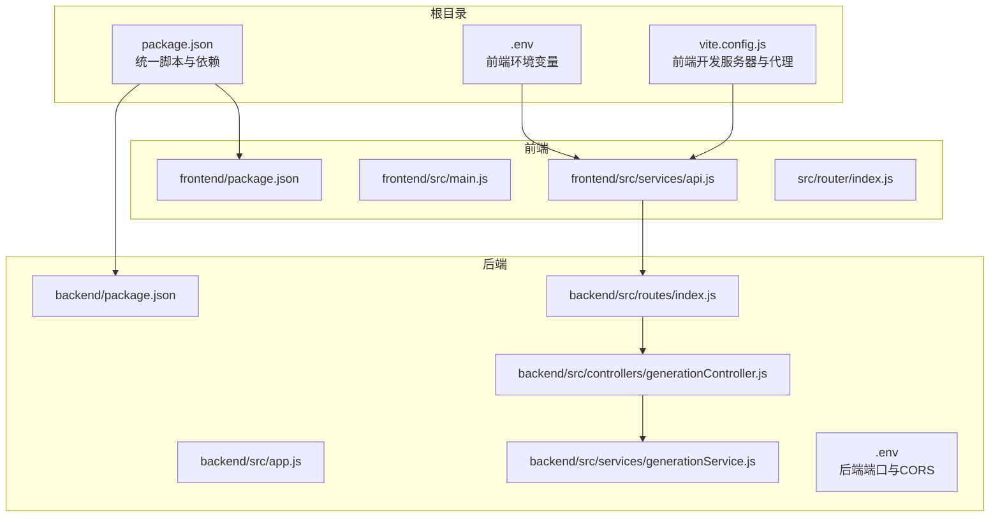
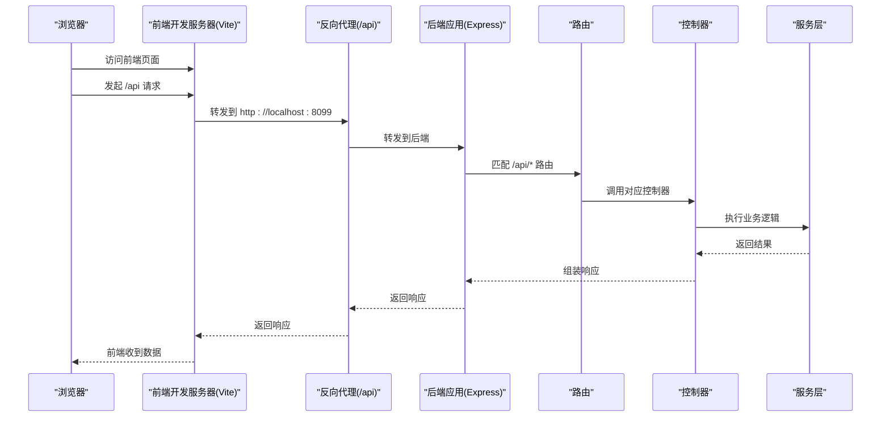
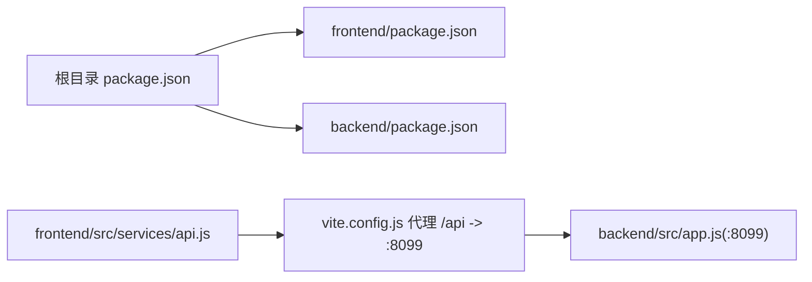

# 故障排除与FAQ

<cite>
**本文引用的文件**
- [README.md](file://README.md)
- [package.json](file://package.json)
- [vite.config.js](file://vite.config.js)
- [.env](file://.env)
- [backend/package.json](file://backend/package.json)
- [backend/.env](file://backend/.env)
- [backend/src/app.js](file://backend/src/app.js)
- [backend/src/routes/index.js](file://backend/src/routes/index.js)
- [backend/src/controllers/generationController.js](file://backend/src/controllers/generationController.js)
- [backend/src/services/generationService.js](file://backend/src/services/generationService.js)
- [frontend/package.json](file://frontend/package.json)
- [frontend/src/main.js](file://frontend/src/main.js)
- [frontend/src/services/api.js](file://frontend/src/services/api.js)
- [src/main.js](file://src/main.js)
- [src/services/api.js](file://src/services/api.js)
- [src/router/index.js](file://src/router/index.js)
</cite>

## 目录
1. [简介](#简介)
2. [项目结构](#项目结构)
3. [核心组件](#核心组件)
4. [架构总览](#架构总览)
5. [详细组件分析](#详细组件分析)
6. [依赖关系分析](#依赖关系分析)
7. [性能考虑](#性能考虑)
8. [故障排除指南](#故障排除指南)
9. [结论](#结论)
10. [附录](#附录)

## 简介
本指南面向开发与运维人员，系统化梳理本项目在环境搭建、开发调试、构建打包、部署上线等阶段的常见问题与解决方案。内容覆盖：
- 环境搭建问题：依赖安装失败、端口冲突、权限问题等
- 开发问题：组件不显示、API 调用失败、样式不生效等
- 构建问题：打包失败、资源加载错误、兼容性问题等
- 部署问题：服务器配置错误、域名解析问题、SSL 证书问题等
- 诊断方法与调试技巧：日志分析、错误追踪、性能分析
- 常见问题 FAQ：快速解决方案与预防措施

## 项目结构
项目采用前后端分离架构，根目录提供统一的安装与启动脚本，分别在根目录、前端与后端独立的配置与依赖中进行管理。

图表来源
- [package.json](file://package.json#L6-L14)
- [vite.config.js](file://vite.config.js#L11-L29)
- [frontend/src/services/api.js](file://frontend/src/services/api.js#L8-L11)
- [backend/src/routes/index.js](file://backend/src/routes/index.js#L11-L16)
- [backend/src/controllers/generationController.js](file://backend/src/controllers/generationController.js#L10-L33)
- [backend/src/services/generationService.js](file://backend/src/services/generationService.js#L63-L94)

章节来源
- [README.md](file://README.md#L13-L22)
- [package.json](file://package.json#L6-L14)
- [vite.config.js](file://vite.config.js#L11-L29)

## 核心组件
- 前端开发服务器与代理：Vite 配置提供本地开发服务器、CORS、HMR 主机与端口、以及对后端 /api 的反向代理。
- 前端 API 客户端：基于 axios 的统一客户端，baseURL 指向 /api，便于通过代理转发至后端。
- 后端应用：Express 应用，启用 CORS、JSON 解析、路由挂载，并监听端口。
- 后端路由与控制器：提供框架、分析、生成、图片代理等接口。
- 生成服务：封装 AI 生成与分析流程，包含回退策略与 JSON 结构校验。
- 环境变量：根级 .env 提供前端 AI 与图像服务的密钥与基础地址；后端 .env 提供端口与 CORS 来源。

章节来源
- [vite.config.js](file://vite.config.js#L11-L29)
- [frontend/src/services/api.js](file://frontend/src/services/api.js#L8-L11)
- [backend/src/app.js](file://backend/src/app.js#L14-L24)
- [backend/src/routes/index.js](file://backend/src/routes/index.js#L11-L16)
- [backend/src/controllers/generationController.js](file://backend/src/controllers/generationController.js#L10-L33)
- [backend/src/services/generationService.js](file://backend/src/services/generationService.js#L63-L94)
- [.env](file://.env#L1-L9)
- [backend/.env](file://backend/.env#L3-L4)

## 架构总览
前端通过 Vite 本地开发服务器提供页面与静态资源，请求以 /api 前缀经由代理转发至后端。后端路由接收请求，调用对应控制器与服务层，最终返回数据或触发外部 AI/图像服务。

图表来源
- [vite.config.js](file://vite.config.js#L23-L28)
- [backend/src/app.js](file://backend/src/app.js#L20-L24)
- [backend/src/routes/index.js](file://backend/src/routes/index.js#L11-L16)
- [backend/src/controllers/generationController.js](file://backend/src/controllers/generationController.js#L10-L33)
- [backend/src/services/generationService.js](file://backend/src/services/generationService.js#L63-L94)

## 详细组件分析

### 前端开发服务器与代理
- 主机与端口：允许外网访问主机，开发端口与 HMR 客户端端口一致，便于热更新。
- CORS：启用跨域，便于本地联调。
- 代理：将 /api 前缀请求转发至后端默认端口，避免前端跨域限制。
- 路径别名：@ 指向 src，简化导入路径。

章节来源
- [vite.config.js](file://vite.config.js#L11-L29)
- [vite.config.js](file://vite.config.js#L30-L34)

### 前端 API 客户端
- baseURL 固定为 /api，确保通过代理转发。
- 超时时间设置为 10 秒，适合前端交互。
- 与后端路由一一对应：框架列表、关键词分析、内容生成、质量分析、图片代理。

章节来源
- [frontend/src/services/api.js](file://frontend/src/services/api.js#L8-L11)
- [frontend/src/services/api.js](file://frontend/src/services/api.js#L13-L35)
- [backend/src/routes/index.js](file://backend/src/routes/index.js#L11-L16)

### 后端应用与路由
- CORS：允许来自前端开发端口的来源。
- 中间件：启用 JSON 解析。
- 路由：挂载 /api 前缀，暴露框架、分析、生成、图片代理等接口。
- 端口：默认监听后端端口，需与前端代理目标一致。

章节来源
- [backend/src/app.js](file://backend/src/app.js#L14-L24)
- [backend/src/routes/index.js](file://backend/src/routes/index.js#L11-L16)
- [backend/.env](file://backend/.env#L3-L4)

### 控制器与服务层
- 控制器：校验请求体参数，调用服务层，返回标准结构的 JSON。
- 服务层：封装 AI 生成与分析提示词，包含 JSON 解析失败的回退策略与字段补齐。

章节来源
- [backend/src/controllers/generationController.js](file://backend/src/controllers/generationController.js#L10-L33)
- [backend/src/controllers/generationController.js](file://backend/src/controllers/generationController.js#L69-L94)
- [backend/src/services/generationService.js](file://backend/src/services/generationService.js#L63-L94)
- [backend/src/services/generationService.js](file://backend/src/services/generationService.js#L114-L162)

### 环境变量与密钥
- 前端 .env：包含 AI 与图像服务的基础地址、模型、密钥等，影响前端侧 AI 与图像生成。
- 后端 .env：包含后端监听端口与 CORS 来源，需与前端代理与开发端口保持一致。

章节来源
- [.env](file://.env#L1-L9)
- [backend/.env](file://backend/.env#L3-L4)

## 依赖关系分析
- 根目录 package.json 提供统一脚本，同时安装前后端依赖。
- 前端与后端各自维护独立的依赖与脚本，减少耦合。
- 前端通过 /api 代理访问后端，代理目标与后端监听端口需一致。

图表来源
- [package.json](file://package.json#L6-L14)
- [frontend/src/services/api.js](file://frontend/src/services/api.js#L8-L11)
- [vite.config.js](file://vite.config.js#L23-L28)
- [backend/src/app.js](file://backend/src/app.js#L12-L12)

章节来源
- [package.json](file://package.json#L6-L14)
- [frontend/package.json](file://frontend/package.json#L5-L9)
- [backend/package.json](file://backend/package.json#L6-L9)

## 性能考虑
- 前端 axios 超时：10 秒，适用于交互类请求。
- AI 与图像服务 axios 超时：120 秒，考虑到生成与推理耗时较长。
- 代理与 HMR：确保开发时热更新与跨域请求顺畅。
- 服务层回退：当 AI 返回非预期格式时，提供默认内容，保证前端可用性。

章节来源
- [frontend/src/services/api.js](file://frontend/src/services/api.js#L10-L10)
- [src/services/api.js](file://src/services/api.js#L24-L24)
- [src/services/api.js](file://src/services/api.js#L36-L36)
- [backend/src/services/generationService.js](file://backend/src/services/generationService.js#L70-L94)

## 故障排除指南

### 环境搭建问题
- 依赖安装失败
  - 症状：npm/pnpm 安装报错，依赖版本冲突。
  - 排查：确认根目录与 backend 子目录均执行安装；检查网络与镜像源；优先使用项目锁文件。
  - 解决：先在根目录安装，再进入 backend 目录安装；必要时清理缓存后重试。
  - 预防：统一使用项目提供的安装脚本，避免混用包管理器。
  
  章节来源
  - [package.json](file://package.json#L13-L13)
  - [backend/package.json](file://backend/package.json#L10-L10)

- 端口冲突
  - 症状：启动失败，提示端口被占用。
  - 排查：前端开发端口与 HMR 端口、后端监听端口是否被占用。
  - 解决：修改 vite.config.js 中的 server.port 与 HMR 端口，或后端 .env 中的 PORT。
  - 预防：在团队内约定固定端口，或使用容器化隔离。

  章节来源
  - [vite.config.js](file://vite.config.js#L13-L13)
  - [vite.config.js](file://vite.config.js#L21-L21)
  - [backend/.env](file://backend/.env#L3-L3)

- 权限问题
  - 症状：无法写入 .env 或生成目录，或无法绑定低端口。
  - 排查：当前用户对项目目录的读写权限，是否以管理员权限运行。
  - 解决：修正目录权限，或以管理员身份运行终端；避免在受保护路径下操作。
  - 预防：使用非系统盘目录，避免使用 80/443 等特权端口。

### 开发问题
- 组件不显示
  - 症状：页面空白或组件未渲染。
  - 排查：检查路由配置与入口挂载；确认组件导入路径别名是否正确。
  - 解决：核对路由与入口挂载逻辑；修正 @ 别名指向；重启开发服务器。
  - 预防：统一使用相对路径或 @ 别名，避免拼写错误。

  章节来源
  - [src/router/index.js](file://src/router/index.js#L9-L15)
  - [src/main.js](file://src/main.js#L10-L13)
  - [vite.config.js](file://vite.config.js#L30-L34)

- API 调用失败
  - 症状：前端发起 /api 请求失败，控制台报跨域或 404。
  - 排查：确认代理配置是否正确；后端是否已启动；CORS 来源是否匹配。
  - 解决：检查 vite.config.js 代理目标与后端端口；核对后端 .env 中的 CORS_ORIGIN；重启前后端。
  - 预防：前后端端口与来源保持一致，避免频繁改动。

  章节来源
  - [vite.config.js](file://vite.config.js#L23-L28)
  - [backend/src/app.js](file://backend/src/app.js#L14-L16)
  - [backend/.env](file://backend/.env#L4-L4)

- 样式不生效
  - 症状：组件样式缺失或覆盖异常。
  - 排查：确认样式导入顺序；CSS 作用域与第三方库样式冲突。
  - 解决：调整样式导入顺序；使用作用域或命名空间；检查第三方库样式覆盖。
  - 预防：统一使用组件级样式与全局样式分离策略。

### 构建问题
- 打包失败
  - 症状：构建阶段报错，无法生成 dist。
  - 排查：检查依赖完整性、构建脚本与插件版本；是否存在未解析的模块。
  - 解决：重新安装依赖；升级或降级不兼容插件；修复未解析模块。
  - 预防：定期同步依赖版本；使用 lock 文件锁定版本。

- 资源加载错误
  - 症状：静态资源 404 或路径错误。
  - 排查：确认 public 目录与静态资源路径；构建产物路径映射。
  - 解决：修正静态资源引用；调整 Vite 的 base 或 publicDir 配置。
  - 预防：使用相对路径或 Vite 提供的静态资源 API。

- 兼容性问题
  - 症状：某些浏览器特性不支持导致页面异常。
  - 排查：检查 polyfill 与转译配置；目标浏览器范围。
  - 解决：添加必要 polyfill；调整构建目标；测试多浏览器。
  - 预防：在 CI 中加入多浏览器测试。

### 部署问题
- 服务器配置错误
  - 症状：页面可访问但接口 404 或跨域失败。
  - 排查：确认反向代理规则、CORS 配置、后端监听地址。
  - 解决：修正 Nginx/Apache 反代；开放 CORS；确保后端监听 0.0.0.0。
  - 预防：使用统一的部署文档与环境变量。

- 域名解析问题
  - 症状：访问域名无法解析或 HTTPS 证书无效。
  - 排查：DNS 记录、CDN 缓存、证书链与过期时间。
  - 解决：更新 DNS；刷新 CDN 缓存；续期或更换证书。
  - 预防：提前规划域名与证书，自动化续期。

- SSL 证书问题
  - 症状：Mixed Content 或证书不受信任。
  - 排查：证书链完整性、SAN 列表、协议版本。
  - 解决：安装完整链；确保 SAN 包含所有域名；升级 TLS 版本。
  - 预防：使用自动化证书管理工具。

### 诊断方法与调试技巧
- 日志分析
  - 前端：在 API 客户端与组件中打印请求与响应；利用浏览器开发者工具 Network 面板定位失败请求。
  - 后端：在控制器与服务层记录关键参数与异常堆栈；关注代理图片与 AI 调用的日志。
- 错误追踪
  - 使用 try/catch 包裹异步调用，捕获并上报错误详情；在 UI 层统一展示错误消息。
  - 对于 AI/图像服务，区分网络错误与业务错误，分别处理。
- 性能分析
  - 前端：使用 Performance 面板分析首屏与交互延迟；检查大组件渲染与重复请求。
  - 后端：统计接口耗时与错误率；对 AI/图像调用增加超时与重试策略。

### 常见问题 FAQ
- 如何一键安装与启动？
  - 使用根目录提供的安装与启动脚本，同时安装前后端依赖并启动开发服务器。
- 为什么前端请求 /api 报跨域？
  - 检查后端 CORS 来源与前端代理目标端口是否一致。
- 为什么图片无法下载或跨域？
  - 后端提供图片代理接口，前端应通过 /api/proxy-image 下载，避免浏览器跨域限制。
- 为什么 AI 生成失败？
  - 检查前端 .env 中的密钥与基础地址；确认后端代理与后端端口一致；查看服务层回退逻辑是否生效。
- 为什么样式不生效？
  - 检查样式导入顺序与第三方库覆盖；确认构建产物路径与运行时路径一致。

章节来源
- [README.md](file://README.md#L24-L56)
- [backend/src/controllers/generationController.js](file://backend/src/controllers/generationController.js#L69-L94)
- [src/services/api.js](file://src/services/api.js#L369-L410)

## 结论
本指南提供了从环境搭建到部署上线的全流程故障排除方法与最佳实践。建议在团队内统一脚本、端口与环境变量，配合完善的日志与错误处理机制，持续优化开发与运维效率。

## 附录
- 快速检查清单
  - 依赖：根目录与 backend 均已完成安装
  - 端口：前端开发端口、HMR 端口、后端端口无冲突
  - 代理：/api 代理目标与后端端口一致
  - CORS：后端 CORS 来源包含前端开发端口
  - 环境：前端 .env 与后端 .env 参数齐全且有效
  - 构建：构建脚本与插件版本兼容，静态资源路径正确